# 2025年React 18 + React 19源码深度解析

> 基于最新技术发展和官方源码的深度剖析

## 目录
- [Fiber架构核心原理](#fiber架构核心原理)
- [初始化流程源码解析](#初始化流程源码解析)
- [更新流程与调度机制](#更新流程与调度机制)
- [Diff算法深度实现](#diff算法深度实现)
- [Hooks实现原理](#hooks实现原理)
- [React 19新特性源码分析](#react-19新特性源码分析)

## Fiber架构核心原理

### Fiber节点数据结构深度解析

**实现说明：** Fiber节点是React并发架构的核心数据结构，它将组件树转换为链表结构，支持可中断的渲染。每个Fiber节点都包含了组件的完整信息，包括类型、状态、副作用标记等，并通过双缓存机制实现高效的更新。

**核心步骤：**
1. 定义节点身份信息（tag、key、type等）
2. 建立链表结构（return、child、sibling）
3. 管理Props和State数据
4. 标记副作用（flags、subtreeFlags）
5. 设置优先级调度信息（lanes）
6. 实现双缓存机制（alternate指针）

```javascript
// React源码中的Fiber节点核心结构
function FiberNode(tag, key, mode) {
  // === 节点身份信息 ===
  this.tag = tag;                    // 组件类型：FunctionComponent、ClassComponent等
  this.key = key;                    // React key，用于diff算法
  this.elementType = null;           // 元素类型，如div、span或组件
  this.type = null;                  // 具体的组件构造函数或DOM标签
  this.stateNode = null;             // 真实DOM节点或类组件实例

  // === Fiber树链表结构 ===
  this.return = null;                // 父Fiber（向上）
  this.child = null;                 // 第一个子Fiber（向下）
  this.sibling = null;               // 兄弟Fiber（同级）
  this.index = 0;                    // 在父节点children中的位置

  // === Props和State管理 ===
  this.pendingProps = null;          // 新传入的props
  this.memoizedProps = null;         // 上次渲染的props
  this.memoizedState = null;         // 上次渲染的state（对于函数组件是hooks链表）
  this.updateQueue = null;           // 更新队列（存储setState等产生的更新）

  // === 副作用标记系统 ===
  this.flags = NoFlags;              // 当前节点的副作用标记
  this.subtreeFlags = NoFlags;       // 子树的副作用标记
  this.deletions = null;             // 待删除的子节点数组

  // === 优先级调度 ===
  this.lanes = NoLanes;              // 当前节点的更新优先级
  this.childLanes = NoLanes;         // 子树的更新优先级

  // === 双缓存机制 ===
  this.alternate = null;             // 指向另一棵Fiber树的对应节点
}
```

### 双缓存机制实现原理

**实现说明：** 双缓存机制是React并发模式的核心特性，通过维护两棵Fiber树（current和workInProgress）来实现无缝切换。在渲染过程中，新的更新在workInProgress树上进行，完成后一次性切换到current树，保证了界面的一致性。

**核心步骤：**
1. 检查是否已存在workInProgress节点
2. 首次创建时初始化新节点
3. 复用时重置副作用标记
4. 建立双向引用关系（alternate）
5. 复制必要的属性数据
6. 返回WorkInProgress节点供渲染使用

```javascript
// 双缓存机制的核心：创建WorkInProgress树
function createWorkInProgress(current, pendingProps) {
  let workInProgress = current.alternate;
  
  if (workInProgress === null) {
    // === 首次创建WorkInProgress节点 ===
    workInProgress = createFiber(current.tag, pendingProps, current.key, current.mode);
    workInProgress.elementType = current.elementType;
    workInProgress.type = current.type;
    workInProgress.stateNode = current.stateNode;

    // 建立双向引用关系
    workInProgress.alternate = current;
    current.alternate = workInProgress;
  } else {
    // === 复用已存在的WorkInProgress节点 ===
    workInProgress.pendingProps = pendingProps;
    workInProgress.type = current.type;

    // 重置副作用标记（重要：避免上次渲染的副作用影响本次）
    workInProgress.flags = NoFlags;
    workInProgress.subtreeFlags = NoFlags;
    workInProgress.deletions = null;
  }

  // 复制必要的属性
  workInProgress.lanes = current.lanes;
  workInProgress.childLanes = current.childLanes;
  workInProgress.child = current.child;
  workInProgress.memoizedProps = current.memoizedProps;
  workInProgress.memoizedState = current.memoizedState;
  workInProgress.updateQueue = current.updateQueue;

  return workInProgress;
}
```

## 初始化流程源码解析

### ReactDOM.createRoot深度实现

**实现说明：** createRoot是React 18并发模式的入口函数，负责初始化React应用的根容器。它创建了FiberRoot和根Fiber节点，注册了事件监听器，并设置了并发模式的各种特性。相比于旧版本的render方法，它支持更高级的特性如时间切片和Suspense。

**核心步骤：**
1. 创建容器根节点（启用并发模式）
2. 在DOM容器上标记React根节点
3. 注册全局事件监听器（事件委托）
4. 创建FiberRoot对象和根Fiber节点
5. 建立双向引用关系
6. 初始化根节点状态和更新队列

```javascript
// React 18 createRoot的完整初始化流程
function createRoot(container, options) {
  // 1. 创建容器根节点
  const root = createContainer(
    container,
    ConcurrentRoot,              // React 18并发模式标识
    null,                        // hydration回调
    isStrictMode,               // 严格模式
    concurrentUpdatesByDefaultOverride,
    identifierPrefix,           // DevTools标识前缀
    onRecoverableError,         // 错误恢复回调
    transitionCallbacks,        // 过渡回调
  );

  // 2. 在容器上标记React根节点
  markContainerAsRoot(root.current, container);

  // 3. 注册事件监听器
  const rootContainerElement = container.nodeType === COMMENT_NODE 
    ? container.parentNode 
    : container;
  listenToAllSupportedEvents(rootContainerElement);

  return new ReactDOMRoot(root);
}

// FiberRoot创建的核心逻辑
function createFiberRoot(containerInfo, tag, hydrate) {
  // === 创建FiberRoot对象 ===
  const root = new FiberRootNode(containerInfo, tag, hydrate);
  
  // === 创建根Fiber节点（HostRoot类型）===
  const uninitializedFiber = createHostRootFiber(tag, isStrictMode);
  
  // === 建立双向引用关系 ===
  root.current = uninitializedFiber;
  uninitializedFiber.stateNode = root;

  // === 初始化根节点的状态和更新队列 ===
  const initialState = {
    element: null,                    // 根元素
    isDehydrated: hydrate,           // 是否服务端渲染
    cache: null,                     // React 18 Cache API
    transitions: null,               // React 18 Transitions
    pendingSuspenseBoundaries: null, // Suspense边界
  };
  uninitializedFiber.memoizedState = initialState;
  initializeUpdateQueue(uninitializedFiber);

  return root;
}
```

### 首次渲染启动机制

**实现说明：** 首次渲染启动机制定义了React应用如何从用户调用render方法开始，到真正开始渲染的全流程。它包括创建更新对象、入队更新、调度更新等关键步骤，为后续的Fiber渲染流程奠定基础。

**核心步骤：**
1. 创建更新对象（包含要渲染的元素）
2. 将更新加入根Fiber的更新队列
3. 调用scheduleUpdateOnFiber开始调度
4. 标记从根到变更节点的路径
5. 根据lane优先级决定同步或异步渲染
6. 确保根节点被正确调度

```javascript
// render方法的完整实现
ReactDOMRoot.prototype.render = function(children) {
  const root = this._internalRoot;
  
  // === 创建更新对象 ===
  const update = createUpdate(eventTime, lane);
  update.payload = {element: children};

  // === 将更新加入根Fiber的队列 ===
  const rootFiber = root.current;
  enqueueUpdate(rootFiber, update, lane);

  // === 调度更新（核心入口） ===
  scheduleUpdateOnFiber(root, rootFiber, lane, eventTime);
}

// 调度更新的核心实现
function scheduleUpdateOnFiber(root, fiber, lane, eventTime) {
  // 1. 标记从fiber到root路径上的所有节点需要更新
  markRootUpdated(root, lane, eventTime);

  // 2. 检查是否需要同步渲染
  if (lane === SyncLane && workInProgressRoot !== root) {
    // 同步模式直接渲染
    performSyncWorkOnRoot(root);
  } else {
    // 3. 异步模式：确保root被调度
    ensureRootIsScheduled(root, eventTime);
  }
}
```

## 更新流程与调度机制

### Lane模型优先级系统

**实现说明：** Lane模型是React 18引入的全新优先级系统，使用二进制位运算来表示和管理不同的更新优先级。相比于之前的ExpirationTime模型，Lane支持更精细的优先级控制和批处理操作，为并发模式提供了强大的基础。

**核心步骤：**
1. 定义各种优先级的Lane值（二进制位）
2. 实现Lane的合并操作（位或运算）
3. 实现Lane的移除操作（位与非运算）
4. 获取最高优先级的单个Lane
5. Lane到调度优先级的转换
6. 支持复杂的优先级组合和排序

```javascript
// React 18/19的Lane优先级模型
const TotalLanes = 31;

// === 各种优先级的Lane定义 ===
const NoLanes = 0b0000000000000000000000000000000;
const NoLane = 0b0000000000000000000000000000000;

// 同步优先级（最高）
const SyncLane = 0b0000000000000000000000000000001;

// 连续输入优先级（如拖拽、滚动）
const InputContinuousHydrationLane = 0b0000000000000000000000000000010;
const InputContinuousLane = 0b0000000000000000000000000000100;

// 默认优先级（用户交互）
const DefaultHydrationLane = 0b0000000000000000000000000001000;
const DefaultLane = 0b0000000000000000000000000010000;

// 过渡优先级（非紧急更新）
const TransitionHydrationLane = 0b0000000000000000000000000100000;
const TransitionLanes = 0b0000000001111111111111111000000;

// Idle优先级（最低）
const IdleLanes = 0b0110000000000000000000000000000;

// === Lane操作核心函数 ===
function mergeLanes(a, b) {
  return a | b;  // 位或运算合并优先级
}

function removeLanes(set, subset) {
  return set & ~subset;  // 移除指定优先级
}

function getHighestPriorityLane(lanes) {
  return lanes & -lanes;  // 获取最高优先级的单个lane
}

// Lane到调度优先级的转换
function lanesToEventPriority(lanes) {
  const lane = getHighestPriorityLane(lanes);
  if (lane & SyncLane) return DiscreteEventPriority;
  if (lane & InputContinuousLane) return ContinuousEventPriority;
  if (lane & DefaultLane) return DefaultEventPriority;
  return IdleEventPriority;
}
```

### 时间切片与可中断渲染

**实现说明：** 时间切片是React并发模式的核心特性，它允许React在渲染过程中主动让出控制权，防止长时间阻塞主线程。通过检查时间片（默认5ms）和用户输入事件，实现响应式的用户界面。

**核心步骤：**
1. 在并发模式下执行可中断工作循环
2. 每个工作单元后检查是否应该让出控制权
3. 计算已经耗费的时间（相对于起始时间）
4. 检查是否有更高优先级的任务或用户输入
5. 在适当时机中断渲染，让出控制权
6. 执行单个Fiber节点的工作（beginWork或completeWork）

```javascript
// 工作循环：可中断渲染的核心
function workLoopConcurrent() {
  // 当有工作要做且不应该让出控制权时继续工作
  while (workInProgress !== null && !shouldYieldToHost()) {
    performUnitOfWork(workInProgress);
  }
}

// 判断是否应该让出控制权
function shouldYieldToHost() {
  const timeElapsed = getCurrentTime() - startTime;
  
  // 时间片用完（默认5ms）
  if (timeElapsed < yieldInterval) {
    return false;
  }

  // 检查是否有更高优先级的任务或用户输入
  if (enableIsInputPending && (needsPaint || scheduling.isInputPending())) {
    return true;
  }

  return timeElapsed >= yieldInterval;
}

// 执行单个工作单元
function performUnitOfWork(unitOfWork) {
  const current = unitOfWork.alternate;
  
  // === Render阶段：构建新的Fiber树 ===
  let next;
  if (enableProfilerTimer && (unitOfWork.mode & ProfileMode) !== NoMode) {
    startProfilerTimer(unitOfWork);
    next = beginWork(current, unitOfWork, subtreeRenderLanes);
    stopProfilerTimer(unitOfWork);
  } else {
    next = beginWork(current, unitOfWork, subtreeRenderLanes);
  }

  unitOfWork.memoizedProps = unitOfWork.pendingProps;
  
  if (next === null) {
    // 没有子节点，完成当前工作单元
    completeUnitOfWork(unitOfWork);
  } else {
    // 有子节点，继续处理子节点
    workInProgress = next;
  }

  ReactCurrentOwner.current = null;
}
```

## Diff算法深度实现

### 协调过程的核心算法

**实现说明：** 协调过程是React Diff算法的核心，负责将新的React元素树与旧的Fiber树进行比较，找出差异并生成相应的更新操作。它是React高效渲染的关键，通过智能的节点复用和优化的比较策略，最大限度地减少DOM操作。

**核心步骤：**
1. 根据子节点类型选择不同的处理策略
2. 单个React元素的直接置换或复用
3. Portal元素的特殊处理
4. 数组子节点的复杂diff算法
5. 文本节点的简单比较
6. 删除所有不匹配的现有子节点

```javascript
// 协调子节点：React Diff算法的入口
function reconcileChildFibers(returnFiber, currentFirstChild, newChild, lanes) {
  // === 处理不同类型的子节点 ===
  
  if (typeof newChild === 'object' && newChild !== null) {
    switch (newChild.$$typeof) {
      case REACT_ELEMENT_TYPE:
        // 单个React元素
        return placeSingleChild(
          reconcileSingleElement(returnFiber, currentFirstChild, newChild, lanes)
        );
        
      case REACT_PORTAL_TYPE:
        // Portal元素
        return placeSingleChild(
          reconcileSinglePortal(returnFiber, currentFirstChild, newChild, lanes)
        );
    }

    // 数组子节点：最复杂的diff场景
    if (isArray(newChild)) {
      return reconcileChildrenArray(returnFiber, currentFirstChild, newChild, lanes);
    }
  }

  // 文本节点
  if (typeof newChild === 'string' || typeof newChild === 'number') {
    return placeSingleChild(
      reconcileSingleTextNode(returnFiber, currentFirstChild, '' + newChild, lanes)
    );
  }

  // 删除所有现有子节点
  return deleteRemainingChildren(returnFiber, currentFirstChild);
}
```
#### 数组子节点的diff算法（React最复杂的部分）

**实现说明：** 数组diff算法是React最复杂也是最核心的部分，它处理列表渲染中的增删改查场景。算法分为两轮遍历：第一轮处理公共前缀，第二轮处理位置变更。通过key匹配和位置索引的智能比较，最大化节点复用，最小化DOM操作。

**核心步骤：**
1. **第一轮遍历**：处理公共前缀，尝试复用相同位置的节点
2. **早期退出**：key不匹配时立即跳出第一轮
3. **删除标记**：没有复用的旧节点标记为删除
4. **处理剩余元素**：新children遍历完成或旧children遍历完成
5. **第二轮遍历**：使用Map快速查找，处理位置变更
6. **清理剩余**：删除Map中剩余的旧children
```javascript
function reconcileChildrenArray(returnFiber, currentFirstChild, newChildren, lanes) {
  let resultingFirstChild = null;
  let previousNewFiber = null;
  let oldFiber = currentFirstChild;
  let lastPlacedIndex = 0;
  let newIdx = 0;
  let nextOldFiber = null;

  // === 第一轮遍历：处理公共前缀 ===
  for (; oldFiber !== null && newIdx < newChildren.length; newIdx++) {
    if (oldFiber.index > newIdx) {
      nextOldFiber = oldFiber;
      oldFiber = null;
    } else {
      nextOldFiber = oldFiber.sibling;
    }

    // 尝试复用当前位置的节点
    const newFiber = updateSlot(returnFiber, oldFiber, newChildren[newIdx], lanes);
    
    if (newFiber === null) {
      // key不匹配，无法复用，跳出第一轮
      if (oldFiber === null) {
        oldFiber = nextOldFiber;
      }
      break;
    }

    if (shouldTrackSideEffects) {
      if (oldFiber && newFiber.alternate === null) {
        // 没有复用旧节点，标记删除
        deleteChild(returnFiber, oldFiber);
      }
    }

    lastPlacedIndex = placeChild(newFiber, lastPlacedIndex, newIdx);
    
    // 构建新的Fiber链表
    if (previousNewFiber === null) {
      resultingFirstChild = newFiber;
    } else {
      previousNewFiber.sibling = newFiber;
    }
    previousNewFiber = newFiber;
    oldFiber = nextOldFiber;
  }

  // === 处理剩余的新元素或旧元素 ===
  if (newIdx === newChildren.length) {
    // 新children遍历完，删除剩余旧children
    deleteRemainingChildren(returnFiber, oldFiber);
    return resultingFirstChild;
  }

  if (oldFiber === null) {
    // 旧children遍历完，创建剩余新children
    for (; newIdx < newChildren.length; newIdx++) {
      const newFiber = createChild(returnFiber, newChildren[newIdx], lanes);
      if (newFiber === null) continue;
      
      lastPlacedIndex = placeChild(newFiber, lastPlacedIndex, newIdx);
      if (previousNewFiber === null) {
        resultingFirstChild = newFiber;
      } else {
        previousNewFiber.sibling = newFiber;
      }
      previousNewFiber = newFiber;
    }
    return resultingFirstChild;
  }

  // === 第二轮遍历：处理位置变更 ===
  // 将剩余旧children放入Map，用key快速查找
  const existingChildren = mapRemainingChildren(returnFiber, oldFiber);

  for (; newIdx < newChildren.length; newIdx++) {
    const newFiber = updateFromMap(
      existingChildren, returnFiber, newIdx, newChildren[newIdx], lanes
    );

    if (newFiber !== null) {
      if (shouldTrackSideEffects) {
        if (newFiber.alternate !== null) {
          // 复用了现有节点，从Map中移除
          existingChildren.delete(newFiber.key === null ? newIdx : newFiber.key);
        }
      }

      lastPlacedIndex = placeChild(newFiber, lastPlacedIndex, newIdx);
      if (previousNewFiber === null) {
        resultingFirstChild = newFiber;
      } else {
        previousNewFiber.sibling = newFiber;
      }
      previousNewFiber = newFiber;
    }
  }

  if (shouldTrackSideEffects) {
    // 删除Map中剩余的旧children
    existingChildren.forEach(child => deleteChild(returnFiber, child));
  }

  return resultingFirstChild;
}
```

## Hooks实现原理

### Hooks数据结构与管理

**实现说明：** Hooks系统是React函数式组件的状态管理方案，通过链表结构将多个hook在单个组件中连接起来。每个Hook对象都包含了状态值、更新队列和下一个hook的引用，支持状态持久化和优先级更新。

**核心步骤：**
1. 定义Hook对象的完整数据结构
2. 存储hook的状态值和基础状态
3. 管理更新队列（基础队列和当前队列）
4. 建立链表结构（next指针）
5. 维护全局hook状态变量
6. 区分current树和workInProgress树的hook

```javascript
// Hook对象的完整数据结构
const hook = {
  memoizedState: null,     // 存储hook的状态值
  baseState: null,         // 基础状态，用于状态合并
  baseQueue: null,         // 基础更新队列
  queue: null,             // 当前更新队列
  next: null,              // 指向下一个hook（链表结构）
};

// 函数组件的hooks链表管理
let currentlyRenderingFiber = null;  // 当前正在渲染的函数组件Fiber
let currentHook = null;              // 当前处理的hook（current树）
let workInProgressHook = null;       // 当前处理的hook（workInProgress树）
```

### useState源码实现

**实现说明：** useState是最常用的React Hook，它在mount和update阶段有不同的实现逻辑。mount阶段创建新的hook节点和更新队列，update阶段则复用现有的hook并处理更新队列。通过优先级系统支持并发更新和状态合并。

**核心步骤：**
1. **Mount阶段**：创建新hook节点和更新队列
2. **初始化状态**：处理函数类型的初始值
3. **创建rq**：绑定dispatch函数（setState）
4. **Update阶段**：复用现有hook节点
5. **处理更新队列**：合并pending和base队列
6. **优先级过滤**：按照lane优先级处理更新

```javascript
// useState在mount阶段的实现
function mountState(initialState) {
  // 创建并挂载新的hook节点
  const hook = mountWorkInProgressHook();
  
  // 初始化状态
  if (typeof initialState === 'function') {
    initialState = initialState();
  }
  hook.memoizedState = hook.baseState = initialState;
  
  // 创建更新队列
  const queue = {
    pending: null,                    // 待处理的更新环形链表
    interleaved: null,               // 交错的更新
    lanes: NoLanes,                  // 更新的优先级
    dispatch: null,                  // setState函数
    lastRenderedReducer: basicStateReducer,
    lastRenderedState: initialState,
  };
  hook.queue = queue;
  
  // 创建dispatch函数（即setState）
  const dispatch = queue.dispatch = dispatchSetState.bind(
    null, currentlyRenderingFiber, queue
  );
  
  return [hook.memoizedState, dispatch];
}

// useState在update阶段的实现
function updateState(initialState) {
  return updateReducer(basicStateReducer, initialState);
}

// updateReducer：useState和useReducer的统一实现
function updateReducer(reducer, initialArg, init) {
  const hook = updateWorkInProgressHook();
  const queue = hook.queue;
  
  queue.lastRenderedReducer = reducer;

  const current = currentHook;
  let baseQueue = current.baseQueue;
  const pendingQueue = queue.pending;
  
  if (pendingQueue !== null) {
    // 合并pending队列到base队列
    if (baseQueue !== null) {
      const baseFirst = baseQueue.next;
      const pendingFirst = pendingQueue.next;
      baseQueue.next = pendingFirst;
      pendingQueue.next = baseFirst;
    }
    current.baseQueue = baseQueue = pendingQueue;
    queue.pending = null;
  }

  if (baseQueue !== null) {
    // 处理更新队列
    const first = baseQueue.next;
    let newState = current.baseState;
    let newBaseState = null;
    let newBaseQueueFirst = null;
    let newBaseQueueLast = null;
    let update = first;

    do {
      const updateLane = update.lane;
      if (!isSubsetOfLanes(renderLanes, updateLane)) {
        // 优先级不够，跳过这次更新
        const clone = {
          lane: updateLane,
          action: update.action,
          hasEagerState: update.hasEagerState,
          eagerState: update.eagerState,
          next: null,
        };
        if (newBaseQueueLast === null) {
          newBaseQueueFirst = newBaseQueueLast = clone;
          newBaseState = newState;
        } else {
          newBaseQueueLast = newBaseQueueLast.next = clone;
        }
        currentlyRenderingFiber.lanes = mergeLanes(
          currentlyRenderingFiber.lanes, updateLane
        );
      } else {
        // 优先级足够，应用更新
        if (newBaseQueueLast !== null) {
          const clone = {
            lane: NoLane,
            action: update.action,
            hasEagerState: update.hasEagerState,
            eagerState: update.eagerState,
            next: null,
          };
          newBaseQueueLast = newBaseQueueLast.next = clone;
        }

        // 计算新状态
        if (update.hasEagerState) {
          newState = update.eagerState;
        } else {
          const action = update.action;
          newState = reducer(newState, action);
        }
      }
      update = update.next;
    } while (update !== null && update !== first);

    if (newBaseQueueLast === null) {
      newBaseState = newState;
    } else {
      newBaseQueueLast.next = newBaseQueueFirst;
    }

    // 更新hook状态
    if (!Object.is(newState, hook.memoizedState)) {
      markWorkInProgressReceivedUpdate();
    }

    hook.memoizedState = newState;
    hook.baseState = newBaseState;
    hook.baseQueue = newBaseQueueLast;

    queue.lastRenderedState = newState;
  }

  const dispatch = queue.dispatch;
  return [hook.memoizedState, dispatch];
}

```
### useEffect深度实现

**实现说明：** useEffect是React中处理副作用的核心Hook，它在mount和update阶段有不同的处理逻辑。mount阶段创建新的Effect对象并标记执行，update阶段则通过浅层比较依赖项来决定是否重新执行。所有Effect通过环形链表管理，支持清理函数和依赖项优化。

**核心步骤：**
1. **Mount阶段**：创建新hook节点和Effect对象
2. **标记副作用**：在Fiber上设置相应的flags
3. **Effect链表**：将Effect对象加入环形链表
4. **Update阶段**：比较依赖项数组
5. **依赖比较**：使用Object.is进行浅层比较
6. **条件执行**：依赖变化时才标记执行

```javascript
// useEffect在mount阶段的实现
function mountEffect(create, deps) {
  return mountEffectImpl(
    PassiveEffect | PassiveStaticEffect,
    HookPassive,
    create,
    deps,
  );
}

function mountEffectImpl(fiberFlags, hookFlags, create, deps) {
  const hook = mountWorkInProgressHook();
  const nextDeps = deps === undefined ? null : deps;
  
  // 标记Fiber需要执行副作用
  currentlyRenderingFiber.flags |= fiberFlags;
  
  // 创建Effect对象并添加到链表
  hook.memoizedState = pushEffect(
    HookHasEffect | hookFlags,
    create,
    undefined,
    nextDeps,
  );
}

// useEffect在update阶段的实现
function updateEffect(create, deps) {
  return updateEffectImpl(PassiveEffect, HookPassive, create, deps);
}

function updateEffectImpl(fiberFlags, hookFlags, create, deps) {
  const hook = updateWorkInProgressHook();
  const nextDeps = deps === undefined ? null : deps;
  let destroy = undefined;

  if (currentHook !== null) {
    const prevEffect = currentHook.memoizedState;
    destroy = prevEffect.destroy;
    
    if (nextDeps !== null) {
      const prevDeps = prevEffect.deps;
      // 依赖项比较：浅层对比
      if (areHookInputsEqual(nextDeps, prevDeps)) {
        // 依赖未变化，不执行effect
        hook.memoizedState = pushEffect(hookFlags, create, destroy, nextDeps);
        return;
      }
    }
  }

  // 标记需要执行副作用
  currentlyRenderingFiber.flags |= fiberFlags;

  hook.memoizedState = pushEffect(
    HookHasEffect | hookFlags,
    create,
    destroy,
    nextDeps,
  );
}

// Effect对象创建和链表管理
function pushEffect(tag, create, destroy, deps) {
  const effect = {
    tag,
    create,
    destroy,
    deps,
    next: null,
  };
  
  let componentUpdateQueue = currentlyRenderingFiber.updateQueue;
  if (componentUpdateQueue === null) {
    // 创建新的updateQueue
    componentUpdateQueue = createFunctionComponentUpdateQueue();
    currentlyRenderingFiber.updateQueue = componentUpdateQueue;
    componentUpdateQueue.lastEffect = effect.next = effect;
  } else {
    const lastEffect = componentUpdateQueue.lastEffect;
    if (lastEffect === null) {
      componentUpdateQueue.lastEffect = effect.next = effect;
    } else {
      const firstEffect = lastEffect.next;
      lastEffect.next = effect;
      effect.next = firstEffect;
      componentUpdateQueue.lastEffect = effect;
    }
  }
  return effect;
}

// 依赖项比较函数
function areHookInputsEqual(nextDeps, prevDeps) {
  if (prevDeps === null) {
    return false;
  }

  for (let i = 0; i < prevDeps.length && i < nextDeps.length; i++) {
    if (Object.is(nextDeps[i], prevDeps[i])) {
      continue;
    }
    return false;
  }
  return true;
}
```

## 深度遍历流程（Render阶段）

### beginWork：构建阶段

**实现说明：** beginWork是Fiber树构建阶段的核心函数，负责处理单个Fiber节点的更新逻辑。它首先检查节点是否可以复用，然后根据组件类型选择相应的处理函数，最终返回子Fiber节点供继续遍历。这个过程支持优化策略和错误边界处理。

**核心步骤：**
1. **复用检查**：props和context变化检测
2. **跳过优化**：无更新时直接跳过子树
3. **清理Lanes**：重置当前节点的优先级
4. **类型分发**：根据fiber.tag选择处理函数
5. **组件渲染**：执行函数组件或类组件的render
6. **子节点协调**：调用reconcileChildren处理子节点

```javascript
// beginWork：Fiber树构建的核心函数
function beginWork(current, workInProgress, renderLanes) {
  // 检查是否可以复用现有工作
  if (current !== null) {
    const oldProps = current.memoizedProps;
    const newProps = workInProgress.pendingProps;

    if (
      oldProps !== newProps ||
      hasLegacyContextChanged() ||
      (enableLazyContextPropagation &&
        current.dependencies !== null &&
        checkIfContextChanged(current.dependencies))
    ) {
      // Props或context发生变化，需要更新
      didReceiveUpdate = true;
    } else {
      // 检查是否有子树更新
      const hasScheduledUpdateOrContext = checkScheduledUpdateOrContext(
        current,
        renderLanes,
      );
      if (
        !hasScheduledUpdateOrContext &&
        (workInProgress.flags & DidCapture) === NoFlags
      ) {
        // 没有更新，可以跳过子树
        didReceiveUpdate = false;
        return attemptToSkipBailoutWork(current, workInProgress, renderLanes);
      }
    }
  } else {
    didReceiveUpdate = false;
  }

  // 清除lanes
  workInProgress.lanes = NoLanes;

  // 根据组件类型进行不同的处理
  switch (workInProgress.tag) {
    case IndeterminateComponent: {
      // 函数组件或类组件（首次渲染时未确定）
      return mountIndeterminateComponent(
        current,
        workInProgress,
        workInProgress.type,
        renderLanes,
      );
    }
    case FunctionComponent: {
      const Component = workInProgress.type;
      const unresolvedProps = workInProgress.pendingProps;
      const resolvedProps =
        workInProgress.elementType === Component
          ? unresolvedProps
          : resolveDefaultProps(Component, unresolvedProps);
      return updateFunctionComponent(
        current,
        workInProgress,
        Component,
        resolvedProps,
        renderLanes,
      );
    }
    case ClassComponent: {
      const Component = workInProgress.type;
      const unresolvedProps = workInProgress.pendingProps;
      const resolvedProps =
        workInProgress.elementType === Component
          ? unresolvedProps
          : resolveDefaultProps(Component, unresolvedProps);
      return updateClassComponent(
        current,
        workInProgress,
        Component,
        resolvedProps,
        renderLanes,
      );
    }
    case HostRoot:
      return updateHostRoot(current, workInProgress, renderLanes);
    case HostComponent:
      return updateHostComponent(current, workInProgress, renderLanes);
    case HostText:
      return updateHostText(current, workInProgress);
    // ... 更多组件类型
  }
}

// 函数组件的更新处理
function updateFunctionComponent(
  current,
  workInProgress,
  Component,
  nextProps,
  renderLanes,
) {
  let context;
  if (!disableLegacyContext) {
    const unmaskedContext = getUnmaskedContext(workInProgress, Component, true);
    context = getMaskedContext(workInProgress, unmaskedContext);
  }

  let nextChildren;
  let hasId;
  prepareToReadContext(workInProgress, renderLanes);
  
  if (enableSchedulingProfiler) {
    markComponentRenderStarted(workInProgress);
  }
  
  // 执行函数组件，获取子元素
  ReactCurrentOwner.current = workInProgress;
  ReactCurrentDispatcher.current = HooksDispatcherOnMount;
  
  nextChildren = renderWithHooks(
    current,
    workInProgress,
    Component,
    nextProps,
    context,
    renderLanes,
  );
  hasId = checkDidRenderIdHook();
  
  if (enableSchedulingProfiler) {
    markComponentRenderStopped();
  }

  if (current !== null && !didReceiveUpdate) {
    // 复用现有的子Fiber树
    bailoutOnAlreadyFinishedWork(current, workInProgress, renderLanes);
    return workInProgress.child;
  }

  if (getIsHydrating() && hasId) {
    pushMaterializedTreeId(workInProgress);
  }

  // 协调子节点
  reconcileChildren(current, workInProgress, nextChildren, renderLanes);
  return workInProgress.child;
}
```

### completeWork：完成阶段

**实现说明：** completeWork是Fiber树完成阶段的核心函数，在beginWork完成后执行。它负责创建DOM实例、更新DOM属性、处理ref引用和冒泡副作用标记。对于不同类型的组件，它有不同的处理逻辑，特别是对DOM组件的创建和更新。

**核心步骤：**
1. **组件类型分发**：根据fiber.tag选择处理逻辑
2. **DOM实例创建**：为新节点创建真实DOM元素
3. **属性更新**：比较和更新DOM属性
4. **子节点附加**：将子DOM节点附加到父节点
5. **Ref处理**：标记ref需要更新
6. **副作用冒泡**：将子节点的flags合并到父节点

```javascript
// completeWork：Fiber树完成的核心函数
function completeWork(
  current,
  workInProgress,
  renderLanes,
) {
  const newProps = workInProgress.pendingProps;

  // 根据组件类型进行不同的处理
  switch (workInProgress.tag) {
    case IndeterminateComponent:
    case LazyComponent:
    case SimpleMemoComponent:
    case FunctionComponent:
    case ForwardRef:
    case Fragment:
    case Mode:
    case Profiler:
    case ContextConsumer:
    case MemoComponent:
      // 这些组件类型不需要特殊处理
      bubbleProperties(workInProgress);
      return null;
      
    case ClassComponent: {
      const Component = workInProgress.type;
      if (isLegacyContextProvider(Component)) {
        popLegacyContext(workInProgress);
      }
      bubbleProperties(workInProgress);
      return null;
    }
    
    case HostRoot: {
      const fiberRoot = workInProgress.stateNode;
      popHostContainer(workInProgress);
      popTopLevelLegacyContextObject(workInProgress);
      resetMutableSourceWorkInProgressVersions();
      
      if (fiberRoot.pendingContext) {
        fiberRoot.context = fiberRoot.pendingContext;
        fiberRoot.pendingContext = null;
      }
      
      if (current === null || current.child === null) {
        // 如果是服务端渲染，标记为已完成hydration
        const wasHydrated = popHydrationState(workInProgress);
        if (wasHydrated) {
          markUpdate(workInProgress);
        } else if (!fiberRoot.isDehydrated) {
          markUpdate(workInProgress);
        }
      }
      
      updateHostContainer(current, workInProgress);
      bubbleProperties(workInProgress);
      return null;
    }
    
    case HostComponent: {
      popHostContext(workInProgress);
      const rootContainerInstance = getRootHostContainer();
      const type = workInProgress.type;

      if (current !== null && workInProgress.stateNode != null) {
        // 更新现有的DOM节点
        updateHostComponent(
          current,
          workInProgress,
          type,
          newProps,
          rootContainerInstance,
        );

        if (current.ref !== workInProgress.ref) {
          markRef(workInProgress);
        }
      } else {
        // 创建新的DOM节点
        if (!newProps) {
          if (workInProgress.stateNode === null) {
            throw new Error(
              'We must have new props for new mounts. This error is likely ' +
              'caused by a bug in React. Please file an issue.',
            );
          }
          bubbleProperties(workInProgress);
          return null;
        }

        const currentHostContext = getHostContext();
        const wasHydrated = popHydrationState(workInProgress);
        
        if (wasHydrated) {
          // 服务端渲染的hydration
          if (
            prepareToHydrateHostInstance(
              workInProgress,
              rootContainerInstance,
              currentHostContext,
            )
          ) {
            markUpdate(workInProgress);
          }
        } else {
          // 创建新的DOM实例
          const instance = createInstance(
            type,
            newProps,
            rootContainerInstance,
            currentHostContext,
            workInProgress,
          );

          // 将子DOM节点添加到新创建的实例中
          appendAllChildren(instance, workInProgress, false, false);

          workInProgress.stateNode = instance;

          // 处理初始属性
          if (
            finalizeInitialChildren(
              instance,
              type,
              newProps,
              rootContainerInstance,
              currentHostContext,
            )
          ) {
            markUpdate(workInProgress);
          }
        }

        if (workInProgress.ref !== null) {
          markRef(workInProgress);
        }
      }
      
      bubbleProperties(workInProgress);
      return null;
    }
  }
}

// 冒泡属性：将子节点的flags冒泡到父节点
function bubbleProperties(workInProgress) {
  let subtreeFlags = NoFlags;
  let child = workInProgress.child;
  
  while (child !== null) {
    subtreeFlags |= child.subtreeFlags;
    subtreeFlags |= child.flags;
    child.return = workInProgress;
    child = child.sibling;
  }
  
  workInProgress.subtreeFlags |= subtreeFlags;
}
```

## 深度回归流程（Commit阶段）

### Commit阶段三个子阶段

**实现说明：** Commit阶段是React渲染流程的最后一步，负责将Render阶段构建的workInProgress树应用到真实DOM上。它分为三个子阶段：Before Mutation（DOM变更前）、Mutation（DOM变更）和Layout（DOM变更后），每个阶段都有特定的职责和执行时机。

**核心步骤：**
1. **检查副作用**：统计是否有需要处理的副作用
2. **保存上下文**：备份当前的执行上下文
3. **Before Mutation**：执行getSnapshotBeforeUpdate
4. **Mutation**：真正的DOM操作和useLayoutEffect
5. **切换Fiber树**：workInProgress树成为current树
6. **Layout**：执行componentDidMount/Update和ref

```javascript
// commitRoot：Commit阶段的入口函数
function commitRoot(root, recoverableErrors, transitions) {
  // 获取待提交的Fiber树
  const finishedWork = root.finishedWork;
  const lanes = root.finishedLanes;
  
  if (finishedWork === null) {
    return null;
  }
  
  root.finishedWork = null;
  root.finishedLanes = NoLanes;
  
  // 不能提交正在工作的树
  if (finishedWork === root.current) {
    throw new Error(
      'Cannot commit the same tree as before. This error is likely ' +
      'caused by a bug in React. Please file an issue.',
    );
  }

  root.callbackNode = null;
  root.callbackPriority = NoLane;
  
  // 检查是否有被动效果需要调度
  const remainingLanes = mergeLanes(finishedWork.lanes, finishedWork.childLanes);
  markRootFinished(root, remainingLanes);

  // 清除已完成的离散更新
  if (rootsWithPendingDiscreteUpdates !== null) {
    if (!hasDiscreteLanes(remainingLanes) && rootsWithPendingDiscreteUpdates.has(root)) {
      rootsWithPendingDiscreteUpdates.delete(root);
    }
  }

  if (root === workInProgressRoot) {
    workInProgressRoot = null;
    workInProgress = null;
    workInProgressRootRenderLanes = NoLanes;
  }

  // === Commit阶段的三个子阶段 ===
  
  // 检查是否有副作用
  const subtreeHasEffects = (finishedWork.subtreeFlags & MutationMask) !== NoFlags;
  const rootHasEffect = (finishedWork.flags & MutationMask) !== NoFlags;
  
  if (subtreeHasEffects || rootHasEffect) {
    const prevTransition = ReactCurrentBatchConfig.transition;
    ReactCurrentBatchConfig.transition = null;
    
    const previousPriority = getCurrentUpdatePriority();
    setCurrentUpdatePriority(DiscreteEventPriority);

    const prevExecutionContext = executionContext;
    executionContext |= CommitContext;

    // === 阶段1：Before Mutation（DOM变更前） ===
    const shouldFireAfterActiveInstanceBlur = commitBeforeMutationEffects(
      root,
      finishedWork,
    );

    // === 阶段2：Mutation（DOM变更） ===
    commitMutationEffects(root, finishedWork, lanes);

    // 切换Fiber树：workInProgress树变成current树
    root.current = finishedWork;

    // === 阶段3：Layout（DOM变更后） ===
    commitLayoutEffects(finishedWork, root, lanes);

    // 恢复执行上下文
    executionContext = prevExecutionContext;
    setCurrentUpdatePriority(previousPriority);
    ReactCurrentBatchConfig.transition = prevTransition;
  } else {
    // 没有副作用，直接切换树
    root.current = finishedWork;
  }

  // 检查是否有被动效果（useEffect）
  const rootDidHavePassiveEffects = rootHasPassiveEffects;
  if (rootHasPassiveEffects) {
    rootHasPassiveEffects = false;
    rootWithPendingPassiveEffects = root;
    pendingPassiveEffectsLanes = lanes;
  } else {
    releaseRootPooledCache(root, remainingLanes);
  }

  // 调度后续工作
  ensureRootIsScheduled(root, now());

  return null;
}
```

### Before Mutation阶段

```javascript
// commitBeforeMutationEffects：DOM变更前的副作用处理
function commitBeforeMutationEffects(root, firstChild) {
  focusedInstanceHandle = prepareForCommit(root.containerInfo);
  
  nextEffect = firstChild;
  commitBeforeMutationEffects_begin();
  
  const shouldFireAfterActiveInstanceBlur = shouldFireAfterActiveInstanceBlurImpl;
  shouldFireAfterActiveInstanceBlurImpl = false;
  
  return shouldFireAfterActiveInstanceBlur;
}

function commitBeforeMutationEffects_begin() {
  while (nextEffect !== null) {
    const fiber = nextEffect;
    const child = fiber.child;
    
    // 深度优先遍历，先处理子节点
    if (
      (fiber.subtreeFlags & BeforeMutationMask) !== NoFlags &&
      child !== null
    ) {
      child.return = fiber;
      nextEffect = child;
    } else {
      commitBeforeMutationEffects_complete();
    }
  }
}

function commitBeforeMutationEffects_complete() {
  while (nextEffect !== null) {
    const fiber = nextEffect;
    
    try {
      commitBeforeMutationEffectsOnFiber(fiber);
    } catch (error) {
      captureCommitPhaseError(fiber, fiber.return, error);
    }
    
    const sibling = fiber.sibling;
    if (sibling !== null) {
      sibling.return = fiber.return;
      nextEffect = sibling;
      return;
    }
    
    nextEffect = fiber.return;
  }
}

// 处理单个Fiber的before mutation副作用
function commitBeforeMutationEffectsOnFiber(finishedWork) {
  const current = finishedWork.alternate;
  const flags = finishedWork.flags;
  
  if ((flags & Snapshot) !== NoFlags) {
    switch (finishedWork.tag) {
      case FunctionComponent:
      case ForwardRef:
      case SimpleMemoComponent: {
        // 函数组件没有snapshot
        break;
      }
      case ClassComponent: {
        if (current !== null) {
          const prevProps = current.memoizedProps;
          const prevState = current.memoizedState;
          const instance = finishedWork.stateNode;
          
          // 调用getSnapshotBeforeUpdate
          const snapshot = instance.getSnapshotBeforeUpdate(
            finishedWork.elementType === finishedWork.type
              ? prevProps
              : resolveDefaultProps(finishedWork.type, prevProps),
            prevState,
          );
          instance.__reactInternalSnapshotBeforeUpdate = snapshot;
        }
        break;
      }
      case HostRoot: {
        if (supportsMutation) {
          const root = finishedWork.stateNode;
          clearContainer(root.containerInfo);
        }
        break;
      }
    }
  }
}
```

### Mutation阶段

```javascript
// commitMutationEffects：DOM变更阶段
function commitMutationEffects(root, finishedWork, committedLanes) {
  inProgressLanes = committedLanes;
  inProgressRoot = root;
  
  nextEffect = finishedWork;
  commitMutationEffects_begin(root, committedLanes);
  
  inProgressLanes = null;
  inProgressRoot = null;
}

function commitMutationEffects_begin(root, lanes) {
  while (nextEffect !== null) {
    const fiber = nextEffect;
    const child = fiber.child;
    
    // 处理删除操作
    if ((fiber.flags & ChildDeletion) !== NoFlags) {
      const deletions = fiber.deletions;
      if (deletions !== null) {
        for (let i = 0; i < deletions.length; i++) {
          const childToDelete = deletions[i];
          try {
            commitDeletionEffects(root, fiber, childToDelete);
          } catch (error) {
            captureCommitPhaseError(childToDelete, fiber, error);
          }
        }
      }
    }
    
    // 深度优先遍历
    if (
      (fiber.subtreeFlags & MutationMask) !== NoFlags &&
      child !== null
    ) {
      child.return = fiber;
      nextEffect = child;
    } else {
      commitMutationEffects_complete(root, lanes);
    }
  }
}

function commitMutationEffects_complete(root, lanes) {
  while (nextEffect !== null) {
    const fiber = nextEffect;
    
    try {
      commitMutationEffectsOnFiber(fiber, root);
    } catch (error) {
      captureCommitPhaseError(fiber, fiber.return, error);
    }
    
    const sibling = fiber.sibling;
    if (sibling !== null) {
      sibling.return = fiber.return;
      nextEffect = sibling;
      return;
    }
    
    nextEffect = fiber.return;
  }
}

// 处理单个Fiber的mutation副作用
function commitMutationEffectsOnFiber(finishedWork, root, lanes) {
  const current = finishedWork.alternate;
  const flags = finishedWork.flags;
  
  switch (finishedWork.tag) {
    case FunctionComponent:
    case ForwardRef:
    case MemoComponent:
    case SimpleMemoComponent: {
      recursivelyTraverseMutationEffects(root, finishedWork, lanes);
      commitReconciliationEffects(finishedWork);
      
      if (flags & Update) {
        try {
          // 执行useLayoutEffect的destroy函数
          commitHookEffectListUnmount(
            HookLayout | HookHasEffect,
            finishedWork,
            finishedWork.return,
          );
          // 执行useLayoutEffect的create函数
          commitHookEffectListMount(
            HookLayout | HookHasEffect,
            finishedWork,
          );
        } catch (error) {
          captureCommitPhaseError(finishedWork, finishedWork.return, error);
        }
      }
      
      if (flags & Passive) {
        // 标记需要处理useEffect
        enqueuePendingPassiveHookEffectUnmount(finishedWork, finishedWork.return);
        enqueuePendingPassiveHookEffectMount(finishedWork);
      }
      return;
    }
    
    case ClassComponent: {
      recursivelyTraverseMutationEffects(root, finishedWork, lanes);
      commitReconciliationEffects(finishedWork);
      
      if (flags & Ref) {
        if (current !== null) {
          safelyDetachRef(current, current.return);
        }
      }
      return;
    }
    
    case HostComponent: {
      recursivelyTraverseMutationEffects(root, finishedWork, lanes);
      commitReconciliationEffects(finishedWork);
      
      if (flags & Ref) {
        if (current !== null) {
          safelyDetachRef(current, current.return);
        }
      }
      
      if (supportsMutation) {
        if (flags & Update) {
          const instance = finishedWork.stateNode;
          if (instance != null) {
            const newProps = finishedWork.memoizedProps;
            const oldProps = current !== null ? current.memoizedProps : newProps;
            const type = finishedWork.type;
            const updatePayload = finishedWork.updateQueue;
            finishedWork.updateQueue = null;
            
            if (updatePayload !== null) {
              commitUpdate(
                instance,
                updatePayload,
                type,
                oldProps,
                newProps,
                finishedWork,
              );
            }
          }
        }
      }
      return;
    }
    
    case HostText: {
      recursivelyTraverseMutationEffects(root, finishedWork, lanes);
      commitReconciliationEffects(finishedWork);
      
      if (flags & Update) {
        if (supportsMutation) {
          if (finishedWork.stateNode === null) {
            throw new Error(
              'This should have a text node initialized. This error is likely ' +
              'caused by a bug in React. Please file an issue.',
            );
          }
          
          const textInstance = finishedWork.stateNode;
          const newText = finishedWork.memoizedProps;
          const oldText = current !== null ? current.memoizedProps : newText;
          
          commitTextUpdate(textInstance, oldText, newText);
        }
      }
      return;
    }
  }
}

// 处理节点的插入、移动、删除
function commitReconciliationEffects(finishedWork) {
  const flags = finishedWork.flags;
  if (flags & Placement) {
    try {
      commitPlacement(finishedWork);
    } catch (error) {
      captureCommitPhaseError(finishedWork, finishedWork.return, error);
    }
    finishedWork.flags &= ~Placement;
  }
  if (flags & PlacementAndUpdate) {
    try {
      commitPlacement(finishedWork);
    } catch (error) {
      captureCommitPhaseError(finishedWork, finishedWork.return, error);
    }
    finishedWork.flags &= ~Placement;
    
    // Update
    const current = finishedWork.alternate;
    try {
      commitWork(current, finishedWork);
    } catch (error) {
      captureCommitPhaseError(finishedWork, finishedWork.return, error);
    }
  }
}
```

### Layout阶段

```javascript
// commitLayoutEffects：DOM变更后的副作用处理
function commitLayoutEffects(finishedWork, root, committedLanes) {
  inProgressLanes = committedLanes;
  inProgressRoot = root;
  
  nextEffect = finishedWork;
  commitLayoutEffects_begin(finishedWork, root, committedLanes);
  
  inProgressLanes = null;
  inProgressRoot = null;
}

function commitLayoutEffects_begin(subtreeRoot, root, committedLanes) {
  const isModernRoot = (subtreeRoot.mode & ConcurrentMode) !== NoMode;
  
  while (nextEffect !== null) {
    const fiber = nextEffect;
    const firstChild = fiber.child;
    
    if (
      (fiber.subtreeFlags & LayoutMask) !== NoFlags &&
      firstChild !== null
    ) {
      firstChild.return = fiber;
      nextEffect = firstChild;
    } else {
      commitLayoutMountEffects_complete(subtreeRoot, root, committedLanes);
    }
  }
}

function commitLayoutMountEffects_complete(subtreeRoot, root, committedLanes) {
  while (nextEffect !== null) {
    const fiber = nextEffect;
    if ((fiber.flags & LayoutMask) !== NoFlags) {
      const current = fiber.alternate;
      try {
        commitLayoutEffectOnFiber(root, current, fiber, committedLanes);
      } catch (error) {
        captureCommitPhaseError(fiber, fiber.return, error);
      }
    }
    
    if (fiber === subtreeRoot) {
      nextEffect = null;
      return;
    }
    
    const sibling = fiber.sibling;
    if (sibling !== null) {
      sibling.return = fiber.return;
      nextEffect = sibling;
      return;
    }
    
    nextEffect = fiber.return;
  }
}

// 处理单个Fiber的layout副作用
function commitLayoutEffectOnFiber(finishedRoot, current, finishedWork, committedLanes) {
  if ((finishedWork.flags & LayoutMask) !== NoFlags) {
    switch (finishedWork.tag) {
      case FunctionComponent:
      case ForwardRef:
      case SimpleMemoComponent: {
        if (enableProfilerTimer && enableProfilerCommitHooks) {
          // Profiler相关处理
        }
        // useLayoutEffect在layout阶段已经在mutation阶段处理了
        break;
      }
      
      case ClassComponent: {
        const instance = finishedWork.stateNode;
        if (finishedWork.flags & Update) {
          if (current === null) {
            // Mount阶段：调用componentDidMount
            if (enableProfilerTimer && enableProfilerCommitHooks) {
              try {
                startLayoutEffectTimer();
                instance.componentDidMount();
              } finally {
                recordLayoutEffectDuration(finishedWork);
              }
            } else {
              instance.componentDidMount();
            }
          } else {
            // Update阶段：调用componentDidUpdate
            const prevProps = finishedWork.elementType === finishedWork.type
              ? current.memoizedProps
              : resolveDefaultProps(finishedWork.type, current.memoizedProps);
            const prevState = current.memoizedState;
            
            if (enableProfilerTimer && enableProfilerCommitHooks) {
              try {
                startLayoutEffectTimer();
                instance.componentDidUpdate(
                  prevProps,
                  prevState,
                  instance.__reactInternalSnapshotBeforeUpdate,
                );
              } finally {
                recordLayoutEffectDuration(finishedWork);
              }
            } else {
              instance.componentDidUpdate(
                prevProps,
                prevState,
                instance.__reactInternalSnapshotBeforeUpdate,
              );
            }
          }
        }
        
        // 处理回调队列
        const updateQueue = finishedWork.updateQueue;
        if (updateQueue !== null) {
          commitUpdateQueue(finishedWork, updateQueue, instance);
        }
        break;
      }
      
      case HostRoot: {
        // 处理根节点的回调队列
        const updateQueue = finishedWork.updateQueue;
        if (updateQueue !== null) {
          let instance = null;
          if (finishedWork.child !== null) {
            switch (finishedWork.child.tag) {
              case HostComponent:
                instance = getPublicInstance(finishedWork.child.stateNode);
                break;
              case ClassComponent:
                instance = finishedWork.child.stateNode;
                break;
            }
          }
          commitUpdateQueue(finishedWork, updateQueue, instance);
        }
        break;
      }
      
      case HostComponent: {
        const instance = finishedWork.stateNode;
        
        // 处理自动聚焦
        if (current === null && finishedWork.flags & Update) {
          const type = finishedWork.type;
          const props = finishedWork.memoizedProps;
          commitMount(instance, type, props, finishedWork);
        }
        break;
      }
    }
  }
  
  // 处理Ref
  if (finishedWork.flags & Ref) {
    commitAttachRef(finishedWork);
  }
}
```

## 事件系统源码解析

### React合成事件系统

**实现说明：** React事件系统是一个完整的事件处理方案，通过事件委托机制在根容器上统一监听所有事件。它创建了合成事件对象，提供了跨浏览器的一致性，并通过优先级系统保证了高优先级事件的及时响应。

**核心步骤：**
1. **事件注册**：在根容器上监听所有原生事件
2. **事件委托**：使用冒泡和捕获两种机制
3. **优先级设置**：根据事件类型设置不同优先级
4. **事件分发**：创建带优先级的事件监听器
5. **阵塞检查**：检查是否有组件阻塞了事件处理
6. **正常分发**：调用插件事件系统处理事件

```javascript
// 事件注册系统：在根容器上监听所有事件
function listenToAllSupportedEvents(rootContainerElement) {
  if (rootContainerElement[listeningMarker]) {
    return; // 已经监听过了
  }
  rootContainerElement[listeningMarker] = true;
  
  // 遍历所有支持的事件类型
  allNativeEvents.forEach((domEventName) => {
    if (domEventName !== 'selectionchange') {
      if (!nonDelegatedEvents.has(domEventName)) {
        // 大部分事件使用事件委托
        listenToNativeEvent(domEventName, false, rootContainerElement);
      }
      // 捕获阶段也要监听
      listenToNativeEvent(domEventName, true, rootContainerElement);
    }
  });
  
  // 特殊事件的处理
  const ownerDocument = rootContainerElement.ownerDocument || rootContainerElement;
  if (ownerDocument !== null) {
    if (!ownerDocument[listeningMarker]) {
      ownerDocument[listeningMarker] = true;
      listenToNativeEvent('selectionchange', false, ownerDocument);
    }
  }
}

// 监听原生事件
function listenToNativeEvent(domEventName, isCapturePhaseListener, target) {
  let eventSystemFlags = 0;
  if (isCapturePhaseListener) {
    eventSystemFlags |= IS_CAPTURE_PHASE;
  }
  
  addTrappedEventListener(
    target,
    domEventName,
    eventSystemFlags,
    isCapturePhaseListener,
  );
}

// 添加事件监听器
function addTrappedEventListener(
  targetContainer,
  domEventName,
  eventSystemFlags,
  isCapturePhaseListener,
  isDeferredListenerForLegacyFBSupport,
) {
  // 创建事件监听器
  let listener = createEventListenerWrapperWithPriority(
    targetContainer,
    domEventName,
    eventSystemFlags,
  );
  
  // 根据事件类型决定监听方式
  let unsubscribeListener;
  if (isCapturePhaseListener) {
    if (isPassiveListener !== undefined) {
      unsubscribeListener = addEventCaptureListenerWithPassiveFlag(
        targetContainer,
        domEventName,
        listener,
        isPassiveListener,
      );
    } else {
      unsubscribeListener = addEventCaptureListener(
        targetContainer,
        domEventName,
        listener,
      );
    }
  } else {
    if (isPassiveListener !== undefined) {
      unsubscribeListener = addEventBubbleListenerWithPassiveFlag(
        targetContainer,
        domEventName,
        listener,
        isPassiveListener,
      );
    } else {
      unsubscribeListener = addEventBubbleListener(
        targetContainer,
        domEventName,
        listener,
      );
    }
  }
}

// 创建带优先级的事件监听器
function createEventListenerWrapperWithPriority(
  targetContainer,
  domEventName,
  eventSystemFlags,
) {
  // 根据事件类型设置优先级
  const eventPriority = getEventPriority(domEventName);
  let listenerWrapper;
  
  switch (eventPriority) {
    case DiscreteEventPriority:
      listenerWrapper = dispatchDiscreteEvent;
      break;
    case ContinuousEventPriority:
      listenerWrapper = dispatchContinuousEvent;
      break;
    case DefaultEventPriority:
    default:
      listenerWrapper = dispatchEvent;
      break;
  }
  
  return listenerWrapper.bind(
    null,
    domEventName,
    eventSystemFlags,
    targetContainer,
  );
}

// 事件分发器（离散事件）
function dispatchDiscreteEvent(
  domEventName,
  eventSystemFlags,
  container,
  nativeEvent,
) {
  const prevTransition = ReactCurrentBatchConfig.transition;
  const previousPriority = getCurrentUpdatePriority();
  
  try {
    ReactCurrentBatchConfig.transition = null;
    setCurrentUpdatePriority(DiscreteEventPriority);
    dispatchEvent(domEventName, eventSystemFlags, container, nativeEvent);
  } finally {
    setCurrentUpdatePriority(previousPriority);
    ReactCurrentBatchConfig.transition = prevTransition;
  }
}

// 主事件分发函数
function dispatchEvent(
  domEventName,
  eventSystemFlags,
  targetContainer,
  nativeEvent,
) {
  if (!_enabled) {
    return;
  }
  
  let blockedOn = findInstanceBlockingEvent(
    domEventName,
    eventSystemFlags,
    targetContainer,
    nativeEvent,
  );
  
  if (blockedOn === null) {
    dispatchEventForPluginEventSystem(
      domEventName,
      eventSystemFlags,
      nativeEvent,
      return_targetInst,
      targetContainer,
    );
    clearIfContinuousEvent(domEventName, nativeEvent);
    return;
  }
  
  // 如果被阻塞，将事件加入队列
  if (
    queueIfContinuousEvent(
      blockedOn,
      domEventName,
      eventSystemFlags,
      targetContainer,
      nativeEvent,
    )
  ) {
    nativeEvent.stopPropagation();
    return;
  }
  
  clearIfContinuousEvent(domEventName, nativeEvent);
  
  if (
    eventSystemFlags & IS_CAPTURE_PHASE &&
    isDiscreteEventThatRequiresHydration(domEventName)
  ) {
    while (blockedOn !== null) {
      const fiber = getInstanceFromNode(blockedOn);
      if (fiber !== null) {
        attemptSynchronousHydration(fiber);
      }
      
      const nextBlockedOn = findInstanceBlockingEvent(
        domEventName,
        eventSystemFlags,
        targetContainer,
        nativeEvent,
      );
      
      if (nextBlockedOn === null) {
        dispatchEventForPluginEventSystem(
          domEventName,
          eventSystemFlags,
          nativeEvent,
          return_targetInst,
          targetContainer,
        );
      }
      
      if (nextBlockedOn === blockedOn) {
        break;
      }
      
      blockedOn = nextBlockedOn;
    }
    
    if (blockedOn !== null) {
      nativeEvent.stopPropagation();
    }
    return;
  }
  
  // 正常分发事件
  dispatchEventForPluginEventSystem(
    domEventName,
    eventSystemFlags,
    nativeEvent,
    return_targetInst,
    targetContainer,
  );
}
```

### 合成事件对象创建

```javascript
// 创建合成事件
function createSyntheticEvent(
  Interface,
  ReactEventInterface,
  TargetConstructor,
  EventConstructor,
  eventType,
) {
  // 定义SyntheticEvent构造函数
  function SyntheticBaseEvent(
    reactName,
    reactEventType,
    targetInst,
    nativeEvent,
    nativeEventTarget,
  ) {
    this._reactName = reactName;
    this._targetInst = targetInst;
    this.type = reactEventType;
    this.nativeEvent = nativeEvent;
    this.target = nativeEventTarget;
    this.currentTarget = null;
    
    // 从接口复制属性
    for (const propName in Interface) {
      if (!Interface.hasOwnProperty(propName)) {
        continue;
      }
      const normalize = Interface[propName];
      if (normalize) {
        this[propName] = normalize(nativeEvent);
      } else {
        this[propName] = nativeEvent[propName];
      }
    }
    
    // 设置默认行为
    const defaultPrevented = nativeEvent.defaultPrevented != null
      ? nativeEvent.defaultPrevented
      : nativeEvent.returnValue === false;
    
    if (defaultPrevented) {
      this.isDefaultPrevented = functionThatReturnsTrue;
    } else {
      this.isDefaultPrevented = functionThatReturnsFalse;
    }
    
    this.isPropagationStopped = functionThatReturnsFalse;
    return this;
  }
  
  // 添加方法
  Object.assign(SyntheticBaseEvent.prototype, {
    preventDefault: function () {
      this.defaultPrevented = true;
      const event = this.nativeEvent;
      if (!event) {
        return;
      }
      
      if (event.preventDefault) {
        event.preventDefault();
      } else if (typeof event.returnValue !== 'unknown') {
        event.returnValue = false;
      }
      
      this.isDefaultPrevented = functionThatReturnsTrue;
    },
    
    stopPropagation: function () {
      const event = this.nativeEvent;
      if (!event) {
        return;
      }
      
      if (event.stopPropagation) {
        event.stopPropagation();
      } else if (typeof event.cancelBubble !== 'unknown') {
        event.cancelBubble = true;
      }
      
      this.isPropagationStopped = functionThatReturnsTrue;
    },
    
    persist: function () {
      // React 17+中不再需要
    },
    
    isPersistent: functionThatReturnsTrue,
  });
  
  return SyntheticBaseEvent;
}
```

## 错误边界机制

### 错误捕获和处理

```javascript
// 捕获Commit阶段的错误
function captureCommitPhaseError(sourceFiber, nearestMountedAncestor, error) {
  if (enableProfilerTimer && sourceFiber.mode & ProfileMode) {
    // 记录Profiler信息
    markComponentRenderStopped();
    markComponentErrored(sourceFiber, error, true);
  }
  
  // 创建错误信息
  const errorInfo = createCapturedValue(error, sourceFiber);
  let fiber = nearestMountedAncestor;
  
  while (fiber !== null) {
    switch (fiber.tag) {
      case HostRoot: {
        const errorQueue = fiber.updateQueue;
        if (errorQueue === null) {
          const newErrorQueue = {
            baseState: fiber.memoizedState,
            firstBaseUpdate: null,
            lastBaseUpdate: null,
            shared: {
              pending: null,
              interleaved: null,
              lanes: NoLanes,
            },
            effects: null,
          };
          fiber.updateQueue = newErrorQueue;
        }
        
        const update = createUpdate(SyncLane);
        update.payload = {
          element: null, // 清空根节点
        };
        update.callback = () => {
          onUncaughtError(error);
          logCapturedError(fiber, errorInfo);
        };
        
        enqueueUpdate(fiber, update, SyncLane);
        scheduleUpdateOnFiber(root, fiber, SyncLane);
        return;
      }
      
      case ClassComponent: {
        const ctor = fiber.type;
        const instance = fiber.stateNode;
        
        // 检查是否有错误边界方法
        if (
          typeof ctor.getDerivedStateFromError === 'function' ||
          (instance !== null &&
            typeof instance.componentDidCatch === 'function' &&
            !isAlreadyFailedLegacyErrorBoundary(instance))
        ) {
          // 找到错误边界组件
          const update = createUpdate(SyncLane);
          update.payload = {
            element: null,
          };
          update.callback = () => {
            markFailedErrorBoundaryForHotReloading(fiber);
            logCapturedError(fiber, errorInfo);
          };
          
          const eventTime = requestEventTime();
          enqueueUpdate(fiber, update, SyncLane);
          
          // 调用getDerivedStateFromError
          if (typeof ctor.getDerivedStateFromError === 'function') {
            const newState = ctor.getDerivedStateFromError(error);
            const update = createUpdate(SyncLane);
            update.payload = () => newState;
            enqueueUpdate(fiber, update, SyncLane);
          }
          
          // 调用componentDidCatch
          if (
            instance !== null &&
            typeof instance.componentDidCatch === 'function'
          ) {
            // 在layout阶段调用
            fiber.flags |= ShouldCapture;
          }
          
          scheduleUpdateOnFiber(root, fiber, SyncLane);
          return;
        }
        break;
      }
    }
    
    fiber = fiber.return;
  }
}

// 创建错误信息对象
function createCapturedValue(value, source) {
  return {
    value,
    source,
    stack: getStackByFiberInDevAndProd(source),
    digest: null,
  };
}

// 处理错误边界的状态更新
function updateClassComponent(
  current,
  workInProgress,
  Component,
  nextProps,
  renderLanes,
) {
  // ... 其他逻辑
  
  // 检查是否有错误需要处理
  const hasErrorToRecover = checkHasForceUpdateAfterThrow();
  if (hasErrorToRecover) {
    // 有错误需要恢复，强制更新
    workInProgress.flags |= ForceUpdate;
  }
  
  // 如果是错误边界组件且有错误
  if (workInProgress.flags & DidCapture) {
    workInProgress.flags &= ~DidCapture;
    
    // 不执行正常的render，而是显示fallback
    const nextChildren = instance.render();
    reconcileChildren(current, workInProgress, nextChildren, renderLanes);
    return workInProgress.child;
  }
  
  // ... 正常渲染逻辑
}
```

---

**总结：**
这份源码解析深入剖析了React 18/19的核心实现机制，包括：
- **Fiber架构**：双缓存机制、链表结构、优先级调度
- **渲染流程**：初始化、深度遍历、深度回归的完整实现
- **Diff算法**：协调过程、数组diff、节点复用策略
- **Hooks原理**：useState、useEffect的完整实现和链表管理
- **并发特性**：时间切片、Lane模型、可中断渲染
- **事件系统**：合成事件、事件委托、优先级调度
- **错误处理**：错误边界机制、错误捕获和恢复

通过理解这些底层实现，开发者能够更好地掌握React的工作原理，编写更高效的代码，并在面试中展现深度的技术理解。


## React 19新特性源码分析

### React Compiler集成

```javascript
// React 19 编译器运行时支持
import { c as _c } from "react/compiler-runtime";

// 编译器自动生成的记忆化代码
function Component(props) {
  const $ = _c(4);  // 创建记忆化缓存数组
  
  let t0;
  if ($[0] !== props.x) {
    // 只有当props.x变化时才重新计算
    t0 = expensiveComputation(props.x);
    $[0] = props.x;   // 缓存输入
    $[1] = t0;        // 缓存输出
  } else {
    t0 = $[1];        // 使用缓存值
  }
  
  let t1;
  if ($[2] === Symbol.for("react.memo_cache_sentinel")) {
    // 首次渲染或依赖未变化
    t1 = <div>{t0}</div>;
    $[3] = t1;
  } else {
    t1 = $[3];
  }
  
  return t1;
}
```

### use() Hook实现

```javascript
// React 19的use() Hook实现
function use(usable) {
  if (usable !== null && typeof usable === 'object') {
    if (typeof usable.then === 'function') {
      // Promise处理
      const thenable = usable;
      return useThenable(thenable);
    } else if (usable.$$typeof === REACT_CONTEXT_TYPE) {
      // Context处理
      const context = usable;
      return readContext(context);
    }
  }
  
  throw new Error('An unsupported type was passed to use()');
}

function useThenable(thenable) {
  // 获取当前的thenable状态
  const status = thenable._status;
  
  if (status === 'fulfilled') {
    return thenable._result;
  } else if (status === 'rejected') {
    throw thenable._result;
  } else {
    // Pending状态，需要suspend
    if (status === undefined) {
      const pending = thenable;
      pending._status = 'pending';
      pending.then(
        (result) => {
          const pending = thenable;
          if (pending._status === 'pending') {
            pending._status = 'fulfilled';
            pending._result = result;
          }
        },
        (reason) => {
          const pending = thenable;
          if (pending._status === 'pending') {
            pending._status = 'rejected';
            pending._result = reason;
          }
        }
      );
    }
    
    throw thenable;  // Suspend组件
  }
}
```

### 服务器组件增强

```javascript
// React 19 服务器组件的渲染逻辑
function renderServerComponent(Component, props) {
  // 服务器组件在服务端执行
  if (isServerComponent(Component)) {
    // 在服务端渲染，返回序列化的元素树
    const element = Component(props);
    return serializeElement(element);
  }
  
  // 客户端组件延迟到客户端渲染
  return createClientComponentPlaceholder(Component, props);
}

// 客户端组件的渲染占位符
function createClientComponentPlaceholder(Component, props) {
  return {
    $$typeof: REACT_ELEMENT_TYPE,
    type: Component,
    props,
    key: null,
    ref: null,
    _owner: null,
    _store: {},
    _isClientComponent: true,  // 标记为客户端组件
  };
}
```

### 并发特性增强

```javascript
// React 19 改进的Suspense实现
function updateSuspenseComponent(current, workInProgress, renderLanes) {
  const nextProps = workInProgress.pendingProps;
  
  // 检查是否有pending的promise
  let suspenseContext = suspenseStackCursor.current;
  let showFallback = hasSuspenseContext(suspenseContext, ForceSuspenseFallback);
  
  if (!showFallback) {
    // 尝试渲染主要内容
    const nextPrimaryChildren = nextProps.children;
    const prevState = current !== null ? current.memoizedState : null;
    
    if (prevState !== null && prevState.dehydrated !== null) {
      // 处理服务端渲染的hydration
      return updateDehydratedSuspenseComponent(
        current, workInProgress, renderLanes
      );
    } else {
      // 正常的Suspense渲染
      return updateSuspensePrimaryChildren(
        current, workInProgress, nextPrimaryChildren, renderLanes
      );
    }
  } else {
    // 显示fallback
    const nextFallbackChildren = nextProps.fallback;
    return updateSuspenseFallbackChildren(
      current, workInProgress, nextPrimaryChildren, nextFallbackChildren, renderLanes
    );
  }
}
```

## Suspense完整实现机制

### Suspense边界的创建和管理

**实现说明：** Suspense是React处理异步内容的核心机制，它允许组件在等待异步操作时显示fallback UI。Suspense组件维护两个子树：主要内容和fallback内容，根据异步状态进行切换。它与Promise和React 19的use() Hook紧密集成。

**核心步骤：**
1. **状态检查**：检查是否强制显示fallback
2. **Mount阶段**：初始创建主要内容或fallback
3. **Update阶段**：根据上次状态决定处理逻辑
4. **切换逻辑**：在主要内容和fallback间切换
5. **Offscreen组件**：使用特殊的Fiber类型管理显示/隐藏
6. **优先级管理**：根据渲染lanes决定显示优先级

```javascript
// Suspense组件的核心实现
function updateSuspenseComponent(current, workInProgress, renderLanes) {
  const nextProps = workInProgress.pendingProps;
  let suspenseContext = suspenseStackCursor.current;

  // 检查是否强制显示fallback
  let showFallback = hasSuspenseContext(
    suspenseContext,
    ForceSuspenseFallback,
  );

  if (current === null) {
    // Mount阶段的Suspense处理
    const nextPrimaryChildren = nextProps.children;
    const nextFallbackChildren = nextProps.fallback;
    
    if (showFallback) {
      return mountSuspenseFallbackChildren(
        workInProgress,
        nextPrimaryChildren,
        nextFallbackChildren,
        renderLanes,
      );
    } else {
      return mountSuspensePrimaryChildren(
        workInProgress,
        nextPrimaryChildren,
        renderLanes,
      );
    }
  } else {
    // Update阶段的Suspense处理
    const prevState = current.memoizedState;
    
    if (prevState !== null) {
      // 之前是fallback状态
      if (showFallback) {
        // 继续显示fallback
        return updateSuspenseFallbackChildren(
          current,
          workInProgress,
          nextProps.children,
          nextProps.fallback,
          renderLanes,
        );
      } else {
        // 尝试显示主要内容
        return updateSuspensePrimaryChildren(
          current,
          workInProgress,
          nextProps.children,
          renderLanes,
        );
      }
    } else {
      // 之前是主要内容状态
      if (showFallback) {
        // 切换到fallback
        return updateSuspenseFallbackChildren(
          current,
          workInProgress,
          nextProps.children,
          nextProps.fallback,
          renderLanes,
        );
      } else {
        // 继续显示主要内容
        return updateSuspensePrimaryChildren(
          current,
          workInProgress,
          nextProps.children,
          renderLanes,
        );
      }
    }
  }
}

// 挂载主要内容
function mountSuspensePrimaryChildren(
  workInProgress,
  primaryChildren,
  renderLanes,
) {
  const mode = workInProgress.mode;
  const primaryChildProps = {
    mode: 'visible',
    children: primaryChildren,
  };
  
  const primaryChildFragment = createFiberFromOffscreen(
    primaryChildProps,
    mode,
    renderLanes,
    null,
  );
  
  primaryChildFragment.return = workInProgress;
  workInProgress.child = primaryChildFragment;
  
  return primaryChildFragment;
}
```

### Promise追踪和恢复机制

**实现说明：** Promise追踪系统是Suspense的核心实现，它负责处理组件中抛出的Promise对象。当组件抛出Promise时，系统会查找最近的Suspense边界，并为Promise附加ping监听器。Promise解决后会触发重新渲染，从而实现异步内容的恢复显示。

**核心步骤：**
1. **异常捕获**：检测抛出的值是否为Promise
2. **状态检查**：检查Promise是否已经解决
3. **边界查找**：向上查找最近的Suspense组件
4. **Ping监听**：为Promise附加then回调
5. **缓存管理**：使用WeakMap缓存Promise状态
6. **重新调度**：Promise解决后触发根节点重新渲染

```javascript
// Suspense中Promise的追踪系统
let suspendedThenable = null;
let suspenseBoundary = null;

// 抛出Promise时的处理
function throwException(
  root,
  returnFiber,
  sourceFiber,
  value,
  rootRenderLanes,
) {
  // 重置Fiber的flags
  sourceFiber.flags |= Incomplete;
  
  if (
    value !== null &&
    typeof value === 'object' &&
    typeof value.then === 'function'
  ) {
    // 这是一个thenable（Promise）
    const thenable = value;
    
    // 检查是否已经解决
    if (isThenableResolved(thenable)) {
      // Promise已解决，继续渲染
      const resolvedValue = thenable.value;
      return resolvedValue;
    }
    
    // 查找最近的Suspense边界
    const suspenseBoundary = getSuspenseHandler();
    
    if (suspenseBoundary !== null) {
      // 找到Suspense边界
      markSuspenseBoundaryShouldCapture(
        suspenseBoundary,
        returnFiber,
        sourceFiber,
        root,
        rootRenderLanes,
      );
      
      // 附加thenable到Suspense
      attachPingListener(root, thenable, rootRenderLanes);
      return;
    }
    
    // 没有找到Suspense边界，向上抛出
    attachPingListener(root, thenable, rootRenderLanes);
    return;
  }
}

// 为thenable附加ping监听器
function attachPingListener(root, thenable, lanes) {
  let pingCache = root.pingCache;
  let threadIDs;
  
  if (pingCache === null) {
    pingCache = root.pingCache = new WeakMap();
    threadIDs = new Set();
    pingCache.set(thenable, threadIDs);
  } else {
    threadIDs = pingCache.get(thenable);
    if (threadIDs === undefined) {
      threadIDs = new Set();
      pingCache.set(thenable, threadIDs);
    }
  }
  
  if (!threadIDs.has(lanes)) {
    threadIDs.add(lanes);
    
    const ping = pingSuspendedRoot.bind(null, root, thenable, lanes);
    thenable.then(ping, ping);
  }
}

// Promise解决时的ping回调
function pingSuspendedRoot(root, thenable, pingedLanes) {
  const pingCache = root.pingCache;
  if (pingCache !== null) {
    pingCache.delete(thenable);
  }
  
  markRootPinged(root, pingedLanes);
  
  if (
    workInProgressRoot === root &&
    isSubsetOfLanes(workInProgressRootRenderLanes, pingedLanes)
  ) {
    // 当前正在渲染的工作被ping了
    if (
      workInProgressRootExitStatus === RootSuspendedWithDelay ||
      (workInProgressRootExitStatus === RootSuspended &&
        includesOnlyRetries(workInProgressRootRenderLanes) &&
        now() - globalMostRecentFallbackTime < FALLBACK_THROTTLE_MS)
    ) {
      // 重新开始渲染
      prepareFreshStack(root, NoLanes);
    } else {
      // 标记有pending的ping
      workInProgressRootPingedLanes = mergeLanes(
        workInProgressRootPingedLanes,
        pingedLanes,
      );
    }
  }
  
  ensureRootIsScheduled(root, now());
}
```

## 并发模式深度源码

### startTransition实现原理

**实现说明：** startTransition是React 18并发模式的核心API，它允许开发者将更新标记为非紧急的过渡更新。这些更新具有较低的优先级，可以被更紧急的用户交互中断。通过与useTransition hook的配合，提供了完整的异步状态管理能力。

**核心步骤：**
1. **上下文备份**：保存当前的transition状态
2. **创建上下文**：建立新的transition对象
3. **执行回调**：在transition上下文中执行用户代码
4. **优先级设置**：自动将更新设置为Transition优先级
5. **Hook集成**：与useTransition hook的状态管理
6. **状态恢复**：执行完成后恢复原有上下文

```javascript
// React 18 的 startTransition 实现
function startTransition(scope) {
  const prevTransition = ReactCurrentBatchConfig.transition;
  ReactCurrentBatchConfig.transition = {};
  
  try {
    // 创建transition对象
    const transition = {
      startTime: now(),
      _updatedFibers: enableTransitionTracing ? new Set() : null,
    };
    
    ReactCurrentBatchConfig.transition = transition;
    
    // 执行transition范围内的更新
    scope();
  } finally {
    ReactCurrentBatchConfig.transition = prevTransition;
  }
}

// useTransition hook的实现
function mountTransition() {
  const [isPending, setPending] = mountState(false);
  
  const start = startTransition.bind(null, setPending);
  const hook = mountWorkInProgressHook();
  hook.memoizedState = start;
  
  return [isPending, start];
}

function updateTransition() {
  const [isPending] = updateState();
  const hook = updateWorkInProgressHook();
  const start = hook.memoizedState;
  
  return [isPending, start];
}
```

### useDeferredValue实现

```javascript
// useDeferredValue hook的实现
function mountDeferredValue(value) {
  const hook = mountWorkInProgressHook();
  hook.memoizedState = value;
  return value;
}

function updateDeferredValue(value) {
  const hook = updateWorkInProgressHook();
  const resolvedCurrentHook = currentHook;
  const prevValue = resolvedCurrentHook.memoizedState;
  
  return updateDeferredValueImpl(hook, prevValue, value);
}

function updateDeferredValueImpl(hook, prevValue, value) {
  const shouldDefer = !includesOnlyNonUrgentLanes(renderLanes);
  
  if (shouldDefer) {
    // 如果当前渲染包含紧急更新，延迟新值
    if (!Object.is(value, prevValue)) {
      // 调度一个deferred更新
      const deferredLane = claimNextTransitionLane();
      currentlyRenderingFiber.lanes = mergeLanes(
        currentlyRenderingFiber.lanes,
        deferredLane,
      );
      markSkippedUpdateLanes(deferredLane);
      
      // 返回前一个值
      hook.baseState = true;
    }
    
    return prevValue;
  } else {
    // 当前渲染不包含紧急更新，可以使用新值
    if (hook.baseState) {
      hook.baseState = false;
      markWorkInProgressReceivedUpdate();
    }
    
    hook.memoizedState = value;
    return value;
  }
}
```

## Context API深度实现

### Provider值传播机制

**实现说明：** Context Provider的值传播机制是React中复杂的部分之一，它需要高效地将context值的变化传播给所有消费的组件。系统通过深度优先遍历查找所有依赖某个context的组件，并为它们标记更新。同时支持嵌套Provider和优先级管理。

**核心步骤：**
1. **值比较**：使用Object.is比较新旧context值
2. **栈管理**：将新值推入context值栈
3. **变化传播**：值变化时触发传播算法
4. **深度遍历**：遍历所有子树查找消费者
5. **依赖检查**：检查Fiber的dependencies链表
6. **更新标记**：为匹配的组件标记lanes更新

```javascript
// Context Provider的更新逻辑
function updateContextProvider(current, workInProgress, renderLanes) {
  const providerType = workInProgress.type;
  const context = providerType._context;
  const newProps = workInProgress.pendingProps;
  const oldProps = current !== null ? current.memoizedProps : null;
  
  const newValue = newProps.value;
  
  // 将新值推入context栈
  pushProvider(workInProgress, context, newValue);
  
  if (oldProps !== null) {
    const oldValue = oldProps.value;
    
    if (Object.is(oldValue, newValue)) {
      // 值没有变化，检查children是否有变化
      if (
        oldProps.children === newProps.children &&
        !hasLegacyContextChanged()
      ) {
        return bailoutOnAlreadyFinishedWork(current, workInProgress, renderLanes);
      }
    } else {
      // 值发生变化，需要传播更新
      propagateContextChange(workInProgress, context, renderLanes);
    }
  }
  
  const newChildren = newProps.children;
  reconcileChildren(current, workInProgress, newChildren, renderLanes);
  return workInProgress.child;
}

// 传播context变化
function propagateContextChange(
  workInProgress,
  context,
  renderLanes,
) {
  let fiber = workInProgress.child;
  if (fiber !== null) {
    fiber.return = workInProgress;
  }
  
  while (fiber !== null) {
    let nextFiber;
    
    // 遍历子树查找消费了这个context的组件
    const list = fiber.dependencies;
    if (list !== null) {
      nextFiber = fiber.child;
      
      let dependency = list.firstContext;
      while (dependency !== null) {
        if (dependency.context === context) {
          // 找到了消费这个context的组件
          if (fiber.tag === ClassComponent) {
            // 类组件：创建强制更新
            const update = createUpdate(pickArbitraryLane(renderLanes));
            update.tag = ForceUpdate;
            enqueueUpdate(fiber, update, renderLanes);
          }
          
          // 标记这个fiber有更新
          fiber.lanes = mergeLanes(fiber.lanes, renderLanes);
          const alternate = fiber.alternate;
          if (alternate !== null) {
            alternate.lanes = mergeLanes(alternate.lanes, renderLanes);
          }
          
          break;
        }
        dependency = dependency.next;
      }
    } else if (fiber.tag === ContextProvider) {
      // 这是另一个Provider，不需要深入其子树
      nextFiber = fiber.type === workInProgress.type ? null : fiber.child;
    } else {
      // 遍历子节点
      nextFiber = fiber.child;
    }
    
    if (nextFiber !== null) {
      nextFiber.return = fiber;
    } else {
      // 没有子节点，向上遍历兄弟节点
      nextFiber = fiber;
      while (nextFiber !== null) {
        if (nextFiber === workInProgress) {
          nextFiber = null;
          break;
        }
        
        const sibling = nextFiber.sibling;
        if (sibling !== null) {
          sibling.return = nextFiber.return;
          nextFiber = sibling;
          break;
        }
        
        nextFiber = nextFiber.return;
      }
    }
    
    fiber = nextFiber;
  }
}
```

### 读取Context值

```javascript
// 读取Context值
function readContext(context) {
  const value = isPrimaryRenderer ? context._currentValue : context._currentValue2;
  
  if (lastFullyObservedContext === context) {
    // 这个context在当前渲染中已经被观察过了
  } else {
    const contextItem = {
      context: context,
      memoizedValue: value,
      next: null,
    };
    
    if (lastContextDependency === null) {
      if (currentlyRenderingFiber === null) {
        throw new Error(
          'Context can only be read while React is rendering. '
        );
      }
      
      // 这是第一个dependency
      lastContextDependency = contextItem;
      currentlyRenderingFiber.dependencies = {
        lanes: NoLanes,
        firstContext: contextItem,
      };
    } else {
      // 附加到dependency链表
      lastContextDependency = lastContextDependency.next = contextItem;
    }
  }
  
  return value;
}
```

## 内存管理和性能优化

### Fiber节点复用机制

**实现说明：** Fiber节点复用机制是React性能优化的重要组成部分，通过对象池技术复用已删除的Fiber节点，减少垃圾回收的压力和对象创建的开销。系统维护一个Fiber对象池，在创建新节点时优先从池中获取，在删除节点时将其清理后放入池中。

**核心步骤：**
1. **池检查**：检查fiberPool是否有可用节点
2. **节点复用**：从池中弹出节点并重新初始化
3. **属性重置**：清空所有旧的引用和状态
4. **新节点创建**：池为空时创建新的FiberNode
5. **节点回收**：删除时清理引用并放入池中
6. **池大小限制**：防止池过大占用内存

```javascript
// Fiber对象池，用于复用已删除的Fiber节点
const fiberPool = [];

// 创建新的Fiber节点，优先从对象池获取
function createFiber(tag, pendingProps, key, mode) {
  let fiber;
  
  if (fiberPool.length > 0) {
    // 从对象池中复用
    fiber = fiberPool.pop();
    fiber.tag = tag;
    fiber.key = key;
    fiber.pendingProps = pendingProps;
    fiber.mode = mode;
    
    // 重置其他属性
    fiber.elementType = null;
    fiber.type = null;
    fiber.stateNode = null;
    fiber.return = null;
    fiber.child = null;
    fiber.sibling = null;
    fiber.index = 0;
    fiber.ref = null;
    fiber.memoizedProps = null;
    fiber.memoizedState = null;
    fiber.updateQueue = null;
    fiber.dependencies = null;
    fiber.flags = NoFlags;
    fiber.subtreeFlags = NoFlags;
    fiber.deletions = null;
    fiber.lanes = NoLanes;
    fiber.childLanes = NoLanes;
    fiber.alternate = null;
  } else {
    // 创建新的Fiber节点
    fiber = new FiberNode(tag, pendingProps, key, mode);
  }
  
  return fiber;
}

// 将不再使用的Fiber节点放入对象池
function detachFiber(fiber) {
  // 清理引用防止内存泄漏
  fiber.alternate = null;
  fiber.child = null;
  fiber.dependencies = null;
  fiber.firstEffect = null;
  fiber.lastEffect = null;
  fiber.memoizedProps = null;
  fiber.memoizedState = null;
  fiber.pendingProps = null;
  fiber.return = null;
  fiber.sibling = null;
  fiber.stateNode = null;
  fiber.updateQueue = null;
  
  // 如果对象池没有超过限制，就放入池中
  if (fiberPool.length < MAX_POOLED_FIBERS) {
    fiberPool.push(fiber);
  }
}
```

### 更新队列内存管理

```javascript
// 更新对象池
const updatePool = [];

// 创建更新对象
function createUpdate(lane) {
  let update;
  
  if (updatePool.length > 0) {
    update = updatePool.pop();
    update.lane = lane;
    update.tag = UpdateState;
    update.payload = null;
    update.callback = null;
    update.next = null;
  } else {
    update = {
      lane,
      tag: UpdateState,
      payload: null,
      callback: null,
      next: null,
    };
  }
  
  return update;
}

// 回收更新对象
function releaseUpdate(update) {
  update.payload = null;
  update.callback = null;
  update.next = null;
  
  if (updatePool.length < MAX_POOLED_UPDATES) {
    updatePool.push(update);
  }
}
```

### 事件对象池化

```javascript
// 合成事件对象池
const eventPool = [];

// 获取合成事件对象
function getPooledEvent(dispatchConfig, targetInst, nativeEvent, nativeInst) {
  const EventConstructor = dispatchConfig.eventTypes;
  
  if (eventPool.length) {
    const instance = eventPool.pop();
    EventConstructor.call(
      instance,
      dispatchConfig,
      targetInst,
      nativeEvent,
      nativeInst,
    );
    return instance;
  }
  
  return new EventConstructor(
    dispatchConfig,
    targetInst,
    nativeEvent,
    nativeInst,
  );
}

// 释放合成事件对象
function releasePooledEvent(event) {
  const EventConstructor = event.constructor;
  
  if (event.destructor) {
    event.destructor();
  }
  
  if (eventPool.length < MAX_POOLED_EVENTS) {
    eventPool.push(event);
  }
}

// 事件对象的析构函数
function addEventPoolingTo(EventConstructor) {
  EventConstructor.getPooled = getPooledEvent;
  EventConstructor.release = releasePooledEvent;
}
```


---

**总结：**
这份源码解析深入剖析了React 18/19的核心实现机制，包括Fiber架构、调度系统、Diff算法、Hooks原理、Suspense机制等关键技术点。通过理解这些底层实现，开发者能够更好地掌握React的工作原理，编写更高效的代码，并在面试中展现深度的技术理解。

## React 18/19 完整架构流程图

```mermaid
graph TB
    %% 用户操作层
    User[👤 用户操作] --> UserInput[用户输入/状态更新]
    UserInput --> CreateRoot[ReactDOM.createRoot]
    UserInput --> Render[root.render]
    UserInput --> StateUpdate[setState/hook更新]
    
    %% 初始化阶段
    CreateRoot --> FiberRoot[创建FiberRoot]
    FiberRoot --> HostRootFiber[创建根Fiber节点]
    FiberRoot --> EventListeners[注册事件监听器]
    EventListeners --> EventDelegation[事件委托系统]
    
    %% 更新调度阶段
    Render --> CreateUpdate[创建Update对象]
    StateUpdate --> CreateUpdate
    CreateUpdate --> EnqueueUpdate[加入更新队列]
    EnqueueUpdate --> ScheduleUpdate[scheduleUpdateOnFiber]
    
    %% 优先级调度
    ScheduleUpdate --> LaneModel[Lane优先级模型]
    LaneModel --> SyncLane[同步Lane - 最高优先级]
    LaneModel --> InputLane[连续输入Lane]
    LaneModel --> DefaultLane[默认Lane]
    LaneModel --> TransitionLane[过渡Lane]
    LaneModel --> IdleLane[空闲Lane - 最低优先级]
    
    %% 调度决策
    ScheduleUpdate --> SyncCheck{是否同步渲染?}
    SyncCheck -->|是| SyncRender[performSyncWorkOnRoot]
    SyncCheck -->|否| AsyncRender[ensureRootIsScheduled]
    
    %% 并发特性
    AsyncRender --> ConcurrentFeatures[并发特性]
    ConcurrentFeatures --> StartTransition[startTransition]
    ConcurrentFeatures --> UseDeferredValue[useDeferredValue]
    ConcurrentFeatures --> TimeSlicing[时间切片]
    
    %% 渲染阶段 - Render Phase
    SyncRender --> RenderPhase[🔄 Render阶段 - 可中断]
    AsyncRender --> RenderPhase
    
    RenderPhase --> WorkLoop[工作循环]
    WorkLoop --> ShouldYield{是否应该让出控制权?}
    ShouldYield -->|是| YieldControl[让出控制权]
    ShouldYield -->|否| PerformUnitOfWork[performUnitOfWork]
    YieldControl --> WorkLoop
    
    %% Fiber遍历
    PerformUnitOfWork --> BeginWork[beginWork - 深度遍历]
    BeginWork --> ComponentType{组件类型}
    ComponentType --> FunctionComponent[函数组件]
    ComponentType --> ClassComponent[类组件]
    ComponentType --> HostComponent[DOM元素]
    ComponentType --> SuspenseComponent[Suspense组件]
    
    %% Hooks处理
    FunctionComponent --> RenderWithHooks[renderWithHooks]
    RenderWithHooks --> UseState[useState处理]
    RenderWithHooks --> UseEffect[useEffect处理]
    RenderWithHooks --> UseContext[useContext处理]
    RenderWithHooks --> HookChain[Hook链表管理]
    
    %% Suspense处理
    SuspenseComponent --> CheckPromise{检查Promise状态}
    CheckPromise -->|Pending| ShowFallback[显示fallback]
    CheckPromise -->|Resolved| ShowPrimary[显示主要内容]
    CheckPromise -->|Rejected| ErrorBoundary[错误边界处理]
    
    %% 协调过程
    BeginWork --> ReconcileChildren[reconcileChildren]
    ReconcileChildren --> DiffAlgorithm[Diff算法]
    
    DiffAlgorithm --> SingleElement[单个元素比较]
    DiffAlgorithm --> ArrayDiff[数组Diff算法]
    DiffAlgorithm --> TextNode[文本节点比较]
    
    %% 数组Diff详细流程
    ArrayDiff --> FirstLoop[第一轮遍历 - 公共前缀]
    FirstLoop --> KeyMatch{key是否匹配?}
    KeyMatch -->|是| ReuseNode[复用节点]
    KeyMatch -->|否| BreakLoop[跳出第一轮]
    
    BreakLoop --> SecondLoop[第二轮遍历 - 位置变更]
    SecondLoop --> MapOldChildren[旧children建立Map]
    SecondLoop --> FindInMap[在Map中查找复用]
    SecondLoop --> MarkDeletion[标记删除多余节点]
    
    %% 完成阶段
    BeginWork --> HasChild{有子节点?}
    HasChild -->|是| ContinueChild[继续处理子节点]
    HasChild -->|否| CompleteWork[completeWork - 完成阶段]
    
    CompleteWork --> CreateDOMInstance[创建DOM实例]
    CompleteWork --> UpdateDOMProps[更新DOM属性]
    CompleteWork --> BubbleProperties[冒泡副作用]
    
    %% 提交阶段 - Commit Phase
    RenderPhase --> CommitPhase[💾 Commit阶段 - 同步执行]
    
    CommitPhase --> BeforeMutation[Before Mutation阶段]
    CommitPhase --> Mutation[Mutation阶段]
    CommitPhase --> Layout[Layout阶段]
    
    %% Before Mutation阶段
    BeforeMutation --> GetSnapshot[getSnapshotBeforeUpdate]
    BeforeMutation --> PrepareDOM[准备DOM变更]
    
    %% Mutation阶段
    Mutation --> DOMOperations[DOM操作]
    DOMOperations --> DOMInsert[插入节点]
    DOMOperations --> DOMUpdate[更新节点]
    DOMOperations --> DOMDelete[删除节点]
    
    Mutation --> LayoutEffects[useLayoutEffect]
    Mutation --> SwitchTree[切换Fiber树]
    SwitchTree --> UpdateCurrent[current = workInProgress]
    
    %% Layout阶段
    Layout --> ComponentDidMount[componentDidMount]
    Layout --> ComponentDidUpdate[componentDidUpdate]
    Layout --> AttachRef[附加ref]
    Layout --> SchedulePassiveEffects[调度被动效果]
    
    %% 被动效果阶段
    SchedulePassiveEffects --> PassiveEffects[被动效果执行]
    PassiveEffects --> UseEffectCleanup[useEffect清理]
    PassiveEffects --> UseEffectCallback[useEffect回调]
    
    %% 事件系统
    EventDelegation --> EventCapture[事件捕获]
    EventCapture --> SyntheticEvent[合成事件创建]
    SyntheticEvent --> EventBubbling[事件冒泡]
    EventBubbling --> EventHandler[事件处理器执行]
    
    %% 错误处理
    ErrorBoundary --> CaptureError[捕获错误]
    CaptureError --> GetDerivedStateFromError[getDerivedStateFromError]
    CaptureError --> ComponentDidCatch[componentDidCatch]
    
    %% Context系统
    UseContext --> ContextProvider[Context Provider]
    ContextProvider --> PropagateChange[传播context变化]
    PropagateChange --> MarkConsumers[标记消费者更新]
    
    %% 内存管理
    CommitPhase --> MemoryManagement[内存管理]
    MemoryManagement --> FiberPooling[Fiber对象池]
    MemoryManagement --> UpdatePooling[Update对象池]
    MemoryManagement --> EventPooling[事件对象池]
    
    %% React 19新特性
    ConcurrentFeatures --> React19Features[React 19新特性]
    React19Features --> UseHook[use  Hook]
    React19Features --> ReactCompiler[React Compiler]
    React19Features --> ServerComponents[服务器组件]
    
    %% 最终输出
    Layout --> FinalUI[🎨 最终UI更新]
    PassiveEffects --> CleanupComplete[清理完成]
    
    %% 样式定义
    classDef userLayer fill:#e1f5fe
    classDef scheduleLayer fill:#f3e5f5
    classDef renderLayer fill:#e8f5e8
    classDef commitLayer fill:#fff3e0
    classDef memoryLayer fill:#fce4ec
    
    class User,UserInput,CreateRoot,Render,StateUpdate userLayer
    class ScheduleUpdate,LaneModel,SyncLane,InputLane,DefaultLane,TransitionLane,IdleLane scheduleLayer
    class RenderPhase,WorkLoop,BeginWork,CompleteWork,DiffAlgorithm renderLayer
    class CommitPhase,BeforeMutation,Mutation,Layout,PassiveEffects commitLayer
    class MemoryManagement,FiberPooling,UpdatePooling,EventPooling memoryLayer
```



## 核心流程说明

### 🔄 完整渲染流程
1. **用户操作触发** → 状态更新 → 创建Update对象
2. **优先级调度** → Lane模型分配优先级 → 决定渲染模式
3. **Render阶段** → 可中断的Fiber树构建 → Diff算法协调
4. **Commit阶段** → 同步的DOM更新 → 副作用执行
5. **清理完成** → 内存管理 → 等待下次更新

### ⚡ 并发特性核心
- **时间切片**：5ms时间片，可中断渲染
- **优先级调度**：Lane模型精确控制更新优先级
- **Suspense**：异步内容的优雅降级处理
- **startTransition**：将更新标记为非紧急

### 🎯 性能优化关键
- **Fiber复用**：双缓存机制减少对象创建
- **对象池化**：Update和Event对象的复用
- **智能跳过**：props/context未变化时跳过子树
- **批量更新**：合并多个setState调用

这个流程图展现了React从用户操作到UI更新的完整生命周期，涵盖了所有核心概念和优化策略。