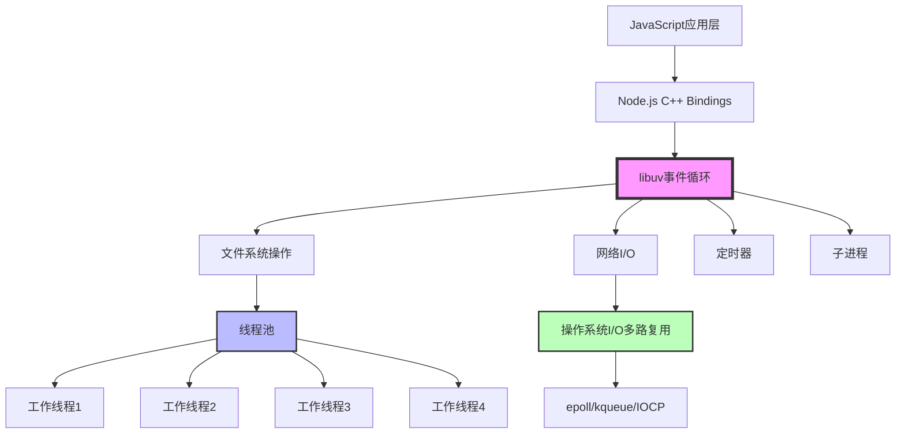
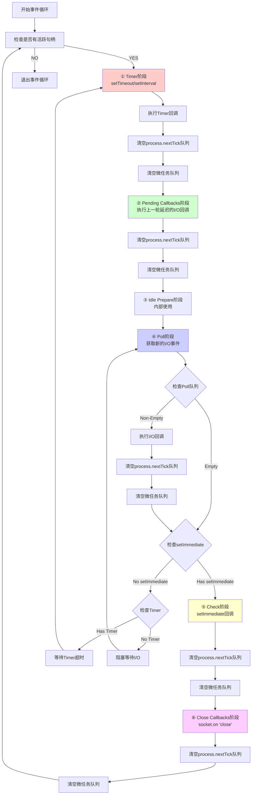

# 2025年Node.js面试知识深度分析

## 前言

本文档基于2025年最新的Node.js技术发展趋势和面试实际需求，深度分析Node.js核心概念、技术要点和实际应用场景。内容涵盖从基础概念到高级特性，从理论原理到实战案例，旨在帮助开发者全面掌握Node.js技术栈并顺利通过面试。

## 目录

1. [Node.js基础概念深度解析](#nodejs基础概念深度解析)
2. [非阻塞I/O与libuv核心机制](#非阻塞io与libuv核心机制)
3. [事件循环机制详解](#事件循环机制详解)
4. [内存管理与性能优化](#内存管理与性能优化)
5. [异步编程模式](#异步编程模式)
6. [模块系统与包管理](#模块系统与包管理)
7. [流与缓冲区深度解析](#流与缓冲区深度解析)
8. [进程与集群管理](#进程与集群管理)
9. [网络编程与HTTP](#网络编程与HTTP)
10. [数据库集成与ORM](#数据库集成与ORM)
11. [测试与调试](#测试与调试)
12. [部署与运维](#部署与运维)
13. [新技术对比分析](#新技术对比分析)

---

## 1. Node.js基础概念深度解析

### 1.1 什么是Node.js？

Node.js是一个基于Chrome V8 JavaScript引擎构建的JavaScript运行时环境，使JavaScript能够在服务器端运行。它采用事件驱动、非阻塞I/O模型，使其轻量高效。

**核心特点：**
- 单线程事件循环
- 非阻塞I/O操作
- 跨平台支持
- 丰富的包生态系统(npm)

### 1.2 Node.js与浏览器JavaScript的区别

#### 运行环境差异

```javascript
// 浏览器环境
console.log(window); // 全局对象
console.log(document); // DOM对象

// Node.js环境
console.log(global); // 全局对象
console.log(process); // 进程对象
console.log(__dirname); // 当前目录
console.log(__filename); // 当前文件
```

#### API差异对比

| 特性 | 浏览器 | Node.js |
|------|--------|---------|
| 全局对象 | window | global |
| 模块系统 | ES6 modules | CommonJS/ES6 modules |
| 文件系统 | 无 | fs模块 |
| 网络请求 | fetch/XMLHttpRequest | http/https模块 |
| 定时器 | setTimeout/setInterval | 同浏览器，但实现不同 |

### 1.3 V8引擎工作原理

V8引擎是Node.js的核心，负责JavaScript代码的执行：

```javascript
// V8引擎编译过程示例
function fibonacci(n) {
    if (n <= 1) return n;
    return fibonacci(n - 1) + fibonacci(n - 2);
}

// V8优化过程：
// 1. 解析器(Parser) -> AST
// 2. 解释器(Ignition) -> 字节码
// 3. 编译器(TurboFan) -> 优化机器码
```

**V8内存管理：**
- 新生代内存：短期存活对象
- 老生代内存：长期存活对象
- 大对象空间：超过限制的大对象

---

## 2. 非阻塞I/O与libuv核心机制

### 2.1 阻塞I/O vs 非阻塞I/O深度对比

#### 传统阻塞I/O模型的问题

```javascript
// 阻塞I/O示例（传统服务器模型）
const fs = require('fs');
const http = require('http');

// 错误示例：阻塞式文件读取
function handleRequestBlocking(req, res) {
    console.log('开始处理请求');
    
    // 这里会阻塞整个进程，直到文件读取完成
    const data = fs.readFileSync('large-file.txt'); // 可能需要几秒钟
    
    console.log('文件读取完成，继续处理');
    res.writeHead(200, { 'Content-Type': 'text/plain' });
    res.end(data);
}

// 这种模式下，每个请求都需要等待文件I/O完成
// 如果有1000个并发请求，就需要1000个线程
```

#### Node.js非阻塞I/O模型的优势

```javascript
// 非阻塞I/O示例（Node.js模型）
function handleRequestNonBlocking(req, res) {
    console.log('开始处理请求');
    
    // 非阻塞式文件读取，立即返回，不阻塞事件循环
    fs.readFile('large-file.txt', (err, data) => {
        if (err) {
            res.writeHead(500);
            res.end('服务器错误');
            return;
        }
        
        console.log('文件读取完成，执行回调');
        res.writeHead(200, { 'Content-Type': 'text/plain' });
        res.end(data);
    });
    
    console.log('请求已发起，可以处理其他请求');
    // 事件循环可以立即处理下一个请求
}

// 性能对比演示
function performanceComparison() {
    const startTime = Date.now();
    const requests = 1000;
    let completed = 0;
    
    console.log(`开始处理${requests}个并发请求`);
    
    for (let i = 0; i < requests; i++) {
        // 模拟异步I/O操作
        setImmediate(() => {
            // 非阻塞操作，每个都能立即开始
            setTimeout(() => {
                completed++;
                if (completed === requests) {
                    const totalTime = Date.now() - startTime;
                    console.log(`非阻塞模式：${requests}个请求用时${totalTime}ms`);
                    console.log(`平均每个请求：${totalTime / requests}ms`);
                }
            }, Math.random() * 100); // 模拟随机I/O时间
        });
    }
}

performanceComparison();
```

### 2.2 libuv：Node.js的性能引擎

#### libuv架构深度解析



#### libuv的核心职责详解

```javascript
// libuv工作机制演示
const fs = require('fs');
const dns = require('dns');
const crypto = require('crypto');

class LibuvDemo {
    static demonstrateThreadPool() {
        console.log('=== libuv线程池演示 ===');
        
        // CPU密集型操作 - 使用线程池
        console.time('crypto操作');
        crypto.pbkdf2('secret', 'salt', 100000, 64, 'sha512', (err, derivedKey) => {
            console.timeEnd('crypto操作');
            console.log('加密操作完成，使用了线程池');
        });
        
        // 文件系统操作 - 使用线程池
        console.time('文件操作');
        fs.readFile(__filename, (err, data) => {
            console.timeEnd('文件操作');
            console.log('文件读取完成，使用了线程池');
        });
        
        // 网络操作 - 使用事件通知机制（非线程池）
        console.time('DNS解析');
        dns.lookup('google.com', (err, address) => {
            console.timeEnd('DNS解析');
            console.log('DNS解析完成，使用了事件通知');
        });
        
        console.log('所有异步操作已发起，主线程继续执行');
    }
    
    static analyzeThreadPoolSize() {
        console.log('=== 线程池大小分析 ===');
        
        // 默认线程池大小为4
        const defaultPoolSize = process.env.UV_THREADPOOL_SIZE || 4;
        console.log(`当前线程池大小: ${defaultPoolSize}`);
        
        // 测试线程池饱和情况
        const operations = 8; // 超过默认线程池大小
        
        for (let i = 0; i < operations; i++) {
            const start = Date.now();
            
            crypto.pbkdf2('secret', 'salt', 100000, 64, 'sha512', (err, derivedKey) => {
                const duration = Date.now() - start;
                console.log(`操作${i + 1}完成，耗时: ${duration}ms`);
            });
        }
        
        // 观察输出：前4个操作几乎同时完成，后4个需要等待
    }
    
    static demonstrateEventNotification() {
        console.log('=== 事件通知机制演示 ===');
        
        const net = require('net');
        
        // 创建TCP服务器
        const server = net.createServer((socket) => {
            console.log('客户端连接');
            
            socket.on('data', (data) => {
                console.log('收到数据:', data.toString());
                socket.write('回显: ' + data);
            });
            
            socket.on('end', () => {
                console.log('客户端断开连接');
            });
        });
        
        server.listen(3000, () => {
            console.log('服务器启动在端口3000');
            
            // 创建客户端连接进行测试
            const client = net.connect(3000, () => {
                console.log('客户端已连接');
                client.write('Hello from client');
                
                setTimeout(() => {
                    client.end();
                    server.close();
                }, 1000);
            });
            
            client.on('data', (data) => {
                console.log('客户端收到:', data.toString());
            });
        });
    }
}

// 运行演示
LibuvDemo.demonstrateThreadPool();
setTimeout(() => LibuvDemo.analyzeThreadPoolSize(), 2000);
setTimeout(() => LibuvDemo.demonstrateEventNotification(), 4000);
```

### 2.3 I/O多路复用技术深度解析

#### 不同操作系统的I/O多路复用机制

```javascript
// I/O多路复用演示
const net = require('net');
const os = require('os');

class IOMultiplexingDemo {
    static analyzeSystemIO() {
        console.log('=== 系统I/O多路复用分析 ===');
        
        const platform = os.platform();
        console.log(`当前操作系统: ${platform}`);
        
        // 不同系统使用不同的I/O多路复用机制
        const ioMechanisms = {
            'linux': 'epoll',
            'darwin': 'kqueue',  // macOS
            'freebsd': 'kqueue',
            'win32': 'IOCP'      // Windows
        };
        
        const mechanism = ioMechanisms[platform] || 'select';
        console.log(`使用的I/O多路复用机制: ${mechanism}`);
        
        return mechanism;
    }
    
    static demonstrateConcurrentConnections() {
        console.log('=== 并发连接处理演示 ===');
        
        const connections = new Set();
        
        const server = net.createServer((socket) => {
            const connectionId = Math.random().toString(36).substr(2, 9);
            connections.add(connectionId);
            
            console.log(`新连接: ${connectionId}, 当前连接数: ${connections.size}`);
            
            socket.on('data', (data) => {
                // 处理数据，非阻塞
                const response = `Echo from ${connectionId}: ${data}`;
                socket.write(response);
            });
            
            socket.on('close', () => {
                connections.delete(connectionId);
                console.log(`连接关闭: ${connectionId}, 剩余连接数: ${connections.size}`);
            });
            
            socket.on('error', (err) => {
                console.error(`连接错误 ${connectionId}:`, err.message);
                connections.delete(connectionId);
            });
        });
        
        server.listen(3001, () => {
            console.log('服务器启动在端口3001');
            
            // 模拟多个并发连接
            this.createMultipleConnections(10);
        });
        
        // 监控连接状态
        const monitor = setInterval(() => {
            console.log(`实时连接数: ${connections.size}`);
            if (connections.size === 0) {
                clearInterval(monitor);
                server.close();
                console.log('服务器已关闭');
            }
        }, 1000);
    }
    
    static createMultipleConnections(count) {
        for (let i = 0; i < count; i++) {
            setTimeout(() => {
                const client = net.connect(3001, () => {
                    console.log(`客户端${i + 1}已连接`);
                    
                    // 发送一些数据
                    client.write(`Message from client ${i + 1}`);
                    
                    // 随机时间后断开连接
                    setTimeout(() => {
                        client.end();
                    }, Math.random() * 3000 + 1000);
                });
                
                client.on('data', (data) => {
                    console.log(`客户端${i + 1}收到:`, data.toString());
                });
                
                client.on('error', (err) => {
                    console.error(`客户端${i + 1}错误:`, err.message);
                });
            }, i * 100); // 错开连接时间
        }
    }
}

// 运行I/O多路复用演示
IOMultiplexingDemo.analyzeSystemIO();
setTimeout(() => IOMultiplexingDemo.demonstrateConcurrentConnections(), 1000);
```

### 2.4 性能优势与实际基准测试

#### Node.js vs 传统多线程服务器性能对比

```javascript
// 性能基准测试
const http = require('http');
const cluster = require('cluster');
const os = require('os');

class PerformanceBenchmark {
    static createNodeJSServer() {
        const server = http.createServer((req, res) => {
            // 模拟I/O操作
            const start = Date.now();
            
            // 模拟数据库查询（异步）
            setTimeout(() => {
                // 模拟一些CPU工作
                let sum = 0;
                for (let i = 0; i < 100000; i++) {
                    sum += Math.random();
                }
                
                const processingTime = Date.now() - start;
                
                res.writeHead(200, {
                    'Content-Type': 'application/json',
                    'X-Processing-Time': processingTime
                });
                
                res.end(JSON.stringify({
                    message: 'Hello from Node.js',
                    processingTime,
                    sum,
                    pid: process.pid,
                    memory: process.memoryUsage()
                }));
            }, Math.random() * 10); // 模拟0-10ms的I/O延迟
        });
        
        return server;
    }
    
    static startBenchmarkServer() {
        if (cluster.isMaster) {
            console.log('=== Node.js性能基准测试 ===');
            console.log(`主进程 ${process.pid} 正在启动`);
            
            // 创建工作进程
            const numCPUs = os.cpus().length;
            console.log(`创建 ${numCPUs} 个工作进程`);
            
            for (let i = 0; i < numCPUs; i++) {
                cluster.fork();
            }
            
            cluster.on('exit', (worker, code, signal) => {
                console.log(`工作进程 ${worker.process.pid} 退出`);
            });
            
            // 启动性能监控
            this.startPerformanceMonitoring();
            
        } else {
            // 工作进程
            const server = this.createNodeJSServer();
            server.listen(3002, () => {
                console.log(`工作进程 ${process.pid} 监听端口 3002`);
            });
        }
    }
    
    static startPerformanceMonitoring() {
        let requestCount = 0;
        let totalResponseTime = 0;
        
        setInterval(() => {
            const memUsage = process.memoryUsage();
            console.log('\n=== 性能监控 ===');
            console.log(`请求总数: ${requestCount}`);
            console.log(`平均响应时间: ${requestCount > 0 ? (totalResponseTime / requestCount).toFixed(2) : 0}ms`);
            console.log(`内存使用: ${Math.round(memUsage.heapUsed / 1024 / 1024)}MB`);
            console.log(`活跃句柄数: ${process._getActiveHandles().length}`);
            console.log(`活跃请求数: ${process._getActiveRequests().length}`);
        }, 5000);
    }
    
    static async loadTest() {
        console.log('=== 负载测试开始 ===');
        
        const concurrentRequests = 1000;
        const promises = [];
        
        const startTime = Date.now();
        
        for (let i = 0; i < concurrentRequests; i++) {
            promises.push(
                fetch('http://localhost:3002')
                    .then(response => response.json())
                    .then(data => data.processingTime)
                    .catch(err => {
                        console.error('请求失败:', err.message);
                        return null;
                    })
            );
        }
        
        try {
            const results = await Promise.all(promises);
            const endTime = Date.now();
            
            const validResults = results.filter(r => r !== null);
            const totalTime = endTime - startTime;
            const avgResponseTime = validResults.reduce((sum, time) => sum + time, 0) / validResults.length;
            
            console.log('\n=== 负载测试结果 ===');
            console.log(`总请求数: ${concurrentRequests}`);
            console.log(`成功请求数: ${validResults.length}`);
            console.log(`成功率: ${(validResults.length / concurrentRequests * 100).toFixed(2)}%`);
            console.log(`总耗时: ${totalTime}ms`);
            console.log(`平均响应时间: ${avgResponseTime.toFixed(2)}ms`);
            console.log(`QPS (每秒请求数): ${(concurrentRequests / totalTime * 1000).toFixed(2)}`);
            
        } catch (error) {
            console.error('负载测试失败:', error);
        }
    }
}

// 运行基准测试
if (require.main === module) {
    PerformanceBenchmark.startBenchmarkServer();
    
    // 等待服务器启动后进行负载测试
    if (cluster.isMaster) {
        setTimeout(() => {
            PerformanceBenchmark.loadTest();
        }, 3000);
    }
}
```

---

## 3. 事件循环机制详解

### 3.1 事件循环完整流程图



### 3.2 事件循环六个阶段深度解析

```javascript
// 详细的事件循环阶段演示
const fs = require('fs');
const net = require('net');

class EventLoopPhases {
    static demonstrateAllPhases() {
        console.log('=== 事件循环六个阶段详细演示 ===\n');
        
        // 记录执行时间和顺序
        let executionOrder = [];
        const startTime = Date.now();
        
        const logExecution = (phase, description) => {
            const timestamp = Date.now() - startTime;
            executionOrder.push(`[${timestamp}ms] ${phase}: ${description}`);
            console.log(`[${timestamp}ms] ${phase}: ${description}`);
        };
        
        // === Timer阶段 ===
        setTimeout(() => {
            logExecution('Timer阶段', 'setTimeout 0ms 执行');
        }, 0);
        
        setTimeout(() => {
            logExecution('Timer阶段', 'setTimeout 1ms 执行');
        }, 1);
        
        // === Pending Callbacks阶段演示 ===
        // 模拟一个会触发pending callbacks的操作
        const stream = fs.createReadStream(__filename);
        stream.on('error', (err) => {
            logExecution('Pending Callbacks阶段', '文件流错误处理');
        });
        
        // === Poll阶段 ===
        fs.readFile(__filename, () => {
            logExecution('Poll阶段', '文件读取完成');
            
            // 在Poll阶段内添加setImmediate
            setImmediate(() => {
                logExecution('Check阶段', 'setImmediate在Poll阶段后执行');
            });
            
            // 添加微任务
            process.nextTick(() => {
                logExecution('微任务', 'process.nextTick在Poll阶段后');
            });
            
            Promise.resolve().then(() => {
                logExecution('微任务', 'Promise.then在Poll阶段后');
            });
        });
        
        // === Check阶段 ===
        setImmediate(() => {
            logExecution('Check阶段', '直接设置的setImmediate');
        });
        
        // === Close Callbacks阶段 ===
        const server = net.createServer();
        server.listen(0, () => {
            server.close(() => {
                logExecution('Close Callbacks阶段', '服务器关闭回调');
            });
        });
        
        // === 微任务队列 ===
        process.nextTick(() => {
            logExecution('微任务', '直接设置的process.nextTick');
        });
        
        Promise.resolve().then(() => {
            logExecution('微任务', '直接设置的Promise.then');
        });
        
        queueMicrotask(() => {
            logExecution('微任务', 'queueMicrotask');
        });
        
        // 同步代码
        logExecution('同步', '同步代码执行');
        
        // 在所有异步操作完成后打印汇总
        setTimeout(() => {
            console.log('\n=== 执行顺序汇总 ===');
            executionOrder.forEach(log => console.log(log));
        }, 100);
    }
    
    static demonstrateMicrotaskPriority() {
        console.log('\n=== 微任务优先级演示 ===');
        
        setTimeout(() => console.log('1. setTimeout'), 0);
        
        setImmediate(() => console.log('2. setImmediate'));
        
        process.nextTick(() => {
            console.log('3. process.nextTick 1');
            process.nextTick(() => {
                console.log('4. process.nextTick 2 (nested)');
            });
        });
        
        Promise.resolve().then(() => {
            console.log('5. Promise 1');
            return Promise.resolve();
        }).then(() => {
            console.log('6. Promise 2 (chained)');
        });
        
        queueMicrotask(() => {
            console.log('7. queueMicrotask');
        });
        
        console.log('8. 同步代码');
        
        /* 执行顺序分析：
         * 1. 同步代码最先执行
         * 2. process.nextTick队列完全清空
         * 3. 其他微任务队列清空
         * 4. 宏任务按阶段执行
         */
    }
    
    static demonstrateEventLoopBlocking() {
        console.log('\n=== 事件循环阻塞演示 ===');
        
        const start = Date.now();
        
        // 设置多个定时器
        setTimeout(() => {
            console.log(`Timer 1 执行, 延迟: ${Date.now() - start}ms`);
        }, 10);
        
        setTimeout(() => {
            console.log(`Timer 2 执行, 延迟: ${Date.now() - start}ms`);
        }, 20);
        
        setTimeout(() => {
            console.log(`Timer 3 执行, 延迟: ${Date.now() - start}ms`);
        }, 30);
        
        // 模拟CPU密集型任务阻塞事件循环
        setTimeout(() => {
            console.log('开始CPU密集型任务');
            const blockStart = Date.now();
            
            // 阻塞2秒
            while (Date.now() - blockStart < 2000) {
                // CPU密集型操作
                Math.random();
            }
            
            console.log(`CPU任务完成, 耗时: ${Date.now() - blockStart}ms`);
        }, 5);
        
        console.log('所有定时器已设置');
    }
    
    static demonstratePollingBehavior() {
        console.log('\n=== Poll阶段轮询行为演示 ===');
        
        // 情况1：Poll队列为空，且没有setImmediate
        setTimeout(() => {
            console.log('情况1: 只有Timer，Poll阶段会等待Timer超时');
        }, 100);
        
        // 情况2：Poll队列为空，但有setImmediate
        setImmediate(() => {
            console.log('情况2: 有setImmediate，Poll阶段不会阻塞');
        });
        
        // 情况3：Poll队列非空
        fs.readFile(__filename, () => {
            console.log('情况3: Poll队列非空，直接执行回调');
            
            // 在I/O回调中设置setImmediate
            setImmediate(() => {
                console.log('在I/O回调中设置的setImmediate');
            });
            
            setTimeout(() => {
                console.log('在I/O回调中设置的setTimeout');
            }, 0);
        });
    }
}

// 运行所有演示
EventLoopPhases.demonstrateAllPhases();
setTimeout(() => EventLoopPhases.demonstrateMicrotaskPriority(), 200);
setTimeout(() => EventLoopPhases.demonstrateEventLoopBlocking(), 400);
setTimeout(() => EventLoopPhases.demonstratePollingBehavior(), 3000);
```

### 2.1 事件循环原理

Node.js事件循环是其核心机制，决定了代码的执行顺序：

```javascript
console.log('=== 事件循环执行顺序演示 ===');

// 1. 同步代码
console.log('1. 同步代码开始');

// 2. 微任务
Promise.resolve().then(() => {
    console.log('4. Promise微任务');
});

// 3. 宏任务
setTimeout(() => {
    console.log('5. setTimeout宏任务');
}, 0);

// 4. process.nextTick (最高优先级微任务)
process.nextTick(() => {
    console.log('3. process.nextTick');
});

// 5. setImmediate
setImmediate(() => {
    console.log('6. setImmediate');
});

console.log('2. 同步代码结束');

/* 输出顺序：
1. 同步代码开始
2. 同步代码结束
3. process.nextTick
4. Promise微任务
5. setTimeout宏任务
6. setImmediate
*/
```

### 2.2 事件循环的六个阶段

```javascript
// 事件循环阶段详解
const fs = require('fs');

console.log('开始');

// Timer阶段：setTimeout, setInterval
setTimeout(() => console.log('Timer阶段：setTimeout'), 0);

// Pending callbacks阶段：除了close、timer、setImmediate之外的回调
// 主要是网络、流、TCP的错误回调

// Poll阶段：获取新的I/O事件
fs.readFile(__filename, () => {
    console.log('Poll阶段：文件读取回调');
    
    // Check阶段：setImmediate回调在这里执行
    setImmediate(() => console.log('Check阶段：setImmediate'));
    
    // 微任务优先于setImmediate
    process.nextTick(() => console.log('微任务：process.nextTick'));
});

// Close callbacks阶段：socket.on('close', ...)

console.log('结束');
```

### 2.3 微任务与宏任务深度分析

```javascript
// 复杂的微任务宏任务执行顺序
function complexEventLoop() {
    console.log('=== 复杂事件循环测试 ===');
    
    setTimeout(() => {
        console.log('宏任务1：setTimeout1');
        Promise.resolve().then(() => {
            console.log('微任务1：Promise in setTimeout1');
        });
    }, 0);
    
    Promise.resolve().then(() => {
        console.log('微任务2：Promise1');
        setTimeout(() => {
            console.log('宏任务2：setTimeout in Promise1');
        }, 0);
    });
    
    setTimeout(() => {
        console.log('宏任务3：setTimeout2');
    }, 0);
    
    Promise.resolve().then(() => {
        console.log('微任务3：Promise2');
    });
    
    console.log('同步代码');
}

complexEventLoop();

/* 分析执行顺序：
1. 同步代码立即执行
2. 微任务队列清空（Promise1, Promise2）
3. 宏任务队列逐个执行，每个宏任务后清空微任务队列
*/
```

### 2.4 Node.js与浏览器事件循环差异

```javascript
// Node.js环境特有的微任务
process.nextTick(() => {
    console.log('Node.js特有：process.nextTick');
});

// queueMicrotask - 标准微任务API
queueMicrotask(() => {
    console.log('标准微任务：queueMicrotask');
});

// setImmediate - Node.js特有
setImmediate(() => {
    console.log('Node.js特有：setImmediate');
});

// 优先级：process.nextTick > queueMicrotask > Promise.then
```

---

## 3. 内存管理与性能优化

### 3.1 Node.js内存限制与突破

#### 默认内存限制
- 32位系统：~512MB
- 64位系统：~1.4GB

#### 突破内存限制的方法

```javascript
// 1. 启动时设置内存限制
// node --max-old-space-size=4096 app.js  // 设置为4GB

// 2. 程序中检查内存使用
function checkMemoryUsage() {
    const memUsage = process.memoryUsage();
    console.log('内存使用情况：');
    console.log(`RSS (常驻集大小): ${Math.round(memUsage.rss / 1024 / 1024 * 100) / 100} MB`);
    console.log(`堆内存总量: ${Math.round(memUsage.heapTotal / 1024 / 1024 * 100) / 100} MB`);
    console.log(`堆内存使用量: ${Math.round(memUsage.heapUsed / 1024 / 1024 * 100) / 100} MB`);
    console.log(`外部内存: ${Math.round(memUsage.external / 1024 / 1024 * 100) / 100} MB`);
}

// 3. 流式处理大文件，避免一次性加载到内存
const fs = require('fs');
const readline = require('readline');

async function processLargeFile(filepath) {
    const fileStream = fs.createReadStream(filepath);
    const rl = readline.createInterface({
        input: fileStream,
        crlfDelay: Infinity
    });
    
    for await (const line of rl) {
        // 逐行处理，而不是一次性读取整个文件
        processLine(line);
    }
}

function processLine(line) {
    // 处理单行数据
    console.log(`处理行：${line.substring(0, 50)}...`);
}
```

### 3.2 内存泄漏检测与防范

#### 常见内存泄漏场景

```javascript
// 1. 全局变量导致的内存泄漏
// 错误示例
let globalCache = {};
function addToCache(key, value) {
    globalCache[key] = value; // 永远不清理，导致内存泄漏
}

// 正确示例：使用LRU缓存
class LRUCache {
    constructor(maxSize = 100) {
        this.maxSize = maxSize;
        this.cache = new Map();
    }
    
    get(key) {
        if (this.cache.has(key)) {
            const value = this.cache.get(key);
            this.cache.delete(key);
            this.cache.set(key, value); // 移到最后
            return value;
        }
        return null;
    }
    
    set(key, value) {
        if (this.cache.has(key)) {
            this.cache.delete(key);
        } else if (this.cache.size >= this.maxSize) {
            const firstKey = this.cache.keys().next().value;
            this.cache.delete(firstKey);
        }
        this.cache.set(key, value);
    }
}

// 2. 事件监听器未移除
const EventEmitter = require('events');

class DataProcessor extends EventEmitter {
    constructor() {
        super();
        this.data = [];
    }
    
    startProcessing() {
        // 错误：没有移除监听器
        this.on('data', this.handleData);
        
        // 正确：使用once或手动移除
        this.once('data', this.handleData);
        // 或者
        const handler = this.handleData.bind(this);
        this.on('data', handler);
        // 在适当时机移除
        // this.removeListener('data', handler);
    }
    
    handleData(data) {
        this.data.push(data);
    }
}

// 3. 定时器未清理
class TimerManager {
    constructor() {
        this.timers = new Set();
    }
    
    setTimeout(callback, delay) {
        const timer = setTimeout(() => {
            callback();
            this.timers.delete(timer); // 执行后自动清理
        }, delay);
        this.timers.add(timer);
        return timer;
    }
    
    clearAllTimers() {
        this.timers.forEach(timer => clearTimeout(timer));
        this.timers.clear();
    }
}
```

### 3.3 垃圾回收机制深度分析

```javascript
// V8垃圾回收演示
function demonstrateGC() {
    console.log('=== V8垃圾回收演示 ===');
    
    // 强制执行垃圾回收（需要--expose-gc标志）
    // node --expose-gc script.js
    if (global.gc) {
        console.log('手动触发GC前：');
        checkMemoryUsage();
        
        // 创建大量对象
        let largeArray = [];
        for (let i = 0; i < 1000000; i++) {
            largeArray.push({ id: i, data: 'some data' });
        }
        
        console.log('创建大量对象后：');
        checkMemoryUsage();
        
        // 释放引用
        largeArray = null;
        
        // 手动触发垃圾回收
        global.gc();
        
        console.log('手动GC后：');
        checkMemoryUsage();
    } else {
        console.log('需要使用 --expose-gc 标志启动Node.js');
    }
}

// 监听垃圾回收事件
const v8 = require('v8');

// 获取堆统计信息
function getHeapStatistics() {
    const heapStats = v8.getHeapStatistics();
    console.log('堆内存统计：');
    console.log(`总堆大小: ${heapStats.total_heap_size / 1024 / 1024} MB`);
    console.log(`总堆大小限制: ${heapStats.heap_size_limit / 1024 / 1024} MB`);
    console.log(`已使用堆大小: ${heapStats.used_heap_size / 1024 / 1024} MB`);
    console.log(`可分配堆大小: ${heapStats.total_available_size / 1024 / 1024} MB`);
}
```

### 3.4 性能监控与分析工具

```javascript
// 使用perf_hooks进行性能监控
const { performance, PerformanceObserver } = require('perf_hooks');

// 1. 基础性能标记
performance.mark('start-operation');

// 模拟一些操作
setTimeout(() => {
    performance.mark('end-operation');
    performance.measure('operation-duration', 'start-operation', 'end-operation');
}, 100);

// 2. 性能观察器
const obs = new PerformanceObserver((list) => {
    const entries = list.getEntries();
    entries.forEach((entry) => {
        console.log(`${entry.name}: ${entry.duration}ms`);
    });
});
obs.observe({ entryTypes: ['measure'] });

// 3. 函数执行时间测量装饰器
function measureTime(target, propertyName, descriptor) {
    const method = descriptor.value;
    
    descriptor.value = function(...args) {
        const start = performance.now();
        const result = method.apply(this, args);
        const end = performance.now();
        
        console.log(`${propertyName} 执行时间: ${end - start}ms`);
        return result;
    };
    
    return descriptor;
}

// 使用示例
class DataService {
    @measureTime
    processData(data) {
        // 模拟数据处理
        return data.map(item => item * 2);
    }
}

// 4. 内存使用监控
function startMemoryMonitoring(interval = 5000) {
    const monitor = setInterval(() => {
        const memUsage = process.memoryUsage();
        const heapUsedMB = Math.round(memUsage.heapUsed / 1024 / 1024 * 100) / 100;
        
        console.log(`当前堆内存使用: ${heapUsedMB}MB`);
        
        // 如果内存使用超过阈值，触发警告
        if (heapUsedMB > 500) {
            console.warn('⚠️ 内存使用过高，建议检查内存泄漏！');
        }
    }, interval);
    
    return monitor;
}

// 启动内存监控
const memoryMonitor = startMemoryMonitoring();

// 在应用关闭时清理
process.on('SIGINT', () => {
    clearInterval(memoryMonitor);
    console.log('内存监控已停止');
    process.exit(0);
});
```
---

## 4. 异步编程模式

### 4.1 回调函数模式

#### 传统回调方式

```javascript
// 回调地狱示例
const fs = require('fs');

function readUserData(userId, callback) {
    fs.readFile(`user_${userId}.json`, 'utf8', (err, userData) => {
        if (err) return callback(err);
        
        const user = JSON.parse(userData);
        fs.readFile(`profile_${user.profileId}.json`, 'utf8', (err, profileData) => {
            if (err) return callback(err);
            
            const profile = JSON.parse(profileData);
            fs.readFile(`settings_${profile.settingsId}.json`, 'utf8', (err, settingsData) => {
                if (err) return callback(err);
                
                const settings = JSON.parse(settingsData);
                callback(null, { user, profile, settings });
            });
        });
    });
}
```

#### 错误处理最佳实践

```javascript
// Node.js错误优先回调模式
function safeCallback(callback) {
    return function(err, ...args) {
        // 确保回调只执行一次
        if (callback._called) return;
        callback._called = true;
        
        if (err) {
            console.error('操作失败:', err.message);
            return callback(err);
        }
        
        callback(null, ...args);
    };
}

// 使用示例
function asyncOperation(input, callback) {
    const wrappedCallback = safeCallback(callback);
    
    if (!input) {
        return wrappedCallback(new Error('输入参数不能为空'));
    }
    
    setTimeout(() => {
        try {
            const result = processInput(input);
            wrappedCallback(null, result);
        } catch (error) {
            wrappedCallback(error);
        }
    }, 100);
}
```

### 4.2 Promise深度解析

#### Promise实现原理

```javascript
// 简化版Promise实现
class MyPromise {
    constructor(executor) {
        this.state = 'pending';
        this.value = undefined;
        this.reason = undefined;
        this.onFulfilledCallbacks = [];
        this.onRejectedCallbacks = [];
        
        const resolve = (value) => {
            if (this.state === 'pending') {
                this.state = 'fulfilled';
                this.value = value;
                this.onFulfilledCallbacks.forEach(fn => fn());
            }
        };
        
        const reject = (reason) => {
            if (this.state === 'pending') {
                this.state = 'rejected';
                this.reason = reason;
                this.onRejectedCallbacks.forEach(fn => fn());
            }
        };
        
        try {
            executor(resolve, reject);
        } catch (error) {
            reject(error);
        }
    }
    
    then(onFulfilled, onRejected) {
        return new MyPromise((resolve, reject) => {
            const handleFulfilled = () => {
                try {
                    const result = onFulfilled ? onFulfilled(this.value) : this.value;
                    resolve(result);
                } catch (error) {
                    reject(error);
                }
            };
            
            const handleRejected = () => {
                try {
                    const result = onRejected ? onRejected(this.reason) : this.reason;
                    resolve(result);
                } catch (error) {
                    reject(error);
                }
            };
            
            if (this.state === 'fulfilled') {
                setTimeout(handleFulfilled, 0);
            } else if (this.state === 'rejected') {
                setTimeout(handleRejected, 0);
            } else {
                this.onFulfilledCallbacks.push(handleFulfilled);
                this.onRejectedCallbacks.push(handleRejected);
            }
        });
    }
    
    catch(onRejected) {
        return this.then(null, onRejected);
    }
}
```

#### Promise高级用法

```javascript
// Promise.all的手动实现
function promiseAll(promises) {
    return new Promise((resolve, reject) => {
        if (!Array.isArray(promises)) {
            return reject(new TypeError('参数必须是数组'));
        }
        
        const results = [];
        let completedCount = 0;
        
        if (promises.length === 0) {
            return resolve(results);
        }
        
        promises.forEach((promise, index) => {
            Promise.resolve(promise)
                .then(value => {
                    results[index] = value;
                    completedCount++;
                    
                    if (completedCount === promises.length) {
                        resolve(results);
                    }
                })
                .catch(reject);
        });
    });
}

// Promise.allSettled的手动实现
function promiseAllSettled(promises) {
    return Promise.all(
        promises.map(promise =>
            Promise.resolve(promise)
                .then(value => ({ status: 'fulfilled', value }))
                .catch(reason => ({ status: 'rejected', reason }))
        )
    );
}

// Promise限流执行
class PromisePool {
    constructor(concurrency = 5) {
        this.concurrency = concurrency;
        this.running = 0;
        this.queue = [];
    }
    
    async add(promiseFactory) {
        return new Promise((resolve, reject) => {
            this.queue.push({
                promiseFactory,
                resolve,
                reject
            });
            this.tryNext();
        });
    }
    
    async tryNext() {
        if (this.running >= this.concurrency || this.queue.length === 0) {
            return;
        }
        
        this.running++;
        const { promiseFactory, resolve, reject } = this.queue.shift();
        
        try {
            const result = await promiseFactory();
            resolve(result);
        } catch (error) {
            reject(error);
        } finally {
            this.running--;
            this.tryNext();
        }
    }
}

// 使用示例
const pool = new PromisePool(3);

// 模拟大量异步任务
const tasks = Array.from({ length: 10 }, (_, i) => 
    () => new Promise(resolve => 
        setTimeout(() => resolve(`任务${i}完成`), Math.random() * 1000)
    )
);

// 并发控制执行
Promise.all(tasks.map(task => pool.add(task)))
    .then(results => console.log('所有任务完成:', results));
```

### 4.3 async/await深度分析

#### async/await原理

```javascript
// async/await转换为Promise的示例
// 原始async函数
async function fetchUserData(userId) {
    try {
        const response = await fetch(`/api/users/${userId}`);
        const userData = await response.json();
        return userData;
    } catch (error) {
        console.error('获取用户数据失败:', error);
        throw error;
    }
}

// 等价的Promise实现
function fetchUserDataPromise(userId) {
    return fetch(`/api/users/${userId}`)
        .then(response => response.json())
        .catch(error => {
            console.error('获取用户数据失败:', error);
            throw error;
        });
}

// Generator实现async/await原理
function* asyncGenerator() {
    try {
        const response = yield fetch('/api/data');
        const data = yield response.json();
        return data;
    } catch (error) {
        console.error('错误:', error);
        throw error;
    }
}

function runAsyncGenerator(generator) {
    const gen = generator();
    
    function handle(result) {
        if (result.done) return result.value;
        
        return Promise.resolve(result.value)
            .then(res => handle(gen.next(res)))
            .catch(err => handle(gen.throw(err)));
    }
    
    return handle(gen.next());
}
```

#### async/await最佳实践

```javascript
// 1. 并发执行vs顺序执行
async function inefficientSequential() {
    console.time('顺序执行');
    const user = await fetchUser(1);
    const profile = await fetchProfile(1);
    const settings = await fetchSettings(1);
    console.timeEnd('顺序执行');
    
    return { user, profile, settings };
}

async function efficientConcurrent() {
    console.time('并发执行');
    const [user, profile, settings] = await Promise.all([
        fetchUser(1),
        fetchProfile(1),
        fetchSettings(1)
    ]);
    console.timeEnd('并发执行');
    
    return { user, profile, settings };
}

// 2. 错误处理策略
async function robustErrorHandling(userId) {
    try {
        // 主要操作
        const userData = await fetchUserData(userId);
        
        // 可选操作，失败不影响主流程
        let additionalData = null;
        try {
            additionalData = await fetchAdditionalData(userId);
        } catch (error) {
            console.warn('获取额外数据失败，继续执行:', error.message);
        }
        
        return {
            user: userData,
            additional: additionalData
        };
    } catch (error) {
        // 主要操作失败，记录错误并重新抛出
        console.error('获取用户数据失败:', error);
        throw new Error(`用户数据获取失败: ${error.message}`);
    }
}

// 3. 重试机制
async function withRetry(asyncFunction, maxRetries = 3, delay = 1000) {
    let lastError;
    
    for (let i = 0; i <= maxRetries; i++) {
        try {
            return await asyncFunction();
        } catch (error) {
            lastError = error;
            
            if (i === maxRetries) {
                throw new Error(`操作失败，已重试${maxRetries}次: ${error.message}`);
            }
            
            console.warn(`第${i + 1}次尝试失败，${delay}ms后重试:`, error.message);
            await new Promise(resolve => setTimeout(resolve, delay));
            delay *= 2; // 指数退避
        }
    }
}

// 使用示例
async function reliableFetchData(userId) {
    return withRetry(async () => {
        const response = await fetch(`/api/users/${userId}`);
        if (!response.ok) {
            throw new Error(`HTTP错误: ${response.status}`);
        }
        return response.json();
    });
}

// 4. 超时控制
function withTimeout(promise, timeoutMs) {
    const timeoutPromise = new Promise((_, reject) => {
        setTimeout(() => reject(new Error('操作超时')), timeoutMs);
    });
    
    return Promise.race([promise, timeoutPromise]);
}

// 使用示例
async function fetchWithTimeout(url, timeoutMs = 5000) {
    try {
        const response = await withTimeout(fetch(url), timeoutMs);
        return await response.json();
    } catch (error) {
        if (error.message === '操作超时') {
            console.error('请求超时');
            throw new Error('网络请求超时，请稍后重试');
        }
        throw error;
    }
}
```

### 4.4 流控制与并发管理

```javascript
// 高级并发控制
class ConcurrencyController {
    constructor(maxConcurrency = 5) {
        this.maxConcurrency = maxConcurrency;
        this.running = 0;
        this.queue = [];
        this.results = new Map();
    }
    
    async execute(tasks) {
        if (!Array.isArray(tasks)) {
            throw new Error('tasks必须是数组');
        }
        
        return Promise.all(
            tasks.map((task, index) => this.addTask(task, index))
        );
    }
    
    async addTask(taskFactory, index) {
        return new Promise((resolve, reject) => {
            this.queue.push({
                taskFactory,
                index,
                resolve,
                reject
            });
            this.processQueue();
        });
    }
    
    async processQueue() {
        if (this.running >= this.maxConcurrency || this.queue.length === 0) {
            return;
        }
        
        this.running++;
        const { taskFactory, index, resolve, reject } = this.queue.shift();
        
        try {
            const startTime = Date.now();
            const result = await taskFactory();
            const duration = Date.now() - startTime;
            
            console.log(`任务${index}完成，耗时:${duration}ms`);
            resolve(result);
        } catch (error) {
            console.error(`任务${index}失败:`, error.message);
            reject(error);
        } finally {
            this.running--;
            this.processQueue();
        }
    }
}

// 使用示例
async function batchProcessImages(imageUrls) {
    const controller = new ConcurrencyController(3);
    
    const tasks = imageUrls.map(url => 
        () => processImage(url)
    );
    
    try {
        const results = await controller.execute(tasks);
        console.log('所有图片处理完成:', results.length);
        return results;
    } catch (error) {
        console.error('批量处理失败:', error);
        throw error;
    }
}

async function processImage(url) {
    // 模拟图片处理
    return new Promise((resolve) => {
        setTimeout(() => {
            resolve({ url, processed: true, timestamp: Date.now() });
        }, Math.random() * 2000 + 1000);
    });
}
```

---

## 5. 模块系统与包管理

### 5.1 CommonJS vs ES Modules

#### CommonJS模块系统

```javascript
// math.js - CommonJS模块导出
function add(a, b) {
    return a + b;
}

function subtract(a, b) {
    return a - b;
}

class Calculator {
    constructor() {
        this.history = [];
    }
    
    calculate(operation, a, b) {
        let result;
        switch (operation) {
            case 'add':
                result = add(a, b);
                break;
            case 'subtract':
                result = subtract(a, b);
                break;
            default:
                throw new Error('不支持的操作');
        }
        
        this.history.push({ operation, a, b, result });
        return result;
    }
}

// 多种导出方式
module.exports = {
    add,
    subtract,
    Calculator
};

// 或者
// exports.add = add;
// exports.subtract = subtract;
// exports.Calculator = Calculator;

// 或者
// module.exports = Calculator;
```

```javascript
// main.js - CommonJS模块导入
const { add, subtract, Calculator } = require('./math');
// 或者
// const math = require('./math');

// 动态导入
function dynamicImport(moduleName) {
    try {
        const module = require(moduleName);
        console.log('模块加载成功:', moduleName);
        return module;
    } catch (error) {
        console.error('模块加载失败:', error.message);
        return null;
    }
}

// 模块缓存
console.log('第一次加载:', require('./math'));
console.log('第二次加载(从缓存):', require('./math'));
console.log('缓存中的模块:', Object.keys(require.cache));

// 清除模块缓存
delete require.cache[require.resolve('./math')];
```

#### ES Modules

```javascript
// math.mjs - ES模块导出
export function add(a, b) {
    return a + b;
}

export function subtract(a, b) {
    return a - b;
}

export class Calculator {
    constructor() {
        this.history = [];
    }
    
    calculate(operation, a, b) {
        let result;
        switch (operation) {
            case 'add':
                result = add(a, b);
                break;
            case 'subtract':
                result = subtract(a, b);
                break;
            default:
                throw new Error('不支持的操作');
        }
        
        this.history.push({ operation, a, b, result });
        return result;
    }
}

// 默认导出
export default Calculator;

// 重新导出
export { multiply } from './advanced-math.mjs';
```

```javascript
// main.mjs - ES模块导入
import { add, subtract, Calculator } from './math.mjs';
import Calc from './math.mjs'; // 默认导入
import * as MathUtils from './math.mjs'; // 命名空间导入

// 动态导入
async function dynamicESImport(modulePath) {
    try {
        const module = await import(modulePath);
        console.log('ES模块加载成功:', modulePath);
        return module;
    } catch (error) {
        console.error('ES模块加载失败:', error.message);
        return null;
    }
}

// 条件导入
async function conditionalImport(condition) {
    if (condition) {
        const { heavyFunction } = await import('./heavy-module.mjs');
        return heavyFunction;
    }
    return null;
}
```

#### 模块系统对比

| 特性 | CommonJS | ES Modules |
|------|----------|------------|
| 语法 | require/module.exports | import/export |
| 加载时机 | 运行时同步加载 | 编译时静态分析 |
| 动态导入 | 直接require | import() |
| 循环依赖 | 支持但可能有问题 | 更好的处理 |
| Tree Shaking | 不支持 | 支持 |
| 浏览器支持 | 需要构建工具 | 原生支持 |

### 5.2 包管理深度分析

#### package.json详解

```json
{
  "name": "my-nodejs-app",
  "version": "1.0.0",
  "description": "一个Node.js应用示例",
  "main": "index.js",
  "type": "module",
  "engines": {
    "node": ">=16.0.0",
    "npm": ">=8.0.0"
  },
  "scripts": {
    "start": "node index.js",
    "dev": "nodemon index.js",
    "test": "jest",
    "test:watch": "jest --watch",
    "test:coverage": "jest --coverage",
    "lint": "eslint .",
    "lint:fix": "eslint . --fix",
    "build": "webpack --mode production",
    "prepublishOnly": "npm run test && npm run build"
  },
  "dependencies": {
    "express": "^4.18.2",
    "mongoose": "^7.0.0",
    "dotenv": "^16.0.0"
  },
  "devDependencies": {
    "nodemon": "^2.0.20",
    "jest": "^29.0.0",
    "eslint": "^8.0.0",
    "webpack": "^5.0.0"
  },
  "peerDependencies": {
    "react": ">=16.0.0"
  },
  "optionalDependencies": {
    "fsevents": "^2.3.0"
  },
  "bundledDependencies": [
    "custom-library"
  ],
  "files": [
    "dist/",
    "lib/",
    "README.md"
  ],
  "repository": {
    "type": "git",
    "url": "https://github.com/username/repo.git"
  },
  "keywords": ["nodejs", "express", "api"],
  "author": "Your Name <email@example.com>",
  "license": "MIT",
  "bugs": {
    "url": "https://github.com/username/repo/issues"
  },
  "homepage": "https://github.com/username/repo#readme"
}
```

---

## 7. 流与缓冲区深度解析

### 7.1 Stream流深度解析

#### 流的四种类型详解

```javascript
const { Readable, Writable, Transform, Duplex } = require('stream');

// 1. Readable流 - 数据源
class DataSourceStream extends Readable {
    constructor(data, options) {
        super(options);
        this.data = data;
        this.index = 0;
    }
    
    _read() {
        if (this.index < this.data.length) {
            this.push(this.data[this.index]);
            this.index++;
        } else {
            this.push(null); // 结束流
        }
    }
}

// 2. Writable流 - 数据接收器
class DataSinkStream extends Writable {
    constructor(options) {
        super(options);
        this.chunks = [];
    }
    
    _write(chunk, encoding, callback) {
        this.chunks.push(chunk);
        console.log('接收数据:', chunk.toString());
        callback();
    }
    
    _final(callback) {
        console.log('总共接收到', this.chunks.length, '个数据块');
        callback();
    }
}

// 3. Transform流 - 数据转换器
class DataTransformStream extends Transform {
    _transform(chunk, encoding, callback) {
        // 将数据转换为大写
        const transformed = chunk.toString().toUpperCase();
        this.push(Buffer.from(transformed));
        callback();
    }
}

// 使用管道连接流
const source = new DataSourceStream(['hello', 'world', 'nodejs']);
const transform = new DataTransformStream();
const sink = new DataSinkStream();

source.pipe(transform).pipe(sink);
```

### 7.2 背压(Backpressure)机制深度解析

#### 什么是背压？

背压是指在数据流处理中，当数据生产速度超过消费速度时，产生的数据流拥塞现象。如果不处理背压，会导致内存不断增长，最终导致应用崩溃。

```javascript
// 背压问题演示
const fs = require('fs');
const { pipeline } = require('stream/promises');

class BackpressureDemo {
    static demonstrateBackpressureProblem() {
        console.log('=== 背压问题演示 ===');
        
        // 问题场景：快速生产数据，缓慢消费
        class FastProducer extends Readable {
            constructor(options) {
                super(options);
                this.count = 0;
                this.maxCount = 1000000; // 100万条数据
            }
            
            _read() {
                // 快速生产数据
                for (let i = 0; i < 1000 && this.count < this.maxCount; i++) {
                    this.push(`数据${this.count++}\n`);
                }
                
                if (this.count >= this.maxCount) {
                    this.push(null); // 结束
                }
            }
        }
        
        class SlowConsumer extends Writable {
            constructor(options) {
                super(options);
                this.processedCount = 0;
            }
            
            _write(chunk, encoding, callback) {
                // 模拟缓慢处理（比如写入数据库）
                setTimeout(() => {
                    this.processedCount++;
                    if (this.processedCount % 10000 === 0) {
                        console.log(`已处理: ${this.processedCount} 条数据`);
                        const memUsage = process.memoryUsage();
                        console.log(`内存使用: ${Math.round(memUsage.heapUsed / 1024 / 1024)}MB`);
                    }
                    callback();
                }, 1); // 每条数据处理需要1ms
            }
        }
        
        const producer = new FastProducer();
        const consumer = new SlowConsumer();
        
        // 不正确的做法：直接连接，不处理背压
        producer.pipe(consumer);
        
        // 监控内存使用
        const memoryMonitor = setInterval(() => {
            const memUsage = process.memoryUsage();
            const heapUsedMB = Math.round(memUsage.heapUsed / 1024 / 1024);
            console.log(`实时内存使用: ${heapUsedMB}MB`);
            
            if (heapUsedMB > 500) {
                console.error('⚠️ 内存使用过高！背压问题可能导致内存溢出');
            }
        }, 1000);
        
        consumer.on('finish', () => {
            clearInterval(memoryMonitor);
            console.log('数据处理完成');
        });
    }
    
    static demonstrateBackpressureHandling() {
        console.log('\n=== 正确处理背压 ===');
        
        class BackpressureAwareProducer extends Readable {
            constructor(options) {
                super(options);
                this.count = 0;
                this.maxCount = 1000000;
            }
            
            _read() {
                // 根据消费者的速度调节生产速度
                const batchSize = this.readableHighWaterMark || 100;
                
                for (let i = 0; i < batchSize && this.count < this.maxCount; i++) {
                    const success = this.push(`数据${this.count++}\n`);
                    
                    // 如果push返回false，说明内部缓冲区已满
                    if (!success) {
                        console.log('ℹ️ 内部缓冲区已满，暂停生产');
                        break;
                    }
                }
                
                if (this.count >= this.maxCount) {
                    this.push(null);
                }
            }
        }
        
        class BackpressureAwareConsumer extends Writable {
            constructor(options) {
                super({
                    ...options,
                    highWaterMark: 16 * 1024 // 16KB缓冲区
                });
                this.processedCount = 0;
            }
            
            _write(chunk, encoding, callback) {
                // 模拟处理延迟
                setImmediate(() => {
                    this.processedCount++;
                    if (this.processedCount % 10000 === 0) {
                        console.log(`已处理: ${this.processedCount} 条数据`);
                    }
                    callback();
                });
            }
        }
        
        const producer = new BackpressureAwareProducer({ highWaterMark: 64 });
        const consumer = new BackpressureAwareConsumer();
        
        // 使用pipeline自动处理背压
        pipeline(producer, consumer)
            .then(() => {
                console.log('数据处理完成，没有内存问题');
            })
            .catch(console.error);
    }
    
    static demonstrateManualBackpressureControl() {
        console.log('\n=== 手动背压控制 ===');
        
        class ManualBackpressureHandler {
            constructor(readableStream, writableStream) {
                this.readable = readableStream;
                this.writable = writableStream;
                this.isPaused = false;
            }
            
            async process() {
                return new Promise((resolve, reject) => {
                    this.readable.on('data', (chunk) => {
                        const writeSuccess = this.writable.write(chunk);
                        
                        if (!writeSuccess) {
                            console.log('ℹ️ 写入流缓冲区已满，暂停读取');
                            this.readable.pause();
                            this.isPaused = true;
                            
                            // 等待写入流排空缓冲区
                            this.writable.once('drain', () => {
                                console.log('✅ 写入流缓冲区已排空，恢复读取');
                                this.readable.resume();
                                this.isPaused = false;
                            });
                        }
                    });
                    
                    this.readable.on('end', () => {
                        this.writable.end();
                    });
                    
                    this.readable.on('error', reject);
                    this.writable.on('error', reject);
                    this.writable.on('finish', resolve);
                });
            }
        }
        
        // 创建测试流
        const readable = new Readable({
            read() {
                // 快速生产数据
                for (let i = 0; i < 1000; i++) {
                    if (!this.push(`大量数据${i}\n`)) break;
                }
            }
        });
        
        const writable = new Writable({
            write(chunk, encoding, callback) {
                // 模拟慢速写入
                setTimeout(callback, 10);
            }
        });
        
        const handler = new ManualBackpressureHandler(readable, writable);
        handler.process().then(() => {
            console.log('手动背压控制完成');
        });
    }
}

// 运行背压演示
// 注意：第一个演示可能会导致内存问题，请在测试环境中运行
if (process.argv.includes('--demo-backpressure-problem')) {
    BackpressureDemo.demonstrateBackpressureProblem();
} else {
    BackpressureDemo.demonstrateBackpressureHandling();
    setTimeout(() => BackpressureDemo.demonstrateManualBackpressureControl(), 2000);
}
```

### 7.3 Stream高级特性与优化

#### 流的组合与转换

```javascript
// 复杂流处理管道
const { Transform, PassThrough } = require('stream');
const zlib = require('zlib');
const crypto = require('crypto');

class AdvancedStreamProcessing {
    static createDataProcessingPipeline() {
        console.log('=== 高级数据处理管道 ===');
        
        // 1. JSON数据解析器
        class JSONParserTransform extends Transform {
            constructor(options) {
                super({ ...options, objectMode: true });
                this.buffer = '';
            }
            
            _transform(chunk, encoding, callback) {
                this.buffer += chunk.toString();
                const lines = this.buffer.split('\n');
                this.buffer = lines.pop() || '';
                
                for (const line of lines) {
                    if (line.trim()) {
                        try {
                            const obj = JSON.parse(line);
                            this.push(obj);
                        } catch (error) {
                            this.emit('error', new Error(`JSON解析失败: ${error.message}`));
                        }
                    }
                }
                callback();
            }
            
            _flush(callback) {
                if (this.buffer.trim()) {
                    try {
                        const obj = JSON.parse(this.buffer);
                        this.push(obj);
                    } catch (error) {
                        this.emit('error', new Error(`最后JSON解析失败: ${error.message}`));
                    }
                }
                callback();
            }
        }
        
        // 2. 数据验证器
        class DataValidatorTransform extends Transform {
            constructor(options) {
                super({ ...options, objectMode: true });
                this.validCount = 0;
                this.invalidCount = 0;
            }
            
            _transform(obj, encoding, callback) {
                if (this.isValidData(obj)) {
                    this.validCount++;
                    this.push(obj);
                } else {
                    this.invalidCount++;
                    console.warn('无效数据:', obj);
                }
                callback();
            }
            
            _flush(callback) {
                console.log(`数据验证完成: 有效${this.validCount}条, 无效${this.invalidCount}条`);
                callback();
            }
            
            isValidData(obj) {
                return obj && typeof obj === 'object' && obj.id && obj.name;
            }
        }
        
        // 3. 数据处理器
        class DataProcessorTransform extends Transform {
            constructor(options) {
                super({ ...options, objectMode: true });
            }
            
            _transform(obj, encoding, callback) {
                // 模拟数据处理：添加时间戳和处理状态
                const processedObj = {
                    ...obj,
                    processedAt: new Date().toISOString(),
                    processed: true,
                    hash: crypto.createHash('md5').update(JSON.stringify(obj)).digest('hex')
                };
                
                this.push(processedObj);
                callback();
            }
        }
        
        // 4. 数据格式化器
        class DataFormatterTransform extends Transform {
            constructor(options) {
                super({ ...options, objectMode: false });
            }
            
            _transform(obj, encoding, callback) {
                const formattedData = JSON.stringify(obj) + '\n';
                this.push(formattedData);
                callback();
            }
        }
        
        return {
            parser: new JSONParserTransform(),
            validator: new DataValidatorTransform(),
            processor: new DataProcessorTransform(),
            formatter: new DataFormatterTransform()
        };
    }
    
    static async demonstrateStreamPipeline() {
        const { parser, validator, processor, formatter } = this.createDataProcessingPipeline();
        
        // 创建测试数据源
        const testDataSource = new Readable({
            read() {
                const testData = [
                    '{ "id": 1, "name": "Alice", "age": 30 }',
                    '{ "id": 2, "name": "Bob", "age": 25 }',
                    '{ "invalid": "data" }', // 无效数据
                    '{ "id": 3, "name": "Charlie", "age": 35 }',
                    null // 结束流
                ];
                
                if (testData.length > 0) {
                    this.push(testData.shift());
                } else {
                    this.push(null);
                }
            }
        });
        
        // 创建输出流
        const outputStream = new Writable({
            write(chunk, encoding, callback) {
                console.log('处理结果:', chunk.toString().trim());
                callback();
            }
        });
        
        try {
            // 使用pipeline连接所有流
            await pipeline(
                testDataSource,
                parser,
                validator,
                processor,
                formatter,
                zlib.createGzip(), // 添加压缩
                zlib.createGunzip(), // 解压缩
                outputStream
            );
            
            console.log('数据处理管道完成');
        } catch (error) {
            console.error('管道处理错误:', error);
        }
    }
    
    static demonstrateStreamMultiplexing() {
        console.log('\n=== 流多路复用 ===');
        
        // 数据源
        const dataSource = new Readable({
            read() {
                const data = Math.random().toString(36).substring(7);
                this.push(`数据: ${data}\n`);
                
                // 限制数据量
                if (Math.random() < 0.1) {
                    this.push(null);
                }
            }
        });
        
        // 创建多个输出流
        const fileOutput = fs.createWriteStream('/tmp/output1.txt');
        const consoleOutput = new Writable({
            write(chunk, encoding, callback) {
                console.log('控制台输出:', chunk.toString().trim());
                callback();
            }
        });
        
        // 使用PassThrough流实现多路复用
        const tee1 = new PassThrough();
        const tee2 = new PassThrough();
        
        // 将数据源分发到多个目的地
        dataSource.pipe(tee1);
        dataSource.pipe(tee2);
        
        tee1.pipe(fileOutput);
        tee2.pipe(consoleOutput);
        
        dataSource.on('end', () => {
            console.log('数据源结束，多路复用完成');
        });
    }
}

// 运行高级流处理演示
AdvancedStreamProcessing.demonstrateStreamPipeline()
    .then(() => {
        AdvancedStreamProcessing.demonstrateStreamMultiplexing();
    });
```

### 7.4 Buffer零拷贝与高性能内存管理

#### Buffer零拷贝(Zero-Copy)机制

零拷贝是一种内存优化技术，在数据传输过程中避免不必要的内存复制操作。

```javascript
// Buffer零拷贝机制演示
const fs = require('fs');
const { performance } = require('perf_hooks');

class ZeroCopyDemo {
    static demonstrateBufferSlicing() {
        console.log('=== Buffer切片零拷贝演示 ===');
        
        // 创建一个大Buffer
        const largeBuffer = Buffer.alloc(1024 * 1024); // 1MB
        
        // 填充数据
        for (let i = 0; i < largeBuffer.length; i++) {
            largeBuffer[i] = i % 256;
        }
        
        console.log('原始Buffer大小:', largeBuffer.length);
        
        // Buffer.slice() 是零拷贝操作，不会复制数据
        const start1 = performance.now();
        const slice1 = largeBuffer.slice(100, 1000); // 零拷贝
        const time1 = performance.now() - start1;
        
        console.log(`slice()操作耗时: ${time1.toFixed(4)}ms`);
        console.log('slice结果大小:', slice1.length);
        
        // 验证共享内存：修改slice会影响原始Buffer
        const originalValue = largeBuffer[100];
        slice1[0] = 255;
        
        console.log(`原始值: ${originalValue}, 修改后: ${largeBuffer[100]}`);
        console.log('是否共享内存:', largeBuffer[100] === 255);
        
        // Buffer.subarray() 也是零拷贝（新方法）
        const start2 = performance.now();
        const subarray = largeBuffer.subarray(100, 1000);
        const time2 = performance.now() - start2;
        
        console.log(`subarray()操作耗时: ${time2.toFixed(4)}ms`);
        
        // 与之对比，Buffer.from() 会复制数据
        const start3 = performance.now();
        const copied = Buffer.from(largeBuffer.slice(100, 1000));
        const time3 = performance.now() - start3;
        
        console.log(`Buffer.from(slice)复制耗时: ${time3.toFixed(4)}ms`);
        
        // 验证copied不共享内存
        copied[0] = 128;
        console.log('复制后不影响原始Buffer:', largeBuffer[100] !== 128);
    }
    
    static demonstrateFileZeroCopy() {
        console.log('\n=== 文件I/O零拷贝演示 ===');
        
        const fileName = '/tmp/zero-copy-test.txt';
        const fileContent = 'A'.repeat(1024 * 1024); // 1MB数据
        
        // 写入测试文件
        fs.writeFileSync(fileName, fileContent);
        
        // 传统方式：读取 -> 处理 -> 写入
        const traditionalCopy = () => {
            const start = performance.now();
            const data = fs.readFileSync(fileName); // 将数据拷贝到应用程序内存
            fs.writeFileSync(fileName + '.copy1', data); // 再次拷贝到内核
            return performance.now() - start;
        };
        
        // 流式方式：减少内存使用
        const streamCopy = () => {
            return new Promise((resolve) => {
                const start = performance.now();
                const readStream = fs.createReadStream(fileName);
                const writeStream = fs.createWriteStream(fileName + '.copy2');
                
                readStream.pipe(writeStream);
                writeStream.on('finish', () => {
                    resolve(performance.now() - start);
                });
            });
        };
        
        const time1 = traditionalCopy();
        console.log(`传统方式耗时: ${time1.toFixed(2)}ms`);
        
        streamCopy().then(time2 => {
            console.log(`流式方式耗时: ${time2.toFixed(2)}ms`);
            console.log(`性能提升: ${((time1 - time2) / time1 * 100).toFixed(2)}%`);
            
            // 清理测试文件
            [fileName, fileName + '.copy1', fileName + '.copy2'].forEach(file => {
                try { fs.unlinkSync(file); } catch (e) {}
            });
        });
    }
    
    static demonstrateBufferPooling() {
        console.log('\n=== Buffer对象池优化 ===');
        
        // 简单的Buffer对象池实现
        class BufferPool {
            constructor(bufferSize = 8192, poolSize = 100) {
                this.bufferSize = bufferSize;
                this.pool = [];
                this.allocated = 0;
                this.reused = 0;
                
                // 预分配一些Buffer
                for (let i = 0; i < poolSize; i++) {
                    this.pool.push(Buffer.allocUnsafe(bufferSize));
                }
            }
            
            acquire() {
                if (this.pool.length > 0) {
                    this.reused++;
                    return this.pool.pop();
                } else {
                    this.allocated++;
                    return Buffer.allocUnsafe(this.bufferSize);
                }
            }
            
            release(buffer) {
                if (buffer.length === this.bufferSize) {
                    // 清零buffer内容（可选）
                    buffer.fill(0);
                    this.pool.push(buffer);
                }
            }
            
            getStats() {
                return {
                    poolSize: this.pool.length,
                    allocated: this.allocated,
                    reused: this.reused,
                    reuseRate: this.reused / (this.allocated + this.reused) * 100
                };
            }
        }
        
        const pool = new BufferPool(1024, 50);
        
        // 模拟频繁的Buffer使用
        console.log('模拟频繁Buffer操作...');
        
        for (let i = 0; i < 1000; i++) {
            const buffer = pool.acquire();
            
            // 模拟使用buffer
            buffer.write(`数据${i}`, 0, 'utf8');
            
            // 模拟一些操作后释放
            if (Math.random() > 0.3) { // 70%的概率释放
                pool.release(buffer);
            }
        }
        
        const stats = pool.getStats();
        console.log('Buffer池统计:');
        console.log(`- 池中剩余: ${stats.poolSize}`);
        console.log(`- 新分配: ${stats.allocated}`);
        console.log(`- 重用次数: ${stats.reused}`);
        console.log(`- 重用率: ${stats.reuseRate.toFixed(2)}%`);
    }
    
    static analyzeBufferMemoryLayout() {
        console.log('\n=== Buffer内存布局分析 ===');
        
        // 分析不同分配方式的内存特性
        const size = 1024;
        
        // 1. Buffer.alloc() - 安全分配，会清零
        const start1 = performance.now();
        const allocBuffer = Buffer.alloc(size);
        const time1 = performance.now() - start1;
        
        // 2. Buffer.allocUnsafe() - 快速分配，不清零
        const start2 = performance.now();
        const unsafeBuffer = Buffer.allocUnsafe(size);
        const time2 = performance.now() - start2;
        
        // 3. Buffer.allocUnsafeSlow() - 不使用内部池
        const start3 = performance.now();
        const slowBuffer = Buffer.allocUnsafeSlow(size);
        const time3 = performance.now() - start3;
        
        console.log('分配方式性能对比:');
        console.log(`Buffer.alloc(${size}): ${time1.toFixed(6)}ms`);
        console.log(`Buffer.allocUnsafe(${size}): ${time2.toFixed(6)}ms`);
        console.log(`Buffer.allocUnsafeSlow(${size}): ${time3.toFixed(6)}ms`);
        
        // 检查内存内容
        console.log('\n内存内容检查:');
        console.log(`alloc的前10字节: [${Array.from(allocBuffer.slice(0, 10)).join(', ')}]`);
        console.log(`allocUnsafe的前10字节: [${Array.from(unsafeBuffer.slice(0, 10)).join(', ')}]`);
        
        // 内存对齐分析
        console.log('\n内存地址分析:');
        console.log(`allocBuffer地址: 0x${allocBuffer.buffer.slice(allocBuffer.byteOffset, allocBuffer.byteOffset + 4).toString('hex')}`);
        console.log(`Buffer長度: ${allocBuffer.length}`);
        console.log(`ArrayBuffer長度: ${allocBuffer.buffer.byteLength}`);
        console.log(`偏移量: ${allocBuffer.byteOffset}`);
    }
}

// 运行所有Buffer优化演示
ZeroCopyDemo.demonstrateBufferSlicing();
ZeroCopyDemo.demonstrateFileZeroCopy();
setTimeout(() => {
    ZeroCopyDemo.demonstrateBufferPooling();
    ZeroCopyDemo.analyzeBufferMemoryLayout();
}, 1000);
```

```javascript
// Buffer基础操作和性能优化
class BufferManager {
    static performanceComparison() {
        const iterations = 1000000;
        
        // 测试字符串拼接性能
        console.time('字符串拼接');
        let str = '';
        for (let i = 0; i < iterations; i++) {
            str += 'a';
        }
        console.timeEnd('字符串拼接');
        
        // 测试Buffer操作性能
        console.time('Buffer操作');
        const buffers = [];
        for (let i = 0; i < iterations; i++) {
            buffers.push(Buffer.from('a'));
        }
        const result = Buffer.concat(buffers);
        console.timeEnd('Buffer操作');
        
        console.log('字符串长度:', str.length);
        console.log('Buffer长度:', result.length);
    }
    
    static memoryUsageAnalysis() {
        const { heapUsed } = process.memoryUsage();
        console.log('初始内存使用:', Math.round(heapUsed / 1024 / 1024), 'MB');
        
        // 创建大量Buffer
        const buffers = [];
        for (let i = 0; i < 10000; i++) {
            buffers.push(Buffer.alloc(1024)); // 1KB each
        }
        
        const { heapUsed: heapUsedAfter } = process.memoryUsage();
        console.log('创建Buffer后内存:', Math.round(heapUsedAfter / 1024 / 1024), 'MB');
        console.log('内存增长:', Math.round((heapUsedAfter - heapUsed) / 1024 / 1024), 'MB');
    }
}

// Buffer编码转换
class EncodingConverter {
    static demonstrateEncodings() {
        const text = '你好，Node.js！';
        
        console.log('原始文本:', text);
        
        // 不同编码的Buffer
        const utf8Buffer = Buffer.from(text, 'utf8');
        const base64Buffer = Buffer.from(text, 'utf8').toString('base64');
        const hexBuffer = Buffer.from(text, 'utf8').toString('hex');
        
        console.log('UTF-8 Buffer长度:', utf8Buffer.length);
        console.log('Base64编码:', base64Buffer);
        console.log('十六进制编码:', hexBuffer);
        
        // 编码转换
        const backFromBase64 = Buffer.from(base64Buffer, 'base64').toString('utf8');
        const backFromHex = Buffer.from(hexBuffer, 'hex').toString('utf8');
        
        console.log('Base64解码:', backFromBase64);
        console.log('十六进制解码:', backFromHex);
    }
}
```

---

## 7. 进程与集群管理

### 7.1 Cluster集群模式深度分析

```javascript
const cluster = require('cluster');
const http = require('http');
const os = require('os');
const process = require('process');

class ClusterManager {
    constructor(options = {}) {
        this.workers = new Map();
        this.maxWorkers = options.maxWorkers || os.cpus().length;
        this.restartDelay = options.restartDelay || 1000;
        this.maxRestarts = options.maxRestarts || 5;
    }
    
    start() {
        if (cluster.isMaster) {
            this.setupMaster();
        } else {
            this.setupWorker();
        }
    }
    
    setupMaster() {
        console.log(`主进程 ${process.pid} 正在启动...`);
        console.log(`启动 ${this.maxWorkers} 个工作进程`);
        
        // 创建工作进程
        for (let i = 0; i < this.maxWorkers; i++) {
            this.createWorker();
        }
        
        // 监听工作进程退出
        cluster.on('exit', (worker, code, signal) => {
            console.log(`工作进程 ${worker.process.pid} 退出，代码: ${code}, 信号: ${signal}`);
            
            // 获取工作进程信息
            const workerInfo = this.workers.get(worker.id);
            if (workerInfo) {
                workerInfo.restarts++;
                
                // 检查重启次数
                if (workerInfo.restarts <= this.maxRestarts) {
                    console.log(`正在重启工作进程... (第${workerInfo.restarts}次重启)`);
                    setTimeout(() => {
                        this.createWorker();
                    }, this.restartDelay);
                } else {
                    console.error(`工作进程 ${worker.id} 重启次数过多，停止重启`);
                    this.workers.delete(worker.id);
                }
            }
        });
        
        // 优雅关闭处理
        process.on('SIGTERM', () => this.gracefulShutdown());
        process.on('SIGINT', () => this.gracefulShutdown());
        
        // 性能监控
        this.startMonitoring();
    }
    
    createWorker() {
        const worker = cluster.fork();
        
        this.workers.set(worker.id, {
            worker,
            startTime: Date.now(),
            restarts: 0,
            requests: 0
        });
        
        // 监听工作进程消息
        worker.on('message', (msg) => {
            if (msg.type === 'request-processed') {
                const workerInfo = this.workers.get(worker.id);
                if (workerInfo) {
                    workerInfo.requests++;
                }
            }
        });
        
        console.log(`工作进程 ${worker.process.pid} 已启动`);
        return worker;
    }
    
    setupWorker() {
        console.log(`工作进程 ${process.pid} 正在启动...`);
        
        const server = http.createServer((req, res) => {
            // 模拟一些工作
            const start = Date.now();
            
            // CPU密集型任务示例
            let result = 0;
            for (let i = 0; i < 100000; i++) {
                result += Math.random();
            }
            
            const processingTime = Date.now() - start;
            
            res.writeHead(200, { 'Content-Type': 'application/json' });
            res.end(JSON.stringify({
                pid: process.pid,
                processingTime,
                result,
                memory: process.memoryUsage()
            }));
            
            // 通知主进程请求已处理
            process.send({ type: 'request-processed' });
        });
        
        server.listen(3000, () => {
            console.log(`工作进程 ${process.pid} 监听端口 3000`);
        });
        
        // 优雅关闭处理
        process.on('SIGTERM', () => {
            console.log(`工作进程 ${process.pid} 收到SIGTERM信号`);
            server.close(() => {
                console.log(`工作进程 ${process.pid} 已关闭`);
                process.exit(0);
            });
        });
    }
    
    startMonitoring() {
        setInterval(() => {
            console.log('\n=== 集群状态监控 ===');
            console.log(`活跃工作进程数: ${this.workers.size}`);
            
            for (const [id, info] of this.workers) {
                const uptime = Math.round((Date.now() - info.startTime) / 1000);
                console.log(`工作进程 ${id}: PID=${info.worker.process.pid}, 运行时间=${uptime}s, 处理请求=${info.requests}, 重启=${info.restarts}`);
            }
        }, 10000);
    }
    
    gracefulShutdown() {
        console.log('\n开始优雅关闭集群...');
        
        // 停止接受新连接
        for (const [id, info] of this.workers) {
            info.worker.send('shutdown');
        }
        
        // 等待所有工作进程关闭
        setTimeout(() => {
            console.log('强制关闭所有工作进程');
            for (const [id, info] of this.workers) {
                info.worker.kill('SIGKILL');
            }
            process.exit(0);
        }, 5000);
    }
}

// 启动集群
const clusterManager = new ClusterManager({
    maxWorkers: 4,
    restartDelay: 1000,
    maxRestarts: 3
});

clusterManager.start();
```

### 7.2 Worker Threads工作线程

```javascript
const { Worker, isMainThread, parentPort, workerData } = require('worker_threads');
const os = require('os');

class ThreadPoolManager {
    constructor(maxThreads = os.cpus().length) {
        this.maxThreads = maxThreads;
        this.workers = [];
        this.queue = [];
        this.activeJobs = 0;
    }
    
    async execute(task, data) {
        return new Promise((resolve, reject) => {
            this.queue.push({ task, data, resolve, reject });
            this.processQueue();
        });
    }
    
    processQueue() {
        if (this.queue.length === 0 || this.activeJobs >= this.maxThreads) {
            return;
        }
        
        const { task, data, resolve, reject } = this.queue.shift();
        this.activeJobs++;
        
        const worker = new Worker(__filename, {
            workerData: { task, data }
        });
        
        worker.on('message', (result) => {
            this.activeJobs--;
            resolve(result);
            this.processQueue();
        });
        
        worker.on('error', (error) => {
            this.activeJobs--;
            reject(error);
            this.processQueue();
        });
        
        worker.on('exit', (code) => {
            if (code !== 0) {
                this.activeJobs--;
                reject(new Error(`Worker stopped with exit code ${code}`));
                this.processQueue();
            }
        });
    }
}

// Worker线程逻辑
if (!isMainThread) {
    const { task, data } = workerData;
    
    switch (task) {
        case 'fibonacci':
            const result = fibonacci(data.n);
            parentPort.postMessage(result);
            break;
            
        case 'primeNumbers':
            const primes = findPrimes(data.max);
            parentPort.postMessage(primes);
            break;
            
        case 'dataProcessing':
            const processed = processLargeDataset(data.dataset);
            parentPort.postMessage(processed);
            break;
            
        default:
            throw new Error(`Unknown task: ${task}`);
    }
}

// CPU密集型任务函数
function fibonacci(n) {
    if (n < 2) return n;
    return fibonacci(n - 1) + fibonacci(n - 2);
}

function findPrimes(max) {
    const primes = [];
    for (let i = 2; i <= max; i++) {
        let isPrime = true;
        for (let j = 2; j <= Math.sqrt(i); j++) {
            if (i % j === 0) {
                isPrime = false;
                break;
            }
        }
        if (isPrime) primes.push(i);
    }
    return primes;
}

function processLargeDataset(dataset) {
    return dataset.map(item => {
        // 模拟复杂的数据处理
        return {
            ...item,
            processed: true,
            hash: require('crypto').createHash('md5').update(JSON.stringify(item)).digest('hex')
        };
    });
}

// 主线程使用示例
if (isMainThread) {
    async function demonstrateThreadPool() {
        const threadPool = new ThreadPoolManager(4);
        
        console.log('开始执行CPU密集型任务...');
        const start = Date.now();
        
        try {
            // 并行执行多个任务
            const promises = [
                threadPool.execute('fibonacci', { n: 35 }),
                threadPool.execute('primeNumbers', { max: 10000 }),
                threadPool.execute('dataProcessing', { 
                    dataset: Array.from({ length: 1000 }, (_, i) => ({ id: i, value: Math.random() }))
                })
            ];
            
            const results = await Promise.all(promises);
            const duration = Date.now() - start;
            
            console.log('所有任务完成，耗时:', duration, 'ms');
            console.log('Fibonacci结果:', results[0]);
            console.log('质数数量:', results[1].length);
            console.log('处理的数据项:', results[2].length);
            
        } catch (error) {
            console.error('任务执行失败:', error);
        }
    }
    
    // 只在主线程执行示例
    if (require.main === module) {
        demonstrateThreadPool();
    }
}

module.exports = ThreadPoolManager;
```
---

## 8. 网络编程与框架对比

### 8.1 HTTP模块深度分析

```javascript
const http = require('http');
const url = require('url');
const querystring = require('querystring');

// 高级HTTP服务器实现
class AdvancedHTTPServer {
    constructor(options = {}) {
        this.port = options.port || 3000;
        this.middlewares = [];
        this.routes = new Map();
        this.server = null;
    }
    
    use(middleware) {
        this.middlewares.push(middleware);
        return this;
    }
    
    route(method, path, handler) {
        const key = `${method.toUpperCase()}:${path}`;
        this.routes.set(key, handler);
        return this;
    }
    
    get(path, handler) {
        return this.route('GET', path, handler);
    }
    
    post(path, handler) {
        return this.route('POST', path, handler);
    }
    
    async handleRequest(req, res) {
        // 解析URL和查询参数
        const parsedUrl = url.parse(req.url, true);
        req.pathname = parsedUrl.pathname;
        req.query = parsedUrl.query;
        
        // 解析请求体
        if (req.method === 'POST' || req.method === 'PUT') {
            req.body = await this.parseRequestBody(req);
        }
        
        // 执行中间件
        try {
            for (const middleware of this.middlewares) {
                await middleware(req, res);
                if (res.headersSent) return;
            }
            
            // 路由匹配
            const routeKey = `${req.method}:${req.pathname}`;
            const handler = this.routes.get(routeKey);
            
            if (handler) {
                await handler(req, res);
            } else {
                this.send404(res);
            }
        } catch (error) {
            this.handleError(error, req, res);
        }
    }
    
    async parseRequestBody(req) {
        return new Promise((resolve, reject) => {
            let body = '';
            req.on('data', chunk => {
                body += chunk.toString();
            });
            req.on('end', () => {
                try {
                    const contentType = req.headers['content-type'] || '';
                    if (contentType.includes('application/json')) {
                        resolve(JSON.parse(body));
                    } else if (contentType.includes('application/x-www-form-urlencoded')) {
                        resolve(querystring.parse(body));
                    } else {
                        resolve(body);
                    }
                } catch (error) {
                    reject(error);
                }
            });
            req.on('error', reject);
        });
    }
    
    send404(res) {
        res.writeHead(404, { 'Content-Type': 'application/json' });
        res.end(JSON.stringify({ error: '路由未找到' }));
    }
    
    handleError(error, req, res) {
        console.error('请求处理错误:', error);
        if (!res.headersSent) {
            res.writeHead(500, { 'Content-Type': 'application/json' });
            res.end(JSON.stringify({ error: '内部服务器错误' }));
        }
    }
    
    listen(callback) {
        this.server = http.createServer((req, res) => {
            this.handleRequest(req, res);
        });
        
        this.server.listen(this.port, callback);
        return this.server;
    }
}

// 中间件示例
const loggerMiddleware = async (req, res) => {
    const start = Date.now();
    const originalEnd = res.end;
    
    res.end = function(...args) {
        const duration = Date.now() - start;
        console.log(`${req.method} ${req.url} - ${res.statusCode} - ${duration}ms`);
        originalEnd.apply(res, args);
    };
};

const corsMiddleware = async (req, res) => {
    res.setHeader('Access-Control-Allow-Origin', '*');
    res.setHeader('Access-Control-Allow-Methods', 'GET, POST, PUT, DELETE');
    res.setHeader('Access-Control-Allow-Headers', 'Content-Type, Authorization');
    
    if (req.method === 'OPTIONS') {
        res.writeHead(200);
        res.end();
    }
};

// 使用示例
const app = new AdvancedHTTPServer({ port: 3000 });

app.use(loggerMiddleware)
   .use(corsMiddleware)
   .get('/', (req, res) => {
       res.writeHead(200, { 'Content-Type': 'application/json' });
       res.end(JSON.stringify({ message: '欢迎使用Node.js服务器' }));
   })
   .post('/api/data', (req, res) => {
       res.writeHead(200, { 'Content-Type': 'application/json' });
       res.end(JSON.stringify({ received: req.body, timestamp: Date.now() }));
   });

app.listen(() => {
    console.log('服务器在端口 3000 上运行');
});
```

### 8.2 Express vs Koa vs Fastify 框架对比

#### Express框架特点

```javascript
// Express示例 - 传统回调模式
const express = require('express');
const app = express();

// 中间件堆栈模式
app.use(express.json());
app.use((req, res, next) => {
    console.log(`${req.method} ${req.url}`);
    next();
});

// 错误处理
app.use((err, req, res, next) => {
    console.error(err.stack);
    res.status(500).json({ error: '内部服务器错误' });
});

app.get('/api/users/:id', async (req, res, next) => {
    try {
        const userId = req.params.id;
        // 模拟数据库查询
        const user = await getUserById(userId);
        res.json(user);
    } catch (error) {
        next(error);
    }
});

app.listen(3000, () => {
    console.log('Express服务器运行在端口 3000');
});
```

#### Koa框架特点

```javascript
// Koa示例 - async/await + 洋葱圈模式
const Koa = require('koa');
const Router = require('@koa/router');
const bodyParser = require('koa-bodyparser');

const app = new Koa();
const router = new Router();

// 全局错误处理
app.use(async (ctx, next) => {
    try {
        await next();
    } catch (err) {
        console.error('全局错误:', err);
        ctx.status = 500;
        ctx.body = { error: '内部服务器错误' };
    }
});

// 日志中间件
app.use(async (ctx, next) => {
    const start = Date.now();
    await next();
    const ms = Date.now() - start;
    console.log(`${ctx.method} ${ctx.url} - ${ms}ms`);
});

app.use(bodyParser());

// 路由定义
router.get('/api/users/:id', async (ctx) => {
    const userId = ctx.params.id;
    const user = await getUserById(userId);
    ctx.body = user;
});

router.post('/api/users', async (ctx) => {
    const userData = ctx.request.body;
    const newUser = await createUser(userData);
    ctx.status = 201;
    ctx.body = newUser;
});

app.use(router.routes());
app.use(router.allowedMethods());

app.listen(3000, () => {
    console.log('Koa服务器运行在端口 3000');
});
```

#### Fastify框架特点

```javascript
// Fastify示例 - 高性能 + Schema验证
const fastify = require('fastify')({ logger: true });

// Schema定义
const userSchema = {
    type: 'object',
    required: ['name', 'email'],
    properties: {
        name: { type: 'string' },
        email: { type: 'string', format: 'email' },
        age: { type: 'integer', minimum: 0 }
    }
};

const getUserSchema = {
    params: {
        type: 'object',
        properties: {
            id: { type: 'string' }
        }
    },
    response: {
        200: {
            type: 'object',
            properties: {
                id: { type: 'string' },
                name: { type: 'string' },
                email: { type: 'string' }
            }
        }
    }
};

// 预处理钩子
fastify.addHook('preHandler', async (request, reply) => {
    console.log(`处理请求: ${request.method} ${request.url}`);
});

// 路由定义带Schema验证
fastify.get('/api/users/:id', {
    schema: getUserSchema,
    handler: async (request, reply) => {
        const userId = request.params.id;
        const user = await getUserById(userId);
        return user;
    }
});

fastify.post('/api/users', {
    schema: {
        body: userSchema,
        response: {
            201: userSchema
        }
    },
    handler: async (request, reply) => {
        const userData = request.body;
        const newUser = await createUser(userData);
        reply.code(201);
        return newUser;
    }
});

// 错误处理
fastify.setErrorHandler((error, request, reply) => {
    console.error('错误:', error);
    reply.status(500).send({ error: '内部服务器错误' });
});

// 启动服务器
const start = async () => {
    try {
        await fastify.listen({ port: 3000 });
        console.log('Fastify服务器运行在端口 3000');
    } catch (err) {
        fastify.log.error(err);
        process.exit(1);
    }
};

start();
```

#### 框架对比总结

| 特性 | Express | Koa | Fastify |
|------|---------|-----|----------|
| 性能 | 中等 | 中等 | 最高 |
| 学习成本 | 低 | 中等 | 中等 |
| 异步处理 | 回调 | async/await | async/await |
| 中间件模式 | 堆栈 | 洋葱圈 | 钩子 |
| JSON Schema | 不内置 | 不内置 | 内置 |
| TypeScript | 支持 | 支持 | 原生支持 |
| 生态系统 | 最丰富 | 丰富 | 正在增长 |

---

## 9. 数据库集成与最佳实践

### 9.1 MongoDB集成深度分析

```javascript
// 高级MongoDB操作类
const { MongoClient, ObjectId } = require('mongodb');

class AdvancedMongoManager {
    constructor(connectionString, dbName) {
        this.connectionString = connectionString;
        this.dbName = dbName;
        this.client = null;
        this.db = null;
    }
    
    async connect() {
        try {
            this.client = new MongoClient(this.connectionString, {
                useUnifiedTopology: true,
                maxPoolSize: 10,
                serverSelectionTimeoutMS: 5000,
                socketTimeoutMS: 45000,
            });
            
            await this.client.connect();
            this.db = this.client.db(this.dbName);
            console.log('数据库连接成功');
        } catch (error) {
            console.error('数据库连接失败:', error);
            throw error;
        }
    }
    
    async createIndexes() {
        try {
            // 为用户集合创建索引
            await this.db.collection('users').createIndexes([
                { key: { email: 1 }, unique: true },
                { key: { username: 1 }, unique: true },
                { key: { createdAt: 1 } },
                { key: { 'profile.age': 1 } },
                { key: { tags: 1 } } // 数组索引
            ]);
            
            // 复合索引
            await this.db.collection('orders').createIndex(
                { userId: 1, status: 1, createdAt: -1 }
            );
            
            // 文本索引
            await this.db.collection('articles').createIndex(
                { title: 'text', content: 'text' }
            );
            
            console.log('索引创建完成');
        } catch (error) {
            console.error('索引创建失败:', error);
        }
    }
    
    async performComplexQueries() {
        const users = this.db.collection('users');
        
        // 1. 聚合管道查询
        const userStats = await users.aggregate([
            {
                $match: {
                    'profile.age': { $gte: 18, $lte: 65 },
                    status: 'active'
                }
            },
            {
                $group: {
                    _id: '$profile.city',
                    totalUsers: { $sum: 1 },
                    avgAge: { $avg: '$profile.age' },
                    maxAge: { $max: '$profile.age' },
                    minAge: { $min: '$profile.age' }
                }
            },
            {
                $sort: { totalUsers: -1 }
            },
            {
                $limit: 10
            }
        ]).toArray();
        
        // 2. 关联查询 (Lookup)
        const ordersWithUsers = await this.db.collection('orders').aggregate([
            {
                $lookup: {
                    from: 'users',
                    localField: 'userId',
                    foreignField: '_id',
                    as: 'userInfo'
                }
            },
            {
                $unwind: '$userInfo'
            },
            {
                $project: {
                    orderId: 1,
                    amount: 1,
                    status: 1,
                    'userInfo.username': 1,
                    'userInfo.email': 1
                }
            }
        ]).toArray();
        
        // 3. 文本搜索
        const searchResults = await this.db.collection('articles').find({
            $text: { $search: 'Node.js MongoDB' }
        }, {
            score: { $meta: 'textScore' }
        }).sort({ score: { $meta: 'textScore' } }).toArray();
        
        return { userStats, ordersWithUsers, searchResults };
    }
    
    async performBulkOperations(users) {
        const collection = this.db.collection('users');
        
        // 批量操作
        const bulkOps = users.map(user => ({
            updateOne: {
                filter: { email: user.email },
                update: { 
                    $set: {
                        ...user,
                        updatedAt: new Date()
                    }
                },
                upsert: true
            }
        }));
        
        try {
            const result = await collection.bulkWrite(bulkOps, {
                ordered: false // 允许部分失败
            });
            
            console.log('批量操作结果:', {
                inserted: result.insertedCount,
                updated: result.modifiedCount,
                upserted: result.upsertedCount
            });
            
            return result;
        } catch (error) {
            console.error('批量操作失败:', error);
            throw error;
        }
    }
    
    async performTransaction(operations) {
        const session = this.client.startSession();
        
        try {
            let result;
            await session.withTransaction(async () => {
                for (const operation of operations) {
                    switch (operation.type) {
                        case 'insert':
                            await this.db.collection(operation.collection)
                                .insertOne(operation.data, { session });
                            break;
                        case 'update':
                            await this.db.collection(operation.collection)
                                .updateOne(operation.filter, operation.update, { session });
                            break;
                        case 'delete':
                            await this.db.collection(operation.collection)
                                .deleteOne(operation.filter, { session });
                            break;
                    }
                }
                result = '事务执行成功';
            });
            
            return result;
        } catch (error) {
            console.error('事务执行失败:', error);
            throw error;
        } finally {
            await session.endSession();
        }
    }
    
    async monitorPerformance() {
        // 性能监控
        const stats = await this.db.stats();
        console.log('数据库统计信息:', {
            collections: stats.collections,
            objects: stats.objects,
            dataSize: Math.round(stats.dataSize / 1024 / 1024) + 'MB',
            storageSize: Math.round(stats.storageSize / 1024 / 1024) + 'MB'
        });
        
        // 查询性能分析
        const explain = await this.db.collection('users').find({
            'profile.age': { $gte: 25 }
        }).explain('executionStats');
        
        console.log('查询性能分析:', {
            executionTime: explain.executionStats.executionTimeMillis + 'ms',
            docsExamined: explain.executionStats.totalDocsExamined,
            docsReturned: explain.executionStats.totalDocsReturned,
            indexUsed: explain.executionStats.executionStages.indexName || 'COLLSCAN'
        });
    }
    
    async close() {
        if (this.client) {
            await this.client.close();
            console.log('数据库连接已关闭');
        }
    }
}

// 使用示例
async function mongoExample() {
    const mongo = new AdvancedMongoManager('mongodb://localhost:27017', 'testdb');
    
    try {
        await mongo.connect();
        await mongo.createIndexes();
        
        // 执行复杂查询
        const results = await mongo.performComplexQueries();
        console.log('查询结果:', results);
        
        // 执行事务
        const transactionOps = [
            {
                type: 'insert',
                collection: 'users',
                data: { username: 'testuser', email: 'test@example.com' }
            },
            {
                type: 'update',
                collection: 'counters',
                filter: { name: 'users' },
                update: { $inc: { count: 1 } }
            }
        ];
        
        await mongo.performTransaction(transactionOps);
        await mongo.monitorPerformance();
        
    } catch (error) {
        console.error('操作失败:', error);
    } finally {
        await mongo.close();
    }
}
```
---

## 10. 2025年Node.js技术趋势与对比

### 10.1 Node.js vs Deno vs Bun

#### 技术特性对比

| 特性 | Node.js | Deno | Bun |
|------|---------|------|-----|
| 发布年份 | 2009 | 2020 | 2021 |
| 运行时引擎 | V8 | V8 | JavaScriptCore |
| 包管理 | npm/yarn/pnpm | 内置 | 内置 |
| TypeScript | 需要编译 | 原生支持 | 原生支持 |
| 模块系统 | CommonJS/ESM | ESM Only | CommonJS/ESM |
| 安全性 | 需要手动配置 | 默认安全 | 需要手动配置 |
| 性能 | 中等 | 中等 | 最高 |
| 生态系统 | 最丰富 | 发展中 | 发展中 |
| 兼容性 | 自身标准 | Web标准 | Node.js兼容 |

#### 实际性能对比测试

```javascript
// 性能测试脚本
class PerformanceBenchmark {
    static async httpServerTest() {
        const testCases = {
            'Node.js Express': {
                port: 3001,
                startup: 'node express-server.js'
            },
            'Deno Oak': {
                port: 3002,
                startup: 'deno run --allow-net oak-server.ts'
            },
            'Bun': {
                port: 3003,
                startup: 'bun run bun-server.js'
            }
        };
        
        const results = {};
        
        for (const [name, config] of Object.entries(testCases)) {
            console.log(`测试 ${name}...`);
            
            // 启动服务器并进行压力测试
            const startTime = Date.now();
            
            // 模拟HTTP压力测试
            const concurrentRequests = 1000;
            const promises = [];
            
            for (let i = 0; i < concurrentRequests; i++) {
                promises.push(this.makeRequest(`http://localhost:${config.port}/api/test`));
            }
            
            try {
                const responses = await Promise.all(promises);
                const endTime = Date.now();
                
                results[name] = {
                    totalTime: endTime - startTime,
                    successRate: responses.filter(r => r.ok).length / responses.length,
                    avgResponseTime: responses.reduce((sum, r) => sum + r.responseTime, 0) / responses.length
                };
            } catch (error) {
                console.error(`${name} 测试失败:`, error.message);
                results[name] = { error: error.message };
            }
        }
        
        return results;
    }
    
    static async makeRequest(url) {
        const start = Date.now();
        try {
            const response = await fetch(url);
            const responseTime = Date.now() - start;
            return {
                ok: response.ok,
                status: response.status,
                responseTime
            };
        } catch (error) {
            return {
                ok: false,
                error: error.message,
                responseTime: Date.now() - start
            };
        }
    }
    
    static async fileIOTest() {
        const fs = require('fs').promises;
        const path = require('path');
        
        console.log('文件I/O性能测试...');
        
        const testFile = path.join(__dirname, 'test-large-file.txt');
        const testData = 'A'.repeat(1024 * 1024); // 1MB数据
        
        // 写入测试
        const writeStart = Date.now();
        for (let i = 0; i < 100; i++) {
            await fs.writeFile(`${testFile}-${i}.txt`, testData);
        }
        const writeTime = Date.now() - writeStart;
        
        // 读取测试
        const readStart = Date.now();
        for (let i = 0; i < 100; i++) {
            await fs.readFile(`${testFile}-${i}.txt`);
        }
        const readTime = Date.now() - readStart;
        
        // 清理测试文件
        for (let i = 0; i < 100; i++) {
            await fs.unlink(`${testFile}-${i}.txt`);
        }
        
        return {
            writeTime,
            readTime,
            totalTime: writeTime + readTime
        };
    }
}
```

### 10.2 Node.js最佳实践总结

#### 代码组织与架构

```javascript
// 推荐的项目结构
/*
project/
├── src/
│   ├── controllers/     # 控制器层
│   ├── services/        # 业务逻辑层
│   ├── models/          # 数据模型层
│   ├── middleware/      # 中间件
│   ├── utils/           # 工具函数
│   ├── config/          # 配置文件
│   └── routes/          # 路由定义
├── tests/               # 测试文件
├── docs/                # 文档
├── scripts/             # 脚本文件
├── .env.example         # 环境变量示例
├── .gitignore
├── .eslintrc.js
├── .prettierrc
├── package.json
└── README.md
*/

// 配置管理最佳实践
class ConfigManager {
    constructor() {
        this.loadConfig();
    }
    
    loadConfig() {
        // 1. 环境变量优先
        // 2. 配置文件次之
        // 3. 默认值兜底
        
        this.config = {
            // 服务器配置
            server: {
                port: process.env.PORT || 3000,
                host: process.env.HOST || 'localhost',
                env: process.env.NODE_ENV || 'development'
            },
            
            // 数据库配置
            database: {
                url: process.env.DATABASE_URL || 'mongodb://localhost:27017/myapp',
                maxConnections: parseInt(process.env.DB_MAX_CONNECTIONS) || 10,
                timeout: parseInt(process.env.DB_TIMEOUT) || 5000
            },
            
            // Redis配置
            redis: {
                url: process.env.REDIS_URL || 'redis://localhost:6379',
                ttl: parseInt(process.env.CACHE_TTL) || 3600
            },
            
            // JWT配置
            jwt: {
                secret: process.env.JWT_SECRET || 'your-secret-key',
                expiresIn: process.env.JWT_EXPIRES_IN || '24h'
            },
            
            // 日志配置
            logging: {
                level: process.env.LOG_LEVEL || 'info',
                format: process.env.LOG_FORMAT || 'json'
            }
        };
        
        this.validateConfig();
    }
    
    validateConfig() {
        const required = [
            'server.port',
            'database.url',
            'jwt.secret'
        ];
        
        for (const key of required) {
            const value = this.get(key);
            if (!value) {
                throw new Error(`缺少必需的配置项: ${key}`);
            }
        }
    }
    
    get(key) {
        return key.split('.').reduce((obj, k) => obj?.[k], this.config);
    }
}

// 错误处理最佳实践
class ErrorHandler {
    static handle(error, req, res, next) {
        // 记录错误
        console.error({
            message: error.message,
            stack: error.stack,
            url: req?.url,
            method: req?.method,
            ip: req?.ip,
            userAgent: req?.get('User-Agent'),
            timestamp: new Date().toISOString()
        });
        
        // 根据错误类型返回适当的响应
        if (error.name === 'ValidationError') {
            return res.status(400).json({
                error: '输入验证失败',
                details: error.details
            });
        }
        
        if (error.name === 'UnauthorizedError') {
            return res.status(401).json({
                error: '未授权访问'
            });
        }
        
        if (error.code === 11000) { // MongoDB重复键错误
            return res.status(409).json({
                error: '资源已存在'
            });
        }
        
        // 生产环境下隐藏内部错误详情
        const isDevelopment = process.env.NODE_ENV === 'development';
        
        res.status(error.status || 500).json({
            error: isDevelopment ? error.message : '内部服务器错误',
            ...(isDevelopment && { stack: error.stack })
        });
    }
    
    static notFound(req, res) {
        res.status(404).json({
            error: '请求的资源不存在',
            path: req.originalUrl
        });
    }
}

// 安全最佳实践
class SecurityManager {
    static setupSecurityMiddleware(app) {
        // 1. 设置安全响应头
        app.use((req, res, next) => {
            res.setHeader('X-Content-Type-Options', 'nosniff');
            res.setHeader('X-Frame-Options', 'DENY');
            res.setHeader('X-XSS-Protection', '1; mode=block');
            res.setHeader('Referrer-Policy', 'strict-origin-when-cross-origin');
            res.setHeader('Content-Security-Policy', "default-src 'self'");
            next();
        });
        
        // 2. 请求大小限制
        app.use(express.json({ limit: '10mb' }));
        app.use(express.urlencoded({ limit: '10mb', extended: true }));
        
        // 3. 速率限制
        const rateLimit = require('express-rate-limit');
        app.use(rateLimit({
            windowMs: 15 * 60 * 1000, // 15分钟
            max: 100, // 最多100个请求
            message: '请求过于频繁，请稍后再试'
        }));
        
        // 4. API密钥验证
        app.use('/api', (req, res, next) => {
            const apiKey = req.header('X-API-Key');
            if (!apiKey || !this.validateApiKey(apiKey)) {
                return res.status(401).json({ error: '无效的API密钥' });
            }
            next();
        });
    }
    
    static validateApiKey(key) {
        // 实现API密钥验证逻辑
        const validKeys = process.env.VALID_API_KEYS?.split(',') || [];
        return validKeys.includes(key);
    }
    
    static sanitizeInput(input) {
        if (typeof input === 'string') {
            // 移除潜在的恶意字符
            return input
                .replace(/<script[^>]*>.*?<\/script>/gi, '')
                .replace(/<[^>]*>/g, '')
                .trim();
        }
        return input;
    }
}
```

### 10.3 面试重点技术总结

#### 核心概念掌握要点

1. **事件循环机制**
   - 六个阶段的执行顺序
   - 微任务与宏任务的优先级
   - process.nextTick的特殊性
   - Node.js与浏览器事件循环的差异

2. **内存管理**
   - V8堆内存限制与突破方法
   - 垃圾回收机制（标记清除、增量标记）
   - 内存泄漏的常见场景与检测
   - Buffer的使用与优化

3. **异步编程**
   - 回调地狱的解决方案
   - Promise实现原理
   - async/await最佳实践
   - 错误处理策略

4. **模块系统**
   - CommonJS与ES Modules的区别
   - 模块解析机制
   - 循环依赖的处理
   - 动态导入的使用场景

5. **流与I/O**
   - 四种流类型的应用场景
   - 背压处理机制
   - 流的组合与转换
   - 大文件处理优化

6. **进程管理**
   - Cluster模式的工作原理
   - Worker Threads的使用场景
   - 进程间通信方式
   - 优雅退出策略

#### 实际应用技能

1. **性能优化**
   - 代码层面优化（算法、缓存）
   - 数据库查询优化
   - 内存使用优化
   - 并发处理优化

2. **错误处理**
   - 全局错误处理策略
   - 异步错误捕获
   - 错误分类与日志记录
   - 容错与降级处理

3. **安全实践**
   - 输入验证与sanitization
   - 认证与授权机制
   - 安全响应头配置
   - API安全防护

4. **测试策略**
   - 单元测试覆盖
   - 集成测试设计
   - 性能测试实施
   - 测试环境管理

---

## 结语

Node.js作为现代后端开发的重要技术栈，其深度与广度都在不断发展。2025年的Node.js面试更加注重实际应用能力和问题解决技巧，而不仅仅是理论知识的背诵。

### 学习建议

1. **理论与实践结合**：不仅要理解概念，更要通过实际项目加深理解
2. **关注新技术发展**：持续关注Deno、Bun等新兴运行时的发展
3. **性能优化意识**：在日常开发中培养性能优化的思维
4. **安全防护意识**：时刻关注应用安全，养成安全编码习惯
5. **测试驱动开发**：重视代码质量，建立完善的测试体系

### 面试准备策略

1. **深入理解核心概念**：事件循环、内存管理、异步编程等基础要扎实
2. **准备实际项目经验**：能够详细描述项目中遇到的技术挑战和解决方案
3. **代码实战能力**：能够现场编写高质量的代码解决实际问题
4. **系统设计思维**：具备整体架构设计和技术选型的能力
5. **持续学习态度**：展现对新技术的学习热情和适应能力

希望本文档能够帮助您在Node.js技术道路上更进一步，在面试中脱颖而出！
