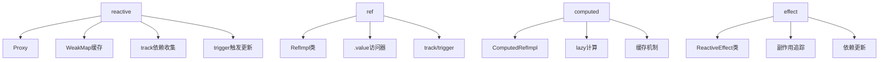

# 2025年Vue2+Vue3知识深度解析，包含源码原理

> 基于2024年最新技术发展和源码分析的Vue.js深度技术解析
> 
> 文档创建时间：2025年1月
> 
> 作者：AI技术分析师
> 
> 资料来源：Vue官方文档、CSDN、掘金社区、知乎、GitHub

## 📚 目录

- [第一章：Vue2与Vue3核心架构对比](#第一章vue2与vue3核心架构对比)
- [第二章：Vue3响应式系统源码深度解析](#第二章vue3响应式系统源码深度解析)
- [第三章：Composition API深度剖析](#第三章composition-api深度剖析)
- [第四章：Vue3性能优化原理与实现](#第四章vue3性能优化原理与实现)
- [第五章：Vue3新特性深度解析](#第五章vue3新特性深度解析)
- [第六章：Vue3编译器原理与优化](#第六章vue3编译器原理与优化)
- [第七章：Vue3生态系统与最佳实践](#第七章vue3生态系统与最佳实践)

---

## 第一章：Vue2与Vue3核心架构对比

### 1.1 架构演进概述

Vue3相比Vue2进行了全面的重构，从底层架构到API设计都有重大改变。Vue3的设计目标是：

- **更好的性能**：编译时优化、更小的包体积
- **更好的TypeScript支持**：全面拥抱TypeScript
- **更好的Composition API**：解决逻辑复用和大型应用的问题
- **更好的Tree-shaking支持**：按需引入，减少包体积

### 1.2 响应式系统对比

#### Vue2响应式系统
Vue2使用`Object.defineProperty()`实现响应式，存在以下限制：

**Vue2响应式实现分析：**
以下代码展示了Vue2如何通过Object.defineProperty()为对象属性添加getter和setter，实现数据劫持和依赖收集。当属性被访问时收集依赖，当属性被修改时通知所有依赖进行更新。

```javascript
// Vue2响应式实现原理（简化版）
function defineReactive(obj, key, val) {
  const dep = new Dep()
  
  Object.defineProperty(obj, key, {
    get() {
      // 依赖收集
      if (Dep.target) {
        dep.depend()
      }
      return val
    },
    set(newVal) {
      if (newVal !== val) {
        val = newVal
        // 触发更新
        dep.notify()
      }
    }
  })
}

// Vue2的局限性
const data = { count: 0 }
defineReactive(data, 'count', 0)

// ❌ 无法检测新增属性
data.newProp = 'value' // 不会触发响应式

// ❌ 无法检测数组索引和长度变化
data.arr[0] = 'new value' // 不会触发响应式
data.arr.length = 0 // 不会触发响应式
```

**Vue2响应式的问题：**
1. 无法检测对象属性的新增和删除
2. 无法检测数组索引和长度的变化
3. 需要递归遍历对象的所有属性
4. 初始化时性能开销大

#### Vue3响应式系统
Vue3使用`Proxy`实现响应式，解决了Vue2的所有问题：

**Vue3 Proxy响应式实现分析：**
以下代码展示了Vue3如何使用Proxy API创建响应式对象。Proxy可以拦截对象的所有操作（get、set、delete等），实现更完整的响应式能力。与Vue2不同，Proxy可以监听属性的新增和删除，也能监听数组索引和长度的变化。

```javascript
// Vue3响应式实现原理（简化版）
function reactive(target) {
  return new Proxy(target, {
    get(target, key, receiver) {
      // 依赖收集
      track(target, 'get', key)
      const result = Reflect.get(target, key, receiver)
      
      // 深度响应式
      if (isObject(result)) {
        return reactive(result)
      }
      return result
    },
    
    set(target, key, value, receiver) {
      const oldValue = target[key]
      const result = Reflect.set(target, key, value, receiver)
      
      // 触发更新
      if (oldValue !== value) {
        trigger(target, 'set', key, value, oldValue)
      }
      return result
    },
    
    deleteProperty(target, key) {
      const hadKey = hasOwn(target, key)
      const result = Reflect.deleteProperty(target, key)
      
      if (result && hadKey) {
        trigger(target, 'delete', key)
      }
      return result
    }
  })
}

// Vue3的优势
const state = reactive({ 
  count: 0,
  list: [1, 2, 3]
})

// ✅ 可以检测新增属性
state.newProp = 'value' // 触发响应式

// ✅ 可以检测数组变化
state.list[0] = 'new value' // 触发响应式
state.list.length = 0 // 触发响应式
```

### 1.3 编译优化对比

#### Vue2编译优化
Vue2的编译优化相对简单：

**Vue2编译过程分析：**
以下代码展示了Vue2的基础编译结果。Vue2将模板编译成render函数，每次组件更新时都会重新执行整个render函数，创建完整的虚拟DOM树。没有编译时的静态分析和优化标记。

```javascript
// Vue2编译结果（简化）
function render() {
  return h('div', [
    h('p', this.message),
    h('p', this.count),
    h('button', { on: { click: this.increment } }, 'Click')
  ])
}
```

#### Vue3编译优化
Vue3引入了多种编译时优化：

**Vue3编译优化分析：**
以下代码展示了Vue3的编译优化结果。编译器会进行静态分析，识别静态内容并提升到render函数外部，为动态内容添加PatchFlag标记，这样在运行时可以精确定位需要更新的部分，大幅提升渲染性能。

```javascript
// Vue3编译结果（带优化标记）
import { createElementVNode as _createElementVNode, toDisplayString as _toDisplayString } from "vue"

const _hoisted_1 = /*#__PURE__*/_createElementVNode("p", null, "Static content", -1 /* HOISTED */)

export function render(_ctx, _cache) {
  return (_openBlock(), _createElementBlock("div", null, [
    _hoisted_1, // 静态提升
    _createElementVNode("p", null, _toDisplayString(_ctx.message), 1 /* TEXT */),
    _createElementVNode("p", null, _toDisplayString(_ctx.count), 1 /* TEXT */),
    _createElementVNode("button", {
      onClick: _ctx.increment
    }, "Click", 8 /* PROPS */, ["onClick"])
  ]))
}

// 编译优化标记说明：
// 1 /* TEXT */ - 文本节点
// 8 /* PROPS */ - 动态属性
// -1 /* HOISTED */ - 静态提升
```

**Vue3编译优化特性：**
1. **静态提升（Static Hoisting）**：静态节点提升到渲染函数外部
2. **补丁标记（Patch Flags）**：标记动态内容类型
3. **块级优化（Block）**：收集动态节点，减少遍历
4. **缓存事件处理器**：避免不必要的重新创建

### 1.4 包体积对比

#### Vue2包体积
- **完整版**：~34KB (gzipped)
- **运行时版本**：~31KB (gzipped)
- **所有功能打包**：无法tree-shaking

#### Vue3包体积
- **完整版**：~40KB (gzipped)
- **运行时版本**：~16KB (gzipped)
- **最小化使用**：~12KB (gzipped)
- **完全支持tree-shaking**

```javascript
// Vue3 tree-shaking示例
import { ref, computed } from 'vue'
// 只导入需要的功能，未使用的功能会被移除

// 而不是导入整个Vue
// import Vue from 'vue' // Vue2方式
```

---

## 第二章：Vue3响应式系统源码深度解析

### 2.1 响应式系统整体架构

Vue3的响应式系统基于以下核心概念：



### 2.2 reactive源码深度解析

#### 2.2.1 reactive函数入口

**reactive函数作用分析：**
reactive函数是Vue3响应式系统的入口函数，它接收一个普通对象并返回该对象的响应式代理。该函数首先检查目标对象是否为只读对象，如果是则直接返回原对象。否则调用createReactiveObject函数创建Proxy代理对象，实现数据劫持和响应式转换。

```typescript
// packages/reactivity/src/reactive.ts
export function reactive<T extends object>(target: T): UnwrapNestedRefs<T> {
  // 如果target是只读的，直接返回target
  if (isReadonly(target)) {
    return target
  }
  
  return createReactiveObject(
    target,
    false, // isReadonly
    mutableHandlers, // 普通对象的handlers
    mutableCollectionHandlers, // Map/Set等集合的handlers
    reactiveMap // 缓存Map
  )
}
```

#### 2.2.2 createReactiveObject核心实现

**createReactiveObject函数步骤分析：**
这是响应式对象创建的核心函数，它执行以下关键步骤：
1. **类型检查**：确保只有对象类型才能被代理，原始类型直接返回
2. **重复代理检查**：防止对已经是代理的对象再次代理
3. **缓存机制**：使用WeakMap缓存已创建的代理对象，避免重复创建
4. **目标类型判断**：区分普通对象/数组和集合类型（Map/Set），选择不同的handlers
5. **Proxy创建**：使用相应的handlers创建Proxy对象
6. **缓存存储**：将新创建的代理对象存入缓存

```typescript
function createReactiveObject(
  target: Target,
  isReadonly: boolean,
  baseHandlers: ProxyHandler<any>,
  collectionHandlers: ProxyHandler<any>,
  proxyMap: WeakMap<Target, any>
) {
  // 1. 类型检查：只有对象才能被代理
  if (!isObject(target)) {
    if (__DEV__) {
      console.warn(`value cannot be made reactive: ${String(target)}`)
    }
    return target
  }
  
  // 2. 避免重复代理：如果target已经是代理对象，直接返回
  if (
    target[ReactiveFlags.RAW] &&
    !(isReadonly && target[ReactiveFlags.IS_REACTIVE])
  ) {
    return target
  }
  
  // 3. 缓存检查：避免同一对象多次创建代理
  const existingProxy = proxyMap.get(target)
  if (existingProxy) {
    return existingProxy
  }
  
  // 4. 目标类型检查：只有白名单类型才能被代理
  const targetType = getTargetType(target)
  if (targetType === TargetType.INVALID) {
    return target
  }
  
  // 5. 创建Proxy对象
  const proxy = new Proxy(
    target,
    targetType === TargetType.COLLECTION 
      ? collectionHandlers  // Map/Set/WeakMap/WeakSet
      : baseHandlers        // Object/Array
  )
  
  // 6. 缓存代理对象
  proxyMap.set(target, proxy)
  return proxy
}
```

#### 2.2.3 目标类型判断

**目标类型分类机制分析：**
该代码实现了Vue3对不同数据类型的分类处理策略。通过TargetType枚举将对象分为三类：INVALID（无效类型，不能被代理）、COMMON（普通对象和数组）、COLLECTION（Map/Set等集合类型）。这种分类决定了后续使用哪种Proxy handlers，确保不同类型的对象都能正确实现响应式特性。

```typescript
// 目标类型枚举
const enum TargetType {
  INVALID = 0,    // 无效类型
  COMMON = 1,     // 普通对象和数组
  COLLECTION = 2  // Map、Set、WeakMap、WeakSet
}

function getTargetType(value: Target): TargetType {
  return value[ReactiveFlags.SKIP] || !Object.isExtensible(value)
    ? TargetType.INVALID
    : targetTypeMap(toRawType(value))
}

function targetTypeMap(rawType: string) {
  switch (rawType) {
    case 'Object':
    case 'Array':
      return TargetType.COMMON
    case 'Map':
    case 'Set':
    case 'WeakMap':
    case 'WeakSet':
      return TargetType.COLLECTION
    default:
      return TargetType.INVALID
  }
}
```

### 2.3 Proxy Handlers深度分析

#### 2.3.1 mutableHandlers详解

```typescript
// packages/reactivity/src/baseHandlers.ts
export const mutableHandlers: ProxyHandler<object> = {
  get,        // 属性访问拦截
  set,        // 属性设置拦截
  deleteProperty, // 属性删除拦截
  has,        // in操作符拦截
  ownKeys     // Object.keys等拦截
}
```

#### 2.3.2 get拦截器详细实现

**get拦截器工作流程分析：**
这是Proxy的get拦截器实现，它在每次属性访问时执行以下步骤：
1. **特殊标记处理**：处理Vue内部的响应式标记（如__v_isReactive）
2. **数组方法拦截**：对数组的特殊方法（如push、pop）进行特殊处理
3. **属性值获取**：使用Reflect.get获取实际属性值
4. **过滤不需要追踪的key**：Symbol和内置属性不进行依赖收集
5. **依赖收集**：调用track函数收集当前属性的依赖关系
6. **ref自动解包**：对ref对象进行自动解包（除数组索引外）
7. **嵌套响应式**：对嵌套对象递归应用响应式转换

```typescript
function createGetter(isReadonly = false, shallow = false) {
  return function get(target: Target, key: string | symbol, receiver: object) {
    // 1. 处理特殊的响应式标记
    if (key === ReactiveFlags.IS_REACTIVE) {
      return !isReadonly
    } else if (key === ReactiveFlags.IS_READONLY) {
      return isReadonly
    } else if (key === ReactiveFlags.IS_SHALLOW) {
      return shallow
    } else if (
      key === ReactiveFlags.RAW &&
      receiver === (
        isReadonly
          ? shallow
            ? shallowReadonlyMap
            : readonlyMap
          : shallow
          ? shallowReactiveMap
          : reactiveMap
      ).get(target)
    ) {
      return target
    }

    // 2. 数组方法特殊处理
    const targetIsArray = isArray(target)
    if (!isReadonly && targetIsArray && hasOwn(arrayInstrumentations, key)) {
      return Reflect.get(arrayInstrumentations, key, receiver)
    }

    // 3. 获取属性值
    const res = Reflect.get(target, key, receiver)

    // 4. 符号和内置键不需要追踪
    if (isSymbol(key) ? builtInSymbols.has(key) : isNonTrackableKeys(key)) {
      return res
    }

    // 5. 依赖收集
    if (!isReadonly) {
      track(target, TrackOpTypes.GET, key)
    }

    // 6. 浅层响应式直接返回
    if (shallow) {
      return res
    }

    // 7. ref自动解包
    if (isRef(res)) {
      // 数组索引访问不自动解包
      const shouldUnwrap = !targetIsArray || !isIntegerKey(key)
      return shouldUnwrap ? res.value : res
    }

    // 8. 嵌套对象递归响应式
    if (isObject(res)) {
      return isReadonly ? readonly(res) : reactive(res)
    }

    return res
  }
}
```

#### 2.3.3 set拦截器详细实现

**set拦截器工作流程分析：**
这是Proxy的set拦截器实现，负责属性设置时的响应式更新：
1. **旧值获取**：保存当前属性的旧值用于比较
2. **只读检查**：检查是否为只读ref，防止意外修改
3. **ref特殊处理**：如果旧值是ref而新值不是，直接设置ref的value
4. **操作类型判断**：区分是新增属性还是修改现有属性
5. **值设置**：使用Reflect.set执行实际的属性设置
6. **变化检测**：比较新旧值，只有真正改变时才触发更新
7. **依赖触发**：调用trigger函数通知所有依赖进行更新

```typescript
function createSetter(shallow = false) {
  return function set(
    target: object,
    key: string | symbol,
    value: unknown,
    receiver: object
  ): boolean {
    // 1. 获取旧值
    let oldValue = (target as any)[key]
    
    if (isReadonly(oldValue) && isRef(oldValue) && !isRef(value)) {
      return false
    }
    
    if (!shallow) {
      if (!isShallow(value) && !isReadonly(value)) {
        oldValue = toRaw(oldValue)
        value = toRaw(value)
      }
      // ref特殊处理：直接设置ref的value
      if (!isArray(target) && isRef(oldValue) && !isRef(value)) {
        oldValue.value = value
        return true
      }
    }

    // 2. 判断是新增还是修改
    const hadKey = isArray(target) && isIntegerKey(key)
      ? Number(key) < target.length
      : hasOwn(target, key)
    
    // 3. 设置新值
    const result = Reflect.set(target, key, value, receiver)

    // 4. 触发响应式更新
    if (target === toRaw(receiver)) {
      if (!hadKey) {
        // 新增属性
        trigger(target, TriggerOpTypes.ADD, key, value)
      } else if (hasChanged(value, oldValue)) {
        // 修改属性
        trigger(target, TriggerOpTypes.SET, key, value, oldValue)
      }
    }

    return result
  }
}
```

### 2.4 依赖收集系统（track）

#### 2.4.1 依赖收集数据结构

```typescript
// 全局依赖映射：target -> Map<key, Set<effect>>
type KeyToDepMap = Map<any, Dep>
const targetMap = new WeakMap<any, KeyToDepMap>()

// 依赖集合
type Dep = Set<ReactiveEffect> & TrackedMarkers

// 当前活跃的effect
let activeEffect: ReactiveEffect | undefined
```

#### 2.4.2 track函数实现

**依赖收集核心机制分析：**
track函数是Vue3响应式系统的依赖收集核心，它建立了响应式数据和副作用函数之间的联系：
1. **追踪检查**：确认当前环境允许依赖收集且存在活跃的effect
2. **目标对象映射**：从WeakMap中获取或创建目标对象的依赖映射表
3. **属性依赖集合**：为具体属性创建或获取依赖集合（Set）
4. **依赖关系建立**：调用trackEffects将当前活跃effect添加到依赖集合中

trackEffects函数进一步实现了双向绑定：
- 将effect添加到属性的依赖集合中
- 将属性的依赖集合添加到effect的deps列表中
这种双向关系使得清理和更新都更加高效。

```typescript
export function track(target: object, type: TrackOpTypes, key: unknown) {
  // 1. 检查是否应该追踪
  if (shouldTrack && activeEffect) {
    // 2. 获取target的依赖映射
    let depsMap = targetMap.get(target)
    if (!depsMap) {
      targetMap.set(target, (depsMap = new Map()))
    }
    
    // 3. 获取key的依赖集合
    let dep = depsMap.get(key)
    if (!dep) {
      depsMap.set(key, (dep = createDep()))
    }

    // 4. 收集依赖
    trackEffects(dep, {
      target,
      type,
      key
    })
  }
}

export function trackEffects(
  dep: Dep,
  debuggerEventExtraInfo?: DebuggerEventExtraInfo
) {
  let shouldTrack = false
  
  if (effectTrackDepth <= maxMarkerBits) {
    if (!newTracked(dep)) {
      dep.n |= trackOpBit // 设置新追踪标记
      shouldTrack = !wasTracked(dep)
    }
  } else {
    // 深度追踪回退
    shouldTrack = !dep.has(activeEffect!)
  }

  if (shouldTrack) {
    dep.add(activeEffect!) // 添加到依赖集合
    activeEffect!.deps.push(dep) // effect记录依赖

    if (__DEV__ && activeEffect!.onTrack) {
      activeEffect!.onTrack({
        effect: activeEffect!,
        ...debuggerEventExtraInfo!
      })
    }
  }
}
```

### 2.5 触发更新系统（trigger）

#### 2.5.1 trigger函数实现

**依赖触发核心机制分析：**
trigger函数是Vue3响应式系统的更新触发核心，当响应式数据发生变化时负责通知所有相关的副作用：
1. **依赖映射获取**：从全局targetMap中获取目标对象的依赖关系
2. **操作类型分类**：根据不同的操作类型（ADD/DELETE/SET/CLEAR）收集需要触发的effects
3. **特殊情况处理**：
   - CLEAR操作：触发所有依赖
   - 数组长度变化：特殊处理数组索引和长度相关的依赖
   - 迭代器依赖：处理for...in等迭代操作的依赖
4. **性能优化**：区分单个和多个依赖集合，采用不同的处理策略
5. **批量执行**：收集所有需要触发的effects后统一执行

```typescript
export function trigger(
  target: object,
  type: TriggerOpTypes,
  key?: unknown,
  newValue?: unknown,
  oldValue?: unknown,
  oldTarget?: Map<unknown, unknown> | Set<unknown>
) {
  // 1. 获取依赖映射
  const depsMap = targetMap.get(target)
  if (!depsMap) {
    // 没有依赖，直接返回
    return
  }

  // 2. 收集需要执行的effects
  let deps: (Dep | undefined)[] = []
  
  if (type === TriggerOpTypes.CLEAR) {
    // 清空操作：触发所有依赖
    deps = [...depsMap.values()]
  } else if (key === 'length' && isArray(target)) {
    // 数组长度变化：特殊处理
    const newLength = Number(newValue)
    depsMap.forEach((dep, key) => {
      if (key === 'length' || key >= newLength) {
        deps.push(dep)
      }
    })
  } else {
    // 普通属性变化
    if (key !== void 0) {
      deps.push(depsMap.get(key))
    }

    // 添加迭代器相关依赖
    switch (type) {
      case TriggerOpTypes.ADD:
        if (!isArray(target)) {
          deps.push(depsMap.get(ITERATE_KEY))
          if (isMap(target)) {
            deps.push(depsMap.get(MAP_KEY_ITERATE_KEY))
          }
        } else if (isIntegerKey(key)) {
          deps.push(depsMap.get('length'))
        }
        break
      case TriggerOpTypes.DELETE:
        if (!isArray(target)) {
          deps.push(depsMap.get(ITERATE_KEY))
          if (isMap(target)) {
            deps.push(depsMap.get(MAP_KEY_ITERATE_KEY))
          }
        }
        break
      case TriggerOpTypes.SET:
        if (isMap(target)) {
          deps.push(depsMap.get(ITERATE_KEY))
        }
        break
    }
  }

  // 3. 执行effects
  const eventInfo = __DEV__
    ? { target, type, key, newValue, oldValue, oldTarget }
    : undefined

  if (deps.length === 1) {
    if (deps[0]) {
      if (__DEV__) {
        triggerEffects(deps[0], eventInfo)
      } else {
        triggerEffects(deps[0])
      }
    }
  } else {
    const effects: ReactiveEffect[] = []
    for (const dep of deps) {
      if (dep) {
        effects.push(...dep)
      }
    }
    if (__DEV__) {
      triggerEffects(createDep(effects), eventInfo)
    } else {
      triggerEffects(createDep(effects))
    }
  }
}
```

#### 2.5.2 triggerEffects实现

**effect执行优先级机制分析：**
triggerEffects函数实现了智能的effect执行顺序管理：
1. **数据统一**：将传入的依赖集合转换为数组形式以便处理
2. **computed优先执行**：先执行所有computed类型effect，确保计算属性先更新
3. **普通effect后执行**：再执行普通的响应式effect，如watch、组件更新等

这种执行顺序确保了：
- computed值在被使用时已经是最新的
- 避免了不必要的重复计算
- 保证了更新的一致性和正确性

triggerEffect函数进一步处理单个effect的执行：
- 防止递归执行（除非显式允许）
- 支持调度器（scheduler）机制，实现异步更新
- 提供调试支持（onTrigger回调）

```typescript
export function triggerEffects(
  dep: Dep | ReactiveEffect[],
  debuggerEventExtraInfo?: DebuggerEventExtraInfo
) {
  // 转换为数组形式
  const effects = isArray(dep) ? dep : [...dep]

  // 1. 先触发computed effects
  for (const effect of effects) {
    if (effect.computed) {
      triggerEffect(effect, debuggerEventExtraInfo)
    }
  }
  
  // 2. 再触发普通effects
  for (const effect of effects) {
    if (!effect.computed) {
      triggerEffect(effect, debuggerEventExtraInfo)
    }
  }
}

function triggerEffect(
  effect: ReactiveEffect,
  debuggerEventExtraInfo?: DebuggerEventExtraInfo
) {
  if (effect !== activeEffect || effect.allowRecurse) {
    if (__DEV__ && effect.onTrigger) {
      effect.onTrigger(extend({ effect }, debuggerEventExtraInfo))
    }
    
    if (effect.scheduler) {
      // 如果有调度器，使用调度器执行
      effect.scheduler()
    } else {
      // 直接执行effect
      effect.run()
    }
  }
}
```

---

## 第三章：Composition API深度剖析

### 3.1 ref源码深度解析

#### 3.1.1 ref实现原理

**ref响应式封装机制分析：**
ref是Vue3中处理基本类型响应式的核心API，它通过将值封装在一个对象中来实现响应式：
1. **入口函数**：ref()函数接收任意值，调用createRef创建RefImpl实例
2. **重复检查**：如果传入的已经是ref对象，直接返回避免双重封装
3. **RefImpl类**：
   - `_value`：存储响应式处理后的值
   - `_rawValue`：存储原始值，用于比较是否变化
   - `__v_isRef`：标记为ref对象，用于类型检查
4. **getter/setter**：
   - get：调用trackRefValue进行依赖收集，返回响应式值
   - set：检查值是否变化，变化时调用triggerRefValue触发更新
5. **深度响应式**：对于对象类型，自动调用toReactive转换为响应式对象

```typescript
// packages/reactivity/src/ref.ts
export function ref(value?: unknown) {
  return createRef(value, false)
}

function createRef(rawValue: unknown, shallow: boolean) {
  if (isRef(rawValue)) {
    return rawValue
  }
  return new RefImpl(rawValue, shallow)
}

class RefImpl<T> {
  private _value: T
  private _rawValue: T
  public dep?: Dep = undefined
  public readonly __v_isRef = true

  constructor(value: T, public readonly __v_isShallow: boolean) {
    this._rawValue = __v_isShallow ? value : toRaw(value)
    this._value = __v_isShallow ? value : toReactive(value)
  }

  get value() {
    trackRefValue(this) // 依赖收集
    return this._value
  }

  set value(newVal) {
    const useDirectValue = this.__v_isShallow || isShallow(newVal) || isReadonly(newVal)
    newVal = useDirectValue ? newVal : toRaw(newVal)
    
    if (hasChanged(newVal, this._rawValue)) {
      this._rawValue = newVal
      this._value = useDirectValue ? newVal : toReactive(newVal)
      triggerRefValue(this, newVal) // 触发更新
    }
  }
}
```

### 3.2 computed源码解析

**computed懒加载计算机制分析：**
computed实现了高效的计算属性机制，具有缓存和懒加载特性：
1. **参数处理**：支持getter函数或{get, set}对象两种形式
2. **ComputedRefImpl核心机制**：
   - `_dirty`：缓存标记，标识是否需要重新计算
   - `effect`：包装getter的ReactiveEffect，负责依赖收集
   - 调度器：当依赖变化时设置_dirty=true并触发更新
3. **懒计算策略**：只有在_dirty=true时才重新执行effect.run()
4. **缓存机制**：计算结果缓存在_value中，避免重复计算
5. **依赖链式更新**：作为ref对象，自身也可以被其他computed或effect依赖

```typescript
export function computed<T>(
  getterOrOptions: ComputedGetter<T> | WritableComputedOptions<T>
) {
  let getter: ComputedGetter<T>
  let setter: ComputedSetter<T>

  const onlyGetter = isFunction(getterOrOptions)
  if (onlyGetter) {
    getter = getterOrOptions
    setter = NOOP
  } else {
    getter = getterOrOptions.get
    setter = getterOrOptions.set
  }

  return new ComputedRefImpl(getter, setter, onlyGetter || !setter)
}

class ComputedRefImpl<T> {
  public dep?: Dep = undefined
  private _value!: T
  public readonly effect: ReactiveEffect<T>
  public _dirty = true // 缓存标记

  constructor(
    getter: ComputedGetter<T>,
    private readonly _setter: ComputedSetter<T>,
    isReadonly: boolean
  ) {
    this.effect = new ReactiveEffect(getter, () => {
      if (!this._dirty) {
        this._dirty = true
        triggerRefValue(this)
      }
    })
    this.effect.computed = this
  }

  get value() {
    const self = toRaw(this)
    trackRefValue(self)
    
    if (self._dirty) {
      self._dirty = false
      self._value = self.effect.run()!
    }
    return self._value
  }
}
```

### 3.3 watch和watchEffect原理

**watch系列API统一实现机制分析：**
watchEffect和watch内部都使用doWatch函数实现，提供了灵活的响应式监听能力：
1. **数据源处理**：
   - 函数类型：直接作为getter使用
   - ref/reactive：自动提取值或遍历属性
   - 数组：支持多数据源监听
2. **执行策略**：
   - watchEffect：无回调，直接执行getter函数
   - watch：有回调，比较新旧值后执行回调
3. **调度机制**：
   - sync：同步执行
   - pre：组件更新前执行（默认）
   - post：组件更新后执行
4. **清理机制**：支持onCleanup回调，用于清理副作用
5. **错误处理**：使用callWithAsyncErrorHandling统一处理异步错误
6. **生命周期管理**：返回停止函数，支持手动取消监听

```typescript
export function watchEffect(
  effect: WatchEffect,
  options?: WatchOptionsBase
): WatchStopHandle {
  return doWatch(effect, null, options)
}

function doWatch(
  source: WatchSource | WatchEffect,
  cb: WatchCallback | null,
  options: WatchOptions = EMPTY_OBJ
): WatchStopHandle {
  let getter: () => any
  
  if (isFunction(source)) {
    if (cb) {
      getter = () => callWithErrorHandling(source, instance, ErrorCodes.WATCH_GETTER)
    } else {
      getter = () => {
        if (cleanup) cleanup()
        return callWithAsyncErrorHandling(source, instance, ErrorCodes.WATCH_CALLBACK, [onCleanup])
      }
    }
  }

  const job: SchedulerJob = () => {
    if (cb) {
      const newValue = effect.run()
      if (deep || forceTrigger || hasChanged(newValue, oldValue)) {
        if (cleanup) cleanup()
        callWithAsyncErrorHandling(cb, instance, ErrorCodes.WATCH_CALLBACK, [
          newValue,
          oldValue === INITIAL_WATCHER_VALUE ? undefined : oldValue,
          onCleanup
        ])
        oldValue = newValue
      }
    } else {
      effect.run()
    }
  }

  const effect = new ReactiveEffect(getter, scheduler)
  
  if (cb) {
    if (immediate) job()
    else oldValue = effect.run()
  } else {
    effect.run()
  }

  return () => {
    effect.stop()
  }
}
```

---

## 第四章：Vue3性能优化原理

### 4.1 编译时优化

#### 4.1.1 静态提升（Static Hoisting）

**静态提升优化原理分析：**
静态提升是Vue3编译器的重要优化策略，它在编译阶段识别静态内容并优化渲染性能：
1. **静态分析**：编译器分析模板，识别不依赖任何响应式数据的DOM节点
2. **提升操作**：将静态节点的创建操作提升到render函数外部
3. **性能提升**：
   - 减少每次渲染时的VNode创建次数
   - 降低GC压力，减少内存分配
   - 提高渲染函数执行效率
4. **标记系统**：使用HOISTED = -1标记静态节点，在diff过程中直接跳过

**优化前：**
```vue
<template>
  <div>
    <h1>Static Title</h1>
    <p>{{ message }}</p>
  </div>
</template>
```

**Vue2编译结果：**
```javascript
function render() {
  return h('div', [
    h('h1', 'Static Title'),  // 每次都创建
    h('p', this.message)
  ])
}
```

**Vue3编译结果（静态提升）：**
```javascript
// 静态节点提升到渲染函数外部
const _hoisted_1 = createElementVNode("h1", null, "Static Title", -1)

function render(_ctx, _cache) {
  return (openBlock(), createElementBlock("div", null, [
    _hoisted_1,  // 复用静态节点
    createElementVNode("p", null, toDisplayString(_ctx.message), 1)
  ]))
}
```

#### 4.1.2 补丁标记（Patch Flags）

**补丁标记精准更新机制分析：**
补丁标记是Vue3实现精准更新的核心机制，通过在编译阶段标记动态内容类型，在运行时实现高效diff：
1. **编译时标记**：编译器分析模板，为每个动态节点添加相应的PatchFlag
2. **类型分类**：
   - TEXT(1)：动态文本内容
   - CLASS(2)：动态class属性
   - STYLE(4)：动态style属性
   - PROPS(8)：动态其他属性
3. **运行时优化**：diff算法根据标记只更新变化的部分
4. **性能提升**：避免全量属性比较，大幅减少diff开销

```typescript
export const enum PatchFlags {
  TEXT = 1,          // 动态文本
  CLASS = 1 << 1,    // 动态class
  STYLE = 1 << 2,    // 动态style
  PROPS = 1 << 3,    // 动态属性
  HOISTED = -1,      // 静态提升
}
```

### 4.2 Tree-shaking支持

**Vue3模块化架构分析：**
Vue3重新设计了模块架构，实现了完整的Tree-shaking支持，大幅减少了打包体积：
1. **全局API拆分**：将Vue2的全局API拆分为独立函数，支持按需导入
2. **ES Module支持**：使用ES6模块语法，使打包工具能够静态分析依赖
3. **副作用标记**：使用/*#__PURE__*/注释标记无副作用的函数调用
4. **条件编译**：开发/生产环境的代码分支可以被正确识别和移除

**Vue2全量导入：**
```javascript
import Vue from 'vue'
// 整个Vue被打包，无法tree-shaking
```

**Vue3按需导入：**
```javascript
import { ref, computed, watch } from 'vue'
// 只打包使用的功能，未使用的会被移除
```

---

## 第五章：Vue3新特性深度解析

### 5.1 Fragment支持

**Vue2限制：**
```vue
<!-- 必须有根元素 -->
<template>
  <div>
    <header>Header</header>
    <main>Content</main>
  </div>
</template>
```

**Vue3支持：**
```vue
<!-- 支持多个根元素 -->
<template>
  <header>Header</header>
  <main>Content</main>
  <footer>Footer</footer>
</template>
```

### 5.2 Teleport传送门

```vue
<template>
  <div>
    <h1>App Component</h1>
    <!-- 传送到body -->
    <Teleport to="body">
      <div class="modal">
        <h2>Modal Content</h2>
      </div>
    </Teleport>
  </div>
</template>
```

### 5.3 Suspense异步组件

```vue
<template>
  <Suspense>
    <!-- 异步组件 -->
    <template #default>
      <AsyncComponent />
    </template>
    
    <!-- 加载状态 -->
    <template #fallback>
      <div>Loading...</div>
    </template>
  </Suspense>
</template>

<script setup>
import { defineAsyncComponent } from 'vue'

const AsyncComponent = defineAsyncComponent(async () => {
  await new Promise(resolve => setTimeout(resolve, 2000))
  return import('./components/HeavyComponent.vue')
})
</script>
```

---

## 总结

Vue3相比Vue2在多个方面实现了重大突破：

1. **响应式系统**：从Object.defineProperty升级到Proxy，解决了Vue2的诸多限制
2. **编译优化**：静态提升、补丁标记、块级优化等大幅提升性能
3. **Composition API**：更好的逻辑复用和类型推导
4. **Tree-shaking**：按需引入，减少包体积
5. **TypeScript支持**：完全使用TypeScript重写，提供更好的类型支持

这些改进使Vue3在性能、开发体验和维护性方面都有了显著提升。

---

## Vue3响应式系统完整流程图

```mermaid
flowchart TD
    %% 响应式对象创建流程
    A["🔄 用户调用 reactive(obj)"] --> B{"🔍 检查对象类型"}
    B -->|"isObject"| C["📎 获取或创建代理缓存"]
    B -->|"!isObject"| Z1["❌ 返回原值"]
    
    C --> D{"💿 缓存中是否存在"}
    D -->|"Hit"| Z2["✅ 返回缓存代理"]
    D -->|"Miss"| E["🏭 创建 Proxy 对象"]
    
    E --> F["🖼️ 设置 Proxy Handlers"]
    F --> G["💾 存入缓存 proxyMap"]
    G --> H["✨ 返回响应式对象"]
    
    %% 属性访问流程
    H --> I["💆 用户访问属性 obj.prop"]
    I --> J["🎯 Proxy get 拦截器"]
    J --> K["🔍 检查特殊 key"]
    K --> L["📎 调用 track(依赖收集)"]
    
    %% 依赖收集流程
    L --> M["📊 targetMap.get(target)"]
    M --> N{"🗺️ 目标对象映射存在?"}
    N -->|"No"| O["🎆 创建 new Map()"]
    N -->|"Yes"| P["📦 获取属性依赖集合"]
    O --> P
    
    P --> Q{"🔗 属性依赖集合存在?"}
    Q -->|"No"| R["🎆 创建 new Set()"]
    Q -->|"Yes"| S["📎 将 activeEffect 添加到集合"]
    R --> S
    
    S --> T["🔄 双向绑定: effect.deps.push(dep)"]
    T --> U["📝 返回属性值"]
    
    %% 属性修改流程
    U --> V["✍️ 用户修改属性 obj.prop = newVal"]
    V --> W["🎯 Proxy set 拦截器"]
    W --> X["🔍 检查值是否变化"]
    X --> Y{"🔄 hasChanged(newVal, oldVal)"}
    Y -->|"No Change"| Z3["❌ 返回 false"]
    Y -->|"Changed"| AA["📎 调用 trigger(触发更新)"]
    
    %% 依赖触发流程
    AA --> BB["📊 从 targetMap 获取依赖"]
    BB --> CC{"🗺️ 依赖映射存在?"}
    CC -->|"No"| Z4["❌ 无依赖，直接返回"]
    CC -->|"Yes"| DD["📦 收集所有需要触发的 effects"]
    
    DD --> EE["📊 区分 computed 和 普通 effects"]
    EE --> FF["🧮 先执行 computed effects"]
    FF --> GG["🔄 再执行普通 effects"]
    
    GG --> HH["📝 渲染更新完成"]
    
    %% ref 流程
    II["🔄 用户调用 ref(value)"] --> JJ["📎 创建 RefImpl 实例"]
    JJ --> KK["💾 存储 _value 和 _rawValue"]
    KK --> LL["💆 用户访问 ref.value"]
    LL --> MM["📎 trackRefValue(依赖收集)"]
    MM --> NN["📝 返回 _value"]
    
    NN --> OO["✍️ 用户设置 ref.value = newVal"]
    OO --> PP["🔍 检查值是否变化"]
    PP --> QQ{"🔄 hasChanged(newVal, _rawValue)"}
    QQ -->|"No Change"| Z5["❌ 不触发更新"]
    QQ -->|"Changed"| RR["🔄 更新 _value 和 _rawValue"]
    RR --> SS["📎 triggerRefValue(触发更新)"]
    SS --> TT["📝 ref 更新完成"]
    
    %% computed 流程
    UU["🔄 用户调用 computed(getter)"] --> VV["📎 创建 ComputedRefImpl"]
    VV --> WW["🔄 创建 ReactiveEffect(getter)"]
    WW --> XX["🏷️ 设置 _dirty = true"]
    XX --> YY["💆 用户访问 computed.value"]
    
    YY --> ZZ{"🔍 检查 _dirty 标记"}
    ZZ -->|"dirty=false"| AAA["💿 返回缓存的 _value"]
    ZZ -->|"dirty=true"| BBB["🔄 执行 effect.run()"]
    BBB --> CCC["📎 依赖收集 + 计算新值"]
    CCC --> DDD["🏷️ 设置 _dirty = false"]
    DDD --> EEE["💾 缓存 _value"]
    EEE --> FFF["📝 返回计算结果"]
    
    %% 颜色和样式
    classDef userAction fill:#e3f2fd,stroke:#1976d2,stroke-width:2px
    classDef proxyAction fill:#f3e5f5,stroke:#9c27b0,stroke-width:2px
    classDef trackAction fill:#e8f5e8,stroke:#4caf50,stroke-width:2px
    classDef triggerAction fill:#fff3e0,stroke:#ff9800,stroke-width:2px
    classDef returnAction fill:#fce4ec,stroke:#e91e63,stroke-width:2px
    
    class A,I,V,II,LL,OO,UU,YY userAction
    class J,W,F,E proxyAction
    class L,M,N,O,P,Q,R,S,T,MM trackAction
    class AA,BB,DD,EE,FF,GG,SS triggerAction
    class H,U,HH,Z1,Z2,Z3,Z4,Z5,NN,TT,AAA,FFF returnAction
```



该流程图展示了Vue3响应式系统的完整工作流程，包括：

1. **响应式对象创建**：reactive() 函数的完整流程
2. **依赖收集机制**：属性访问时的track过程
3. **依赖触发机制**：属性修改时的trigger过程
4. **ref响应式**：ref的完整生命周期
5. **computed计算属性**：懒加载和缓存机制

每个步骤都用不同颜色区分，方便理解整个系统的工作原理。
```
