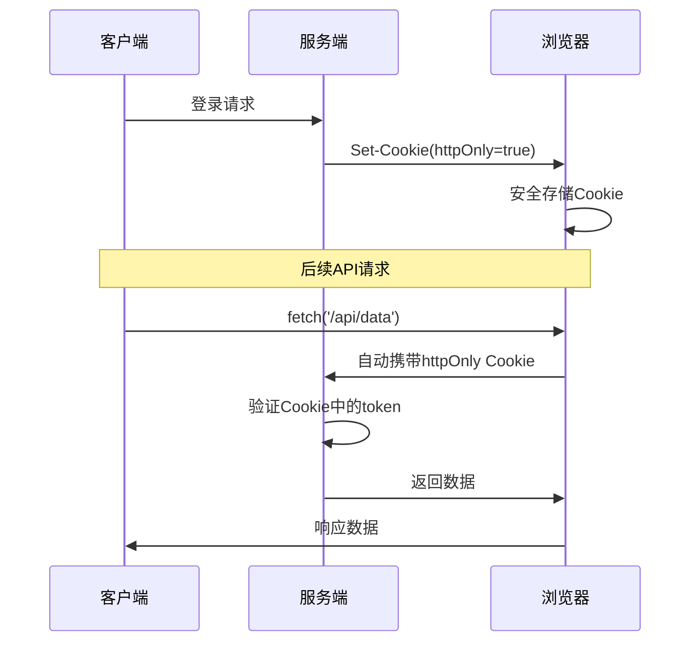
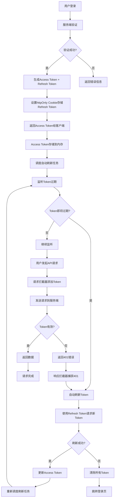
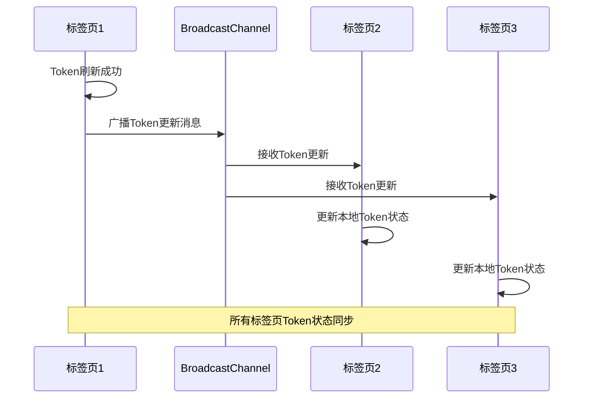
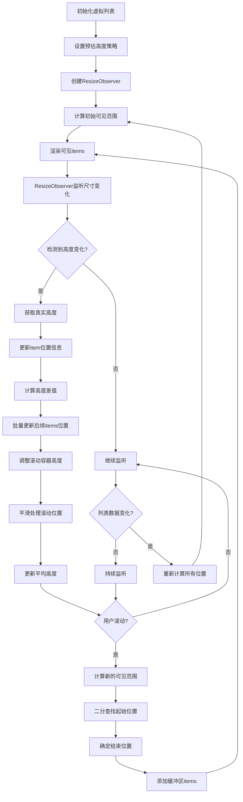
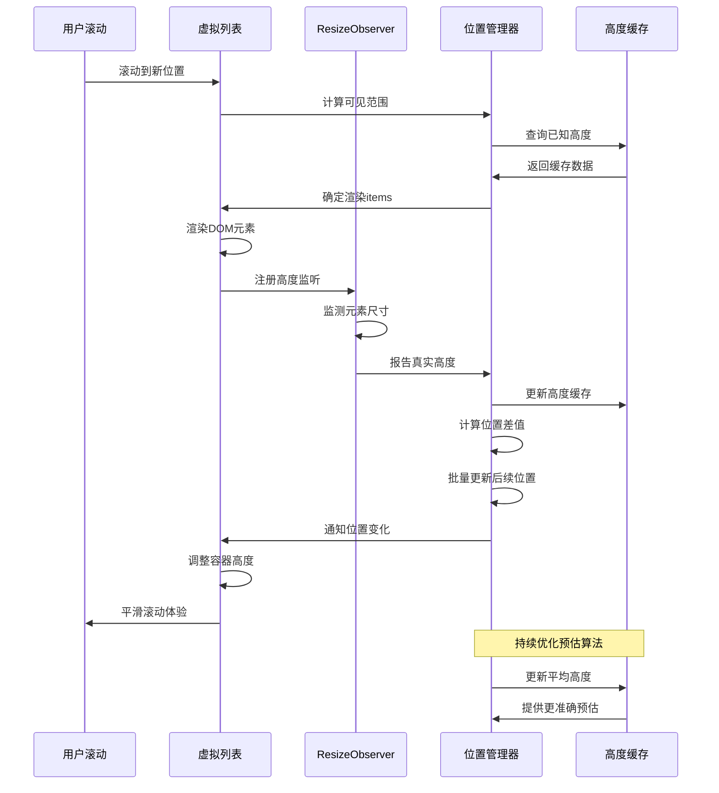
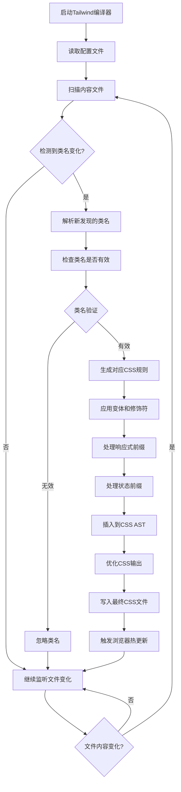

# 2025年前端面试标准答案

> 基于最新技术发展趋势和企业实际需求整理

## 1. forEach和map区别和是否可以中断

### 核心区别
- **forEach**: 用于遍历数组，无返回值（返回undefined），主要用于执行副作用操作
- **map**: 用于遍历数组并返回新数组，每个元素经过处理后放入新数组

### 是否可以中断
- **forEach**: 不能使用`break`或`continue`中断，因为它不是循环结构而是回调函数
- **map**: 同样不能中断，但可以通过抛出异常来强制中断（不推荐）

### 替代方案
- 需要中断可以使用：`for...of`、`some()`、`every()`、`find()`等
- 2025年推荐使用`for...of`配合`break`语句

```javascript
// forEach - 不可中断
[1,2,3,4].forEach(item => {
  console.log(item);
  // break; // 语法错误
});

// 替代方案 - 可中断
for (const item of [1,2,3,4]) {
  console.log(item);
  if (item === 2) break; // 有效
}
```

## 2. cookie、sessionStorage、localStorage的区别和作用域

### 存储容量
- **Cookie**: 4KB，数量限制（通常50个/域名）
- **sessionStorage**: 5-10MB（浏览器差异）
- **localStorage**: 5-10MB（浏览器差异）

### 生命周期
- **Cookie**: 可设置过期时间，默认会话结束时删除
- **sessionStorage**: 标签页关闭时清除
- **localStorage**: 永久存储，除非手动清除

### 作用域
- **Cookie**: 同源（协议+域名+端口）+ 路径限制，可跨标签页
- **sessionStorage**: 同源 + 同标签页（每个标签页独立）
- **localStorage**: 同源，可跨标签页共享

### 服务器交互
- **Cookie**: 自动发送到服务器（HTTP请求头）
- **sessionStorage/localStorage**: 仅客户端存储，不发送到服务器

### 2025年最佳实践
- 敏感信息避免使用localStorage
- 大数据优先考虑IndexedDB
- 跨标签通信使用BroadcastChannel API

### 2025年存储安全最佳实践

```javascript
// ❌ 不安全的做法
localStorage.setItem('token', userToken); // XSS攻击风险
document.cookie = `token=${userToken}`; // CSRF攻击风险

// ✅ 安全的做法
// 1. 敏感数据使用 httpOnly Cookie
// 服务端设置
res.cookie('token', userToken, {
  httpOnly: true,    // 防止XSS
  secure: true,      // 只在HTTPS下传输
  sameSite: 'strict' // 防止CSRF
});

// 2. 客户端数据加密存储
import CryptoJS from 'crypto-js';

const encryptData = (data, secretKey) => {
  return CryptoJS.AES.encrypt(JSON.stringify(data), secretKey).toString();
};

const decryptData = (encryptedData, secretKey) => {
  const bytes = CryptoJS.AES.decrypt(encryptedData, secretKey);
  return JSON.parse(bytes.toString(CryptoJS.enc.Utf8));
};

// 安全存储
const secureStorage = {
  setItem(key, value) {
    const encrypted = encryptData(value, 'your-secret-key');
    localStorage.setItem(key, encrypted);
  },
  
  getItem(key) {
    const encrypted = localStorage.getItem(key);
    return encrypted ? decryptData(encrypted, 'your-secret-key') : null;
  }
};
```

### 存储容量实际测试（2025年浏览器）

```javascript
// 测试存储容量
function testStorageCapacity(storage) {
  let data = '';
  let size = 0;
  
  try {
    // 每次增加1MB数据
    const oneMB = 'x'.repeat(1024 * 1024);
    
    while (true) {
      storage.setItem('test', data + oneMB);
      data += oneMB;
      size += 1;
    }
  } catch (e) {
    storage.removeItem('test');
    return `${size}MB (实际: ${data.length / (1024 * 1024).toFixed(2)}MB)`;
  }
}

// 测试结果
console.log('LocalStorage容量:', testStorageCapacity(localStorage));
console.log('SessionStorage容量:', testStorageCapacity(sessionStorage));
```

## 3. token是什么

### 定义
Token是一种用于身份验证和授权的加密字符串，代表用户的身份凭证。

### JWT（JSON Web Token）结构
```
Header.Payload.Signature
```

- **Header**: 算法和类型信息
- **Payload**: 用户信息和声明
- **Signature**: 防篡改签名

### 2025年Token存储最佳实践

#### 存储方案对比
| 存储方式 | 安全性 | 持久性 | 适用场景 | 风险 |
|---------|--------|--------|---------|------|
| 内存存储 | ⭐⭐⭐⭐⭐ | ❌ | Access Token | 页面刷新丢失 |
| httpOnly Cookie | ⭐⭐⭐⭐ | ✅ | Refresh Token | CSRF攻击 |
| localStorage | ⭐⭐ | ✅ | 备用方案 | XSS攻击 |
| sessionStorage | ⭐⭐⭐ | ❌ | 临时存储 | XSS攻击+标签页关闭丢失 |

**httpOnly Cookie实现详解：**

httpOnly Cookie是最安全的token存储方案，其实现原理是将敏感数据存储在浏览器无法通过JavaScript访问的Cookie中。

**实现机制：**
1. **服务端设置**：只能由服务端设置和读取，JavaScript无法访问
2. **自动发送**：浏览器在每次HTTP请求时自动携带
3. **生命周期管理**：支持过期时间、路径、域名等精确控制
4. **安全属性配置**：结合Secure、SameSite等属性防止攻击

**服务端设置示例：**
```javascript
// Node.js/Express设置httpOnly Cookie
res.cookie('refreshToken', refreshTokenValue, {
  httpOnly: true,        // 核心属性：防止JavaScript访问
  secure: true,          // 仅HTTPS传输
  sameSite: 'strict',    // 防止CSRF攻击
  maxAge: 7 * 24 * 60 * 60 * 1000,  // 7天过期
  path: '/',             // Cookie生效路径
  domain: '.yourdomain.com'  // Cookie生效域名
});

// Java/Spring Boot设置
@PostMapping("/login")
public ResponseEntity<?> login(HttpServletResponse response) {
    Cookie refreshCookie = new Cookie("refreshToken", refreshTokenValue);
    refreshCookie.setHttpOnly(true);    // 防XSS
    refreshCookie.setSecure(true);      // 仅HTTPS
    refreshCookie.setMaxAge(604800);    // 7天
    refreshCookie.setPath("/");
    response.addCookie(refreshCookie);
    return ResponseEntity.ok(loginResponse);
}

// PHP设置
setcookie(
    'refreshToken',           // 名称
    $refreshTokenValue,       // 值
    time() + (7 * 24 * 60 * 60), // 7天后过期
    '/',                      // 路径
    '.yourdomain.com',        // 域名
    true,                     // 仅HTTPS
    true                      // httpOnly
);
```

**客户端读取限制：**
```javascript
// ❌ JavaScript无法读取httpOnly Cookie
console.log(document.cookie); // 不会显示httpOnly Cookie

// ❌ 无法通过任何客户端API访问
localStorage.getItem('refreshToken'); // undefined
sessionStorage.getItem('refreshToken'); // undefined

// ✅ 只能通过服务端接口间接使用
fetch('/api/refresh', {
  method: 'POST',
  credentials: 'include'  // 自动携带httpOnly Cookie
});
```

**安全优势分析：**
1. **防XSS攻击**：恶意脚本无法读取token
2. **自动管理**：浏览器自动处理发送和过期
3. **精确控制**：支持路径、域名、协议等限制
4. **防篡改**：客户端无法修改，只能由服务端更新

**使用流程：**


**配合CSRF防护：**
```javascript
// 服务端：生成CSRF Token
const csrfToken = generateCSRFToken();
res.cookie('csrfToken', csrfToken, {
  httpOnly: false,  // 客户端需要读取
  sameSite: 'strict'
});

// 客户端：请求时携带CSRF Token
fetch('/api/protected', {
  method: 'POST',
  headers: {
    'X-CSRF-Token': getCookie('csrfToken')  // 从普通Cookie读取
  },
  credentials: 'include'  // 同时携带httpOnly Cookie
});
```

**最佳实践总结：**
- httpOnly Cookie存储Refresh Token（长期，敏感）
- 普通Cookie存储CSRF Token（短期，验证用）
- 内存存储Access Token（短期，频繁使用）
- 三重防护确保最高安全性

#### 双Token机制设计原理

**核心理念：安全性与可用性的平衡**
- **Access Token（短期）**：15-30分钟过期，存储在内存中，用于API调用
- **Refresh Token（长期）**：7-30天过期，存储在httpOnly Cookie中，用于刷新Access Token

**安全优势：**
1. Access Token泄露影响有限（短期过期）
2. Refresh Token无法被JavaScript访问（httpOnly）
3. 即使Access Token被窃取，攻击者也无法长期使用

#### Token管理器核心功能

**1. 存储策略**
- 优先使用httpOnly Cookie存储Refresh Token
- 降级方案：加密存储到localStorage
- Access Token始终存储在内存中
- 支持多标签页状态同步

**2. 自动刷新机制**
- 在Access Token过期前5分钟自动刷新
- 防止并发刷新（请求队列管理）
- 刷新失败时自动跳转登录页
- 支持静默刷新，用户无感知

**3. 安全防护**
- Token加密存储（AES加密）
- 防重放攻击（时间戳验证）
- 支持Token撤销机制
- 多标签页状态同步

#### HTTP请求拦截器工作流程

**请求拦截器：**
1. 检查是否存在Access Token
2. 自动在请求头添加Authorization
3. 发送请求到服务端

**响应拦截器：**
1. 监听401未授权错误
2. 自动调用Token刷新接口
3. 使用新Token重试原请求
4. 刷新失败则跳转登录页

#### React状态管理集成

**AuthProvider核心功能：**
- 全局认证状态管理
- 自动解析用户信息
- 监听Token状态变化
- 提供登录/登出方法

**useAuth Hook特性：**
- 提供认证状态（isAuthenticated）
- 用户信息获取（user）
- 加载状态管理（loading）
- 便捷的认证操作方法

### Token完整生命周期流程图



### 多标签页同步机制



### 服务端配置要点

**登录接口设计：**
1. 验证用户凭证（用户名/密码）
2. 生成Access Token（15分钟过期）
3. 生成Refresh Token（7天过期）
4. 设置httpOnly Cookie存储Refresh Token
5. 返回Access Token和用户信息

**刷新接口设计：**
1. 验证Refresh Token有效性
2. 检查Token是否在黑名单中
3. 生成新的Access Token和Refresh Token
4. 更新httpOnly Cookie
5. 返回新的Token信息

**安全配置：**
```javascript
// httpOnly Cookie配置
res.cookie('refreshToken', refreshToken, {
  httpOnly: true,           // 防止XSS攻击
  secure: true,            // 仅HTTPS传输
  sameSite: 'strict',      // 防止CSRF攻击
  maxAge: 7 * 24 * 60 * 60 * 1000  // 7天过期
});
```

### 错误处理策略

**常见错误场景：**
1. **网络错误**：重试机制，最多重试3次
2. **Token过期**：自动刷新，用户无感知
3. **Refresh Token过期**：清除所有Token，跳转登录
4. **并发刷新**：请求队列管理，避免重复刷新
5. **多标签页冲突**：BroadcastChannel同步状态

### 性能优化策略

**1. 缓存策略**
- 内存缓存Access Token，避免频繁localStorage读写
- 使用WeakMap缓存解密后的Token
- 合理设置刷新时机，避免不必要的网络请求

**2. 并发控制**
- 防止同时发起多个刷新请求
- 请求队列管理，失败请求统一重试
- 使用防抖机制处理高频Token验证

### 2025年最佳实践总结

✅ **安全第一**
- Access Token内存存储，防XSS攻击
- Refresh Token httpOnly Cookie，防CSRF攻击
- 生产环境强制HTTPS传输

✅ **用户体验**
- 静默刷新，用户无感知操作
- 多标签页状态同步
- 网络异常自动重试

✅ **系统健壮性**
- 完善的错误处理机制
- 并发请求控制
- Token撤销和黑名单机制

✅ **性能优化**
- 合理的刷新时机设置
- 避免重复刷新和不必要的存储操作
- 高效的内存缓存策略

## 4. React拆分组件的依据和规则

### 2025年拆分原则
1. **单一职责**: 每个组件只负责一个功能
2. **可复用性**: 提取可在多处使用的通用组件
3. **状态管理**: 按状态边界拆分组件
4. **性能考虑**: 大组件拆分避免过度渲染

### 具体规则
- **UI组件**: 纯展示，无状态逻辑
- **容器组件**: 处理业务逻辑和状态管理
- **Hook组件**: 抽取复用逻辑
- **高阶组件**: 横切关注点（如权限、埋点）

### 现代拆分策略
```javascript
// 功能拆分
const UserProfile = () => {
  return (
    <div>
      <UserAvatar />      {/* 头像组件 */}
      <UserInfo />        {/* 信息展示 */}
      <UserActions />     {/* 操作按钮 */}
    </div>
  );
};

// 逻辑拆分
const useUserData = () => { /* Hook抽取逻辑 */ };
```

## 5. React Router

### 2025年React Router v6特性
- 声明式路由配置
- 嵌套路由简化
- 数据获取集成（loader/action）
- 更好的TypeScript支持

### 核心概念
- **BrowserRouter**: HTML5 history API
- **Routes/Route**: 路由定义
- **Link/NavLink**: 导航组件
- **useNavigate**: 编程式导航
- **useParams**: 获取路由参数

### 最新用法示例
```javascript
const router = createBrowserRouter([
  {
    path: "/",
    element: <Root />,
    loader: rootLoader,
    children: [
      {
        path: "user/:id",
        element: <User />,
        loader: userLoader,
      },
    ],
  },
]);
```

## 6. useMemo和useCallback是如何实现的性能优化

### 优化原理
- **useMemo**: 缓存计算结果，避免重复计算
- **useCallback**: 缓存函数引用，避免子组件不必要重渲染

### 使用场景
```javascript
// useMemo - 缓存昂贵计算
const expensiveValue = useMemo(() => {
  return heavyCalculation(data);
}, [data]);

// useCallback - 缓存函数引用
const handleClick = useCallback((id) => {
  onItemClick(id);
}, [onItemClick]);
```

### 2025年注意事项
- 不要过度使用，简单计算无需缓存
- 依赖数组要准确，避免闭包陷阱
- 配合React.memo使用效果更佳
- 考虑使用React Compiler（React 19）

### 最佳实践
- 复杂对象/数组计算使用useMemo
- 传递给子组件的函数使用useCallback
- 监控性能，避免过度优化

## 7. JS Bridge

### 定义
JS Bridge是JavaScript与原生代码（iOS/Android）之间的通信桥梁，实现WebView与原生应用的双向通信。

### 2025年实现方式
1. **URL Schema**: 通过特殊URL触发原生方法
2. **注入API**: 原生向WebView注入JavaScript对象
3. **MessageChannel**: 现代浏览器推荐方式
4. **PostMessage**: 跨框架通信标准

### 工作原理
```javascript
// Web端调用原生
window.webkit.messageHandlers.nativeHandler.postMessage({
  method: 'getUserInfo',
  params: {}
});

// 原生回调Web
window.callbackFromNative = function(data) {
  console.log('收到原生数据:', data);
};
```

### 现代化改进
- 支持Promise化调用
- 类型安全（TypeScript）
- 错误处理机制
- 性能监控

## 8. 如何实现Promise.all和Promise.allSettled

### Promise.all实现
```javascript
function myPromiseAll(promises) {
  return new Promise((resolve, reject) => {
    if (!Array.isArray(promises)) {
      reject(new TypeError('参数必须是数组'));
      return;
    }
    
    const results = [];
    let count = 0;
    
    if (promises.length === 0) {
      resolve(results);
      return;
    }
    
    promises.forEach((promise, index) => {
      Promise.resolve(promise).then(
        value => {
          results[index] = value;
          count++;
          if (count === promises.length) {
            resolve(results);
          }
        },
        reason => {
          reject(reason); // 任一失败即拒绝
        }
      );
    });
  });
}
```

### Promise.allSettled实现
```javascript
function myPromiseAllSettled(promises) {
  return new Promise((resolve) => {
    if (!Array.isArray(promises)) {
      resolve([]);
      return;
    }
    
    const results = [];
    let count = 0;
    
    if (promises.length === 0) {
      resolve(results);
      return;
    }
    
    promises.forEach((promise, index) => {
      Promise.resolve(promise).then(
        value => {
          results[index] = { status: 'fulfilled', value };
          count++;
          if (count === promises.length) {
            resolve(results);
          }
        },
        reason => {
          results[index] = { status: 'rejected', reason };
          count++;
          if (count === promises.length) {
            resolve(results);
          }
        }
      );
    });
  });
}
```

### 核心区别
- **Promise.all**: 任一失败即整体失败
- **Promise.allSettled**: 等待所有完成，返回每个状态

### 执行时机详细对比

```javascript
// Promise.all - 快速失败
const promises1 = [
  Promise.resolve(1),
  Promise.reject('Error'),
  Promise.resolve(3)
];

Promise.all(promises1)
  .then(results => console.log(results)) // 不会执行
  .catch(error => console.log(error)); // 输出: Error

// Promise.allSettled - 等待所有完成
Promise.allSettled(promises1)
  .then(results => {
    console.log(results);
    // 输出:
    // [
    //   { status: 'fulfilled', value: 1 },
    //   { status: 'rejected', reason: 'Error' },
    //   { status: 'fulfilled', value: 3 }
    // ]
  });
```

### 2025年实际应用场景

#### Promise.all适用场景
- 批量数据请求，必须全部成功
- 资源依赖加载（CSS、JS文件）
- 表单验证，所有字段都要通过

#### Promise.allSettled适用场景
- 批量操作统计（成功/失败数量）
- 多个服务健康检查
- 日志收集（不能因单个失败影响整体）

```javascript
// 实际业务示例：批量上传文件
async function batchUpload(files) {
  const uploadPromises = files.map(file => uploadFile(file));
  
  const results = await Promise.allSettled(uploadPromises);
  
  const success = results.filter(r => r.status === 'fulfilled');
  const failed = results.filter(r => r.status === 'rejected');
  
  return {
    successCount: success.length,
    failedCount: failed.length,
    successResults: success.map(r => r.value),
    errors: failed.map(r => r.reason)
  };
}
```

## 9. 深拷贝和浅拷贝的方法

### 浅拷贝方法
```javascript
// 1. Object.assign
const copy1 = Object.assign({}, original);

// 2. 扩展运算符（推荐）
const copy2 = { ...original };

// 3. Array.slice()
const arrCopy = original.slice();

// 4. Array.from()
const arrCopy2 = Array.from(original);
```

### 深拷贝方法

#### 2025年推荐方案
```javascript
// 1. structuredClone（现代浏览器）
const deepCopy = structuredClone(original);

// 2. 自定义深拷贝函数
function deepClone(obj, visited = new WeakMap()) {
  if (obj === null || typeof obj !== 'object') return obj;
  if (visited.has(obj)) return visited.get(obj);
  
  if (obj instanceof Date) return new Date(obj);
  if (obj instanceof RegExp) return new RegExp(obj);
  if (obj instanceof Map) return new Map([...obj].map(([k, v]) => [k, deepClone(v, visited)]));
  if (obj instanceof Set) return new Set([...obj].map(val => deepClone(val, visited)));
  
  const copy = Array.isArray(obj) ? [] : {};
  visited.set(obj, copy);
  
  for (const key in obj) {
    if (obj.hasOwnProperty(key)) {
      copy[key] = deepClone(obj[key], visited);
    }
  }
  
  return copy;
}
```

#### 其他方案
```javascript
// JSON方法（有限制）
const copy = JSON.parse(JSON.stringify(original));

// Lodash库
const copy = _.cloneDeep(original);
```

### 选择建议
- 简单对象：扩展运算符
- 复杂对象：structuredClone
- 特殊需求：自定义函数

## 10. React-Redux单向数据流深度解析（2025年源码级面试）

### 单向数据流核心原理

#### 数据流向图解
```
┌─────────────┐    ┌──────────────┐    ┌─────────────┐    ┌──────────────┐
│    View     │──→ │    Action    │──→ │  Dispatcher │──→ │    Store     │
│ (Component) │    │  (用户操作)    │    │  (dispatch)  │    │   (State)    │
└─────────────┘    └──────────────┘    └─────────────┘    └──────────────┘
       ↑                                                          │
       │                                                          │
       └──────────────────── Subscribe ───────────────────────────┘
```

#### React-Redux源码级实现原理

**1. Provider组件核心机制**
```javascript
// 简化的Provider源码实现
function Provider({ store, context, children }) {
  const contextValue = useMemo(() => {
    // 创建subscription订阅机制
    const subscription = createSubscription(store)
    
    // 监听store变化并通知所有connected组件
    subscription.onStateChange = () => {
      subscription.notifyNestedSubs()
    }
    
    return {
      store,
      subscription,
      getServerState: undefined
    }
  }, [store])
  
  // 通过Context将store和subscription传递给子组件
  const Context = context || ReactReduxContext
  return (
    <Context.Provider value={contextValue}>
      {children}
    </Context.Provider>
  )
}
```

**2. Connect HOC核心实现**
```javascript
// connect高阶组件的核心逻辑
function connect(mapStateToProps, mapDispatchToProps) {
  return function wrapWithConnect(WrappedComponent) {
    function ConnectFunction(props) {
      const { store, subscription: parentSub } = useContext(ReactReduxContext)
      
      // 创建selector函数
      const selector = useMemo(() => {
        return createSelectorFactory(mapStateToProps, mapDispatchToProps)
      }, [mapStateToProps, mapDispatchToProps])
      
      // 订阅store变化
      const [forceRender, setForceRender] = useReducer(s => s + 1, 0)
      
      // 计算最终props
      const actualChildProps = useMemo(() => {
        const stateProps = mapStateToProps ? mapStateToProps(store.getState(), props) : {}
        const dispatchProps = bindActionCreators(mapDispatchToProps, store.dispatch)
        return { ...props, ...stateProps, ...dispatchProps }
      }, [store.getState(), props])
      
      // 监听state变化
      useLayoutEffect(() => {
        const subscription = createSubscription(store, parentSub)
        
        subscription.onStateChange = () => {
          const newStateProps = mapStateToProps(store.getState(), props)
          
          // 浅层对比，决定是否重新渲染
          if (!shallowEqual(newStateProps, actualChildProps)) {
            setForceRender()
          }
        }
        
        subscription.trySubscribe()
        return () => subscription.tryUnsubscribe()
      }, [store, parentSub])
      
      return <WrappedComponent {...actualChildProps} />
    }
    
    return ConnectFunction
  }
}
```

**3. 订阅机制（Subscription）实现**
```javascript
// Redux订阅系统的核心实现
class Subscription {
  constructor(store, parentSub) {
    this.store = store
    this.parentSub = parentSub
    this.unsubscribe = null
    this.listeners = []
    this.handleChangeWrapper = this.handleChangeWrapper.bind(this)
  }
  
  // 添加监听器
  addNestedSub(listener) {
    this.trySubscribe()
    this.listeners.push(listener)
  }
  
  // 通知所有嵌套的订阅者
  notifyNestedSubs() {
    this.listeners.forEach(listener => listener())
  }
  
  // 处理状态变化
  handleChangeWrapper() {
    if (this.onStateChange) {
      this.onStateChange()
    }
  }
  
  // 订阅store或父级subscription
  trySubscribe() {
    if (!this.unsubscribe) {
      this.unsubscribe = this.parentSub
        ? this.parentSub.addNestedSub(this.handleChangeWrapper)
        : this.store.subscribe(this.handleChangeWrapper)
    }
  }
  
  // 取消订阅
  tryUnsubscribe() {
    if (this.unsubscribe) {
      this.unsubscribe()
      this.unsubscribe = null
    }
  }
}
```

### 2025年高频面试题

#### Q1: React-Redux是如何实现单向数据流的？请从源码角度解释

**标准答案：**

**核心机制：**
1. **Provider注入Store**：通过Context API将store注入到组件树
2. **Connect订阅机制**：每个connected组件都订阅store变化
3. **浅层对比优化**：使用shallowEqual防止不必要的重渲染
4. **批量更新**：利用React的批处理机制优化性能

**数据流向：**
```javascript
// 单向数据流的完整实现

// 1. 组件派发Action
const handleClick = () => {
  dispatch({ type: 'INCREMENT', payload: 1 })
}

// 2. Reducer处理Action，返回新State
const counterReducer = (state = 0, action) => {
  switch (action.type) {
    case 'INCREMENT':
      return state + action.payload  // 返回新state，保证不可变性
    default:
      return state
  }
}

// 3. Store更新触发订阅通知
// store.dispatch(action) → reducer(state, action) → newState → notify subscribers

// 4. Connected组件接收更新
const mapStateToProps = (state) => ({ count: state.counter })
// 当state.counter变化时，组件自动重新渲染
```

**关键特性：**
- **不可变性**：每次状态更新都返回新对象，保证数据流的纯粹性
- **可预测性**：相同输入始终产生相同输出
- **时间旅行**：可以回溯到任意状态点

#### Q2: mapStateToProps的执行时机和性能优化原理是什么？

**标准答案：**

**执行时机：**
```javascript
// mapStateToProps运行时机
mapStateToProps runs when:
  - Store state changes (for `(state) => stateProps`)
  - Store state changes OR any field of ownProps is different 
    (for `(state, ownProps) => stateProps`)

// 组件重新渲染时机
Component re-renders when:
  - Any field of stateProps is different (shallow equality check)
  - Any field of stateProps OR ownProps is different
```

**性能优化机制：**
```javascript
// 1. 浅层对比避免不必要重渲染
function shallowEqual(objA, objB) {
  if (objA === objB) return true
  
  const keysA = Object.keys(objA)
  const keysB = Object.keys(objB)
  
  if (keysA.length !== keysB.length) return false
  
  for (let key of keysA) {
    if (objA[key] !== objB[key]) return false
  }
  
  return true
}

// 2. 使用Reselect创建记忆化选择器
import { createSelector } from 'reselect'

const selectTodos = state => state.todos
const selectFilter = state => state.filter

const selectVisibleTodos = createSelector(
  [selectTodos, selectFilter],
  (todos, filter) => {
    // 只有todos或filter变化时才重新计算
    console.log('Recomputing visible todos')
    return todos.filter(todo => todo.status === filter)
  }
)

// 3. 避免在mapStateToProps中创建新对象
// ❌ 错误写法 - 每次都创建新数组
const mapStateToProps = (state) => ({
  todos: state.todos.map(todo => ({ ...todo, computed: true }))
})

// ✅ 正确写法 - 使用选择器
const mapStateToProps = (state) => ({
  todos: selectProcessedTodos(state)
})
```

#### Q3: React-Redux v8的最新特性和性能提升有哪些？

**标准答案：**

**2025年最新特性：**
```javascript
// 1. 更好的TypeScript支持
interface RootState {
  counter: number
  user: { name: string }
}

// 类型安全的hooks
const useAppSelector: TypedUseSelectorHook<RootState> = useSelector
const count = useAppSelector(state => state.counter) // 自动类型推断

// 2. 改进的批处理机制
import { batch } from 'react-redux'

function handleMultipleUpdates() {
  batch(() => {
    dispatch(action1())
    dispatch(action2())
    dispatch(action3())
    // 只触发一次重新渲染
  })
}

// 3. 更好的DevTools集成
const store = configureStore({
  reducer: rootReducer,
  devTools: process.env.NODE_ENV !== 'production'
})
```

### Redux异步处理深度解析

#### 异步处理的核心问题

**Redux同步限制：**
```javascript
// ❌ 标准Redux不支持异步Action
const fetchUser = (userId) => {
  return {
    type: 'FETCH_USER',
    payload: fetch(`/api/users/${userId}`) // Promise对象，Redux无法处理
  }
}

// ❌ Reducer必须是纯函数，不能有副作用
const userReducer = (state, action) => {
  switch (action.type) {
    case 'FETCH_USER':
      // 不能在这里发起异步请求
      fetch('/api/user').then(/*...*/) // 违反纯函数原则
      return state
  }
}
```

#### 解决方案1：Redux-Thunk源码实现

**Thunk中间件核心代码：**
```javascript
// Redux-Thunk完整源码实现
function createThunkMiddleware(extraArgument) {
  const middleware = ({ dispatch, getState }) => next => action => {
    // 如果action是函数，则调用它并传入dispatch和getState
    if (typeof action === 'function') {
      return action(dispatch, getState, extraArgument)
    }
    
    // 否则按正常流程处理
    return next(action)
  }
  
  middleware.withExtraArgument = createThunkMiddleware
  return middleware
}

const thunk = createThunkMiddleware()
export default thunk
```

**实际使用示例：**
```javascript
// 异步Action Creator
const fetchUserAsync = (userId) => {
  return async (dispatch, getState, extraArgument) => {
    // 1. 派发loading状态
    dispatch({ type: 'FETCH_USER_START' })
    
    try {
      // 2. 异步请求
      const response = await fetch(`/api/users/${userId}`)
      const user = await response.json()
      
      // 3. 派发成功状态
      dispatch({
        type: 'FETCH_USER_SUCCESS',
        payload: user
      })
      
      // 4. 可以访问当前state
      const currentState = getState()
      console.log('Current state:', currentState)
      
      return user // 支持链式调用
    } catch (error) {
      // 5. 派发错误状态
      dispatch({
        type: 'FETCH_USER_ERROR',
        payload: error.message
      })
      
      throw error
    }
  }
}

// 在组件中使用
const UserProfile = () => {
  const dispatch = useDispatch()
  const { user, loading, error } = useSelector(state => state.user)
  
  const handleFetchUser = async () => {
    try {
      const userData = await dispatch(fetchUserAsync(123))
      console.log('User fetched:', userData)
    } catch (error) {
      console.error('Fetch failed:', error)
    }
  }
  
  if (loading) return <div>Loading...</div>
  if (error) return <div>Error: {error}</div>
  
  return (
    <div>
      <button onClick={handleFetchUser}>Fetch User</button>
      {user && <div>{user.name}</div>}
    </div>
  )
}
```

#### 解决方案2：Redux-Saga实现原理

**Saga中间件核心概念：**
```javascript
// Generator函数实现复杂异步流程
function* fetchUserSaga(action) {
  try {
    // 1. 派发loading状态
    yield put({ type: 'FETCH_USER_START' })
    
    // 2. 调用异步API
    const user = yield call(api.fetchUser, action.payload.userId)
    
    // 3. 派发成功状态
    yield put({ type: 'FETCH_USER_SUCCESS', payload: user })
    
    // 4. 可以并行处理多个任务
    const [profile, posts] = yield all([
      call(api.fetchProfile, user.id),
      call(api.fetchPosts, user.id)
    ])
    
    yield put({ type: 'UPDATE_USER_DETAILS', payload: { profile, posts } })
    
  } catch (error) {
    yield put({ type: 'FETCH_USER_ERROR', payload: error.message })
  }
}

// 监听Action并启动Saga
function* watchFetchUser() {
  yield takeEvery('FETCH_USER_REQUEST', fetchUserSaga)
}

// 复杂的异步流程控制
function* complexAsyncFlow() {
  while (true) {
    const action = yield take('START_POLLING')
    
    // 取消之前的轮询
    yield cancel(pollingTask)
    
    // 启动新的轮询任务
    const pollingTask = yield fork(function* () {
      while (true) {
        try {
          const data = yield call(api.pollData)
          yield put({ type: 'POLL_SUCCESS', payload: data })
          yield delay(5000) // 等待5秒
        } catch (error) {
          yield put({ type: 'POLL_ERROR', payload: error })
          break
        }
      }
    })
    
    // 监听停止信号
    yield take('STOP_POLLING')
    yield cancel(pollingTask)
  }
}
```

#### 解决方案3：Redux Toolkit + RTK Query

**2025年推荐的现代异步方案：**
```javascript
// 使用createAsyncThunk
import { createAsyncThunk, createSlice } from '@reduxjs/toolkit'

// 1. 创建异步thunk
const fetchUser = createAsyncThunk(
  'user/fetchUser',
  async (userId, { dispatch, getState, rejectWithValue }) => {
    try {
      const response = await api.fetchUser(userId)
      return response.data
    } catch (error) {
      return rejectWithValue(error.response.data)
    }
  }
)

// 2. 创建slice，自动处理pending/fulfilled/rejected状态
const userSlice = createSlice({
  name: 'user',
  initialState: {
    data: null,
    loading: false,
    error: null
  },
  reducers: {},
  extraReducers: (builder) => {
    builder
      .addCase(fetchUser.pending, (state) => {
        state.loading = true
        state.error = null
      })
      .addCase(fetchUser.fulfilled, (state, action) => {
        state.loading = false
        state.data = action.payload
      })
      .addCase(fetchUser.rejected, (state, action) => {
        state.loading = false
        state.error = action.payload
      })
  }
})

// 3. RTK Query - 更强大的数据获取方案
import { createApi, fetchBaseQuery } from '@reduxjs/toolkit/query/react'

const apiSlice = createApi({
  reducerPath: 'api',
  baseQuery: fetchBaseQuery({ baseUrl: '/api' }),
  tagTypes: ['User'],
  endpoints: (builder) => ({
    getUser: builder.query({
      query: (userId) => `/users/${userId}`,
      providesTags: ['User']
    }),
    updateUser: builder.mutation({
      query: ({ id, ...patch }) => ({
        url: `/users/${id}`,
        method: 'PATCH',
        body: patch
      }),
      invalidatesTags: ['User']
    })
  })
})

// 4. 在组件中使用RTK Query hooks
const UserProfile = ({ userId }) => {
  const {
    data: user,
    error,
    isLoading,
    isError,
    refetch
  } = useGetUserQuery(userId)
  
  const [updateUser, {
    isLoading: isUpdating
  }] = useUpdateUserMutation()
  
  if (isLoading) return <div>Loading...</div>
  if (isError) return <div>Error: {error.message}</div>
  
  return (
    <div>
      <h1>{user.name}</h1>
      <button 
        onClick={() => updateUser({ id: userId, name: 'New Name' })}
        disabled={isUpdating}
      >
        {isUpdating ? 'Updating...' : 'Update Name'}
      </button>
    </div>
  )
}
```

### 异步方案对比分析

| 方案 | 复杂度 | 学习曲线 | 功能特性 | 适用场景 | 2025年推荐度 |
|------|-------|----------|----------|----------|-------------|
| **Redux-Thunk** | ⭐⭐ 简单 | ⭐⭐ 平缓 | 基础异步处理 | 简单异步操作 | ⭐⭐⭐ |
| **Redux-Saga** | ⭐⭐⭐⭐⭐ 复杂 | ⭐⭐⭐⭐ 陡峭 | 复杂流程控制 | 复杂异步场景 | ⭐⭐ |
| **RTK Query** | ⭐⭐⭐ 中等 | ⭐⭐⭐ 适中 | 数据获取+缓存 | 数据驱动应用 | ⭐⭐⭐⭐⭐ |
| **createAsyncThunk** | ⭐⭐ 简单 | ⭐⭐ 平缓 | 现代化异步 | 一般异步需求 | ⭐⭐⭐⭐ |

### 面试加分要点

**深度理解展示：**
1. **源码级别的理解**：能解释Provider、connect、Subscription的实现细节
2. **性能优化意识**：了解shallowEqual、Reselect等优化手段
3. **异步方案选择**：能根据项目需求选择合适的异步处理方案
4. **实战经验**：有处理复杂异步流程和性能问题的经验

**常见陷阱避免：**
- mapStateToProps中避免创建新对象/数组
- 合理使用connect vs useSelector的选择
- 异步操作的错误处理和loading状态管理
- 大型应用中的状态结构设计

## 11. 前端工程化的定义

### 2025年前端工程化定义
前端工程化是指运用工程化思维和方法，通过工具、流程、规范来提高前端开发效率、质量和可维护性的综合解决方案。

### 核心组成部分

#### 1. 开发阶段
- **脚手架工具**: Create React App, Vite, Next.js
- **包管理**: npm, yarn, pnpm
- **代码规范**: ESLint, Prettier, Husky
- **类型检查**: TypeScript

#### 2. 构建阶段
- **模块打包**: Webpack, Vite, Rollup, esbuild
- **代码转换**: Babel, SWC
- **样式处理**: PostCSS, Sass, Less
- **资源优化**: 压缩、Tree-shaking、Code-splitting

#### 3. 测试阶段
- **单元测试**: Jest, Vitest
- **集成测试**: Testing Library
- **E2E测试**: Playwright, Cypress
- **视觉回归**: Chromatic

#### 4. 部署阶段
- **CI/CD**: GitHub Actions, GitLab CI
- **容器化**: Docker
- **CDN**: 静态资源分发
- **监控**: 性能监控、错误追踪

### 2025年新趋势
- **AI辅助开发**: Copilot, Cursor
- **边缘计算**: Edge Runtime
- **微前端**: Module Federation
- **Serverless**: Vercel, Netlify

## 12. TCP三次握手四次挥手

### 三次握手（建立连接）
1. **第一次握手**: 客户端发送SYN包（请求连接）
2. **第二次握手**: 服务端发送SYN+ACK包（同意连接+确认）
3. **第三次握手**: 客户端发送ACK包（确认收到）

### 为什么是三次？
- 确认双方的发送和接收能力都正常
- 防止过期的连接请求突然又传送到服务端
- 避免资源浪费

### 四次挥手（断开连接）
1. **第一次挥手**: 客户端发送FIN包（请求断开）
2. **第二次挥手**: 服务端发送ACK包（确认断开）
3. **第三次挥手**: 服务端发送FIN包（服务端也要断开）
4. **第四次挥手**: 客户端发送ACK包（确认服务端断开）

### 为什么是四次？
- TCP是全双工通信，双方都需要主动关闭
- 服务端可能还有数据要发送，需要分开处理

### 前端关联
- 影响HTTP请求性能
- Keep-Alive连接复用
- WebSocket长连接管理

## 13. 跨域问题如何解决

### 同源策略
- 协议、域名、端口三者完全相同才是同源
- 浏览器安全策略，防止恶意网站攻击

### 2025年解决方案

#### 1. CORS（推荐）
```javascript
// 服务端设置
app.use(cors({
  origin: ['http://localhost:3000'],
  credentials: true,
  methods: ['GET', 'POST', 'PUT', 'DELETE']
}));
```

#### 2. 代理配置
```javascript
// Vite配置
export default {
  server: {
    proxy: {
      '/api': {
        target: 'http://localhost:8080',
        changeOrigin: true,
        rewrite: (path) => path.replace(/^\/api/, '')
      }
    }
  }
}
```

#### 3. JSONP（仅支持GET）
```javascript
function jsonp(url, callback) {
  const script = document.createElement('script');
  script.src = `${url}?callback=${callback}`;
  document.head.appendChild(script);
}
```

#### 4. PostMessage（跨窗口）
```javascript
// 发送方
otherWindow.postMessage(data, 'https://example.com');

// 接收方
window.addEventListener('message', (event) => {
  if (event.origin !== 'https://trusted.com') return;
  console.log(event.data);
});
```

### 现代化CORS配置（2025年最佳实践）

```javascript
// Express.js完整CORS配置
import cors from 'cors';

const corsOptions = {
  origin: function (origin, callback) {
    const allowedOrigins = [
      'https://yourdomain.com',
      'https://staging.yourdomain.com',
      process.env.NODE_ENV === 'development' ? 'http://localhost:3000' : null
    ].filter(Boolean);
    
    if (!origin || allowedOrigins.includes(origin)) {
      callback(null, true);
    } else {
      callback(new Error('不允许的跨域请求'));
    }
  },
  credentials: true,
  methods: ['GET', 'POST', 'PUT', 'DELETE', 'PATCH', 'OPTIONS'],
  allowedHeaders: [
    'Content-Type',
    'Authorization',
    'X-Requested-With',
    'X-CSRF-Token'
  ],
  exposedHeaders: ['X-Total-Count', 'X-Page-Size'],
  maxAge: 86400 // 24小时
};

app.use(cors(corsOptions));
```

### Serverless函数代理

```javascript
// Vercel Edge Function
export default async function handler(request) {
  const url = new URL(request.url);
  const targetUrl = url.searchParams.get('url');
  
  if (!targetUrl) {
    return new Response('Missing URL parameter', { status: 400 });
  }
  
  try {
    const response = await fetch(targetUrl, {
      method: request.method,
      headers: {
        ...request.headers,
        'User-Agent': 'Proxy/1.0'
      },
      body: request.method !== 'GET' ? request.body : undefined
    });
    
    const data = await response.text();
    
    return new Response(data, {
      status: response.status,
      headers: {
        'Content-Type': response.headers.get('Content-Type') || 'text/plain',
        'Access-Control-Allow-Origin': '*',
        'Access-Control-Allow-Methods': 'GET, POST, PUT, DELETE, OPTIONS',
        'Access-Control-Allow-Headers': 'Content-Type, Authorization'
      }
    });
  } catch (error) {
    return new Response('Proxy Error', { status: 500 });
  }
}
```

### 现代化方案
- **反向代理**: Nginx配置
- **Serverless函数**: Vercel, Netlify
- **GraphQL**: Apollo Federation

## 14. React是如何实现批处理更新的

### 批处理（Batching）概念
将多个状态更新合并成一次重新渲染，提高性能。

### React 18自动批处理
```javascript
function App() {
  const [count, setCount] = useState(0);
  const [name, setName] = useState('');
  
  const handleClick = () => {
    // React 18中，这些更新会自动批处理
    setCount(count + 1);
    setName('new name');
    // 只触发一次重新渲染
  };
  
  // 异步操作也会批处理
  const handleAsync = async () => {
    await fetch('/api');
    setCount(count + 1); // 批处理
    setName('async name'); // 批处理
  };
}
```

### React 17 vs React 18 批处理对比

```javascript
// React 17 - 只在React事件中批处理
function Component() {
  const [count, setCount] = useState(0);
  const [name, setName] = useState('');
  
  // ✅ React 17中会批处理
  const handleClick = () => {
    setCount(c => c + 1);
    setName('updated');
    // 只触发一次重新渲染
  };
  
  // ❌ React 17中不会批处理
  const handleAsync = () => {
    setTimeout(() => {
      setCount(c => c + 1); // 触发一次渲染
      setName('async'); // 再触发一次渲染
    }, 1000);
  };
  
  // ❌ React 17中不会批处理
  const handleFetch = async () => {
    await fetch('/api');
    setCount(c => c + 1); // 触发一次渲染
    setName('fetched'); // 再触发一次渲染
  };
}
```

```javascript
// React 18 - 自动批处理所有更新
function Component() {
  const [count, setCount] = useState(0);
  const [name, setName] = useState('');
  
  // ✅ 批处理
  const handleClick = () => {
    setCount(c => c + 1);
    setName('updated');
    // 只触发一次重新渲染
  };
  
  // ✅ React 18中也会批处理
  const handleAsync = () => {
    setTimeout(() => {
      setCount(c => c + 1);
      setName('async');
      // 只触发一次重新渲染
    }, 1000);
  };
  
  // ✅ React 18中也会批处理
  const handleFetch = async () => {
    await fetch('/api');
    setCount(c => c + 1);
    setName('fetched');
    // 只触发一次重新渲染
  };
}
```

### 实现原理
1. **调度器（Scheduler）**: 管理更新优先级
2. **更新队列**: 收集状态更新
3. **合并策略**: 相同组件的更新合并
4. **Fiber架构**: 可中断的渲染过程

### 关闭批处理
```javascript
import { flushSync } from 'react-dom';

const handleClick = () => {
  flushSync(() => {
    setCount(count + 1);
  });
  // 立即渲染
  flushSync(() => {
    setName('name');
  });
  // 再次立即渲染
};
```

### 性能监控

```javascript
// 监控渲染次数
function useRenderCount() {
  const renderCount = useRef(0);
  
  useEffect(() => {
    renderCount.current += 1;
  });
  
  return renderCount.current;
}

function Component() {
  const renderCount = useRenderCount();
  console.log('渲染次数:', renderCount);
  
  // ... 组件逻辑
}
```

### 2025年最佳实践
- 利用自动批处理提升性能
- 避免不必要的flushSync
- 使用Concurrent Features
- 合理设计状态结构

## 15. 地图大屏实时通信

### 2025年技术方案

#### 1. WebSocket连接
```javascript
class MapWebSocket {
  constructor(url) {
    this.ws = new WebSocket(url);
    this.reconnectTimer = null;
    this.heartbeatTimer = null;
    
    this.setupEventListeners();
    this.startHeartbeat();
  }
  
  setupEventListeners() {
    this.ws.onopen = () => {
      console.log('连接成功');
      this.stopReconnect();
    };
    
    this.ws.onmessage = (event) => {
      const data = JSON.parse(event.data);
      this.handleMapUpdate(data);
    };
    
    this.ws.onclose = () => {
      this.startReconnect();
    };
  }
  
  handleMapUpdate(data) {
    // 更新地图标记
    switch(data.type) {
      case 'location_update':
        this.updateLocation(data.payload);
        break;
      case 'alert':
        this.showAlert(data.payload);
        break;
    }
  }
}
```

#### 2. Server-Sent Events
```javascript
const eventSource = new EventSource('/api/map-events');
eventSource.onmessage = (event) => {
  const data = JSON.parse(event.data);
  updateMapDisplay(data);
};
```

#### 3. 性能优化策略
- **数据压缩**: gzip, brotli
- **增量更新**: 只传输变化数据
- **缓存策略**: Redis缓存热点数据
- **连接池**: 管理WebSocket连接

#### 4. 实时地图库选择
- **MapboxGL**: 高性能矢量地图
- **Leaflet**: 轻量级开源方案
- **高德/百度**: 国内服务商
- **Cesium**: 3D地球展示

### 大屏显示优化
- 60fps流畅动画
- 防抖处理频繁更新
- 虚拟化处理大量标记
- WebGL加速渲染

## 16. 前端优化的点

### 2025年前端性能优化全景

#### 1. 加载性能优化
```javascript
// 代码分割
const LazyComponent = lazy(() => import('./LazyComponent'));

// 预加载关键资源
<link rel="preload" href="critical.css" as="style">
<link rel="prefetch" href="next-page.js">

// 图片优化

```

#### 2. 渲染性能优化
- **虚拟滚动**: 大列表优化
- **时间切片**: 长任务拆分
- **requestIdleCallback**: 空闲时间处理
- **Web Workers**: 计算密集任务

#### 3. 网络优化
- **HTTP/2**: 多路复用
- **HTTP/3**: QUIC协议
- **CDN**: 边缘缓存
- **Service Worker**: 离线缓存

#### 4. 构建优化
```javascript
// Webpack/Vite配置
export default {
  build: {
    rollupOptions: {
      output: {
        manualChunks: {
          vendor: ['react', 'react-dom'],
          ui: ['antd', '@mui/material']
        }
      }
    }
  }
}
```

#### 5. 运行时优化
- **React.memo**: 组件缓存
- **useMemo/useCallback**: 计算缓存
- **防抖节流**: 事件优化
- **IntersectionObserver**: 可见性检测

#### 6. 监控和分析
- **Core Web Vitals**: LCP, FID, CLS
- **Performance API**: 性能数据收集
- **Bundle Analyzer**: 包体积分析
- **Lighthouse**: 性能评分

### 2025年新技术
- **React Server Components**: 服务端渲染
- **Streaming SSR**: 流式渲染
- **Partial Hydration**: 部分水化
- **Islands Architecture**: 孤岛架构

## 17. 列表虚拟滚动，当可视窗口的高度，和item的高度都不确定的时候怎么办？

### 问题核心分析

**传统虚拟滚动的局限性：**
- 传统方案依赖固定的item高度进行计算
- 容器高度固定，便于计算可见区域
- 当两者都不确定时，无法准确计算渲染范围

**不定高虚拟滚动面临的挑战：**
1. **高度预估困难**：无法提前知道每个item的真实高度
2. **滚动位置计算复杂**：需要动态调整所有后续item的位置
3. **性能平衡**：频繁的高度测量与渲染性能的权衡
4. **用户体验**：滚动条跳跃、位置偏移等问题

### 2025年解决方案设计思路

#### 1. 预估高度策略

**智能预估算法：**
- **初始预估**：设置合理的默认item高度（如50px）
- **动态调整**：根据已渲染item的真实高度计算平均值
- **分类预估**：根据内容类型（文本、图片、视频）设置不同预估高度
- **历史记录**：缓存用户访问过的item高度，下次直接使用

**预估高度优化策略：**
```
新平均高度 = (已测量总高度 + 当前item高度) / (已测量数量 + 1)
预估误差率 = |预估高度 - 真实高度| / 真实高度
```

#### 2. 位置信息管理

**位置缓存结构设计：**
- **index**：item索引
- **top**：item顶部位置
- **height**：item真实高度（测量后更新）
- **bottom**：item底部位置
- **estimated**：是否为预估高度

**位置更新算法：**
1. 测量到真实高度时，更新当前item信息
2. 计算高度差值（真实高度 - 预估高度）
3. 批量更新所有后续item的位置信息
4. 避免频繁更新，使用防抖机制

#### 3. 渐进式测量机制

**测量优先级策略：**
- **可见区域优先**：优先测量当前可见的item
- **缓冲区次之**：测量可见区域上下的缓冲item
- **按需测量**：用户滚动到时再测量其他item
- **批量更新**：收集多个测量结果后统一更新位置

**ResizeObserver优化：**
- 监听item尺寸变化
- 支持响应式布局变化
- 处理图片加载等异步内容高度变化
- 防抖处理频繁变化

### 核心技术实现要点

#### 1. 高度测量技术

**现代浏览器API应用：**
- **ResizeObserver**：监听元素尺寸变化，比传统方法性能更好
- **IntersectionObserver**：监听元素可见性，优化测量时机
- **getBoundingClientRect()**：精确获取元素尺寸和位置
- **MutationObserver**：监听DOM变化，处理动态内容

**测量策略优化：**
- 使用requestAnimationFrame确保测量在渲染后进行
- 批量测量减少回流重绘
- 缓存测量结果避免重复计算
- 设置合理的测量频率限制

#### 2. 滚动位置管理

**平滑滚动实现：**
- 高度变化时保持当前可见内容位置不变
- 使用transform替代改变scrollTop
- 实现滚动位置的平滑过渡
- 处理快速滚动时的位置计算

**位置同步机制：**
- 维护虚拟滚动位置与真实滚动位置的映射
- 处理滚动条长度的动态变化
- 实现精确的滚动位置恢复

#### 3. 性能优化策略

**渲染性能优化：**
- **时间切片**：将大量位置计算分散到多个帧中执行
- **优先级队列**：优先处理可见区域的计算任务
- **虚拟化缓存**：缓存已计算的位置信息
- **GPU加速**：使用transform进行位置变换

**内存管理优化：**
- 限制缓存的位置信息数量
- 使用WeakMap缓存DOM引用
- 及时清理不再需要的观察器
- 合理设置缓冲区大小

### 不定高虚拟滚动完整流程图



### 高度测量与位置更新流程图



## 18. React状态管理（2025年主流方案深度对比）

### 2025年状态管理格局

基于最新技术发展趋势，React状态管理呈现**四足鼎立**的格局：
- **Redux生态系**：企业级标准，稳定可靠
- **Zustand**：轻量级新星，快速崛起
- **Jotai**：原子化管理，精细控制
- **Context API**：内置方案，基础功能

### 主流方案对比一览表

| 方案 | 包大小 | 学习曲线 | TypeScript | 性能 | 适用场景 | 2025年趋势 |
|------|--------|---------|------------|------|----------|------------|
| **Redux Toolkit** | 🟡 中等 | 🔴 陡峭 | 🟢 优秀 | 🟢 优秀 | 大型企业应用 | 稳定主流 |
| **Zustand** | 🟢 极小 | 🟢 平缓 | 🟢 优秀 | 🟢 优秀 | 中小型项目 | 🚀 快速增长 |
| **Jotai** | 🟢 小 | 🟡 中等 | 🟢 优秀 | 🟢 优秀 | 复杂状态逻辑 | 稳步上升 |
| **Context API** | 🟢 内置 | 🟢 简单 | 🟡 一般 | 🔴 有限制 | 简单全局状态 | 基础定位 |

### 1. Redux Toolkit生态（企业级标准）

#### 核心优势
- **成熟稳定**：经过大型项目验证，生态系统完善
- **DevTools强大**：时间旅行调试，状态追踪完整
- **团队协作**：标准化流程，适合大团队开发
- **中间件丰富**：redux-thunk、redux-saga等成熟方案

#### 2025年现代化特性
```javascript
// Redux Toolkit + RTK Query 现代写法
import { createSlice, createApi, fetchBaseQuery } from '@reduxjs/toolkit'

// 1. 使用createSlice简化reducer
const counterSlice = createSlice({
  name: 'counter',
  initialState: { value: 0 },
  reducers: {
    increment: (state) => {
      state.value += 1 // Immer内部处理不可变性
    },
    decrement: (state) => {
      state.value -= 1
    }
  }
})

// 2. RTK Query处理异步数据
const apiSlice = createApi({
  reducerPath: 'api',
  baseQuery: fetchBaseQuery({ baseUrl: '/api' }),
  tagTypes: ['User'],
  endpoints: (builder) => ({
    getUsers: builder.query({
      query: () => '/users',
      providesTags: ['User']
    }),
    updateUser: builder.mutation({
      query: ({ id, ...patch }) => ({
        url: `/users/${id}`,
        method: 'PATCH',
        body: patch
      }),
      invalidatesTags: ['User']
    })
  })
})
```

#### Redux高频面试题

**Q1: Redux Toolkit相比传统Redux有哪些改进？**

**标准答案：**
1. **简化boilerplate**：createSlice集成actions和reducers
2. **内置Immer**：允许"直接"修改state，内部保证不可变性
3. **RTK Query**：内置数据获取和缓存解决方案
4. **更好的TypeScript支持**：自动类型推断
5. **开发体验优化**：更简洁的API设计

**Q2: 什么时候选择Redux而不是其他方案？**

**标准答案：**
- **大型团队项目**：需要标准化的状态管理流程
- **复杂业务逻辑**：需要强大的中间件生态
- **调试要求高**：需要完整的状态追踪和时间旅行
- **长期维护项目**：需要稳定可靠的技术栈

### 2. Zustand（轻量级新星）

#### 设计哲学
- **极简API**：学习成本低，上手快
- **无boilerplate**：最少的样板代码
- **灵活性强**：支持多种状态组织方式
- **性能优秀**：细粒度订阅，避免不必要渲染

#### 核心特性展示
```javascript
// Zustand核心用法
import { create } from 'zustand'
import { subscribeWithSelector } from 'zustand/middleware'

// 1. 基础store
const useStore = create((set, get) => ({
  count: 0,
  increment: () => set(state => ({ count: state.count + 1 })),
  decrement: () => set(state => ({ count: state.count - 1 })),
  reset: () => set({ count: 0 })
}))

// 2. 切片模式（大型应用）
const useAppStore = create((...args) => ({
  ...createUserSlice(...args),
  ...createCartSlice(...args),
  ...createUISlice(...args)
}))

// 3. 中间件支持
const usePersistedStore = create(
  persist(
    (set) => ({
      theme: 'light',
      setTheme: (theme) => set({ theme })
    }),
    { name: 'app-storage' }
  )
)
```

#### Zustand高频面试题

**Q1: Zustand相比Redux有什么优势？**

**标准答案：**
1. **包体积小**：2KB vs Redux的完整生态
2. **零样板代码**：无需actions、reducers、providers
3. **学习成本低**：API简单直观
4. **TypeScript友好**：天然类型安全
5. **性能优秀**：选择器机制避免不必要渲染

**Q2: Zustand适合什么规模的项目？**

**标准答案：**
- **中小型项目**：快速开发，简单维护
- **原型开发**：快速验证想法
- **团队规模小**：无需复杂的标准化流程
- **性能敏感应用**：需要精确控制渲染


### 4. Context API（内置基础方案）

#### 适用场景
- **主题切换**：全局UI主题管理
- **用户认证**：登录状态和用户信息
- **语言国际化**：多语言切换
- **简单配置**：应用级别的配置信息

#### 性能陷阱及解决方案
```javascript
// ❌ 性能问题：频繁更新导致大量重渲染
const AppContext = createContext()

function App() {
  const [state, setState] = useState({
    user: null,
    theme: 'light',
    count: 0  // 频繁变化的状态
  })
  
  return (
    <AppContext.Provider value={{ state, setState }}>
      <Header />  {/* 不需要count但也会重渲染 */}
      <Counter /> {/* 需要count */}
    </AppContext.Provider>
  )
}

// ✅ 优化方案：拆分Context
const UserContext = createContext()
const ThemeContext = createContext()
const CounterContext = createContext()

function App() {
  return (
    <UserContext.Provider value={userValue}>
      <ThemeContext.Provider value={themeValue}>
        <CounterContext.Provider value={counterValue}>
          <Header />  {/* 只订阅需要的Context */}
          <Counter />
        </CounterContext.Provider>
      </ThemeContext.Provider>
    </UserContext.Provider>
  )
}
```

#### Context API高频面试题

**Q1: Context API的性能问题在哪里？**

**标准答案：**
1. **Provider value变化**：会导致所有子组件重渲染
2. **无法细粒度订阅**：不能只订阅Context的部分数据
3. **Provider hell**：多个Context嵌套导致组件树复杂
4. **优化困难**：memo优化在Context更新时会失效

**解决方案：**
- 拆分多个小Context
- 使用useMemo缓存Provider value
- 结合第三方库（如use-context-selector）

### 2025年技术选型决策指南

#### 项目规模维度
```
小型项目（<10人）     → Zustand
中型项目（10-50人）   → Zustand
大型项目（>50人）     → Redux Toolkit
```

#### 复杂度维度
```
简单状态              → Context API
中等复杂              → Zustand
高度复杂              → Redux Toolkit/Jotai
```

#### 性能要求维度
```
一般性能              → Context API/Redux
高性能要求            → Zustand
```

### 面试加分项：多方案混合使用

```javascript
// 实际项目中的混合方案
function App() {
  return (
    // Context API: 全局配置
    <ConfigProvider>
      {/* Redux: 复杂业务状态 */}
      <Provider store={store}>
        {/* Zustand: 组件级状态 */}
        <UserDashboard />
      </Provider>
    </ConfigProvider>
  )
}

// 组件内使用多种方案
function UserDashboard() {
  // Redux: 用户数据
  const user = useSelector(state => state.user)
  
  // Zustand: UI状态
  const { sidebarOpen, toggleSidebar } = useUIStore()
  
  // Context: 主题
  const { theme } = useContext(ThemeContext)
  

}
```

## 19. Tailwind CSS深度解析（2025年前端样式方案）

### Tailwind CSS核心原理

#### 原子化CSS设计理念
Tailwind CSS采用**原子化CSS（Atomic CSS）**设计模式，将样式拆解为最小的、单一功能的类名。每个类只负责一个CSS属性的设置。

```html
<!-- 传统CSS写法 -->
<div class="card">
  <h2 class="card-title">标题</h2>
  <p class="card-content">内容</p>
</div>

<style>
.card {
  padding: 1rem;
  margin: 1rem;
  border-radius: 0.5rem;
  background-color: white;
  box-shadow: 0 4px 6px rgba(0, 0, 0, 0.1);
}
.card-title {
  font-size: 1.25rem;
  font-weight: 600;
  margin-bottom: 0.5rem;
}
</style>

<!-- Tailwind CSS原子化写法 -->
<div class="p-4 m-4 rounded-lg bg-white shadow-md">
  <h2 class="text-xl font-semibold mb-2">标题</h2>
  <p class="text-gray-600">内容</p>
</div>
```

#### 工作原理深度解析

**1. 预设计系统**
```javascript
// tailwind.config.js
module.exports = {
  theme: {
    extend: {
      colors: {
        primary: {
          50: '#eff6ff',
          500: '#3b82f6',
          900: '#1e3a8a'
        }
      },
      spacing: {
        '18': '4.5rem',
        '88': '22rem'
      }
    }
  }
}
```

**2. JIT（Just-In-Time）编译深度解析**

#### JIT编译实现原理

**传统方式 vs JIT方式对比：**
```bash
# 传统Tailwind CSS（v2.x之前）
# 1. 预生成所有可能的工具类（3MB+）
npm run build  # 生成完整CSS文件

# 问题：包含大量未使用的CSS类
.p-0 { padding: 0; }
.p-1 { padding: 0.25rem; }
.p-2 { padding: 0.5rem; }
# ... 数千个未使用的类

# JIT方式（v3.0+）
# 1. 扫描文件，找到实际使用的类
# 2. 动态生成仅需要的CSS
npm run dev   # 实时编译，按需生成

# 结果：只包含使用的CSS类
.p-4 { padding: 1rem; }        # 实际使用
.bg-blue-500 { background-color: #3b82f6; }  # 实际使用
.rounded-lg { border-radius: 0.5rem; }       # 实际使用
```

#### JIT编译完整工作流程



#### 核心实现机制详解

**1. 文件扫描器（Content Scanner）**
```javascript
// Tailwind内部扫描机制伪代码
class ContentScanner {
  constructor(config) {
    this.contentPaths = config.content || []
    this.extractors = {
      '.html': this.extractFromHTML,
      '.js': this.extractFromJS,
      '.jsx': this.extractFromJSX,
      '.vue': this.extractFromVue
    }
  }
  
  // 扫描所有内容文件
  async scanAllFiles() {
    const allClasses = new Set()
    
    for (const pattern of this.contentPaths) {
      const files = await glob(pattern)  // 找到匹配文件
      
      for (const file of files) {
        const content = await fs.readFile(file, 'utf8')
        const classes = this.extractClasses(content, file)
        
        classes.forEach(cls => allClasses.add(cls))
      }
    }
    
    return Array.from(allClasses)
  }
  
  // 从内容中提取类名
  extractClasses(content, filePath) {
    const extractor = this.getExtractor(filePath)
    
    // 使用正则表达式匹配类名
    const classRegex = /class[\s]*=[\s]*["']([^"']*)["']/g
    const classes = []
    let match
    
    while ((match = classRegex.exec(content)) !== null) {
      const classList = match[1].split(/\s+/)
      classes.push(...classList.filter(cls => cls.length > 0))
    }
    
    return classes
  }
}
```

**2. 类名解析器（Class Parser）**
```javascript
// 类名解析和CSS生成
class ClassParser {
  constructor(theme, variants) {
    this.theme = theme
    this.variants = variants
    this.cache = new Map()  // 缓存已生成的CSS
  }
  
  // 解析单个类名
  parseClass(className) {
    // 缓存检查
    if (this.cache.has(className)) {
      return this.cache.get(className)
    }
    
    const parsed = this.parseClassStructure(className)
    if (!parsed) return null
    
    const css = this.generateCSS(parsed)
    this.cache.set(className, css)
    
    return css
  }
  
  // 解析类名结构
  parseClassStructure(className) {
    // 解析响应式前缀: md:p-4
    const responsiveMatch = className.match(/^(sm|md|lg|xl|2xl):(.+)$/)
    if (responsiveMatch) {
      return {
        variant: responsiveMatch[1],
        baseClass: responsiveMatch[2],
        type: 'responsive'
      }
    }
    
    // 解析状态前缀: hover:bg-blue-500
    const stateMatch = className.match(/^(hover|focus|active|disabled):(.+)$/)
    if (stateMatch) {
      return {
        variant: stateMatch[1],
        baseClass: stateMatch[2],
        type: 'state'
      }
    }
    
    // 解析基础类名: p-4, bg-blue-500
    return this.parseBaseClass(className)
  }
  
  // 生成CSS规则
  generateCSS(parsed) {
    const { property, value, variant, type } = parsed
    
    let css = `.${parsed.originalClass} { ${property}: ${value}; }`
    
    // 应用响应式包装
    if (type === 'responsive') {
      const breakpoint = this.theme.screens[variant]
      css = `@media (min-width: ${breakpoint}) { ${css} }`
    }
    
    // 应用状态包装
    if (type === 'state') {
      css = css.replace('{', `:${variant} {`)
    }
    
    return css
  }
}
```

**3. 实时监听机制（Hot Reload）**
```javascript
// 文件监听和热更新
class JITCompiler {
  constructor(config) {
    this.config = config
    this.scanner = new ContentScanner(config)
    this.parser = new ClassParser(config.theme, config.variants)
    this.watcher = null
    this.cssContent = ''
  }
  
  // 启动JIT编译
  async start() {
    console.log('🚀 启动Tailwind JIT编译器...')
    
    // 初始扫描
    await this.initialBuild()
    
    // 启动文件监听
    this.startWatching()
  }
  
  // 初始构建
  async initialBuild() {
    console.log('📁 扫描内容文件...')
    const classes = await this.scanner.scanAllFiles()
    
    console.log(`🔍 发现 ${classes.length} 个类名`)
    await this.generateCSS(classes)
    
    console.log('✅ 初始构建完成')
  }
  
  // 启动文件监听
  startWatching() {
    const chokidar = require('chokidar')
    
    this.watcher = chokidar.watch(this.config.content, {
      ignored: /node_modules/,
      persistent: true
    })
    
    // 文件变化处理
    this.watcher.on('change', async (filePath) => {
      console.log(`📝 文件变化: ${filePath}`)
      
      const content = await fs.readFile(filePath, 'utf8')
      const newClasses = this.scanner.extractClasses(content, filePath)
      
      // 检查是否有新类名
      const hasNewClasses = newClasses.some(cls => !this.parser.cache.has(cls))
      
      if (hasNewClasses) {
        console.log(`🆕 发现新类名，重新生成CSS...`)
        await this.generateCSS(newClasses)
        this.triggerReload()
      }
    })
    
    console.log('👀 开始监听文件变化...')
  }
  
  // 生成CSS
  async generateCSS(classes) {
    const cssRules = []
    
    for (const className of classes) {
      const css = this.parser.parseClass(className)
      if (css) {
        cssRules.push(css)
      }
    }
    
    this.cssContent = cssRules.join('\n')
    await this.writeCSS()
  }
  
  // 写入CSS文件
  async writeCSS() {
    const outputPath = this.config.output || './dist/styles.css'
    await fs.writeFile(outputPath, this.cssContent)
    console.log(`💾 CSS已更新: ${outputPath}`)
  }
  
  // 触发浏览器重载
  triggerReload() {
    // 通过WebSocket或其他方式通知浏览器刷新
    if (this.config.devServer) {
      this.config.devServer.reload()
    }
  }
}
```

#### JIT编译性能优化策略

**1. 缓存机制**
```javascript
// 多层缓存策略
class CacheManager {
  constructor() {
    this.memoryCache = new Map()      // 内存缓存（最快）
    this.diskCache = new LRUCache()   // 磁盘缓存（持久化）
    this.astCache = new WeakMap()     // AST缓存（避免重复解析）
  }
  
  async get(key) {
    // L1: 内存缓存
    if (this.memoryCache.has(key)) {
      return this.memoryCache.get(key)
    }
    
    // L2: 磁盘缓存
    const diskResult = await this.diskCache.get(key)
    if (diskResult) {
      this.memoryCache.set(key, diskResult)
      return diskResult
    }
    
    return null
  }
  
  set(key, value) {
    this.memoryCache.set(key, value)
    this.diskCache.set(key, value)  // 异步写入磁盘
  }
}
```

**2. 增量编译**
```javascript
// 只重新编译变化的部分
class IncrementalCompiler {
  constructor() {
    this.previousClasses = new Set()
    this.currentClasses = new Set()
  }
  
  compile(classes) {
    this.currentClasses = new Set(classes)
    
    // 找出新增的类
    const addedClasses = [...this.currentClasses]
      .filter(cls => !this.previousClasses.has(cls))
    
    // 找出删除的类
    const removedClasses = [...this.previousClasses]
      .filter(cls => !this.currentClasses.has(cls))
    
    // 只编译变化的部分
    if (addedClasses.length > 0 || removedClasses.length > 0) {
      this.updateCSS(addedClasses, removedClasses)
    }
    
    this.previousClasses = new Set(this.currentClasses)
  }
}
```

#### 调试和性能监控

```javascript
// JIT编译性能监控
class JITProfiler {
  constructor() {
    this.metrics = {
      scanTime: 0,
      parseTime: 0,
      generateTime: 0,
      totalClasses: 0,
      cacheHits: 0,
      cacheMisses: 0
    }
  }
  
  profile(operation, fn) {
    const start = performance.now()
    const result = fn()
    const end = performance.now()
    
    this.metrics[`${operation}Time`] += (end - start)
    return result
  }
  
  report() {
    console.table({
      '扫描耗时': `${this.metrics.scanTime.toFixed(2)}ms`,
      '解析耗时': `${this.metrics.parseTime.toFixed(2)}ms`,
      '生成耗时': `${this.metrics.generateTime.toFixed(2)}ms`,
      '总类数量': this.metrics.totalClasses,
      '缓存命中率': `${(this.metrics.cacheHits / (this.metrics.cacheHits + this.metrics.cacheMisses) * 100).toFixed(1)}%`
    })
  }
}
```

#### JIT vs 传统编译对比

| 特性 | 传统编译 | JIT编译 |
|------|----------|----------|
| **初始构建时间** | ⚡ 快（预生成） | 🐌 慢（需扫描） |
| **增量编译时间** | 🐌 慢（重新生成全部） | ⚡ 极快（按需生成） |
| **CSS文件大小** | 📦 大（3MB+） | 📦 小（<50KB） |
| **内存占用** | 📈 高 | 📉 低 |
| **开发体验** | 🔄 需重启 | 🔥 热更新 |
| **生产环境** | ✅ 稳定 | ✅ 更优 |

**实际项目中的性能提升：**
```bash
# 传统方式构建时间
项目启动: 15-30秒
CSS生成: 5-10秒  
文件大小: 2-4MB

# JIT方式构建时间
项目启动: 3-5秒
CSS生成: 100-500ms
文件大小: 10-50KB

# 性能提升对比
启动时间: 提升60-80%
文件大小: 减少95%+
增量编译: 提升90%+
```
- **按需生成**：只生成实际使用的CSS类
- **实时编译**：开发时动态生成新的工具类
- **体积优化**：生产环境只包含使用的样式

```bash
# 编译前：完整的Tailwind CSS（3MB+）
npm run build

# 编译后：只包含使用的类（通常<10KB）
.p-4 { padding: 1rem; }
.bg-blue-500 { background-color: #3b82f6; }
.rounded-lg { border-radius: 0.5rem; }
```

**3. 类名生成规则**
```
前缀-值-后缀
├─ p-4     (padding: 1rem)
├─ mt-2    (margin-top: 0.5rem)
├─ bg-red-500 (background-color: #ef4444)
└─ hover:bg-blue-600 (伪类变体)
```

### Tailwind CSS vs CSS/Less对比分析

#### 1. 开发效率对比

| 维度 | 传统CSS | Less/Sass | Tailwind CSS |
|------|---------|-----------|-------------|
| **编写速度** | 🔴 慢 | 🟡 中等 | 🟢 快 |
| **命名困扰** | 🔴 严重 | 🟡 存在 | 🟢 无 |
| **样式复用** | 🟡 中等 | 🟢 好 | 🟢 优秀 |
| **维护成本** | 🔴 高 | 🟡 中等 | 🟢 低 |
| **学习曲线** | 🟢 低 | 🟡 中等 | 🟡 中等 |

#### 2. 具体优势分析

**🎯 Tailwind CSS核心优势**

**1. 消除命名困扰**
```html
<!-- ❌ 传统CSS：需要想类名 -->
<div class="user-profile-card-container-wrapper">
  <div class="user-avatar-section">
    
  </div>
</div>

<!-- ✅ Tailwind：直接描述样式 -->
<div class="flex items-center p-6 bg-white rounded-xl shadow-lg">
  <div class="flex-shrink-0">
    
  </div>
</div>
```

**2. 强制设计系统一致性**
```css
/* ❌ 传统CSS：随意的值 */
.button { padding: 12px 24px; }
.card { padding: 18px; }
.modal { padding: 15px; }

/* ✅ Tailwind：统一的间距系统 */
.btn { @apply px-6 py-3; }    /* 一致的间距 */
.card { @apply p-4; }        /* 16px */
.modal { @apply p-6; }       /* 24px */
```

**3. 极致的代码复用**
```html
<!-- 一次编写，到处复用 -->
<button class="px-4 py-2 bg-blue-500 text-white rounded hover:bg-blue-600 transition-colors">
  主要按钮
</button>

<button class="px-4 py-2 bg-gray-500 text-white rounded hover:bg-gray-600 transition-colors">
  次要按钮
</button>
```

**4. 响应式设计简化**
```html
<!-- 传统CSS需要媒体查询 -->
<div class="grid grid-cols-1 md:grid-cols-2 lg:grid-cols-3 xl:grid-cols-4 gap-4">
  <!-- 自动响应式网格 -->
</div>

<!-- 等价的传统CSS -->
<style>
.grid-responsive {
  display: grid;
  grid-template-columns: 1fr;
  gap: 1rem;
}
@media (min-width: 768px) {
  .grid-responsive { grid-template-columns: repeat(2, 1fr); }
}
@media (min-width: 1024px) {
  .grid-responsive { grid-template-columns: repeat(3, 1fr); }
}
@media (min-width: 1280px) {
  .grid-responsive { grid-template-columns: repeat(4, 1fr); }
}
</style>
```

#### 3. 相比Less/Sass的优势

**Less/Sass的问题：**
```scss
// ❌ 仍然存在的问题
.user-card {
  padding: 1rem;
  
  &__header {
    display: flex;
    align-items: center;
    
    &--highlighted {
      background: $primary-color;
      
      @media (max-width: 768px) {
        padding: 0.5rem;
      }
    }
  }
}

// 问题：
// 1. 仍需命名类
// 2. 嵌套过深难维护
// 3. 样式和HTML分离
// 4. 容易产生未使用的CSS
```

**Tailwind的解决方案：**
```html
<!-- ✅ 直观、原子化、易维护 -->
<div class="p-4 bg-white rounded-lg shadow-md">
  <div class="flex items-center bg-blue-500 md:p-2 p-1">
    <!-- 样式就在HTML中，一目了然 -->
  </div>
</div>
```

### 使用场景分析

#### 🟢 适合使用Tailwind CSS的场景

**1. 快速原型开发**
```html
<!-- 10分钟搭建完整登录页 -->
<div class="min-h-screen bg-gray-100 flex items-center justify-center">
  <div class="max-w-md w-full bg-white rounded-lg shadow-md p-6">
    <h2 class="text-2xl font-bold text-center mb-8">登录</h2>
    <form class="space-y-4">
      <input class="w-full px-3 py-2 border rounded-lg focus:outline-none focus:ring-2 focus:ring-blue-500" 
             placeholder="邮箱" />
      <input class="w-full px-3 py-2 border rounded-lg focus:outline-none focus:ring-2 focus:ring-blue-500" 
             type="password" placeholder="密码" />
      <button class="w-full bg-blue-500 text-white py-2 rounded-lg hover:bg-blue-600 transition-colors">
        登录
      </button>
    </form>
  </div>
</div>
```

**2. 组件库开发**
```jsx
// React组件示例
const Button = ({ variant = 'primary', size = 'md', children, ...props }) => {
  const baseClasses = 'font-medium rounded-lg transition-colors focus:outline-none focus:ring-2'
  
  const variants = {
    primary: 'bg-blue-500 text-white hover:bg-blue-600 focus:ring-blue-300',
    secondary: 'bg-gray-500 text-white hover:bg-gray-600 focus:ring-gray-300',
    outline: 'border-2 border-blue-500 text-blue-500 hover:bg-blue-50'
  }
  
  const sizes = {
    sm: 'px-3 py-1.5 text-sm',
    md: 'px-4 py-2',
    lg: 'px-6 py-3 text-lg'
  }
  
  const classes = `${baseClasses} ${variants[variant]} ${sizes[size]}`
  
  return <button className={classes} {...props}>{children}</button>
}
```

**3. 设计系统实现**
```javascript
// 统一的设计token
const designSystem = {
  colors: {
    primary: 'bg-blue-500',
    success: 'bg-green-500',
    warning: 'bg-yellow-500',
    danger: 'bg-red-500'
  },
  spacing: {
    xs: 'p-1',
    sm: 'p-2',
    md: 'p-4',
    lg: 'p-6',
    xl: 'p-8'
  },
  typography: {
    h1: 'text-4xl font-bold',
    h2: 'text-3xl font-semibold',
    body: 'text-base',
    caption: 'text-sm text-gray-600'
  }
}
```

**4. 响应式设计密集的项目**
```html
<!-- 复杂响应式布局 -->
<div class="grid grid-cols-1 sm:grid-cols-2 lg:grid-cols-3 xl:grid-cols-4 gap-4 p-4">
  <div class="col-span-1 sm:col-span-2 lg:col-span-1 bg-white p-6 rounded-lg shadow-md">
    <h3 class="text-lg sm:text-xl lg:text-2xl font-semibold mb-4">响应式卡片</h3>
    <p class="text-sm sm:text-base text-gray-600">自动适配不同屏幕尺寸</p>
  </div>
</div>
```

#### 🔴 不适合使用Tailwind CSS的场景

**1. 高度定制化设计**
```css
/* 复杂的自定义动画和效果 */
.custom-morphing-button {
  background: linear-gradient(45deg, #ff6b6b, #4ecdc4, #45b7d1);
  background-size: 300% 300%;
  animation: gradientShift 3s ease infinite;
  clip-path: polygon(20% 0%, 80% 0%, 100% 100%, 0% 100%);
  filter: drop-shadow(0 0 20px rgba(255, 107, 107, 0.5));
}

@keyframes gradientShift {
  0% { background-position: 0% 50%; }
  50% { background-position: 100% 50%; }
  100% { background-position: 0% 50%; }
}
```

**2. 大量复杂CSS逻辑**
```css
/* 复杂的布局算法 */
.masonry-layout {
  column-count: auto;
  column-width: 250px;
  column-gap: 1rem;
  column-fill: balance;
}

.masonry-item {
  break-inside: avoid;
  page-break-inside: avoid;
  display: inline-block;
  width: 100%;
  margin-bottom: 1rem;
}
```

**3. 团队对原子化CSS不认同**
```html
<!-- 团队认为这样的HTML过于冗长 -->
<div class="flex flex-col md:flex-row items-center justify-between p-4 bg-white rounded-lg shadow-md border border-gray-200 hover:shadow-lg transition-shadow duration-200">
  <!-- 长类名可能影响HTML可读性 -->
</div>
```

**4. 现有项目迁移成本高**
```css
/* 现有的大量CSS代码 */
.legacy-component {
  /* 数千行现有样式 */
}

/* 迁移到Tailwind需要重写所有组件 */
```

### 最佳实践和性能优化

#### 1. 组件抽象策略
```jsx
// ❌ 避免：重复的长类名
<button className="px-4 py-2 bg-blue-500 text-white rounded hover:bg-blue-600 transition-colors">
<button className="px-4 py-2 bg-blue-500 text-white rounded hover:bg-blue-600 transition-colors">
<button className="px-4 py-2 bg-blue-500 text-white rounded hover:bg-blue-600 transition-colors">

// ✅ 推荐：抽象为组件
const PrimaryButton = ({ children, ...props }) => (
  <button 
    className="px-4 py-2 bg-blue-500 text-white rounded hover:bg-blue-600 transition-colors"
    {...props}
  >
    {children}
  </button>
)
```

#### 2. 使用@apply指令
```css
/* 对于确实需要复用的复杂样式 */
@layer components {
  .btn-primary {
    @apply px-4 py-2 bg-blue-500 text-white rounded hover:bg-blue-600 transition-colors focus:outline-none focus:ring-2 focus:ring-blue-300;
  }
  
  .card {
    @apply bg-white rounded-lg shadow-md p-6 border border-gray-200;
  }
}
```

#### 3. 性能优化配置
```javascript
// tailwind.config.js
module.exports = {
  content: [
    './src/**/*.{js,jsx,ts,tsx}',
    './public/index.html'
  ],
  theme: {
    extend: {
      // 只扩展需要的设计token
    }
  },
  plugins: [
    // 只添加必要的插件
  ],
  corePlugins: {
    // 禁用不需要的核心插件
    float: false,
    clear: false,
  }
}
```


*本答案基于2025年最新技术发展和企业实际需求整理，持续更新中...*