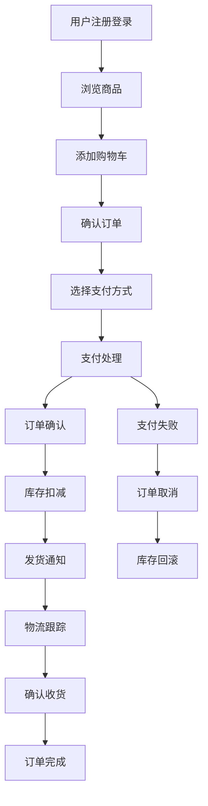
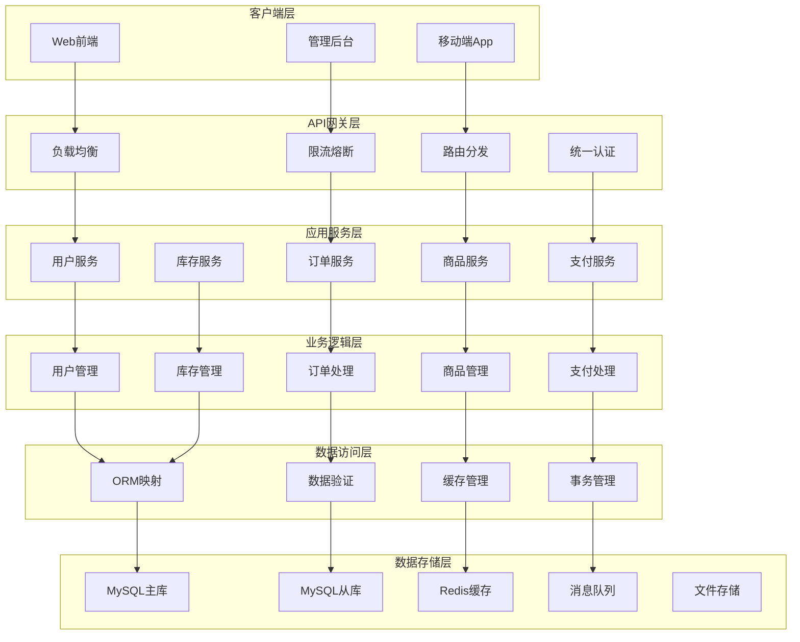
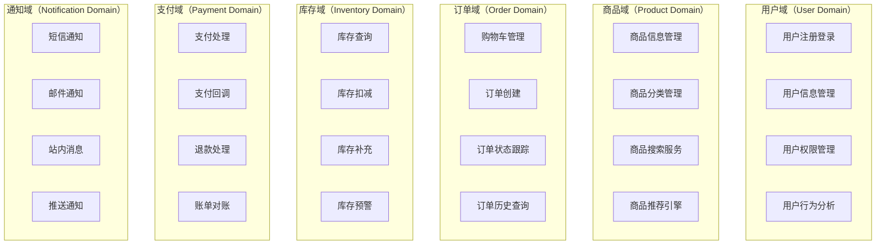

# 00-项目概述与架构设计

## 1. 企业级电商系统概述

### 1.0 TypeScript在企业级项目中的优势

在开始深入企业级电商系统设计之前，我们先了解为什么选择TypeScript作为开发语言。TypeScript是JavaScript的超集，为JavaScript添加了静态类型系统，在企业级项目中具有显著优势：

#### 1.0.1 类型安全 - 编译时错误检测

**问题背景**：JavaScript是动态类型语言，类型错误只能在运行时发现，这在大规模项目中容易导致难以调试的问题。

**TypeScript解决方案**：
```typescript
// ❌ JavaScript - 运行时才发现错误
function calculateTotal(price, quantity) {
  return price * quantity; // 如果传入字符串会得到NaN
}

// 调用时传入错误类型，运行时才发现问题
const result = calculateTotal("100", 2); // 返回 "1002" 而不是 200

// ✅ TypeScript - 编译时发现错误
function calculateTotal(price: number, quantity: number): number {
  return price * quantity; // 类型安全，编译时检查
}

// 编译时就会报错，防止运行时问题
const result = calculateTotal("100", 2); // ❌ 编译错误：Argument of type 'string' is not assignable to parameter of type 'number'
```

**实际应用场景**：
- API接口参数验证
- 数据库模型字段类型检查
- 业务逻辑参数类型约束

#### 1.0.2 更好的开发体验 - IDE智能支持

**问题背景**：JavaScript缺乏类型信息，IDE无法提供准确的代码提示和自动补全。

**TypeScript解决方案**：
```typescript
// 定义清晰的接口结构
interface User {
  id: number;
  username: string;
  email: string;
  roles: Role[];
  profile?: UserProfile; // 可选属性
}

interface Role {
  id: number;
  name: string;
  permissions: Permission[];
}

// 使用时获得完整的智能提示
const user: User = {
  id: 1,
  username: "john_doe",
  email: "john@example.com",
  roles: [] // IDE会提示需要Role[]类型，并提供Role接口的详细信息
};

// 访问属性时获得类型提示
user.roles.forEach(role => {
  console.log(role.name); // IDE知道role是Role类型，提供name属性提示
});
```

**实际应用场景**：
- 代码自动补全和智能提示
- 重构时的安全重命名
- 接口文档的自动生成

#### 1.0.3 重构安全性 - 大规模代码维护

**问题背景**：在大型项目中，修改一个接口或函数签名时，很难确保所有使用该接口的地方都得到正确更新。

**TypeScript解决方案**：
```typescript
// 原始接口定义
interface Product {
  productId: number;
  name: string;
  price: number;
}

// 业务代码中使用
function displayProduct(product: Product): void {
  console.log(`Product: ${product.name}, Price: ${product.price}`);
}

// 重构：将productId改为id
interface Product {
  id: number; // 重命名时，所有引用都会更新
  name: string;
  price: number;
}

// TypeScript编译器会立即报告所有使用productId的地方需要更新
function displayProduct(product: Product): void {
  console.log(`Product: ${product.name}, Price: ${product.price}`);
  // console.log(product.productId); // ❌ 编译错误：Property 'productId' does not exist
}
```

**实际应用场景**：
- 数据库模型字段重命名
- API接口参数结构调整
- 业务逻辑函数签名修改

#### 1.0.4 团队协作优势

**问题背景**：在团队开发中，不同开发者对接口的理解可能存在差异，导致集成时出现问题。

**TypeScript解决方案**：
```typescript
// 明确的接口契约
interface OrderService {
  createOrder(orderData: CreateOrderRequest): Promise<OrderResponse>;
  updateOrderStatus(orderId: number, status: OrderStatus): Promise<void>;
  getOrderById(orderId: number): Promise<Order | null>;
}

// 团队成员可以基于接口进行开发，无需等待具体实现
class OrderController {
  constructor(private orderService: OrderService) {}
  
  async createOrder(ctx: Context): Promise<void> {
    // 基于接口进行开发，IDE提供完整的类型提示
    const orderData = ctx.request.body as CreateOrderRequest;
    const result = await this.orderService.createOrder(orderData);
    ctx.body = result;
  }
}
```

**实际应用场景**：
- 前后端接口约定
- 微服务间接口定义
- 第三方库集成

### 1.1 什么是企业级系统

企业级系统（Enterprise-level System）是指能够满足大型企业复杂业务需求的软件系统，具有以下关键特征：

#### 1.1.1 高可用性（High Availability）
- **系统可用性要求**：99.9%以上的服务可用时间
- **故障恢复能力**：快速故障检测和自动恢复机制
- **容灾备份**：多地域部署和数据备份策略

#### 1.1.2 高并发处理能力（High Concurrency）
- **并发用户支持**：同时支持数万到数十万用户在线
- **请求处理能力**：每秒处理数千到数万次请求
- **资源调度优化**：动态负载均衡和资源分配

#### 1.1.3 数据安全性（Data Security）
- **数据加密**：传输加密和存储加密
- **访问控制**：细粒度的权限管理
- **审计日志**：完整的操作记录和追踪

#### 1.1.4 系统可扩展性（Scalability）
- **水平扩展**：支持服务器集群扩容
- **垂直扩展**：支持硬件资源升级
- **业务扩展**：模块化设计支持新功能快速开发

### 1.2 电商系统业务特点

#### 1.2.1 复杂的业务流程


#### 1.2.2 数据量大且增长快速
- **商品数据**：SKU数量可达百万级别
- **用户数据**：注册用户数百万到千万级别
- **订单数据**：日订单量可达数十万笔
- **日志数据**：每日产生GB级别的日志数据

#### 1.2.3 业务高峰期集中
- **促销活动**：双11、618等活动期间流量暴增
- **秒杀场景**：瞬间高并发访问
- **时间敏感**：库存更新、价格变动需要实时性

## 2. 系统架构设计原则

### 2.1 单一职责原则（Single Responsibility Principle）

每个服务模块只负责一个特定的业务领域，降低系统复杂度和模块间的耦合度。

#### 实际应用示例：
```typescript
// ❌ 违反单一职责原则的设计
class UserService {
  createUser(userData: any): void {
    // 用户创建逻辑
    this.validateUser(userData);
    this.saveUser(userData);
    this.sendWelcomeEmail(userData.email);
    this.updateInventory(userData.purchaseItems);
    this.processPayment(userData.paymentInfo);
  }
}

// ✅ 符合单一职责原则的设计
interface UserData {
  username: string;
  email: string;
  password: string;
}

interface User {
  id: number;
  username: string;
  email: string;
  createdAt: Date;
}

class UserService {
  constructor(private eventBus: EventBus) {}

  async createUser(userData: UserData): Promise<User> {
    this.validateUser(userData);
    const user = await this.saveUser(userData);
    
    // 通过事件机制解耦其他业务逻辑
    this.eventBus.emit('user.created', user);
    return user;
  }

  private validateUser(userData: UserData): void {
    // 用户数据验证逻辑
  }

  private async saveUser(userData: UserData): Promise<User> {
    // 保存用户逻辑
    return {} as User;
  }
}

class EmailService {
  async sendWelcomeEmail(userEmail: string): Promise<void> {
    // 邮件发送逻辑
  }
}

class InventoryService {
  async updateInventory(items: any[]): Promise<void> {
    // 库存更新逻辑
  }
}
```

### 2.2 开闭原则（Open-Closed Principle）

系统对扩展开放，对修改关闭。通过插件化架构支持新功能的添加。

#### 中间件扩展示例：
```typescript
import { Context, Next } from 'koa';

// 基础中间件接口
interface BaseMiddleware {
  execute(ctx: Context, next: Next): Promise<void>;
}

// 认证中间件
class AuthMiddleware implements BaseMiddleware {
  constructor(private jwtService: JwtService) {}

  async execute(ctx: Context, next: Next): Promise<void> {
    const token = ctx.headers.authorization;
    if (!token) {
      ctx.throw(401, 'Unauthorized');
    }
    
    try {
      ctx.user = await this.verifyToken(token);
      await next();
    } catch (error) {
      ctx.throw(401, 'Invalid token');
    }
  }

  private async verifyToken(token: string): Promise<any> {
    return this.jwtService.verify(token);
  }
}

// 日志中间件
class LoggingMiddleware implements BaseMiddleware {
  constructor(private logger: Logger) {}

  async execute(ctx: Context, next: Next): Promise<void> {
    const start = Date.now();
    await next();
    const duration = Date.now() - start;
    
    this.logger.info(`${ctx.method} ${ctx.url} - ${duration}ms`);
  }
}

// 中间件工厂
class MiddlewareFactory {
  static createAuthMiddleware(jwtService: JwtService): AuthMiddleware {
    return new AuthMiddleware(jwtService);
  }

  static createLoggingMiddleware(logger: Logger): LoggingMiddleware {
    return new LoggingMiddleware(logger);
  }
}
```

### 2.3 依赖倒置原则（Dependency Inversion Principle）

高层模块不应该依赖低层模块，都应该依赖抽象。

#### 依赖注入示例：
```typescript
// 抽象接口
interface IPaymentService {
  processPayment(amount: number, paymentMethod: string): Promise<PaymentResult>;
}

interface PaymentResult {
  success: boolean;
  transactionId: string;
  message: string;
}

interface OrderData {
  userId: number;
  items: OrderItem[];
  paymentMethod: string;
}

interface Order {
  id: number;
  userId: number;
  amount: number;
  status: string;
}

// 具体实现
class AlipayService implements IPaymentService {
  constructor(private alipaySDK: AlipaySDK) {}

  async processPayment(amount: number, paymentMethod: string): Promise<PaymentResult> {
    // 支付宝支付逻辑
    const result = await this.alipaySDK.pay(amount, paymentMethod);
    return {
      success: result.success,
      transactionId: result.transactionId,
      message: result.message
    };
  }
}

class WechatPayService implements IPaymentService {
  constructor(private wechatSDK: WechatSDK) {}

  async processPayment(amount: number, paymentMethod: string): Promise<PaymentResult> {
    // 微信支付逻辑
    const result = await this.wechatSDK.pay(amount, paymentMethod);
    return {
      success: result.success,
      transactionId: result.transactionId,
      message: result.message
    };
  }
}

// 高层业务逻辑
class OrderService {
  constructor(private paymentService: IPaymentService) {} // 依赖注入
  
  async createOrder(orderData: OrderData): Promise<{ order: Order; paymentResult: PaymentResult }> {
    // 订单创建逻辑
    const order = await this.saveOrder(orderData);
    
    // 调用支付服务（不关心具体实现）
    const paymentResult = await this.paymentService.processPayment(
      order.amount,
      orderData.paymentMethod
    );
    
    return { order, paymentResult };
  }

  private async saveOrder(orderData: OrderData): Promise<Order> {
    // 保存订单逻辑
    return {} as Order;
  }
}

// 依赖注入容器
class DIContainer {
  private services = new Map<string, any>();

  register<T>(name: string, service: T): void {
    this.services.set(name, service);
  }

  get<T>(name: string): T {
    return this.services.get(name);
  }
}

// 使用示例
const container = new DIContainer();
container.register('paymentService', new AlipayService(new AlipaySDK()));
const orderService = new OrderService(container.get<IPaymentService>('paymentService'));
```

## 3. 整体系统架构设计

### 3.1 分层架构（Layered Architecture）



#### 3.1.1 各层职责详解

**客户端层（Presentation Layer）**
- 负责用户界面展示和交互
- 处理用户输入验证
- 调用API服务获取数据

**API网关层（API Gateway Layer）**
- 统一入口管理
- 请求路由和负载均衡
- 认证授权和安全控制
- 限流和熔断保护

**应用服务层（Application Service Layer）**
- 暴露业务功能接口
- 协调多个业务逻辑组件
- 处理跨服务调用

**业务逻辑层（Business Logic Layer）**
- 核心业务规则实现
- 业务流程控制
- 数据处理和转换

**数据访问层（Data Access Layer）**
- 数据库操作封装
- 缓存管理
- 数据一致性保证

**数据存储层（Data Storage Layer）**
- 持久化数据存储
- 缓存数据存储
- 消息队列存储

### 3.2 Koa2框架核心架构

#### 3.2.1 中间件洋葱圈模型

Koa2的核心特性是其独特的中间件执行模型，被形象地称为"洋葱圈模型"。这种模型使得中间件的执行流程呈现出先进后出的特点。

```typescript
import Koa, { Context, Next } from 'koa';

const app = new Koa();

// 中间件1：请求日志
app.use(async (ctx: Context, next: Next): Promise<void> => {
  console.log('1. 开始处理请求');
  const start = Date.now();
  
  await next(); // 调用下一个中间件
  
  const duration = Date.now() - start;
  console.log(`6. 请求处理完成，耗时：${duration}ms`);
});

// 中间件2：错误处理
app.use(async (ctx: Context, next: Next): Promise<void> => {
  console.log('2. 错误处理中间件');
  try {
    await next();
  } catch (error: any) {
    console.log('5. 捕获错误并处理');
    ctx.status = error.status || 500;
    ctx.body = { error: error.message };
  }
});

// 中间件3：业务逻辑
app.use(async (ctx: Context, next: Next): Promise<void> => {
  console.log('3. 执行业务逻辑');
  ctx.body = 'Hello World';
  console.log('4. 业务逻辑处理完成');
});
```

**执行流程详解：**
```
请求进入 → 1 → 2 → 3 → 4 → 5 → 6 → 响应返回
           ↓   ↓   ↓   ↑   ↑   ↑
         日志 错误 业务 业务 错误 日志
```

**洋葱圈模型的优势：**
1. **统一的错误处理**：外层中间件可以捕获内层中间件的错误
2. **请求响应的完整生命周期管理**：可以在请求前后执行操作
3. **灵活的中间件组合**：中间件可以自由组合和复用

#### 3.2.2 Context对象设计

Koa2通过Context对象封装了Node.js原生的request和response对象，提供了更加便捷的API接口：

```typescript
// Context对象核心属性和方法
app.use(async (ctx: Context, next: Next): Promise<void> => {
  // 请求相关信息
  console.log('请求方法:', ctx.method);          // GET, POST, PUT, DELETE
  console.log('请求路径:', ctx.url);             // /api/users/123
  console.log('请求路径（无查询参数）:', ctx.path); // /api/users/123
  console.log('查询参数:', ctx.query);           // { page: '1', size: '10' }
  console.log('请求头:', ctx.headers);           // { 'content-type': 'application/json' }
  console.log('IP地址:', ctx.ip);               // 192.168.1.1
  
  // 请求体（需要body-parser中间件）
  console.log('请求体:', ctx.request.body);     // POST请求的数据
  
  // 响应设置
  ctx.status = 200;                            // 设置状态码
  ctx.body = { message: 'Success' };           // 设置响应体
  ctx.set('Content-Type', 'application/json'); // 设置响应头
  ctx.set('X-Custom-Header', 'value');         // 自定义响应头
  
  // Cookie操作
  ctx.cookies.set('userId', '123', {
    maxAge: 86400000,  // 24小时
    httpOnly: true,    // 防止XSS攻击
    secure: false      // HTTPS环境设为true
  });
  const userId = ctx.cookies.get('userId');
  
  await next();
});
```

## 4. 微服务架构设计

### 4.1 服务拆分策略

基于领域驱动设计（DDD）的思想，按业务领域进行服务拆分：



### 4.2 服务间通信机制

#### 4.2.1 同步通信：HTTP/HTTPS RESTful API

```typescript
import axios, { AxiosRequestConfig, AxiosResponse } from 'axios';

// HTTP客户端封装
class HttpClient {
  private baseURL: string;
  private timeout: number;

  constructor(baseURL: string, timeout: number = 5000) {
    this.baseURL = baseURL;
    this.timeout = timeout;
  }
  
  async request<T = any>(
    method: string, 
    url: string, 
    data: any = null, 
    headers: Record<string, string> = {}
  ): Promise<T> {
    const config: AxiosRequestConfig = {
      method: method as any,
      url: `${this.baseURL}${url}`,
      timeout: this.timeout,
      headers: {
        'Content-Type': 'application/json',
        ...headers
      }
    };
    
    if (data) {
      config.data = data;
    }
    
    try {
      const response: AxiosResponse<T> = await axios(config);
      return response.data;
    } catch (error: any) {
      if (error.code === 'ECONNABORTED') {
        throw new Error('Request timeout');
      }
      if (error.response) {
        throw new Error(`HTTP ${error.response.status}: ${error.response.data.message}`);
      }
      throw error;
    }
  }
  
  async get<T = any>(url: string, headers: Record<string, string> = {}): Promise<T> {
    return this.request<T>('GET', url, null, headers);
  }
  
  async post<T = any>(url: string, data: any, headers: Record<string, string> = {}): Promise<T> {
    return this.request<T>('POST', url, data, headers);
  }
  
  async put<T = any>(url: string, data: any, headers: Record<string, string> = {}): Promise<T> {
    return this.request<T>('PUT', url, data, headers);
  }
  
  async delete<T = any>(url: string, headers: Record<string, string> = {}): Promise<T> {
    return this.request<T>('DELETE', url, null, headers);
  }
}

// 服务间调用示例
class OrderService {
  constructor() {
    this.userServiceClient = new HttpClient('http://user-service:3001');
    this.productServiceClient = new HttpClient('http://product-service:3002');
    this.inventoryServiceClient = new HttpClient('http://inventory-service:3003');
  }
  
  async createOrder(orderData) {
    try {
      // 1. 验证用户信息
      const user = await this.userServiceClient.get(`/users/${orderData.userId}`);
      if (!user) {
        throw new Error('User not found');
      }
      
      // 2. 验证商品信息和库存
      const productChecks = orderData.items.map(async (item) => {
        const [product, inventory] = await Promise.all([
          this.productServiceClient.get(`/products/${item.productId}`),
          this.inventoryServiceClient.get(`/inventory/${item.productId}`)
        ]);
        
        if (!product) {
          throw new Error(`Product ${item.productId} not found`);
        }
        
        if (inventory.stock < item.quantity) {
          throw new Error(`Insufficient stock for product ${item.productId}`);
        }
        
        return {
          product,
          inventory,
          requestedQuantity: item.quantity
        };
      });
      
      const validatedItems = await Promise.all(productChecks);
      
      // 3. 创建订单
      const order = await this.saveOrder({
        ...orderData,
        validatedItems,
        status: 'pending'
      });
      
      // 4. 扣减库存
      const inventoryUpdates = validatedItems.map(item =>
        this.inventoryServiceClient.post('/inventory/decrease', {
          productId: item.product.id,
          quantity: item.requestedQuantity,
          orderId: order.id
        })
      );
      
      await Promise.all(inventoryUpdates);
      
      return order;
      
    } catch (error) {
      // 错误处理和补偿逻辑
      console.error('Order creation failed:', error.message);
      throw error;
    }
  }
}
```

#### 4.2.2 异步通信：消息队列

```typescript
// 消息队列封装
interface MessageData {
  id: string;
  topic: string;
  payload: any;
  timestamp: number;
  delay: number;
}

interface MessageSubscriber {
  callback: (message: MessageData) => Promise<void>;
  pattern?: string;
}

class MessageQueue {
  private redis: any;
  private subscribers: Map<string, MessageSubscriber[]> = new Map();

  constructor(redisClient: any) {
    this.redis = redisClient;
    this.subscribers = new Map();
  }
  
  /**
   * 发布消息
   * @param topic 主题
   * @param message 消息内容
   * @param delay 延迟时间（毫秒）
   */
  async publish(topic: string, message: any, delay: number = 0): Promise<void> {
    const messageData: MessageData = {
      id: this.generateId(),
      topic,
      payload: message,
      timestamp: Date.now(),
      delay
    };
    
    if (delay > 0) {
      // 延迟消息
      const executeTime = Date.now() + delay;
      await this.redis.zadd('delayed_messages', executeTime, JSON.stringify(messageData));
    } else {
      // 立即消息
      await this.redis.lpush(`queue:${topic}`, JSON.stringify(messageData));
    }
    
    console.log(`Message published to topic: ${topic}`);
  }
  
  /**
   * 订阅消息
   * @param topic 主题
   * @param handler 消息处理器
   */
  async subscribe(topic: string, handler: MessageSubscriber): Promise<void> {
    if (!this.subscribers.has(topic)) {
      this.subscribers.set(topic, []);
    }
    this.subscribers.get(topic)!.push(handler);
    
    // 启动消息消费者
    this.startConsumer(topic);
  }
  
  /**
   * 消息消费者
   * @param topic 主题
   */
  private async startConsumer(topic: string): Promise<void> {
    const queueKey = `queue:${topic}`;
    
    while (true) {
      try {
        // 阻塞式获取消息
        const result = await this.redis.brpop(queueKey, 5);
        
        if (result) {
          const [, messageStr] = result;
          const message: MessageData = JSON.parse(messageStr);
          const handlers = this.subscribers.get(topic);
          
          if (handlers) {
            for (const handler of handlers) {
              try {
                await handler.callback(message);
                console.log(`Message processed successfully: ${message.id}`);
              } catch (error) {
                console.error(`Message processing failed: ${(error as Error).message}`);
                // 重试逻辑或死信队列
                await this.handleFailedMessage(message, error as Error);
              }
            }
          }
        }
      } catch (error) {
        console.error(`Consumer error for topic ${topic}:`, error);
        await this.sleep(1000); // 错误时等待1秒后重试
      }
    }
  }
  
  /**
   * 处理延迟消息
   */
  async processDelayedMessages(): Promise<void> {
    const now = Date.now();
    const messages = await this.redis.zrangebyscore('delayed_messages', '-inf', now);
    
    for (const messageStr of messages) {
      const message: MessageData = JSON.parse(messageStr);
      await this.redis.lpush(`queue:${message.topic}`, messageStr);
      await this.redis.zrem('delayed_messages', messageStr);
    }
  }
  
  /**
   * 处理失败的消息
   * @param message 失败的消息
   * @param error 错误信息
   */
  private async handleFailedMessage(message: MessageData, error: Error): Promise<void> {
    // 实现重试逻辑或发送到死信队列
    console.error(`Handling failed message ${message.id}:`, error.message);
  }
  
  /**
   * 生成唯一ID
   * @returns 唯一ID
   */
  private generateId(): string {
    return `${Date.now()}-${Math.random().toString(36).substr(2, 9)}`;
  }
  
  /**
   * 等待指定时间
   * @param ms 等待时间（毫秒）
   * @returns Promise
   */
  private sleep(ms: number): Promise<void> {
    return new Promise(resolve => setTimeout(resolve, ms));
  }
}

// 使用示例：订单服务发布事件
interface Order {
  id: string;
  userId: string;
  items: any[];
  amount: number;
  createdAt: Date;
}

interface OrderCreatedEvent {
  orderId: string;
  userId: string;
  items: any[];
  amount: number;
  createdAt: Date;
}

interface OrderPaidEvent {
  orderId: string;
  userId: string;
  amount: number;
  paidAt: number;
}

class OrderEventService {
  private messageQueue: MessageQueue;

  constructor(messageQueue: MessageQueue) {
    this.messageQueue = messageQueue;
  }
  
  /**
   * 发布订单创建事件
   * @param order 订单信息
   */
  async publishOrderCreated(order: Order): Promise<void> {
    const event: OrderCreatedEvent = {
      orderId: order.id,
      userId: order.userId,
      items: order.items,
      amount: order.amount,
      createdAt: order.createdAt
    };
    
    await this.messageQueue.publish('order.created', event);
  }
  
  /**
   * 发布订单支付事件
   * @param order 订单信息
   */
  async publishOrderPaid(order: Order): Promise<void> {
    const event: OrderPaidEvent = {
      orderId: order.id,
      userId: order.userId,
      amount: order.amount,
      paidAt: Date.now()
    };
    
    await this.messageQueue.publish('order.paid', event);
  }
}

// 库存服务监听订单事件
class InventoryEventHandler {
  constructor(messageQueue, inventoryService) {
    this.messageQueue = messageQueue;
    this.inventoryService = inventoryService;
    
    // 订阅订单事件
    this.messageQueue.subscribe('order.created', this.handleOrderCreated.bind(this));
    this.messageQueue.subscribe('order.cancelled', this.handleOrderCancelled.bind(this));
  }
  
  async handleOrderCreated(orderData) {
    console.log('Processing order created event:', orderData.orderId);
    
    try {
      // 扣减库存
      for (const item of orderData.items) {
        await this.inventoryService.decreaseStock(item.productId, item.quantity);
      }
      
      console.log('Inventory decreased successfully for order:', orderData.orderId);
    } catch (error) {
      console.error('Failed to decrease inventory:', error);
      
      // 发布库存扣减失败事件
      await this.messageQueue.publish('inventory.decrease.failed', {
        orderId: orderData.orderId,
        error: error.message
      });
    }
  }
  
  async handleOrderCancelled(orderData) {
    console.log('Processing order cancelled event:', orderData.orderId);
    
    try {
      // 回滚库存
      for (const item of orderData.items) {
        await this.inventoryService.increaseStock(item.productId, item.quantity);
      }
      
      console.log('Inventory restored successfully for order:', orderData.orderId);
    } catch (error) {
      console.error('Failed to restore inventory:', error);
    }
  }
}
```

## 5. 总结

本文档详细介绍了企业级电商系统的架构设计原理和实践方法。通过分层架构、微服务拆分、Koa2框架应用等方面的深入分析，为开发者提供了完整的企业级系统建设指南。

### 5.1 关键要点回顾

1. **架构设计原则**：单一职责、开闭原则、依赖倒置等原则的实际应用
2. **Koa2框架特性**：中间件洋葱圈模型、Context对象设计的深度理解
3. **微服务架构**：服务拆分策略、服务间通信机制的最佳实践
4. **系统可扩展性**：通过合理的架构设计支持业务快速发展

### 5.2 下一步学习方向

- 深入学习开发环境搭建和项目初始化
- 掌握数据库设计和ORM框架使用
- 实现用户认证和权限管理系统
- 构建完整的商品和订单管理功能

继续阅读后续文档，开始你的企业级Node.js开发实战之旅！