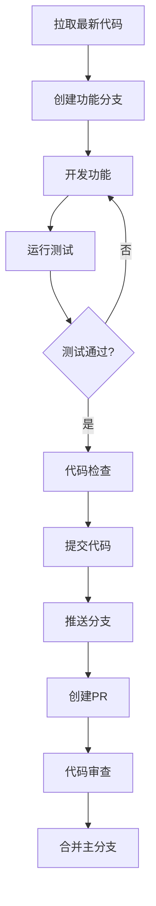

# 01-开发环境与项目初始化

## 1. 开发环境搭建

### 1.1 基础环境要求

#### 1.1.1 Node.js环境配置

**推荐版本：Node.js 18.x LTS或20.x LTS**

```bash
# 查看当前Node.js版本
node --version

# 查看npm版本
npm --version

# 使用nvm管理Node.js版本（推荐）
curl -o- https://raw.githubusercontent.com/nvm-sh/nvm/v0.39.0/install.sh | bash

# 安装并使用Node.js 18 LTS
nvm install 18
nvm use 18
nvm alias default 18
```

#### 1.1.2 数据库环境配置

**MySQL 8.0安装配置**

```bash
# macOS使用Homebrew安装
brew install mysql@8.0
brew services start mysql@8.0

# 创建数据库
mysql -u root -p
CREATE DATABASE ecommerce_dev CHARACTER SET utf8mb4 COLLATE utf8mb4_unicode_ci;
CREATE DATABASE ecommerce_test CHARACTER SET utf8mb4 COLLATE utf8mb4_unicode_ci;

# 创建专用用户
CREATE USER 'ecommerce_user'@'localhost' IDENTIFIED BY 'secure_password_123';
GRANT ALL PRIVILEGES ON ecommerce_dev.* TO 'ecommerce_user'@'localhost';
GRANT ALL PRIVILEGES ON ecommerce_test.* TO 'ecommerce_user'@'localhost';
FLUSH PRIVILEGES;
```

**Redis安装配置**

```bash
# macOS使用Homebrew安装
brew install redis
brew services start redis

# 测试Redis连接
redis-cli ping
# 期望输出: PONG
```

### 1.2 Docker环境配置

#### 1.2.1 开发环境Docker配置

**docker-compose.dev.yml**

```yaml
version: '3.8'

services:
  # MySQL数据库
  mysql:
    image: mysql:8.0
    container_name: ecommerce_mysql_dev
    restart: unless-stopped
    environment:
      MYSQL_ROOT_PASSWORD: root_password_123
      MYSQL_DATABASE: ecommerce_dev
      MYSQL_USER: ecommerce_user
      MYSQL_PASSWORD: secure_password_123
    ports:
      - "3306:3306"
    volumes:
      - mysql_data:/var/lib/mysql
      - ./docker/mysql/conf.d:/etc/mysql/conf.d
    command: --default-authentication-plugin=mysql_native_password

  # Redis缓存
  redis:
    image: redis:7.0-alpine
    container_name: ecommerce_redis_dev
    restart: unless-stopped
    ports:
      - "6379:6379"
    volumes:
      - redis_data:/data
    command: redis-server --requirepass redis_password_123

  # phpMyAdmin（可选）
  phpmyadmin:
    image: phpmyadmin/phpmyadmin
    container_name: ecommerce_phpmyadmin_dev
    restart: unless-stopped
    environment:
      PMA_HOST: mysql
      PMA_PORT: 3306
      PMA_USER: root
      PMA_PASSWORD: root_password_123
    ports:
      - "8080:80"
    depends_on:
      - mysql

volumes:
  mysql_data:
  redis_data:
```

**启动开发环境：**

```bash
# 启动所有服务
docker-compose -f docker-compose.dev.yml up -d

# 查看服务状态
docker-compose -f docker-compose.dev.yml ps

# 停止所有服务
docker-compose -f docker-compose.dev.yml down
```

## 2. 项目初始化

### 2.1 项目结构设计

#### 2.1.1 企业级项目目录结构

```
ecommerce-koa-api/
├── src/                          # 源代码目录
│   ├── app/                      # 应用核心
│   │   ├── controllers/          # 控制器层
│   │   │   ├── auth/            # 认证相关控制器
│   │   │   ├── user/            # 用户相关控制器
│   │   │   ├── product/         # 商品相关控制器
│   │   │   └── order/           # 订单相关控制器
│   │   ├── services/            # 业务逻辑层
│   │   │   ├── auth.service.js
│   │   │   ├── user.service.js
│   │   │   ├── product.service.js
│   │   │   └── order.service.js
│   │   ├── models/              # 数据模型层
│   │   │   ├── user.model.js
│   │   │   ├── product.model.js
│   │   │   └── order.model.js
│   │   ├── repositories/        # 数据访问层
│   │   │   ├── base.repository.js
│   │   │   ├── user.repository.js
│   │   │   └── product.repository.js
│   │   └── validators/          # 数据验证
│   │       ├── auth.validator.js
│   │       └── user.validator.js
│   ├── config/                  # 配置文件
│   │   ├── database.js          # 数据库配置
│   │   ├── redis.js             # Redis配置
│   │   ├── jwt.js               # JWT配置
│   │   └── index.js             # 配置入口
│   ├── middleware/              # 中间件
│   │   ├── auth.middleware.js   # 认证中间件
│   │   ├── cors.middleware.js   # 跨域中间件
│   │   ├── error.middleware.js  # 错误处理中间件
│   │   └── logger.middleware.js # 日志中间件
│   ├── routes/                  # 路由定义
│   │   ├── auth.routes.js       # 认证路由
│   │   ├── user.routes.js       # 用户路由
│   │   ├── product.routes.js    # 商品路由
│   │   └── index.js             # 路由入口
│   ├── utils/                   # 工具函数
│   │   ├── crypto.js            # 加密工具
│   │   ├── response.js          # 响应工具
│   │   └── validation.js        # 验证工具
│   ├── constants/               # 常量定义
│   │   ├── error-codes.js       # 错误码定义
│   │   └── user-roles.js        # 用户角色定义
│   ├── database/                # 数据库相关
│   │   ├── migrations/          # 数据库迁移
│   │   └── seeders/             # 数据填充
│   └── app.js                   # 应用入口
├── tests/                       # 测试文件
│   ├── unit/                    # 单元测试
│   ├── integration/             # 集成测试
│   └── fixtures/                # 测试数据
├── docs/                        # 文档目录
├── scripts/                     # 脚本文件
├── docker/                      # Docker配置
├── .env.example                 # 环境变量示例
├── .gitignore                   # Git忽略文件
├── .eslintrc.js                 # ESLint配置
├── package.json                 # 项目依赖
└── server.js                    # 服务器启动文件
```

### 2.2 依赖包安装与配置

#### 2.2.1 核心依赖安装

```bash
# Koa核心框架
npm install koa koa-router koa-bodyparser koa-cors koa-helmet

# 数据库相关
npm install sequelize mysql2 redis ioredis

# 认证和安全
npm install jsonwebtoken bcryptjs passport passport-jwt

# 数据验证
npm install joi

# 日志系统
npm install winston morgan

# 工具库
npm install lodash moment uuid dotenv

# 文件上传
npm install multer @koa/multer

# API文档
npm install swagger-jsdoc swagger-ui-koa
```

#### 2.2.2 开发依赖安装

```bash
# 测试框架
npm install --save-dev jest supertest

# 代码规范
npm install --save-dev eslint prettier eslint-config-prettier eslint-plugin-prettier

# 开发工具
npm install --save-dev nodemon cross-env

# 数据库迁移工具
npm install --save-dev sequelize-cli
```

#### 2.2.3 package.json配置

```json
{
  "name": "ecommerce-koa-api",
  "version": "1.0.0",
  "description": "企业级电商API系统",
  "main": "server.js",
  "scripts": {
    "start": "node server.js",
    "dev": "cross-env NODE_ENV=development nodemon server.js",
    "test": "cross-env NODE_ENV=test jest",
    "test:watch": "cross-env NODE_ENV=test jest --watch",
    "test:coverage": "cross-env NODE_ENV=test jest --coverage",
    "lint": "eslint src/**/*.js",
    "lint:fix": "eslint src/**/*.js --fix",
    "format": "prettier --write src/**/*.js",
    "db:migrate": "sequelize-cli db:migrate",
    "db:seed": "sequelize-cli db:seed:all",
    "db:reset": "npm run db:migrate:undo && npm run db:migrate && npm run db:seed",
    "docker:dev": "docker-compose -f docker-compose.dev.yml up -d",
    "docker:dev:stop": "docker-compose -f docker-compose.dev.yml down"
  },
  "keywords": [
    "nodejs",
    "koa",
    "ecommerce",
    "api",
    "enterprise"
  ],
  "engines": {
    "node": ">=18.0.0",
    "npm": ">=8.0.0"
  }
}
```

### 2.3 环境配置管理

#### 2.3.1 环境变量配置

**.env.example（环境变量模板）**

```bash
# 应用配置
NODE_ENV=development
PORT=3000
APP_NAME=ECommerce API
APP_VERSION=1.0.0

# 数据库配置
DB_HOST=localhost
DB_PORT=3306
DB_NAME=ecommerce_dev
DB_USER=ecommerce_user
DB_PASSWORD=secure_password_123
DB_TIMEZONE=+08:00

# Redis配置
REDIS_HOST=localhost
REDIS_PORT=6379
REDIS_PASSWORD=redis_password_123
REDIS_DB=0

# JWT配置
JWT_SECRET=your_super_secret_jwt_key_here_change_in_production
JWT_EXPIRES_IN=7d
JWT_REFRESH_SECRET=your_refresh_token_secret_key
JWT_REFRESH_EXPIRES_IN=30d

# 邮件配置
MAIL_HOST=smtp.gmail.com
MAIL_PORT=587
MAIL_USER=your-email@gmail.com
MAIL_PASSWORD=your-app-password
MAIL_FROM=noreply@yourapp.com

# 文件上传配置
UPLOAD_PATH=uploads
MAX_FILE_SIZE=5242880
ALLOWED_FILE_TYPES=jpg,jpeg,png,gif,pdf

# 日志配置
LOG_LEVEL=debug
LOG_FILE=logs/app.log

# 限流配置
RATE_LIMIT_WINDOW=15
RATE_LIMIT_MAX_REQUESTS=100
```

#### 2.3.2 配置文件管理

**src/config/index.js（配置管理入口）**

```javascript
const dotenv = require('dotenv');
const path = require('path');

// 根据环境加载不同的配置文件
const envFile = `.env.${process.env.NODE_ENV || 'development'}`;
const envPath = path.resolve(process.cwd(), envFile);

// 加载环境变量
dotenv.config({ path: envPath });

// 如果环境特定的配置文件不存在，加载默认配置
if (!require('fs').existsSync(envPath)) {
  dotenv.config({ path: path.resolve(process.cwd(), '.env') });
}

const config = {
  // 应用配置
  app: {
    name: process.env.APP_NAME || 'ECommerce API',
    version: process.env.APP_VERSION || '1.0.0',
    port: parseInt(process.env.PORT) || 3000,
    env: process.env.NODE_ENV || 'development',
    isDevelopment: process.env.NODE_ENV === 'development',
    isProduction: process.env.NODE_ENV === 'production',
    isTest: process.env.NODE_ENV === 'test'
  },
  
  // 数据库配置
  database: {
    host: process.env.DB_HOST || 'localhost',
    port: parseInt(process.env.DB_PORT) || 3306,
    database: process.env.DB_NAME,
    username: process.env.DB_USER,
    password: process.env.DB_PASSWORD,
    dialect: 'mysql',
    timezone: process.env.DB_TIMEZONE || '+08:00',
    logging: process.env.NODE_ENV === 'development' ? console.log : false,
    pool: {
      max: 20,
      min: 5,
      acquire: 30000,
      idle: 10000
    }
  },
  
  // Redis配置
  redis: {
    host: process.env.REDIS_HOST || 'localhost',
    port: parseInt(process.env.REDIS_PORT) || 6379,
    password: process.env.REDIS_PASSWORD,
    db: parseInt(process.env.REDIS_DB) || 0
  },
  
  // JWT配置
  jwt: {
    secret: process.env.JWT_SECRET,
    expiresIn: process.env.JWT_EXPIRES_IN || '7d',
    refreshSecret: process.env.JWT_REFRESH_SECRET,
    refreshExpiresIn: process.env.JWT_REFRESH_EXPIRES_IN || '30d'
  }
};

// 验证必需的配置项
const requiredConfigs = [
  'database.database',
  'database.username', 
  'database.password',
  'jwt.secret'
];

for (const configPath of requiredConfigs) {
  const value = configPath.split('.').reduce((obj, key) => obj && obj[key], config);
  if (!value) {
    throw new Error(`Missing required configuration: ${configPath}`);
  }
}

module.exports = config;
```

### 2.4 代码规范配置

#### 2.4.1 ESLint配置

**.eslintrc.js**

```javascript
module.exports = {
  env: {
    browser: false,
    es2021: true,
    node: true,
    jest: true
  },
  extends: [
    'eslint:recommended',
    'prettier'
  ],
  plugins: [
    'prettier'
  ],
  parserOptions: {
    ecmaVersion: 2021,
    sourceType: 'module'
  },
  rules: {
    'prettier/prettier': 'error',
    'no-console': process.env.NODE_ENV === 'production' ? 'warn' : 'off',
    'no-debugger': process.env.NODE_ENV === 'production' ? 'warn' : 'off',
    'no-unused-vars': ['error', { argsIgnorePattern: '^_' }],
    'no-var': 'error',
    'prefer-const': 'error',
    'require-await': 'error',
    'no-return-await': 'error'
  }
};
```

#### 2.4.2 Prettier配置

**.prettierrc**

```json
{
  "semi": true,
  "singleQuote": true,
  "tabWidth": 2,
  "trailingComma": "es5",
  "printWidth": 100,
  "bracketSpacing": true,
  "arrowParens": "avoid"
}
```

#### 2.4.3 Git配置

**.gitignore**

```bash
# 依赖包
node_modules/

# 环境配置
.env
.env.local
.env.production

# 日志文件
logs/
*.log

# 上传文件
uploads/

# 测试覆盖率
coverage/

# 缓存文件
.cache/

# 编辑器配置
.vscode/
.idea/

# 操作系统文件
.DS_Store

# Docker相关
docker-compose.override.yml
```

### 2.5 基础应用搭建

#### 2.5.1 应用入口文件

**server.js（服务器启动文件）**

```javascript
const config = require('./src/config');
const app = require('./src/app');

// 启动服务器
const server = app.listen(config.app.port, () => {
  console.log(`🚀 ${config.app.name} v${config.app.version} started successfully!`);
  console.log(`📊 Environment: ${config.app.env}`);
  console.log(`🌐 Server running on port ${config.app.port}`);
  console.log(`📖 API Documentation: http://localhost:${config.app.port}/api-docs`);
  
  if (config.app.isDevelopment) {
    console.log(`🔧 Development mode enabled`);
  }
});

// 优雅关闭
process.on('SIGTERM', () => {
  console.log('🛑 SIGTERM received, shutting down gracefully');
  server.close(() => {
    console.log('✅ Process terminated');
    process.exit(0);
  });
});

process.on('SIGINT', () => {
  console.log('🛑 SIGINT received, shutting down gracefully'); 
  server.close(() => {
    console.log('✅ Process terminated');
    process.exit(0);
  });
});

module.exports = server;
```

**src/app.js（应用核心文件）**

```javascript
const Koa = require('koa');
const bodyParser = require('koa-bodyparser');
const cors = require('@koa/cors');
const helmet = require('koa-helmet');

const config = require('./config');
const routes = require('./routes');

// 创建Koa应用实例
const app = new Koa();

// 应用级别错误处理
app.on('error', (err, ctx) => {
  console.error('Application error:', err);
  
  if (ctx) {
    console.error(`Request: ${ctx.method} ${ctx.url}`);
    console.error(`User: ${ctx.user ? ctx.user.id : 'Anonymous'}`);
  }
});

// 安全中间件
app.use(helmet());

// CORS配置
app.use(cors({
  origin: config.app.isDevelopment ? '*' : 'https://yourdomain.com',
  allowMethods: ['GET', 'POST', 'PUT', 'DELETE', 'OPTIONS'],
  allowHeaders: ['Content-Type', 'Authorization', 'X-Requested-With'],
  credentials: true
}));

// 请求体解析
app.use(bodyParser({
  jsonLimit: '10mb',
  formLimit: '10mb',
  textLimit: '10mb'
}));

// 错误处理中间件
app.use(async (ctx, next) => {
  try {
    await next();
  } catch (error) {
    ctx.status = error.status || 500;
    ctx.body = {
      success: false,
      message: error.message || 'Internal Server Error',
      ...(config.app.isDevelopment && { stack: error.stack })
    };
    
    // 触发应用级错误事件
    app.emit('error', error, ctx);
  }
});

// 请求日志中间件
app.use(async (ctx, next) => {
  const start = Date.now();
  await next();
  const duration = Date.now() - start;
  
  console.log(`${ctx.method} ${ctx.url} - ${ctx.status} - ${duration}ms`);
});

// 注册路由
app.use(routes.routes());
app.use(routes.allowedMethods());

// 健康检查端点
app.use(async (ctx, next) => {
  if (ctx.path === '/health') {
    ctx.status = 200;
    ctx.body = {
      status: 'OK',
      timestamp: new Date().toISOString(),
      version: config.app.version
    };
    return;
  }
  await next();
});

// 404处理
app.use(async (ctx) => {
  ctx.status = 404;
  ctx.body = {
    success: false,
    message: 'API endpoint not found',
    path: ctx.path
  };
});

module.exports = app;
```

### 2.6 项目初始化脚本

#### 2.6.1 项目快速初始化

**scripts/init-project.js**

```javascript
const fs = require('fs');
const path = require('path');

// 创建目录结构
const directories = [
  'src/app/controllers/auth',
  'src/app/controllers/user', 
  'src/app/controllers/product',
  'src/app/controllers/order',
  'src/app/services',
  'src/app/models',
  'src/app/repositories',
  'src/app/validators',
  'src/config',
  'src/middleware',
  'src/routes',
  'src/utils',
  'src/constants',
  'src/database/migrations',
  'src/database/seeders',
  'tests/unit',
  'tests/integration',
  'tests/fixtures',
  'docs/api',
  'scripts',
  'docker/mysql/conf.d',
  'docker/redis',
  'logs',
  'uploads'
];

console.log('📁 Creating directory structure...');

directories.forEach(dir => {
  const fullPath = path.join(process.cwd(), dir);
  if (!fs.existsSync(fullPath)) {
    fs.mkdirSync(fullPath, { recursive: true });
    console.log(`✅ Created: ${dir}`);
  }
});

// 创建基础文件
const files = [
  'src/routes/index.js',
  'src/constants/error-codes.js',
  'src/constants/user-roles.js',
  'src/utils/response.js',
  'logs/.gitkeep',
  'uploads/.gitkeep'
];

files.forEach(file => {
  const fullPath = path.join(process.cwd(), file);
  if (!fs.existsSync(fullPath)) {
    fs.writeFileSync(fullPath, '');
    console.log(`✅ Created: ${file}`);
  }
});

console.log('🎉 Project structure initialized successfully!');
```

#### 2.6.2 运行初始化

```bash
# 创建项目目录
mkdir ecommerce-koa-api
cd ecommerce-koa-api

# 初始化npm项目
npm init -y

# 运行项目初始化脚本
node scripts/init-project.js

# 安装依赖
npm install

# 复制环境变量配置
cp .env.example .env

# 启动开发环境
npm run docker:dev
npm run dev
```

## 3. 开发工作流程

### 3.1 日常开发流程



### 3.2 Git工作流规范

```bash
# 1. 拉取最新代码
git pull origin main

# 2. 创建功能分支
git checkout -b feature/user-authentication

# 3. 开发并提交
git add .
git commit -m "feat: implement user authentication"

# 4. 推送分支
git push origin feature/user-authentication

# 5. 创建Pull Request
# 通过Git平台创建PR

# 6. 合并后清理
git checkout main
git pull origin main
git branch -d feature/user-authentication
```

### 3.3 提交信息规范

```bash
# 格式: <type>(<scope>): <description>

# 类型说明:
feat:     新功能
fix:      修复bug
docs:     文档更新
style:    代码格式化
refactor: 重构代码
test:     添加测试
chore:    构建工具或辅助工具的变动

# 示例:
git commit -m "feat(auth): add JWT authentication middleware"
git commit -m "fix(user): resolve user registration validation issue"
git commit -m "docs(api): update user API documentation"
```

## 4. 总结

本文档详细介绍了企业级Node.js+Koa2电商项目的开发环境搭建和项目初始化过程。通过标准化的项目结构、完善的配置管理和规范的开发流程，为后续的功能开发奠定了坚实的基础。

### 4.1 关键要点

1. **标准化项目结构**：清晰的分层架构和模块划分
2. **完善的环境配置**：多环境支持和配置管理
3. **规范的代码风格**：ESLint和Prettier自动化代码规范
4. **Docker化开发环境**：确保开发环境一致性

### 4.2 下一步计划

- 实现数据库模型设计和ORM配置
- 构建用户认证和权限管理系统
- 开发核心业务功能模块

继续阅读下一章节，深入学习数据库设计与ORM最佳实践！