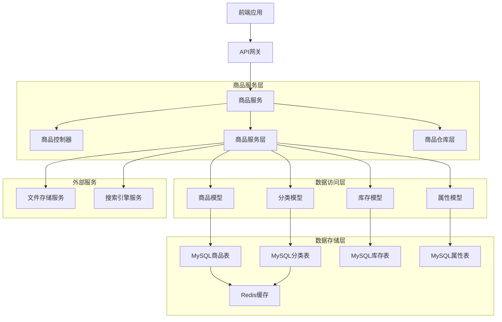

# 04-商品管理模块

## 1. 商品管理模块概述

### 1.0 TypeScript在商品管理中的优势

在商品管理模块中，TypeScript提供了强大的类型安全保障，特别是在处理复杂的商品数据结构和业务逻辑时：

#### 1.0.1 类型安全的商品数据
```typescript
// 商品基础接口
interface Product {
  id: number;
  sku: string;
  name: string;
  slug: string;
  short_description?: string;
  description?: string;
  category_id: number;
  brand_id?: number;
  price: number;
  compare_price?: number;
  cost_price?: number;
  status: ProductStatus;
  featured: boolean;
  tags?: string[];
  meta_title?: string;
  meta_description?: string;
  search_keywords?: string;
  created_at: Date;
  updated_at: Date;
}

// 商品状态类型
type ProductStatus = 'draft' | 'active' | 'inactive' | 'archived';

// 商品变体接口
interface ProductVariant {
  id: number;
  product_id: number;
  sku: string;
  name: string;
  price: number;
  compare_price?: number;
  cost_price?: number;
  weight?: number;
  dimensions?: ProductDimensions;
  attributes: Record<string, any>;
  inventory: ProductInventory;
}

// 商品库存接口
interface ProductInventory {
  id: number;
  variant_id?: number;
  product_id: number;
  available_quantity: number;
  reserved_quantity: number;
  total_quantity: number;
  low_stock_threshold: number;
  track_quantity: boolean;
}
```

#### 1.0.2 业务逻辑类型安全
```typescript
// 商品搜索参数类型
interface ProductSearchParams {
  keyword?: string;
  category_id?: number;
  brand_id?: number;
  min_price?: number;
  max_price?: number;
  status?: ProductStatus;
  featured?: boolean;
  tags?: string[];
  sort_by?: 'name' | 'price' | 'created_at' | 'rating';
  sort_order?: 'asc' | 'desc';
  page?: number;
  limit?: number;
}

// 商品搜索结果类型
interface ProductSearchResult {
  products: Product[];
  total: number;
  page: number;
  limit: number;
  total_pages: number;
  filters: ProductFilters;
}

// 商品过滤器类型
interface ProductFilters {
  categories: CategoryFilter[];
  brands: BrandFilter[];
  price_range: PriceRange;
  tags: string[];
}

interface CategoryFilter {
  id: number;
  name: string;
  count: number;
}

interface BrandFilter {
  id: number;
  name: string;
  count: number;
}

interface PriceRange {
  min: number;
  max: number;
}
```

### 1.1 功能需求分析

商品管理是电商系统的核心模块之一，主要包含以下功能：

1. **商品信息管理**：商品的增删改查操作，支持TypeScript类型验证
2. **商品分类管理**：商品分类的层级结构管理，类型安全的树形结构
3. **商品属性管理**：商品规格、属性的定义和管理，动态类型支持
4. **库存管理**：商品库存的实时更新和预警，并发安全控制
5. **商品搜索**：基于关键词、分类、价格等条件的商品搜索，类型化查询
6. **商品推荐**：热门商品、新品推荐等，智能推荐算法

### 1.2 技术架构设计



## 2. 商品模型设计

### 2.1 商品核心模型

#### 2.1.1 商品主表设计
```typescript
// src/app/models/product.model.ts
import { DataTypes, Model, Optional, Sequelize } from 'sequelize';
import BaseModel from './base.model';
import { ProductAttributes, ProductCreationAttributes } from '../types/product.types';

// 商品模型接口
interface ProductInstance extends Model<ProductAttributes, ProductCreationAttributes>, ProductAttributes {
  // 实例方法
  hasEnoughStock(quantity: number, variantId?: number): Promise<boolean>;
  getVariants(): Promise<ProductVariant[]>;
  getReviewStats(): Promise<ProductReviewStats>;
  updateSearchIndex(): Promise<void>;
  
  // 关联方法
  getInventory(options?: any): Promise<ProductInventory | null>;
  getVariantList(options?: any): Promise<ProductVariant[]>;
  getReviewList(options?: any): Promise<ProductReview[]>;
}

// 商品评价统计接口
interface ProductReviewStats {
  average_rating: number;
  total_reviews: number;
  rating_distribution: Record<number, number>;
}

// 商品评价接口
interface ProductReview {
  id: number;
  product_id: number;
  user_id: number;
  rating: number;
  comment?: string;
  created_at: Date;
}

class Product extends BaseModel<ProductAttributes, ProductCreationAttributes> {
  declare id: number;
  declare sku: string;
  declare name: string;
  declare slug: string;
  declare short_description?: string;
  declare description?: string;
  declare category_id: number;
  declare brand_id?: number;
  declare price: number;
  declare compare_price?: number;
  declare cost_price?: number;
  declare status: ProductStatus;
  declare featured: boolean;
  declare tags?: string[];
  declare meta_title?: string;
  declare meta_description?: string;
  declare search_keywords?: string;
  declare created_at: Date;
  declare updated_at: Date;

  /**
   * 检查库存是否充足
   * @param quantity 需要数量
   * @param variantId 变体ID（可选）
   * @returns 是否有足够库存
   */
  async hasEnoughStock(quantity: number, variantId?: number): Promise<boolean> {
    const inventory = await this.getInventory({
      where: variantId ? { variant_id: variantId } : {}
    });
    
    if (!inventory) return false;
    
    return inventory.available_quantity >= quantity;
  }

  /**
   * 获取商品变体
   * @returns 商品变体列表
   */
  async getVariants(): Promise<ProductVariant[]> {
    return await this.getVariantList({
      include: ['inventory']
    });
  }

  /**
   * 获取商品评价统计
   * @returns 评价统计信息
   */
  async getReviewStats(): Promise<ProductReviewStats> {
    const reviews = await this.getReviewList({
      attributes: ['rating']
    });

    if (reviews.length === 0) {
      return {
        average_rating: 0,
        total_reviews: 0,
        rating_distribution: {}
      };
    }

    const totalRating = reviews.reduce((sum: number, review: ProductReview) => sum + review.rating, 0);
    const averageRating = (totalRating / reviews.length).toFixed(1);
    
    const distribution: Record<number, number> = {};
    for (let i = 1; i <= 5; i++) {
      distribution[i] = reviews.filter((review: ProductReview) => review.rating === i).length;
    }

    return {
      average_rating: parseFloat(averageRating),
      total_reviews: reviews.length,
      rating_distribution: distribution
    };
  }

  /**
   * 更新商品搜索索引
   */
  async updateSearchIndex(): Promise<void> {
    // 构建搜索关键词
    const keywords = [
      this.name,
      this.short_description,
      this.tags ? this.tags.join(' ') : ''
    ].filter(Boolean).join(' ');

    // 更新搜索字段
    await this.update({
      search_keywords: keywords
    });
  }

  /**
   * 计算商品折扣百分比
   * @returns 折扣百分比
   */
  getDiscountPercentage(): number {
    if (!this.compare_price || this.compare_price <= this.price) {
      return 0;
    }
    
    return Math.round(((this.compare_price - this.price) / this.compare_price) * 100);
  }

  /**
   * 检查商品是否在售
   * @returns 是否在售
   */
  isActive(): boolean {
    return this.status === 'active';
  }

  /**
   * 检查商品是否推荐
   * @returns 是否推荐
   */
  isFeatured(): boolean {
    return this.featured;
  }
}

// 商品模型初始化
Product.init({
  sku: {
    type: DataTypes.STRING(100),
    allowNull: false,
    unique: true,
    comment: '商品SKU',
    validate: {
      len: [1, 100],
      notEmpty: true
    }
  },
  name: {
    type: DataTypes.STRING(200),
    allowNull: false,
    comment: '商品名称',
    validate: {
      len: [1, 200],
      notEmpty: true
    }
  },
  slug: {
    type: DataTypes.STRING(200),
    allowNull: false,
    unique: true,
    comment: 'URL友好名称',
    validate: {
      is: /^[a-z0-9-]+$/,
      notEmpty: true
    }
  },
  short_description: {
    type: DataTypes.STRING(500),
    allowNull: true,
    comment: '简短描述',
    validate: {
      len: [0, 500]
    }
  },
  description: {
    type: DataTypes.TEXT,
    allowNull: true,
    comment: '详细描述'
  },
  category_id: {
    type: DataTypes.INTEGER,
    allowNull: false,
    comment: '分类ID',
    references: {
      model: 'categories',
      key: 'id'
    },
    validate: {
      isInt: true,
      min: 1
    }
  },
  brand_id: {
    type: DataTypes.INTEGER,
    allowNull: true,
    comment: '品牌ID',
    references: {
      model: 'brands',
      key: 'id'
    },
    validate: {
      isInt: true,
      min: 1
    }
  },
  price: {
    type: DataTypes.DECIMAL(10, 2),
    allowNull: false,
    comment: '价格',
    validate: {
      min: 0,
      isDecimal: true
    }
  },
  compare_price: {
    type: DataTypes.DECIMAL(10, 2),
    allowNull: true,
    comment: '对比价格',
    validate: {
      min: 0,
      isDecimal: true
    }
  },
  cost_price: {
    type: DataTypes.DECIMAL(10, 2),
    allowNull: true,
    comment: '成本价格',
    validate: {
      min: 0,
      isDecimal: true
    }
  },
  weight: {
    type: DataTypes.DECIMAL(8, 3),
    allowNull: true,
    comment: '重量(kg)',
    validate: {
      min: 0
    }
  },
  dimensions: {
    type: DataTypes.JSON,
    allowNull: true,
    comment: '尺寸信息'
  },
  images: {
    type: DataTypes.JSON,
    allowNull: true,
    comment: '商品图片数组'
  },
  video_url: {
    type: DataTypes.STRING(500),
    allowNull: true,
    comment: '商品视频',
    validate: {
      isUrl: true
    }
  },
  tags: {
    type: DataTypes.JSON,
    allowNull: true,
    comment: '商品标签'
  },
  attributes: {
    type: DataTypes.JSON,
    allowNull: true,
    comment: '商品属性'
  },
  meta_title: {
    type: DataTypes.STRING(200),
    allowNull: true,
    comment: 'SEO标题'
  },
  meta_description: {
    type: DataTypes.STRING(500),
    allowNull: true,
    comment: 'SEO描述'
  },
  meta_keywords: {
    type: DataTypes.STRING(200),
    allowNull: true,
    comment: 'SEO关键词'
  },
  is_virtual: {
    type: DataTypes.BOOLEAN,
    defaultValue: false,
    comment: '是否虚拟商品'
  },
  is_downloadable: {
    type: DataTypes.BOOLEAN,
    defaultValue: false,
    comment: '是否可下载'
  },
  track_inventory: {
    type: DataTypes.BOOLEAN,
    defaultValue: true,
    comment: '是否跟踪库存'
  },
  inventory_policy: {
    type: DataTypes.ENUM('deny', 'continue'),
    defaultValue: 'deny',
    comment: '库存不足策略'
  },
  status: {
    type: DataTypes.ENUM('draft', 'active', 'inactive', 'archived'),
    defaultValue: 'draft',
    comment: '状态'
  },
  published_at: {
    type: DataTypes.DATE,
    allowNull: true,
    comment: '发布时间'
  },
  search_keywords: {
    type: DataTypes.TEXT,
    allowNull: true,
    comment: '搜索关键词'
  }
}, {
  sequelize,
  tableName: 'products',
  paranoid: true,
  indexes: [
    { fields: ['sku'] },
    { fields: ['slug'] },
    { fields: ['category_id'] },
    { fields: ['brand_id'] },
    { fields: ['status'] },
    { fields: ['published_at'] },
    { fields: ['price'] },
    { fields: ['created_at'] },
    { fields: ['search_keywords'], using: 'FULLTEXT' }
  ],
  hooks: {
    beforeSave: async (product) => {
      // 自动生成slug
      if (!product.slug && product.name) {
        product.slug = product.name
          .toLowerCase()
          .replace(/[^a-z0-9]+/g, '-')
          .replace(/^-+|-+$/g, '');
      }
      
      // 自动生成SKU（如果不存在）
      if (!product.sku) {
        const timestamp = Date.now().toString().slice(-6);
        const random = Math.random().toString(36).substr(2, 4).toUpperCase();
        product.sku = `SKU-${timestamp}-${random}`;
      }
    },
    afterSave: async (product) => {
      // 更新搜索索引
      if (product.changed('name') || product.changed('short_description') || product.changed('tags')) {
        await product.updateSearchIndex();
      }
    }
  }
});

module.exports = Product;
```

### 2.2 商品分类模型

#### 2.2.1 分类模型实现
```typescript
// src/app/models/category.model.ts
import { DataTypes, Model, Optional } from 'sequelize';
import BaseModel from './base.model';
import { CategoryAttributes, CategoryCreationAttributes } from '../types/category.types';

// 分类模型接口
interface CategoryInstance extends Model<CategoryAttributes, CategoryCreationAttributes>, CategoryAttributes {
  // 实例方法
  getChildren(): Promise<Category[]>;
  getAllDescendants(): Promise<Category[]>;
  getAncestors(): Promise<Category[]>;
  isLeaf(): Promise<boolean>;
  hasChildren(): Promise<boolean>;
  
  // 关联方法
  getProductList(options?: any): Promise<Product[]>;
  countProductList(): Promise<number>;
}

class Category extends BaseModel<CategoryAttributes, CategoryCreationAttributes> {
  declare id: number;
  declare name: string;
  declare slug: string;
  declare description?: string;
  declare parent_id?: number;
  declare sort_order: number;
  declare is_active: boolean;
  declare created_at: Date;
  declare updated_at: Date;

  /**
   * 获取子分类
   * @returns 子分类列表
   */
  async getChildren(): Promise<Category[]> {
    return await Category.findAll({
      where: { parent_id: this.id },
      order: [['sort_order', 'ASC'], ['created_at', 'ASC']]
    });
  }

  /**
   * 获取所有后代分类
   * @returns 后代分类列表
   */
  async getDescendants() {
    const children = await this.getChildren();
    const descendants = [...children];
    
    for (const child of children) {
      const childDescendants = await child.getDescendants();
      descendants.push(...childDescendants);
    }
    
    return descendants;
  }

  // 获取父分类
  async getParent() {
    if (this.parent_id === 0) return null;
    return await Category.findByPk(this.parent_id);
  }

  // 获取所有祖先分类
  async getAncestors() {
    const ancestors = [];
    let current = await this.getParent();
    
    while (current) {
      ancestors.unshift(current);
      current = await current.getParent();
    }
    
    return ancestors;
  }

  // 获取完整分类路径
  async getFullPath() {
    const ancestors = await this.getAncestors();
    return [...ancestors, this];
  }

  // 更新分类层级和路径
  async updateHierarchy() {
    if (this.parent_id === 0) {
      this.level = 1;
      this.path = this.id.toString();
    } else {
      const parent = await this.getParent();
      if (parent) {
        this.level = parent.level + 1;
        this.path = `${parent.path},${this.id}`;
      }
    }
  }

  // 获取分类下的所有商品数量
  async getProductCount() {
    const descendants = await this.getDescendants();
    const categoryIds = [this.id, ...descendants.map(d => d.id)];
    
    return await Product.count({
      where: {
        category_id: {
          [Op.in]: categoryIds
        },
        status: 'active'
      }
    });
  }
}

Category.init({
  parent_id: {
    type: DataTypes.INTEGER,
    defaultValue: 0,
    comment: '父分类ID，0表示顶级分类'
  },
  name: {
    type: DataTypes.STRING(100),
    allowNull: false,
    comment: '分类名称',
    validate: {
      len: [1, 100]
    }
  },
  slug: {
    type: DataTypes.STRING(100),
    allowNull: false,
    unique: true,
    comment: 'URL友好名称',
    validate: {
      is: /^[a-z0-9-]+$/
    }
  },
  description: {
    type: DataTypes.TEXT,
    allowNull: true,
    comment: '分类描述'
  },
  image_url: {
    type: DataTypes.STRING(500),
    allowNull: true,
    comment: '分类图片',
    validate: {
      isUrl: true
    }
  },
  sort_order: {
    type: DataTypes.INTEGER,
    defaultValue: 0,
    comment: '排序权重'
  },
  is_active: {
    type: DataTypes.BOOLEAN,
    defaultValue: true,
    comment: '是否激活'
  },
  level: {
    type: DataTypes.TINYINT,
    defaultValue: 1,
    comment: '分类层级'
  },
  path: {
    type: DataTypes.STRING(500),
    defaultValue: '',
    comment: '分类路径'
  }
}, {
  sequelize,
  tableName: 'categories',
  indexes: [
    { fields: ['parent_id'] },
    { fields: ['slug'] },
    { fields: ['level'] },
    { fields: ['sort_order'] },
    { fields: ['is_active'] }
  ],
  hooks: {
    beforeSave: async (category) => {
      // 自动生成slug
      if (!category.slug && category.name) {
        category.slug = category.name
          .toLowerCase()
          .replace(/[^a-z0-9]+/g, '-')
          .replace(/^-+|-+$/g, '');
      }
      
      // 更新层级和路径
      await category.updateHierarchy();
    }
  }
});

module.exports = Category;
```

### 2.3 库存模型

#### 2.3.1 库存模型实现
```typescript
// src/app/models/inventory.model.ts
import { DataTypes, Model, Optional, Transaction } from 'sequelize';
import BaseModel from './base.model';
import { InventoryAttributes, InventoryCreationAttributes } from '../types/inventory.types';

// 库存模型接口
interface InventoryInstance extends Model<InventoryAttributes, InventoryCreationAttributes>, InventoryAttributes {
  // 实例方法
  increaseQuantity(quantity: number, options?: { transaction?: Transaction }): Promise<void>;
  decreaseQuantity(quantity: number, options?: { transaction?: Transaction }): Promise<void>;
  reserveQuantity(quantity: number, options?: { transaction?: Transaction }): Promise<void>;
  releaseQuantity(quantity: number, options?: { transaction?: Transaction }): Promise<void>;
  isAvailable(quantity: number): boolean;
  getAvailableQuantity(): number;
}

// 库存操作选项接口
interface InventoryOptions {
  transaction?: Transaction;
  reason?: string;
  operator?: string;
}

class Inventory extends BaseModel<InventoryAttributes, InventoryCreationAttributes> {
  declare id: number;
  declare product_id: number;
  declare variant_id?: number;
  declare quantity: number;
  declare reserved_quantity: number;
  declare available_quantity: number;
  declare created_at: Date;
  declare updated_at: Date;

  /**
   * 增加库存
   * @param quantity 增加数量
   * @param options 操作选项
   */
  async increaseQuantity(quantity: number, options: InventoryOptions = {}): Promise<void> {
    if (quantity <= 0) {
      throw new Error('增加数量必须大于0');
    }

    const transaction = options.transaction;
    const updated = await this.increment('quantity', {
      by: quantity,
      transaction
    });

    // 更新可用库存（虚拟字段）
    this.available_quantity = this.quantity - this.reserved_quantity;
    
    return updated;
  }

  // 减少库存
  async decreaseQuantity(quantity, options = {}) {
    if (quantity <= 0) {
      throw new Error('减少数量必须大于0');
    }

    if (this.available_quantity < quantity) {
      throw new Error('库存不足');
    }

    const transaction = options.transaction;
    const updated = await this.decrement('quantity', {
      by: quantity,
      transaction
    });

    // 更新可用库存（虚拟字段）
    this.available_quantity = this.quantity - this.reserved_quantity;
    
    // 检查是否需要库存预警
    if (this.quantity <= this.reorder_point) {
      await this.triggerReorderAlert(options);
    }
    
    return updated;
  }

  // 预留库存
  async reserveQuantity(quantity, options = {}) {
    if (quantity <= 0) {
      throw new Error('预留数量必须大于0');
    }

    if (this.available_quantity < quantity) {
      throw new Error('可用库存不足');
    }

    const transaction = options.transaction;
    const updated = await this.increment('reserved_quantity', {
      by: quantity,
      transaction
    });

    // 更新可用库存（虚拟字段）
    this.available_quantity = this.quantity - this.reserved_quantity;
    
    return updated;
  }

  // 释放预留库存
  async releaseReservedQuantity(quantity, options = {}) {
    if (quantity <= 0) {
      throw new Error('释放数量必须大于0');
    }

    if (this.reserved_quantity < quantity) {
      throw new Error('预留库存不足');
    }

    const transaction = options.transaction;
    const updated = await this.decrement('reserved_quantity', {
      by: quantity,
      transaction
    });

    // 更新可用库存（虚拟字段）
    this.available_quantity = this.quantity - this.reserved_quantity;
    
    return updated;
  }

  // 触发补货预警
  async triggerReorderAlert(options = {}) {
    // 记录日志
    console.warn(`库存预警: 商品 ${this.product_id} 库存低于补货点 ${this.reorder_point}`);
    
    // 发送通知（可以集成邮件、短信等）
    // await notificationService.sendReorderAlert(this);
    
    // 更新预警状态
    await this.update({
      last_reorder_alert_at: new Date()
    }, options);
  }

  // 获取库存状态
  getStatus() {
    if (this.quantity === 0) return 'out_of_stock'; // 缺货
    if (this.available_quantity === 0) return 'reserved'; // 全部被预订
    if (this.quantity <= this.reorder_point) return 'low_stock'; // 低库存
    return 'in_stock'; // 有库存
  }
}

Inventory.init({
  product_id: {
    type: DataTypes.BIGINT,
    allowNull: false,
    comment: '商品ID',
    references: {
      model: 'products',
      key: 'id'
    }
  },
  variant_id: {
    type: DataTypes.BIGINT,
    allowNull: true,
    comment: '商品变体ID'
  },
  warehouse_id: {
    type: DataTypes.INTEGER,
    allowNull: true,
    comment: '仓库ID'
  },
  quantity: {
    type: DataTypes.INTEGER,
    defaultValue: 0,
    comment: '库存数量'
  },
  reserved_quantity: {
    type: DataTypes.INTEGER,
    defaultValue: 0,
    comment: '预留数量'
  },
  available_quantity: {
    type: DataTypes.VIRTUAL,
    get() {
      return this.quantity - this.reserved_quantity;
    }
  },
  reorder_point: {
    type: DataTypes.INTEGER,
    defaultValue: 0,
    comment: '补货点'
  },
  max_stock: {
    type: DataTypes.INTEGER,
    defaultValue: 0,
    comment: '最大库存'
  },
  cost_price: {
    type: DataTypes.DECIMAL(10, 2),
    allowNull: true,
    comment: '成本价'
  },
  last_reorder_alert_at: {
    type: DataTypes.DATE,
    allowNull: true,
    comment: '最后补货预警时间'
  }
}, {
  sequelize,
  tableName: 'inventories',
  indexes: [
    { fields: ['product_id'] },
    { fields: ['variant_id'] },
    { fields: ['warehouse_id'] },
    { fields: ['available_quantity'] }
  ],
  hooks: {
    beforeSave: (inventory) => {
      // 确保预留数量不超过总库存
      if (inventory.reserved_quantity > inventory.quantity) {
        inventory.reserved_quantity = inventory.quantity;
      }
    }
  }
});

module.exports = Inventory;
```

## 3. 商品服务层实现

### 3.1 商品服务类

```typescript
// src/app/services/product.service.ts
import { Op, Transaction } from 'sequelize';
import { Product, Category, Inventory, sequelize } from '../models';
import { redis } from '../../utils/redis.client';
import { ProductAttributes, ProductCreationAttributes } from '../types/product.types';
import { InventoryAttributes, InventoryCreationAttributes } from '../types/inventory.types';

// 商品服务选项接口
interface ProductServiceOptions {
  transaction?: Transaction;
  includeInventory?: boolean;
  includeCategory?: boolean;
}

// 商品服务类
class ProductService {
  /**
   * 创建商品
   * @param productData 商品数据
   * @param options 服务选项
   * @returns 创建的商品
   */
  async createProduct(
    productData: ProductCreationAttributes, 
    options: ProductServiceOptions = {}
  ): Promise<Product> {
    const transaction = options.transaction || await sequelize.transaction();
    
    try {
      // 1. 创建商品
      const product = await Product.create(productData, { transaction });
      
      // 2. 创建库存记录
      const inventoryData: InventoryCreationAttributes = {
        product_id: product.id,
        quantity: productData.initial_stock || 0,
        reorder_point: productData.reorder_point || 0,
        cost_price: productData.cost_price || 0
      };
      
      await Inventory.create(inventoryData, { transaction });
      
      // 3. 提交事务
      if (!options.transaction) {
        await transaction.commit();
      }
      
      // 4. 清除相关缓存
      await this.clearProductCache(product.id);
      await this.clearCategoryCache(product.category_id);
      
      return product;
      
    } catch (error) {
      // 回滚事务
      if (!options.transaction) {
        await transaction.rollback();
      }
      throw error;
    }
  }

  // 获取商品详情
  async getProductById(id, options = {}) {
    const cacheKey = `product:${id}`;
    
    // 尝试从缓存获取
    if (!options.skipCache) {
      const cached = await redis.get(cacheKey);
      if (cached) {
        return JSON.parse(cached);
      }
    }
    
    // 从数据库获取
    const product = await Product.findByPk(id, {
      include: [
        {
          model: Category,
          as: 'category',
          attributes: ['id', 'name', 'slug']
        },
        {
          model: Inventory,
          as: 'inventory'
        }
      ]
    });
    
    if (!product) {
      return null;
    }
    
    // 获取商品统计信息
    const stats = await product.getStats();
    
    const productWithStats = {
      ...product.toJSON(),
      stats
    };
    
    // 缓存1小时
    if (!options.skipCache) {
      await redis.setex(cacheKey, 3600, JSON.stringify(productWithStats));
    }
    
    return productWithStats;
  }

  // 更新商品
  async updateProduct(id, updateData, options = {}) {
    const transaction = options.transaction || await sequelize.transaction();
    
    try {
      const product = await Product.findByPk(id, { transaction });
      
      if (!product) {
        throw new Error('商品不存在');
      }
      
      // 更新商品信息
      await product.update(updateData, { transaction });
      
      // 如果更新了库存相关字段，同时更新库存
      if (updateData.initial_stock !== undefined || 
          updateData.reorder_point !== undefined ||
          updateData.cost_price !== undefined) {
        
        const inventory = await Inventory.findOne({
          where: { product_id: id },
          transaction
        });
        
        if (inventory) {
          const inventoryUpdates = {};
          
          if (updateData.initial_stock !== undefined) {
            inventoryUpdates.quantity = updateData.initial_stock;
          }
          
          if (updateData.reorder_point !== undefined) {
            inventoryUpdates.reorder_point = updateData.reorder_point;
          }
          
          if (updateData.cost_price !== undefined) {
            inventoryUpdates.cost_price = updateData.cost_price;
          }
          
          await inventory.update(inventoryUpdates, { transaction });
        }
      }
      
      // 提交事务
      if (!options.transaction) {
        await transaction.commit();
      }
      
      // 清除缓存
      await this.clearProductCache(id);
      await this.clearCategoryCache(product.category_id);
      
      return product;
      
    } catch (error) {
      // 回滚事务
      if (!options.transaction) {
        await transaction.rollback();
      }
      throw error;
    }
  }

  // 删除商品
  async deleteProduct(id, options = {}) {
    const transaction = options.transaction || await sequelize.transaction();
    
    try {
      const product = await Product.findByPk(id, { transaction });
      
      if (!product) {
        throw new Error('商品不存在');
      }
      
      // 软删除商品
      await product.destroy({ transaction });
      
      // 提交事务
      if (!options.transaction) {
        await transaction.commit();
      }
      
      // 清除缓存
      await this.clearProductCache(id);
      await this.clearCategoryCache(product.category_id);
      
      return true;
      
    } catch (error) {
      // 回滚事务
      if (!options.transaction) {
        await transaction.rollback();
      }
      throw error;
    }
  }

  // 分页获取商品列表
  async getProducts(options = {}) {
    const {
      page = 1,
      limit = 20,
      category_id,
      brand_id,
      status = 'active',
      min_price,
      max_price,
      search,
      sort_by = 'created_at',
      sort_order = 'DESC'
    } = options;
    
    const offset = (page - 1) * limit;
    
    // 构建查询条件
    const where = {};
    
    if (category_id) {
      // 获取分类及其所有子分类
      const category = await Category.findByPk(category_id);
      if (category) {
        const descendants = await category.getDescendants();
        const categoryIds = [category_id, ...descendants.map(d => d.id)];
        where.category_id = { [Op.in]: categoryIds };
      }
    }
    
    if (brand_id) {
      where.brand_id = brand_id;
    }
    
    if (status) {
      where.status = status;
    }
    
    if (min_price || max_price) {
      where.price = {};
      if (min_price) where.price[Op.gte] = min_price;
      if (max_price) where.price[Op.lte] = max_price;
    }
    
    if (search) {
      where[Op.or] = [
        { name: { [Op.like]: `%${search}%` } },
        { short_description: { [Op.like]: `%${search}%` } },
        { search_keywords: { [Op.match]: search } }
      ];
    }
    
    // 构建排序
    const order = [[sort_by, sort_order]];
    
    // 查询商品
    const result = await Product.findAndCountAll({
      where,
      include: [
        {
          model: Category,
          as: 'category',
          attributes: ['id', 'name', 'slug']
        },
        {
          model: Inventory,
          as: 'inventory',
          attributes: ['quantity', 'reserved_quantity', 'available_quantity']
        }
      ],
      order,
      limit: parseInt(limit),
      offset: parseInt(offset),
      distinct: true
    });
    
    return {
      data: result.rows.map(product => {
        const productData = product.toJSON();
        // 添加库存状态
        if (productData.inventory) {
          productData.inventory_status = productData.inventory.getStatus();
        }
        return productData;
      }),
      pagination: {
        total: result.count,
        page: parseInt(page),
        limit: parseInt(limit),
        pages: Math.ceil(result.count / limit)
      }
    };
  }

  // 获取热门商品
  async getHotProducts(limit = 10) {
    const cacheKey = `hot_products:${limit}`;
    
    // 尝试从缓存获取
    const cached = await redis.get(cacheKey);
    if (cached) {
      return JSON.parse(cached);
    }
    
    // 从数据库获取（按销量排序）
    const products = await Product.findAll({
      where: { status: 'active' },
      include: [
        {
          model: Category,
          as: 'category',
          attributes: ['id', 'name', 'slug']
        },
        {
          model: Inventory,
          as: 'inventory'
        }
      ],
      order: [['sales_count', 'DESC']], // 假设有销量字段
      limit
    });
    
    // 缓存15分钟
    await redis.setex(cacheKey, 900, JSON.stringify(products));
    
    return products;
  }

  // 清除商品缓存
  async clearProductCache(productId) {
    const cacheKeys = [
      `product:${productId}`,
      `hot_products:*`,
      `category_products:*`
    ];
    
    for (const key of cacheKeys) {
      if (key.includes('*')) {
        // 模糊删除
        const keys = await redis.keys(key);
        if (keys.length > 0) {
          await redis.del(...keys);
        }
      } else {
        await redis.del(key);
      }
    }
  }

  // 清除分类缓存
  async clearCategoryCache(categoryId) {
    const cacheKeys = [
      `category_products:${categoryId}`,
      `category_tree:*`
    ];
    
    for (const key of cacheKeys) {
      if (key.includes('*')) {
        const keys = await redis.keys(key);
        if (keys.length > 0) {
          await redis.del(...keys);
        }
      } else {
        await redis.del(key);
      }
    }
  }
}

module.exports = new ProductService();
```

## 4. 商品控制器实现

### 4.1 商品控制器类

```javascript
// src/app/controllers/product.controller.js
const productService = require('../services/product.service');
const categoryService = require('../services/category.service');
const { productValidator } = require('../validators/product.validator');

class ProductController {
  // 创建商品
  async create(ctx) {
    try {
      // 数据验证
      const { error, value } = productValidator.create.validate(ctx.request.body);
      if (error) {
        ctx.status = 400;
        ctx.body = {
          success: false,
          message: '数据验证失败',
          errors: error.details
        };
        return;
      }

      // 权限检查（需要商品管理权限）
      if (!ctx.user.roles.includes('admin') && 
          !ctx.user.roles.includes('product_manager')) {
        ctx.status = 403;
        ctx.body = {
          success: false,
          message: '权限不足'
        };
        return;
      }

      // 创建商品
      const product = await productService.createProduct(value);
      
      ctx.status = 201;
      ctx.body = {
        success: true,
        message: '商品创建成功',
        data: product
      };
      
    } catch (error) {
      console.error('Create product error:', error);
      ctx.status = 500;
      ctx.body = {
        success: false,
        message: error.message || '商品创建失败'
      };
    }
  }

  // 获取商品详情
  async show(ctx) {
    try {
      const { id } = ctx.params;
      
      const product = await productService.getProductById(id);
      
      if (!product) {
        ctx.status = 404;
        ctx.body = {
          success: false,
          message: '商品不存在'
        };
        return;
      }
      
      ctx.status = 200;
      ctx.body = {
        success: true,
        data: product
      };
      
    } catch (error) {
      console.error('Get product error:', error);
      ctx.status = 500;
      ctx.body = {
        success: false,
        message: '获取商品失败'
      };
    }
  }

  // 更新商品
  async update(ctx) {
    try {
      const { id } = ctx.params;
      
      // 数据验证
      const { error, value } = productValidator.update.validate(ctx.request.body);
      if (error) {
        ctx.status = 400;
        ctx.body = {
          success: false,
          message: '数据验证失败',
          errors: error.details
        };
        return;
      }

      // 权限检查
      if (!ctx.user.roles.includes('admin') && 
          !ctx.user.roles.includes('product_manager')) {
        ctx.status = 403;
        ctx.body = {
          success: false,
          message: '权限不足'
        };
        return;
      }

      // 更新商品
      const product = await productService.updateProduct(id, value);
      
      ctx.status = 200;
      ctx.body = {
        success: true,
        message: '商品更新成功',
        data: product
      };
      
    } catch (error) {
      console.error('Update product error:', error);
      ctx.status = 500;
      ctx.body = {
        success: false,
        message: error.message || '商品更新失败'
      };
    }
  }

  // 删除商品
  async delete(ctx) {
    try {
      const { id } = ctx.params;
      
      // 权限检查
      if (!ctx.user.roles.includes('admin') && 
          !ctx.user.roles.includes('product_manager')) {
        ctx.status = 403;
        ctx.body = {
          success: false,
          message: '权限不足'
        };
        return;
      }

      // 删除商品
      await productService.deleteProduct(id);
      
      ctx.status = 200;
      ctx.body = {
        success: true,
        message: '商品删除成功'
      };
      
    } catch (error) {
      console.error('Delete product error:', error);
      ctx.status = 500;
      ctx.body = {
        success: false,
        message: error.message || '商品删除失败'
      };
    }
  }

  // 获取商品列表
  async list(ctx) {
    try {
      const {
        page,
        limit,
        category_id,
        brand_id,
        status,
        min_price,
        max_price,
        search,
        sort_by,
        sort_order
      } = ctx.query;
      
      const options = {
        page: page ? parseInt(page) : 1,
        limit: limit ? parseInt(limit) : 20,
        category_id: category_id ? parseInt(category_id) : undefined,
        brand_id: brand_id ? parseInt(brand_id) : undefined,
        status,
        min_price: min_price ? parseFloat(min_price) : undefined,
        max_price: max_price ? parseFloat(max_price) : undefined,
        search,
        sort_by,
        sort_order
      };
      
      const result = await productService.getProducts(options);
      
      ctx.status = 200;
      ctx.body = {
        success: true,
        data: result.data,
        pagination: result.pagination
      };
      
    } catch (error) {
      console.error('List products error:', error);
      ctx.status = 500;
      ctx.body = {
        success: false,
        message: '获取商品列表失败'
      };
    }
  }

  // 获取热门商品
  async getHotProducts(ctx) {
    try {
      const { limit } = ctx.query;
      const products = await productService.getHotProducts(
        limit ? parseInt(limit) : 10
      );
      
      ctx.status = 200;
      ctx.body = {
        success: true,
        data: products
      };
      
    } catch (error) {
      console.error('Get hot products error:', error);
      ctx.status = 500;
      ctx.body = {
        success: false,
        message: '获取热门商品失败'
      };
    }
  }
}

module.exports = new ProductController();
```

## 5. 商品验证器

### 5.1 商品数据验证

```javascript
// src/app/validators/product.validator.js
const Joi = require('joi');

const productValidator = {
  // 创建商品验证
  create: Joi.object({
    name: Joi.string().min(1).max(200).required().messages({
      'string.min': '商品名称至少1个字符',
      'string.max': '商品名称最多200个字符',
      'any.required': '商品名称是必填项'
    }),
    
    sku: Joi.string().min(1).max(100).optional().messages({
      'string.min': 'SKU至少1个字符',
      'string.max': 'SKU最多100个字符'
    }),
    
    category_id: Joi.number().integer().positive().required().messages({
      'number.base': '分类ID必须是数字',
      'number.integer': '分类ID必须是整数',
      'number.positive': '分类ID必须是正数',
      'any.required': '分类ID是必填项'
    }),
    
    brand_id: Joi.number().integer().positive().optional().messages({
      'number.base': '品牌ID必须是数字',
      'number.integer': '品牌ID必须是整数',
      'number.positive': '品牌ID必须是正数'
    }),
    
    price: Joi.number().min(0).precision(2).required().messages({
      'number.base': '价格必须是数字',
      'number.min': '价格不能为负数',
      'number.precision': '价格最多保留2位小数',
      'any.required': '价格是必填项'
    }),
    
    compare_price: Joi.number().min(0).precision(2).optional().messages({
      'number.base': '对比价格必须是数字',
      'number.min': '对比价格不能为负数',
      'number.precision': '对比价格最多保留2位小数'
    }),
    
    cost_price: Joi.number().min(0).precision(2).optional().messages({
      'number.base': '成本价格必须是数字',
      'number.min': '成本价格不能为负数',
      'number.precision': '成本价格最多保留2位小数'
    }),
    
    initial_stock: Joi.number().integer().min(0).optional().messages({
      'number.base': '初始库存必须是数字',
      'number.integer': '初始库存必须是整数',
      'number.min': '初始库存不能为负数'
    }),
    
    reorder_point: Joi.number().integer().min(0).optional().messages({
      'number.base': '补货点必须是数字',
      'number.integer': '补货点必须是整数',
      'number.min': '补货点不能为负数'
    }),
    
    short_description: Joi.string().max(500).optional().messages({
      'string.max': '简短描述最多500个字符'
    }),
    
    description: Joi.string().optional(),
    
    images: Joi.array().items(Joi.string().uri()).optional().messages({
      'array.base': '图片必须是数组',
      'string.uri': '图片URL格式不正确'
    }),
    
    tags: Joi.array().items(Joi.string().max(50)).optional().messages({
      'array.base': '标签必须是数组',
      'string.max': '单个标签最多50个字符'
    }),
    
    status: Joi.string().valid('draft', 'active', 'inactive', 'archived')
      .default('draft').optional(),
    
    is_virtual: Joi.boolean().optional(),
    is_downloadable: Joi.boolean().optional(),
    track_inventory: Joi.boolean().optional()
  }),
  
  // 更新商品验证
  update: Joi.object({
    name: Joi.string().min(1).max(200).optional().messages({
      'string.min': '商品名称至少1个字符',
      'string.max': '商品名称最多200个字符'
    }),
    
    category_id: Joi.number().integer().positive().optional().messages({
      'number.base': '分类ID必须是数字',
      'number.integer': '分类ID必须是整数',
      'number.positive': '分类ID必须是正数'
    }),
    
    brand_id: Joi.number().integer().positive().optional().messages({
      'number.base': '品牌ID必须是数字',
      'number.integer': '品牌ID必须是整数',
      'number.positive': '品牌ID必须是正数'
    }),
    
    price: Joi.number().min(0).precision(2).optional().messages({
      'number.base': '价格必须是数字',
      'number.min': '价格不能为负数',
      'number.precision': '价格最多保留2位小数'
    }),
    
    compare_price: Joi.number().min(0).precision(2).optional().messages({
      'number.base': '对比价格必须是数字',
      'number.min': '对比价格不能为负数',
      'number.precision': '对比价格最多保留2位小数'
    }),
    
    cost_price: Joi.number().min(0).precision(2).optional().messages({
      'number.base': '成本价格必须是数字',
      'number.min': '成本价格不能为负数',
      'number.precision': '成本价格最多保留2位小数'
    }),
    
    initial_stock: Joi.number().integer().min(0).optional().messages({
      'number.base': '初始库存必须是数字',
      'number.integer': '初始库存必须是整数',
      'number.min': '初始库存不能为负数'
    }),
    
    reorder_point: Joi.number().integer().min(0).optional().messages({
      'number.base': '补货点必须是数字',
      'number.integer': '补货点必须是整数',
      'number.min': '补货点不能为负数'
    }),
    
    short_description: Joi.string().max(500).optional().messages({
      'string.max': '简短描述最多500个字符'
    }),
    
    description: Joi.string().optional(),
    
    images: Joi.array().items(Joi.string().uri()).optional().messages({
      'array.base': '图片必须是数组',
      'string.uri': '图片URL格式不正确'
    }),
    
    tags: Joi.array().items(Joi.string().max(50)).optional().messages({
      'array.base': '标签必须是数组',
      'string.max': '单个标签最多50个字符'
    }),
    
    status: Joi.string().valid('draft', 'active', 'inactive', 'archived').optional(),
    
    is_virtual: Joi.boolean().optional(),
    is_downloadable: Joi.boolean().optional(),
    track_inventory: Joi.boolean().optional()
  })
};

module.exports = { productValidator };
```

## 6. 商品路由配置

### 6.1 商品路由定义

```javascript
// src/routes/product.routes.js
const Router = require('koa-router');
const productController = require('../app/controllers/product.controller');
const AuthMiddleware = require('../middleware/auth.middleware');
const PermissionMiddleware = require('../middleware/permission.middleware');

const router = new Router({ prefix: '/api/products' });

// 公开路由（无需认证）
router.get('/', productController.list); // 商品列表
router.get('/hot', productController.getHotProducts); // 热门商品
router.get('/:id', productController.show); // 商品详情

// 需要认证的路由
router.use(AuthMiddleware.authenticate);

// 需要商品管理权限的路由
router.post('/', 
  PermissionMiddleware.requirePermission('product.create'),
  productController.create
);

router.put('/:id', 
  PermissionMiddleware.requirePermission('product.update'),
  productController.update
);

router.delete('/:id', 
  PermissionMiddleware.requirePermission('product.delete'),
  productController.delete
);

module.exports = router;
```

## 7. 商品搜索功能

### 7.1 搜索服务实现

```javascript
// src/app/services/search.service.js
const { Op } = require('sequelize');
const { Product, Category } = require('../models');
const redis = require('../../utils/redis.client');

class SearchService {
  // 全文搜索商品
  async searchProducts(query, options = {}) {
    const {
      page = 1,
      limit = 20,
      category_id,
      min_price,
      max_price,
      sort_by = 'relevance',
      sort_order = 'DESC'
    } = options;
    
    const offset = (page - 1) * limit;
    const cacheKey = `search:${query}:${JSON.stringify(options)}`;
    
    // 尝试从缓存获取
    const cached = await redis.get(cacheKey);
    if (cached) {
      return JSON.parse(cached);
    }
    
    // 构建搜索条件
    const where = {
      status: 'active',
      [Op.or]: [
        { name: { [Op.like]: `%${query}%` } },
        { short_description: { [Op.like]: `%${query}%` } },
        { search_keywords: { [Op.match]: query } }
      ]
    };
    
    // 分类筛选
    if (category_id) {
      const category = await Category.findByPk(category_id);
      if (category) {
        const descendants = await category.getDescendants();
        const categoryIds = [category_id, ...descendants.map(d => d.id)];
        where.category_id = { [Op.in]: categoryIds };
      }
    }
    
    // 价格筛选
    if (min_price || max_price) {
      where.price = {};
      if (min_price) where.price[Op.gte] = min_price;
      if (max_price) where.price[Op.lte] = max_price;
    }
    
    // 构建排序
    let order;
    switch (sort_by) {
      case 'price_asc':
        order = [['price', 'ASC']];
        break;
      case 'price_desc':
        order = [['price', 'DESC']];
        break;
      case 'sales':
        order = [['sales_count', 'DESC']]; // 假设有销量字段
        break;
      case 'created_at':
        order = [['created_at', sort_order]];
        break;
      default:
        // 按相关性排序（MySQL FULLTEXT搜索）
        order = [[sequelize.fn('MATCH', sequelize.col('search_keywords')), 'DESC']];
    }
    
    // 执行搜索
    const result = await Product.findAndCountAll({
      where,
      include: [
        {
          model: Category,
          as: 'category',
          attributes: ['id', 'name', 'slug']
        }
      ],
      order,
      limit: parseInt(limit),
      offset: parseInt(offset),
      distinct: true
    });
    
    const searchResult = {
      data: result.rows,
      pagination: {
        total: result.count,
        page: parseInt(page),
        limit: parseInt(limit),
        pages: Math.ceil(result.count / limit)
      },
      query,
      filters: {
        category_id,
        min_price,
        max_price
      }
    };
    
    // 缓存5分钟
    await redis.setex(cacheKey, 300, JSON.stringify(searchResult));
    
    return searchResult;
  }

  // 自动补全搜索建议
  async getSearchSuggestions(query, limit = 10) {
    const cacheKey = `suggestions:${query}:${limit}`;
    
    // 尝试从缓存获取
    const cached = await redis.get(cacheKey);
    if (cached) {
      return JSON.parse(cached);
    }
    
    // 获取搜索建议
    const suggestions = await Product.findAll({
      where: {
        status: 'active',
        [Op.or]: [
          { name: { [Op.like]: `${query}%` } },
          { name: { [Op.like]: `% ${query}%` } }
        ]
      },
      attributes: ['name'],
      order: [['sales_count', 'DESC']], // 按销量排序
      limit
    });
    
    const suggestionList = suggestions.map(s => s.name);
    
    // 缓存10分钟
    await redis.setex(cacheKey, 600, JSON.stringify(suggestionList));
    
    return suggestionList;
  }

  // 清除搜索缓存
  async clearSearchCache() {
    const keys = await redis.keys('search:*');
    if (keys.length > 0) {
      await redis.del(...keys);
    }
    
    const suggestionKeys = await redis.keys('suggestions:*');
    if (suggestionKeys.length > 0) {
      await redis.del(...suggestionKeys);
    }
  }
}

module.exports = new SearchService();
```

## 8. 商品缓存策略

### 8.1 缓存管理实现

```javascript
// src/app/services/cache.service.js
const redis = require('../../utils/redis.client');

class CacheService {
  // 商品缓存
  static async getProduct(id) {
    const key = `product:${id}`;
    const cached = await redis.get(key);
    return cached ? JSON.parse(cached) : null;
  }

  static async setProduct(id, product, ttl = 3600) {
    const key = `product:${id}`;
    await redis.setex(key, ttl, JSON.stringify(product));
  }

  static async deleteProduct(id) {
    const key = `product:${id}`;
    await redis.del(key);
  }

  // 分类商品缓存
  static async getCategoryProducts(categoryId, page = 1) {
    const key = `category_products:${categoryId}:${page}`;
    const cached = await redis.get(key);
    return cached ? JSON.parse(cached) : null;
  }

  static async setCategoryProducts(categoryId, page, products, ttl = 1800) {
    const key = `category_products:${categoryId}:${page}`;
    await redis.setex(key, ttl, JSON.stringify(products));
  }

  // 热门商品缓存
  static async getHotProducts(limit = 10) {
    const key = `hot_products:${limit}`;
    const cached = await redis.get(key);
    return cached ? JSON.parse(cached) : null;
  }

  static async setHotProducts(limit, products, ttl = 900) {
    const key = `hot_products:${limit}`;
    await redis.setex(key, ttl, JSON.stringify(products));
  }

  // 搜索结果缓存
  static async getSearchResults(query, options) {
    const key = `search:${query}:${JSON.stringify(options)}`;
    const cached = await redis.get(key);
    return cached ? JSON.parse(cached) : null;
  }

  static async setSearchResults(query, options, results, ttl = 300) {
    const key = `search:${query}:${JSON.stringify(options)}`;
    await redis.setex(key, ttl, JSON.stringify(results));
  }

  // 批量清除缓存
  static async clearRelatedCaches(productId, categoryId) {
    const keysToDelete = [
      `product:${productId}`,
      `hot_products:*`,
      `category_products:${categoryId}:*`,
      `search:*`
    ];

    for (const pattern of keysToDelete) {
      if (pattern.includes('*')) {
        const keys = await redis.keys(pattern);
        if (keys.length > 0) {
          await redis.del(...keys);
        }
      } else {
        await redis.del(pattern);
      }
    }
  }
}

module.exports = CacheService;
```

## 9. 商品导入导出功能

### 9.1 商品导入服务

```javascript
// src/app/services/product.import.service.js
const csv = require('csv-parser');
const { createReadStream } = require('fs');
const { Product, Category } = require('../models');
const productService = require('./product.service');

class ProductImportService {
  // 从CSV文件导入商品
  async importFromCSV(filePath, options = {}) {
    return new Promise((resolve, reject) => {
      const results = [];
      const errors = [];
      let processedCount = 0;
      let errorCount = 0;

      createReadStream(filePath)
        .pipe(csv())
        .on('data', async (data) => {
          try {
            // 数据转换和验证
            const productData = this.transformCSVData(data);
            
            // 创建商品
            await productService.createProduct(productData);
            processedCount++;
            
          } catch (error) {
            errors.push({
              row: processedCount + errorCount + 1,
              data,
              error: error.message
            });
            errorCount++;
          }
        })
        .on('end', () => {
          resolve({
            success: true,
            processed: processedCount,
            errors,
            total: processedCount + errorCount
          });
        })
        .on('error', (error) => {
          reject(error);
        });
    });
  }

  // 转换CSV数据
  transformCSVData(row) {
    return {
      name: row.name,
      sku: row.sku,
      category_id: parseInt(row.category_id),
      brand_id: row.brand_id ? parseInt(row.brand_id) : null,
      price: parseFloat(row.price),
      compare_price: row.compare_price ? parseFloat(row.compare_price) : null,
      cost_price: row.cost_price ? parseFloat(row.cost_price) : null,
      initial_stock: row.initial_stock ? parseInt(row.initial_stock) : 0,
      reorder_point: row.reorder_point ? parseInt(row.reorder_point) : 0,
      short_description: row.short_description,
      description: row.description,
      images: row.images ? row.images.split(',') : [],
      tags: row.tags ? row.tags.split(',') : [],
      status: row.status || 'draft',
      is_virtual: row.is_virtual === 'true',
      is_downloadable: row.is_downloadable === 'true',
      track_inventory: row.track_inventory !== 'false'
    };
  }

  // 验证导入数据
  async validateImportData(data) {
    const errors = [];
    
    // 验证必填字段
    if (!data.name) {
      errors.push('商品名称不能为空');
    }
    
    if (!data.category_id) {
      errors.push('分类ID不能为空');
    } else {
      const category = await Category.findByPk(data.category_id);
      if (!category) {
      