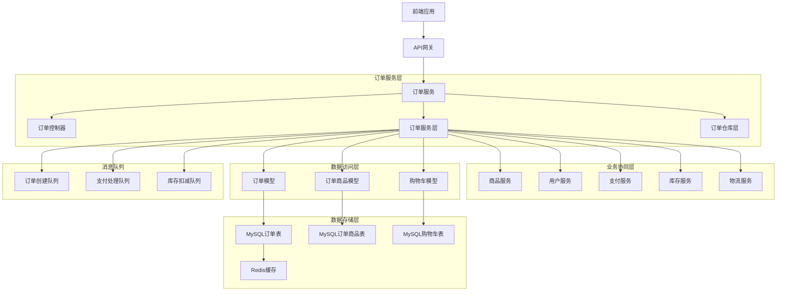

# 05-订单管理系统

## 1. 订单管理系统概述

### 1.0 TypeScript在订单管理中的优势

在订单管理系统中，TypeScript提供了强大的类型安全保障，特别是在处理复杂的订单业务逻辑和状态管理时：

#### 1.0.1 类型安全的订单数据
```typescript
// 订单基础接口
interface Order {
  id: number;
  order_no: string;
  user_id: number;
  status: OrderStatus;
  subtotal: number;
  shipping_amount: number;
  discount_amount: number;
  total_amount: number;
  payment_status: PaymentStatus;
  shipping_address: Address;
  billing_address?: Address;
  created_at: Date;
  updated_at: Date;
}

// 订单状态类型
type OrderStatus = 
  | 'pending'      // 待确认
  | 'confirmed'    // 已确认
  | 'paid'         // 已支付
  | 'shipped'      // 已发货
  | 'delivered'    // 已送达
  | 'completed'    // 已完成
  | 'cancelled'    // 已取消
  | 'refunded';    // 已退款

// 支付状态类型
type PaymentStatus = 
  | 'unpaid'       // 未支付
  | 'paid'         // 已支付
  | 'refunding'    // 退款中
  | 'refunded';    // 已退款

// 订单商品接口
interface OrderItem {
  id: number;
  order_id: number;
  product_id: number;
  variant_id?: number;
  product_name: string;
  product_sku: string;
  quantity: number;
  unit_price: number;
  total_price: number;
  product_snapshot: ProductSnapshot;
}

// 商品快照接口
interface ProductSnapshot {
  name: string;
  sku: string;
  price: number;
  image_url?: string;
  attributes?: Record<string, any>;
}
```

#### 1.0.2 业务逻辑类型安全
```typescript
// 订单创建请求类型
interface CreateOrderRequest {
  items: OrderItemRequest[];
  shipping_address: Address;
  billing_address?: Address;
  coupon_code?: string;
  remark?: string;
}

interface OrderItemRequest {
  product_id: number;
  variant_id?: number;
  quantity: number;
}

// 订单状态变更类型
interface OrderStatusChange {
  order_id: number;
  old_status: OrderStatus;
  new_status: OrderStatus;
  operator_id?: number;
  remark?: string;
  timestamp: Date;
}

// 购物车接口
interface Cart {
  id: number;
  user_id: number;
  items: CartItem[];
  total_items: number;
  total_amount: number;
  created_at: Date;
  updated_at: Date;
}

interface CartItem {
  id: number;
  cart_id: number;
  product_id: number;
  variant_id?: number;
  quantity: number;
  added_at: Date;
}
```

### 1.1 功能需求分析

订单管理是电商系统的核心业务模块，主要包含以下功能：

1. **购物车管理**：商品添加、数量修改、删除等操作，支持TypeScript类型验证
2. **订单创建**：从购物车生成订单、订单信息确认，类型安全的订单构建
3. **订单支付**：订单支付处理、支付状态更新，强类型的支付流程
4. **订单状态管理**：订单状态流转、物流跟踪，类型化的状态机
5. **订单查询**：订单列表、订单详情查询，类型安全的查询接口
6. **订单操作**：订单取消、退货退款等操作，类型化的业务规则

### 1.2 技术架构设计



## 2. 订单模型设计

### 2.1 订单主表设计

#### 2.1.1 订单模型实现
```typescript
// src/app/models/order.model.ts
import { DataTypes, Model, Optional, Sequelize } from 'sequelize';
import BaseModel from './base.model';
import { OrderAttributes, OrderCreationAttributes } from '../types/order.types';

// 订单模型接口
interface OrderInstance extends Model<OrderAttributes, OrderCreationAttributes>, OrderAttributes {
  // 实例方法
  calculateTotal(): Promise<number>;
  getStatusHistory(): Promise<OrderStatusHistory[]>;
  updateStatus(newStatus: OrderStatus, options?: OrderStatusUpdateOptions): Promise<void>;
  emitStatusChangeEvent(newStatus: OrderStatus, options?: OrderStatusUpdateOptions): Promise<void>;
  reserveInventory(options?: InventoryOptions): Promise<void>;
  releaseInventory(options?: InventoryOptions): Promise<void>;
  updateProductSales(options?: SalesUpdateOptions): Promise<void>;
  
  // 关联方法
  getOrderItemList(options?: any): Promise<OrderItem[]>;
  createOrderStatusHistory(data: any, options?: any): Promise<OrderStatusHistory>;
  getOrderStatusHistoryList(options?: any): Promise<OrderStatusHistory[]>;
}

// 订单状态更新选项
interface OrderStatusUpdateOptions {
  transaction?: any;
  remark?: string;
  operatorId?: number;
}

// 库存操作选项
interface InventoryOptions {
  transaction?: any;
  reason?: string;
}

// 销量更新选项
interface SalesUpdateOptions {
  transaction?: any;
}

// 订单状态历史接口
interface OrderStatusHistory {
  id: number;
  order_id: number;
  status: OrderStatus;
  remark?: string;
  operator_id?: number;
  created_at: Date;
}

class Order extends BaseModel<OrderAttributes, OrderCreationAttributes> {
  declare id: number;
  declare order_no: string;
  declare user_id: number;
  declare status: OrderStatus;
  declare subtotal: number;
  declare shipping_amount: number;
  declare discount_amount: number;
  declare total_amount: number;
  declare payment_status: PaymentStatus;
  declare shipping_address: Address;
  declare billing_address?: Address;
  declare created_at: Date;
  declare updated_at: Date;

  /**
   * 计算订单总金额
   * @returns 订单总金额
   */
  async calculateTotal(): Promise<number> {
    const items = await this.getOrderItemList();
    const subtotal = items.reduce((sum: number, item: OrderItem) => sum + item.total_price, 0);
    
    this.subtotal = subtotal;
    this.total_amount = subtotal + this.shipping_amount - this.discount_amount;
    
    return this.total_amount;
  }

  /**
   * 获取订单状态历史
   * @returns 订单状态历史列表
   */
  async getStatusHistory(): Promise<OrderStatusHistory[]> {
    return await this.getOrderStatusHistoryList({
      order: [['created_at', 'ASC']]
    });
  }

  /**
   * 更新订单状态
   * @param newStatus 新状态
   * @param options 更新选项
   */
  async updateStatus(newStatus: OrderStatus, options: OrderStatusUpdateOptions = {}): Promise<void> {
    const transaction = options.transaction;
    
    // 记录状态变更历史
    await this.createOrderStatusHistory({
      status: newStatus,
      remark: options.remark || '',
      operator_id: options.operatorId
    }, { transaction });
    
    // 更新订单状态
    await this.update({ status: newStatus }, { transaction });
    
    // 触发状态变更事件
    await this.emitStatusChangeEvent(newStatus, options);
  }

  /**
   * 触发状态变更事件
   * @param newStatus 新状态
   * @param options 事件选项
   */
  async emitStatusChangeEvent(newStatus: OrderStatus, options: OrderStatusUpdateOptions = {}): Promise<void> {
    const event: OrderStatusChange = {
      order_id: this.id,
      old_status: this.status,
      new_status: newStatus,
      timestamp: new Date(),
      operator_id: options.operatorId,
      remark: options.remark
    };
    
    // 发布订单状态变更事件
    // await messageQueue.publish('order.status.changed', event);
    
    // 根据状态变更执行相应操作
    switch (newStatus) {
      case 'confirmed':
        // 确认订单后扣减库存
        await this.reserveInventory(options);
        break;
      case 'cancelled':
        // 取消订单后释放库存
        await this.releaseInventory(options);
        break;
      case 'delivered':
        // 订单完成，增加商品销量
        await this.updateProductSales(options);
        break;
    }
  }

  /**
   * 预留库存
   * @param options 库存操作选项
   */
  async reserveInventory(options: InventoryOptions = {}): Promise<void> {
    const items = await this.getOrderItemList();
    
    for (const item of items) {
      // 调用库存服务预留库存
      // await inventoryService.reserve(item.product_id, item.quantity, options);
    }
  }

  /**
   * 释放库存
   * @param options 库存操作选项
   */
  async releaseInventory(options: InventoryOptions = {}): Promise<void> {
    const items = await this.getOrderItemList();
    
    for (const item of items) {
      // 调用库存服务释放库存
      // await inventoryService.release(item.product_id, item.quantity, options);
    }
  }

  // 更新商品销量
  async updateProductSales(options = {}) {
    const items = await this.getOrderItemList();
    
    for (const item of items) {
      // 调用商品服务增加销量
      // await productService.increaseSales(item.product_id, item.quantity, options);
    }
  }

  // 生成订单号
  static generateOrderNumber() {
    const date = new Date();
    const year = date.getFullYear();
    const month = String(date.getMonth() + 1).padStart(2, '0');
    const day = String(date.getDate()).padStart(2, '0');
    const timestamp = Date.now().toString().slice(-6);
    const random = Math.random().toString(36).substr(2, 4).toUpperCase();
    
    return `${year}${month}${day}${timestamp}${random}`;
  }
}

Order.init({
  order_number: {
    type: DataTypes.STRING(50),
    allowNull: false,
    unique: true,
    comment: '订单号'
  },
  user_id: {
    type: DataTypes.BIGINT,
    allowNull: false,
    comment: '用户ID',
    references: {
      model: 'users',
      key: 'id'
    }
  },
  status: {
    type: DataTypes.ENUM(
      'pending',      // 待确认
      'confirmed',    // 已确认
      'processing',   // 处理中
      'shipped',      // 已发货
      'delivered',    // 已送达
      'cancelled',    // 已取消
      'refunded'      // 已退款
    ),
    defaultValue: 'pending',
    comment: '订单状态'
  },
  payment_status: {
    type: DataTypes.ENUM(
      'pending',      // 待支付
      'paid',         // 已支付
      'failed',       // 支付失败
      'refunded',     // 已退款
      'partially_refunded' // 部分退款
    ),
    defaultValue: 'pending',
    comment: '支付状态'
  },
  
  // 金额信息
  subtotal: {
    type: DataTypes.DECIMAL(10, 2),
    defaultValue: 0,
    comment: '小计金额'
  },
  tax_amount: {
    type: DataTypes.DECIMAL(10, 2),
    defaultValue: 0,
    comment: '税费'
  },
  shipping_amount: {
    type: DataTypes.DECIMAL(10, 2),
    defaultValue: 0,
    comment: '运费'
  },
  discount_amount: {
    type: DataTypes.DECIMAL(10, 2),
    defaultValue: 0,
    comment: '折扣金额'
  },
  total_amount: {
    type: DataTypes.DECIMAL(10, 2),
    defaultValue: 0,
    comment: '总金额'
  },
  
  // 收货信息
  shipping_address: {
    type: DataTypes.JSON,
    allowNull: false,
    comment: '收货地址'
  },
  billing_address: {
    type: DataTypes.JSON,
    allowNull: true,
    comment: '账单地址'
  },
  
  // 物流信息
  shipping_method: {
    type: DataTypes.STRING(100),
    allowNull: true,
    comment: '配送方式'
  },
  tracking_number: {
    type: DataTypes.STRING(100),
    allowNull: true,
    comment: '物流单号'
  },
  shipped_at: {
    type: DataTypes.DATE,
    allowNull: true,
    comment: '发货时间'
  },
  delivered_at: {
    type: DataTypes.DATE,
    allowNull: true,
    comment: '送达时间'
  },
  
  // 其他信息
  notes: {
    type: DataTypes.TEXT,
    allowNull: true,
    comment: '订单备注'
  },
  internal_notes: {
    type: DataTypes.TEXT,
    allowNull: true,
    comment: '内部备注'
  },
  coupon_code: {
    type: DataTypes.STRING(50),
    allowNull: true,
    comment: '优惠券代码'
  },
  currency: {
    type: DataTypes.STRING(3),
    defaultValue: 'CNY',
    comment: '货币代码'
  },
  
  // 时间戳
  confirmed_at: {
    type: DataTypes.DATE,
    allowNull: true,
    comment: '确认时间'
  },
  cancelled_at: {
    type: DataTypes.DATE,
    allowNull: true,
    comment: '取消时间'
  }
}, {
  sequelize,
  tableName: 'orders',
  paranoid: true,
  indexes: [
    { fields: ['order_number'] },
    { fields: ['user_id'] },
    { fields: ['status'] },
    { fields: ['payment_status'] },
    { fields: ['created_at'] },
    { fields: ['total_amount'] },
    { fields: ['tracking_number'] }
  ],
  hooks: {
    beforeCreate: async (order) => {
      // 自动生成订单号
      if (!order.order_number) {
        order.order_number = Order.generateOrderNumber();
      }
    },
    afterCreate: async (order) => {
      // 记录初始状态
      await order.createOrderStatusHistory({
        status: order.status,
        remark: '订单创建'
      });
    }
  }
});

module.exports = Order;
```

### 2.2 订单商品模型

#### 2.2.1 订单商品模型实现
```typescript
// src/app/models/order-item.model.ts
import { DataTypes, Model, Optional } from 'sequelize';
import BaseModel from './base.model';
import { OrderItemAttributes, OrderItemCreationAttributes } from '../types/order.types';

// 订单商品模型接口
interface OrderItemInstance extends Model<OrderItemAttributes, OrderItemCreationAttributes>, OrderItemAttributes {
  // 实例方法
  calculateTotalPrice(): number;
  getProductSnapshot(): ProductSnapshot;
  updateQuantity(newQuantity: number): Promise<void>;
}

class OrderItem extends BaseModel<OrderItemAttributes, OrderItemCreationAttributes> {
  declare id: number;
  declare order_id: number;
  declare product_id: number;
  declare variant_id?: number;
  declare product_name: string;
  declare product_sku: string;
  declare quantity: number;
  declare unit_price: number;
  declare total_price: number;
  declare product_snapshot: ProductSnapshot;
  declare created_at: Date;
  declare updated_at: Date;

  /**
   * 计算单项总价
   * @returns 总价
   */
  calculateTotalPrice(): number {
    this.total_price = this.unit_price * this.quantity;
    return this.total_price;
  }

  /**
   * 获取商品快照
   * @returns 商品快照
   */
  getProductSnapshot(): ProductSnapshot {
    return this.product_snapshot;
  }

  /**
   * 更新数量
   * @param newQuantity 新数量
   */
  async updateQuantity(newQuantity: number): Promise<void> {
    this.quantity = newQuantity;
    this.calculateTotalPrice();
    await this.save();
  }
}

OrderItem.init({
  order_id: {
    type: DataTypes.BIGINT,
    allowNull: false,
    comment: '订单ID',
    references: {
      model: 'orders',
      key: 'id'
    }
  },
  product_id: {
    type: DataTypes.BIGINT,
    allowNull: false,
    comment: '商品ID',
    references: {
      model: 'products',
      key: 'id'
    }
  },
  variant_id: {
    type: DataTypes.BIGINT,
    allowNull: true,
    comment: '商品变体ID'
  },
  sku: {
    type: DataTypes.STRING(100),
    allowNull: false,
    comment: '商品SKU'
  },
  name: {
    type: DataTypes.STRING(200),
    allowNull: false,
    comment: '商品名称'
  },
  image_url: {
    type: DataTypes.STRING(500),
    allowNull: true,
    comment: '商品图片'
  },
  unit_price: {
    type: DataTypes.DECIMAL(10, 2),
    allowNull: false,
    comment: '单价'
  },
  quantity: {
    type: DataTypes.INTEGER,
    allowNull: false,
    comment: '数量'
  },
  total_price: {
    type: DataTypes.DECIMAL(10, 2),
    allowNull: false,
    comment: '总价'
  },
  cost_price: {
    type: DataTypes.DECIMAL(10, 2),
    allowNull: true,
    comment: '成本价'
  },
  properties: {
    type: DataTypes.JSON,
    allowNull: true,
    comment: '商品属性快照'
  }
}, {
  sequelize,
  tableName: 'order_items',
  indexes: [
    { fields: ['order_id'] },
    { fields: ['product_id'] },
    { fields: ['sku'] }
  ],
  hooks: {
    beforeSave: async (item) => {
      // 自动计算总价
      if (item.changed('unit_price') || item.changed('quantity')) {
        item.calculateTotalPrice();
      }
    }
  }
});

module.exports = OrderItem;
```

### 2.3 订单状态历史模型

#### 2.3.1 状态历史模型实现
```typescript
// src/app/models/order-status-history.model.ts
import { DataTypes, Model, Optional } from 'sequelize';
import BaseModel from './base.model';
import { OrderStatusHistoryAttributes, OrderStatusHistoryCreationAttributes } from '../types/order.types';

// 订单状态历史模型接口
interface OrderStatusHistoryInstance extends Model<OrderStatusHistoryAttributes, OrderStatusHistoryCreationAttributes>, OrderStatusHistoryAttributes {
  // 实例方法
  getStatusDisplayName(): string;
  getPreviousStatus(): string | null;
  getNextStatus(): string | null;
}

class OrderStatusHistory extends BaseModel<OrderStatusHistoryAttributes, OrderStatusHistoryCreationAttributes> {
  declare id: number;
  declare order_id: number;
  declare from_status: string;
  declare to_status: string;
  declare reason?: string;
  declare operator_id?: number;
  declare operator_name?: string;
  declare created_at: Date;
  declare updated_at: Date;

  /**
   * 获取状态显示名称
   * @returns 状态显示名称
   */
  getStatusDisplayName(): string {
    const statusNames: Record<string, string> = {
      'pending': '待处理',
      'confirmed': '已确认',
      'shipped': '已发货',
      'delivered': '已送达',
      'cancelled': '已取消',
      'refunded': '已退款'
    };
    return statusNames[this.to_status] || this.to_status;
  }

  /**
   * 获取上一个状态
   * @returns 上一个状态
   */
  getPreviousStatus(): string | null {
    return this.from_status;
  }

  /**
   * 获取下一个状态
   * @returns 下一个状态
   */
  getNextStatus(): string | null {
    return this.to_status;
  }
}

OrderStatusHistory.init({
  order_id: {
    type: DataTypes.BIGINT,
    allowNull: false,
    comment: '订单ID',
    references: {
      model: 'orders',
      key: 'id'
    }
  },
  status: {
    type: DataTypes.STRING(50),
    allowNull: false,
    comment: '订单状态'
  },
  remark: {
    type: DataTypes.STRING(500),
    allowNull: true,
    comment: '备注'
  },
  operator_id: {
    type: DataTypes.BIGINT,
    allowNull: true,
    comment: '操作人ID'
  }
}, {
  sequelize,
  tableName: 'order_status_histories',
  indexes: [
    { fields: ['order_id'] },
    { fields: ['status'] },
    { fields: ['created_at'] }
  ]
});

module.exports = OrderStatusHistory;
```

## 3. 购物车模型设计

### 3.1 购物车模型实现

```typescript
// src/app/models/cart-item.model.ts
import { DataTypes, Model, Optional } from 'sequelize';
import BaseModel from './base.model';
import { CartItemAttributes, CartItemCreationAttributes } from '../types/cart.types';
import { Product } from './product.model';

// 购物车商品模型接口
interface CartItemInstance extends Model<CartItemAttributes, CartItemCreationAttributes>, CartItemAttributes {
  // 实例方法
  updateProductSnapshot(): Promise<void>;
  calculateTotalPrice(): number;
  isValid(): Promise<boolean>;
}

class CartItem extends BaseModel<CartItemAttributes, CartItemCreationAttributes> {
  declare id: number;
  declare user_id: number;
  declare product_id: number;
  declare variant_id?: number;
  declare quantity: number;
  declare name: string;
  declare sku: string;
  declare image_url?: string;
  declare unit_price: number;
  declare total_price: number;
  declare properties?: Record<string, any>;
  declare created_at: Date;
  declare updated_at: Date;

  /**
   * 更新商品信息快照
   */
  async updateProductSnapshot(): Promise<void> {
    const product = await Product.findByPk(this.product_id);
    if (product) {
      this.name = product.name;
      this.sku = product.sku;
      this.image_url = product.images && product.images[0];
      this.unit_price = product.price;
      this.properties = product.attributes;
    }
  }

  // 计算小计
  calculateSubtotal() {
    this.subtotal = this.unit_price * this.quantity;
    return this.subtotal;
  }
}

CartItem.init({
  user_id: {
    type: DataTypes.BIGINT,
    allowNull: false,
    comment: '用户ID',
    references: {
      model: 'users',
      key: 'id'
    }
  },
  product_id: {
    type: DataTypes.BIGINT,
    allowNull: false,
    comment: '商品ID',
    references: {
      model: 'products',
      key: 'id'
    }
  },
  variant_id: {
    type: DataTypes.BIGINT,
    allowNull: true,
    comment: '商品变体ID'
  },
  sku: {
    type: DataTypes.STRING(100),
    allowNull: false,
    comment: '商品SKU'
  },
  name: {
    type: DataTypes.STRING(200),
    allowNull: false,
    comment: '商品名称'
  },
  image_url: {
    type: DataTypes.STRING(500),
    allowNull: true,
    comment: '商品图片'
  },
  unit_price: {
    type: DataTypes.DECIMAL(10, 2),
    allowNull: false,
    comment: '单价'
  },
  quantity: {
    type: DataTypes.INTEGER,
    defaultValue: 1,
    comment: '数量'
  },
  subtotal: {
    type: DataTypes.DECIMAL(10, 2),
    defaultValue: 0,
    comment: '小计'
  },
  properties: {
    type: DataTypes.JSON,
    allowNull: true,
    comment: '商品属性'
  },
  is_selected: {
    type: DataTypes.BOOLEAN,
    defaultValue: true,
    comment: '是否选中'
  }
}, {
  sequelize,
  tableName: 'cart_items',
  indexes: [
    { fields: ['user_id'] },
    { fields: ['product_id'] },
    { fields: ['sku'] },
    { fields: ['is_selected'] }
  ],
  hooks: {
    beforeSave: async (item) => {
      // 更新商品快照
      if (!item.id && (item.changed('product_id') || item.changed('variant_id'))) {
        await item.updateProductSnapshot();
      }
      
      // 计算小计
      if (item.changed('unit_price') || item.changed('quantity')) {
        item.calculateSubtotal();
      }
    }
  }
});

module.exports = CartItem;
```

## 4. 订单服务层实现

### 4.1 订单服务类

```javascript
// src/app/services/order.service.js
const { Op, sequelize } = require('sequelize');
const { 
  Order, 
  OrderItem, 
  OrderStatusHistory, 
  CartItem,
  Product,
  Inventory
} = require('../models');
const redis = require('../../utils/redis.client');
const messageQueue = require('../../utils/message-queue');

class OrderService {
  // 创建订单
  async createOrder(orderData, options = {}) {
    const transaction = options.transaction || await sequelize.transaction();
    
    try {
      const { user_id, shipping_address, billing_address, notes, coupon_code, items } = orderData;
      
      // 1. 验证商品库存
      for (const item of items) {
        const product = await Product.findByPk(item.product_id, { transaction });
        if (!product) {
          throw new Error(`商品 ${item.product_id} 不存在`);
        }
        
        if (product.status !== 'active') {
          throw new Error(`商品 ${product.name} 已下架`);
        }
        
        // 检查库存
        if (product.track_inventory) {
          const inventory = await Inventory.findOne({
            where: { product_id: item.product_id },
            transaction
          });
          
          if (inventory && inventory.available_quantity < item.quantity) {
            throw new Error(`商品 ${product.name} 库存不足`);
          }
        }
      }
      
      // 2. 计算订单金额
      let subtotal = 0;
      const orderItems = items.map(item => {
        const total_price = item.unit_price * item.quantity;
        subtotal += total_price;
        return {
          ...item,
          total_price
        };
      });
      
      // 3. 创建订单
      const order = await Order.create({
        order_number: Order.generateOrderNumber(),
        user_id,
        shipping_address,
        billing_address,
        notes,
        coupon_code,
        subtotal,
        total_amount: subtotal // 暂时不计算运费和折扣
      }, { transaction });
      
      // 4. 创建订单商品
      const orderItemData = orderItems.map(item => ({
        ...item,
        order_id: order.id
      }));
      
      await OrderItem.bulkCreate(orderItemData, { transaction });
      
      // 5. 清空购物车（如果来自购物车）
      if (options.clearCart) {
        await CartItem.destroy({
          where: { 
            user_id,
            product_id: { [Op.in]: items.map(item => item.product_id) }
          },
          transaction
        });
      }
      
      // 6. 提交事务
      if (!options.transaction) {
        await transaction.commit();
      }
      
      // 7. 发布订单创建事件
      await messageQueue.publish('order.created', {
        orderId: order.id,
        userId: user_id,
        items: orderItems,
        totalAmount: order.total_amount
      });
      
      return order;
      
    } catch (error) {
      // 回滚事务
      if (!options.transaction) {
        await transaction.rollback();
      }
      throw error;
    }
  }

  // 获取订单详情
  async getOrderById(id, userId = null) {
    const cacheKey = `order:${id}`;
    
    // 尝试从缓存获取
    const cached = await redis.get(cacheKey);
    if (cached) {
      const order = JSON.parse(cached);
      // 权限检查
      if (userId && order.user_id !== userId && !this.isAdmin(userId)) {
        throw new Error('无权查看此订单');
      }
      return order;
    }
    
    // 从数据库获取
    const order = await Order.findByPk(id, {
      include: [
        {
          model: OrderItem,
          as: 'orderItemList'
        },
        {
          model: OrderStatusHistory,
          as: 'orderStatusHistoryList',
          order: [['created_at', 'ASC']]
        }
      ]
    });
    
    if (!order) {
      throw new Error('订单不存在');
    }
    
    // 权限检查
    if (userId && order.user_id !== userId && !this.isAdmin(userId)) {
      throw new Error('无权查看此订单');
    }
    
    // 缓存1小时
    await redis.setex(cacheKey, 3600, JSON.stringify(order));
    
    return order;
  }

  // 获取用户订单列表
  async getUserOrders(userId, options = {}) {
    const {
      page = 1,
      limit = 10,
      status,
      payment_status,
      start_date,
      end_date
    } = options;
    
    const offset = (page - 1) * limit;
    
    // 构建查询条件
    const where = { user_id: userId };
    
    if (status) {
      where.status = status;
    }
    
    if (payment_status) {
      where.payment_status = payment_status;
    }
    
    if (start_date || end_date) {
      where.created_at = {};
      if (start_date) where.created_at[Op.gte] = new Date(start_date);
      if (end_date) where.created_at[Op.lte] = new Date(end_date);
    }
    
    const result = await Order.findAndCountAll({
      where,
      include: [
        {
          model: OrderItem,
          as: 'orderItemList'
        }
      ],
      order: [['created_at', 'DESC']],
      limit: parseInt(limit),
      offset: parseInt(offset)
    });
    
    return {
      data: result.rows,
      pagination: {
        total: result.count,
        page: parseInt(page),
        limit: parseInt(limit),
        pages: Math.ceil(result.count / limit)
      }
    };
  }

  // 更新订单状态
  async updateOrderStatus(orderId, newStatus, options = {}) {
    const transaction = options.transaction || await sequelize.transaction();
    
    try {
      const order = await Order.findByPk(orderId, { transaction });
      
      if (!order) {
        throw new Error('订单不存在');
      }
      
      // 检查状态流转是否合法
      if (!this.isValidStatusTransition(order.status, newStatus)) {
        throw new Error(`订单状态不能从 ${order.status} 变更为 ${newStatus}`);
      }
      
      // 更新状态
      await order.updateStatus(newStatus, {
        transaction,
        operatorId: options.operatorId,
        remark: options.remark
      });
      
      // 特殊状态处理
      switch (newStatus) {
        case 'confirmed':
          // 确认订单时间
          await order.update({ confirmed_at: new Date() }, { transaction });
          break;
        case 'shipped':
          // 发货时间
          await order.update({ 
            shipped_at: new Date(),
            tracking_number: options.trackingNumber
          }, { transaction });
          break;
        case 'delivered':
          // 送达时间
          await order.update({ delivered_at: new Date() }, { transaction });
          break;
        case 'cancelled':
          // 取消订单时间
          await order.update({ cancelled_at: new Date() }, { transaction });
          break;
      }
      
      // 提交事务
      if (!options.transaction) {
        await transaction.commit();
      }
      
      // 清除缓存
      await redis.del(`order:${orderId}`);
      
      // 发布状态变更事件
      await messageQueue.publish('order.status.changed', {
        orderId: order.id,
        oldStatus: order.status,
        newStatus,
        timestamp: new Date()
      });
      
      return order;
      
    } catch (error) {
      // 回滚事务
      if (!options.transaction) {
        await transaction.rollback();
      }
      throw error;
    }
  }

  // 取消订单
  async cancelOrder(orderId, userId, reason = '') {
    const transaction = await sequelize.transaction();
    
    try {
      const order = await Order.findByPk(orderId, { transaction });
      
      if (!order) {
        throw new Error('订单不存在');
      }
      
      // 权限检查
      if (order.user_id !== userId && !this.isAdmin(userId)) {
        throw new Error('无权取消此订单');
      }
      
      // 检查订单状态是否可以取消
      if (!['pending', 'confirmed'].includes(order.status)) {
        throw new Error('当前订单状态无法取消');
      }
      
      // 更新订单状态
      await order.updateStatus('cancelled', {
        transaction,
        operatorId: userId,
        remark: `用户取消订单: ${reason}`
      });
      
      // 更新取消时间
      await order.update({ cancelled_at: new Date() }, { transaction });
      
      // 释放库存
      await order.releaseInventory({ transaction });
      
      // 提交事务
      await transaction.commit();
      
      // 清除缓存
      await redis.del(`order:${orderId}`);
      
      return order;
      
    } catch (error) {
      await transaction.rollback();
      throw error;
    }
  }

  // 订单状态流转验证
  isValidStatusTransition(oldStatus, newStatus) {
    const validTransitions = {
      'pending': ['confirmed', 'cancelled'],
      'confirmed': ['processing', 'cancelled'],
      'processing': ['shipped', 'cancelled'],
      'shipped': ['delivered', 'cancelled'],
      'delivered': ['refunded'],
      'cancelled': [],
      'refunded': []
    };
    
    return validTransitions[oldStatus] && validTransitions[oldStatus].includes(newStatus);
  }

  // 检查是否为管理员
  async isAdmin(userId) {
    // 实现管理员检查逻辑
    return false;
  }
}

module.exports = new OrderService();
```

## 5. 购物车服务层实现

### 5.1 购物车服务类

```javascript
// src/app/services/cart.service.js
const { Op } = require('sequelize');
const { CartItem, Product } = require('../models');
const redis = require('../../utils/redis.client');

class CartService {
  // 添加商品到购物车
  async addToCart(userId, productData) {
    const { product_id, variant_id, quantity = 1 } = productData;
    
    // 获取商品信息
    const product = await Product.findByPk(product_id);
    if (!product) {
      throw new Error('商品不存在');
    }
    
    if (product.status !== 'active') {
      throw new Error('商品已下架');
    }
    
    // 检查是否已存在
    const existingItem = await CartItem.findOne({
      where: {
        user_id: userId,
        product_id,
        ...(variant_id && { variant_id })
      }
    });
    
    if (existingItem) {
      // 更新数量
      const newQuantity = existingItem.quantity + quantity;
      await existingItem.update({
        quantity: newQuantity,
        subtotal: product.price * newQuantity
      });
      
      return existingItem;
    } else {
      // 创建新项
      const cartItem = await CartItem.create({
        user_id: userId,
        product_id,
        variant_id,
        sku: product.sku,
        name: product.name,
        image_url: product.images && product.images[0],
        unit_price: product.price,
        quantity,
        subtotal: product.price * quantity,
        properties: product.attributes
      });
      
      return cartItem;
    }
  }

  // 更新购物车商品数量
  async updateCartItem(userId, itemId, quantity) {
    const cartItem = await CartItem.findOne({
      where: {
        id: itemId,
        user_id: userId
      }
    });
    
    if (!cartItem) {
      throw new Error('购物车商品不存在');
    }
    
    if (quantity <= 0) {
      // 删除商品
      await cartItem.destroy();
      return null;
    }
    
    // 更新数量和小计
    await cartItem.update({
      quantity,
      subtotal: cartItem.unit_price * quantity
    });
    
    return cartItem;
  }

  // 删除购物车商品
  async removeCartItem(userId, itemId) {
    const cartItem = await CartItem.findOne({
      where: {
        id: itemId,
        user_id: userId
      }
    });
    
    if (!cartItem) {
      throw new Error('购物车商品不存在');
    }
    
    await cartItem.destroy();
    return true;
  }

  // 清空购物车
  async clearCart(userId) {
    await CartItem.destroy({
      where: { user_id: userId }
    });
    return true;
  }

  // 获取用户购物车
  async getUserCart(userId, options = {}) {
    const cacheKey = `cart:${userId}`;
    
    // 尝试从缓存获取
    if (!options.skipCache) {
      const cached = await redis.get(cacheKey);
      if (cached) {
        return JSON.parse(cached);
      }
    }
    
    // 从数据库获取
    const cartItems = await CartItem.findAll({
      where: { user_id: userId },
      order: [['created_at', 'ASC']]
    });
    
    // 计算总计
    const totalQuantity = cartItems.reduce((sum, item) => sum + item.quantity, 0);
    const totalPrice = cartItems.reduce((sum, item) => sum + item.subtotal, 0);
    
    const cartSummary = {
      items: cartItems,
      total_quantity: totalQuantity,
      total_price: totalPrice,
      selected_count: cartItems.filter(item => item.is_selected).length
    };
    
    // 缓存15分钟
    if (!options.skipCache) {
      await redis.setex(cacheKey, 900, JSON.stringify(cartSummary));
    }
    
    return cartSummary;
  }

  // 选择/取消选择购物车商品
  async selectCartItem(userId, itemId, isSelected) {
    const cartItem = await CartItem.findOne({
      where: {
        id: itemId,
        user_id: userId
      }
    });
    
    if (!cartItem) {
      throw new Error('购物车商品不存在');
    }
    
    await cartItem.update({ is_selected: isSelected });
    
    // 清除缓存
    await redis.del(`cart:${userId}`);
    
    return cartItem;
  }

  // 全选/取消全选
  async selectAllItems(userId, isSelected) {
    await CartItem.update(
      { is_selected: isSelected },
      { where: { user_id: userId } }
    );
    
    // 清除缓存
    await redis.del(`cart:${userId}`);
    
    return true;
  }
}

module.exports = new CartService();
```

## 6. 订单控制器实现

### 6.1 订单控制器类

```javascript
// src/app/controllers/order.controller.js
const orderService = require('../services/order.service');
const cartService = require('../services/cart.service');
const { orderValidator } = require('../validators/order.validator');

class OrderController {
  // 创建订单
  async create(ctx) {
    try {
      // 数据验证
      const { error, value } = orderValidator.create.validate(ctx.request.body);
      if (error) {
        ctx.status = 400;
        ctx.body = {
          success: false,
          message: '数据验证失败',
          errors: error.details
        };
        return;
      }

      // 从购物车创建订单
      if (value.from_cart) {
        const cart = await cartService.getUserCart(ctx.user.userId);
        const selectedItems = cart.items.filter(item => item.is_selected);
        
        if (selectedItems.length === 0) {
          ctx.status = 400;
          ctx.body = {
            success: false,
            message: '请选择要购买的商品'
          };
          return;
        }
        
        value.items = selectedItems.map(item => ({
          product_id: item.product_id,
          variant_id: item.variant_id,
          sku: item.sku,
          name: item.name,
          unit_price: item.unit_price,
          quantity: item.quantity,
          total_price: item.subtotal
        }));
      }

      // 创建订单
      const order = await orderService.createOrder({
        ...value,
        user_id: ctx.user.userId
      }, { clearCart: value.from_cart });
      
      ctx.status = 201;
      ctx.body = {
        success: true,
        message: '订单创建成功',
        data: order
      };
      
    } catch (error) {
      console.error('Create order error:', error);
      ctx.status = 500;
      ctx.body = {
        success: false,
        message: error.message || '订单创建失败'
      };
    }
  }

  // 获取订单详情
  async show(ctx) {
    try {
      const { id } = ctx.params;
      
      const order = await orderService.getOrderById(id, ctx.user.userId);
      
      ctx.status = 200;
      ctx.body = {
        success: true,
        data: order
      };
      
    } catch (error) {
      console.error('Get order error:', error);
      
      if (error.message === '订单不存在') {
        ctx.status = 404;
        ctx.body = {
          success: false,
          message: '订单不存在'
        };
      } else if (error.message === '无权查看此订单') {
        ctx.status = 403;
        ctx.body = {
          success: false,
          message: '无权查看此订单'
        };
      } else {
        ctx.status = 500;
        ctx.body = {
          success: false,
          message: '获取订单失败'
        };
      }
    }
  }

  // 获取用户订单列表
  async list(ctx) {
    try {
      const {
        page,
        limit,
        status,
        payment_status,
        start_date,
        end_date
      } = ctx.query;
      
      const options = {
        page: page ? parseInt(page) : 1,
        limit: limit ? parseInt(limit) : 10,
        status,
        payment_status,
        start_date,
        end_date
      };
      
      const result = await orderService.getUserOrders(ctx.user.userId, options);
      
      ctx.status = 200;
      ctx.body = {
        success: true,
        data: result.data,
        pagination: result.pagination
      };
      
    } catch (error) {
      console.error('List orders error:', error);
      ctx.status = 500;
      ctx.body = {
        success: false,
        message: '获取订单列表失败'
      };
    }
  }

  // 取消订单
  async cancel(ctx) {
    try {
      const { id } = ctx.params;
      const { reason } = ctx.request.body;
      
      const order = await orderService.cancelOrder(id, ctx.user.userId, reason);
      
      ctx.status = 200;
      ctx.body = {
        success: true,
        message: '订单取消成功',
        data: order
      };
      
    } catch (error) {
      console.error('Cancel order error:', error);
      
      if (error.message === '订单不存在') {
        ctx.status = 404;
        ctx.body = {
          success: false,
          message: '订单不存在'
        };
      } else if (error.message === '无权取消此订单') {
        ctx.status = 403;
        ctx.body = {
          success: false,
          message: '无权取消此订单'
        };
      } else {
        ctx.status = 500;
        ctx.body = {
          success: false,
          message: error.message || '订单取消失败'
        };
      }
    }
  }
}

module.exports = new OrderController();
```

### 6.2 购物车控制器类

```javascript
// src/app/controllers/cart.controller.js
const cartService = require('../services/cart.service');
const { cartValidator } = require('../validators/cart.validator');

class CartController {
  // 添加商品到购物车
  async addItem(ctx) {
    try {
      const { error, value } = cartValidator.addItem.validate(ctx.request.body);
      if (error) {
        ctx.status = 400;
        ctx.body = {
          success: false,
          message: '数据验证失败',
          errors: error.details
        };
        return;
      }

      const cartItem = await cartService.addToCart(ctx.user.userId, value);
      
      ctx.status = 201;
      ctx.body = {
        success: true,
        message: '商品已添加到购物车',
        data: cartItem
      };
      
    } catch (error) {
      console.error('Add to cart error:', error);
      ctx.status = 500;
      ctx.body = {
        success: false,
        message: error.message || '添加商品失败'
      };
    }
  }

  // 更新购物车商品数量
  async updateItem(ctx) {
    try {
      const { id } = ctx.params;
      const { quantity } = ctx.request.body;
      
      const cartItem = await cartService.updateCartItem(ctx.user.userId, id, quantity);
      
      if (cartItem) {
        ctx.status = 200;
        ctx.body = {
          success: true,
          message: '购物车商品更新成功',
          data: cartItem
        };
      } else {
        ctx.status = 200;
        ctx.body = {
          success: true,
          message: '商品已从购物车移除'
        };
      }
      
    } catch (error) {
      console.error('Update cart item error:', error);
      ctx.status = 500;
      ctx.body = {
        success: false,
        message: error.message || '更新商品失败'
      };
    }
  }

  // 删除购物车商品
  async removeItem(ctx) {
    try {
      const { id } = ctx.params;
      
      await cartService.removeCartItem(ctx.user.userId, id);
      
      ctx.status = 200;
      ctx.body = {
        success: true,
        message: '商品已从购物车移除'
      };
      
    } catch (error) {
      console.error('Remove cart item error:', error);
      ctx.status = 500;
      ctx.body = {
        success: false,
        message: error.message || '移除商品失败'
      };
    }
  }

  // 获取用户购物车
  async getCart(ctx) {
    try {
      const cart = await cartService.getUserCart(ctx.user.userId);
      
      ctx.status = 200;
      ctx.body = {
        success: true,
        data: cart
      };
      
    } catch (error) {
      console.error('Get cart error:', error);
      ctx.status = 500;
      ctx.body = {
        success: false,
        message: '获取购物车失败'
      };
    }
  }

  // 清空购物车
  async clearCart(ctx) {
    try {
      await cartService.clearCart(ctx.user.userId);
      
      ctx.status = 200;
      ctx.body = {
        success: true,
        message: '购物车已清空'
      };
      
    } catch (error) {
      console.error('Clear cart error:', error);
      ctx.status = 500;
      ctx.body = {
        success: false,
        message: '清空购物车失败'
      };
    }
  }

  // 选择/取消选择商品
  async selectItem(ctx) {
    try {
      const { id } = ctx.params;
      const { is_selected } = ctx.request.body;
      
      const cartItem = await cartService.selectCartItem(ctx.user.userId, id, is_selected);
      
      ctx.status = 200;
      ctx.body = {
        success: true,
        message: is_selected ? '商品已选中' : '商品已取消选中',
        data: cartItem
      };
      
    } catch (error) {
      console.error('Select cart item error:', error);
      ctx.status = 500;
      ctx.body = {
        success: false,
        message: error.message || '操作失败'
      };
    }
  }

  // 全选/取消全选
  async selectAll(ctx) {
    try {
      const { is_selected } = ctx.request.body;
      
      await cartService.selectAllItems(ctx.user.userId, is_selected);
      
      ctx.status = 200;
      ctx.body = {
        success: true,
        message: is_selected ? '已全选' : '已取消全选'
      };
      
    } catch (error) {
      console.error('Select all items error:', error);
      ctx.status = 500;
      ctx.body = {
        success: false,
        message: '操作失败'
      };
    }
  }
}

module.exports = new CartController();
```

## 7. 订单验证器

### 7.1 订单数据验证

```javascript
// src/app/validators/order.validator.js
const Joi = require('joi');

const orderValidator = {
  // 创建订单验证
  create: Joi.object({
    from_cart: Joi.boolean().optional().default(false),
    
    shipping_address: Joi.object({
      name: Joi.string().max(100).required(),
      phone: Joi.string().max(20).required(),
      province: Joi.string().max(50).required(),
      city: Joi.string().max(50).required(),
      district: Joi.string().max(50).required(),
      address: Joi.string().max(200).required(),
      postal_code: Joi.string().max(10).optional()
    }).required(),
    
    billing_address: Joi.object({
      name: Joi.string().max(100).required(),
      phone: Joi.string().max(20).required(),
      province: Joi.string().max(50).required(),
      city: Joi.string().max(50).required(),
      district: Joi.string().max(50).required(),
      address: Joi.string().max(200).required(),
      postal_code: Joi.string().max(10).optional()
    }).optional(),
    
    notes: Joi.string().max(500).optional(),
    coupon_code: Joi.string().max(50).optional(),
    
    items: Joi.when('from_cart', {
      is: false,
      then: Joi.array().items(Joi.object({
        product_id: Joi.number().integer().positive().required(),
        variant_id: Joi.number().integer().positive().optional(),
        sku: Joi.string().max(100).required(),
        name: Joi.string().max(200).required(),
        unit_price: Joi.number().min(0).precision(2).required(),
        quantity: Joi.number().integer().min(1).required(),
        total_price: Joi.number().min(0).precision(2).required()
      })).required(),
      otherwise: Joi.forbidden()
    })
  }),
  
  // 取消订单验证
  cancel: Joi.object({
    reason: Joi.string().max(500).optional()
  })
};

module.exports = { orderValidator };
```

### 7.2 购物车数据验证

```javascript
// src/app/validators/cart.validator.js
const Joi = require('joi');

const cartValidator = {
  // 添加商品验证
  addItem: Joi.object({
    product_id: Joi.number().integer().positive().required().messages({
      'number.base': '商品ID必须是数字',
      'number.integer': '商品ID必须是整数',
      'number.positive': '商品ID必须是正数',
      'any.required': '商品ID是必填项'
    }),
    
    variant_id: Joi.number().integer().positive().optional().messages({
      'number.base': '商品变体ID必须是数字',
      'number.integer': '商品变体ID必须是整数',
      'number.positive': '商品变体ID必须是正数'
    }),
    
    quantity: Joi.number().integer().min(1).max(999).default(1).messages({
      'number.base': '数量必须是数字',
      'number.integer': '数量必须是整数',
      'number.min': '数量至少为1',
      'number.max': '数量最多为999'
    })
  }),
  
  // 更新商品验证
  updateItem: Joi.object({
    quantity: Joi.number().integer().min(0).max(999).required().messages({
      'number.base': '数量必须是数字',
      'number.integer': '数量必须是整数',
      'number.min': '数量不能为负数',
      'number.max': '数量最多为999',
      'any.required': '数量是必填项'
    })
  }),
  
  // 选择商品验证
  selectItem: Joi.object({
    is_selected: Joi.boolean().required().messages({
      'boolean.base': '选择状态必须是布尔值',
      'any.required': '选择状态是必填项'
    })
  }),
  
  // 全选验证
  selectAll: Joi.object({
    is_selected: Joi.boolean().required().messages({
      'boolean.base': '选择状态必须是布尔值',
      'any.required': '选择状态是必填项'
    })
  })
};

module.exports = { cartValidator };
```

## 8. 订单路由配置

### 8.1 订单路由定义

```javascript
// src/routes/order.routes.js
const Router = require('koa-router');
const orderController = require('../app/controllers/order.controller');
const cartController = require('../app/controllers/cart.controller');
const AuthMiddleware = require('../middleware/auth.middleware');

const router = new Router({ prefix: '/api/orders' });

// 需要认证的路由
router.use(AuthMiddleware.authenticate);

// 订单相关路由
router.post('/', orderController.create); // 创建订单
router.get('/', orderController.list); // 订单列表
router.get('/:id', orderController.show); // 订单详情
router.post('/:id/cancel', orderController.cancel); // 取消订单

// 购物车相关路由
const cartRouter = new Router({ prefix: '/api/cart' });
cartRouter.use(AuthMiddleware.authenticate);

cartRouter.get('/', cartController.getCart); // 获取购物车
cartRouter.post('/items', cartController.addItem); // 添加商品
cartRouter.put('/items/:id', cartController.updateItem); // 更新商品
cartRouter.delete('/items/:id', cartController.removeItem); // 删除商品
cartRouter.post('/items/:id/select', cartController.selectItem); // 选择商品
cartRouter.post('/select-all', cartController.selectAll); // 全选
cartRouter.delete('/clear', cartController.clearCart); // 清空购物车

module.exports = { orderRouter: router, cartRouter };
```

## 9. 订单状态管理

### 9.1 订单状态机实现

```javascript
// src/app/services/order-state-machine.js
class OrderStateMachine {
  constructor() {
    this.states = {
      PENDING: 'pending',      // 待确认
      CONFIRMED: 'confirmed',  // 已确认
      PROCESSING: 'processing', // 处理中
      SHIPPED: 'shipped',      // 已发货
      DELIVERED: 'delivered',  // 已送达
      CANCELLED: 'cancelled',  // 已取消
      REFUNDED: 'refunded'     // 已退款
    };
    
    this.transitions = {
      [this.states.PENDING]: [this.states.CONFIRMED, this.states.CANCELLED],
      [this.states.CONFIRMED]: [this.states.PROCESSING, this.states.CANCELLED],
      [this.states.PROCESSING]: [this.states.SHIPPED, this.states.CANCELLED],
      [this.states.SHIPPED]: [this.states.DELIVERED, this.states.CANCELLED],
      [this.states.DELIVERED]: [this.states.REFUNDED],
      [this.states.CANCELLED]: [],
      [this.states.REFUNDED]: []
    };
  }
  
  // 检查状态转换是否有效
  canTransition(fromState, toState) {
    return this.transitions[fromState] && this.transitions[fromState].includes(toState);
  }
  
  // 获取可用的下一个状态
  getNextStates(currentState) {
    return this.transitions[currentState] || [];
  }
  
  // 获取状态显示名称
  getStateDisplayName(state) {
    const displayNames = {
      [this.states.PENDING]: '待确认',
      [this.states.CONFIRMED]: '已确认',
      [this.states.PROCESSING]: '处理中',
      [this.states.SHIPPED]: '已发货',
      [this.states.DELIVERED]: '已送达',
      [this.states.CANCELLED]: '已取消',
      [this.states.REFUNDED]: '已退款'
    };
    
    return displayNames[state] || state;
  }
  
  // 获取状态描述
  getStateDescription(state) {
    const descriptions = {
      [this.states.PENDING]: '订单已提交，等待商家确认',
      [this.states.CONFIRMED]: '订单已确认，准备发货',
      [this.states.PROCESSING]: '订单正在处理中',
      [this.states.SHIPPED]: '订单已发货，正在运输中',
      [this.states.DELIVERED]: '订单已送达',
      [this.states.CANCELLED]: '订单已取消',
      [this.states.REFUNDED]: '订单已退款'
    };
    
    return descriptions[state] || '';
  }
}

module.exports = new OrderStateMachine();
```

## 10. 订单通知服务

### 10.1 订单通知实现

```javascript
// src/app/services/order-notification.service.js
const emailService = require('../../utils/email.service');
const smsService = require('../../utils/sms.service');

class OrderNotificationService {
  // 发送订单创建通知
  async sendOrderCreatedNotification(order) {
    try {
      // 发送邮件通知
      await emailService.send({
        to: order.user.email,
        subject: `订单创建成功 - ${order.order_number}`,
        template: 'order-created',
        data: {
          orderNumber: order.order_number,
          totalAmount: order.total_amount,
          items: await order.getOrderItemList(),
          createdAt: order.created_at
        }
      });
      
      // 发送短信通知
      await smsService.send({
        phone: order.shipping_address.phone,
        template: 'order-created',
        data: {
          orderNumber: order.order_number,
          totalAmount: order.total_amount
        }
      });
      
    } catch (error) {
      console.error('发送订单创建通知失败:', error);
    }
  }

  // 发送订单状态变更通知
  async sendOrderStatusChangedNotification(order, oldStatus, newStatus) {
    try {
      const stateMachine = require('./order-state-machine');
      
      // 发送邮件通知
      await emailService.send({
        to: order.user.email,
        subject: `订单状态更新 - ${order.order_number}`,
        template: 'order-status-changed',
        data: {
          orderNumber: order.order_number,
          oldStatus: stateMachine.getStateDisplayName(oldStatus),
          newStatus: stateMachine.getStateDisplayName(newStatus),
          description: stateMachine.getStateDescription(newStatus)
        }
      });
      
      // 特殊状态发送短信
      if (newStatus === 'shipped') {
        await smsService.send({
          phone: order.shipping_address.phone,
          template: 'order-shipped',
          data: {
            orderNumber: order.order_number,
            trackingNumber: order.tracking_number
          }
        });
      }
      
    } catch (error) {
      console.error('发送订单状态变更通知失败:', error);
    }
  }

  // 发送订单取消通知
  async sendOrderCancelledNotification(order, reason) {
    try {
      // 发送邮件通知
      await emailService.send({
        to: order.user.email,
        subject: `订单已取消 - ${order.order_number}`,
        template: 'order-cancelled',
        data: {
          orderNumber: order.order_number,
          reason: reason,
          cancelledAt: order.cancelled_at
        }
      });
      
    } catch (error) {
      console.error('发送订单取消通知失败:', error);
    }
  }
}

module.exports = new OrderNotificationService();
```

## 11. 订单统计分析

### 11.1 订单统计服务

```javascript
// src/app/services/order-statistics.service.js
const { Op, fn, col, literal } = require('sequelize');
const { Order, OrderItem } = require('../models');

class OrderStatisticsService {
  // 获取订单统计概览
  async getOrderOverview(userId = null, options = {}) {
    const { start_date, end_date } = options;
    
    // 构建查询条件
    const where = {};
    
    if (userId) {
      where.user_id = userId;
    }
    
    if (start_date || end_date) {
      where.created_at = {};
      if (start_date) where.created_at[Op.gte] = new Date(start_date);
      if (end_date) where.created_at[Op.lte] = new Date(end_date);
    }
    
    // 统计各类订单数量
    const statusCounts = await Order.findAll({
      where,
      attributes: [
        'status',
        [fn('COUNT', col('id')), 'count']
      ],
      group: ['status']
    });
    
    // 统计订单总金额
    const amountStats = await Order.findOne({
      where,
      attributes: [
        [fn('COUNT', col('id')), 'total_orders'],
        [fn('SUM', col('total_amount')), 'total_amount'],
        [fn('AVG', col('total_amount')), 'avg_amount']
      ]
    });
    
    return {
      status_counts: statusCounts.reduce((acc, item) => {
        acc[item.status] = parseInt(item.get('count'));
        return acc;
      }, {}),
      amount_stats: {
        total_orders: parseInt(amountStats.get('total_orders')) || 0,
        total_amount: parseFloat(amountStats.get('total_amount')) || 0,
        avg_amount: parseFloat(amountStats.get('avg_amount')) || 0
      }
    };
  }

  // 获取销售排行榜
  async getSalesRanking(options = {}) {
    const {
      limit = 10,
      start_date,
      end_date,
      category_id
    } = options;
    
    // 构建查询条件
    const where = {
      '$order.status$': 'delivered'
    };
    
    if (start_date || end_date) {
      where['$order.created_at$'] = {};
      if (start_date) where['$order.created_at$'][Op.gte] = new Date(start_date);
      if (end_date) where['$order.created_at$'][Op.lte] = new Date(end_date);
    }
    
    if (category_id) {
      where['$product.category_id$'] = category_id;
    }
    
    const ranking = await OrderItem.findAll({
      where,
      attributes: [
        'product_id',
        'name',
        [fn('SUM', col('quantity')), 'total_quantity'],
        [fn('SUM', col('total_price')), 'total_amount']
      ],
      include: [
        {
          model: Order,
          as: 'order',
          attributes: []
        }
      ],
      group: ['product_id', 'name'],
      order: [[fn('SUM', col('total_price')), 'DESC']],
      limit: parseInt(limit)
    });
    
    return ranking.map(item => ({
      product_id: item.product_id,
      product_name: item.name,
      total_quantity: parseInt(item.get('total_quantity')),
      total_amount: parseFloat(item.get('total_amount'))
    }));
  }

  // 获取销售趋势
  async getSalesTrend(options = {}) {
    const {
      period = 'day', // day, week, month
      start_date,
      end_date
    } = options;
    
    // 确定时间分组格式
    let dateFormat;
    switch (period) {
      case 'day':
        dateFormat = '%Y-%m-%d';
        break;
      case 'week':
        dateFormat = '%Y-%u';
        break;
      case 'month':
        dateFormat = '%Y-%m';
        break;
      default:
        dateFormat = '%Y-%m-%d';
    }
    
    // 构建查询条件
    const where = {
      status: 'delivered'
    };
    
    if (start_date || end_date) {
      where.created_at = {};
      if (start_date) where.created_at[Op.gte] = new Date(start_date);
      if (end_date) where.created_at[Op.lte] = new Date(end_date);
    }
    
    const trend = await Order.findAll({
      where,
      attributes: [
        [fn('DATE_FORMAT', col('created_at'), dateFormat), 'period'],
        [fn('COUNT', col('id')), 'order_count'],
        [fn('SUM', col('total_amount')), 'total_amount']
      ],
      group: [fn('DATE_FORMAT', col('created_at'), dateFormat)],
      order: [[fn('DATE_FORMAT', col('created_at'), dateFormat), 'ASC']]
    });
    
    return trend.map(item => ({
      period: item.get('period'),
      order_count: parseInt(item.get('order_count')),
      total_amount: parseFloat(item.get('total_amount'))
    }));
  }
}

module.exports = new OrderStatisticsService();
```

## 12. 总结

本文档详细介绍了企业级电商系统的订单管理系统实现。通过完整的订单模型设计、服务层实现、控制器设计和路由配置，构建了一个功能完善、安全可靠的订单管理模块。

### 12.1 关键要点

1. **完整的订单生命周期管理**：从创建、确认、处理、发货到完成的全流程管理
2. **购物车功能实现**：商品添加、数量修改、选择管理等核心功能
3. **订单状态机设计**：严格的订单状态流转控制和验证
4. **库存管理集成**：订单创建和取消时的库存预留和释放
5. **通知系统集成**：订单状态变更的邮件和短信通知
6. **统计分析功能**：订单统计、销售排行、趋势分析等

### 12.2 下一步学习

- 实现支付系统集成
- 开发API设计与文档生成
- 构建中间件与插件系统
- 实现缓存与性能优化

继续阅读后续文档，深入学习电商系统的其他核心功能模块！