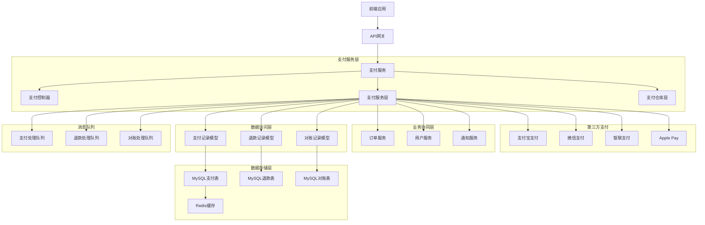

# 06-支付系统集成

## 1. 支付系统概述

### 1.1 功能需求分析

支付系统是电商系统的核心模块之一，主要包含以下功能：

1. **多支付渠道支持**：支付宝、微信支付、银联等主流支付方式
2. **支付流程管理**：支付创建、支付处理、支付回调
3. **支付状态同步**：实时更新订单支付状态
4. **退款处理**：订单退款申请和处理
5. **对账管理**：支付流水对账和异常处理
6. **安全防护**：支付安全、防欺诈、风控管理

### 1.2 技术架构设计



## 2. 支付模型设计

### 2.1 支付记录模型

#### 2.1.1 支付记录模型实现
```javascript
// src/app/models/payment.model.js
const { DataTypes } = require('sequelize');
const BaseModel = require('./base.model');

class Payment extends BaseModel {
  // 获取支付渠道显示名称
  getChannelDisplayName() {
    const channelNames = {
      'alipay': '支付宝',
      'wechat_pay': '微信支付',
      'unionpay': '银联支付',
      'apple_pay': 'Apple Pay',
      'paypal': 'PayPal'
    };
    
    return channelNames[this.channel] || this.channel;
  }

  // 获取支付状态显示名称
  getStatusDisplayName() {
    const statusNames = {
      'pending': '待支付',
      'paid': '已支付',
      'failed': '支付失败',
      'refunded': '已退款',
      'partially_refunded': '部分退款',
      'cancelled': '已取消'
    };
    
    return statusNames[this.status] || this.status;
  }

  // 生成商户订单号
  static generateMerchantOrderNo() {
    const timestamp = Date.now().toString();
    const random = Math.random().toString(36).substr(2, 8).toUpperCase();
    return `PAY${timestamp}${random}`;
  }

  // 验证支付签名
  async verifySignature(data, signature) {
    // 根据不同支付渠道验证签名
    switch (this.channel) {
      case 'alipay':
        return await this.verifyAlipaySignature(data, signature);
      case 'wechat_pay':
        return await this.verifyWechatSignature(data, signature);
      default:
        return false;
    }
  }

  // 验证支付宝签名
  async verifyAlipaySignature(data, signature) {
    // 实现支付宝签名验证逻辑
    // 这里简化处理，实际需要使用支付宝SDK
    return true;
  }

  // 验证微信支付签名
  async verifyWechatSignature(data, signature) {
    // 实现微信支付签名验证逻辑
    // 这里简化处理，实际需要使用微信支付SDK
    return true;
  }
}

Payment.init({
  merchant_order_no: {
    type: DataTypes.STRING(100),
    allowNull: false,
    unique: true,
    comment: '商户订单号'
  },
  order_id: {
    type: DataTypes.BIGINT,
    allowNull: false,
    comment: '订单ID',
    references: {
      model: 'orders',
      key: 'id'
    }
  },
  user_id: {
    type: DataTypes.BIGINT,
    allowNull: false,
    comment: '用户ID',
    references: {
      model: 'users',
      key: 'id'
    }
  },
  channel: {
    type: DataTypes.STRING(50),
    allowNull: false,
    comment: '支付渠道'
  },
  amount: {
    type: DataTypes.DECIMAL(10, 2),
    allowNull: false,
    comment: '支付金额'
  },
  currency: {
    type: DataTypes.STRING(3),
    defaultValue: 'CNY',
    comment: '货币代码'
  },
  status: {
    type: DataTypes.ENUM(
      'pending',           // 待支付
      'paid',              // 已支付
      'failed',            // 支付失败
      'refunded',          // 已退款
      'partially_refunded', // 部分退款
      'cancelled'          // 已取消
    ),
    defaultValue: 'pending',
    comment: '支付状态'
  },
  
  // 第三方支付信息
  transaction_id: {
    type: DataTypes.STRING(100),
    allowNull: true,
    comment: '第三方交易号'
  },
  payment_method: {
    type: DataTypes.STRING(50),
    allowNull: true,
    comment: '支付方式'
  },
  payer_info: {
    type: DataTypes.JSON,
    allowNull: true,
    comment: '支付人信息'
  },
  
  // 时间信息
  paid_at: {
    type: DataTypes.DATE,
    allowNull: true,
    comment: '支付完成时间'
  },
  expired_at: {
    type: DataTypes.DATE,
    allowNull: true,
    comment: '支付过期时间'
  },
  
  // 回调信息
  notify_data: {
    type: DataTypes.JSON,
    allowNull: true,
    comment: '支付回调数据'
  },
  notify_count: {
    type: DataTypes.INTEGER,
    defaultValue: 0,
    comment: '回调次数'
  },
  last_notify_at: {
    type: DataTypes.DATE,
    allowNull: true,
    comment: '最后回调时间'
  },
  
  // 安全信息
  client_ip: {
    type: DataTypes.STRING(45),
    allowNull: true,
    comment: '客户端IP'
  },
  user_agent: {
    type: DataTypes.STRING(500),
    allowNull: true,
    comment: '用户代理'
  }
}, {
  sequelize,
  tableName: 'payments',
  paranoid: true,
  indexes: [
    { fields: ['merchant_order_no'] },
    { fields: ['order_id'] },
    { fields: ['user_id'] },
    { fields: ['channel'] },
    { fields: ['status'] },
    { fields: ['transaction_id'] },
    { fields: ['created_at'] }
  ],
  hooks: {
    beforeCreate: async (payment) => {
      // 自动生成商户订单号
      if (!payment.merchant_order_no) {
        payment.merchant_order_no = Payment.generateMerchantOrderNo();
      }
    }
  }
});

module.exports = Payment;
```

### 2.2 退款记录模型

#### 2.2.1 退款记录模型实现
```javascript
// src/app/models/refund.model.js
const { DataTypes } = require('sequelize');
const BaseModel = require('./base.model');

class Refund extends BaseModel {
  // 获取退款状态显示名称
  getStatusDisplayName() {
    const statusNames = {
      'pending': '待处理',
      'processing': '处理中',
      'success': '退款成功',
      'failed': '退款失败',
      'cancelled': '已取消'
    };
    
    return statusNames[this.status] || this.status;
  }

  // 生成退款单号
  static generateRefundNo() {
    const timestamp = Date.now().toString();
    const random = Math.random().toString(36).substr(2, 8).toUpperCase();
    return `REF${timestamp}${random}`;
  }
}

Refund.init({
  refund_no: {
    type: DataTypes.STRING(100),
    allowNull: false,
    unique: true,
    comment: '退款单号'
  },
  payment_id: {
    type: DataTypes.BIGINT,
    allowNull: false,
    comment: '支付记录ID',
    references: {
      model: 'payments',
      key: 'id'
    }
  },
  order_id: {
    type: DataTypes.BIGINT,
    allowNull: false,
    comment: '订单ID',
    references: {
      model: 'orders',
      key: 'id'
    }
  },
  user_id: {
    type: DataTypes.BIGINT,
    allowNull: false,
    comment: '用户ID',
    references: {
      model: 'users',
      key: 'id'
    }
  },
  amount: {
    type: DataTypes.DECIMAL(10, 2),
    allowNull: false,
    comment: '退款金额'
  },
  currency: {
    type: DataTypes.STRING(3),
    defaultValue: 'CNY',
    comment: '货币代码'
  },
  status: {
    type: DataTypes.ENUM(
      'pending',      // 待处理
      'processing',   // 处理中
      'success',      // 退款成功
      'failed',       // 退款失败
      'cancelled'     // 已取消
    ),
    defaultValue: 'pending',
    comment: '退款状态'
  },
  reason: {
    type: DataTypes.STRING(500),
    allowNull: true,
    comment: '退款原因'
  },
  
  // 第三方退款信息
  refund_id: {
    type: DataTypes.STRING(100),
    allowNull: true,
    comment: '第三方退款单号'
  },
  refund_method: {
    type: DataTypes.STRING(50),
    allowNull: true,
    comment: '退款方式'
  },
  
  // 时间信息
  processed_at: {
    type: DataTypes.DATE,
    allowNull: true,
    comment: '处理完成时间'
  },
  
  // 回调信息
  notify_data: {
    type: DataTypes.JSON,
    allowNull: true,
    comment: '退款回调数据'
  },
  notify_count: {
    type: DataTypes.INTEGER,
    defaultValue: 0,
    comment: '回调次数'
  },
  last_notify_at: {
    type: DataTypes.DATE,
    allowNull: true,
    comment: '最后回调时间'
  }
}, {
  sequelize,
  tableName: 'refunds',
  indexes: [
    { fields: ['refund_no'] },
    { fields: ['payment_id'] },
    { fields: ['order_id'] },
    { fields: ['user_id'] },
    { fields: ['status'] },
    { fields: ['refund_id'] },
    { fields: ['created_at'] }
  ],
  hooks: {
    beforeCreate: async (refund) => {
      // 自动生成退款单号
      if (!refund.refund_no) {
        refund.refund_no = Refund.generateRefundNo();
      }
    }
  }
});

module.exports = Refund;
```

## 3. 支付渠道集成

### 3.1 支付宝集成

#### 3.1.1 支付宝支付服务
```javascript
// src/app/services/payment/alipay.service.js
const AlipaySdk = require('alipay-sdk').default;
const AlipayFormData = require('alipay-sdk/lib/form').default;
const { Payment } = require('../../models');
const config = require('../../../config');

class AlipayService {
  constructor() {
    this.alipay = new AlipaySdk({
      appId: config.alipay.appId,
      privateKey: config.alipay.privateKey,
      alipayPublicKey: config.alipay.alipayPublicKey,
      gateway: config.alipay.gateway
    });
  }

  // 创建支付订单
  async createPayment(order, options = {}) {
    const payment = await Payment.create({
      order_id: order.id,
      user_id: order.user_id,
      channel: 'alipay',
      amount: order.total_amount,
      currency: order.currency,
      client_ip: options.clientIp,
      user_agent: options.userAgent
    });

    // 构造支付表单
    const formData = new AlipayFormData();
    formData.setMethod('get');
    formData.addField('bizContent', {
      outTradeNo: payment.merchant_order_no,
      productCode: 'FAST_INSTANT_TRADE_PAY',
      totalAmount: payment.amount,
      subject: `订单支付 - ${order.order_number}`,
      body: `订单号: ${order.order_number}`,
      timeoutExpress: '30m'
    });
    formData.addField('returnUrl', config.alipay.returnUrl);
    formData.addField('notifyUrl', config.alipay.notifyUrl);

    const result = await this.alipay.exec(
      'alipay.trade.page.pay',
      {},
      { bizContent: formData.getBizContent() }
    );

    return {
      payment,
      redirectUrl: result
    };
  }

  // 处理支付回调
  async handleNotify(notifyData) {
    try {
      // 验证签名
      const isValid = this.alipay.checkNotifySign(notifyData);
      if (!isValid) {
        throw new Error('签名验证失败');
      }

      const {
        out_trade_no,
        trade_no,
        trade_status,
        total_amount
      } = notifyData;

      // 查找支付记录
      const payment = await Payment.findOne({
        where: { merchant_order_no: out_trade_no }
      });

      if (!payment) {
        throw new Error('支付记录不存在');
      }

      // 更新支付状态
      if (trade_status === 'TRADE_SUCCESS') {
        await payment.update({
          status: 'paid',
          transaction_id: trade_no,
          paid_at: new Date(),
          notify_data: notifyData,
          notify_count: payment.notify_count + 1,
          last_notify_at: new Date()
        });

        // 发布支付成功事件
        await this.emitPaymentSuccess(payment);
      } else if (trade_status === 'TRADE_CLOSED') {
        await payment.update({
          status: 'failed',
          notify_data: notifyData,
          notify_count: payment.notify_count + 1,
          last_notify_at: new Date()
        });
      }

      return { success: true };
    } catch (error) {
      console.error('支付宝回调处理失败:', error);
      throw error;
    }
  }

  // 查询支付状态
  async queryPayment(payment) {
    try {
      const result = await this.alipay.exec('alipay.trade.query', {
        bizContent: {
          outTradeNo: payment.merchant_order_no
        }
      });

      const { code, trade_status, trade_no } = result;

      if (code === '10000' && trade_status === 'TRADE_SUCCESS') {
        await payment.update({
          status: 'paid',
          transaction_id: trade_no,
          paid_at: new Date()
        });

        await this.emitPaymentSuccess(payment);
      }

      return result;
    } catch (error) {
      console.error('支付宝支付状态查询失败:', error);
      throw error;
    }
  }

  // 发起退款
  async refund(refundRecord) {
    try {
      const payment = await Payment.findByPk(refundRecord.payment_id);
      if (!payment) {
        throw new Error('支付记录不存在');
      }

      const result = await this.alipay.exec('alipay.trade.refund', {
        bizContent: {
          outTradeNo: payment.merchant_order_no,
          refundAmount: refundRecord.amount,
          refundReason: refundRecord.reason,
          outRequestNo: refundRecord.refund_no
        }
      });

      const { code, msg, trade_no, refund_fee } = result;

      if (code === '10000') {
        await refundRecord.update({
          status: 'success',
          refund_id: trade_no,
          processed_at: new Date()
        });

        // 更新原支付记录状态
        if (parseFloat(refund_fee) === payment.amount) {
          await payment.update({ status: 'refunded' });
        } else {
          await payment.update({ status: 'partially_refunded' });
        }

        await this.emitRefundSuccess(refundRecord);
      } else {
        await refundRecord.update({
          status: 'failed',
          processed_at: new Date()
        });
      }

      return result;
    } catch (error) {
      console.error('支付宝退款失败:', error);
      throw error;
    }
  }

  // 发布支付成功事件
  async emitPaymentSuccess(payment) {
    // await messageQueue.publish('payment.success', {
    //   paymentId: payment.id,
    //   orderId: payment.order_id,
    //   amount: payment.amount,
    //   channel: payment.channel
    // });
  }

  // 发布退款成功事件
  async emitRefundSuccess(refund) {
    // await messageQueue.publish('refund.success', {
    //   refundId: refund.id,
    //   paymentId: refund.payment_id,
    //   amount: refund.amount,
    //   channel: 'alipay'
    // });
  }
}

module.exports = new AlipayService();
```

### 3.2 微信支付集成

#### 3.2.1 微信支付服务
```javascript
// src/app/services/payment/wechat-pay.service.js
const WechatPay = require('wechatpay-node-v3');
const { Payment } = require('../../models');
const config = require('../../../config');

class WechatPayService {
  constructor() {
    this.wechatPay = new WechatPay({
      appid: config.wechatPay.appId,
      mchid: config.wechatPay.mchId,
      publicKey: config.wechatPay.publicKey,
      privateKey: config.wechatPay.privateKey
    });
  }

  // 创建支付订单
  async createPayment(order, options = {}) {
    const payment = await Payment.create({
      order_id: order.id,
      user_id: order.user_id,
      channel: 'wechat_pay',
      amount: order.total_amount,
      currency: order.currency,
      client_ip: options.clientIp,
      user_agent: options.userAgent
    });

    // 构造支付参数
    const params = {
      description: `订单支付 - ${order.order_number}`,
      out_trade_no: payment.merchant_order_no,
      amount: {
        total: Math.round(payment.amount * 100), // 微信支付金额单位为分
        currency: 'CNY'
      },
      scene_info: {
        payer_client_ip: options.clientIp,
        h5_info: {
          type: 'Wap'
        }
      }
    };

    // 如果是JSAPI支付，需要openid
    if (options.openid) {
      params.payer = { openid: options.openid };
    }

    const result = await this.wechatPay.transactions_jsapi(params);

    return {
      payment,
      paymentData: result
    };
  }

  // 处理支付回调
  async handleNotify(notifyData) {
    try {
      const { resource } = notifyData;
      
      // 解密回调数据
      const decryptedData = this.wechatPay.decipher_gcm(
        resource.ciphertext,
        resource.associated_data,
        resource.nonce,
        config.wechatPay.apiV3Key
      );

      const {
        out_trade_no,
        transaction_id,
        trade_state,
        amount
      } = JSON.parse(decryptedData);

      // 查找支付记录
      const payment = await Payment.findOne({
        where: { merchant_order_no: out_trade_no }
      });

      if (!payment) {
        throw new Error('支付记录不存在');
      }

      // 更新支付状态
      if (trade_state === 'SUCCESS') {
        await payment.update({
          status: 'paid',
          transaction_id: transaction_id,
          amount: amount.total / 100, // 转换为元
          paid_at: new Date(),
          notify_data: notifyData,
          notify_count: payment.notify_count + 1,
          last_notify_at: new Date()
        });

        // 发布支付成功事件
        await this.emitPaymentSuccess(payment);
      } else if (trade_state === 'CLOSED') {
        await payment.update({
          status: 'failed',
          notify_data: notifyData,
          notify_count: payment.notify_count + 1,
          last_notify_at: new Date()
        });
      }

      return { success: true };
    } catch (error) {
      console.error('微信支付回调处理失败:', error);
      throw error;
    }
  }

  // 查询支付状态
  async queryPayment(payment) {
    try {
      const result = await this.wechatPay.query({
        out_trade_no: payment.merchant_order_no
      });

      const { trade_state, transaction_id } = result;

      if (trade_state === 'SUCCESS') {
        await payment.update({
          status: 'paid',
          transaction_id: transaction_id,
          paid_at: new Date()
        });

        await this.emitPaymentSuccess(payment);
      }

      return result;
    } catch (error) {
      console.error('微信支付状态查询失败:', error);
      throw error;
    }
  }

  // 发起退款
  async refund(refundRecord) {
    try {
      const payment = await Payment.findByPk(refundRecord.payment_id);
      if (!payment) {
        throw new Error('支付记录不存在');
      }

      const result = await this.wechatPay.refunds({
        out_trade_no: payment.merchant_order_no,
        out_refund_no: refundRecord.refund_no,
        amount: {
          refund: Math.round(refundRecord.amount * 100),
          total: Math.round(payment.amount * 100),
          currency: 'CNY'
        },
        reason: refundRecord.reason
      });

      const { status, refund_id } = result;

      if (status === 'SUCCESS') {
        await refundRecord.update({
          status: 'success',
          refund_id: refund_id,
          processed_at: new Date()
        });

        // 更新原支付记录状态
        await payment.update({ status: 'refunded' });

        await this.emitRefundSuccess(refundRecord);
      } else if (status === 'PROCESSING') {
        await refundRecord.update({
          status: 'processing'
        });
      } else {
        await refundRecord.update({
          status: 'failed',
          processed_at: new Date()
        });
      }

      return result;
    } catch (error) {
      console.error('微信退款失败:', error);
      throw error;
    }
  }

  // 发布支付成功事件
  async emitPaymentSuccess(payment) {
    // await messageQueue.publish('payment.success', {
    //   paymentId: payment.id,
    //   orderId: payment.order_id,
    //   amount: payment.amount,
    //   channel: payment.channel
    // });
  }

  // 发布退款成功事件
  async emitRefundSuccess(refund) {
    // await messageQueue.publish('refund.success', {
    //   refundId: refund.id,
    //   paymentId: refund.payment_id,
    //   amount: refund.amount,
    //   channel: 'wechat_pay'
    // });
  }
}

module.exports = new WechatPayService();
```

## 4. 支付服务层实现

### 4.1 统一支付服务

```javascript
// src/app/services/payment.service.js
const { Payment, Refund } = require('../models');
const alipayService = require('./payment/alipay.service');
const wechatPayService = require('./payment/wechat-pay.service');
const orderService = require('./order.service');
const redis = require('../../utils/redis.client');

class PaymentService {
  // 创建支付
  async createPayment(orderId, channel, options = {}) {
    // 获取订单信息
    const order = await orderService.getOrderById(orderId);
    if (!order) {
      throw new Error('订单不存在');
    }

    // 检查订单状态
    if (order.payment_status !== 'pending') {
      throw new Error('订单已支付或已取消');
    }

    // 根据支付渠道创建支付
    let paymentResult;
    switch (channel) {
      case 'alipay':
        paymentResult = await alipayService.createPayment(order, options);
        break;
      case 'wechat_pay':
        paymentResult = await wechatPayService.createPayment(order, options);
        break;
      default:
        throw new Error(`不支持的支付渠道: ${channel}`);
    }

    return paymentResult;
  }

  // 处理支付回调
  async handlePaymentNotify(channel, notifyData) {
    switch (channel) {
      case 'alipay':
        return await alipayService.handleNotify(notifyData);
      case 'wechat_pay':
        return await wechatPayService.handleNotify(notifyData);
      default:
        throw new Error(`不支持的支付渠道: ${channel}`);
    }
  }

  // 查询支付状态
  async queryPayment(paymentId) {
    const payment = await Payment.findByPk(paymentId);
    if (!payment) {
      throw new Error('支付记录不存在');
    }

    // 根据支付渠道查询状态
    switch (payment.channel) {
      case 'alipay':
        return await alipayService.queryPayment(payment);
      case 'wechat_pay':
        return await wechatPayService.queryPayment(payment);
      default:
        throw new Error(`不支持的支付渠道: ${payment.channel}`);
    }
  }

  // 发起退款
  async createRefund(paymentId, amount, reason, options = {}) {
    const payment = await Payment.findByPk(paymentId);
    if (!payment) {
      throw new Error('支付记录不存在');
    }

    // 检查支付状态
    if (payment.status !== 'paid') {
      throw new Error('只有已支付的订单才能退款');
    }

    // 检查退款金额
    if (amount > payment.amount) {
      throw new Error('退款金额不能超过支付金额');
    }

    // 创建退款记录
    const refund = await Refund.create({
      payment_id: payment.id,
      order_id: payment.order_id,
      user_id: payment.user_id,
      amount,
      currency: payment.currency,
      reason
    });

    // 根据支付渠道发起退款
    let refundResult;
    switch (payment.channel) {
      case 'alipay':
        refundResult = await alipayService.refund(refund);
        break;
      case 'wechat_pay':
        refundResult = await wechatPayService.refund(refund);
        break;
      default:
        throw new Error(`不支持的支付渠道: ${payment.channel}`);
    }

    return {
      refund,
      result: refundResult
    };
  }

  // 处理退款回调
  async handleRefundNotify(channel, notifyData) {
    // 实现退款回调处理逻辑
    // 这里简化处理，实际需要根据具体支付渠道实现
    console.log(`收到${channel}退款回调:`, notifyData);
    return { success: true };
  }

  // 获取用户支付记录
  async getUserPayments(userId, options = {}) {
    const {
      page = 1,
      limit = 10,
      status,
      start_date,
      end_date
    } = options;

    const offset = (page - 1) * limit;

    // 构建查询条件
    const where = { user_id: userId };

    if (status) {
      where.status = status;
    }

    if (start_date || end_date) {
      where.created_at = {};
      if (start_date) where.created_at[Op.gte] = new Date(start_date);
      if (end_date) where.created_at[Op.lte] = new Date(end_date);
    }

    const result = await Payment.findAndCountAll({
      where,
      order: [['created_at', 'DESC']],
      limit: parseInt(limit),
      offset: parseInt(offset)
    });

    return {
      data: result.rows,
      pagination: {
        total: result.count,
        page: parseInt(page),
        limit: parseInt(limit),
        pages: Math.ceil(result.count / limit)
      }
    };
  }

  // 获取支付详情
  async getPaymentById(paymentId, userId = null) {
    const cacheKey = `payment:${paymentId}`;

    // 尝试从缓存获取
    const cached = await redis.get(cacheKey);
    if (cached) {
      const payment = JSON.parse(cached);
      if (userId && payment.user_id !== userId) {
        throw new Error('无权查看此支付记录');
      }
      return payment;
    }

    // 从数据库获取
    const payment = await Payment.findByPk(paymentId);
    if (!payment) {
      throw new Error('支付记录不存在');
    }

    // 权限检查
    if (userId && payment.user_id !== userId) {
      throw new Error('无权查看此支付记录');
    }

    // 缓存1小时
    await redis.setex(cacheKey, 3600, JSON.stringify(payment));

    return payment;
  }

  // 获取退款记录
  async getRefundById(refundId, userId = null) {
    const refund = await Refund.findByPk(refundId);
    if (!refund) {
      throw new Error('退款记录不存在');
    }

    // 权限检查
    if (userId && refund.user_id !== userId) {
      throw new Error('无权查看此退款记录');
    }

    return refund;
  }
}

module.exports = new PaymentService();
```

## 5. 支付控制器实现

### 5.1 支付控制器类

```javascript
// src/app/controllers/payment.controller.js
const paymentService = require('../services/payment.service');
const orderService = require('../services/order.service');
const { paymentValidator } = require('../validators/payment.validator');

class PaymentController {
  // 创建支付
  async create(ctx) {
    try {
      const { order_id, channel } = ctx.request.body;
      const userId = ctx.user.userId;

      // 验证订单所有权
      const order = await orderService.getOrderById(order_id, userId);
      if (!order) {
        ctx.status = 404;
        ctx.body = {
          success: false,
          message: '订单不存在'
        };
        return;
      }

      // 创建支付
      const paymentResult = await paymentService.createPayment(
        order_id,
        channel,
        {
          clientIp: ctx.ip,
          userAgent: ctx.headers['user-agent']
        }
      );

      ctx.status = 201;
      ctx.body = {
        success: true,
        message: '支付创建成功',
        data: paymentResult
      };

    } catch (error) {
      console.error('创建支付失败:', error);
      ctx.status = 500;
      ctx.body = {
        success: false,
        message: error.message || '支付创建失败'
      };
    }
  }

  // 支付宝回调
  async alipayNotify(ctx) {
    try {
      const notifyData = ctx.request.body;
      
      await paymentService.handlePaymentNotify('alipay', notifyData);
      
      // 支付宝要求返回 success
      ctx.body = 'success';
      
    } catch (error) {
      console.error('支付宝回调处理失败:', error);
      ctx.status = 500;
      ctx.body = 'fail';
    }
  }

  // 微信支付回调
  async wechatPayNotify(ctx) {
    try {
      const notifyData = ctx.request.body;
      
      await paymentService.handlePaymentNotify('wechat_pay', notifyData);
      
      // 微信支付要求返回 XML 格式
      ctx.type = 'application/xml';
      ctx.body = '<xml><return_code><![CDATA[SUCCESS]]></return_code><return_msg><![CDATA[OK]]></return_msg></xml>';
      
    } catch (error) {
      console.error('微信支付回调处理失败:', error);
      ctx.status = 500;
      ctx.type = 'application/xml';
      ctx.body = '<xml><return_code><![CDATA[FAIL]]></return_code><return_msg><![CDATA[处理失败]]></return_msg></xml>';
    }
  }

  // 查询支付状态
  async query(ctx) {
    try {
      const { id } = ctx.params;
      
      const result = await paymentService.queryPayment(id);
      
      ctx.status = 200;
      ctx.body = {
        success: true,
        data: result
      };
      
    } catch (error) {
      console.error('查询支付状态失败:', error);
      ctx.status = 500;
      ctx.body = {
        success: false,
        message: error.message || '查询支付状态失败'
      };
    }
  }

  // 发起退款
  async refund(ctx) {
    try {
      const { payment_id, amount, reason } = ctx.request.body;
      const userId = ctx.user.userId;

      const refundResult = await paymentService.createRefund(
        payment_id,
        amount,
        reason,
        { userId }
      );

      ctx.status = 201;
      ctx.body = {
        success: true,
        message: '退款申请已提交',
        data: refundResult
      };

    } catch (error) {
      console.error('发起退款失败:', error);
      ctx.status = 500;
      ctx.body = {
        success: false,
        message: error.message || '退款申请失败'
      };
    }
  }

  // 获取用户支付记录
  async list(ctx) {
    try {
      const {
        page,
        limit,
        status,
        start_date,
        end_date
      } = ctx.query;

      const options = {
        page: page ? parseInt(page) : 1,
        limit: limit ? parseInt(limit) : 10,
        status,
        start_date,
        end_date
      };

      const result = await paymentService.getUserPayments(ctx.user.userId, options);

      ctx.status = 200;
      ctx.body = {
        success: true,
        data: result.data,
        pagination: result.pagination
      };

    } catch (error) {
      console.error('获取支付记录失败:', error);
      ctx.status = 500;
      ctx.body = {
        success: false,
        message: '获取支付记录失败'
      };
    }
  }

  // 获取支付详情
  async show(ctx) {
    try {
      const { id } = ctx.params;

      const payment = await paymentService.getPaymentById(id, ctx.user.userId);

      ctx.status = 200;
      ctx.body = {
        success: true,
        data: payment
      };

    } catch (error) {
      console.error('获取支付详情失败:', error);

      if (error.message === '支付记录不存在') {
        ctx.status = 404;
        ctx.body = {
          success: false,
          message: '支付记录不存在'
        };
      } else if (error.message === '无权查看此支付记录') {
        ctx.status = 403;
        ctx.body = {
          success: false,
          message: '无权查看此支付记录'
        };
      } else {
        ctx.status = 500;
        ctx.body = {
          success: false,
          message: '获取支付详情失败'
        };
      }
    }
  }
}

module.exports = new PaymentController();
```

## 6. 支付验证器

### 6.1 支付数据验证

```javascript
// src/app/validators/payment.validator.js
const Joi = require('joi');

const paymentValidator = {
  // 创建支付验证
  create: Joi.object({
    order_id: Joi.number().integer().positive().required().messages({
      'number.base': '订单ID必须是数字',
      'number.integer': '订单ID必须是整数',
      'number.positive': '订单ID必须是正数',
      'any.required': '订单ID是必填项'
    }),
    
    channel: Joi.string().valid('alipay', 'wechat_pay', 'unionpay').required().messages({
      'any.only': '支付渠道必须是 alipay, wechat_pay, unionpay 之一',
      'any.required': '支付渠道是必填项'
    })
  }),
  
  // 发起退款验证
  refund: Joi.object({
    payment_id: Joi.number().integer().positive().required().messages({
      'number.base': '支付ID必须是数字',
      'number.integer': '支付ID必须是整数',
      'number.positive': '支付ID必须是正数',
      'any.required': '支付ID是必填项'
    }),
    
    amount: Joi.number().min(0.01).precision(2).required().messages({
      'number.base': '退款金额必须是数字',
      'number.min': '退款金额至少为0.01',
      'number.precision': '退款金额最多保留2位小数',
      'any.required': '退款金额是必填项'
    }),
    
    reason: Joi.string().max(500).required().messages({
      'string.max': '退款原因最多500个字符',
      'any.required': '退款原因是必填项'
    })
  })
};

module.exports = { paymentValidator };
```

## 7. 支付路由配置

### 7.1 支付路由定义

```javascript
// src/routes/payment.routes.js
const Router = require('koa-router');
const paymentController = require('../app/controllers/payment.controller');
const AuthMiddleware = require('../middleware/auth.middleware');

const router = new Router({ prefix: '/api/payments' });

// 公开路由（支付回调）
router.post('/alipay/notify', paymentController.alipayNotify);
router.post('/wechat/notify', paymentController.wechatPayNotify);

// 需要认证的路由
router.use(AuthMiddleware.authenticate);

router.post('/', paymentController.create); // 创建支付
router.get('/', paymentController.list); // 支付记录列表
router.get('/:id', paymentController.show); // 支付详情
router.post('/query/:id', paymentController.query); // 查询支付状态
router.post('/refund', paymentController.refund); // 发起退款

module.exports = router;
```

## 8. 支付安全与风控

### 8.1 支付安全服务

```javascript
// src/app/services/payment-security.service.js
const crypto = require('crypto');
const redis = require('../../utils/redis.client');

class PaymentSecurityService {
  // 生成支付签名
  generateSignature(params, secretKey) {
    const sortedParams = Object.keys(params)
      .filter(key => key !== 'sign' && params[key] !== undefined && params[key] !== '')
      .sort()
      .map(key => `${key}=${params[key]}`)
      .join('&');
    
    const stringToSign = `${sortedParams}&key=${secretKey}`;
    return crypto.createHash('md5').update(stringToSign).digest('hex').toUpperCase();
  }

  // 验证支付签名
  verifySignature(params, signature, secretKey) {
    const expectedSignature = this.generateSignature(params, secretKey);
    return signature === expectedSignature;
  }

  // 防重复支付检查
  async checkDuplicatePayment(merchantOrderNo) {
    const key = `payment_duplicate:${merchantOrderNo}`;
    const exists = await redis.exists(key);
    
    if (exists) {
      return true; // 存在重复支付
    }
    
    // 设置10分钟过期时间
    await redis.setex(key, 600, '1');
    return false;
  }

  // 支付频率限制
  async checkPaymentRateLimit(userId, timeWindow = 300, maxAttempts = 5) {
    const key = `payment_rate_limit:${userId}`;
    const current = await redis.incr(key);
    
    if (current === 1) {
      await redis.expire(key, timeWindow);
    }
    
    return current <= maxAttempts;
  }

  // IP地址风险检查
  async checkIpRisk(ipAddress) {
    // 检查IP是否在黑名单中
    const blacklistKey = `payment_ip_blacklist:${ipAddress}`;
    const isBlacklisted = await redis.exists(blacklistKey);
    
    if (isBlacklisted) {
      return { risk: true, reason: 'IP地址在黑名单中' };
    }
    
    // 检查IP支付频率
    const rateKey = `payment_ip_rate:${ipAddress}`;
    const rate = await redis.incr(rateKey);
    
    if (rate === 1) {
      await redis.expire(rateKey, 3600); // 1小时窗口
    }
    
    if (rate > 100) { // 每小时超过100次支付尝试
      return { risk: true, reason: 'IP支付频率过高' };
    }
    
    return { risk: false };
  }

  // 用户行为分析
  async analyzeUserBehavior(userId, paymentData) {
    // 获取用户历史支付数据
    const historyKey = `payment_history:${userId}`;
    const history = await redis.lrange(historyKey, 0, 9); // 最近10次支付
    
    const analysis = {
      risk: false,
      score: 0,
      warnings: []
    };
    
    // 检查支付金额异常
    if (history.length > 0) {
      const amounts = history.map(record => JSON.parse(record).amount);
      const avgAmount = amounts.reduce((sum, amount) => sum + amount, 0) / amounts.length;
      const currentAmount = paymentData.amount;
      
      // 如果当前金额超过平均金额的5倍，标记为风险
      if (currentAmount > avgAmount * 5) {
        analysis.risk = true;
        analysis.score += 30;
        analysis.warnings.push('支付金额异常');
      }
    }
    
    // 检查支付时间异常（深夜或凌晨）
    const currentHour = new Date().getHours();
    if (currentHour >= 2 && currentHour <= 5) {
      analysis.risk = true;
      analysis.score += 20;
      analysis.warnings.push('支付时间异常');
    }
    
    // 记录当前支付到历史
    await redis.lpush(historyKey, JSON.stringify({
      amount: paymentData.amount,
      channel: paymentData.channel,
      timestamp: Date.now()
    }));
    await redis.ltrim(historyKey, 0, 9); // 保持最多10条记录
    await redis.expire(historyKey, 86400 * 30); // 保存30天
    
    return analysis;
  }

  // 添加IP到黑名单
  async addToBlacklist(ipAddress, reason, duration = 86400) {
    const key = `payment_ip_blacklist:${ipAddress}`;
    await redis.setex(key, duration, reason);
  }

  // 记录支付日志
  async logPayment(paymentData, result) {
    const logData = {
      ...paymentData,
      result,
      timestamp: new Date().toISOString(),
      userAgent: paymentData.userAgent || '',
      clientIp: paymentData.clientIp || ''
    };
    
    // 发送到日志系统
    console.log('Payment Log:', JSON.stringify(logData));
    
    // 存储到Redis用于实时监控
    const logKey = `payment_logs:${new Date().toISOString().slice(0, 10)}`;
    await redis.lpush(logKey, JSON.stringify(logData));
    await redis.ltrim(logKey, 0, 999); // 保持最多1000条记录
    await redis.expire(logKey, 86400); // 保存24小时
  }
}

module.exports = new PaymentSecurityService();
```

## 9. 支付对账系统

### 9.1 对账服务实现

```javascript
// src/app/services/payment-reconciliation.service.js
const { Op } = require('sequelize');
const { Payment } = require('../models');
const alipayService = require('./payment/alipay.service');
const wechatPayService = require('./payment/wechat-pay.service');

class PaymentReconciliationService {
  // 支付宝对账
  async reconcileAlipay(startDate, endDate) {
    try {
      // 获取支付宝交易流水
      const tradeRecords = await alipayService.queryBill({
        bill_date: startDate,
        bill_type: 'trade'
      });

      // 获取系统支付记录
      const systemPayments = await Payment.findAll({
        where: {
          channel: 'alipay',
          created_at: {
            [Op.between]: [new Date(startDate), new Date(endDate)]
          }
        }
      });

      // 对账处理
      const reconciliationResult = this.compareRecords(
        tradeRecords,
        systemPayments,
        'alipay'
      );

      return reconciliationResult;
    } catch (error) {
      console.error('支付宝对账失败:', error);
      throw error;
    }
  }

  // 微信支付对账
  async reconcileWechatPay(startDate, endDate) {
    try {
      // 获取微信支付交易流水
      const tradeRecords = await wechatPayService.queryBill({
        bill_date: startDate
      });

      // 获取系统支付记录
      const systemPayments = await Payment.findAll({
        where: {
          channel: 'wechat_pay',
          created_at: {
            [Op.between]: [new Date(startDate), new Date(endDate)]
          }
        }
      });

      // 对账处理
      const reconciliationResult = this.compareRecords(
        tradeRecords,
        systemPayments,
        'wechat_pay'
      );

      return reconciliationResult;
    } catch (error) {
      console.error('微信支付对账失败:', error);
      throw error;
    }
  }

  // 比较交易记录
  compareRecords(tradeRecords, systemPayments, channel) {
    const result = {
      totalRecords: tradeRecords.length,
      matchedRecords: 0,
      mismatchedRecords: [],
      missingRecords: [],
      extraRecords: []
    };

    // 创建映射表
    const systemPaymentMap = new Map();
    systemPayments.forEach(payment => {
      systemPaymentMap.set(payment.merchant_order_no, payment);
    });

    const tradeRecordMap = new Map();
    tradeRecords.forEach(record => {
      tradeRecordMap.set(record.out_trade_no, record);
    });

    // 匹配记录
    tradeRecords.forEach(record => {
      const systemPayment = systemPaymentMap.get(record.out_trade_no);
      
      if (systemPayment) {
        // 检查金额和状态是否一致
        const amountMatch = Math.abs(record.total_amount - systemPayment.amount) < 0.01;
        const statusMatch = this.mapTradeStatus(record.trade_status) === systemPayment.status;
        
        if (amountMatch && statusMatch) {
          result.matchedRecords++;
        } else {
          result.mismatchedRecords.push({
            tradeRecord: record,
            systemPayment,
            mismatches: {
              amount: !amountMatch,
              status: !statusMatch
            }
          });
        }
      } else {
        // 系统中缺少的记录
        result.missingRecords.push(record);
      }
    });

    // 系统中多余的记录
    systemPayments.forEach(payment => {
      if (!tradeRecordMap.has(payment.merchant_order_no)) {
        result.extraRecords.push(payment);
      }
    });

    return result;
  }

  // 映射第三方支付状态到系统状态
  mapTradeStatus(thirdPartyStatus) {
    const statusMap = {
      // 支付宝状态映射
      'TRADE_SUCCESS': 'paid',
      'TRADE_CLOSED': 'failed',
      'WAIT_BUYER_PAY': 'pending',
      
      // 微信支付状态映射
      'SUCCESS': 'paid',
      'CLOSED': 'failed',
      'NOTPAY': 'pending'
    };

    return statusMap[thirdPartyStatus] || 'pending';
  }

  // 处理对账差异
  async handleReconciliationDiscrepancies(discrepancies, channel) {
    const handled = [];
    
    for (const discrepancy of discrepancies) {
      try {
        // 根据差异类型处理
        if (discrepancy.type === 'missing') {
          // 系统缺少记录，需要补录
          await this.createMissingPayment(discrepancy.record, channel);
          handled.push({ ...discrepancy, action: 'created' });
        } else if (discrepancy.type === 'mismatch') {
          // 状态或金额不匹配，需要更新
          await this.updatePaymentStatus(discrepancy.systemPayment, discrepancy.record);
          handled.push({ ...discrepancy, action: 'updated' });
        }
      } catch (error) {
        console.error('处理对账差异失败:', error);
        handled.push({ ...discrepancy, action: 'failed', error: error.message });
      }
    }
    
    return handled;
  }

  // 创建缺失的支付记录
  async createMissingPayment(record, channel) {
    // 实现创建缺失支付记录的逻辑
    console.log(`创建缺失的${channel}支付记录:`, record);
  }

  // 更新支付状态
  async updatePaymentStatus(payment, record) {
    // 实现更新支付状态的逻辑
    console.log('更新支付状态:', payment.merchant_order_no, record);
  }

  // 生成对账报告
  generateReconciliationReport(reconciliationResult, channel, date) {
    const report = {
      channel,
      date,
      summary: {
        totalRecords: reconciliationResult.totalRecords,
        matchedRecords: reconciliationResult.matchedRecords,
        mismatchRate: (reconciliationResult.mismatchedRecords.length / reconciliationResult.totalRecords * 100).toFixed(2) + '%'
      },
      details: {
        mismatched: reconciliationResult.mismatchedRecords.length,
        missing: reconciliationResult.missingRecords.length,
        extra: reconciliationResult.extraRecords.length
      }
    };

    return report;
  }
}

module.exports = new PaymentReconciliationService();
```

## 10. 支付统计分析

### 10.1 支付统计服务

```javascript
// src/app/services/payment-statistics.service.js
const { Op, fn, col } = require('sequelize');
const { Payment, Refund } = require('../models');

class PaymentStatisticsService {
  // 获取支付统计概览
  async getPaymentOverview(options = {}) {
    const { start_date, end_date, channel } = options;

    // 构建查询条件
    const where = {};
    
    if (channel) {
      where.channel = channel;
    }
    
    if (start_date || end_date) {
      where.created_at = {};
      if (start_date) where.created_at[Op.gte] = new Date(start_date);
      if (end_date) where.created_at[Op.lte] = new Date(end_date);
    }

    // 统计各类支付状态数量
    const statusCounts = await Payment.findAll({
      where,
      attributes: [
        'status',
        [fn('COUNT', col('id')), 'count'],
        [fn('SUM', col('amount')), 'total_amount']
      ],
      group: ['status']
    });

    // 统计各渠道支付情况
    const channelStats = await Payment.findAll({
      where,
      attributes: [
        'channel',
        [fn('COUNT', col('id')), 'count'],
        [fn('SUM', col('amount')), 'total_amount']
      ],
      group: ['channel']
    });

    // 统计退款情况
    const refundWhere = { ...where };
    if (refundWhere.created_at) {
      delete refundWhere.created_at;
      refundWhere.processed_at = where.created_at;
    }

    const refundStats = await Refund.findAll({
      where: refundWhere,
      attributes: [
        'status',
        [fn('COUNT', col('id')), 'count'],
        [fn('SUM', col('amount')), 'total_amount']
      ],
      group: ['status']
    });

    return {
      status_counts: statusCounts.reduce((acc, item) => {
        acc[item.status] = {
          count: parseInt(item.get('count')),
          total_amount: parseFloat(item.get('total_amount')) || 0
        };
        return acc;
      }, {}),
      
      channel_stats: channelStats.reduce((acc, item) => {
        acc[item.channel] = {
          count: parseInt(item.get('count')),
          total_amount: parseFloat(item.get('total_amount')) || 0
        };
        return acc;
      }, {}),
      
      refund_stats: refundStats.reduce((acc, item) => {
        acc[item.status] = {
          count: parseInt(item.get('count')),
          total_amount: parseFloat(item.get('total_amount')) || 0
        };
        return acc;
      }, {})
    };
  }

  // 获取支付趋势
  async getPaymentTrend(options = {}) {
    const {
      period = 'day', // day, week, month
      start_date,
      end_date,
      channel
    } = options;

    // 确定时间分组格式
    let dateFormat;
    switch (period) {
      case 'day':
        dateFormat = '%Y-%m-%d';
        break;
      case 'week':
        dateFormat = '%Y-%u';
        break;
      case 'month':
        dateFormat = '%Y-%m';
        break;
      default:
        dateFormat = '%Y-%m-%d';
    }

    // 构建查询条件
    const where = {
      status: 'paid'
    };

    if (channel) {
      where.channel = channel;
    }

    if (start_date || end_date) {
      where.created_at = {};
      if (start_date) where.created_at[Op.gte] = new Date(start_date);
      if (end_date) where.created_at[Op.lte] = new Date(end_date);
    }

    const trend = await Payment.findAll({
      where,
      attributes: [
        [fn('DATE_FORMAT', col('created_at'), dateFormat), 'period'],
        [fn('COUNT', col('id')), 'payment_count'],
        [fn('SUM', col('amount')), 'total_amount']
      ],
      group: [fn('DATE_FORMAT', col('created_at'), dateFormat)],
      order: [[fn('DATE_FORMAT', col('created_at'), dateFormat), 'ASC']]
    });

    return trend.map(item => ({
      period: item.get('period'),
      payment_count: parseInt(item.get('payment_count')),
      total_amount: parseFloat(item.get('total_amount'))
    }));
  }

  // 获取渠道对比
  async getChannelComparison(options = {}) {
    const { start_date, end_date } = options;

    const where = {
      status: 'paid'
    };

    if (start_date || end_date) {
      where.created_at = {};
      if (start_date) where.created_at[Op.gte] = new Date(start_date);
      if (end_date) where.created_at[Op.lte] = new Date(end_date);
    }

    const comparison = await Payment.findAll({
      where,
      attributes: [
        'channel',
        [fn('COUNT', col('id')), 'payment_count'],
        [fn('SUM', col('amount')), 'total_amount'],
        [fn('AVG', col('amount')), 'avg_amount']
      ],
      group: ['channel']
    });

    return comparison.map(item => ({
      channel: item.channel,
      payment_count: parseInt(item.get('payment_count')),
      total_amount: parseFloat(item.get('total_amount')),
      avg_amount: parseFloat(item.get('avg_amount'))
    }));
  }

  // 获取退款分析
  async getRefundAnalysis(options = {}) {
    const { start_date, end_date, channel } = options;

    const where = {
      status: 'success'
    };

    if (channel) {
      where['$payment.channel$'] = channel;
    }

    if (start_date || end_date) {
      where.processed_at = {};
      if (start_date) where.processed_at[Op.gte] = new Date(start_date);
      if (end_date) where.processed_at[Op.lte] = new Date(end_date);
    }

    const analysis = await Refund.findAll({
      where,
      attributes: [
        [fn('COUNT', col('id')), 'refund_count'],
        [fn('SUM', col('amount')), 'total_amount'],
        [fn('AVG', col('amount')), 'avg_amount']
      ],
      include: [
        {
          model: Payment,
          as: 'payment',
          attributes: []
        }
      ]
    });

    if (analysis.length > 0) {
      const item = analysis[0];
      return {
        refund_count: parseInt(item.get('refund_count')),
        total_amount: parseFloat(item.get('total_amount')),
        avg_amount: parseFloat(item.get('avg_amount'))
      };
    }

    return {
      refund_count: 0,
      total_amount: 0,
      avg_amount: 0
    };
  }
}

module.exports = new PaymentStatisticsService();
```

## 11. 总结

本文档详细介绍了企业级电商系统的支付系统集成实现。通过完整的支付模型设计、多渠道支付集成、安全风控机制和统计分析功能，构建了一个功能完善、安全可靠的支付系统。

### 11.1 关键要点

1. **多支付渠道支持**：完整集成支付宝、微信支付等主流支付方式
2. **支付流程管理**：从支付创建、状态更新到退款处理的完整流程
3. **安全防护机制**：签名验证、防重复支付、风控检查等安全措施
4. **对账系统**：自动对账和差异处理机制
5. **统计分析功能**：支付统计、趋势分析、渠道对比等
6. **异常处理**：完善的错误处理和日志记录机制

### 11.2 下一步学习

- 实现API设计与文档生成
- 开发中间件与插件系统
- 构建缓存与性能优化方案
- 实现消息队列与异步处理

继续阅读后续文档，深入学习电商系统的其他核心功能模块！