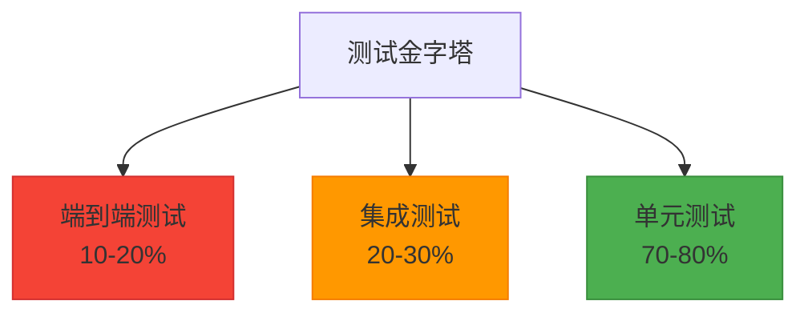

# 11-测试策略与实践

## 1. 测试策略概述

### 1.1 测试的重要性

在企业级应用开发中，测试是确保软件质量、降低维护成本和提高开发效率的关键环节。完善的测试策略能够：

1. **保证代码质量**：及早发现和修复缺陷
2. **提高开发效率**：减少调试时间，快速验证功能
3. **降低维护成本**：减少回归错误，提高代码可维护性
4. **增强团队信心**：为重构和功能扩展提供安全保障

### 1.2 测试金字塔

测试金字塔是指导测试策略设计的重要模型，它将测试分为三个层次：



#### 1.2.1 单元测试（Unit Testing）

单元测试是测试策略的基础，针对最小可测试单元（通常是函数或方法）进行验证：

```javascript
// 示例：用户服务的单元测试
describe('UserService', () => {
  describe('createUser', () => {
    it('should create a new user with valid data', async () => {
      // 测试逻辑
    });
    
    it('should throw error for invalid email', async () => {
      // 测试逻辑
    });
  });
});
```

#### 1.2.2 集成测试（Integration Testing）

集成测试验证不同模块之间的交互是否正常工作：

```javascript
// 示例：用户注册流程的集成测试
describe('User Registration Integration', () => {
  it('should register user and send welcome email', async () => {
    // 测试用户注册和邮件发送的完整流程
  });
});
```

#### 1.2.3 端到端测试（End-to-End Testing）

端到端测试模拟真实用户场景，验证整个系统是否按预期工作：

```javascript
// 示例：用户登录流程的E2E测试
describe('User Login E2E', () => {
  it('should allow user to login and access dashboard', async () => {
    // 测试完整的用户登录和访问流程
  });
});
```

## 2. 测试环境搭建

### 2.1 测试框架配置

#### 2.1.1 Jest配置

```javascript
// jest.config.js
module.exports = {
  // 测试环境
  testEnvironment: 'node',
  
  // 测试文件匹配模式
  testMatch: [
    '**/tests/**/*.test.js',
    '**/?(*.)+(spec|test).js'
  ],
  
  // 忽略的文件
  testPathIgnorePatterns: [
    '/node_modules/',
    '/dist/'
  ],
  
  // 模块文件扩展名
  moduleFileExtensions: [
    'js',
    'json',
    'node'
  ],
  
  // 收集覆盖率的文件
  collectCoverageFrom: [
    'src/**/*.js',
    '!src/**/*.test.js',
    '!src/config/**',
    '!src/migrations/**',
    '!src/seeders/**'
  ],
  
  // 覆盖率目录
  coverageDirectory: 'coverage',
  
  // 覆盖率提供者
  coverageProvider: 'v8',
  
  // 覆盖率阈值
  coverageThreshold: {
    global: {
      branches: 80,
      functions: 80,
      lines: 80,
      statements: 80
    }
  },
  
  // 设置文件
  setupFilesAfterEnv: [
    '<rootDir>/tests/setup.js'
  ],
  
  // 模拟模块
  moduleNameMapper: {
    '^@/(.*)$': '<rootDir>/src/$1'
  },
  
  // 测试超时
  testTimeout: 30000
};
```

#### 2.1.2 测试环境变量

```javascript
// tests/setup.js
// 测试环境设置
process.env.NODE_ENV = 'test';
process.env.DB_NAME = 'ecommerce_test';
process.env.REDIS_DB = '1';

// 全局测试设置
beforeAll(async () => {
  // 初始化测试数据库
  await require('../src/database/test-setup').setup();
});

afterAll(async () => {
  // 清理测试数据库
  await require('../src/database/test-setup').teardown();
});

// 全局测试钩子
beforeEach(async () => {
  // 每个测试前的清理工作
  await require('../src/database/test-setup').reset();
});

afterEach(async () => {
  // 每个测试后的清理工作
  // 清理模拟
  jest.clearAllMocks();
});
```

### 2.2 测试数据库配置

#### 2.2.1 测试数据库设置

```javascript
// src/database/test-setup.js
const { sequelize } = require('./index');
const { User, Product, Order } = require('../app/models');

class TestDatabaseSetup {
  // 初始化测试数据库
  async setup() {
    try {
      // 同步所有模型
      await sequelize.sync({ force: true });
      console.log('Test database synchronized');
    } catch (error) {
      console.error('Failed to setup test database:', error);
      throw error;
    }
  }
  
  // 清理测试数据库
  async teardown() {
    try {
      // 关闭数据库连接
      await sequelize.close();
      console.log('Test database connection closed');
    } catch (error) {
      console.error('Failed to teardown test database:', error);
    }
  }
  
  // 重置测试数据
  async reset() {
    try {
      // 清空所有表数据
      await User.destroy({ where: {}, truncate: true, cascade: true });
      await Product.destroy({ where: {}, truncate: true, cascade: true });
      await Order.destroy({ where: {}, truncate: true, cascade: true });
      
      console.log('Test data reset');
    } catch (error) {
      console.error('Failed to reset test data:', error);
    }
  }
  
  // 插入测试数据
  async seedTestData() {
    try {
      // 创建测试用户
      const testUser = await User.create({
        name: 'Test User',
        email: 'test@example.com',
        password: 'hashed_password'
      });
      
      // 创建测试商品
      const testProduct = await Product.create({
        name: 'Test Product',
        price: 99.99,
        description: 'Test product description',
        category_id: 1
      });
      
      console.log('Test data seeded');
      return { testUser, testProduct };
    } catch (error) {
      console.error('Failed to seed test data:', error);
      throw error;
    }
  }
}

module.exports = new TestDatabaseSetup();
```

#### 2.2.2 数据库工厂模式

```javascript
// tests/factories/user.factory.js
const { User } = require('../../src/app/models');
const bcrypt = require('bcryptjs');

class UserFactory {
  static async create(userData = {}) {
    const defaultData = {
      name: 'Test User',
      email: `test${Date.now()}@example.com`,
      password: await bcrypt.hash('password123', 10)
    };
    
    return await User.create({
      ...defaultData,
      ...userData
    });
  }
  
  static async createMany(count, userData = {}) {
    const users = [];
    for (let i = 0; i < count; i++) {
      const user = await this.create({
        email: `test${Date.now()}_${i}@example.com`,
        ...userData
      });
      users.push(user);
    }
    return users;
  }
  
  static build(userData = {}) {
    const defaultData = {
      name: 'Test User',
      email: `test${Date.now()}@example.com`,
      password: 'password123'
    };
    
    return {
      ...defaultData,
      ...userData
    };
  }
}

module.exports = UserFactory;
```

```javascript
// tests/factories/product.factory.js
const { Product } = require('../../src/app/models');

class ProductFactory {
  static async create(productData = {}) {
    const defaultData = {
      name: 'Test Product',
      price: 99.99,
      description: 'Test product description',
      category_id: 1,
      stock: 100
    };
    
    return await Product.create({
      ...defaultData,
      ...productData
    });
  }
  
  static async createMany(count, productData = {}) {
    const products = [];
    for (let i = 0; i < count; i++) {
      const product = await this.create({
        name: `Test Product ${i}`,
        ...productData
      });
      products.push(product);
    }
    return products;
  }
}

module.exports = ProductFactory;
```

## 3. 单元测试实施

### 3.1 服务层单元测试

#### 3.1.1 用户服务测试

```javascript
// tests/unit/services/user.service.test.js
const userService = require('../../../src/app/services/user.service');
const UserFactory = require('../../factories/user.factory');
const { User } = require('../../../src/app/models');

describe('UserService', () => {
  describe('create', () => {
    it('should create a new user with valid data', async () => {
      const userData = {
        name: 'John Doe',
        email: 'john@example.com',
        password: 'password123'
      };
      
      const user = await userService.create(userData);
      
      expect(user).toBeDefined();
      expect(user.name).toBe(userData.name);
      expect(user.email).toBe(userData.email);
      expect(user.password).not.toBe(userData.password); // 密码应该被加密
    });
    
    it('should throw validation error for invalid email', async () => {
      const userData = {
        name: 'John Doe',
        email: 'invalid-email',
        password: 'password123'
      };
      
      await expect(userService.create(userData)).rejects.toThrow();
    });
    
    it('should throw error when email already exists', async () => {
      // 先创建一个用户
      const existingUser = await UserFactory.create({
        email: 'duplicate@example.com'
      });
      
      const userData = {
        name: 'John Doe',
        email: 'duplicate@example.com',
        password: 'password123'
      };
      
      await expect(userService.create(userData)).rejects.toThrow('邮箱已存在');
    });
  });
  
  describe('getById', () => {
    it('should return user by id', async () => {
      const user = await UserFactory.create();
      const foundUser = await userService.getById(user.id);
      
      expect(foundUser).toBeDefined();
      expect(foundUser.id).toBe(user.id);
      expect(foundUser.email).toBe(user.email);
    });
    
    it('should throw error when user not found', async () => {
      await expect(userService.getById(999999)).rejects.toThrow('用户不存在');
    });
  });
  
  describe('update', () => {
    it('should update user data', async () => {
      const user = await UserFactory.create();
      const updateData = {
        name: 'Updated Name',
        email: 'updated@example.com'
      };
      
      const updatedUser = await userService.update(user.id, updateData);
      
      expect(updatedUser.name).toBe(updateData.name);
      expect(updatedUser.email).toBe(updateData.email);
    });
    
    it('should throw error when updating to existing email', async () => {
      const user1 = await UserFactory.create();
      const user2 = await UserFactory.create();
      
      await expect(
        userService.update(user1.id, { email: user2.email })
      ).rejects.toThrow('邮箱已存在');
    });
  });
});
```

#### 3.1.2 商品服务测试

```javascript
// tests/unit/services/product.service.test.js
const productService = require('../../../src/app/services/product.service');
const ProductFactory = require('../../factories/product.factory');
const UserFactory = require('../../factories/user.factory');

describe('ProductService', () => {
  describe('create', () => {
    it('should create a new product with valid data', async () => {
      const productData = {
        name: 'Test Product',
        price: 99.99,
        description: 'Test product description',
        category_id: 1
      };
      
      const product = await productService.create(productData);
      
      expect(product).toBeDefined();
      expect(product.name).toBe(productData.name);
      expect(product.price).toBe(productData.price);
      expect(product.description).toBe(productData.description);
    });
    
    it('should validate required fields', async () => {
      const productData = {
        price: 99.99
      };
      
      await expect(productService.create(productData)).rejects.toThrow();
    });
  });
  
  describe('getById', () => {
    it('should return product by id', async () => {
      const product = await ProductFactory.create();
      const foundProduct = await productService.getById(product.id);
      
      expect(foundProduct).toBeDefined();
      expect(foundProduct.id).toBe(product.id);
      expect(foundProduct.name).toBe(product.name);
    });
  });
  
  describe('search', () => {
    beforeEach(async () => {
      // 创建测试数据
      await ProductFactory.create({ name: 'iPhone 12', category_id: 1 });
      await ProductFactory.create({ name: 'Samsung Galaxy', category_id: 1 });
      await ProductFactory.create({ name: 'MacBook Pro', category_id: 2 });
    });
    
    it('should search products by keyword', async () => {
      const result = await productService.search('iPhone');
      
      expect(result.data).toHaveLength(1);
      expect(result.data[0].name).toContain('iPhone');
    });
    
    it('should filter products by category', async () => {
      const result = await productService.search('', { category_id: 1 });
      
      expect(result.data).toHaveLength(2);
      expect(result.data.every(p => p.category_id === 1)).toBe(true);
    });
  });
});
```

### 3.2 控制器层单元测试

#### 3.2.1 用户控制器测试

```javascript
// tests/unit/controllers/user.controller.test.js
const userController = require('../../../src/app/controllers/user.controller');
const userService = require('../../../src/app/services/user.service');
const UserFactory = require('../../factories/user.factory');

// 模拟userService
jest.mock('../../../src/app/services/user.service');

describe('UserController', () => {
  describe('create', () => {
    it('should create user successfully', async () => {
      const ctx = {
        request: {
          body: {
            name: 'John Doe',
            email: 'john@example.com',
            password: 'password123'
          }
        },
        status: 0,
        body: null
      };
      
      const mockUser = {
        id: 1,
        name: 'John Doe',
        email: 'john@example.com'
      };
      
      userService.create.mockResolvedValue(mockUser);
      
      await userController.create(ctx);
      
      expect(ctx.status).toBe(201);
      expect(ctx.body.success).toBe(true);
      expect(ctx.body.data).toEqual(mockUser);
    });
    
    it('should handle service error', async () => {
      const ctx = {
        request: {
          body: {
            name: 'John Doe',
            email: 'john@example.com',
            password: 'password123'
          }
        },
        status: 0,
        body: null
      };
      
      userService.create.mockRejectedValue(new Error('Database error'));
      
      await userController.create(ctx);
      
      expect(ctx.status).toBe(500);
      expect(ctx.body.success).toBe(false);
    });
  });
  
  describe('show', () => {
    it('should return user details', async () => {
      const ctx = {
        params: { id: 1 },
        body: null
      };
      
      const mockUser = {
        id: 1,
        name: 'John Doe',
        email: 'john@example.com'
      };
      
      userService.getById.mockResolvedValue(mockUser);
      
      await userController.show(ctx);
      
      expect(ctx.body.success).toBe(true);
      expect(ctx.body.data).toEqual(mockUser);
    });
    
    it('should handle user not found', async () => {
      const ctx = {
        params: { id: 999 },
        status: 0,
        body: null
      };
      
      userService.getById.mockRejectedValue(new Error('用户不存在'));
      
      await userController.show(ctx);
      
      expect(ctx.status).toBe(404);
      expect(ctx.body.success).toBe(false);
    });
  });
});
```

### 3.3 中间件单元测试

#### 3.3.1 认证中间件测试

```javascript
// tests/unit/middleware/auth.middleware.test.js
const authMiddleware = require('../../../src/middleware/auth.middleware');
const jwt = require('jsonwebtoken');
const config = require('../../../src/config');

describe('AuthMiddleware', () => {
  describe('authenticate', () => {
    it('should authenticate with valid token', async () => {
      const user = { id: 1, email: 'test@example.com' };
      const token = jwt.sign(user, config.jwt.secret);
      
      const ctx = {
        headers: {
          authorization: `Bearer ${token}`
        },
        user: null,
        throw: jest.fn()
      };
      
      const next = jest.fn();
      
      await authMiddleware.authenticate(ctx, next);
      
      expect(ctx.user).toEqual(user);
      expect(next).toHaveBeenCalled();
      expect(ctx.throw).not.toHaveBeenCalled();
    });
    
    it('should reject request without token', async () => {
      const ctx = {
        headers: {},
        throw: jest.fn()
      };
      
      const next = jest.fn();
      
      await authMiddleware.authenticate(ctx, next);
      
      expect(ctx.throw).toHaveBeenCalledWith(401, '未提供认证令牌');
      expect(next).not.toHaveBeenCalled();
    });
    
    it('should reject request with invalid token', async () => {
      const ctx = {
        headers: {
          authorization: 'Bearer invalid-token'
        },
        throw: jest.fn()
      };
      
      const next = jest.fn();
      
      await authMiddleware.authenticate(ctx, next);
      
      expect(ctx.throw).toHaveBeenCalledWith(401, '无效的认证令牌');
      expect(next).not.toHaveBeenCalled();
    });
  });
});
```

## 4. 集成测试实施

### 4.1 API集成测试

#### 4.1.1 Supertest配置

```javascript
// tests/integration/setup.js
const request = require('supertest');
const app = require('../../src/app');
const testSetup = require('../../src/database/test-setup');

// 测试前设置
beforeAll(async () => {
  await testSetup.setup();
});

// 测试后清理
afterAll(async () => {
  await testSetup.teardown();
});

// 每个测试前重置数据
beforeEach(async () => {
  await testSetup.reset();
});

module.exports = request(app);
```

#### 4.1.2 用户API集成测试

```javascript
// tests/integration/api/user.api.test.js
const request = require('../setup');
const UserFactory = require('../../factories/user.factory');
const bcrypt = require('bcryptjs');

describe('User API', () => {
  describe('POST /api/users', () => {
    it('should create a new user', async () => {
      const userData = {
        name: 'John Doe',
        email: 'john@example.com',
        password: 'password123'
      };
      
      const response = await request
        .post('/api/users')
        .send(userData)
        .expect(201);
      
      expect(response.body.success).toBe(true);
      expect(response.body.data.name).toBe(userData.name);
      expect(response.body.data.email).toBe(userData.email);
      expect(response.body.data.password).toBeUndefined(); // 密码不应返回
    });
    
    it('should return validation error for invalid data', async () => {
      const invalidData = {
        name: 'John Doe',
        email: 'invalid-email'
      };
      
      const response = await request
        .post('/api/users')
        .send(invalidData)
        .expect(400);
      
      expect(response.body.success).toBe(false);
      expect(response.body.errors).toBeDefined();
    });
  });
  
  describe('GET /api/users/:id', () => {
    it('should return user details', async () => {
      const user = await UserFactory.create({
        name: 'Jane Doe',
        email: 'jane@example.com'
      });
      
      const response = await request
        .get(`/api/users/${user.id}`)
        .expect(200);
      
      expect(response.body.success).toBe(true);
      expect(response.body.data.id).toBe(user.id);
      expect(response.body.data.name).toBe(user.name);
    });
    
    it('should return 404 for non-existent user', async () => {
      const response = await request
        .get('/api/users/999999')
        .expect(404);
      
      expect(response.body.success).toBe(false);
      expect(response.body.message).toBe('用户不存在');
    });
  });
  
  describe('POST /api/auth/login', () => {
    it('should login user with valid credentials', async () => {
      const password = 'password123';
      const hashedPassword = await bcrypt.hash(password, 10);
      
      const user = await UserFactory.create({
        email: 'login@example.com',
        password: hashedPassword
      });
      
      const loginData = {
        email: 'login@example.com',
        password: password
      };
      
      const response = await request
        .post('/api/auth/login')
        .send(loginData)
        .expect(200);
      
      expect(response.body.success).toBe(true);
      expect(response.body.data.token).toBeDefined();
      expect(response.body.data.user.id).toBe(user.id);
    });
    
    it('should return error for invalid credentials', async () => {
      const loginData = {
        email: 'nonexistent@example.com',
        password: 'wrongpassword'
      };
      
      const response = await request
        .post('/api/auth/login')
        .send(loginData)
        .expect(401);
      
      expect(response.body.success).toBe(false);
      expect(response.body.message).toBe('邮箱或密码错误');
    });
  });
});
```

#### 4.1.3 商品API集成测试

```javascript
// tests/integration/api/product.api.test.js
const request = require('../setup');
const ProductFactory = require('../../factories/product.factory');
const UserFactory = require('../../factories/user.factory');

describe('Product API', () => {
  let adminUser;
  let authToken;
  
  // 创建管理员用户用于测试需要认证的接口
  beforeEach(async () => {
    adminUser = await UserFactory.create({
      email: 'admin@example.com',
      role: 'admin'
    });
    
    // 这里可以生成认证令牌
    authToken = 'mock-jwt-token';
  });
  
  describe('POST /api/products', () => {
    it('should create a new product with admin authentication', async () => {
      const productData = {
        name: 'Test Product',
        price: 99.99,
        description: 'Test product description',
        category_id: 1
      };
      
      const response = await request
        .post('/api/products')
        .set('Authorization', `Bearer ${authToken}`)
        .send(productData)
        .expect(201);
      
      expect(response.body.success).toBe(true);
      expect(response.body.data.name).toBe(productData.name);
      expect(response.body.data.price).toBe(productData.price);
    });
    
    it('should reject request without authentication', async () => {
      const productData = {
        name: 'Test Product',
        price: 99.99
      };
      
      await request
        .post('/api/products')
        .send(productData)
        .expect(401);
    });
  });
  
  describe('GET /api/products', () => {
    beforeEach(async () => {
      // 创建测试商品
      await ProductFactory.create({ name: 'Product 1', price: 100 });
      await ProductFactory.create({ name: 'Product 2', price: 200 });
    });
    
    it('should return product list', async () => {
      const response = await request
        .get('/api/products')
        .expect(200);
      
      expect(response.body.success).toBe(true);
      expect(response.body.data).toHaveLength(2);
      expect(response.body.pagination.total).toBe(2);
    });
    
    it('should search products by keyword', async () => {
      const response = await request
        .get('/api/products?search=Product 1')
        .expect(200);
      
      expect(response.body.success).toBe(true);
      expect(response.body.data).toHaveLength(1);
      expect(response.body.data[0].name).toBe('Product 1');
    });
  });
});
```

### 4.2 数据库集成测试

#### 4.2.1 模型集成测试

```javascript
// tests/integration/models/user.model.test.js
const { User } = require('../../../src/app/models');
const UserFactory = require('../../factories/user.factory');

describe('User Model', () => {
  describe('create', () => {
    it('should create user with valid data', async () => {
      const userData = {
        name: 'John Doe',
        email: 'john@example.com',
        password: 'password123'
      };
      
      const user = await User.create(userData);
      
      expect(user.id).toBeDefined();
      expect(user.name).toBe(userData.name);
      expect(user.email).toBe(userData.email);
      expect(user.password).not.toBe(userData.password);
    });
    
    it('should enforce unique email constraint', async () => {
      const email = 'duplicate@example.com';
      
      // 创建第一个用户
      await User.create({
        name: 'User 1',
        email,
        password: 'password123'
      });
      
      // 尝试创建第二个用户使用相同邮箱
      await expect(
        User.create({
          name: 'User 2',
          email,
          password: 'password123'
        })
      ).rejects.toThrow();
    });
  });
  
  describe('associations', () => {
    it('should have correct associations', async () => {
      const user = await UserFactory.create();
      
      // 测试关联关系
      expect(user.Orders).toBeDefined();
      expect(user.CartItems).toBeDefined();
    });
  });
});
```

## 5. 端到端测试实施

### 5.1 E2E测试框架配置

#### 5.1.1 Playwright配置

```javascript
// tests/e2e/playwright.config.js
const { devices } = require('@playwright/test');

module.exports = {
  testDir: './tests/e2e',
  timeout: 30000,
  expect: {
    timeout: 5000
  },
  forbidOnly: !!process.env.CI,
  retries: process.env.CI ? 2 : 0,
  workers: process.env.CI ? 1 : undefined,
  reporter: [
    ['html', { open: 'never' }],
    ['json', { outputFile: 'test-results/e2e-results.json' }]
  ],
  use: {
    actionTimeout: 0,
    baseURL: 'http://localhost:3000',
    trace: 'on-first-retry',
    screenshot: 'only-on-failure',
    video: 'retain-on-failure'
  },
  projects: [
    {
      name: 'chromium',
      use: {
        ...devices['Desktop Chrome'],
      },
    },
    {
      name: 'firefox',
      use: {
        ...devices['Desktop Firefox'],
      },
    },
    {
      name: 'webkit',
      use: {
        ...devices['Desktop Safari'],
      },
    },
  ],
  webServer: {
    command: 'npm run start:test',
    port: 3000,
    timeout: 120000,
    reuseExistingServer: !process.env.CI,
  },
};
```

#### 5.1.2 E2E测试环境设置

```javascript
// tests/e2e/setup.js
const { test, expect } = require('@playwright/test');
const UserFactory = require('../factories/user.factory');

// 全局设置
test.beforeAll(async () => {
  // 启动测试服务器
  console.log('Starting test server...');
});

test.afterAll(async () => {
  // 关闭测试服务器
  console.log('Stopping test server...');
});

// 测试用户夹具
exports.test = test.extend({
  async userPage({ page }, use) {
    // 创建测试用户
    const user = await UserFactory.create({
      email: 'e2e@test.com',
      password: 'password123'
    });
    
    // 登录用户
    await page.goto('/login');
    await page.fill('input[name="email"]', 'e2e@test.com');
    await page.fill('input[name="password"]', 'password123');
    await page.click('button[type="submit"]');
    
    await use({ page, user });
  },
});
```

### 5.2 用户流程E2E测试

#### 5.2.1 用户注册和登录测试

```javascript
// tests/e2e/user-authentication.test.js
const { test, expect } = require('@playwright/test');

test.describe('User Authentication', () => {
  test('should register new user and login', async ({ page }) => {
    // 访问注册页面
    await page.goto('/register');
    
    // 填写注册表单
    await page.fill('input[name="name"]', 'E2E Test User');
    await page.fill('input[name="email"]', `e2e${Date.now()}@test.com`);
    await page.fill('input[name="password"]', 'password123');
    await page.fill('input[name="confirmPassword"]', 'password123');
    
    // 提交注册表单
    await page.click('button[type="submit"]');
    
    // 验证注册成功
    await expect(page).toHaveURL('/dashboard');
    await expect(page.locator('text=欢迎 E2E Test User')).toBeVisible();
    
    // 登出
    await page.click('text=登出');
    
    // 验证已登出
    await expect(page).toHaveURL('/login');
    
    // 使用新账户登录
    await page.fill('input[name="email"]', `e2e${Date.now()}@test.com`);
    await page.fill('input[name="password"]', 'password123');
    await page.click('button[type="submit"]');
    
    // 验证登录成功
    await expect(page).toHaveURL('/dashboard');
  });
  
  test('should show error for invalid login credentials', async ({ page }) => {
    // 访问登录页面
    await page.goto('/login');
    
    // 填写错误的登录信息
    await page.fill('input[name="email"]', 'nonexistent@test.com');
    await page.fill('input[name="password"]', 'wrongpassword');
    
    // 提交登录表单
    await page.click('button[type="submit"]');
    
    // 验证错误信息
    await expect(page.locator('text=邮箱或密码错误')).toBeVisible();
  });
});
```

#### 5.2.2 购物流程E2E测试

```javascript
// tests/e2e/shopping-flow.test.js
const { test, expect } = require('@playwright/test');

test.describe('Shopping Flow', () => {
  test('should complete full shopping flow', async ({ page }) => {
    // 登录用户
    await page.goto('/login');
    await page.fill('input[name="email"]', 'e2e@test.com');
    await page.fill('input[name="password"]', 'password123');
    await page.click('button[type="submit"]');
    
    // 访问商品页面
    await page.click('text=商品');
    
    // 添加商品到购物车
    await page.click('.product-card:first-child .add-to-cart');
    await expect(page.locator('.cart-count')).toHaveText('1');
    
    // 访问购物车
    await page.click('.cart-icon');
    await expect(page).toHaveURL('/cart');
    
    // 验证购物车内容
    await expect(page.locator('.cart-item')).toHaveCount(1);
    
    // 进入结算流程
    await page.click('text=去结算');
    await expect(page).toHaveURL('/checkout');
    
    // 填写收货信息
    await page.fill('input[name="name"]', 'E2E Test User');
    await page.fill('input[name="phone"]', '13800138000');
    await page.fill('input[name="address"]', '测试地址');
    
    // 提交订单
    await page.click('button[type="submit"]');
    
    // 验证订单创建成功
    await expect(page.locator('text=订单创建成功')).toBeVisible();
    await expect(page).toHaveURL(/\/orders\/\d+/);
  });
});
```

## 6. 测试覆盖率与质量保证

### 6.1 覆盖率报告配置

#### 6.1.1 Istanbul配置

```javascript
// package.json
{
  "scripts": {
    "test": "jest",
    "test:watch": "jest --watch",
    "test:coverage": "jest --coverage",
    "test:ci": "jest --coverage --ci --maxWorkers=2",
    "test:e2e": "playwright test"
  },
  "jest": {
    "collectCoverageFrom": [
      "src/**/*.js",
      "!src/**/*.test.js",
      "!src/config/**",
      "!src/database/migrations/**",
      "!src/database/seeders/**",
      "!src/app.js",
      "!src/server.js"
    ],
    "coverageThreshold": {
      "global": {
        "branches": 80,
        "functions": 80,
        "lines": 80,
        "statements": 80
      }
    },
    "coverageReporters": [
      "text",
      "html",
      "json",
      "lcov"
    ]
  }
}
```

#### 6.1.2 覆盖率门禁

```javascript
// tests/coverage-gate.js
const fs = require('fs');

function checkCoverage() {
  try {
    const coverageSummary = JSON.parse(
      fs.readFileSync('coverage/coverage-summary.json', 'utf8')
    );
    
    const thresholds = {
      lines: 80,
      statements: 80,
      functions: 80,
      branches: 80
    };
    
    const results = {
      lines: coverageSummary.total.lines.pct,
      statements: coverageSummary.total.statements.pct,
      functions: coverageSummary.total.functions.pct,
      branches: coverageSummary.total.branches.pct
    };
    
    console.log('Coverage Results:');
    Object.keys(results).forEach(key => {
      const pct = results[key];
      const threshold = thresholds[key];
      const status = pct >= threshold ? '✅' : '❌';
      console.log(`${status} ${key}: ${pct}% (threshold: ${threshold}%)`);
    });
    
    // 检查是否满足门禁要求
    const failedThresholds = Object.keys(thresholds).filter(
      key => results[key] < thresholds[key]
    );
    
    if (failedThresholds.length > 0) {
      console.error(
        `❌ Coverage below threshold for: ${failedThresholds.join(', ')}`
      );
      process.exit(1);
    }
    
    console.log('✅ All coverage thresholds met');
  } catch (error) {
    console.error('Failed to check coverage:', error);
    process.exit(1);
  }
}

if (require.main === module) {
  checkCoverage();
}
```

### 6.2 持续集成配置

#### 6.2.1 GitHub Actions配置

```yaml
# .github/workflows/test.yml
name: Test

on:
  push:
    branches: [ main, develop ]
  pull_request:
    branches: [ main, develop ]

jobs:
  test:
    runs-on: ubuntu-latest
    
    services:
      mysql:
        image: mysql:8.0
        env:
          MYSQL_ROOT_PASSWORD: root_password
          MYSQL_DATABASE: ecommerce_test
        ports:
          - 3306:3306
        options: --health-cmd="mysqladmin ping" --health-interval=10s --health-timeout=5s --health-retries=3
      
      redis:
        image: redis:7-alpine
        ports:
          - 6379:6379
        options: --health-cmd="redis-cli ping" --health-interval=10s --health-timeout=5s --health-retries=3
    
    strategy:
      matrix:
        node-version: [18.x, 20.x]
    
    steps:
    - uses: actions/checkout@v3
    
    - name: Use Node.js ${{ matrix.node-version }}
      uses: actions/setup-node@v3
      with:
        node-version: ${{ matrix.node-version }}
        cache: 'npm'
    
    - name: Install dependencies
      run: npm ci
    
    - name: Setup database
      run: |
        npm run db:create:test
        npm run db:migrate:test
    
    - name: Run unit tests
      run: npm run test:unit
    
    - name: Run integration tests
      run: npm run test:integration
      env:
        DB_HOST: localhost
        DB_PORT: 3306
        DB_NAME: ecommerce_test
        DB_USER: root
        DB_PASSWORD: root_password
        REDIS_HOST: localhost
        REDIS_PORT: 6379
    
    - name: Run coverage check
      run: node tests/coverage-gate.js
    
    - name: Upload coverage to Codecov
      uses: codecov/codecov-action@v3
      with:
        file: ./coverage/lcov.info
        flags: unittests
        name: codecov-umbrella
```

#### 6.2.2 Docker测试环境

```dockerfile
# tests/docker-compose.test.yml
version: '3.8'

services:
  test-app:
    build: 
      context: ..
      dockerfile: Dockerfile
    environment:
      - NODE_ENV=test
      - DB_HOST=mysql
      - DB_PORT=3306
      - DB_NAME=ecommerce_test
      - DB_USER=root
      - DB_PASSWORD=root_password
      - REDIS_HOST=redis
      - REDIS_PORT=6379
    depends_on:
      - mysql
      - redis
    command: npm run test:ci
  
  mysql:
    image: mysql:8.0
    environment:
      MYSQL_ROOT_PASSWORD: root_password
      MYSQL_DATABASE: ecommerce_test
    ports:
      - "3306:3306"
  
  redis:
    image: redis:7-alpine
    ports:
      - "6379:6379"
```

## 7. 测试最佳实践

### 7.1 测试命名规范

```javascript
// 好的测试命名
describe('UserService', () => {
  describe('create', () => {
    it('should create a new user with valid data', () => {
      // 测试逻辑
    });
    
    it('should throw validation error for invalid email format', () => {
      // 测试逻辑
    });
    
    it('should throw error when email already exists', () => {
      // 测试逻辑
    });
  });
});

// 不好的测试命名
describe('User Tests', () => {
  it('should work', () => {
    // 不明确的测试目的
  });
  
  it('test user creation', () => {
    // 命名不够具体
  });
});
```

### 7.2 测试数据管理

```javascript
// tests/utils/test-data.js
class TestData {
  static users = {
    admin: {
      name: 'Admin User',
      email: 'admin@test.com',
      password: 'admin123',
      role: 'admin'
    },
    customer: {
      name: 'Customer User',
      email: 'customer@test.com',
      password: 'customer123',
      role: 'customer'
    }
  };
  
  static products = {
    electronics: {
      name: 'Smartphone',
      price: 599.99,
      category: 'Electronics',
      stock: 50
    },
    books: {
      name: 'Test Book',
      price: 29.99,
      category: 'Books',
      stock: 100
    }
  };
  
  static orders = {
    pending: {
      status: 'pending',
      total: 100.00
    },
    completed: {
      status: 'completed',
      total: 200.00
    }
  };
}

module.exports = TestData;
```

### 7.3 测试性能优化

```javascript
// tests/utils/test-helpers.js
class TestHelpers {
  // 并行测试数据创建
  static async createTestUsers(count) {
    const promises = [];
    for (let i = 0; i < count; i++) {
      promises.push(
        UserFactory.create({
          email: `test${Date.now()}_${i}@example.com`
        })
      );
    }
    return Promise.all(promises);
  }
  
  // 测试数据清理
  static async cleanupTestData() {
    // 并行清理多个表
    await Promise.all([
      User.destroy({ where: {}, truncate: true }),
      Product.destroy({ where: {}, truncate: true }),
      Order.destroy({ where: {}, truncate: true })
    ]);
  }
  
  // 生成测试令牌
  static generateTestToken(userData, expiresIn = '1h') {
    return jwt.sign(userData, config.jwt.secret, { expiresIn });
  }
}

module.exports = TestHelpers;
```

## 8. 总结

本文档详细介绍了企业级电商系统的测试策略与实践。通过单元测试、集成测试和端到端测试的全面实施，我们能够构建出高质量、可靠的软件系统。

### 8.1 关键要点

1. **测试策略**：遵循测试金字塔原则，合理分配不同层次测试的比例
2. **环境搭建**：建立独立的测试环境，确保测试的隔离性和可重复性
3. **测试实施**：从单元测试到E2E测试，全面覆盖系统各个层面
4. **质量保证**：通过覆盖率监控和持续集成确保测试质量
5. **最佳实践**：遵循测试命名规范和数据管理最佳实践

### 8.2 下一步学习

- 实施部署与运维方案
- 构建监控与日志系统
- 实现安全防护与最佳实践
- 完善文档和用户手册

继续阅读后续文档，深入学习电商系统的其他核心功能模块！