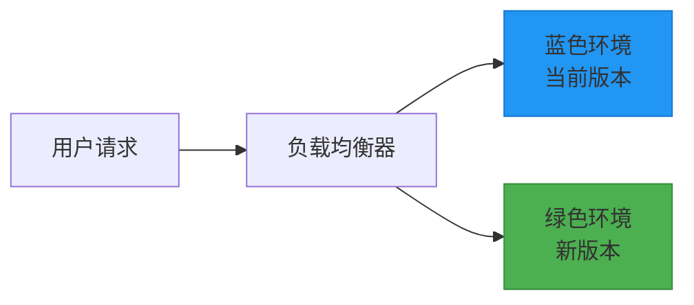
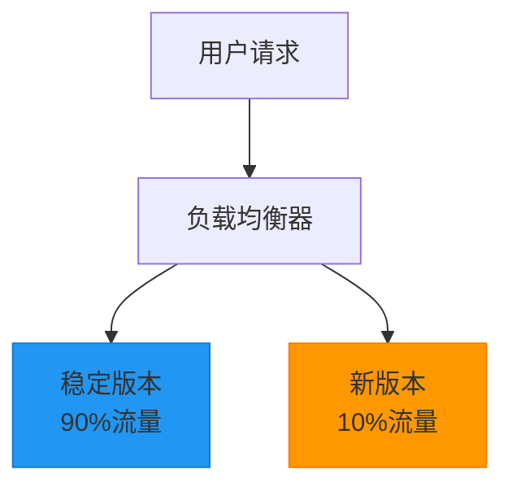
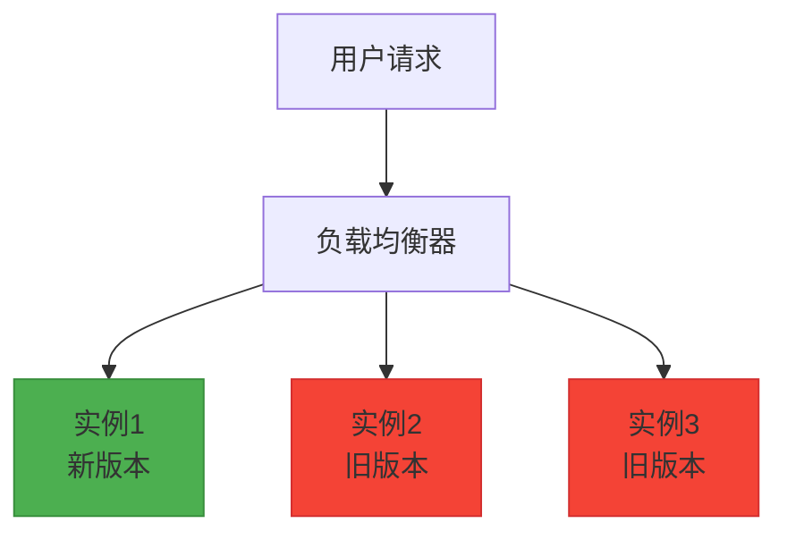

# 12-部署与运维

## 1. 部署策略概述

### 1.1 部署的重要性

在企业级应用开发中，部署是将开发完成的应用程序交付到生产环境并使其正常运行的关键环节。良好的部署策略能够：

1. **提高部署效率**：自动化部署流程，减少人工操作错误
2. **保证系统稳定性**：通过蓝绿部署、金丝雀发布等策略降低风险
3. **缩短交付周期**：快速响应业务需求，提高市场竞争力
4. **降低运维成本**：标准化部署流程，减少维护复杂度

### 1.2 部署模式

#### 1.2.1 蓝绿部署

蓝绿部署是一种零 downtime 的部署策略，通过维护两个完全相同的生产环境来实现无缝切换：



#### 1.2.2 金丝雀发布

金丝雀发布是一种渐进式部署策略，先将新版本部署到一小部分用户，逐步扩大范围：



#### 1.2.3 滚动更新

滚动更新是一种逐步替换旧实例的部署策略，通过逐个替换实例来完成整个部署过程：



## 2. Docker容器化部署

### 2.1 Docker基础配置

#### 2.1.1 Dockerfile编写

Dockerfile 是构建 Docker 镜像的配置文件，定义了应用程序的运行环境和依赖：

```dockerfile
# 使用官方 Node.js 运行时作为基础镜像
FROM node:18-alpine

# 设置工作目录
WORKDIR /app

# 复制 package.json 和 package-lock.json
COPY package*.json ./

# 安装生产依赖
RUN npm ci --only=production

# 复制应用源代码
COPY . .

# 创建非 root 用户
RUN addgroup -g 1001 -S nodejs
RUN adduser -S nextjs -u 1001
USER nextjs

# 暴露端口
EXPOSE 3000

# 启动命令
CMD ["npm", "start"]
```

#### 2.1.2 多阶段构建

多阶段构建可以减小最终镜像的大小，提高安全性：

```dockerfile
# 构建阶段
FROM node:18-alpine AS builder

# 设置工作目录
WORKDIR /app

# 复制 package.json 和安装依赖
COPY package*.json ./
RUN npm ci

# 复制源代码并构建
COPY . .
RUN npm run build

# 生产阶段
FROM node:18-alpine AS production

# 创建非 root 用户
RUN addgroup -g 1001 -S nodejs
RUN adduser -S nextjs -u 1001

# 设置工作目录
WORKDIR /app

# 复制 package.json 和安装生产依赖
COPY package*.json ./
RUN npm ci --only=production

# 从构建阶段复制构建产物
COPY --from=builder /app/dist ./dist

# 更改文件所有者
RUN chown -R nextjs:nodejs /app
USER nextjs

# 暴露端口
EXPOSE 3000

# 启动命令
CMD ["npm", "start"]
```

### 2.2 Docker Compose配置

Docker Compose 是用于定义和运行多容器 Docker 应用程序的工具：

```yaml
# docker-compose.yml
version: '3.8'

services:
  # 应用服务
  app:
    build: .
    ports:
      - "3000:3000"
    environment:
      - NODE_ENV=production
      - DB_HOST=mysql
      - DB_PORT=3306
      - DB_NAME=ecommerce
      - DB_USER=root
      - DB_PASSWORD=password
      - REDIS_HOST=redis
      - REDIS_PORT=6379
    depends_on:
      - mysql
      - redis
    restart: unless-stopped
    networks:
      - app-network

  # MySQL数据库
  mysql:
    image: mysql:8.0
    environment:
      MYSQL_ROOT_PASSWORD: password
      MYSQL_DATABASE: ecommerce
      MYSQL_USER: appuser
      MYSQL_PASSWORD: password
    ports:
      - "3306:3306"
    volumes:
      - mysql_data:/var/lib/mysql
      - ./mysql/init:/docker-entrypoint-initdb.d
    restart: unless-stopped
    networks:
      - app-network

  # Redis缓存
  redis:
    image: redis:7-alpine
    ports:
      - "6379:6379"
    volumes:
      - redis_data:/data
    restart: unless-stopped
    networks:
      - app-network

  # Nginx反向代理
  nginx:
    image: nginx:alpine
    ports:
      - "80:80"
      - "443:443"
    volumes:
      - ./nginx/nginx.conf:/etc/nginx/nginx.conf
      - ./nginx/conf.d:/etc/nginx/conf.d
      - ./nginx/certs:/etc/nginx/certs
      - ./nginx/logs:/var/log/nginx
    depends_on:
      - app
    restart: unless-stopped
    networks:
      - app-network

volumes:
  mysql_data:
  redis_data:

networks:
  app-network:
    driver: bridge
```

#### 2.2.1 环境变量配置

通过 .env 文件管理环境变量，实现不同环境的配置隔离：

```bash
# .env.production
NODE_ENV=production
DB_HOST=mysql
DB_PORT=3306
DB_NAME=ecommerce_production
DB_USER=appuser
DB_PASSWORD=secure_password
REDIS_HOST=redis
REDIS_PORT=6379
JWT_SECRET=your_jwt_secret_key
API_BASE_URL=https://api.yourdomain.com
```

### 2.3 容器编排与管理

#### 2.3.1 Kubernetes部署配置

对于大规模生产环境，可以使用 Kubernetes 进行容器编排：

```yaml
# deployment.yaml
apiVersion: apps/v1
kind: Deployment
metadata:
  name: ecommerce-app
  labels:
    app: ecommerce
spec:
  replicas: 3
  selector:
    matchLabels:
      app: ecommerce
  template:
    metadata:
      labels:
        app: ecommerce
    spec:
      containers:
      - name: app
        image: your-registry/ecommerce-app:latest
        ports:
        - containerPort: 3000
        envFrom:
        - configMapRef:
            name: app-config
        - secretRef:
            name: app-secrets
        resources:
          requests:
            memory: "256Mi"
            cpu: "250m"
          limits:
            memory: "512Mi"
            cpu: "500m"
        livenessProbe:
          httpGet:
            path: /health
            port: 3000
          initialDelaySeconds: 30
          periodSeconds: 10
        readinessProbe:
          httpGet:
            path: /ready
            port: 3000
          initialDelaySeconds: 5
          periodSeconds: 5
```

```yaml
# service.yaml
apiVersion: v1
kind: Service
metadata:
  name: ecommerce-service
spec:
  selector:
    app: ecommerce
  ports:
    - protocol: TCP
      port: 80
      targetPort: 3000
  type: ClusterIP
```

## 3. PM2进程管理

### 3.1 PM2基础配置

PM2 是 Node.js 应用的生产进程管理器，具有负载均衡、日志管理、监控等功能：

#### 3.1.1 PM2配置文件

```javascript
// ecosystem.config.js
module.exports = {
  apps: [
    {
      name: 'ecommerce-api',
      script: './dist/server.js',
      instances: 'max', // 根据CPU核心数启动实例
      exec_mode: 'cluster', // 集群模式
      watch: false, // 生产环境不监听文件变化
      max_memory_restart: '1G', // 内存超过1G时重启
      env: {
        NODE_ENV: 'development',
        PORT: 3000
      },
      env_production: {
        NODE_ENV: 'production',
        PORT: 3000
      },
      error_file: './logs/err.log',
      out_file: './logs/out.log',
      log_file: './logs/combined.log',
      log_date_format: 'YYYY-MM-DD HH:mm:ss',
      combine_logs: true,
      merge_logs: true,
      kill_timeout: 5000,
      wait_ready: true,
      listen_timeout: 10000
    }
  ],
  
  deploy: {
    production: {
      user: 'deploy',
      host: ['server1.example.com', 'server2.example.com'],
      ref: 'origin/main',
      repo: 'git@github.com:your-org/ecommerce.git',
      path: '/var/www/ecommerce',
      'pre-deploy-local': '',
      'post-deploy': 'npm install && npm run build && pm2 reload ecosystem.config.js --env production',
      'pre-setup': ''
    }
  }
};
```

#### 3.1.2 PM2常用命令

```bash
# 启动应用
pm2 start ecosystem.config.js

# 启动生产环境应用
pm2 start ecosystem.config.js --env production

# 查看应用状态
pm2 status

# 查看应用日志
pm2 logs

# 重启应用
pm2 restart ecommerce-api

# 停止应用
pm2 stop ecommerce-api

# 删除应用
pm2 delete ecommerce-api

# 监控应用
pm2 monit

# 保存当前进程列表
pm2 save

# 开机自启动
pm2 startup
```

### 3.2 PM2高级功能

#### 3.2.1 负载均衡

PM2 的集群模式可以实现多进程负载均衡：

```javascript
// 负载均衡配置示例
module.exports = {
  apps: [
    {
      name: 'ecommerce-api',
      script: './dist/server.js',
      instances: 4, // 固定4个实例
      // instances: 'max', // 或者根据CPU核心数自动调整
      exec_mode: 'cluster',
      // ... 其他配置
    }
  ]
};
```

#### 3.2.2 日志管理

PM2 提供了强大的日志管理功能：

```javascript
// 日志配置示例
module.exports = {
  apps: [
    {
      name: 'ecommerce-api',
      // ... 其他配置
      error_file: './logs/err.log',
      out_file: './logs/out.log',
      log_file: './logs/combined.log',
      log_date_format: 'YYYY-MM-DD HH:mm:ss Z',
      log_type: 'json', // JSON格式日志
      // 日志轮转配置
      max_memory_restart: '100M',
      // ... 其他配置
    }
  ]
};
```

## 4. CI/CD流水线

### 4.1 持续集成配置

#### 4.1.1 GitHub Actions配置

GitHub Actions 是 GitHub 提供的 CI/CD 服务，可以自动化测试和部署流程：

```yaml
# .github/workflows/ci.yml
name: CI

on:
  push:
    branches: [ main, develop ]
  pull_request:
    branches: [ main ]

jobs:
  test:
    runs-on: ubuntu-latest
    
    services:
      mysql:
        image: mysql:8.0
        env:
          MYSQL_ROOT_PASSWORD: root_password
          MYSQL_DATABASE: ecommerce_test
        ports:
          - 3306:3306
        options: --health-cmd="mysqladmin ping" --health-interval=10s --health-timeout=5s --health-retries=3
      
      redis:
        image: redis:7-alpine
        ports:
          - 6379:6379
        options: --health-cmd="redis-cli ping" --health-interval=10s --health-timeout=5s --health-retries=3
    
    strategy:
      matrix:
        node-version: [16.x, 18.x]
    
    steps:
    - uses: actions/checkout@v3
    
    - name: Use Node.js ${{ matrix.node-version }}
      uses: actions/setup-node@v3
      with:
        node-version: ${{ matrix.node-version }}
        cache: 'npm'
    
    - name: Install dependencies
      run: npm ci
    
    - name: Setup database
      run: |
        npm run db:create:test
        npm run db:migrate:test
    
    - name: Run lint
      run: npm run lint
    
    - name: Run unit tests
      run: npm run test:unit
    
    - name: Run integration tests
      run: npm run test:integration
      env:
        DB_HOST: localhost
        DB_PORT: 3306
        DB_NAME: ecommerce_test
        DB_USER: root
        DB_PASSWORD: root_password
        REDIS_HOST: localhost
        REDIS_PORT: 6379
    
    - name: Run coverage check
      run: npm run test:coverage
    
    - name: Upload coverage to Codecov
      uses: codecov/codecov-action@v3
      with:
        file: ./coverage/lcov.info
        flags: unittests
```

#### 4.1.2 GitLab CI配置

GitLab CI 是 GitLab 提供的 CI/CD 服务：

```yaml
# .gitlab-ci.yml
stages:
  - test
  - build
  - deploy

variables:
  MYSQL_DATABASE: ecommerce_test
  MYSQL_ROOT_PASSWORD: mysql
  DOCKER_DRIVER: overlay2
  DOCKER_TLS_CERTDIR: "/certs"

before_script:
  - npm ci

test:
  stage: test
  image: node:18
  services:
    - mysql:8.0
    - redis:7-alpine
  variables:
    MYSQL_DATABASE: ecommerce_test
    MYSQL_ROOT_PASSWORD: mysql
  script:
    - npm run lint
    - npm run test:unit
    - npm run test:integration
  coverage: '/All files[^|]*\|[^|]*\s+([\d\.]+)/'
  artifacts:
    reports:
      coverage_report:
        coverage_format: cobertura
        path: coverage/cobertura-coverage.xml

build:
  stage: build
  image: docker:20.10.16
  services:
    - docker:20.10.16-dind
  variables:
    DOCKER_TLS_CERTDIR: "/certs"
  before_script:
    - docker login -u $CI_REGISTRY_USER -p $CI_REGISTRY_PASSWORD $CI_REGISTRY
  script:
    - docker build -t $CI_REGISTRY_IMAGE:$CI_COMMIT_SHA .
    - docker push $CI_REGISTRY_IMAGE:$CI_COMMIT_SHA
  only:
    - main

deploy_staging:
  stage: deploy
  image: bitnami/kubectl:latest
  environment:
    name: staging
  script:
    - kubectl set image deployment/ecommerce-app app=$CI_REGISTRY_IMAGE:$CI_COMMIT_SHA
  only:
    - main
  when: manual

deploy_production:
  stage: deploy
  image: bitnami/kubectl:latest
  environment:
    name: production
  script:
    - kubectl set image deployment/ecommerce-app app=$CI_REGISTRY_IMAGE:$CI_COMMIT_SHA
  only:
    - main
  when: manual
```

### 4.2 持续部署配置

#### 4.2.1 自动化部署脚本

```bash
#!/bin/bash
# deploy.sh

# 部署脚本
set -e

echo "开始部署应用..."

# 获取当前时间戳
TIMESTAMP=$(date +%Y%m%d_%H%M%S)

# 备份当前版本
echo "备份当前版本..."
tar -czf backup_$TIMESTAMP.tar.gz /var/www/ecommerce

# 拉取最新代码
echo "拉取最新代码..."
cd /var/www/ecommerce
git pull origin main

# 安装依赖
echo "安装依赖..."
npm ci --only=production

# 构建应用
echo "构建应用..."
npm run build

# 运行数据库迁移
echo "运行数据库迁移..."
npm run db:migrate

# 重启应用
echo "重启应用..."
pm2 reload ecosystem.config.js --env production

# 清理旧备份（保留最近5个）
echo "清理旧备份..."
ls -t backup_*.tar.gz | tail -n +6 | xargs rm -f

echo "部署完成！"
```

#### 4.2.2 蓝绿部署脚本

```bash
#!/bin/bash
# blue-green-deploy.sh

# 蓝绿部署脚本
set -e

# 配置变量
BLUE_PORT=3001
GREEN_PORT=3002
NGINX_CONFIG="/etc/nginx/sites-available/ecommerce"
CURRENT_COLOR=$(curl -s http://localhost/color)

echo "当前运行环境: $CURRENT_COLOR"

# 确定要部署的环境
if [ "$CURRENT_COLOR" = "blue" ]; then
  DEPLOY_PORT=$GREEN_PORT
  DEPLOY_COLOR="green"
  STOP_COLOR="blue"
else
  DEPLOY_PORT=$BLUE_PORT
  DEPLOY_COLOR="blue"
  STOP_COLOR="green"
fi

echo "部署到 $DEPLOY_COLOR 环境，端口: $DEPLOY_PORT"

# 启动新版本
echo "启动 $DEPLOY_COLOR 环境..."
PORT=$DEPLOY_PORT pm2 start ecosystem.config.js --only ecommerce-api --env production

# 等待新版本启动
echo "等待 $DEPLOY_COLOR 环境启动..."
sleep 10

# 检查新版本是否正常运行
echo "检查 $DEPLOY_COLOR 环境状态..."
curl -f http://localhost:$DEPLOY_PORT/health || {
  echo "新版本启动失败，回滚..."
  pm2 stop ecommerce-api-$DEPLOY_COLOR
  exit 1
}

# 切换流量
echo "切换流量到 $DEPLOY_COLOR 环境..."
sed -i "s/upstream app_backend.*/upstream app_backend {\n    server 127.0.0.1:$DEPLOY_PORT;\n}/" $NGINX_CONFIG
nginx -s reload

# 等待流量切换完成
sleep 5

# 停止旧版本
echo "停止 $STOP_COLOR 环境..."
pm2 stop ecommerce-api-$STOP_COLOR

echo "蓝绿部署完成！当前运行环境: $DEPLOY_COLOR"
```

## 5. 环境管理

### 5.1 多环境配置

#### 5.1.1 环境配置文件

```javascript
// src/config/index.js
const env = process.env.NODE_ENV || 'development';

const configs = {
  development: {
    port: process.env.PORT || 3000,
    database: {
      host: process.env.DB_HOST || 'localhost',
      port: process.env.DB_PORT || 3306,
      database: process.env.DB_NAME || 'ecommerce_dev',
      username: process.env.DB_USER || 'root',
      password: process.env.DB_PASSWORD || 'password'
    },
    redis: {
      host: process.env.REDIS_HOST || 'localhost',
      port: process.env.REDIS_PORT || 6379,
      db: process.env.REDIS_DB || 0
    },
    jwt: {
      secret: process.env.JWT_SECRET || 'dev_secret',
      expiresIn: process.env.JWT_EXPIRES_IN || '24h'
    }
  },
  
  test: {
    port: process.env.PORT || 3001,
    database: {
      host: process.env.DB_HOST || 'localhost',
      port: process.env.DB_PORT || 3306,
      database: process.env.DB_NAME || 'ecommerce_test',
      username: process.env.DB_USER || 'root',
      password: process.env.DB_PASSWORD || 'password'
    },
    redis: {
      host: process.env.REDIS_HOST || 'localhost',
      port: process.env.REDIS_PORT || 6379,
      db: process.env.REDIS_DB || 1
    }
  },
  
  production: {
    port: process.env.PORT || 3000,
    database: {
      host: process.env.DB_HOST,
      port: process.env.DB_PORT || 3306,
      database: process.env.DB_NAME,
      username: process.env.DB_USER,
      password: process.env.DB_PASSWORD
    },
    redis: {
      host: process.env.REDIS_HOST,
      port: process.env.REDIS_PORT || 6379,
      db: process.env.REDIS_DB || 0
    },
    jwt: {
      secret: process.env.JWT_SECRET,
      expiresIn: process.env.JWT_EXPIRES_IN || '7d'
    }
  }
};

module.exports = configs[env];
```

#### 5.1.2 配置验证

```javascript
// src/config/validator.js
const config = require('./index');

class ConfigValidator {
  static validate() {
    const errors = [];
    
    // 验证必要配置
    if (!config.database.host) {
      errors.push('数据库主机地址未配置');
    }
    
    if (!config.database.database) {
      errors.push('数据库名称未配置');
    }
    
    if (!config.redis.host) {
      errors.push('Redis主机地址未配置');
    }
    
    if (process.env.NODE_ENV === 'production') {
      // 生产环境额外验证
      if (!config.jwt.secret || config.jwt.secret === 'dev_secret') {
        errors.push('生产环境JWT密钥未正确配置');
      }
      
      if (!config.database.username || config.database.username === 'root') {
        errors.push('生产环境数据库用户名未正确配置');
      }
    }
    
    if (errors.length > 0) {
      throw new Error(`配置验证失败:\n${errors.join('\n')}`);
    }
    
    console.log('配置验证通过');
  }
}

module.exports = ConfigValidator;
```

### 5.2 环境切换策略

#### 5.2.1 灰度发布

```javascript
// src/middleware/canary.middleware.js
const crypto = require('crypto');

const canaryMiddleware = (percentage = 10) => {
  return async (ctx, next) => {
    // 根据用户ID或请求特征决定是否进入灰度环境
    const userId = ctx.user ? ctx.user.id : null;
    const requestId = ctx.headers['x-request-id'] || crypto.randomUUID();
    
    // 计算哈希值决定路由
    const hash = crypto.createHash('md5').update(requestId).digest('hex');
    const hashValue = parseInt(hash.substr(0, 8), 16);
    const routeToCanary = (hashValue % 100) < percentage;
    
    if (routeToCanary) {
      // 设置灰度环境标识
      ctx.state.environment = 'canary';
      ctx.set('X-Environment', 'canary');
    } else {
      ctx.state.environment = 'stable';
      ctx.set('X-Environment', 'stable');
    }
    
    await next();
  };
};

module.exports = canaryMiddleware;
```

## 6. 故障恢复与容错

### 6.1 健康检查

#### 6.1.1 应用健康检查

```javascript
// src/app.js
const Koa = require('koa');
const Router = require('koa-router');
const { sequelize } = require('./database');
const redisClient = require('./config/redis');

const app = new Koa();
const router = new Router();

// 基础健康检查端点
router.get('/health', async (ctx) => {
  ctx.body = {
    status: 'ok',
    timestamp: new Date().toISOString(),
    version: process.env.APP_VERSION || '1.0.0'
  };
});

// 详细健康检查端点
router.get('/health/detail', async (ctx) => {
  const checks = {};
  
  // 数据库健康检查
  try {
    await sequelize.authenticate();
    checks.database = { status: 'ok' };
  } catch (error) {
    checks.database = { status: 'error', message: error.message };
  }
  
  // Redis健康检查
  try {
    await redisClient.ping();
    checks.redis = { status: 'ok' };
  } catch (error) {
    checks.redis = { status: 'error', message: error.message };
  }
  
  // 应用状态
  const overallStatus = Object.values(checks).every(check => check.status === 'ok') ? 'ok' : 'error';
  
  ctx.status = overallStatus === 'ok' ? 200 : 503;
  ctx.body = {
    status: overallStatus,
    timestamp: new Date().toISOString(),
    checks
  };
});

// 就绪检查端点
router.get('/ready', async (ctx) => {
  // 检查应用是否准备好接收流量
  const isReady = app.context.isReady || false;
  
  if (isReady) {
    ctx.status = 200;
    ctx.body = { status: 'ready' };
  } else {
    ctx.status = 503;
    ctx.body = { status: 'not ready' };
  }
});

app.use(router.routes());
```

#### 6.1.2 数据库连接池监控

```javascript
// src/utils/db-monitor.js
const { sequelize } = require('../database');

class DatabaseMonitor {
  static getConnectionPoolStats() {
    const pool = sequelize.connectionManager.pool;
    
    return {
      used: pool.used,
      free: pool.free,
      pending: pool.pending,
      maxSize: pool.maxSize,
      minSize: pool.minSize,
      utilization: pool.used / pool.maxSize
    };
  }
  
  static async getDatabaseStats() {
    try {
      // 获取连接池状态
      const poolStats = this.getConnectionPoolStats();
      
      // 获取慢查询日志
      const slowQueries = await this.getSlowQueries();
      
      // 获取表大小信息
      const tableSizes = await this.getTableSizes();
      
      return {
        pool: poolStats,
        slowQueries,
        tableSizes
      };
    } catch (error) {
      console.error('Database monitoring error:', error);
      return null;
    }
  }
  
  static async getSlowQueries() {
    // 实现慢查询监控逻辑
    return [];
  }
  
  static async getTableSizes() {
    // 实现表大小查询逻辑
    try {
      const [results] = await sequelize.query(`
        SELECT 
          table_name,
          ROUND(((data_length + index_length) / 1024 / 1024), 2) AS size_mb
        FROM information_schema.tables 
        WHERE table_schema = DATABASE()
        ORDER BY (data_length + index_length) DESC
      `);
      
      return results;
    } catch (error) {
      console.error('Table size query error:', error);
      return [];
    }
  }
}

module.exports = DatabaseMonitor;
```

### 6.2 自动恢复机制

#### 6.2.1 服务重启策略

```javascript
// src/utils/service-recovery.js
const pm2 = require('pm2');

class ServiceRecovery {
  static async restartService(serviceName) {
    return new Promise((resolve, reject) => {
      pm2.restart(serviceName, (err, apps) => {
        if (err) {
          reject(err);
        } else {
          console.log(`服务 ${serviceName} 已重启`);
          resolve(apps);
        }
      });
    });
  }
  
  static async gracefulReload(serviceName) {
    return new Promise((resolve, reject) => {
      pm2.reload(serviceName, (err, apps) => {
        if (err) {
          reject(err);
        } else {
          console.log(`服务 ${serviceName} 已平滑重启`);
          resolve(apps);
        }
      });
    });
  }
  
  static async checkAndRecover(serviceName, healthCheckUrl) {
    try {
      const response = await fetch(healthCheckUrl, { timeout: 5000 });
      
      if (!response.ok) {
        console.warn(`服务 ${serviceName} 健康检查失败，准备重启`);
        await this.restartService(serviceName);
      }
    } catch (error) {
      console.error(`服务 ${serviceName} 健康检查异常:`, error.message);
      await this.restartService(serviceName);
    }
  }
}

module.exports = ServiceRecovery;
```

#### 6.2.2 定时健康检查

```javascript
// src/schedulers/health-check.scheduler.js
const cron = require('node-cron');
const ServiceRecovery = require('../utils/service-recovery');

class HealthCheckScheduler {
  static start() {
    // 每5分钟检查一次应用健康状态
    cron.schedule('*/5 * * * *', async () => {
      console.log('执行健康检查...');
      
      try {
        await ServiceRecovery.checkAndRecover(
          'ecommerce-api',
          'http://localhost:3000/health'
        );
      } catch (error) {
        console.error('健康检查失败:', error.message);
      }
    });
    
    console.log('健康检查调度器已启动');
  }
}

module.exports = HealthCheckScheduler;
```

## 7. 总结

本文档详细介绍了企业级电商系统的部署与运维策略。通过Docker容器化部署、PM2进程管理、CI/CD流水线等技术手段，我们能够构建出高可用、可扩展的生产环境。

### 7.1 关键要点

1. **部署策略**：采用蓝绿部署、金丝雀发布等策略降低部署风险
2. **容器化**：使用Docker和Docker Compose实现应用容器化
3. **进程管理**：通过PM2实现Node.js应用的生产级进程管理
4. **自动化**：建立完整的CI/CD流水线，实现自动化测试和部署
5. **环境管理**：合理管理开发、测试、生产等多环境配置
6. **容错机制**：建立健康检查和自动恢复机制，提高系统稳定性

### 7.2 下一步学习

- 实现监控与日志系统
- 构建安全防护与最佳实践
- 完善性能调优方案
- 学习云原生部署技术

继续阅读后续文档，深入学习电商系统的其他核心功能模块！