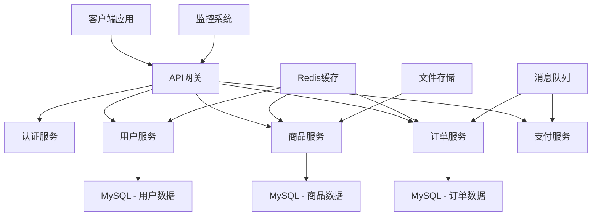

# Node.js + Koa2 + TypeScript 企业级电商项目实战

## 📖 项目概述

本项目是一个基于 **Node.js + Koa2 + TypeScript** 构建的企业级电商系统实战教程，旨在通过一个完整的电商项目案例，深入讲解企业级Node.js应用的设计思想、开发规范和最佳实践。采用TypeScript提供类型安全、更好的开发体验和代码可维护性。

### 🎯 学习目标

- **掌握企业级项目架构设计**：从单体架构到微服务架构的演进
- **理解Koa2框架核心原理**：中间件机制、洋葱圈模型、异步编程
- **学习现代化开发流程**：代码规范、测试驱动开发、CI/CD部署
- **构建完整的电商业务系统**：用户管理、商品管理、订单系统、支付集成
- **掌握性能优化技巧**：缓存策略、数据库优化、负载均衡

### 🛠️ 技术栈选择

#### 后端核心技术
- **运行环境**：Node.js 18+ (LTS版本)
- **编程语言**：TypeScript 5.x
- **Web框架**：Koa2 + Koa-Router
- **数据库**：MySQL 8.0 + Redis 6.0+
- **ORM框架**：Sequelize 6.x + TypeScript支持
- **认证授权**：JWT + Passport.js
- **参数验证**：Joi + TypeScript类型验证
- **日志系统**：Winston + Morgan

#### 开发工具与规范
- **代码规范**：ESLint + Prettier + TypeScript ESLint
- **类型检查**：TypeScript Compiler + 严格模式
- **API文档**：Swagger + OpenAPI 3.0 + TypeScript类型生成
- **测试框架**：Jest + Supertest + TypeScript支持
- **进程管理**：PM2
- **容器化**：Docker + Docker Compose
- **版本控制**：Git + Husky (Git Hooks)

#### 第三方服务集成
- **支付系统**：支付宝、微信支付模拟
- **对象存储**：阿里云OSS / AWS S3
- **消息队列**：Redis + Bull Queue
- **监控系统**：Prometheus + Grafana
- **日志收集**：ELK Stack

### 🏗️ 项目架构特点



### 📚 文档导航

#### 基础篇
- [00-项目概述与架构设计](./00-项目概述与架构设计.md) - 整体架构设计思想
- [01-开发环境与项目初始化](./01-开发环境与项目初始化.md) - 环境搭建和项目结构
- [02-数据库设计与ORM](./02-数据库设计与ORM.md) - 数据库设计和ORM使用

#### 核心功能篇
- [03-用户认证与权限管理](./03-用户认证与权限管理.md) - JWT认证、RBAC权限控制
- [04-商品管理模块](./04-商品管理模块.md) - 商品CRUD、分类管理、库存控制
- [05-订单管理系统](./05-订单管理系统.md) - 购物车、订单流程、状态管理
- [06-支付系统集成](./06-支付系统集成.md) - 支付宝、微信支付集成

#### 进阶篇
- [07-API设计与文档](./07-API设计与文档.md) - RESTful API设计、Swagger文档
- [08-中间件与插件开发](./08-中间件与插件开发.md) - 自定义中间件、插件机制
- [09-缓存与性能优化](./09-缓存与性能优化.md) - Redis缓存、数据库优化
- [10-消息队列与异步处理](./10-消息队列与异步处理.md) - Bull Queue、任务调度

#### 运维篇
- [11-测试策略与实践](./11-测试策略与实践.md) - 单元测试、集成测试、E2E测试
- [12-部署与运维](./12-部署与运维.md) - Docker部署、PM2进程管理
- [13-监控与日志](./13-监控与日志.md) - 系统监控、日志分析
- [14-安全防护与最佳实践](./14-安全防护与最佳实践.md) - 安全策略、性能调优

### 🚀 快速开始

```bash
# 1. 克隆项目
git clone https://github.com/your-repo/koa-ecommerce.git

# 2. 安装依赖
cd koa-ecommerce
npm install

# 3. 配置环境变量
cp .env.example .env

# 4. 初始化数据库
npm run db:migrate
npm run db:seed

# 5. 启动开发服务器
npm run dev
```

### 🌟 项目特色

#### 1. 企业级代码规范
- **统一的代码风格**：基于ESLint + Prettier + TypeScript的代码规范
- **完整的类型安全**：TypeScript严格模式 + 完整类型定义
- **Git提交规范**：基于Conventional Commits的提交信息规范

#### 2. 高可扩展性架构
- **模块化设计**：清晰的目录结构和模块划分
- **中间件机制**：灵活的中间件组合和复用
- **插件化架构**：支持第三方插件扩展

#### 3. 完整的开发流程
- **开发环境一致性**：Docker统一开发环境
- **自动化测试**：完整的测试覆盖率
- **持续集成部署**：GitHub Actions CI/CD流水线

#### 4. 生产级性能优化
- **缓存策略**：多层缓存机制
- **数据库优化**：索引优化、查询优化
- **并发处理**：连接池、队列机制

### 📖 学习路径建议

#### 初学者路径
1. 阅读项目概述，了解整体架构
2. 跟随环境搭建教程，配置开发环境
3. 学习基础的用户认证和商品管理模块
4. 逐步实现订单和支付功能

#### 进阶开发者路径
1. 重点学习架构设计思想
2. 深入理解中间件和插件机制
3. 关注性能优化和缓存策略
4. 学习监控和运维实践

#### 架构师路径
1. 分析系统架构设计原理
2. 学习微服务架构演进方案
3. 掌握性能调优和容量规划
4. 了解DevOps和运维最佳实践

### 🤝 贡献指南

我们欢迎所有形式的贡献，包括但不限于：
- 代码改进和Bug修复
- 文档完善和翻译
- 新功能建议和讨论
- 使用体验反馈

### 📄 许可证

本项目采用 MIT 许可证，详见 [LICENSE](./LICENSE) 文件。

### 💬 交流与支持

- **技术交流群**：[QQ群/微信群]
- **问题反馈**：[GitHub Issues](https://github.com/your-repo/koa-ecommerce/issues)
- **邮件联系**：your-email@example.com

---

> 📢 **重要提示**：本项目仅供学习交流使用，生产环境使用请根据实际需求进行安全评估和性能测试。

**开始你的企业级Node.js开发之旅！** 🎉