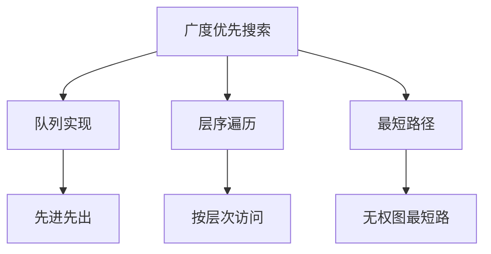
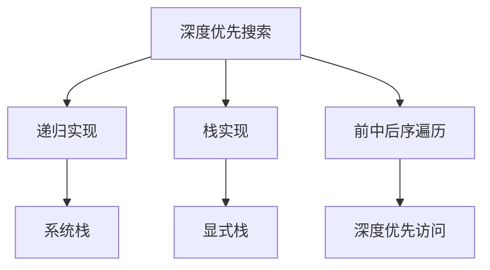
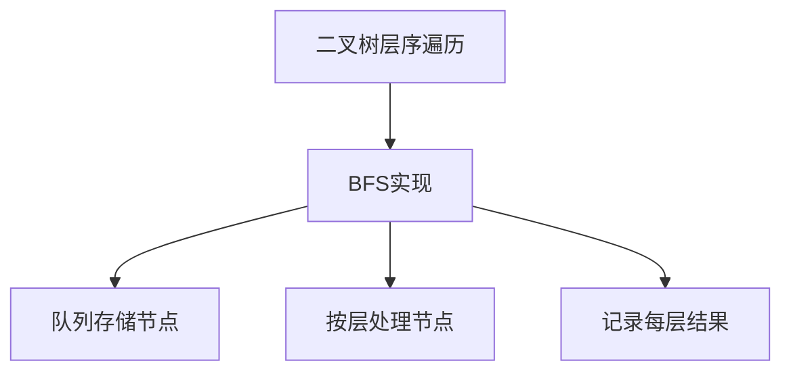
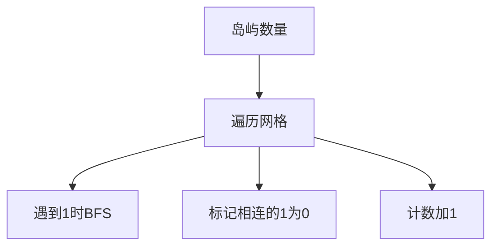
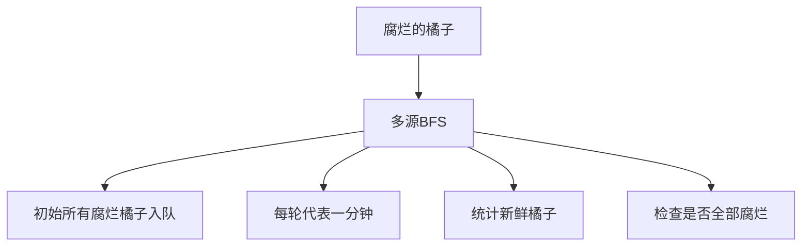
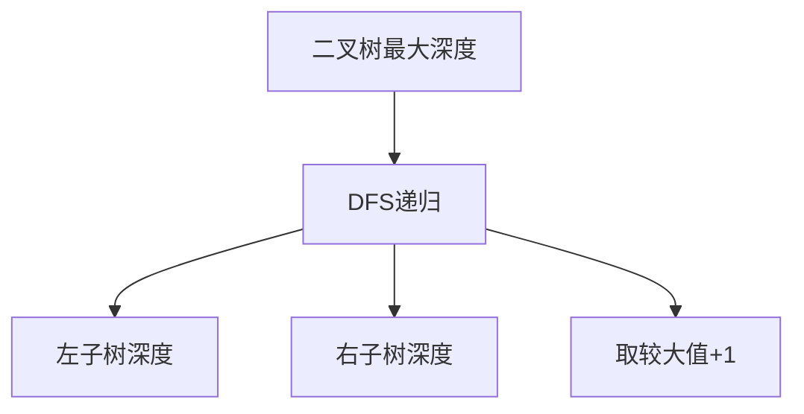
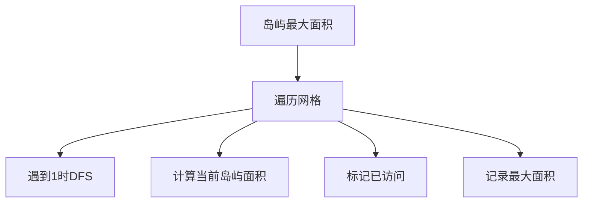
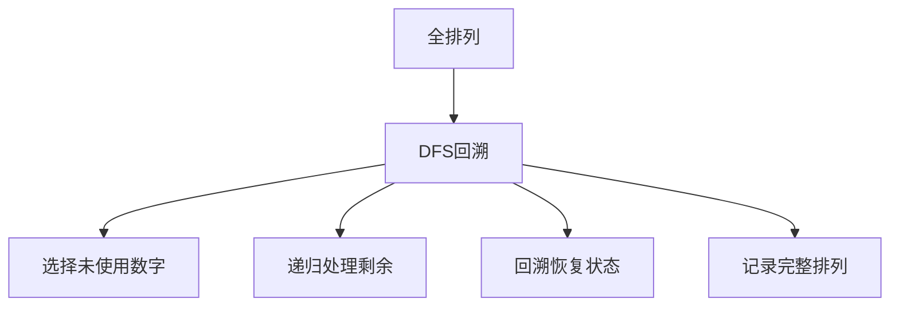
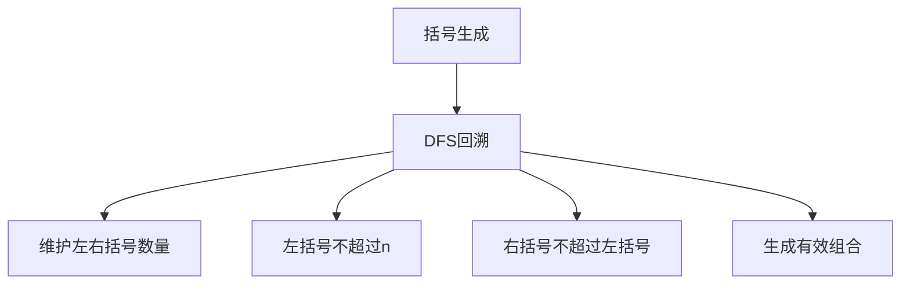

# BFS与DFS算法

广度优先搜索（BFS）和深度优先搜索（DFS）是图和树遍历的两种基本算法，也是解决许多算法问题的核心思想。

## 广度优先搜索（BFS）

BFS是一种图形搜索算法，从根节点开始，沿着树的宽度遍历树的节点。



### BFS的基本思路

1. **初始化**：将起始节点加入队列
2. **循环处理**：当队列不为空时，取出队首节点进行处理
3. **扩展节点**：将当前节点的未访问邻居节点加入队列
4. **标记访问**：避免重复访问同一节点

### BFS的实现框架

```javascript
function bfs(root) {
  if (root === null) return;
  
  const queue = [root];
  const visited = new Set();  // 用于图的访问标记
  visited.add(root);
  
  while (queue.length > 0) {
    const node = queue.shift();  // 取出队首节点
    
    // 处理当前节点
    process(node);
    
    // 将未访问的邻居节点加入队列
    for (const neighbor of getNeighbors(node)) {
      if (!visited.has(neighbor)) {
        visited.add(neighbor);
        queue.push(neighbor);
      }
    }
  }
}
```

## 深度优先搜索（DFS）

DFS是一种用于遍历或搜索树或图的算法，沿着树的深度遍历树的节点，尽可能深的搜索树的分支。



### DFS的基本思路

1. **访问节点**：处理当前节点
2. **递归处理**：对每个未访问的邻居节点递归调用DFS
3. **回溯**：当无法继续深入时，回退到上一个节点

### DFS的实现框架

```javascript
// 递归实现
function dfsRecursive(node, visited = new Set()) {
  if (node === null) return;
  
  // 标记为已访问
  visited.add(node);
  
  // 处理当前节点
  process(node);
  
  // 递归处理邻居节点
  for (const neighbor of getNeighbors(node)) {
    if (!visited.has(neighbor)) {
      dfsRecursive(neighbor, visited);
    }
  }
}

// 栈实现
function dfsIterative(root) {
  if (root === null) return;
  
  const stack = [root];
  const visited = new Set();
  visited.add(root);
  
  while (stack.length > 0) {
    const node = stack.pop();  // 取出栈顶节点
    
    // 处理当前节点
    process(node);
    
    // 将未访问的邻居节点加入栈
    for (const neighbor of getNeighbors(node)) {
      if (!visited.has(neighbor)) {
        visited.add(neighbor);
        stack.push(neighbor);
      }
    }
  }
}
```

## 经典BFS算法题详解

### 1. 二叉树的层序遍历（Binary Tree Level Order Traversal）

**题目描述**：给你二叉树的根节点 root ，返回其节点值的层序遍历。（即逐层地，从左到右访问所有节点）

**解题思路**：
- 使用BFS进行层序遍历
- 用队列存储每一层的节点
- 每次处理一层的所有节点



```javascript
function levelOrder(root) {
  if (root === null) return [];
  
  const queue = [root];
  const result = [];
  
  while (queue.length > 0) {
    const levelSize = queue.length;
    const currentLevel = [];
    
    // 处理当前层的所有节点
    for (let i = 0; i < levelSize; i++) {
      const node = queue.shift();
      currentLevel.push(node.val);
      
      // 将下一层的节点加入队列
      if (node.left !== null) {
        queue.push(node.left);
      }
      if (node.right !== null) {
        queue.push(node.right);
      }
    }
    
    result.push(currentLevel);
  }
  
  return result;
}
// 时间复杂度：O(n)
// 空间复杂度：O(w)，w为树的最大宽度
```

### 2. 岛屿数量（Number of Islands）

**题目描述**：给你一个由 '1'（陆地）和 '0'（水）组成的的二维网格，请你计算其中岛屿的数量。

**解题思路**：
- 遍历网格，当遇到'1'时，使用BFS将相连的'1'都标记为'0'
- 每次BFS操作计数加1
- 返回计数结果



```javascript
function numIslands(grid) {
  if (grid.length === 0 || grid[0].length === 0) return 0;
  
  const rows = grid.length;
  const cols = grid[0].length;
  let count = 0;
  
  // 遍历网格
  for (let i = 0; i < rows; i++) {
    for (let j = 0; j < cols; j++) {
      if (grid[i][j] === '1') {
        // 发现新岛屿，使用BFS标记所有相连的陆地
        bfs(grid, i, j, rows, cols);
        count++;
      }
    }
  }
  
  return count;
}

function bfs(grid, startRow, startCol, rows, cols) {
  const queue = [[startRow, startCol]];
  grid[startRow][startCol] = '0';  // 标记为已访问
  
  // 四个方向：上、下、左、右
  const directions = [[-1, 0], [1, 0], [0, -1], [0, 1]];
  
  while (queue.length > 0) {
    const [row, col] = queue.shift();
    
    // 检查四个方向的邻居
    for (const [dr, dc] of directions) {
      const newRow = row + dr;
      const newCol = col + dc;
      
      // 检查边界和是否为陆地
      if (newRow >= 0 && newRow < rows && 
          newCol >= 0 && newCol < cols && 
          grid[newRow][newCol] === '1') {
        grid[newRow][newCol] = '0';  // 标记为已访问
        queue.push([newRow, newCol]);
      }
    }
  }
}
// 时间复杂度：O(m×n)
// 空间复杂度：O(min(m,n))
```

### 3. 腐烂的橘子（Rotting Oranges）

**题目描述**：在给定的 m x n 网格 grid 中，每个单元格可以有以下三个值之一：值 0 代表空单元格；值 1 代表新鲜橘子；值 2 代表腐烂的橘子。每分钟，腐烂的橘子周围 4 个方向上相邻的新鲜橘子都会腐烂。返回直到单元格中没有新鲜橘子为止所必须经过的最小分钟数。如果不可能，返回 -1 。

**解题思路**：
- 多源BFS，将所有腐烂的橘子作为起始点
- 每一轮BFS代表一分钟
- 统计新鲜橘子数量，最后检查是否全部腐烂



```javascript
function orangesRotting(grid) {
  const rows = grid.length;
  const cols = grid[0].length;
  const queue = [];
  let freshCount = 0;
  
  // 初始化队列和新鲜橘子计数
  for (let i = 0; i < rows; i++) {
    for (let j = 0; j < cols; j++) {
      if (grid[i][j] === 2) {
        queue.push([i, j, 0]);  // [行, 列, 时间]
      } else if (grid[i][j] === 1) {
        freshCount++;
      }
    }
  }
  
  // 如果没有新鲜橘子，直接返回0
  if (freshCount === 0) return 0;
  
  // 四个方向
  const directions = [[-1, 0], [1, 0], [0, -1], [0, 1]];
  let minutes = 0;
  
  // BFS
  while (queue.length > 0) {
    const [row, col, time] = queue.shift();
    minutes = time;
    
    // 检查四个方向
    for (const [dr, dc] of directions) {
      const newRow = row + dr;
      const newCol = col + dc;
      
      // 检查边界和是否为新鲜橘子
      if (newRow >= 0 && newRow < rows && 
          newCol >= 0 && newCol < cols && 
          grid[newRow][newCol] === 1) {
        grid[newRow][newCol] = 2;  // 腐烂
        freshCount--;
        queue.push([newRow, newCol, time + 1]);
      }
    }
  }
  
  // 如果还有新鲜橘子，返回-1
  return freshCount === 0 ? minutes : -1;
}
// 时间复杂度：O(m×n)
// 空间复杂度：O(m×n)
```

## 经典DFS算法题详解

### 1. 二叉树的最大深度（Maximum Depth of Binary Tree）

**题目描述**：给定一个二叉树，找出其最大深度。二叉树的深度为根节点到最远叶子节点的最长路径上的节点数。

**解题思路**：
- 使用DFS递归遍历
- 每次递归返回左右子树的最大深度加1



```javascript
function maxDepth(root) {
  // 基础情况
  if (root === null) return 0;
  
  // 递归计算左右子树的深度
  const leftDepth = maxDepth(root.left);
  const rightDepth = maxDepth(root.right);
  
  // 返回较大深度加1
  return Math.max(leftDepth, rightDepth) + 1;
}
// 时间复杂度：O(n)
// 空间复杂度：O(h)，h为树的高度
```

### 2. 岛屿的最大面积（Max Area of Island）

**题目描述**：给你一个大小为 m x n 的二进制矩阵 grid 。岛屿是由一些相邻的 1 (代表土地) 构成的组合，这里的「相邻」要求两个 1 必须在水平或者竖直的四个方向上相邻。你可以假设 grid 的四个边缘都被 0（代表水）包围着。岛屿的面积是岛上值为 1 的单元格的数目。计算并返回 grid 中最大的岛屿面积。如果没有岛屿，则返回面积为 0 。

**解题思路**：
- 遍历网格，当遇到1时，使用DFS计算当前岛屿的面积
- 在DFS过程中将访问过的1标记为0，避免重复计算
- 记录最大面积



```javascript
function maxAreaOfIsland(grid) {
  if (grid.length === 0 || grid[0].length === 0) return 0;
  
  const rows = grid.length;
  const cols = grid[0].length;
  let maxArea = 0;
  
  // 遍历网格
  for (let i = 0; i < rows; i++) {
    for (let j = 0; j < cols; j++) {
      if (grid[i][j] === 1) {
        // 计算当前岛屿的面积
        const area = dfs(grid, i, j, rows, cols);
        maxArea = Math.max(maxArea, area);
      }
    }
  }
  
  return maxArea;
}

function dfs(grid, row, col, rows, cols) {
  // 边界检查和值检查
  if (row < 0 || row >= rows || 
      col < 0 || col >= cols || 
      grid[row][col] === 0) {
    return 0;
  }
  
  // 标记为已访问
  grid[row][col] = 0;
  
  // 计算当前节点和四个方向邻居的面积
  let area = 1;
  area += dfs(grid, row - 1, col, rows, cols);  // 上
  area += dfs(grid, row + 1, col, rows, cols);  // 下
  area += dfs(grid, row, col - 1, rows, cols);  // 左
  area += dfs(grid, row, col + 1, rows, cols);  // 右
  
  return area;
}
// 时间复杂度：O(m×n)
// 空间复杂度：O(m×n)
```

### 3. 全排列（Permutations）

**题目描述**：给定一个不含重复数字的数组 nums ，返回其所有可能的全排列。你可以按任意顺序返回答案。

**解题思路**：
- 使用DFS回溯算法
- 每一层选择一个未使用的数字
- 当所有数字都被使用时，记录当前排列
- 回溯时恢复状态



```javascript
function permute(nums) {
  const result = [];
  const path = [];
  const used = Array(nums.length).fill(false);
  
  function backtrack() {
    // 递归终止条件
    if (path.length === nums.length) {
      result.push([...path]);  // 注意要复制数组
      return;
    }
    
    // 尝试每个数字
    for (let i = 0; i < nums.length; i++) {
      if (used[i]) continue;  // 跳过已使用的数字
      
      // 选择
      path.push(nums[i]);
      used[i] = true;
      
      // 递归
      backtrack();
      
      // 回溯
      path.pop();
      used[i] = false;
    }
  }
  
  backtrack();
  return result;
}
// 时间复杂度：O(n! × n)
// 空间复杂度：O(n)
```

### 4. 括号生成（Generate Parentheses）

**题目描述**：数字 n 代表生成括号的对数，请你设计一个函数，用于能够生成所有可能的并且有效的括号组合。

**解题思路**：
- 使用DFS回溯算法
- 维护左括号和右括号的使用数量
- 左括号数量不能超过n
- 右括号数量不能超过左括号数量



```javascript
function generateParenthesis(n) {
  const result = [];
  
  function backtrack(current, open, close) {
    // 递归终止条件
    if (current.length === 2 * n) {
      result.push(current);
      return;
    }
    
    // 添加左括号（如果数量未达到n）
    if (open < n) {
      backtrack(current + '(', open + 1, close);
    }
    
    // 添加右括号（如果数量小于左括号）
    if (close < open) {
      backtrack(current + ')', open, close + 1);
    }
  }
  
  backtrack('', 0, 0);
  return result;
}
// 时间复杂度：O(4^n / √n)
// 空间复杂度：O(4^n / √n)
```

## BFS与DFS算法总结

BFS与DFS是算法面试中的重要考点，主要考察点包括：

1. **算法实现**：掌握BFS和DFS的递归和迭代实现
2. **应用场景**：理解两种算法的适用场景
3. **复杂度分析**：正确分析时间和空间复杂度
4. **问题建模**：将实际问题抽象为图或树的遍历问题
5. **优化技巧**：在适当的时候优化算法性能

BFS适用于：
- 寻找最短路径（无权图）
- 层序遍历
- 多源搜索问题

DFS适用于：
- 寻找所有可能的解
- 检测环
- 拓扑排序
- 回溯问题

掌握这些核心思想和经典题目，能够帮助我们在面试中快速解决BFS与DFS相关的算法问题。