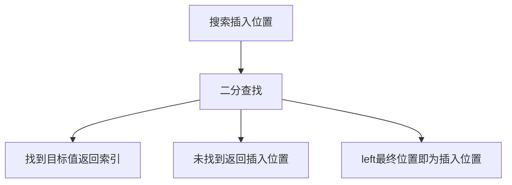
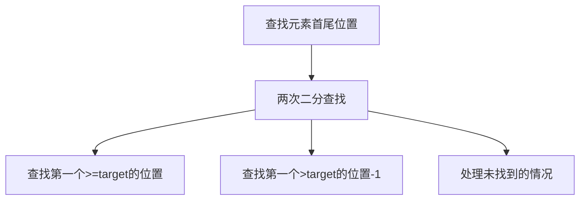
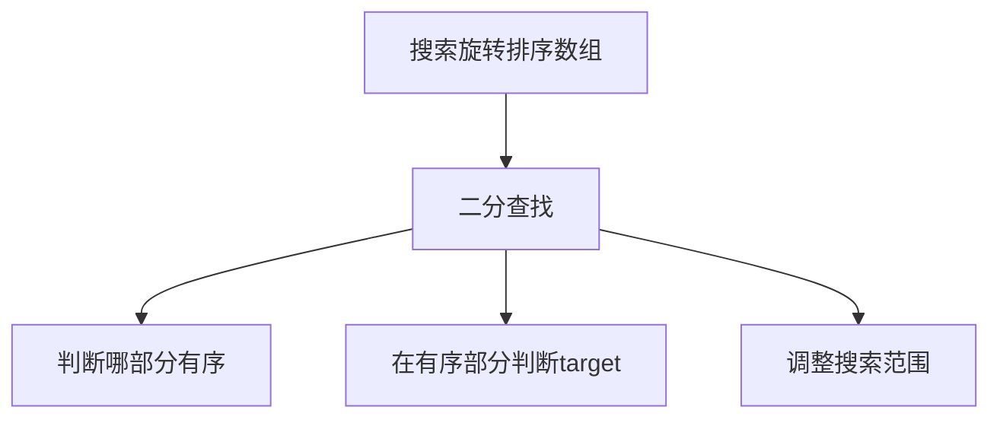
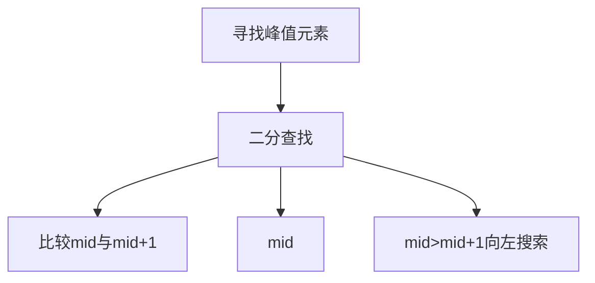
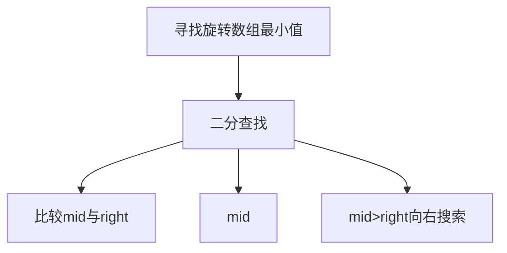
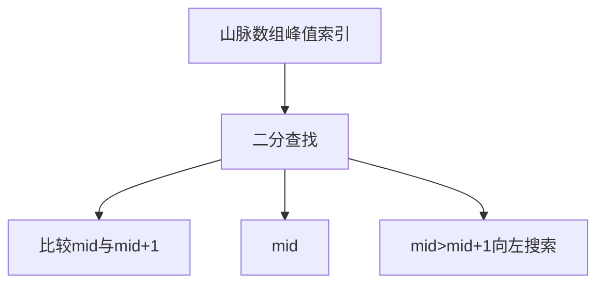

# 二分查找算法

二分查找（Binary Search）是一种在有序数组中查找特定元素的搜索算法。它通过将目标值与数组中间元素比较，每次比较后将搜索范围缩小一半，直到找到目标元素或搜索范围为空。

## 二分查找的基本概念

```mermaid
graph TD
    A[二分查找] --> B[前提条件]
    A --> C[基本思想]
    A --> D[时间复杂度]
    B --> E[数组必须有序]
    C --> F[每次缩小一半搜索范围]
    D --> G[O(log n)]
```

### 二分查找的前提条件

1. **数组必须有序**：二分查找只适用于有序数组
2. **支持随机访问**：需要能够通过索引直接访问元素

### 二分查找的基本思想

1. 设置左边界 `left` 和右边界 `right`
2. 计算中间位置 `mid = Math.floor((left + right) / 2)`
3. 比较目标值与中间元素：
   - 相等：找到目标，返回索引
   - 目标值较小：在左半部分继续查找
   - 目标值较大：在右半部分继续查找
4. 重复步骤2-3，直到找到目标或搜索范围为空

## 二分查找的实现

### 基本二分查找

```javascript
function binarySearch(nums, target) {
  let left = 0;
  let right = nums.length - 1;
  
  while (left <= right) {
    const mid = Math.floor((left + right) / 2);
    
    if (nums[mid] === target) {
      return mid;
    } else if (nums[mid] < target) {
      left = mid + 1;
    } else {
      right = mid - 1;
    }
  }
  
  return -1;  // 未找到目标元素
}
// 时间复杂度：O(log n)
// 空间复杂度：O(1)
```

### 递归实现

```javascript
function binarySearchRecursive(nums, target, left = 0, right = nums.length - 1) {
  if (left > right) {
    return -1;
  }
  
  const mid = Math.floor((left + right) / 2);
  
  if (nums[mid] === target) {
    return mid;
  } else if (nums[mid] < target) {
    return binarySearchRecursive(nums, target, mid + 1, right);
  } else {
    return binarySearchRecursive(nums, target, left, mid - 1);
  }
}
// 时间复杂度：O(log n)
// 空间复杂度：O(log n) - 递归调用栈
```

## 经典二分查找算法题详解

### 1. 搜索插入位置（Search Insert Position）

**题目描述**：给定一个排序数组和一个目标值，在数组中找到目标值，并返回其索引。如果目标值不存在于数组中，返回它将会被按顺序插入的位置。

**解题思路**：
- 使用二分查找
- 当未找到目标值时，返回应该插入的位置



```javascript
function searchInsert(nums, target) {
  let left = 0, right = nums.length - 1;
  
  while (left <= right) {
    const mid = Math.floor((left + right) / 2);
    
    if (nums[mid] === target) {
      return mid;
    } else if (nums[mid] < target) {
      left = mid + 1;
    } else {
      right = mid - 1;
    }
  }
  
  // left就是应该插入的位置
  return left;
}
// 时间复杂度：O(log n)
// 空间复杂度：O(1)
```

### 2. 在排序数组中查找元素的第一个和最后一个位置（Find First and Last Position of Element in Sorted Array）

**题目描述**：给定一个按照升序排列的整数数组 nums 和一个目标值 target，找出给定目标值在数组中的开始位置和结束位置。

**解题思路**：
- 使用两次二分查找
- 第一次查找第一个大于等于target的位置
- 第二次查找第一个大于target的位置，然后减1



```javascript
function searchRange(nums, target) {
  function findFirst(nums, target) {
    let left = 0, right = nums.length - 1;
    let index = -1;
    
    while (left <= right) {
      const mid = Math.floor((left + right) / 2);
      
      if (nums[mid] >= target) {
        if (nums[mid] === target) {
          index = mid;
        }
        right = mid - 1;
      } else {
        left = mid + 1;
      }
    }
    
    return index;
  }
  
  function findLast(nums, target) {
    let left = 0, right = nums.length - 1;
    let index = -1;
    
    while (left <= right) {
      const mid = Math.floor((left + right) / 2);
      
      if (nums[mid] <= target) {
        if (nums[mid] === target) {
          index = mid;
        }
        left = mid + 1;
      } else {
        right = mid - 1;
      }
    }
    
    return index;
  }
  
  const first = findFirst(nums, target);
  if (first === -1) {
    return [-1, -1];
  }
  
  const last = findLast(nums, target);
  return [first, last];
}
// 时间复杂度：O(log n)
// 空间复杂度：O(1)
```

### 3. 搜索旋转排序数组（Search in Rotated Sorted Array）

**题目描述**：整数数组 nums 按升序排列，数组中的值互不相同。在传递给函数之前，nums 在某个未知的下标 k 上进行了旋转。给你旋转后的数组 nums 和一个整数 target，如果 nums 中存在这个目标值 target，则返回它的下标，否则返回 -1。

**解题思路**：
- 使用二分查找
- 判断哪一部分是有序的
- 在有序部分判断target是否在范围内



```javascript
function search(nums, target) {
  let left = 0, right = nums.length - 1;
  
  while (left <= right) {
    const mid = Math.floor((left + right) / 2);
    
    if (nums[mid] === target) {
      return mid;
    }
    
    // 判断左半部分是否有序
    if (nums[left] <= nums[mid]) {
      // 左半部分有序
      if (nums[left] <= target && target < nums[mid]) {
        right = mid - 1;
      } else {
        left = mid + 1;
      }
    } else {
      // 右半部分有序
      if (nums[mid] < target && target <= nums[right]) {
        left = mid + 1;
      } else {
        right = mid - 1;
      }
    }
  }
  
  return -1;
}
// 时间复杂度：O(log n)
// 空间复杂度：O(1)
```

### 4. 寻找峰值元素（Find Peak Element）

**题目描述**：峰值元素是指其值严格大于左右相邻值的元素。给你一个整数数组 nums，找到峰值元素并返回其索引。数组可能包含多个峰值，在这种情况下，返回任何一个峰值所在位置即可。

**解题思路**：
- 使用二分查找
- 比较mid与mid+1的值
- 根据比较结果决定搜索方向



```javascript
function findPeakElement(nums) {
  let left = 0, right = nums.length - 1;
  
  while (left < right) {
    const mid = Math.floor((left + right) / 2);
    
    if (nums[mid] < nums[mid + 1]) {
      // 向右搜索
      left = mid + 1;
    } else {
      // 向左搜索
      right = mid;
    }
  }
  
  return left;
}
// 时间复杂度：O(log n)
// 空间复杂度：O(1)
```

### 5. 寻找旋转排序数组中的最小值（Find Minimum in Rotated Sorted Array）

**题目描述**：已知一个长度为 n 的数组，预先按照升序排列，经由 1 到 n 次旋转后，得到输入数组。请你找出并返回数组中的最小元素。

**解题思路**：
- 使用二分查找
- 比较mid与right的值
- 根据比较结果决定搜索方向



```javascript
function findMin(nums) {
  let left = 0, right = nums.length - 1;
  
  while (left < right) {
    const mid = Math.floor((left + right) / 2);
    
    if (nums[mid] < nums[right]) {
      // 最小值在左半部分（包括mid）
      right = mid;
    } else {
      // 最小值在右半部分
      left = mid + 1;
    }
  }
  
  return nums[left];
}
// 时间复杂度：O(log n)
// 空间复杂度：O(1)
```

### 6. 在排序数组中查找目标值的峰值（Peak Index in a Mountain Array）

**题目描述**：符合下列属性的数组 arr 称为山脉数组：arr.length >= 3，存在 i（0 < i < arr.length - 1）使得：arr[0] < arr[1] < ... arr[i-1] < arr[i]，arr[i] > arr[i+1] > ... > arr[arr.length - 1]。给你由整数数组 arr，返回任何满足条件的下标 i。

**解题思路**：
- 使用二分查找
- 比较mid与mid+1的值
- 根据比较结果决定搜索方向



```javascript
function peakIndexInMountainArray(arr) {
  let left = 0, right = arr.length - 1;
  
  while (left < right) {
    const mid = Math.floor((left + right) / 2);
    
    if (arr[mid] < arr[mid + 1]) {
      // 峰值在右半部分
      left = mid + 1;
    } else {
      // 峰值在左半部分（包括mid）
      right = mid;
    }
  }
  
  return left;
}
// 时间复杂度：O(log n)
// 空间复杂度：O(1)
```

### 7. 爱吃香蕉的珂珂（Koko Eating Bananas）

**题目描述**：珂珂喜欢吃香蕉。这里有 n 堆香蕉，第 i 堆中有 piles[i] 根香蕉。警卫已经离开了，将在 h 小时后回来。珂珂可以决定她吃香蕉的速度 k（单位：根/小时）。每个小时，她将会选择一堆香蕉，从中吃掉 k 根。如果这堆香蕉少于 k 根，她将吃掉这堆的所有香蕉，然后这一小时内不会再吃更多的香蕉。珂珂想在警卫回来前吃掉所有的香蕉。返回她可以在 h 小时内吃掉所有香蕉的最小速度 k（k 为整数）。

**解题思路**：
- 使用二分查找答案
- 速度的范围是[1, max(piles)]
- 对于每个速度，计算所需时间
- 根据时间与h的比较调整搜索范围

```mermaid
graph TD
    A[爱吃香蕉的珂珂] --> B[二分查找答案]
    B --> C[速度范围[1,max(piles)]]
    B --> D[计算所需时间]
    B --> E[时间<=h向左搜索]
    B --> F[时间>h向右搜索]
```

```javascript
function minEatingSpeed(piles, h) {
  let left = 1, right = Math.max(...piles);
  
  while (left < right) {
    const mid = Math.floor((left + right) / 2);
    const hours = calculateHours(piles, mid);
    
    if (hours <= h) {
      // 速度可以更慢
      right = mid;
    } else {
      // 速度需要更快
      left = mid + 1;
    }
  }
  
  return left;
}

function calculateHours(piles, speed) {
  let hours = 0;
  for (const pile of piles) {
    hours += Math.ceil(pile / speed);
  }
  return hours;
}
// 时间复杂度：O(n log(max(piles)))
// 空间复杂度：O(1)
```

### 8. 分割数组的最大值（Split Array Largest Sum）

**题目描述**：给定一个非负整数数组 nums 和一个整数 m，你需要将这个数组分成 m 个非空的连续子数组。设计一个算法使得这 m 个子数组各自和的最大值最小。

**解题思路**：
- 使用二分查找答案
- 答案的范围是[max(nums), sum(nums)]
- 对于每个答案，检查是否能分成m个子数组
- 根据检查结果调整搜索范围

```mermaid
graph TD
    A[分割数组最大值] --> B[二分查找答案]
    B --> C[答案范围[max,sum]]
    B --> D[检查能否分成m个子数组]
    B --> E[能分成<=m个向左搜索]
    B --> F[能分成>m个向右搜索]
```

```javascript
function splitArray(nums, m) {
  let left = Math.max(...nums);
  let right = nums.reduce((sum, num) => sum + num, 0);
  
  while (left < right) {
    const mid = Math.floor((left + right) / 2);
    const splits = calculateSplits(nums, mid);
    
    if (splits <= m) {
      // 可以分成更少的子数组，最大值可以更小
      right = mid;
    } else {
      // 需要分成更多的子数组，最大值需要更大
      left = mid + 1;
    }
  }
  
  return left;
}

function calculateSplits(nums, maxSum) {
  let splits = 1;
  let currentSum = 0;
  
  for (const num of nums) {
    if (currentSum + num > maxSum) {
      splits++;
      currentSum = num;
    } else {
      currentSum += num;
    }
  }
  
  return splits;
}
// 时间复杂度：O(n log(sum(nums)))
// 空间复杂度：O(1)
```

## 二分查找算法总结

二分查找相关算法是前端面试中的重要考点，主要考察点包括：

1. **基本实现**：掌握二分查找的迭代和递归实现
2. **边界处理**：正确处理各种边界条件
3. **变形应用**：理解二分查找在不同场景下的应用
4. **复杂度分析**：正确分析二分查找的时间和空间复杂度
5. **问题建模**：将实际问题抽象为二分查找模型

二分查找的适用场景：
- 在有序数组中查找元素
- 查找插入位置
- 查找边界位置
- 优化暴力搜索
- 查找峰值元素
- 搜索旋转数组

二分查找的关键点：
- 循环条件是 `left <= right` 还是 `left < right`
- mid 的计算方式
- 边界更新策略
- 返回值的处理

掌握这些核心思想和经典题目，能够帮助我们在面试中快速解决二分查找相关的算法问题。