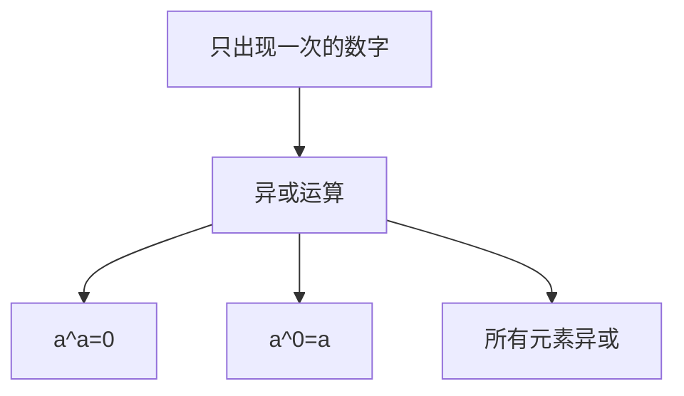
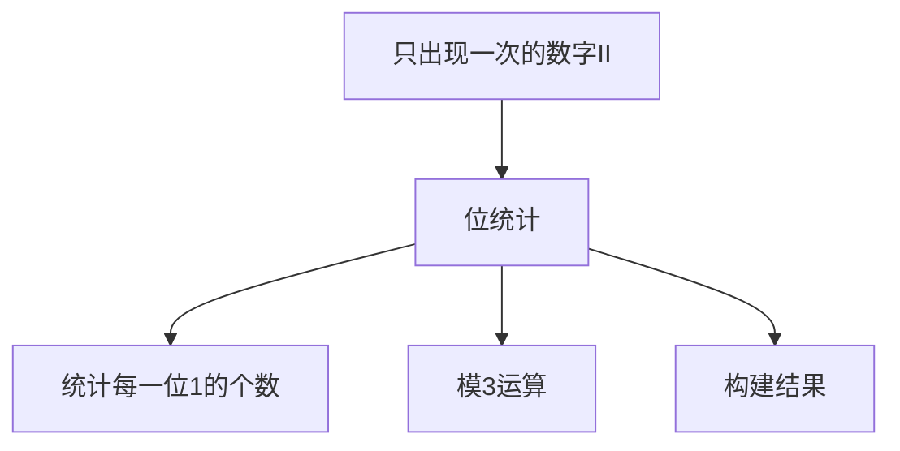
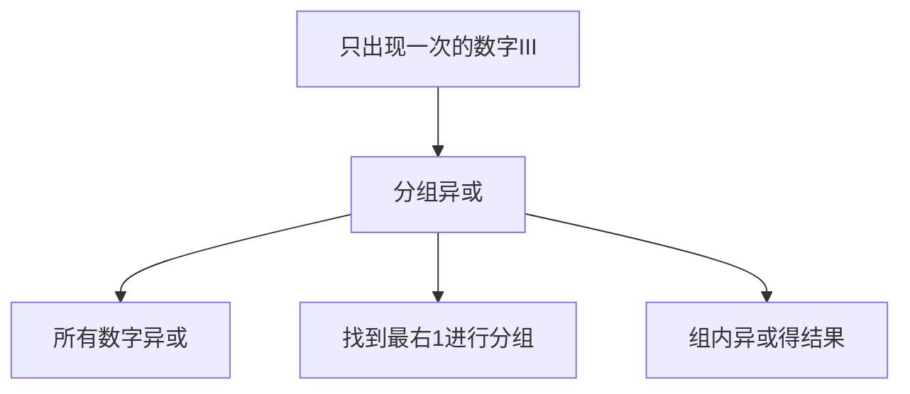
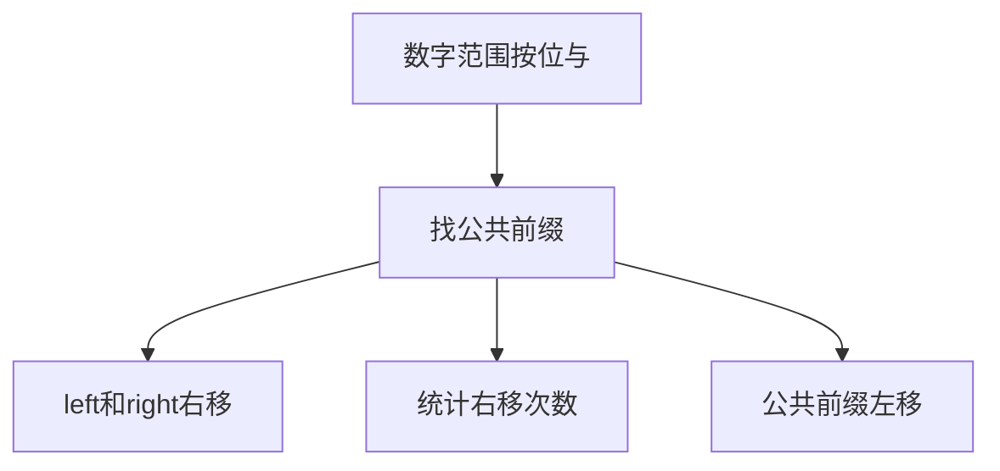
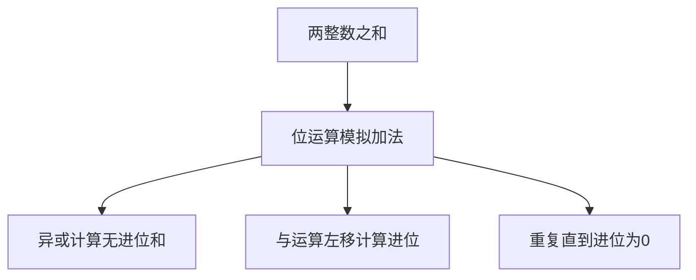
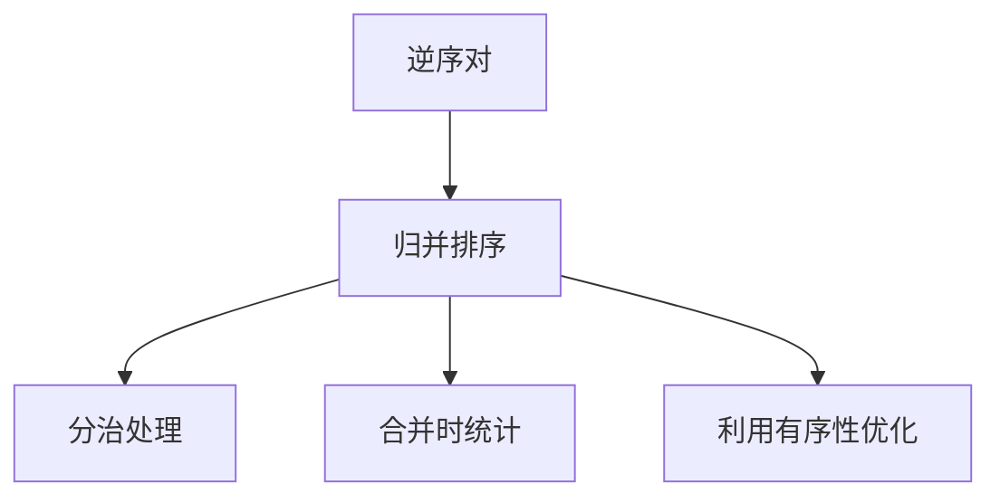

# 位运算相关算法

位运算是直接对整数在内存中的二进制位进行操作的运算。由于位运算直接在硬件层面上执行，通常比其他运算更快，因此在算法优化中经常使用。

## 位运算基础

```mermaid
graph TD
    A[位运算] --> B[按位与&]
    A --> C[按位或|]
    A --> D[按位异或^]
    A --> E[按位取反~]
    A --> F[左移<<]
    A --> G[右移>>]
    A --> H[无符号右移>>>]
```

### 基本位运算符

1. **按位与（&）**：两个位都为1时，结果才为1
2. **按位或（|）**：两个位有一个为1时，结果就为1
3. **按位异或（^）**：两个位不同时，结果为1；相同时结果为0
4. **按位取反（~）**：将每一位取反
5. **左移（<<）**：将二进制位向左移动指定位置，右边补0
6. **右移（>>）**：将二进制位向右移动指定位置，左边补符号位
7. **无符号右移（>>>）**：将二进制位向右移动指定位置，左边补0

### 位运算的性质

```mermaid
graph TD
    A[位运算性质] --> B[异或性质]
    A --> C[与或性质]
    B --> D[a^a=0]
    B --> E[a^0=a]
    B --> F[a^b^c=a^(b^c)]
    C --> G[a&a=a]
    C --> H[a|a=a]
```

1. **异或运算性质**：
   - a ^ a = 0
   - a ^ 0 = a
   - a ^ b = b ^ a
   - (a ^ b) ^ c = a ^ (b ^ c)

2. **与运算性质**：
   - a & a = a
   - a & 0 = 0
   - a & 1 = a

3. **或运算性质**：
   - a | a = a
   - a | 0 = a
   - a | 1 = 1

## 常用位运算技巧

### 1. 判断奇偶性

```javascript
// 判断奇偶性
function isOdd(n) {
  return (n & 1) === 1;
}

function isEven(n) {
  return (n & 1) === 0;
}
```

### 2. 交换两个数

```javascript
// 不使用额外变量交换两个数
function swap(a, b) {
  a = a ^ b;
  b = a ^ b;
  a = a ^ b;
  return [a, b];
}
```

### 3. 判断是否为2的幂

```javascript
// 判断是否为2的幂
function isPowerOfTwo(n) {
  return n > 0 && (n & (n - 1)) === 0;
}
```

### 4. 计算二进制中1的个数

```javascript
// 计算二进制中1的个数
function countOneBits(n) {
  let count = 0;
  while (n) {
    count += n & 1;
    n >>>= 1;
  }
  return count;
}

// 更高效的方法
function countOneBitsOptimized(n) {
  let count = 0;
  while (n) {
    n &= n - 1;  // 消除最右边的1
    count++;
  }
  return count;
}
```

## 经典位运算算法题详解

### 1. 只出现一次的数字（Single Number）

**题目描述**：给定一个非空整数数组，除了某个元素只出现一次以外，其余每个元素均出现两次。找出那个只出现了一次的元素。

**解题思路**：
- 利用异或运算的性质：a ^ a = 0, a ^ 0 = a
- 将所有元素进行异或运算，出现两次的元素会抵消为0，只出现一次的元素会保留



```javascript
function singleNumber(nums) {
  let result = 0;
  
  // 异或运算：a ^ a = 0, a ^ 0 = a
  for (const num of nums) {
    result ^= num;
  }
  
  return result;
}
// 时间复杂度：O(n)
// 空间复杂度：O(1)
```

### 2. 只出现一次的数字 II（Single Number II）

**题目描述**：给你一个整数数组 nums ，除某个元素仅出现一次外，其余每个元素都恰出现三次。请你找出并返回那个只出现了一次的元素。

**解题思路**：
- 使用位运算统计每一位上1出现的次数
- 对于每一位，如果1出现的次数不是3的倍数，则只出现一次的数字在该位上为1



```javascript
function singleNumber(nums) {
  let ones = 0, twos = 0;
  
  for (const num of nums) {
    // ones记录二进制位上1出现1次的数字
    // twos记录二进制位上1出现2次的数字
    ones = (ones ^ num) & ~twos;
    twos = (twos ^ num) & ~ones;
  }
  
  return ones;
}
// 时间复杂度：O(n)
// 空间复杂度：O(1)
```

### 3. 只出现一次的数字 III（Single Number III）

**题目描述**：给定一个整数数组 nums，其中恰好有两个元素只出现一次，其余所有元素均出现两次。找出只出现一次的那两个元素。

**解题思路**：
- 先对所有数字异或，得到两个只出现一次数字的异或结果
- 找到异或结果中最右边的1，根据该位将数组分为两组
- 对每组分别异或，得到两个只出现一次的数字



```javascript
function singleNumber(nums) {
  // 所有数字异或，得到两个只出现一次数字的异或结果
  let xor = 0;
  for (const num of nums) {
    xor ^= num;
  }
  
  // 找到最右边的1
  const rightMostBit = xor & (-xor);
  
  // 根据最右边的1将数组分为两组
  let num1 = 0, num2 = 0;
  for (const num of nums) {
    if (num & rightMostBit) {
      num1 ^= num;
    } else {
      num2 ^= num;
    }
  }
  
  return [num1, num2];
}
// 时间复杂度：O(n)
// 空间复杂度：O(1)
```

### 4. 比特位计数（Counting Bits）

**题目描述**：给定一个整数 n ，对于 0 <= i <= n 中的每个 i ，计算其二进制表示中 1 的个数，返回一个长度为 n + 1 的数组 ans 作为答案。

**解题思路**：
- 动态规划：dp[i] = dp[i >> 1] + (i & 1)
- i >> 1 表示 i 除以 2，i & 1 表示 i 的最低位是否为 1

```mermaid
graph TD
    A[比特位计数] --> B[动态规划]
    B --> C[dp[i]=dp[i>>1]+(i&1)]
    B --> D[右移一位+最低位]
```

```javascript
function countBits(n) {
  const dp = new Array(n + 1).fill(0);
  
  for (let i = 1; i <= n; i++) {
    // dp[i] = dp[i >> 1] + (i & 1)
    // i >> 1 表示 i 除以 2
    // i & 1 表示 i 的最低位是否为 1
    dp[i] = dp[i >> 1] + (i & 1);
  }
  
  return dp;
}
// 时间复杂度：O(n)
// 空间复杂度：O(1) 不考虑输出数组
```

### 5. 数字范围按位与（Bitwise AND of Numbers Range）

**题目描述**：给你两个整数 left 和 right ，表示区间 [left, right] ，返回此区间内所有数字按位与的结果。

**解题思路**：
- 找到left和right的公共前缀
- 公共前缀后面的部分在按位与运算中都会变成0



```javascript
function rangeBitwiseAnd(left, right) {
  let shift = 0;
  
  // 找到left和right的公共前缀
  while (left !== right) {
    left >>= 1;
    right >>= 1;
    shift++;
  }
  
  // 将公共前缀左移shift位
  return left << shift;
}
// 时间复杂度：O(log n)
// 空间复杂度：O(1)
```

### 6. 两整数之和（Sum of Two Integers）

**题目描述**：给你两个整数 a 和 b ，不使用运算符 + 和 - ，计算并返回两整数之和。

**解题思路**：
- 使用异或运算计算不考虑进位的和
- 使用与运算和左移计算进位
- 重复上述过程直到进位为0



```javascript
function getSum(a, b) {
  while (b !== 0) {
    // 计算进位
    const carry = (a & b) << 1;
    
    // 计算不考虑进位的和
    a = a ^ b;
    
    // 将进位赋给b，继续下一轮计算
    b = carry;
  }
  
  return a;
}
// 时间复杂度：O(1)
// 空间复杂度：O(1)
```

### 7. 位1的个数（Number of 1 Bits）

**题目描述**：编写一个函数，输入是一个无符号整数（以二进制串的形式），返回其二进制表达式中数字位数为 '1' 的个数（也被称为汉明重量）。

**解题思路**：
- 方法一：逐位检查
- 方法二：使用 n & (n-1) 消除最右边的1

```mermaid
graph TD
    A[位1的个数] --> B[方法一:逐位检查]
    A --> C[方法二:n&(n-1)]
    B --> D[检查每一位是否为1]
    C --> E[消除最右边的1]
```

```javascript
// 方法一：逐位检查
function hammingWeight(n) {
  let count = 0;
  for (let i = 0; i < 32; i++) {
    count += (n >> i) & 1;
  }
  return count;
}
// 时间复杂度：O(1)
// 空间复杂度：O(1)

// 方法二：使用 n & (n-1)
function hammingWeightOptimized(n) {
  let count = 0;
  while (n) {
    n &= n - 1;  // 消除最右边的1
    count++;
  }
  return count;
}
// 时间复杂度：O(k) k为1的个数
// 空间复杂度：O(1)
```

### 8. 逆序对（Reverse Pairs）

**题目描述**：给定一个数组 nums ，如果 i < j 且 nums[i] > 2*nums[j] 我们将 (i, j) 称作一个重要翻转对。你需要返回给定数组中的重要翻转对的数量。

**解题思路**：
- 使用归并排序的思想
- 在归并过程中统计翻转对
- 利用有序性优化统计过程



```javascript
function reversePairs(nums) {
  return mergeSort(nums, 0, nums.length - 1);
}

function mergeSort(nums, left, right) {
  if (left >= right) return 0;
  
  const mid = Math.floor((left + right) / 2);
  let count = mergeSort(nums, left, mid) + mergeSort(nums, mid + 1, right);
  
  // 统计翻转对
  let j = mid + 1;
  for (let i = left; i <= mid; i++) {
    while (j <= right && nums[i] > 2 * nums[j]) {
      j++;
    }
    count += j - (mid + 1);
  }
  
  // 合并两个有序数组
  const temp = [];
  let i = left, k = mid + 1;
  
  while (i <= mid && k <= right) {
    if (nums[i] <= nums[k]) {
      temp.push(nums[i++]);
    } else {
      temp.push(nums[k++]);
    }
  }
  
  while (i <= mid) temp.push(nums[i++]);
  while (k <= right) temp.push(nums[k++]);
  
  // 将排序后的数组复制回原数组
  for (let i = 0; i < temp.length; i++) {
    nums[left + i] = temp[i];
  }
  
  return count;
}
// 时间复杂度：O(n log n)
// 空间复杂度：O(n)
```

## 位运算算法总结

位运算相关算法是前端面试中的重要考点，主要考察点包括：

1. **基本运算符**：掌握各种位运算符的含义和用法
2. **运算性质**：理解异或、与、或运算的性质
3. **常用技巧**：掌握位运算的常用技巧和优化方法
4. **实际应用**：理解位运算在算法优化中的应用
5. **复杂度分析**：正确分析位运算算法的时间和空间复杂度

位运算的应用场景：
- 状态压缩和状态枚举
- 数字特征判断（奇偶性、幂次等）
- 加解密算法
- 哈希算法
- 图论算法中的状态表示
- 优化算法性能

位运算的优化技巧：
- 使用异或进行交换和去重
- 使用位运算判断数字特征
- 使用位运算模拟加减法
- 使用位运算优化动态规划状态

掌握这些核心思想和经典题目，能够帮助我们在面试中快速解决位运算相关的算法问题。