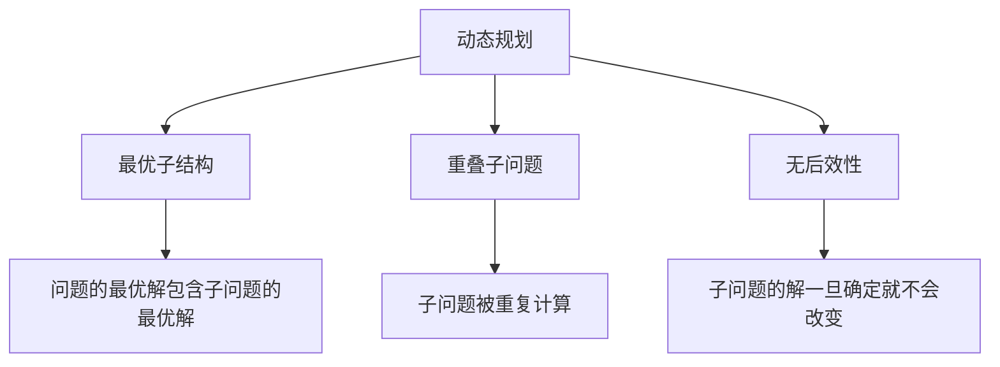
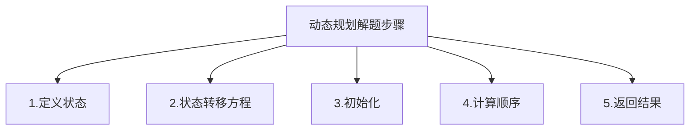

# 动态规划算法

动态规划是一种通过把原问题分解为相对简单的子问题的方式求解复杂问题的方法。动态规划常常适用于有重叠子问题和最优子结构性质的问题。

## 动态规划的基本概念



### 最优子结构

如果问题的最优解所包含的子问题的解也是最优的，我们就称该问题具有最优子结构性质。

### 重叠子问题

在求解过程中，很多子问题被重复计算，可以使用记忆化或表格法来优化。

### 无后效性

某阶段状态一旦确定，则此后过程的演变不再受此前各种状态及决策的影响。

## 动态规划的解题步骤



1. **定义状态**：明确dp数组的含义
2. **状态转移方程**：找出状态之间的关系
3. **初始化**：确定初始状态的值
4. **计算顺序**：确定状态计算的顺序
5. **返回结果**：确定最终答案的位置

## 经典动态规划算法题详解

### 1. 爬楼梯（Climbing Stairs）

**题目描述**：假设你正在爬楼梯。需要 n 阶你才能到达楼顶。每次你可以爬 1 或 2 个台阶。你有多少种不同的方法可以爬到楼顶呢？

**解题思路**：
- 状态定义：dp[i] 表示到达第 i 阶楼梯的方法数
- 状态转移方程：dp[i] = dp[i-1] + dp[i-2]
- 初始化：dp[1] = 1, dp[2] = 2

```mermaid
graph TD
    A[爬楼梯] --> B[状态定义:dp[i]表示到第i阶的方法数]
    B --> C[转移方程:dp[i]=dp[i-1]+dp[i-2]]
    B --> D[初始化:dp[1]=1,dp[2]=2]
    B --> E[结果:dp[n]]
```

```javascript
// 基础动态规划解法
function climbStairsDP(n) {
  if (n <= 2) return n;
  
  const dp = new Array(n + 1);
  dp[1] = 1;
  dp[2] = 2;
  
  for (let i = 3; i <= n; i++) {
    dp[i] = dp[i - 1] + dp[i - 2];
  }
  
  return dp[n];
}
// 时间复杂度：O(n)
// 空间复杂度：O(n)

// 空间优化版本
function climbStairsOptimized(n) {
  if (n <= 2) return n;
  
  let prev2 = 1, prev1 = 2;
  
  for (let i = 3; i <= n; i++) {
    const current = prev1 + prev2;
    prev2 = prev1;
    prev1 = current;
  }
  
  return prev1;
}
// 时间复杂度：O(n)
// 空间复杂度：O(1)
```

### 2. 不同路径（Unique Paths）

**题目描述**：一个机器人位于一个 m x n 网格的左上角。机器人每次只能向下或者向右移动一步。机器人试图达到网格的右下角。问总共有多少条不同的路径？

**解题思路**：
- 状态定义：dp[i][j] 表示到达位置(i,j)的路径数
- 状态转移方程：dp[i][j] = dp[i-1][j] + dp[i][j-1]
- 初始化：第一行和第一列都为1

```mermaid
graph TD
    A[不同路径] --> B[状态定义:dp[i][j]表示到(i,j)的路径数]
    B --> C[转移方程:dp[i][j]=dp[i-1][j]+dp[i][j-1]]
    B --> D[初始化:第一行和第一列都为1]
    B --> E[结果:dp[m-1][n-1]]
```

```javascript
// 二维DP解法
function uniquePaths(m, n) {
  const dp = Array(m).fill().map(() => Array(n).fill(0));
  
  // 初始化第一行和第一列
  for (let i = 0; i < m; i++) dp[i][0] = 1;
  for (let j = 0; j < n; j++) dp[0][j] = 1;
  
  // 填充DP表
  for (let i = 1; i < m; i++) {
    for (let j = 1; j < n; j++) {
      dp[i][j] = dp[i-1][j] + dp[i][j-1];
    }
  }
  
  return dp[m-1][n-1];
}
// 时间复杂度：O(m×n)
// 空间复杂度：O(m×n)

// 空间优化版本
function uniquePathsOptimized(m, n) {
  const dp = Array(n).fill(1);
  
  for (let i = 1; i < m; i++) {
    for (let j = 1; j < n; j++) {
      dp[j] = dp[j] + dp[j-1];
    }
  }
  
  return dp[n-1];
}
// 时间复杂度：O(m×n)
// 空间复杂度：O(n)
```

### 3. 最长递增子序列（Longest Increasing Subsequence）

**题目描述**：给你一个整数数组 nums ，找到其中最长严格递增子序列的长度。

**解题思路**：
- 方法一：动态规划，时间复杂度O(n²)
- 方法二：二分查找优化，时间复杂度O(n log n)

```mermaid
graph TD
    A[最长递增子序列] --> B[方法一:DP O(n²)]
    A --> C[方法二:二分查找 O(n log n)]
    B --> D[dp[i]表示以nums[i]结尾的LIS长度]
    C --> E[维护递增数组]
    C --> F[二分查找插入位置]
```

```javascript
// 方法一：动态规划
function lengthOfLISDP(nums) {
  if (nums.length === 0) return 0;
  
  const dp = Array(nums.length).fill(1);
  let maxLen = 1;
  
  for (let i = 1; i < nums.length; i++) {
    for (let j = 0; j < i; j++) {
      if (nums[j] < nums[i]) {
        dp[i] = Math.max(dp[i], dp[j] + 1);
      }
    }
    maxLen = Math.max(maxLen, dp[i]);
  }
  
  return maxLen;
}
// 时间复杂度：O(n²)
// 空间复杂度：O(n)

// 方法二：二分查找优化
function lengthOfLISBinarySearch(nums) {
  const tails = [];  // tails[i]表示长度为i+1的递增子序列的最小尾部元素
  
  for (const num of nums) {
    let left = 0, right = tails.length;
    
    // 二分查找插入位置
    while (left < right) {
      const mid = Math.floor((left + right) / 2);
      if (tails[mid] < num) {
        left = mid + 1;
      } else {
        right = mid;
      }
    }
    
    // 如果left等于tails长度，说明num比所有元素都大，直接添加
    if (left === tails.length) {
      tails.push(num);
    } else {
      // 否则替换找到位置的元素
      tails[left] = num;
    }
  }
  
  return tails.length;
}
// 时间复杂度：O(n log n)
// 空间复杂度：O(n)
```

### 4. 零钱兑换（Coin Change）

**题目描述**：给你一个整数数组 coins ，表示不同面额的硬币；以及一个整数 amount ，表示总金额。计算并返回可以凑成总金额所需的最少的硬币个数。如果没有任何一种硬币组合能组成总金额，返回 -1 。

**解题思路**：
- 状态定义：dp[i] 表示凑成金额 i 所需的最少硬币数
- 状态转移方程：dp[i] = min(dp[i], dp[i-coin] + 1) for each coin
- 初始化：dp[0] = 0，其余初始化为无穷大

```mermaid
graph TD
    A[零钱兑换] --> B[状态定义:dp[i]表示凑成金额i的最少硬币数]
    B --> C[转移方程:dp[i]=min(dp[i],dp[i-coin]+1)]
    B --> D[初始化:dp[0]=0,其余为Infinity]
    B --> E[结果:dp[amount]或-1]
```

```javascript
function coinChange(coins, amount) {
  // dp[i] 表示凑成金额 i 所需的最少硬币数
  const dp = Array(amount + 1).fill(Infinity);
  dp[0] = 0;  // 凑成金额0需要0个硬币
  
  // 遍历每个金额
  for (let i = 1; i <= amount; i++) {
    // 尝试每种硬币
    for (const coin of coins) {
      if (coin <= i) {
        dp[i] = Math.min(dp[i], dp[i - coin] + 1);
      }
    }
  }
  
  return dp[amount] === Infinity ? -1 : dp[amount];
}
// 时间复杂度：O(amount × coins.length)
// 空间复杂度：O(amount)
```

### 5. 编辑距离（Edit Distance）

**题目描述**：给你两个单词 word1 和 word2， 请返回将 word1 转换成 word2 所使用的最少操作数。你可以对一个单词进行插入、删除或替换操作。

**解题思路**：
- 状态定义：dp[i][j] 表示 word1 的前 i 个字符转换成 word2 的前 j 个字符的最少操作数
- 状态转移方程：
  - 如果 word1[i-1] == word2[j-1]，则 dp[i][j] = dp[i-1][j-1]
  - 否则 dp[i][j] = min(dp[i-1][j], dp[i][j-1], dp[i-1][j-1]) + 1

```mermaid
graph TD
    A[编辑距离] --> B[状态定义:dp[i][j]表示word1前i字符转word2前j字符的最少操作数]
    B --> C[转移方程:字符相等时dp[i][j]=dp[i-1][j-1]]
    B --> D[转移方程:字符不等时取三种操作的最小值+1]
    B --> E[初始化:第一行和第一列]
    B --> F[结果:dp[m][n]]
```

```javascript
function minDistance(word1, word2) {
  const m = word1.length;
  const n = word2.length;
  
  // dp[i][j] 表示 word1 的前 i 个字符转换成 word2 的前 j 个字符的最少操作数
  const dp = Array(m + 1).fill().map(() => Array(n + 1).fill(0));
  
  // 初始化
  for (let i = 0; i <= m; i++) dp[i][0] = i;  // 删除操作
  for (let j = 0; j <= n; j++) dp[0][j] = j;  // 插入操作
  
  // 填充DP表
  for (let i = 1; i <= m; i++) {
    for (let j = 1; j <= n; j++) {
      if (word1[i-1] === word2[j-1]) {
        dp[i][j] = dp[i-1][j-1];  // 字符相同，不需要操作
      } else {
        dp[i][j] = Math.min(
          dp[i-1][j] + 1,    // 删除
          dp[i][j-1] + 1,    // 插入
          dp[i-1][j-1] + 1   // 替换
        );
      }
    }
  }
  
  return dp[m][n];
}
// 时间复杂度：O(m×n)
// 空间复杂度：O(m×n)
```

### 6. 最大子数组和（Maximum Subarray）

**题目描述**：给你一个整数数组 nums ，请你找出一个具有最大和的连续子数组（子数组最少包含一个元素），返回其最大和。

**解题思路**：
- 状态定义：dp[i] 表示以 nums[i] 结尾的连续子数组的最大和
- 状态转移方程：dp[i] = max(nums[i], dp[i-1] + nums[i])
- 结果：所有 dp[i] 中的最大值

```mermaid
graph TD
    A[最大子数组和] --> B[状态定义:dp[i]表示以nums[i]结尾的子数组最大和]
    B --> C[转移方程:dp[i]=max(nums[i],dp[i-1]+nums[i])]
    B --> D[初始化:dp[0]=nums[0]]
    B --> E[结果:max(dp[i])]
```

```javascript
// 动态规划解法
function maxSubArrayDP(nums) {
  const dp = Array(nums.length).fill(0);
  dp[0] = nums[0];
  let maxSum = dp[0];
  
  for (let i = 1; i < nums.length; i++) {
    dp[i] = Math.max(nums[i], dp[i-1] + nums[i]);
    maxSum = Math.max(maxSum, dp[i]);
  }
  
  return maxSum;
}
// 时间复杂度：O(n)
// 空间复杂度：O(n)

// 空间优化版本（Kadane算法）
function maxSubArrayOptimized(nums) {
  let maxSum = nums[0];
  let currentSum = nums[0];
  
  for (let i = 1; i < nums.length; i++) {
    currentSum = Math.max(nums[i], currentSum + nums[i]);
    maxSum = Math.max(maxSum, currentSum);
  }
  
  return maxSum;
}
// 时间复杂度：O(n)
// 空间复杂度：O(1)
```

### 7. 打家劫舍（House Robber）

**题目描述**：你是一个专业的小偷，计划偷窃沿街的房屋。每间房内都藏有一定的现金，影响你偷窃的唯一制约因素就是相邻的房屋装有相互连通的防盗系统，如果两间相邻的房屋在同一晚上被小偷闯入，系统会自动报警。给定一个代表每个房屋存放金额的非负整数数组，计算你不触动警报装置的情况下，一夜之内能够偷窃到的最高金额。

**解题思路**：
- 状态定义：dp[i] 表示偷窃前 i 个房屋能获得的最高金额
- 状态转移方程：dp[i] = max(dp[i-1], dp[i-2] + nums[i-1])
- 初始化：dp[0] = 0, dp[1] = nums[0]

```mermaid
graph TD
    A[打家劫舍] --> B[状态定义:dp[i]表示偷窃前i个房屋的最高金额]
    B --> C[转移方程:dp[i]=max(dp[i-1],dp[i-2]+nums[i-1])]
    B --> D[初始化:dp[0]=0,dp[1]=nums[0]]
    B --> E[结果:dp[n]]
```

```javascript
function rob(nums) {
  if (nums.length === 0) return 0;
  if (nums.length === 1) return nums[0];
  
  const dp = Array(nums.length + 1).fill(0);
  dp[0] = 0;
  dp[1] = nums[0];
  
  for (let i = 2; i <= nums.length; i++) {
    dp[i] = Math.max(dp[i-1], dp[i-2] + nums[i-1]);
  }
  
  return dp[nums.length];
}
// 时间复杂度：O(n)
// 空间复杂度：O(n)

// 空间优化版本
function robOptimized(nums) {
  if (nums.length === 0) return 0;
  if (nums.length === 1) return nums[0];
  
  let prev2 = 0;  // dp[i-2]
  let prev1 = nums[0];  // dp[i-1]
  
  for (let i = 1; i < nums.length; i++) {
    const current = Math.max(prev1, prev2 + nums[i]);
    prev2 = prev1;
    prev1 = current;
  }
  
  return prev1;
}
// 时间复杂度：O(n)
// 空间复杂度：O(1)
```

## 动态规划算法总结

动态规划是算法面试中的重点和难点，主要考察点包括：

1. **状态定义**：能够正确地定义dp数组的含义
2. **状态转移**：找出状态之间的递推关系
3. **边界处理**：正确处理初始状态和边界条件
4. **空间优化**：在可能的情况下优化空间复杂度
5. **问题建模**：将实际问题抽象为动态规划模型

掌握这些核心思想和经典题目，能够帮助我们在面试中快速解决动态规划相关的算法问题。