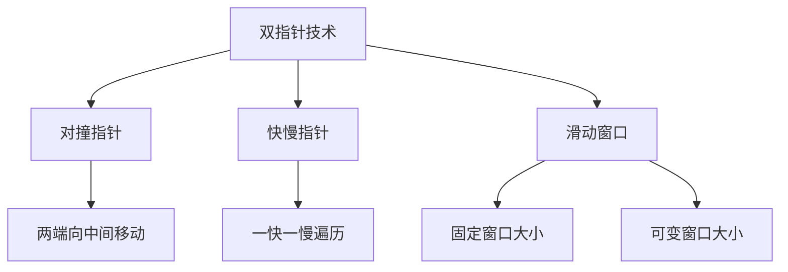
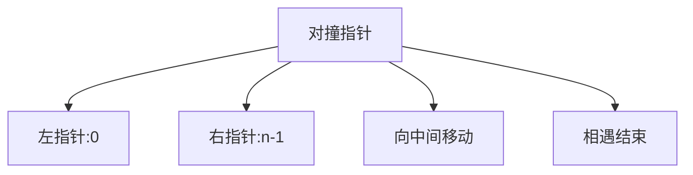
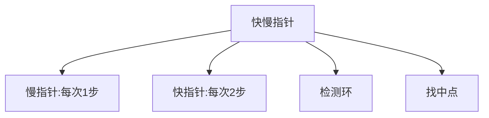
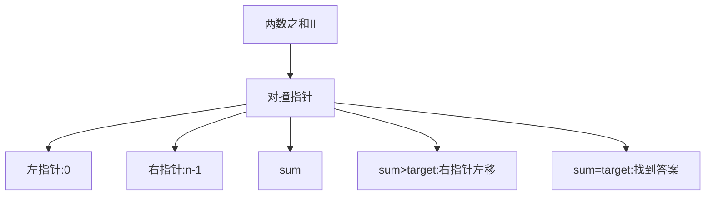
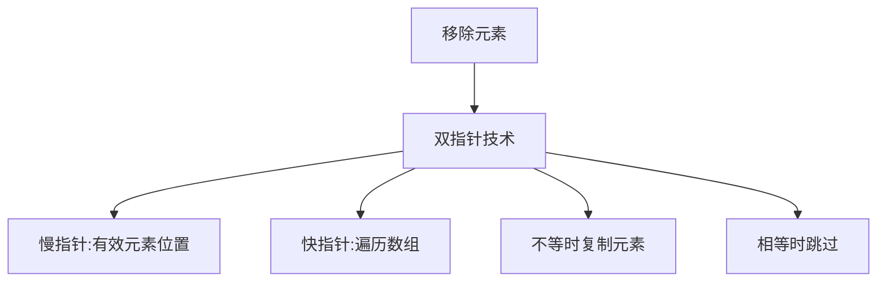
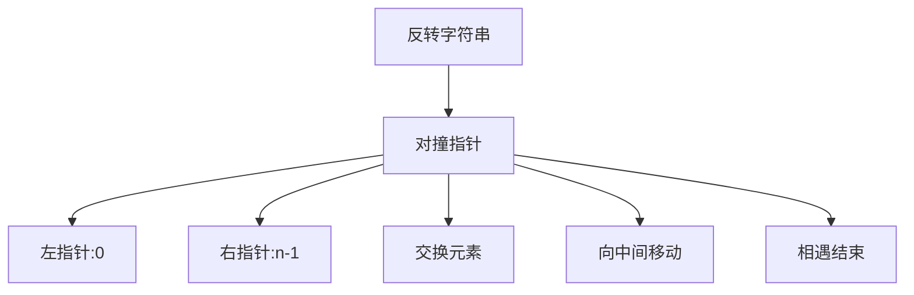
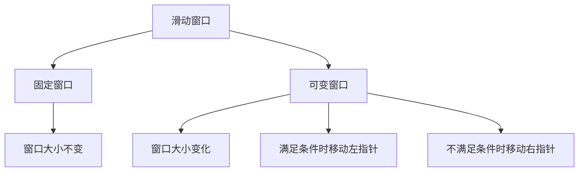
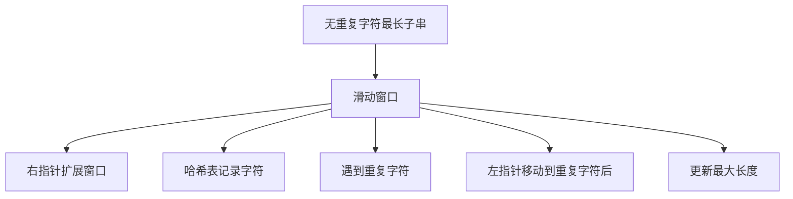
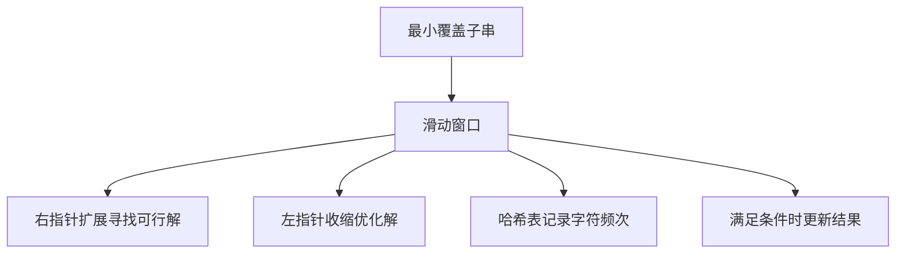
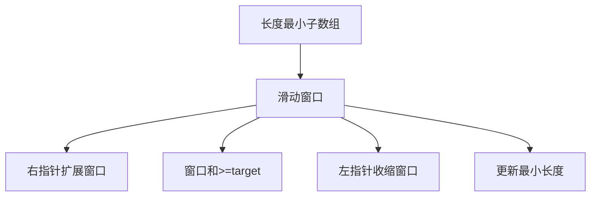

# 双指针与滑动窗口算法

双指针技术是一种重要的算法思想，常用于数组和链表问题中。滑动窗口是双指针技术的扩展，常用于解决子数组或子字符串问题。

## 双指针技术

双指针技术是指在解决问题时使用两个指针协同工作，通常用于线性数据结构如数组、链表等。



### 对撞指针（相向双指针）

两个指针从两端向中间移动，常用于有序数组中查找元素。



### 快慢指针（同向双指针）

两个指针从同一端开始，以不同速度移动，常用于链表问题。



## 经典双指针算法题详解

### 1. 两数之和 II - 输入有序数组（Two Sum II - Input Array Is Sorted）

**题目描述**：给定一个下标从 1 开始的整数数组 numbers ，已按非递减顺序排列，请你从数组中找出满足相加之和等于目标数 target 的两个数。

**解题思路**：
- 使用对撞指针技术
- 左指针指向数组开始，右指针指向数组末尾
- 根据两数之和与目标值的比较移动指针



```javascript
function twoSum(numbers, target) {
  let left = 0, right = numbers.length - 1;
  
  while (left < right) {
    const sum = numbers[left] + numbers[right];
    if (sum === target) {
      return [left + 1, right + 1]; // 返回1-indexed
    } else if (sum < target) {
      left++;
    } else {
      right--;
    }
  }
  
  return [];
}
// 时间复杂度：O(n)
// 空间复杂度：O(1)
```

### 2. 移除元素（Remove Element）

**题目描述**：给你一个数组 nums 和一个值 val，你需要原地移除所有数值等于 val 的元素，并返回移除后数组的新长度。

**解题思路**：
- 使用双指针技术
- 快指针遍历数组，慢指针指向下一个有效元素的位置
- 当快指针遇到不等于 val 的元素时，复制到慢指针位置



```javascript
function removeElement(nums, val) {
  let slow = 0;
  
  for (let fast = 0; fast < nums.length; fast++) {
    if (nums[fast] !== val) {
      nums[slow] = nums[fast];
      slow++;
    }
  }
  
  return slow;
}
// 时间复杂度：O(n)
// 空间复杂度：O(1)
```

### 3. 反转字符串（Reverse String）

**题目描述**：编写一个函数，其作用是将输入的字符串反转过来。输入字符串以字符数组 s 的形式给出。

**解题思路**：
- 使用对撞指针技术
- 左指针指向数组开始，右指针指向数组末尾
- 交换两个指针指向的元素，然后向中间移动



```javascript
function reverseString(s) {
  let left = 0, right = s.length - 1;
  
  while (left < right) {
    [s[left], s[right]] = [s[right], s[left]];
    left++;
    right--;
  }
}
// 时间复杂度：O(n)
// 空间复杂度：O(1)
```

## 滑动窗口算法

滑动窗口是一种基于双指针的技术，主要用于解决数组/字符串中满足特定条件的连续子数组/子字符串问题。



### 滑动窗口的基本思路

1. **扩展窗口**：移动右指针，扩展窗口直到满足条件
2. **收缩窗口**：移动左指针，收缩窗口直到不满足条件
3. **更新结果**：在满足条件时更新最优解

## 经典滑动窗口算法题详解

### 1. 无重复字符的最长子串（Longest Substring Without Repeating Characters）

**题目描述**：给定一个字符串 s ，请你找出其中不含有重复字符的最长子串的长度。

**解题思路**：
- 使用滑动窗口技术
- 用哈希表记录字符出现的位置
- 当遇到重复字符时，移动左指针到重复字符的下一个位置



```javascript
function lengthOfLongestSubstring(s) {
  const map = new Map();  // 记录字符最后出现的位置
  let left = 0, maxLength = 0;
  
  for (let right = 0; right < s.length; right++) {
    const char = s[right];
    
    // 如果字符已存在且在窗口内，移动左指针
    if (map.has(char) && map.get(char) >= left) {
      left = map.get(char) + 1;
    }
    
    // 更新字符位置
    map.set(char, right);
    
    // 更新最大长度
    maxLength = Math.max(maxLength, right - left + 1);
  }
  
  return maxLength;
}
// 时间复杂度：O(n)
// 空间复杂度：O(min(m,n))，m为字符集大小
```

### 2. 最小覆盖子串（Minimum Window Substring）

**题目描述**：给你一个字符串 s 、一个字符串 t 。返回 s 中涵盖 t 所有字符的最小子串。如果 s 中不存在涵盖 t 所有字符的子串，则返回空字符串 "" 。

**解题思路**：
- 使用滑动窗口技术
- 用哈希表记录目标字符串中每个字符的频次
- 扩展右指针直到窗口包含所有目标字符
- 收缩左指针直到窗口不再满足条件，过程中更新最小窗口



```javascript
function minWindow(s, t) {
  if (s.length === 0 || t.length === 0) return "";
  
  // 统计目标字符串中每个字符的频次
  const targetCount = new Map();
  for (const char of t) {
    targetCount.set(char, (targetCount.get(char) || 0) + 1);
  }
  
  let left = 0, right = 0;
  let formed = 0;  // 窗口中满足频次要求的字符数
  const windowCount = new Map();  // 窗口中每个字符的频次
  
  // 结果记录
  let ans = [Infinity, 0, 0];  // [length, left, right]
  
  while (right < s.length) {
    // 扩展窗口
    const char = s[right];
    windowCount.set(char, (windowCount.get(char) || 0) + 1);
    
    // 如果当前字符的频次满足要求，增加formed计数
    if (targetCount.has(char) && windowCount.get(char) === targetCount.get(char)) {
      formed++;
    }
    
    // 尝试收缩窗口
    while (left <= right && formed === targetCount.size) {
      char = s[left];
      
      // 更新结果
      if (right - left + 1 < ans[0]) {
        ans = [right - left + 1, left, right];
      }
      
      // 移动左指针
      windowCount.set(char, windowCount.get(char) - 1);
      if (targetCount.has(char) && windowCount.get(char) < targetCount.get(char)) {
        formed--;
      }
      
      left++;
    }
    
    right++;
  }
  
  return ans[0] === Infinity ? "" : s.substring(ans[1], ans[2] + 1);
}
// 时间复杂度：O(|s| + |t|)
// 空间复杂度：O(|s| + |t|)
```

### 3. 长度最小的子数组（Minimum Size Subarray Sum）

**题目描述**：给定一个含有 n 个正整数的数组和一个正整数 target 。找出该数组中满足其和 ≥ target 的长度最小的连续子数组，并返回其长度。如果不存在符合条件的子数组，返回 0 。

**解题思路**：
- 使用滑动窗口技术
- 扩展右指针直到窗口和满足条件
- 收缩左指针直到窗口和不满足条件，过程中更新最小长度



```javascript
function minSubArrayLen(target, nums) {
  let left = 0, sum = 0, minLength = Infinity;
  
  for (let right = 0; right < nums.length; right++) {
    sum += nums[right];
    
    // 当窗口和满足条件时，尝试收缩窗口
    while (sum >= target) {
      minLength = Math.min(minLength, right - left + 1);
      sum -= nums[left];
      left++;
    }
  }
  
  return minLength === Infinity ? 0 : minLength;
}
// 时间复杂度：O(n)
// 空间复杂度：O(1)
```

### 4. 找到字符串中所有字母异位词（Find All Anagrams in a String）

**题目描述**：给定两个字符串 s 和 p，找到 s 中所有 p 的字母异位词的子串，返回这些子串的起始索引。不考虑答案输出的顺序。

**解题思路**：
- 使用固定大小的滑动窗口
- 窗口大小等于字符串 p 的长度
- 比较窗口内字符频次与 p 的字符频次是否相同

```mermaid
graph TD
    A[找字母异位词] --> B[固定窗口滑动]
    B --> C[窗口大小=|p|]
    B --> D[统计字符频次]
    B --> E[比较频次是否相同]
    B --> F[记录起始索引]
```

```javascript
function findAnagrams(s, p) {
  const result = [];
  if (s.length < p.length) return result;
  
  // 统计p中每个字符的频次
  const pCount = new Map();
  for (const char of p) {
    pCount.set(char, (pCount.get(char) || 0) + 1);
  }
  
  // 滑动窗口中字符的频次
  const windowCount = new Map();
  const windowSize = p.length;
  
  // 初始化窗口
  for (let i = 0; i < windowSize; i++) {
    const char = s[i];
    windowCount.set(char, (windowCount.get(char) || 0) + 1);
  }
  
  // 检查初始窗口
  if (mapsAreEqual(windowCount, pCount)) {
    result.push(0);
  }
  
  // 滑动窗口
  for (let i = windowSize; i < s.length; i++) {
    // 添加新字符
    const newChar = s[i];
    windowCount.set(newChar, (windowCount.get(newChar) || 0) + 1);
    
    // 移除旧字符
    const oldChar = s[i - windowSize];
    windowCount.set(oldChar, windowCount.get(oldChar) - 1);
    if (windowCount.get(oldChar) === 0) {
      windowCount.delete(oldChar);
    }
    
    // 检查当前窗口
    if (mapsAreEqual(windowCount, pCount)) {
      result.push(i - windowSize + 1);
    }
  }
  
  return result;
}

// 辅助函数：比较两个Map是否相等
function mapsAreEqual(map1, map2) {
  if (map1.size !== map2.size) return false;
  
  for (const [key, value] of map1) {
    if (map2.get(key) !== value) return false;
  }
  
  return true;
}
// 时间复杂度：O(n)
// 空间复杂度：O(1)，因为字符集大小是常数
```

## 双指针与滑动窗口算法总结

双指针与滑动窗口是算法面试中的重要考点，主要考察点包括：

1. **指针移动策略**：掌握不同场景下指针的移动规律
2. **窗口维护**：正确维护滑动窗口的状态
3. **边界处理**：处理数组或字符串的边界情况
4. **优化技巧**：在适当的时候优化时间和空间复杂度
5. **问题建模**：将实际问题抽象为双指针或滑动窗口模型

掌握这些核心思想和经典题目，能够帮助我们在面试中快速解决双指针与滑动窗口相关的算法问题。