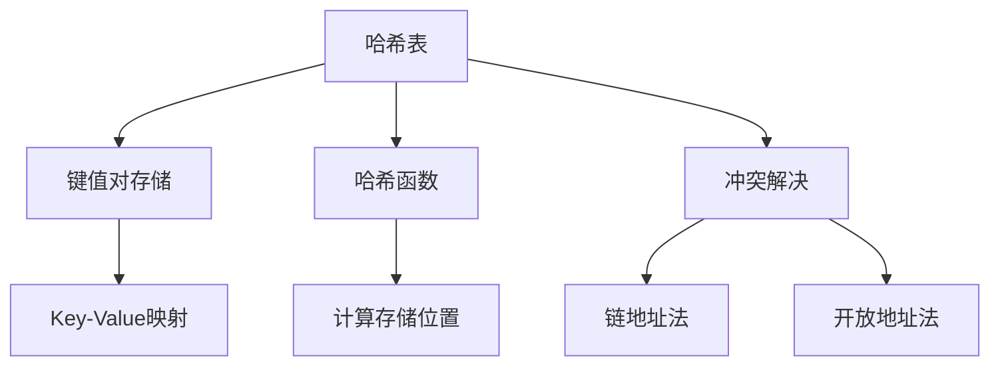
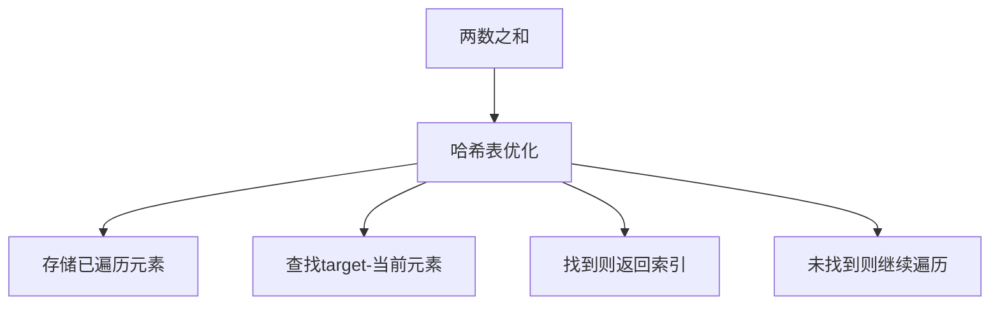
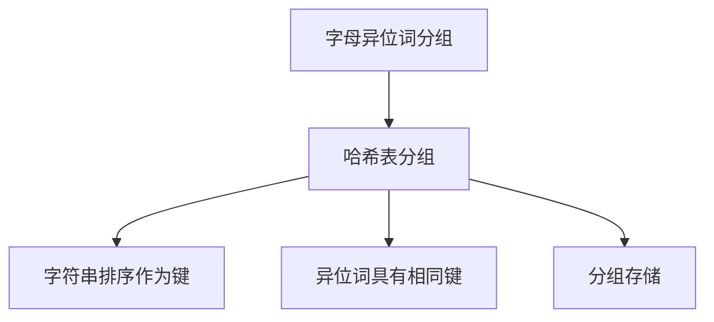
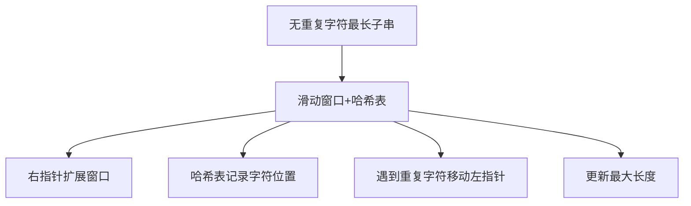
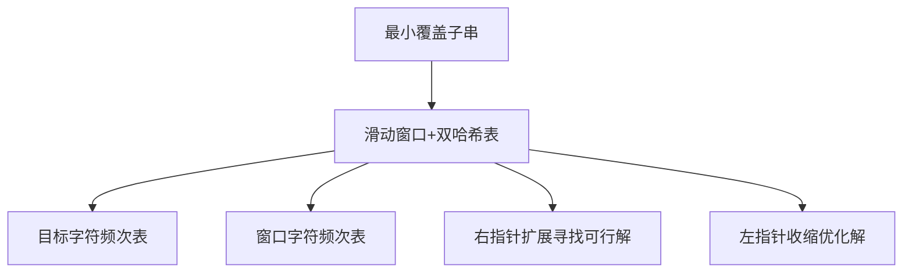
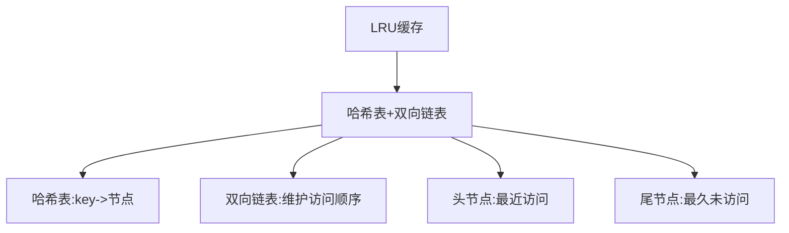
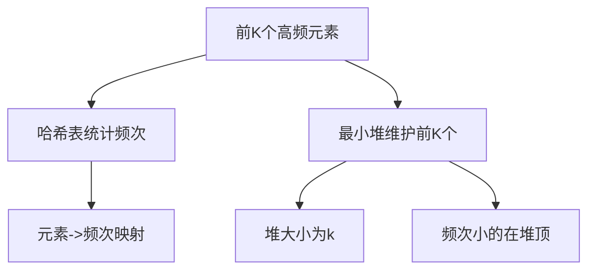
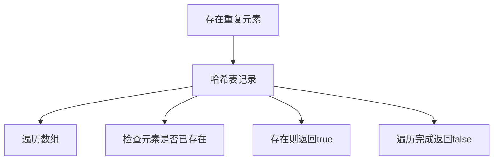
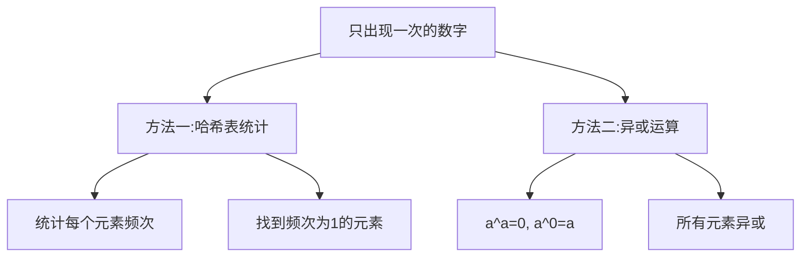

# 哈希表相关算法

哈希表（Hash Table）是一种根据键（Key）直接访问在内存存储位置的数据结构。它通过计算键值的哈希值来确定数据的存储位置，从而实现快速的查找、插入和删除操作。

## 哈希表的基本概念



### 哈希函数

哈希函数是哈希表的核心，它将键映射到数组的索引位置。一个好的哈希函数应该具备以下特点：
- 一致性：相同的键总是产生相同的哈希值
- 均匀分布：尽可能均匀地分布键值，减少冲突
- 高效性：计算速度快

### 冲突解决

由于哈希函数的输出空间通常小于输入空间，不同的键可能映射到相同的索引位置，这种情况称为冲突。

**链地址法**：将冲突的元素存储在同一个链表中
**开放地址法**：当发生冲突时，寻找下一个空闲的位置

## 哈希表的基本操作

```mermaid
graph TD
    A[哈希表操作] --> B[插入: O(1)]
    A --> C[查找: O(1)]
    A --> D[删除: O(1)]
    A --> E[扩容: O(n)]
```

1. **插入**：通过哈希函数计算键的索引，将键值对存储在对应位置
2. **查找**：通过哈希函数计算键的索引，直接访问对应位置获取值
3. **删除**：通过哈希函数计算键的索引，删除对应位置的键值对
4. **扩容**：当元素数量超过负载因子时，扩大哈希表容量并重新哈希

## 经典哈希表算法题详解

### 1. 两数之和（Two Sum）

**题目描述**：给定一个整数数组 nums 和一个整数目标值 target，请你在该数组中找出和为目标值的那两个整数，并返回它们的数组下标。

**解题思路**：
- 使用哈希表存储已遍历的元素及其索引
- 对于每个元素，检查 target - 当前元素 是否存在于哈希表中



```javascript
function twoSum(nums, target) {
  const map = new Map();
  
  for (let i = 0; i < nums.length; i++) {
    const complement = target - nums[i];
    
    if (map.has(complement)) {
      return [map.get(complement), i];
    }
    
    map.set(nums[i], i);
  }
  
  return [];
}
// 时间复杂度：O(n)
// 空间复杂度：O(n)
```

### 2. 字母异位词分组（Group Anagrams）

**题目描述**：给你一个字符串数组，请你将字母异位词组合在一起。可以按任意顺序返回结果列表。

**解题思路**：
- 使用哈希表存储分组结果
- 对每个字符串排序作为键，将异位词分组存储



```javascript
function groupAnagrams(strs) {
  const map = new Map();
  
  for (const str of strs) {
    // 对字符串排序作为键
    const key = str.split('').sort().join('');
    
    if (map.has(key)) {
      map.get(key).push(str);
    } else {
      map.set(key, [str]);
    }
  }
  
  return Array.from(map.values());
}
// 时间复杂度：O(n × k log k)，n是字符串数量，k是字符串最大长度
// 空间复杂度：O(n × k)
```

### 3. 无重复字符的最长子串（Longest Substring Without Repeating Characters）

**题目描述**：给定一个字符串 s ，请你找出其中不含有重复字符的最长子串的长度。

**解题思路**：
- 使用滑动窗口和哈希表
- 哈希表记录字符最后出现的位置
- 当遇到重复字符时，移动左指针



```javascript
function lengthOfLongestSubstring(s) {
  const map = new Map();  // 记录字符最后出现的位置
  let left = 0, maxLength = 0;
  
  for (let right = 0; right < s.length; right++) {
    const char = s[right];
    
    // 如果字符已存在且在窗口内，移动左指针
    if (map.has(char) && map.get(char) >= left) {
      left = map.get(char) + 1;
    }
    
    // 更新字符位置
    map.set(char, right);
    
    // 更新最大长度
    maxLength = Math.max(maxLength, right - left + 1);
  }
  
  return maxLength;
}
// 时间复杂度：O(n)
// 空间复杂度：O(min(m,n))，m为字符集大小
```

### 4. 最小覆盖子串（Minimum Window Substring）

**题目描述**：给你一个字符串 s 、一个字符串 t 。返回 s 中涵盖 t 所有字符的最小子串。

**解题思路**：
- 使用滑动窗口和哈希表
- 两个哈希表分别记录目标字符串和窗口中字符的频次
- 扩展右指针直到窗口包含所有目标字符
- 收缩左指针直到窗口不再满足条件



```javascript
function minWindow(s, t) {
  if (s.length === 0 || t.length === 0) return "";
  
  // 统计目标字符串中每个字符的频次
  const targetCount = new Map();
  for (const char of t) {
    targetCount.set(char, (targetCount.get(char) || 0) + 1);
  }
  
  let left = 0, right = 0;
  let formed = 0;  // 窗口中满足频次要求的字符数
  const windowCount = new Map();  // 窗口中每个字符的频次
  
  // 结果记录
  let ans = [Infinity, 0, 0];  // [length, left, right]
  
  while (right < s.length) {
    // 扩展窗口
    const char = s[right];
    windowCount.set(char, (windowCount.get(char) || 0) + 1);
    
    // 如果当前字符的频次满足要求，增加formed计数
    if (targetCount.has(char) && windowCount.get(char) === targetCount.get(char)) {
      formed++;
    }
    
    // 尝试收缩窗口
    while (left <= right && formed === targetCount.size) {
      char = s[left];
      
      // 更新结果
      if (right - left + 1 < ans[0]) {
        ans = [right - left + 1, left, right];
      }
      
      // 移动左指针
      windowCount.set(char, windowCount.get(char) - 1);
      if (targetCount.has(char) && windowCount.get(char) < targetCount.get(char)) {
        formed--;
      }
      
      left++;
    }
    
    right++;
  }
  
  return ans[0] === Infinity ? "" : s.substring(ans[1], ans[2] + 1);
}
// 时间复杂度：O(|s| + |t|)
// 空间复杂度：O(|s| + |t|)
```

### 5. LRU缓存（LRU Cache）

**题目描述**：运用你所掌握的数据结构，设计和实现一个 LRU (最近最少使用) 缓存机制。

**解题思路**：
- 使用哈希表 + 双向链表
- 哈希表提供O(1)的查找
- 双向链表维护访问顺序



```javascript
// 双向链表节点
class ListNode {
  constructor(key, value) {
    this.key = key;
    this.value = value;
    this.prev = null;
    this.next = null;
  }
}

class LRUCache {
  constructor(capacity) {
    this.capacity = capacity;
    this.map = new Map();
    
    // 创建虚拟头尾节点
    this.head = new ListNode(0, 0);
    this.tail = new ListNode(0, 0);
    this.head.next = this.tail;
    this.tail.prev = this.head;
  }
  
  // 获取数据
  get(key) {
    if (this.map.has(key)) {
      const node = this.map.get(key);
      // 移除节点
      this.removeNode(node);
      // 移到头部
      this.moveToHead(node);
      return node.value;
    }
    return -1;
  }
  
  // 插入数据
  put(key, value) {
    if (this.map.has(key)) {
      // 更新现有节点
      const node = this.map.get(key);
      node.value = value;
      this.removeNode(node);
      this.moveToHead(node);
    } else {
      // 插入新节点
      const newNode = new ListNode(key, value);
      
      if (this.map.size >= this.capacity) {
        // 容量已满，删除尾部节点
        const tail = this.tail.prev;
        this.removeNode(tail);
        this.map.delete(tail.key);
      }
      
      this.map.set(key, newNode);
      this.moveToHead(newNode);
    }
  }
  
  // 移除节点
  removeNode(node) {
    node.prev.next = node.next;
    node.next.prev = node.prev;
  }
  
  // 移到头部
  moveToHead(node) {
    node.prev = this.head;
    node.next = this.head.next;
    this.head.next.prev = node;
    this.head.next = node;
  }
}
// 时间复杂度：get和put都是O(1)
// 空间复杂度：O(capacity)
```

### 6. 前K个高频元素（Top K Frequent Elements）

**题目描述**：给你一个整数数组 nums 和一个整数 k ，请你返回其中出现频率前 k 高的元素。你可以按任意顺序返回答案。

**解题思路**：
- 使用哈希表统计元素频次
- 使用最小堆维护前k个高频元素



```javascript
// 最小堆实现
class MinHeap {
  constructor() {
    this.heap = [];
  }
  
  push(val) {
    this.heap.push(val);
    this.bubbleUp(this.heap.length - 1);
  }
  
  pop() {
    if (this.heap.length === 1) return this.heap.pop();
    const top = this.heap[0];
    this.heap[0] = this.heap.pop();
    this.bubbleDown(0);
    return top;
  }
  
  peek() {
    return this.heap[0];
  }
  
  size() {
    return this.heap.length;
  }
  
  bubbleUp(index) {
    while (index > 0) {
      const parentIndex = Math.floor((index - 1) / 2);
      if (this.heap[parentIndex][1] <= this.heap[index][1]) break;
      [this.heap[parentIndex], this.heap[index]] = [this.heap[index], this.heap[parentIndex]];
      index = parentIndex;
    }
  }
  
  bubbleDown(index) {
    while (true) {
      let minIndex = index;
      const leftChild = 2 * index + 1;
      const rightChild = 2 * index + 2;
      
      if (leftChild < this.heap.length && this.heap[leftChild][1] < this.heap[minIndex][1]) {
        minIndex = leftChild;
      }
      
      if (rightChild < this.heap.length && this.heap[rightChild][1] < this.heap[minIndex][1]) {
        minIndex = rightChild;
      }
      
      if (minIndex === index) break;
      [this.heap[index], this.heap[minIndex]] = [this.heap[minIndex], this.heap[index]];
      index = minIndex;
    }
  }
}

function topKFrequent(nums, k) {
  // 统计元素频次
  const freqMap = new Map();
  for (const num of nums) {
    freqMap.set(num, (freqMap.get(num) || 0) + 1);
  }
  
  // 使用最小堆维护前k个高频元素
  const minHeap = new MinHeap();
  
  for (const [num, freq] of freqMap) {
    minHeap.push([num, freq]);
    if (minHeap.size() > k) {
      minHeap.pop();
    }
  }
  
  // 提取结果
  const result = [];
  while (minHeap.size() > 0) {
    result.push(minHeap.pop()[0]);
  }
  
  return result.reverse();
}
// 时间复杂度：O(n log k)
// 空间复杂度：O(n + k)
```

### 7. 存在重复元素（Contains Duplicate）

**题目描述**：给定一个整数数组，判断是否存在重复元素。如果存在一值在数组中出现至少两次，函数返回 true 。如果数组中每个元素都不相同，则返回 false 。

**解题思路**：
- 使用哈希表记录已出现的元素
- 遍历数组，检查元素是否已存在



```javascript
function containsDuplicate(nums) {
  const set = new Set();
  
  for (const num of nums) {
    if (set.has(num)) {
      return true;
    }
    set.add(num);
  }
  
  return false;
}
// 时间复杂度：O(n)
// 空间复杂度：O(n)
```

### 8. 只出现一次的数字（Single Number）

**题目描述**：给定一个非空整数数组，除了某个元素只出现一次以外，其余每个元素均出现两次。找出那个只出现了一次的元素。

**解题思路**：
- 使用哈希表统计频次
- 使用异或运算（最优解）



```javascript
// 方法一：哈希表统计
function singleNumberHash(nums) {
  const map = new Map();
  
  // 统计每个元素的频次
  for (const num of nums) {
    map.set(num, (map.get(num) || 0) + 1);
  }
  
  // 找到频次为1的元素
  for (const [num, count] of map) {
    if (count === 1) {
      return num;
    }
  }
}
// 时间复杂度：O(n)
// 空间复杂度：O(n)

// 方法二：异或运算（最优解）
function singleNumber(nums) {
  let result = 0;
  
  // 异或运算：a ^ a = 0, a ^ 0 = a
  for (const num of nums) {
    result ^= num;
  }
  
  return result;
}
// 时间复杂度：O(n)
// 空间复杂度：O(1)
```

## 哈希表算法总结

哈希表相关算法是前端面试中的重要考点，主要考察点包括：

1. **基本操作**：掌握哈希表的插入、查找、删除操作
2. **冲突解决**：理解链地址法和开放地址法的实现
3. **应用场景**：熟练运用哈希表解决实际问题
4. **复杂度分析**：正确分析哈希表操作的时间和空间复杂度
5. **优化技巧**：掌握哈希表的优化方法，如动态扩容

哈希表的适用场景：
- 需要快速查找、插入、删除操作
- 需要去重或统计频次
- 需要建立映射关系
- 滑动窗口问题
- 缓存实现

掌握这些核心思想和经典题目，能够帮助我们在面试中快速解决哈希表相关的算法问题。
