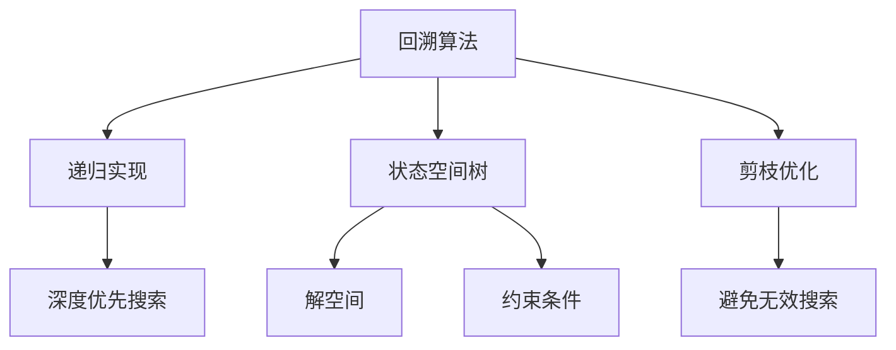
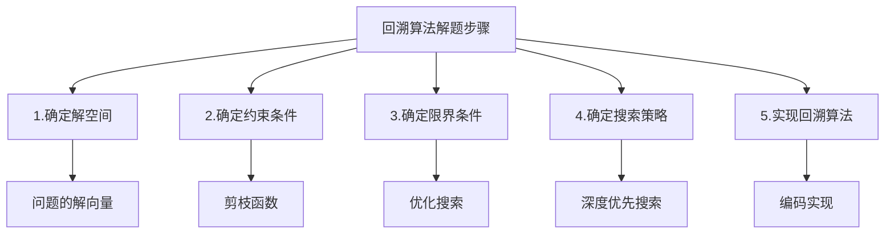
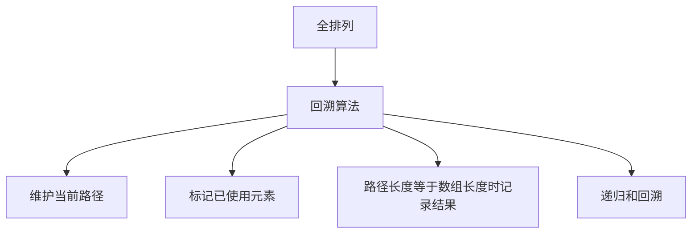
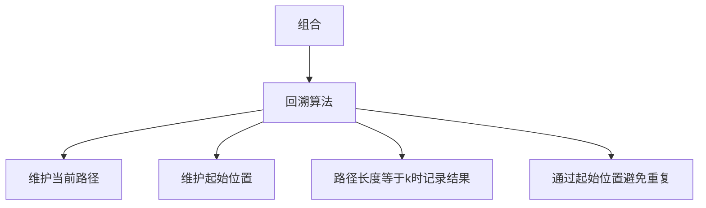
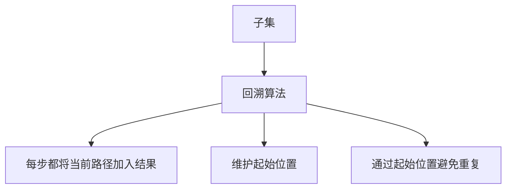
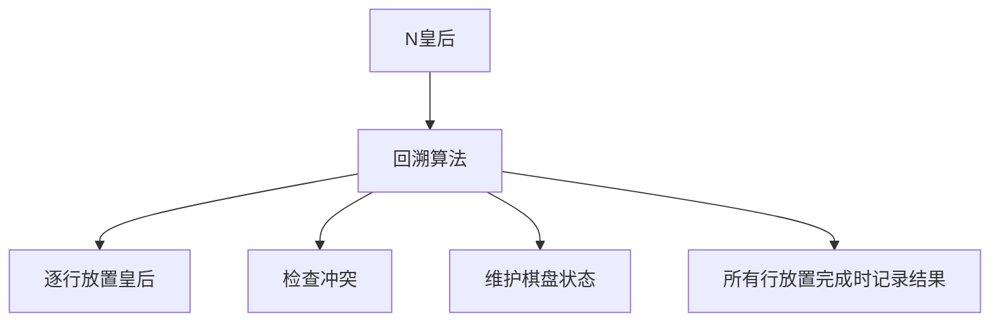
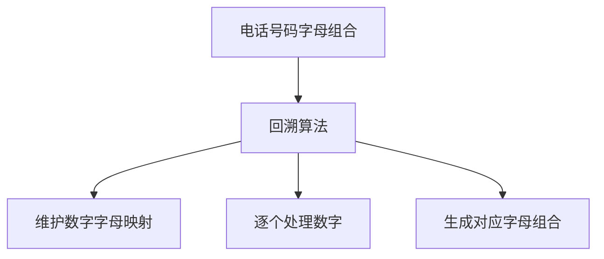
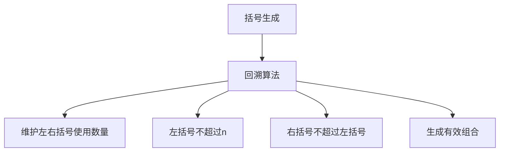
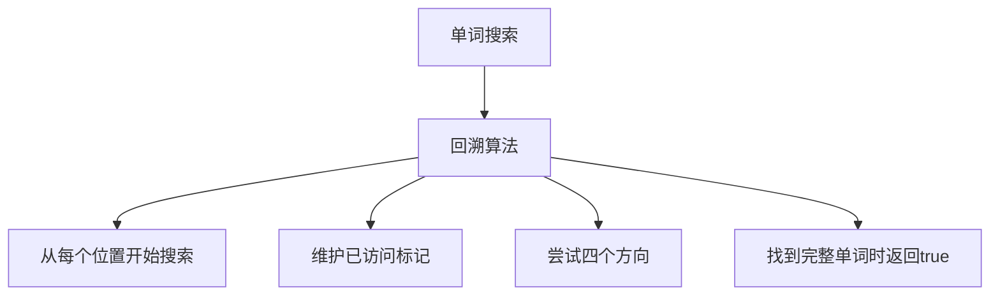

# 回溯算法

回溯算法是一种通过探索所有可能的候选解来找出所有解的算法。如果一个候选解被确认不是一个解（或者至少不是最后一个解），回溯算法会通过在上一步进行一些变化来丢弃该解，即"回溯"并尝试其他候选解。

## 回溯算法的基本概念



### 回溯算法的核心思想

1. **选择**：从候选集合中选择一个元素
2. **约束**：检查当前选择是否满足约束条件
3. **目标**：检查是否达到目标状态
4. **回溯**：如果不满足条件或未达到目标，撤销选择并尝试其他选择

### 回溯算法的实现框架

```javascript
function backtrack(路径, 选择列表) {
  // 结束条件
  if (满足结束条件) {
    result.push(路径);
    return;
  }
  
  // 遍历选择列表
  for (选择 of 选择列表) {
    // 做选择
    路径.push(选择);
    选择列表.remove(选择);
    
    // 进入下一层决策树
    backtrack(路径, 选择列表);
    
    // 撤销选择
    路径.pop();
    选择列表.add(选择);
  }
}
```

## 回溯算法的解题步骤



1. **确定解空间**：明确问题的解向量和解空间结构
2. **确定约束条件**：定义解必须满足的约束条件
3. **确定限界条件**：定义搜索的界限条件（可选）
4. **确定搜索策略**：选择合适的搜索策略
5. **实现回溯算法**：编码实现回溯过程

## 经典回溯算法题详解

### 1. 全排列（Permutations）

**题目描述**：给定一个不含重复数字的数组 nums ，返回其所有可能的全排列。你可以按任意顺序返回答案。

**解题思路**：
- 使用回溯算法生成所有排列
- 维护当前路径和已使用元素的标记
- 当路径长度等于数组长度时，找到一个完整排列



```javascript
function permute(nums) {
  const result = [];
  const path = [];
  const used = Array(nums.length).fill(false);
  
  function backtrack() {
    // 结束条件：路径长度等于数组长度
    if (path.length === nums.length) {
      result.push([...path]);  // 复制当前路径
      return;
    }
    
    // 遍历选择列表
    for (let i = 0; i < nums.length; i++) {
      // 跳过已使用的元素
      if (used[i]) continue;
      
      // 做选择
      path.push(nums[i]);
      used[i] = true;
      
      // 进入下一层决策树
      backtrack();
      
      // 撤销选择
      path.pop();
      used[i] = false;
    }
  }
  
  backtrack();
  return result;
}
// 时间复杂度：O(n! × n)
// 空间复杂度：O(n)
```

### 2. 组合（Combinations）

**题目描述**：给定两个整数 n 和 k，返回范围 [1, n] 中所有可能的 k 个数的组合。你可以按任何顺序返回答案。

**解题思路**：
- 使用回溯算法生成所有组合
- 维护当前路径和起始位置
- 当路径长度等于k时，找到一个完整组合
- 通过起始位置避免重复组合



```javascript
function combine(n, k) {
  const result = [];
  const path = [];
  
  function backtrack(start) {
    // 结束条件：路径长度等于k
    if (path.length === k) {
      result.push([...path]);  // 复制当前路径
      return;
    }
    
    // 遍历选择列表
    for (let i = start; i <= n; i++) {
      // 做选择
      path.push(i);
      
      // 进入下一层决策树（从i+1开始避免重复）
      backtrack(i + 1);
      
      // 撤销选择
      path.pop();
    }
  }
  
  backtrack(1);
  return result;
}
// 时间复杂度：O(C(n,k) × k)
// 空间复杂度：O(k)
```

### 3. 子集（Subsets）

**题目描述**：给你一个整数数组 nums ，数组中的元素互不相同。返回该数组所有可能的子集（幂集）。解集不能包含重复的子集。你可以按任意顺序返回解集。

**解题思路**：
- 使用回溯算法生成所有子集
- 每一步都把当前路径加入结果集
- 通过起始位置避免重复子集



```javascript
function subsets(nums) {
  const result = [];
  const path = [];
  
  function backtrack(start) {
    // 每一步都把当前路径加入结果集
    result.push([...path]);
    
    // 遍历选择列表
    for (let i = start; i < nums.length; i++) {
      // 做选择
      path.push(nums[i]);
      
      // 进入下一层决策树
      backtrack(i + 1);
      
      // 撤销选择
      path.pop();
    }
  }
  
  backtrack(0);
  return result;
}
// 时间复杂度：O(2^n × n)
// 空间复杂度：O(n)
```

### 4. N 皇后（N-Queens）

**题目描述**：n 皇后问题研究的是如何将 n 个皇后放置在 n×n 的棋盘上，并且使皇后彼此之间不能相互攻击。给你一个整数 n ，返回所有不同的 n 皇后问题的解决方案。每一种解法包含一个不同的 n 皇后问题的棋子放置方案，该方案中 'Q' 和 '.' 分别代表了皇后和空位。

**解题思路**：
- 使用回溯算法逐行放置皇后
- 维护当前棋盘状态和已放置皇后的位置
- 检查当前位置是否与已放置的皇后冲突
- 当所有行都放置完皇后时，找到一个解



```javascript
function solveNQueens(n) {
  const result = [];
  const board = Array(n).fill().map(() => Array(n).fill('.'));
  
  function backtrack(row) {
    // 结束条件：所有行都放置了皇后
    if (row === n) {
      // 将当前棋盘状态加入结果集
      result.push(board.map(row => row.join('')));
      return;
    }
    
    // 在当前行尝试放置皇后
    for (let col = 0; col < n; col++) {
      // 检查当前位置是否合法
      if (isValid(board, row, col, n)) {
        // 做选择
        board[row][col] = 'Q';
        
        // 进入下一行
        backtrack(row + 1);
        
        // 撤销选择
        board[row][col] = '.';
      }
    }
  }
  
  backtrack(0);
  return result;
}

// 检查在(row,col)位置放置皇后是否合法
function isValid(board, row, col, n) {
  // 检查列是否有皇后冲突
  for (let i = 0; i < row; i++) {
    if (board[i][col] === 'Q') {
      return false;
    }
  }
  
  // 检查右上方是否有皇后冲突
  for (let i = row - 1, j = col + 1; i >= 0 && j < n; i--, j++) {
    if (board[i][j] === 'Q') {
      return false;
    }
  }
  
  // 检查左上方是否有皇后冲突
  for (let i = row - 1, j = col - 1; i >= 0 && j >= 0; i--, j--) {
    if (board[i][j] === 'Q') {
      return false;
    }
  }
  
  return true;
}
// 时间复杂度：O(N!)
// 空间复杂度：O(N²)
```

### 5. 电话号码的字母组合（Letter Combinations of a Phone Number）

**题目描述**：给定一个仅包含数字 2-9 的字符串，返回所有它能表示的字母组合。答案可以按任意顺序返回。

**解题思路**：
- 使用回溯算法生成所有字母组合
- 维护数字到字母的映射关系
- 逐个处理输入的数字，生成对应的字母组合



```javascript
function letterCombinations(digits) {
  if (digits.length === 0) return [];
  
  const result = [];
  const path = [];
  
  // 数字到字母的映射
  const phoneMap = {
    '2': 'abc',
    '3': 'def',
    '4': 'ghi',
    '5': 'jkl',
    '6': 'mno',
    '7': 'pqrs',
    '8': 'tuv',
    '9': 'wxyz'
  };
  
  function backtrack(index) {
    // 结束条件：处理完所有数字
    if (index === digits.length) {
      result.push(path.join(''));
      return;
    }
    
    // 获取当前数字对应的字母
    const letters = phoneMap[digits[index]];
    
    // 遍历当前数字对应的字母
    for (const letter of letters) {
      // 做选择
      path.push(letter);
      
      // 进入下一层决策树
      backtrack(index + 1);
      
      // 撤销选择
      path.pop();
    }
  }
  
  backtrack(0);
  return result;
}
// 时间复杂度：O(3^m × 4^n)，m是对应3个字母的数字个数，n是对应4个字母的数字个数
// 空间复杂度：O(m + n)
```

### 6. 括号生成（Generate Parentheses）

**题目描述**：数字 n 代表生成括号的对数，请你设计一个函数，用于能够生成所有可能的并且有效的括号组合。

**解题思路**：
- 使用回溯算法生成有效括号组合
- 维护左括号和右括号的使用数量
- 左括号数量不能超过n
- 右括号数量不能超过左括号数量



```javascript
function generateParenthesis(n) {
  const result = [];
  
  function backtrack(current, open, close) {
    // 结束条件：当前字符串长度等于2*n
    if (current.length === 2 * n) {
      result.push(current);
      return;
    }
    
    // 添加左括号（如果数量未达到n）
    if (open < n) {
      backtrack(current + '(', open + 1, close);
    }
    
    // 添加右括号（如果数量小于左括号）
    if (close < open) {
      backtrack(current + ')', open, close + 1);
    }
  }
  
  backtrack('', 0, 0);
  return result;
}
// 时间复杂度：O(4^n / √n)
// 空间复杂度：O(4^n / √n)
```

### 7. 单词搜索（Word Search）

**题目描述**：给定一个 m x n 二维字符网格 board 和一个字符串单词 word 。如果 word 存在于网格中，返回 true ；否则，返回 false 。单词必须按照字母顺序，通过相邻的单元格内的字母构成，其中"相邻"单元格是那些水平相邻或垂直相邻的单元格。同一个单元格内的字母不允许被重复使用。

**解题思路**：
- 使用回溯算法在网格中搜索单词
- 从每个可能的起始位置开始搜索
- 维护已访问单元格的标记
- 在每个位置尝试四个方向的移动



```javascript
function exist(board, word) {
  const rows = board.length;
  const cols = board[0].length;
  const directions = [[-1, 0], [1, 0], [0, -1], [0, 1]];  // 上下左右
  
  // 遍历每个可能的起始位置
  for (let i = 0; i < rows; i++) {
    for (let j = 0; j < cols; j++) {
      if (backtrack(board, word, i, j, 0, directions)) {
        return true;
      }
    }
  }
  
  return false;
}

function backtrack(board, word, row, col, index, directions) {
  // 结束条件：已找到完整单词
  if (index === word.length) {
    return true;
  }
  
  // 边界检查和字符匹配检查
  if (row < 0 || row >= board.length || 
      col < 0 || col >= board[0].length || 
      board[row][col] !== word[index]) {
    return false;
  }
  
  // 标记当前单元格为已访问
  const temp = board[row][col];
  board[row][col] = '#';  // 使用特殊字符标记已访问
  
  // 尝试四个方向
  for (const [dr, dc] of directions) {
    if (backtrack(board, word, row + dr, col + dc, index + 1, directions)) {
      board[row][col] = temp;  // 恢复状态
      return true;
    }
  }
  
  // 恢复状态
  board[row][col] = temp;
  return false;
}
// 时间复杂度：O(m×n×4^L)，L是单词长度
// 空间复杂度：O(L)
```

## 回溯算法总结

回溯算法是算法面试中的重要考点，主要考察点包括：

1. **递归实现**：掌握回溯算法的递归实现方式
2. **状态维护**：正确维护搜索过程中的状态
3. **剪枝优化**：通过约束条件剪枝，提高搜索效率
4. **问题建模**：将实际问题抽象为回溯算法模型
5. **复杂度分析**：正确分析回溯算法的时间和空间复杂度

回溯算法适用于以下类型的问题：
- 排列组合问题
- 子集问题
- 棋盘问题
- 字符串匹配问题
- 约束满足问题

掌握这些核心思想和经典题目，能够帮助我们在面试中快速解决回溯算法相关的算法问题。