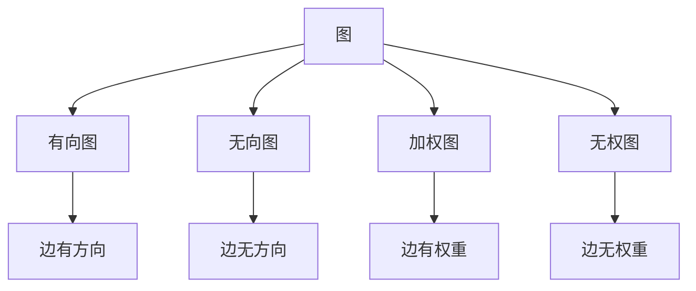
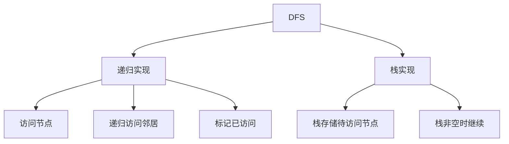
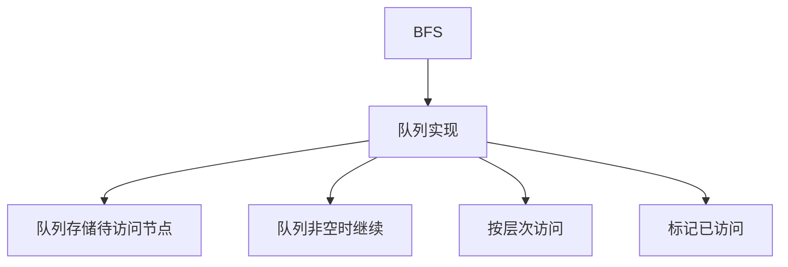
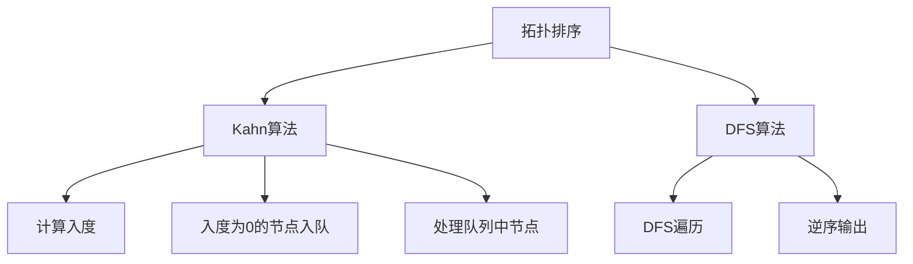
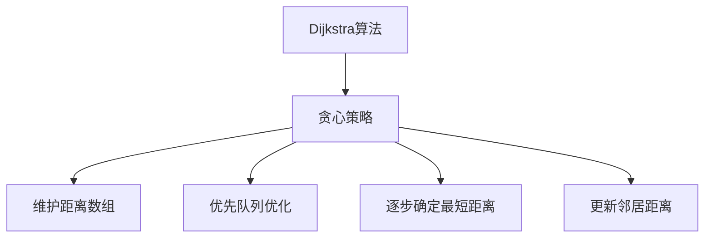
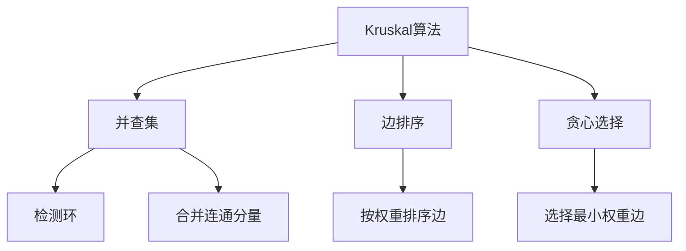
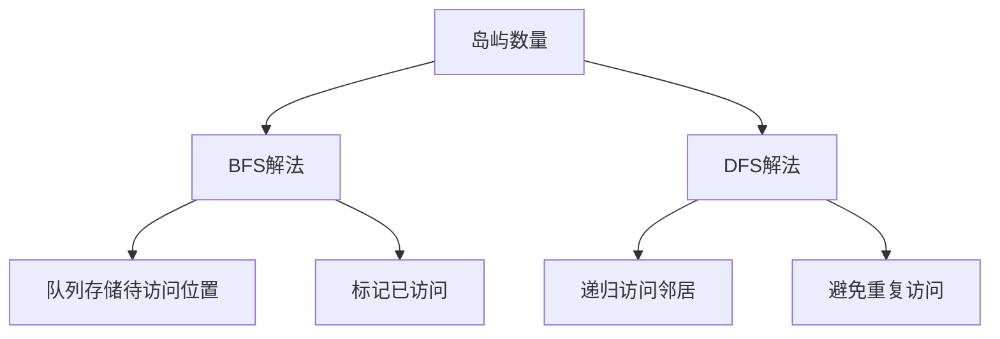
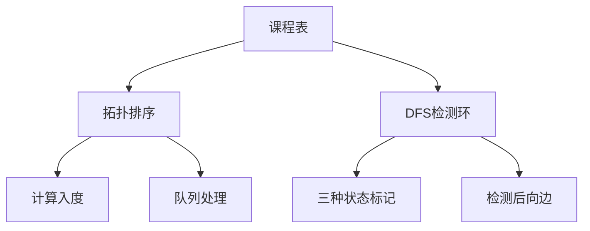

# 图相关算法

图是由节点（顶点）和边组成的非线性数据结构，是计算机科学中重要的数据结构之一。图论算法在解决网络、路径、社交关系等问题中有着广泛的应用。

## 图的基本概念



### 图的表示方法

1. **邻接矩阵**：使用二维数组表示顶点之间的连接关系
2. **邻接表**：使用链表数组表示每个顶点的邻居

```mermaid
graph TD
    A[图的表示] --> B[邻接矩阵]
    A --> C[邻接表]
    B --> D[二维数组]
    B --> E[空间复杂度O(V²)]
    C --> F[链表数组]
    C --> G[空间复杂度O(V+E)]
```

### 图的遍历

1. **深度优先搜索（DFS）**：沿着图的深度遍历图的节点
2. **广度优先搜索（BFS）**：按层次遍历图的节点

## 图的基本操作实现

### 图的邻接表表示

```javascript
class Graph {
  constructor() {
    this.adjacencyList = new Map();
  }
  
  // 添加顶点
  addVertex(vertex) {
    if (!this.adjacencyList.has(vertex)) {
      this.adjacencyList.set(vertex, []);
    }
  }
  
  // 添加边
  addEdge(vertex1, vertex2) {
    if (!this.adjacencyList.has(vertex1)) {
      this.addVertex(vertex1);
    }
    if (!this.adjacencyList.has(vertex2)) {
      this.addVertex(vertex2);
    }
    
    this.adjacencyList.get(vertex1).push(vertex2);
    // 无向图需要添加反向边
    this.adjacencyList.get(vertex2).push(vertex1);
  }
  
  // 获取顶点的邻居
  getNeighbors(vertex) {
    return this.adjacencyList.get(vertex) || [];
  }
}
```

## 经典图算法详解

### 1. 图的深度优先搜索（DFS）

**算法思路**：
- 从起始节点开始，沿着一条路径尽可能深入
- 当无法继续深入时，回退到上一个节点
- 继续探索其他未访问的路径



```javascript
// 递归实现
function dfsRecursive(graph, start, visited = new Set()) {
  // 标记当前节点为已访问
  visited.add(start);
  console.log(start);  // 处理当前节点
  
  // 递归访问所有未访问的邻居节点
  for (const neighbor of graph.getNeighbors(start)) {
    if (!visited.has(neighbor)) {
      dfsRecursive(graph, neighbor, visited);
    }
  }
  
  return visited;
}

// 栈实现
function dfsIterative(graph, start) {
  const visited = new Set();
  const stack = [start];
  
  while (stack.length > 0) {
    const vertex = stack.pop();
    
    if (!visited.has(vertex)) {
      visited.add(vertex);
      console.log(vertex);  // 处理当前节点
      
      // 将邻居节点加入栈中
      for (const neighbor of graph.getNeighbors(vertex)) {
        if (!visited.has(neighbor)) {
          stack.push(neighbor);
        }
      }
    }
  }
  
  return visited;
}
// 时间复杂度：O(V + E)
// 空间复杂度：O(V)
```

### 2. 图的广度优先搜索（BFS）

**算法思路**：
- 从起始节点开始，按层次遍历图的节点
- 使用队列存储待访问的节点
- 先访问距离起始节点近的节点



```javascript
function bfs(graph, start) {
  const visited = new Set();
  const queue = [start];
  visited.add(start);
  
  while (queue.length > 0) {
    const vertex = queue.shift();
    console.log(vertex);  // 处理当前节点
    
    // 将未访问的邻居节点加入队列
    for (const neighbor of graph.getNeighbors(vertex)) {
      if (!visited.has(neighbor)) {
        visited.add(neighbor);
        queue.push(neighbor);
      }
    }
  }
  
  return visited;
}
// 时间复杂度：O(V + E)
// 空间复杂度：O(V)
```

### 3. 拓扑排序（Topological Sort）

**算法描述**：对于一个有向无环图(DAG)，拓扑排序是其顶点的一个线性排序，使得对于任何一条从顶点u到顶点v的有向边uv，在排序中u都出现在v之前。

**应用场景**：
- 课程安排问题
- 项目调度问题
- 依赖关系处理



```javascript
// Kahn算法实现
function topologicalSortKahn(graph) {
  const vertices = Array.from(graph.adjacencyList.keys());
  const inDegree = new Map();
  const result = [];
  
  // 初始化所有顶点的入度为0
  for (const vertex of vertices) {
    inDegree.set(vertex, 0);
  }
  
  // 计算每个顶点的入度
  for (const vertex of vertices) {
    for (const neighbor of graph.getNeighbors(vertex)) {
      inDegree.set(neighbor, inDegree.get(neighbor) + 1);
    }
  }
  
  // 将入度为0的顶点加入队列
  const queue = [];
  for (const [vertex, degree] of inDegree) {
    if (degree === 0) {
      queue.push(vertex);
    }
  }
  
  // 处理队列中的顶点
  while (queue.length > 0) {
    const vertex = queue.shift();
    result.push(vertex);
    
    // 减少邻居节点的入度
    for (const neighbor of graph.getNeighbors(vertex)) {
      inDegree.set(neighbor, inDegree.get(neighbor) - 1);
      if (inDegree.get(neighbor) === 0) {
        queue.push(neighbor);
      }
    }
  }
  
  // 检查是否存在环
  if (result.length !== vertices.length) {
    throw new Error("图中存在环，无法进行拓扑排序");
  }
  
  return result;
}

// DFS算法实现
function topologicalSortDFS(graph) {
  const vertices = Array.from(graph.adjacencyList.keys());
  const visited = new Set();
  const tempVisited = new Set();  // 用于检测环
  const result = [];
  
  function dfs(vertex) {
    // 检测环
    if (tempVisited.has(vertex)) {
      throw new Error("图中存在环，无法进行拓扑排序");
    }
    
    if (!visited.has(vertex)) {
      tempVisited.add(vertex);
      
      // 递归访问所有邻居节点
      for (const neighbor of graph.getNeighbors(vertex)) {
        dfs(neighbor);
      }
      
      tempVisited.delete(vertex);
      visited.add(vertex);
      result.unshift(vertex);  // 添加到结果数组的开头
    }
  }
  
  // 对所有未访问的顶点执行DFS
  for (const vertex of vertices) {
    if (!visited.has(vertex)) {
      dfs(vertex);
    }
  }
  
  return result;
}
// 时间复杂度：O(V + E)
// 空间复杂度：O(V)
```

### 4. 最短路径算法 - Dijkstra算法

**算法描述**：Dijkstra算法用于计算加权图中从单个源点到所有其他顶点的最短路径。它要求图中所有边的权重都为非负数。



```javascript
// 优先队列实现
class PriorityQueue {
  constructor() {
    this.values = [];
  }
  
  enqueue(val, priority) {
    this.values.push({val, priority});
    this.sort();
  }
  
  dequeue() {
    return this.values.shift();
  }
  
  sort() {
    this.values.sort((a, b) => a.priority - b.priority);
  }
  
  isEmpty() {
    return this.values.length === 0;
  }
}

function dijkstra(graph, start) {
  const distances = new Map();
  const previous = new Map();
  const pq = new PriorityQueue();
  const visited = new Set();
  
  // 初始化距离
  for (const vertex of graph.adjacencyList.keys()) {
    if (vertex === start) {
      distances.set(vertex, 0);
      pq.enqueue(vertex, 0);
    } else {
      distances.set(vertex, Infinity);
    }
    previous.set(vertex, null);
  }
  
  while (!pq.isEmpty()) {
    const {val: vertex} = pq.dequeue();
    
    if (visited.has(vertex)) continue;
    visited.add(vertex);
    
    // 更新邻居节点的距离
    for (const neighbor of graph.getNeighbors(vertex)) {
      if (!visited.has(neighbor)) {
        const distance = distances.get(vertex) + 1;  // 假设边权重为1
        
        if (distance < distances.get(neighbor)) {
          distances.set(neighbor, distance);
          previous.set(neighbor, vertex);
          pq.enqueue(neighbor, distance);
        }
      }
    }
  }
  
  return {distances, previous};
}
// 时间复杂度：O((V + E) log V)
// 空间复杂度：O(V)
```

### 5. 最小生成树 - Kruskal算法

**算法描述**：Kruskal算法用于寻找加权无向图的最小生成树。它按照边的权重递增顺序考虑每条边，如果这条边连接的两个顶点属于不同的连通分量，则将这条边加入生成树。



```javascript
// 并查集实现
class UnionFind {
  constructor(vertices) {
    this.parent = new Map();
    this.rank = new Map();
    
    for (const vertex of vertices) {
      this.parent.set(vertex, vertex);
      this.rank.set(vertex, 0);
    }
  }
  
  find(x) {
    if (this.parent.get(x) !== x) {
      this.parent.set(x, this.find(this.parent.get(x)));  // 路径压缩
    }
    return this.parent.get(x);
  }
  
  union(x, y) {
    const rootX = this.find(x);
    const rootY = this.find(y);
    
    if (rootX !== rootY) {
      // 按秩合并
      if (this.rank.get(rootX) < this.rank.get(rootY)) {
        this.parent.set(rootX, rootY);
      } else if (this.rank.get(rootX) > this.rank.get(rootY)) {
        this.parent.set(rootY, rootX);
      } else {
        this.parent.set(rootY, rootX);
        this.rank.set(rootX, this.rank.get(rootX) + 1);
      }
      return true;
    }
    return false;
  }
}

function kruskal(graph) {
  const vertices = Array.from(graph.adjacencyList.keys());
  const edges = [];
  const result = [];
  
  // 收集所有边
  for (const [vertex, neighbors] of graph.adjacencyList) {
    for (const neighbor of neighbors) {
      edges.push([vertex, neighbor, 1]);  // 假设边权重为1
    }
  }
  
  // 按权重排序边
  edges.sort((a, b) => a[2] - b[2]);
  
  // 初始化并查集
  const uf = new UnionFind(vertices);
  
  // 选择边构建最小生成树
  for (const [u, v, weight] of edges) {
    if (uf.union(u, v)) {
      result.push([u, v, weight]);
      if (result.length === vertices.length - 1) break;
    }
  }
  
  return result;
}
// 时间复杂度：O(E log E)
// 空间复杂度：O(V)
```

### 6. 岛屿数量（Number of Islands）

**题目描述**：给你一个由 '1'（陆地）和 '0'（水）组成的的二维网格，请你计算其中岛屿的数量。

**解题思路**：
- 遍历网格，当遇到'1'时，使用BFS或DFS将相连的'1'都标记为'0'
- 每次搜索操作计数加1
- 返回计数结果



```javascript
// BFS解法
function numIslandsBFS(grid) {
  if (grid.length === 0 || grid[0].length === 0) return 0;
  
  const rows = grid.length;
  const cols = grid[0].length;
  let count = 0;
  
  // 遍历网格
  for (let i = 0; i < rows; i++) {
    for (let j = 0; j < cols; j++) {
      if (grid[i][j] === '1') {
        // 发现新岛屿，使用BFS标记所有相连的陆地
        bfs(grid, i, j, rows, cols);
        count++;
      }
    }
  }
  
  return count;
}

function bfs(grid, startRow, startCol, rows, cols) {
  const queue = [[startRow, startCol]];
  grid[startRow][startCol] = '0';  // 标记为已访问
  
  // 四个方向：上、下、左、右
  const directions = [[-1, 0], [1, 0], [0, -1], [0, 1]];
  
  while (queue.length > 0) {
    const [row, col] = queue.shift();
    
    // 检查四个方向的邻居
    for (const [dr, dc] of directions) {
      const newRow = row + dr;
      const newCol = col + dc;
      
      // 检查边界和是否为陆地
      if (newRow >= 0 && newRow < rows && 
          newCol >= 0 && newCol < cols && 
          grid[newRow][newCol] === '1') {
        grid[newRow][newCol] = '0';  // 标记为已访问
        queue.push([newRow, newCol]);
      }
    }
  }
}

// DFS解法
function numIslandsDFS(grid) {
  if (grid.length === 0 || grid[0].length === 0) return 0;
  
  const rows = grid.length;
  const cols = grid[0].length;
  let count = 0;
  
  // 遍历网格
  for (let i = 0; i < rows; i++) {
    for (let j = 0; j < cols; j++) {
      if (grid[i][j] === '1') {
        // 发现新岛屿，使用DFS标记所有相连的陆地
        dfs(grid, i, j, rows, cols);
        count++;
      }
    }
  }
  
  return count;
}

function dfs(grid, row, col, rows, cols) {
  // 边界检查和值检查
  if (row < 0 || row >= rows || 
      col < 0 || col >= cols || 
      grid[row][col] === '0') {
    return;
  }
  
  // 标记为已访问
  grid[row][col] = '0';
  
  // 递归访问四个方向的邻居
  dfs(grid, row - 1, col, rows, cols);  // 上
  dfs(grid, row + 1, col, rows, cols);  // 下
  dfs(grid, row, col - 1, rows, cols);  // 左
  dfs(grid, row, col + 1, rows, cols);  // 右
}
// 时间复杂度：O(m×n)
// 空间复杂度：O(m×n)
```

### 7. 课程表（Course Schedule）

**题目描述**：你这个学期必须选修 numCourses 门课程，记为 0 到 numCourses - 1 。在选修某些课程之前需要一些先修课程。先修课程按数组 prerequisites 给出，其中 prerequisites[i] = [ai, bi] ，表示如果要学习课程 ai 则必须先学习课程 bi 。请你判断是否可能完成所有课程的学习。

**解题思路**：
- 将问题转化为检测有向图中是否存在环
- 使用拓扑排序或DFS检测环



```javascript
// 方法一：拓扑排序
function canFinishTopo(numCourses, prerequisites) {
  // 构建邻接表
  const graph = new Map();
  const inDegree = Array(numCourses).fill(0);
  
  // 初始化图
  for (let i = 0; i < numCourses; i++) {
    graph.set(i, []);
  }
  
  // 构建图和入度数组
  for (const [course, prereq] of prerequisites) {
    graph.get(prereq).push(course);
    inDegree[course]++;
  }
  
  // 将入度为0的课程加入队列
  const queue = [];
  for (let i = 0; i < numCourses; i++) {
    if (inDegree[i] === 0) {
      queue.push(i);
    }
  }
  
  let count = 0;  // 完成的课程数
  
  // 处理队列中的课程
  while (queue.length > 0) {
    const course = queue.shift();
    count++;
    
    // 减少邻居课程的入度
    for (const neighbor of graph.get(course)) {
      inDegree[neighbor]--;
      if (inDegree[neighbor] === 0) {
        queue.push(neighbor);
      }
    }
  }
  
  // 如果完成的课程数等于总课程数，说明可以完成所有课程
  return count === numCourses;
}

// 方法二：DFS检测环
function canFinishDFS(numCourses, prerequisites) {
  // 构建邻接表
  const graph = new Map();
  
  // 初始化图
  for (let i = 0; i < numCourses; i++) {
    graph.set(i, []);
  }
  
  // 构建图
  for (const [course, prereq] of prerequisites) {
    graph.get(prereq).push(course);
  }
  
  // 三种状态：0-未访问，1-正在访问，2-已完成访问
  const visited = Array(numCourses).fill(0);
  
  function dfs(course) {
    if (visited[course] === 1) return false;  // 检测到环
    if (visited[course] === 2) return true;   // 已经访问过，无环
    
    visited[course] = 1;  // 标记为正在访问
    
    // 访问所有邻居课程
    for (const neighbor of graph.get(course)) {
      if (!dfs(neighbor)) return false;
    }
    
    visited[course] = 2;  // 标记为已完成访问
    return true;
  }
  
  // 对所有课程执行DFS
  for (let i = 0; i < numCourses; i++) {
    if (!dfs(i)) return false;
  }
  
  return true;
}
// 时间复杂度：O(V + E)
// 空间复杂度：O(V + E)
```

## 图算法总结

图相关算法是算法面试中的重要考点，主要考察点包括：

1. **图的表示**：掌握邻接矩阵和邻接表的实现
2. **图的遍历**：熟练掌握DFS和BFS的实现和应用
3. **最短路径**：理解Dijkstra算法的原理和实现
4. **最小生成树**：掌握Kruskal和Prim算法
5. **拓扑排序**：理解其应用场景和实现方法
6. **环检测**：掌握在有向图和无向图中检测环的方法

图算法的应用场景：
- 社交网络分析
- 路径规划和导航
- 网络流和匹配问题
- 项目调度和依赖管理
- 推荐系统

掌握这些核心思想和经典算法，能够帮助我们在面试中快速解决图相关的算法问题。