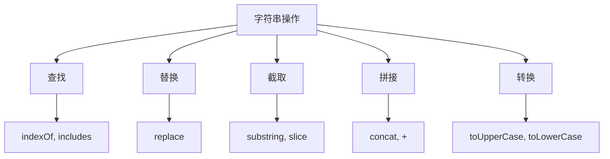
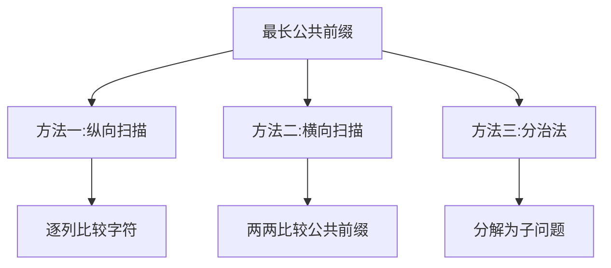
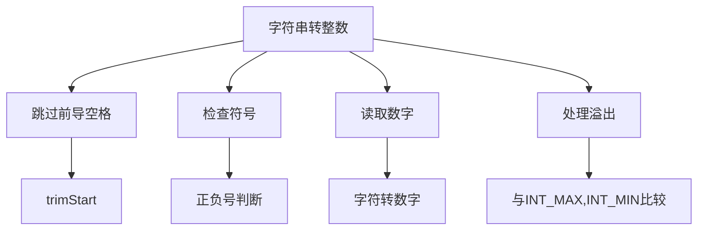
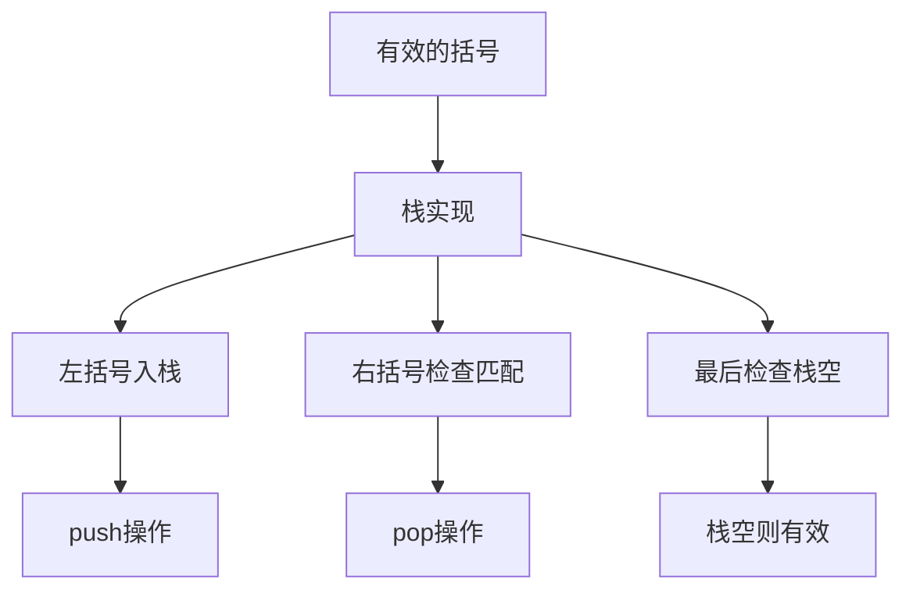
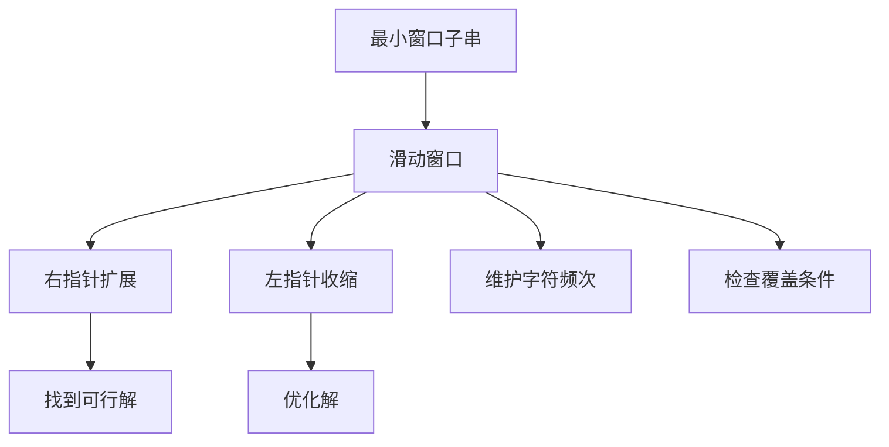
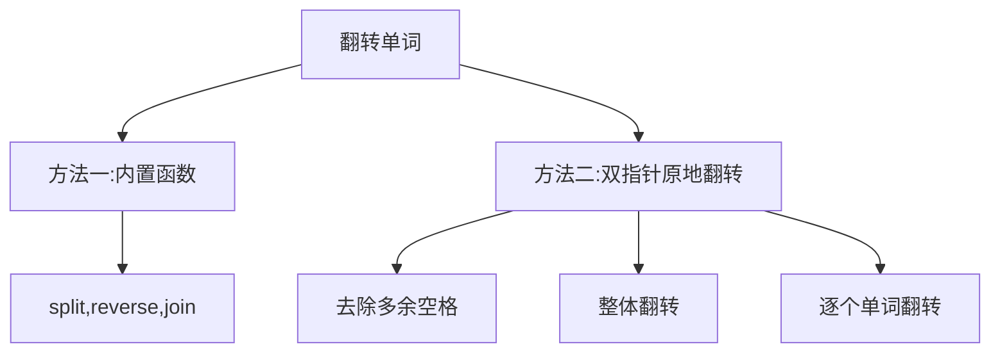

# 字符串相关算法

字符串处理是前端面试中的重要考点，涉及到字符的查找、匹配、转换等操作。字符串可以看作是字符数组，因此很多数组相关的算法思想也适用于字符串处理。

## 字符串的基本操作



## 经典字符串算法题详解

### 1. 最长公共前缀（Longest Common Prefix）

**题目描述**：编写一个函数来查找字符串数组中的最长公共前缀。如果不存在公共前缀，返回空字符串 ""。

**解题思路**：
- 方法一：纵向扫描，逐个比较每个字符串的相同位置字符
- 方法二：横向扫描，依次比较相邻两个字符串的公共前缀
- 方法三：分治法，将问题分解为子问题



```javascript
// 方法一：纵向扫描
function longestCommonPrefixVertical(strs) {
  if (strs.length === 0) return "";
  
  // 以第一个字符串为基准
  for (let i = 0; i < strs[0].length; i++) {
    const char = strs[0][i];
    
    // 检查其他字符串在位置i是否也是char
    for (let j = 1; j < strs.length; j++) {
      // 如果到达字符串末尾或字符不匹配
      if (i === strs[j].length || strs[j][i] !== char) {
        return strs[0].substring(0, i);
      }
    }
  }
  
  return strs[0];
}
// 时间复杂度：O(S)，S是所有字符串的字符总数
// 空间复杂度：O(1)

// 方法二：横向扫描
function longestCommonPrefixHorizontal(strs) {
  if (strs.length === 0) return "";
  
  let prefix = strs[0];
  
  for (let i = 1; i < strs.length; i++) {
    // 不断缩短prefix直到匹配当前字符串
    while (strs[i].indexOf(prefix) !== 0) {
      prefix = prefix.substring(0, prefix.length - 1);
      if (prefix === "") return "";
    }
  }
  
  return prefix;
}
// 时间复杂度：O(S)
// 空间复杂度：O(1)
```

### 2. 最长回文子串（Longest Palindromic Substring）

**题目描述**：给你一个字符串 s，找到 s 中最长的回文子串。

**解题思路**：
- 方法一：中心扩展法，以每个字符为中心向两边扩展
- 方法二：动态规划
- 方法三：Manacher算法（最优解）

```mermaid
graph TD
    A[最长回文子串] --> B[方法一:中心扩展法]
    A --> C[方法二:动态规划]
    A --> D[方法三:Manacher算法]
    B --> E[以每个字符为中心扩展]
    C --> F[dp[i][j]表示s[i..j]是否为回文]
    D --> G[线性时间复杂度]
```

```javascript
// 方法一：中心扩展法
function longestPalindromeExpand(s) {
  if (s.length < 2) return s;
  
  let start = 0, maxLength = 1;
  
  function expandAroundCenter(left, right) {
    // 从中心向两边扩展
    while (left >= 0 && right < s.length && s[left] === s[right]) {
      const currentLength = right - left + 1;
      if (currentLength > maxLength) {
        maxLength = currentLength;
        start = left;
      }
      left--;
      right++;
    }
  }
  
  for (let i = 0; i < s.length; i++) {
    // 奇数长度回文（以i为中心）
    expandAroundCenter(i, i);
    // 偶数长度回文（以i和i+1为中心）
    expandAroundCenter(i, i + 1);
  }
  
  return s.substring(start, start + maxLength);
}
// 时间复杂度：O(n²)
// 空间复杂度：O(1)

// 方法二：动态规划
function longestPalindromeDP(s) {
  if (s.length < 2) return s;
  
  const n = s.length;
  const dp = Array(n).fill().map(() => Array(n).fill(false));
  let start = 0, maxLength = 1;
  
  // 单个字符都是回文
  for (let i = 0; i < n; i++) {
    dp[i][i] = true;
  }
  
  // 检查长度为2的子串
  for (let i = 0; i < n - 1; i++) {
    if (s[i] === s[i + 1]) {
      dp[i][i + 1] = true;
      start = i;
      maxLength = 2;
    }
  }
  
  // 检查长度大于2的子串
  for (let len = 3; len <= n; len++) {
    for (let i = 0; i < n - len + 1; i++) {
      const j = i + len - 1;
      
      if (s[i] === s[j] && dp[i + 1][j - 1]) {
        dp[i][j] = true;
        start = i;
        maxLength = len;
      }
    }
  }
  
  return s.substring(start, start + maxLength);
}
// 时间复杂度：O(n²)
// 空间复杂度：O(n²)
```

### 3. 字符串转换整数 (atoi)（String to Integer (atoi)）

**题目描述**：请你来实现一个 myAtoi(string s) 函数，使其能将字符串转换成一个 32 位有符号整数。

**解题思路**：
- 跳过前导空格
- 检查符号
- 读取数字字符
- 处理溢出情况



```javascript
function myAtoi(s) {
  if (s.length === 0) return 0;
  
  let i = 0;
  const n = s.length;
  
  // 跳过前导空格
  while (i < n && s[i] === ' ') {
    i++;
  }
  
  // 检查符号
  let sign = 1;
  if (i < n && (s[i] === '+' || s[i] === '-')) {
    sign = s[i] === '-' ? -1 : 1;
    i++;
  }
  
  // 转换数字
  let result = 0;
  while (i < n && s[i] >= '0' && s[i] <= '9') {
    const digit = s[i].charCodeAt(0) - '0'.charCodeAt(0);
    
    // 检查溢出
    if (result > Math.floor((2**31 - 1 - digit) / 10)) {
      return sign === 1 ? 2**31 - 1 : -(2**31);
    }
    
    result = result * 10 + digit;
    i++;
  }
  
  return sign * result;
}
// 时间复杂度：O(n)
// 空间复杂度：O(1)
```

### 4. 正则表达式匹配（Regular Expression Matching）

**题目描述**：给你一个字符串 s 和一个字符规律 p，请你来实现一个支持 '.' 和 '*' 的正则表达式匹配。

**解题思路**：
- 使用动态规划
- dp[i][j] 表示 s 的前 i 个字符与 p 的前 j 个字符是否匹配
- 处理 '.' 和 '*' 的特殊情况

```mermaid
graph TD
    A[正则表达式匹配] --> B[动态规划]
    B --> C[dp[i][j]表示匹配状态]
    B --> D[处理.字符]
    B --> E[处理*字符]
    D --> F[匹配任意单个字符]
    E --> G[匹配零个或多个前面的字符]
```

```javascript
function isMatch(s, p) {
  const m = s.length;
  const n = p.length;
  
  // dp[i][j] 表示 s 的前 i 个字符与 p 的前 j 个字符是否匹配
  const dp = Array(m + 1).fill().map(() => Array(n + 1).fill(false));
  
  // 空字符串与空模式匹配
  dp[0][0] = true;
  
  // 处理空字符串与模式的匹配情况（主要是处理 a*, a*b* 等情况）
  for (let j = 2; j <= n; j++) {
    if (p[j - 1] === '*') {
      dp[0][j] = dp[0][j - 2];
    }
  }
  
  // 填充DP表
  for (let i = 1; i <= m; i++) {
    for (let j = 1; j <= n; j++) {
      if (p[j - 1] === '*') {
        // '*' 匹配零个前面的字符
        dp[i][j] = dp[i][j - 2];
        
        // '*' 匹配一个或多个前面的字符
        if (p[j - 2] === s[i - 1] || p[j - 2] === '.') {
          dp[i][j] = dp[i][j] || dp[i - 1][j];
        }
      } else if (p[j - 1] === s[i - 1] || p[j - 1] === '.') {
        // 字符匹配或 '.' 匹配任意字符
        dp[i][j] = dp[i - 1][j - 1];
      }
    }
  }
  
  return dp[m][n];
}
// 时间复杂度：O(m×n)
// 空间复杂度：O(m×n)
```

### 5. 有效的括号（Valid Parentheses）

**题目描述**：给定一个只包括 '('，')'，'{'，'}'，'['，']' 的字符串 s ，判断字符串是否有效。

**解题思路**：
- 使用栈数据结构
- 遇到左括号入栈
- 遇到右括号检查栈顶是否匹配
- 最后检查栈是否为空



```javascript
function isValid(s) {
  const stack = [];
  const map = {
    ')': '(',
    '}': '{',
    ']': '['
  };
  
  for (const char of s) {
    // 如果是右括号
    if (map[char]) {
      // 检查栈顶是否匹配
      if (stack.length === 0 || stack.pop() !== map[char]) {
        return false;
      }
    } else {
      // 左括号入栈
      stack.push(char);
    }
  }
  
  // 栈空则有效
  return stack.length === 0;
}
// 时间复杂度：O(n)
// 空间复杂度：O(n)
```

### 6. 字符串解码（Decode String）

**题目描述**：给定一个经过编码的字符串，返回它解码后的字符串。编码规则为: k[encoded_string]，表示其中方括号内部的 encoded_string 正好重复 k 次。注意 k 保证为正整数。

**解题思路**：
- 使用栈处理嵌套结构
- 维护数字栈和字符串栈
- 遇到 '[' 时入栈，遇到 ']' 时出栈计算

```mermaid
graph TD
    A[字符串解码] --> B[双栈实现]
    B --> C[数字栈]
    B --> D[字符串栈]
    B --> E[遇到[时入栈]
    B --> F[遇到]时出栈计算]
    E --> G[数字和当前字符串入栈]
    F --> H[重复字符串]
```

```javascript
function decodeString(s) {
  const numStack = [];
  const strStack = [];
  let currentNum = 0;
  let currentStr = '';
  
  for (const char of s) {
    if (char >= '0' && char <= '9') {
      // 构建数字
      currentNum = currentNum * 10 + parseInt(char);
    } else if (char === '[') {
      // 遇到左括号，将当前数字和字符串入栈
      numStack.push(currentNum);
      strStack.push(currentStr);
      currentNum = 0;
      currentStr = '';
    } else if (char === ']') {
      // 遇到右括号，出栈计算
      const repeatTimes = numStack.pop();
      const prevStr = strStack.pop();
      currentStr = prevStr + currentStr.repeat(repeatTimes);
    } else {
      // 普通字符直接添加
      currentStr += char;
    }
  }
  
  return currentStr;
}
// 时间复杂度：O(n)
// 空间复杂度：O(n)
```

### 7. 最小窗口子串（Minimum Window Substring）

**题目描述**：给你一个字符串 s 、一个字符串 t 。返回 s 中涵盖 t 所有字符的最小子串。如果 s 中不存在涵盖 t 所有字符的子串，则返回空字符串 "" 。

**解题思路**：
- 使用滑动窗口技术
- 维护窗口内字符频次
- 扩展右边界直到满足条件
- 收缩左边界优化结果



```javascript
function minWindow(s, t) {
  if (s.length === 0 || t.length === 0) return "";
  
  // 统计目标字符串中每个字符的频次
  const targetCount = new Map();
  for (const char of t) {
    targetCount.set(char, (targetCount.get(char) || 0) + 1);
  }
  
  let left = 0, right = 0;
  let formed = 0;  // 窗口中满足频次要求的字符数
  const windowCount = new Map();  // 窗口中每个字符的频次
  
  // 结果记录
  let ans = [Infinity, 0, 0];  // [length, left, right]
  
  while (right < s.length) {
    // 扩展窗口
    const char = s[right];
    windowCount.set(char, (windowCount.get(char) || 0) + 1);
    
    // 如果当前字符的频次满足要求，增加formed计数
    if (targetCount.has(char) && windowCount.get(char) === targetCount.get(char)) {
      formed++;
    }
    
    // 尝试收缩窗口
    while (left <= right && formed === targetCount.size) {
      char = s[left];
      
      // 更新结果
      if (right - left + 1 < ans[0]) {
        ans = [right - left + 1, left, right];
      }
      
      // 移动左指针
      windowCount.set(char, windowCount.get(char) - 1);
      if (targetCount.has(char) && windowCount.get(char) < targetCount.get(char)) {
        formed--;
      }
      
      left++;
    }
    
    right++;
  }
  
  return ans[0] === Infinity ? "" : s.substring(ans[1], ans[2] + 1);
}
// 时间复杂度：O(|s| + |t|)
// 空间复杂度：O(|s| + |t|)
```

### 8. 翻转字符串里的单词（Reverse Words in a String）

**题目描述**：给你一个字符串 s ，请你反转字符串中单词的顺序。单词是由非空格字符组成的字符串，s 中使用至少一个空格将字符串中的单词分隔开。返回单词顺序颠倒且单词之间用单个空格连接的结果字符串。

**解题思路**：
- 方法一：使用内置函数
- 方法二：双指针原地翻转



```javascript
// 方法一：使用内置函数
function reverseWordsBuiltIn(s) {
  return s.trim().split(/\s+/).reverse().join(' ');
}
// 时间复杂度：O(n)
// 空间复杂度：O(n)

// 方法二：双指针原地翻转
function reverseWords(s) {
  // 去除多余空格并转换为数组
  const chars = removeExtraSpaces(s.split(''));
  
  // 整体翻转
  reverse(chars, 0, chars.length - 1);
  
  // 逐个单词翻转
  let start = 0;
  for (let i = 0; i <= chars.length; i++) {
    if (i === chars.length || chars[i] === ' ') {
      reverse(chars, start, i - 1);
      start = i + 1;
    }
  }
  
  return chars.join('');
}

// 去除多余空格
function removeExtraSpaces(chars) {
  let slow = 0;
  
  for (let fast = 0; fast < chars.length; fast++) {
    if (chars[fast] !== ' ') {
      // 如果不是第一个单词，添加空格
      if (slow !== 0) {
        chars[slow++] = ' ';
      }
      
      // 复制单词
      while (fast < chars.length && chars[fast] !== ' ') {
        chars[slow++] = chars[fast++];
      }
    }
  }
  
  return chars.slice(0, slow);
}

// 翻转数组指定范围的元素
function reverse(chars, start, end) {
  while (start < end) {
    [chars[start], chars[end]] = [chars[end], chars[start]];
    start++;
    end--;
  }
}
// 时间复杂度：O(n)
// 空间复杂度：O(1)
```

## 字符串算法总结

字符串相关算法是前端面试中的重要考点，主要考察点包括：

1. **字符串操作**：掌握字符串的基本操作和方法
2. **模式匹配**：理解KMP、正则表达式等匹配算法
3. **回文问题**：掌握回文串的判断和处理方法
4. **滑动窗口**：熟练运用滑动窗口解决字符串问题
5. **栈的应用**：理解栈在括号匹配、字符串解码等问题中的应用

字符串算法的特点：
- 通常可以转换为字符数组处理
- 注意边界条件和空字符串的处理
- 很多问题可以用双指针、滑动窗口等技巧解决
- 某些问题需要考虑字符编码和Unicode处理

掌握这些核心思想和经典题目，能够帮助我们在面试中快速解决字符串相关的算法问题。