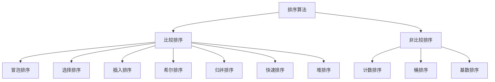
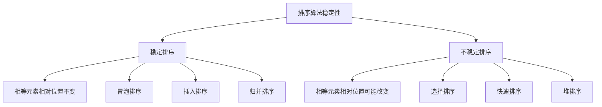
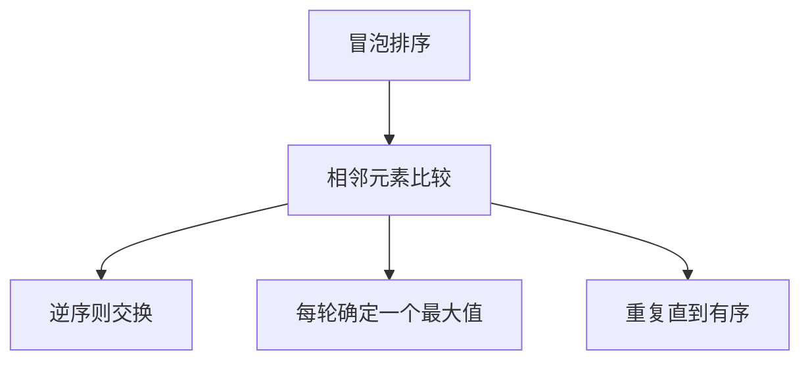
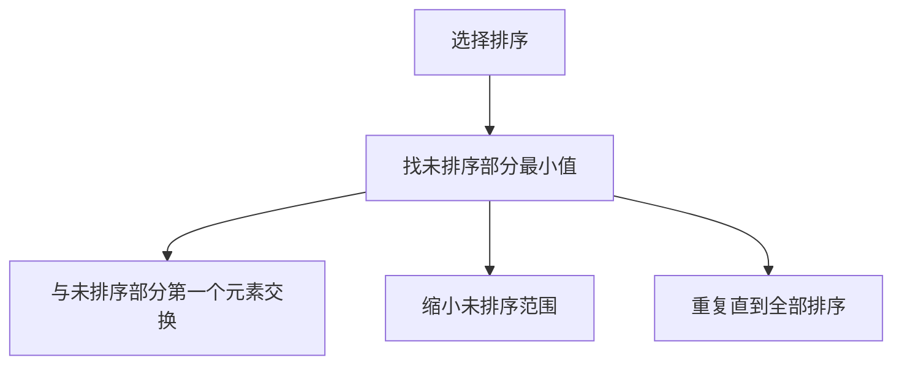
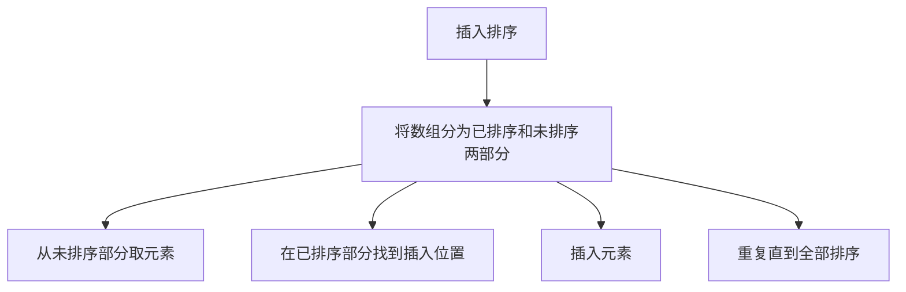
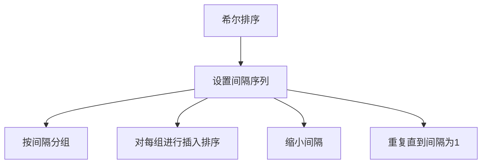
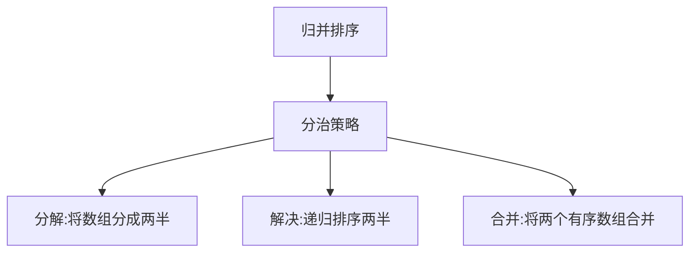
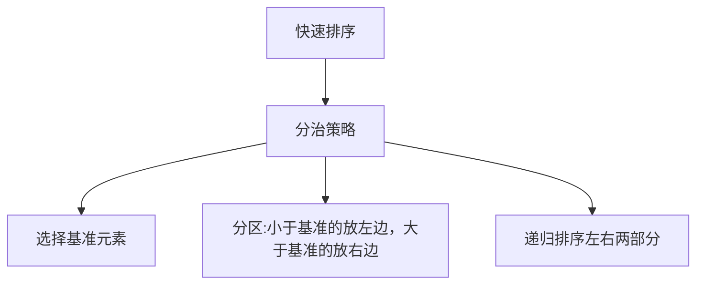
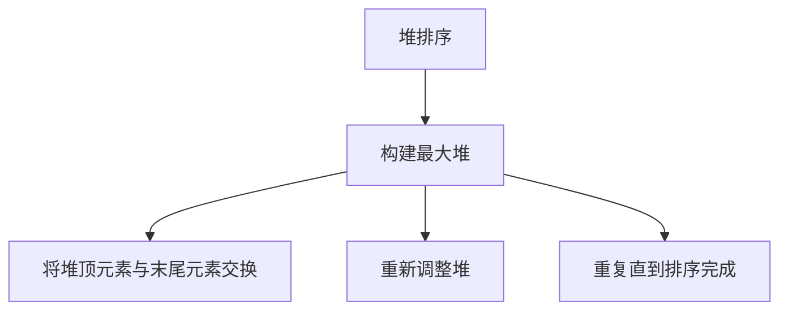
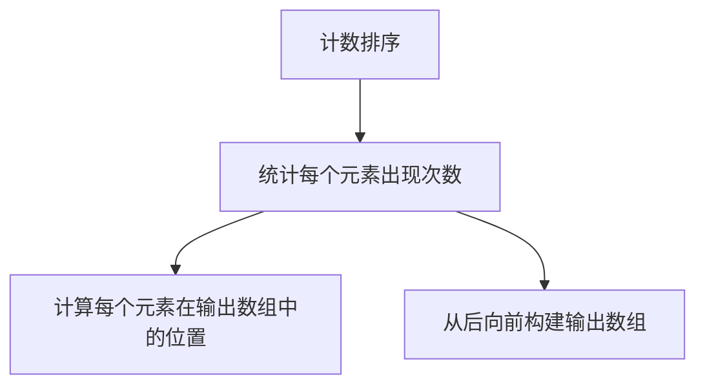

# 排序算法

排序算法是将一组数据按照特定顺序排列的算法。在计算机科学中，排序算法是最基础也是最重要的算法之一。

## 排序算法的分类



### 比较排序 vs 非比较排序

**比较排序**：通过比较元素之间的大小关系来确定元素的相对位置
- 时间复杂度下界：O(n log n)

**非比较排序**：不通过比较元素之间的大小关系，而是通过其他方式确定元素位置
- 时间复杂度可以达到 O(n)

## 排序算法的稳定性



**稳定排序**：如果 a 原本在 b 前面，而 a = b，排序之后 a 仍然在 b 的前面
**不稳定排序**：如果 a 原本在 b 前面，而 a = b，排序之后 a 可能出现在 b 的后面

## 经典排序算法详解

### 1. 冒泡排序（Bubble Sort）

**基本思想**：重复地走访过要排序的数列，一次比较两个元素，如果它们的顺序错误就把它们交换过来。走访数列的工作是重复地进行直到没有再需要交换，也就是说该数列已经排序完成。



```javascript
function bubbleSort(arr) {
  const n = arr.length;
  
  for (let i = 0; i < n - 1; i++) {
    let swapped = false;  // 优化：如果没有交换发生，说明已经有序
    
    // 每轮将最大元素"冒泡"到末尾
    for (let j = 0; j < n - i - 1; j++) {
      if (arr[j] > arr[j + 1]) {
        // 交换元素
        [arr[j], arr[j + 1]] = [arr[j + 1], arr[j]];
        swapped = true;
      }
    }
    
    // 如果没有发生交换，说明数组已经有序
    if (!swapped) break;
  }
  
  return arr;
}
// 时间复杂度：O(n²) 最好情况 O(n)
// 空间复杂度：O(1)
// 稳定性：稳定
```

### 2. 选择排序（Selection Sort）

**基本思想**：在未排序序列中找到最小（大）元素，存放到排序序列的起始位置，然后，再从剩余未排序元素中继续寻找最小（大）元素，然后放到已排序序列的末尾。以此类推，直到所有元素均排序完毕。



```javascript
function selectionSort(arr) {
  const n = arr.length;
  
  for (let i = 0; i < n - 1; i++) {
    let minIndex = i;  // 假设当前位置是最小值的位置
    
    // 在未排序部分寻找最小值
    for (let j = i + 1; j < n; j++) {
      if (arr[j] < arr[minIndex]) {
        minIndex = j;
      }
    }
    
    // 将最小值与当前位置交换
    if (minIndex !== i) {
      [arr[i], arr[minIndex]] = [arr[minIndex], arr[i]];
    }
  }
  
  return arr;
}
// 时间复杂度：O(n²)
// 空间复杂度：O(1)
// 稳定性：不稳定
```

### 3. 插入排序（Insertion Sort）

**基本思想**：通过构建有序序列，对于未排序数据，在已排序序列中从后向前扫描，找到相应位置并插入。



```javascript
function insertionSort(arr) {
  const n = arr.length;
  
  for (let i = 1; i < n; i++) {
    const key = arr[i];  // 当前要插入的元素
    let j = i - 1;
    
    // 在已排序部分找到插入位置
    while (j >= 0 && arr[j] > key) {
      arr[j + 1] = arr[j];  // 向后移动元素
      j--;
    }
    
    // 插入元素
    arr[j + 1] = key;
  }
  
  return arr;
}
// 时间复杂度：O(n²) 最好情况 O(n)
// 空间复杂度：O(1)
// 稳定性：稳定
```

### 4. 希尔排序（Shell Sort）

**基本思想**：是插入排序的一种更高效的改进版本。先将整个待排序的记录序列分割成为若干子序列分别进行直接插入排序，待整个序列中的记录"基本有序"时，再对全体记录进行依次直接插入排序。



```javascript
function shellSort(arr) {
  const n = arr.length;
  let gap = Math.floor(n / 2);  // 初始间隔
  
  while (gap > 0) {
    // 对每个分组进行插入排序
    for (let i = gap; i < n; i++) {
      const temp = arr[i];
      let j = i;
      
      // 在分组内进行插入排序
      while (j >= gap && arr[j - gap] > temp) {
        arr[j] = arr[j - gap];
        j -= gap;
      }
      
      arr[j] = temp;
    }
    
    // 缩小间隔
    gap = Math.floor(gap / 2);
  }
  
  return arr;
}
// 时间复杂度：O(n^1.3) ~ O(n²)
// 空间复杂度：O(1)
// 稳定性：不稳定
```

### 5. 归并排序（Merge Sort）

**基本思想**：采用分治法，将已有序的子序列合并，得到完全有序的序列；即先使每个子序列有序，再使子序列段间有序。



```javascript
function mergeSort(arr) {
  // 基础情况
  if (arr.length <= 1) return arr;
  
  // 分解：将数组分成两半
  const mid = Math.floor(arr.length / 2);
  const left = mergeSort(arr.slice(0, mid));
  const right = mergeSort(arr.slice(mid));
  
  // 合并：将两个有序数组合并
  return merge(left, right);
}

function merge(left, right) {
  const result = [];
  let i = 0, j = 0;
  
  // 比较两个数组的元素，将较小的元素加入结果数组
  while (i < left.length && j < right.length) {
    if (left[i] <= right[j]) {
      result.push(left[i++]);
    } else {
      result.push(right[j++]);
    }
  }
  
  // 将剩余元素加入结果数组
  return result.concat(left.slice(i)).concat(right.slice(j));
}
// 时间复杂度：O(n log n)
// 空间复杂度：O(n)
// 稳定性：稳定
```

### 6. 快速排序（Quick Sort）

**基本思想**：通过一趟排序将待排记录分隔成独立的两部分，其中一部分记录的关键字均比另一部分的关键字小，则可分别对这两部分记录继续进行排序，以达到整个序列有序。



```javascript
function quickSort(arr, left = 0, right = arr.length - 1) {
  if (left < right) {
    // 分区操作，返回基准元素的正确位置
    const pivotIndex = partition(arr, left, right);
    
    // 递归排序基准元素左边和右边的子数组
    quickSort(arr, left, pivotIndex - 1);
    quickSort(arr, pivotIndex + 1, right);
  }
  
  return arr;
}

function partition(arr, left, right) {
  // 选择最右边的元素作为基准
  const pivot = arr[right];
  let i = left;
  
  // 将小于基准的元素移到左边
  for (let j = left; j < right; j++) {
    if (arr[j] <= pivot) {
      [arr[i], arr[j]] = [arr[j], arr[i]];
      i++;
    }
  }
  
  // 将基准元素放到正确位置
  [arr[i], arr[right]] = [arr[right], arr[i]];
  return i;
}
// 时间复杂度：O(n log n) 平均情况，O(n²) 最坏情况
// 空间复杂度：O(log n) 平均情况，O(n) 最坏情况
// 稳定性：不稳定
```

### 7. 堆排序（Heap Sort）

**基本思想**：利用堆这种数据结构所设计的一种排序算法。堆积是一个近似完全二叉树的结构，并同时满足堆积的性质：即子结点的键值或索引总是小于（或者大于）它的父节点。



```javascript
function heapSort(arr) {
  const n = arr.length;
  
  // 构建最大堆
  for (let i = Math.floor(n / 2) - 1; i >= 0; i--) {
    heapify(arr, n, i);
  }
  
  // 逐个提取元素
  for (let i = n - 1; i > 0; i--) {
    // 将当前最大元素（堆顶）移到数组末尾
    [arr[0], arr[i]] = [arr[i], arr[0]];
    
    // 重新调整堆
    heapify(arr, i, 0);
  }
  
  return arr;
}

// 调整堆，使其满足最大堆性质
function heapify(arr, n, i) {
  let largest = i;  // 初始化最大值为根节点
  const left = 2 * i + 1;
  const right = 2 * i + 2;
  
  // 如果左子节点存在且大于根节点
  if (left < n && arr[left] > arr[largest]) {
    largest = left;
  }
  
  // 如果右子节点存在且大于当前最大值
  if (right < n && arr[right] > arr[largest]) {
    largest = right;
  }
  
  // 如果最大值不是根节点
  if (largest !== i) {
    [arr[i], arr[largest]] = [arr[largest], arr[i]];
    
    // 递归调整受影响的子树
    heapify(arr, n, largest);
  }
}
// 时间复杂度：O(n log n)
// 空间复杂度：O(1)
// 稳定性：不稳定
```

### 8. 计数排序（Counting Sort）

**基本思想**：计数排序不是基于比较的排序算法，其核心在于将输入的数据值转化为键存储在额外开辟的数组空间中。作为一种线性时间复杂度的排序，计数排序要求输入的数据必须是有确定范围的整数。



```javascript
function countingSort(arr) {
  if (arr.length === 0) return arr;
  
  // 找到最大值和最小值
  const max = Math.max(...arr);
  const min = Math.min(...arr);
  const range = max - min + 1;
  
  // 创建计数数组
  const count = Array(range).fill(0);
  const output = [];
  
  // 统计每个元素出现的次数
  for (let i = 0; i < arr.length; i++) {
    count[arr[i] - min]++;
  }
  
  // 计算每个元素在输出数组中的位置
  for (let i = 1; i < range; i++) {
    count[i] += count[i - 1];
  }
  
  // 从后向前构建输出数组（保证稳定性）
  for (let i = arr.length - 1; i >= 0; i--) {
    output[count[arr[i] - min] - 1] = arr[i];
    count[arr[i] - min]--;
  }
  
  // 将排序结果复制回原数组
  for (let i = 0; i < arr.length; i++) {
    arr[i] = output[i];
  }
  
  return arr;
}
// 时间复杂度：O(n + k)，k为数据范围
// 空间复杂度：O(k)
// 稳定性：稳定
```

## 排序算法性能比较

```mermaid
graph TD
    A[排序算法性能比较] --> B[时间复杂度]
    A --> C[空间复杂度]
    A --> D[稳定性]
    B --> E[最好情况]
    B --> F[平均情况]
    B --> G[最坏情况]
    
    H[冒泡排序] --> I[O(n),O(n²),O(n²)]
    J[选择排序] --> K[O(n²),O(n²),O(n²)]
    L[插入排序] --> M[O(n),O(n²),O(n²)]
    N[希尔排序] --> O[O(n),O(n^1.3),O(n²)]
    P[归并排序] --> Q[O(n log n),O(n log n),O(n log n)]
    R[快速排序] --> S[O(n log n),O(n log n),O(n²)]
    T[堆排序] --> U[O(n log n),O(n log n),O(n log n)]
    V[计数排序] --> W[O(n+k),O(n+k),O(n+k)]
```

| 排序算法 | 最好时间复杂度 | 平均时间复杂度 | 最坏时间复杂度 | 空间复杂度 | 稳定性 |
|---------|---------------|---------------|---------------|-----------|--------|
| 冒泡排序 | O(n) | O(n²) | O(n²) | O(1) | 稳定 |
| 选择排序 | O(n²) | O(n²) | O(n²) | O(1) | 不稳定 |
| 插入排序 | O(n) | O(n²) | O(n²) | O(1) | 稳定 |
| 希尔排序 | O(n) | O(n^1.3) | O(n²) | O(1) | 不稳定 |
| 归并排序 | O(n log n) | O(n log n) | O(n log n) | O(n) | 稳定 |
| 快速排序 | O(n log n) | O(n log n) | O(n²) | O(log n) | 不稳定 |
| 堆排序 | O(n log n) | O(n log n) | O(n log n) | O(1) | 不稳定 |
| 计数排序 | O(n + k) | O(n + k) | O(n + k) | O(k) | 稳定 |

## 排序算法总结

排序算法是算法面试中的重要考点，主要考察点包括：

1. **算法实现**：掌握各种排序算法的实现方式
2. **复杂度分析**：正确分析时间和空间复杂度
3. **稳定性理解**：理解排序算法的稳定性及其应用场景
4. **适用场景**：了解不同排序算法的适用场景
5. **优化技巧**：掌握排序算法的优化方法

选择排序算法的指导原则：
- **数据量小**：插入排序
- **数据基本有序**：插入排序
- **要求稳定**：归并排序
- **内存受限**：堆排序
- **一般情况**：快速排序
- **整数范围小**：计数排序

掌握这些核心思想和经典算法，能够帮助我们在面试中快速解决排序相关的算法问题。