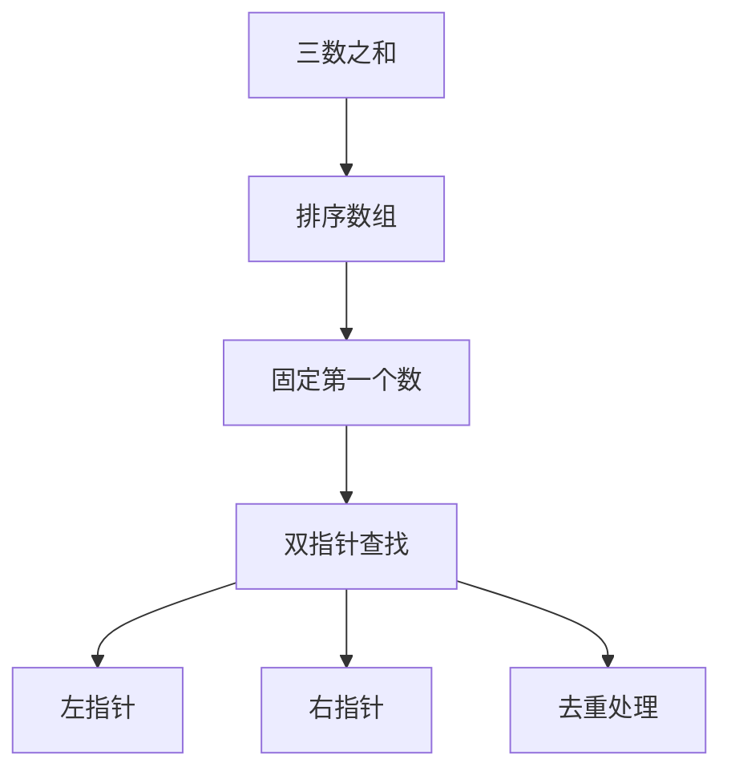
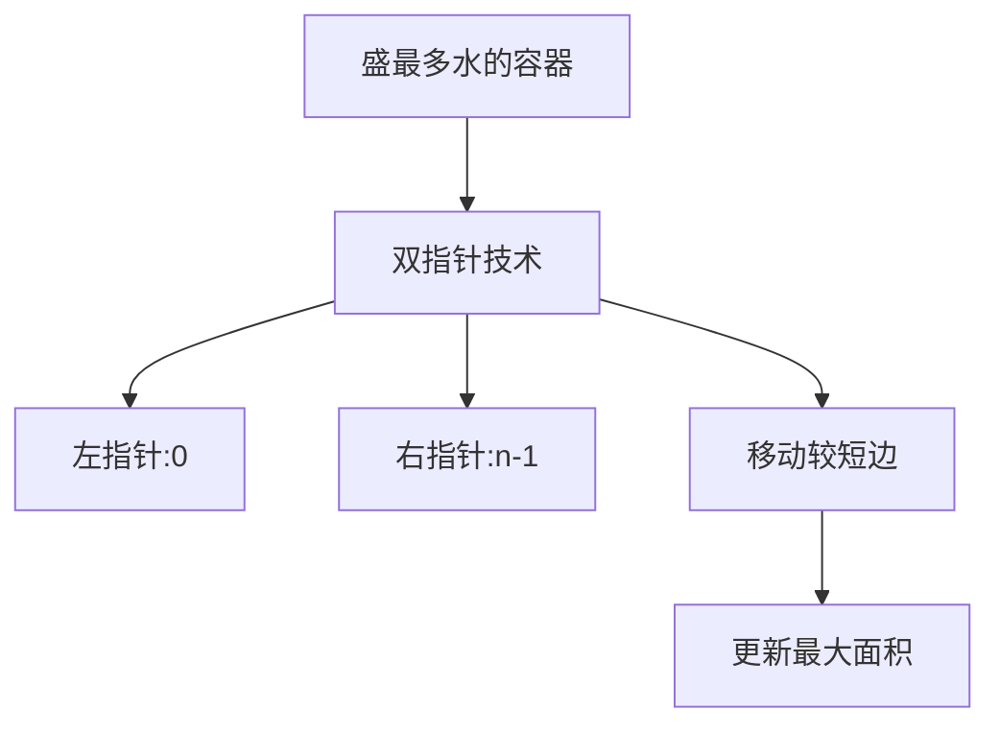
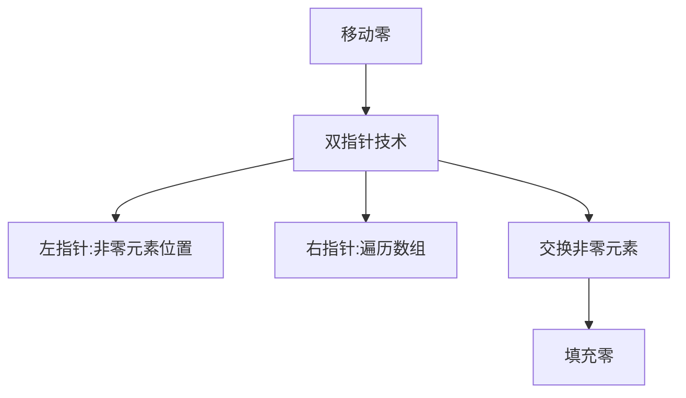
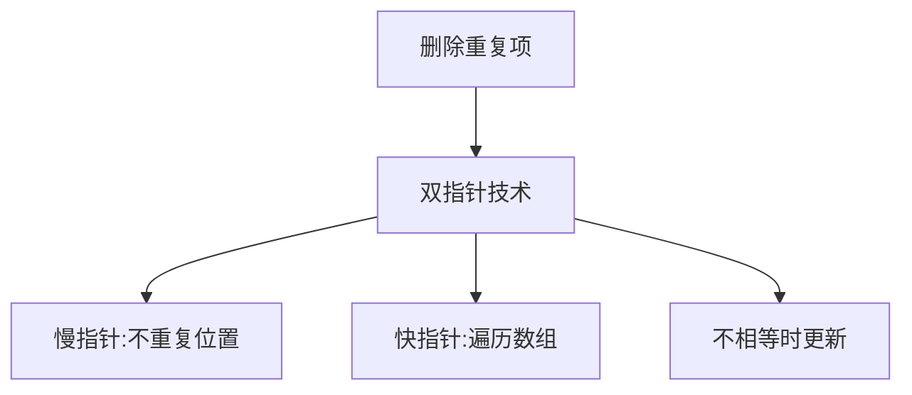
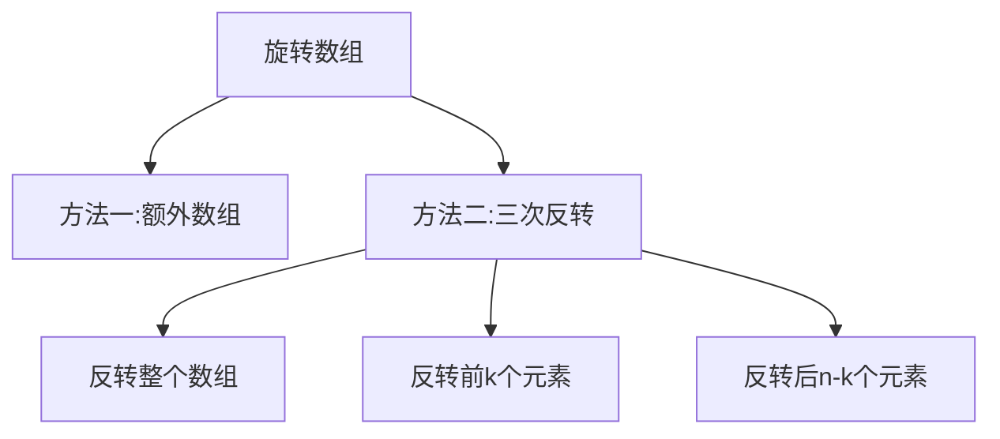

# 数组相关算法

数组是最基本的数据结构，具有以下特点：
- 元素在内存中连续存储
- 支持通过索引随机访问，时间复杂度为O(1)
- 插入和删除操作可能需要移动大量元素，时间复杂度为O(n)
- 大小固定（在大多数编程语言中）

## 数组的基本操作

```mermaid
graph TD
    A[数组操作] --> B[访问: O(1)]
    A --> C[搜索: O(n) 或 O(log n)]
    A --> D[插入: O(n)]
    A --> E[删除: O(n)]
```

1. **访问元素**：通过索引直接访问，时间复杂度O(1)
2. **搜索元素**：线性搜索时间复杂度O(n)，二分搜索时间复杂度O(log n)
3. **插入元素**：在末尾插入时间复杂度O(1)，在中间插入时间复杂度O(n)
4. **删除元素**：删除末尾元素时间复杂度O(1)，删除中间元素时间复杂度O(n)

## 经典数组算法题详解

### 1. 两数之和（Two Sum）

**题目描述**：给定一个整数数组 nums 和一个整数目标值 target，请你在该数组中找出和为目标值的那两个整数，并返回它们的数组下标。

**解题思路**：
- 方法一：暴力解法，双重循环遍历所有可能的组合
- 方法二：哈希表优化，一次遍历即可完成

```mermaid
graph TD
    A[两数之和] --> B[方法一:暴力解法]
    A --> C[方法二:哈希表优化]
    B --> D[时间复杂度:O(n²)]
    B --> E[空间复杂度:O(1)]
    C --> F[时间复杂度:O(n)]
    C --> G[空间复杂度:O(n)]
```

```javascript
// 方法一：暴力解法
function twoSumBruteForce(nums, target) {
  for (let i = 0; i < nums.length; i++) {
    for (let j = i + 1; j < nums.length; j++) {
      if (nums[i] + nums[j] === target) {
        return [i, j];
      }
    }
  }
  return [];
}
// 时间复杂度：O(n²)
// 空间复杂度：O(1)

// 方法二：哈希表优化
function twoSum(nums, target) {
  const map = new Map();
  
  for (let i = 0; i < nums.length; i++) {
    const complement = target - nums[i];
    
    if (map.has(complement)) {
      return [map.get(complement), i];
    }
    
    map.set(nums[i], i);
  }
  
  return [];
}
// 时间复杂度：O(n)
// 空间复杂度：O(n)
```

### 2. 三数之和（3Sum）

**题目描述**：给你一个包含 n 个整数的数组 nums，判断 nums 中是否存在三个元素 a，b，c ，使得 a + b + c = 0 ？请你找出所有和为 0 且不重复的三元组。

**解题思路**：
1. 先对数组进行排序
2. 固定一个数，然后使用双指针寻找另外两个数
3. 注意去重处理



```javascript
function threeSum(nums) {
  const result = [];
  nums.sort((a, b) => a - b); // 排序
  
  for (let i = 0; i < nums.length - 2; i++) {
    // 跳过重复元素
    if (i > 0 && nums[i] === nums[i - 1]) continue;
    
    let left = i + 1, right = nums.length - 1;
    
    while (left < right) {
      const sum = nums[i] + nums[left] + nums[right];
      
      if (sum === 0) {
        result.push([nums[i], nums[left], nums[right]]);
        
        // 跳过重复元素
        while (left < right && nums[left] === nums[left + 1]) left++;
        while (left < right && nums[right] === nums[right - 1]) right--;
        
        left++;
        right--;
      } else if (sum < 0) {
        left++;
      } else {
        right--;
      }
    }
  }
  
  return result;
}
// 时间复杂度：O(n²)
// 空间复杂度：O(1)
```

### 3. 盛最多水的容器（Container With Most Water）

**题目描述**：给定一个长度为 n 的整数数组 height 。有 n 条垂线，第 i 条线的两个端点是 (i, 0) 和 (i, height[i]) 。找出其中的两条线，使得它们与 x 轴共同构成的容器可以容纳最多的水。

**解题思路**：
- 使用双指针技术，从两端向中间移动
- 每次移动较短的那根垂线，因为这样可能获得更大的面积



```javascript
function maxArea(height) {
  let left = 0, right = height.length - 1;
  let maxArea = 0;
  
  while (left < right) {
    const area = Math.min(height[left], height[right]) * (right - left);
    maxArea = Math.max(maxArea, area);
    
    if (height[left] < height[right]) {
      left++;
    } else {
      right--;
    }
  }
  
  return maxArea;
}
// 时间复杂度：O(n)
// 空间复杂度：O(1)
```

### 4. 移动零（Move Zeroes）

**题目描述**：给定一个数组 nums，编写一个函数将所有 0 移动到数组的末尾，同时保持非零元素的相对顺序。

**解题思路**：
- 使用双指针技术，一个指针指向当前处理位置，另一个指针寻找非零元素



```javascript
function moveZeroes(nums) {
  let left = 0; // 指向下一个非零元素应该放置的位置
  
  // 将所有非零元素移动到数组前面
  for (let right = 0; right < nums.length; right++) {
    if (nums[right] !== 0) {
      nums[left] = nums[right];
      left++;
    }
  }
  
  // 将剩余位置填充为0
  for (let i = left; i < nums.length; i++) {
    nums[i] = 0;
  }
}
// 时间复杂度：O(n)
// 空间复杂度：O(1)
```

### 5. 删除排序数组中的重复项（Remove Duplicates from Sorted Array）

**题目描述**：给你一个非严格递增排列的数组 nums，请你原地删除重复出现的元素，使每个元素只出现一次，返回删除后数组的新长度。

**解题思路**：
- 使用双指针技术，一个指针指向不重复元素的位置，另一个指针遍历数组



```javascript
function removeDuplicates(nums) {
  if (nums.length === 0) return 0;
  
  let slow = 0; // 指向不重复元素的位置
  
  for (let fast = 1; fast < nums.length; fast++) {
    if (nums[fast] !== nums[slow]) {
      slow++;
      nums[slow] = nums[fast];
    }
  }
  
  return slow + 1;
}
// 时间复杂度：O(n)
// 空间复杂度：O(1)
```

### 6. 旋转数组（Rotate Array）

**题目描述**：给定一个数组，将数组中的元素向右轮转 k 个位置，其中 k 是非负数。

**解题思路**：
- 方法一：使用额外数组
- 方法二：三次反转（原地算法）



```javascript
// 方法一：使用额外数组
function rotateWithExtraSpace(nums, k) {
  const n = nums.length;
  const rotated = new Array(n);
  
  for (let i = 0; i < n; i++) {
    rotated[(i + k) % n] = nums[i];
  }
  
  for (let i = 0; i < n; i++) {
    nums[i] = rotated[i];
  }
}
// 时间复杂度：O(n)
// 空间复杂度：O(n)

// 方法二：三次反转（原地算法）
function rotate(nums, k) {
  const n = nums.length;
  k %= n; // 处理k大于数组长度的情况
  
  // 反转整个数组
  reverse(nums, 0, n - 1);
  // 反转前k个元素
  reverse(nums, 0, k - 1);
  // 反转后n-k个元素
  reverse(nums, k, n - 1);
}

function reverse(nums, start, end) {
  while (start < end) {
    [nums[start], nums[end]] = [nums[end], nums[start]];
    start++;
    end--;
  }
}
// 时间复杂度：O(n)
// 空间复杂度：O(1)
```

### 7. 寻找数组中第k大的元素（Kth Largest Element in an Array）

**题目描述**：给定整数数组 nums 和整数 k，请返回数组中第 k 个最大的元素。

**解题思路**：
- 方法一：排序后直接取值
- 方法二：使用最小堆
- 方法三：快速选择算法（最优解）

```mermaid
graph TD
    A[第k大元素] --> B[方法一:排序]
    A --> C[方法二:最小堆]
    A --> D[方法三:快速选择]
    B --> E[时间:O(n log n)]
    C --> F[时间:O(n log k)]
    D --> G[时间:O(n)]
```

```javascript
// 方法一：排序
function findKthLargestSort(nums, k) {
  nums.sort((a, b) => b - a);
  return nums[k - 1];
}
// 时间复杂度：O(n log n)
// 空间复杂度：O(1)

// 方法二：最小堆
class MinHeap {
  constructor() {
    this.heap = [];
  }
  
  push(val) {
    this.heap.push(val);
    this.bubbleUp(this.heap.length - 1);
  }
  
  pop() {
    if (this.heap.length === 1) return this.heap.pop();
    const top = this.heap[0];
    this.heap[0] = this.heap.pop();
    this.bubbleDown(0);
    return top;
  }
  
  peek() {
    return this.heap[0];
  }
  
  size() {
    return this.heap.length;
  }
  
  bubbleUp(index) {
    while (index > 0) {
      const parentIndex = Math.floor((index - 1) / 2);
      if (this.heap[parentIndex] <= this.heap[index]) break;
      [this.heap[parentIndex], this.heap[index]] = [this.heap[index], this.heap[parentIndex]];
      index = parentIndex;
    }
  }
  
  bubbleDown(index) {
    while (true) {
      let minIndex = index;
      const leftChild = 2 * index + 1;
      const rightChild = 2 * index + 2;
      
      if (leftChild < this.heap.length && this.heap[leftChild] < this.heap[minIndex]) {
        minIndex = leftChild;
      }
      
      if (rightChild < this.heap.length && this.heap[rightChild] < this.heap[minIndex]) {
        minIndex = rightChild;
      }
      
      if (minIndex === index) break;
      [this.heap[index], this.heap[minIndex]] = [this.heap[minIndex], this.heap[index]];
      index = minIndex;
    }
  }
}

function findKthLargestHeap(nums, k) {
  const minHeap = new MinHeap();
  
  for (const num of nums) {
    minHeap.push(num);
    if (minHeap.size() > k) {
      minHeap.pop();
    }
  }
  
  return minHeap.peek();
}
// 时间复杂度：O(n log k)
// 空间复杂度：O(k)

// 方法三：快速选择算法
function findKthLargest(nums, k) {
  return quickSelect(nums, 0, nums.length - 1, nums.length - k + 1);
}

function quickSelect(nums, left, right, k) {
  const pivotIndex = partition(nums, left, right);
  
  if (pivotIndex === k - 1) {
    return nums[pivotIndex];
  } else if (pivotIndex < k - 1) {
    return quickSelect(nums, pivotIndex + 1, right, k);
  } else {
    return quickSelect(nums, left, pivotIndex - 1, k);
  }
}

function partition(nums, left, right) {
  const pivot = nums[right];
  let i = left;
  
  for (let j = left; j < right; j++) {
    if (nums[j] <= pivot) {
      [nums[i], nums[j]] = [nums[j], nums[i]];
      i++;
    }
  }
  
  [nums[i], nums[right]] = [nums[right], nums[i]];
  return i;
}
// 平均时间复杂度：O(n)
// 最坏时间复杂度：O(n²)
// 空间复杂度：O(1)
```

## 数组算法总结

数组相关算法在前端面试中占据重要地位，主要考察点包括：

1. **双指针技术**：用于解决数组中的查找、去重、移动等问题
2. **哈希表优化**：将时间复杂度从O(n²)优化到O(n)
3. **排序预处理**：通过排序简化问题复杂度
4. **原地操作**：在不使用额外空间的情况下完成数组变换
5. **边界处理**：正确处理数组边界条件和特殊情况

掌握这些核心思想和经典题目，能够帮助我们在面试中快速解决数组相关的算法问题。
