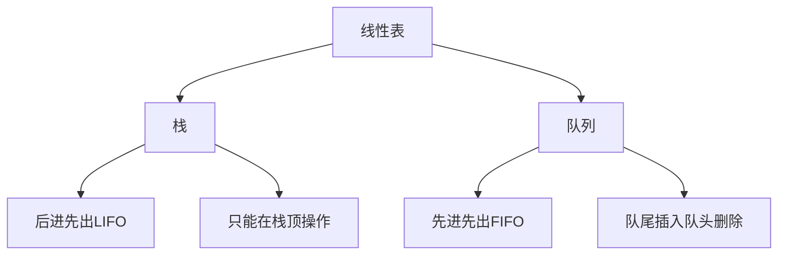
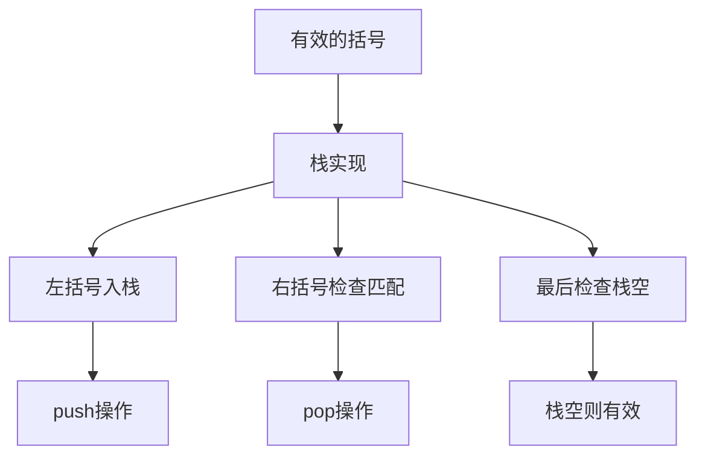
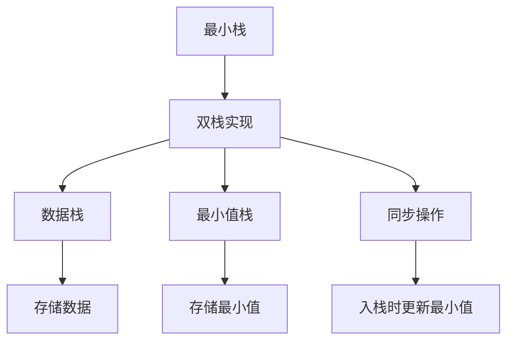
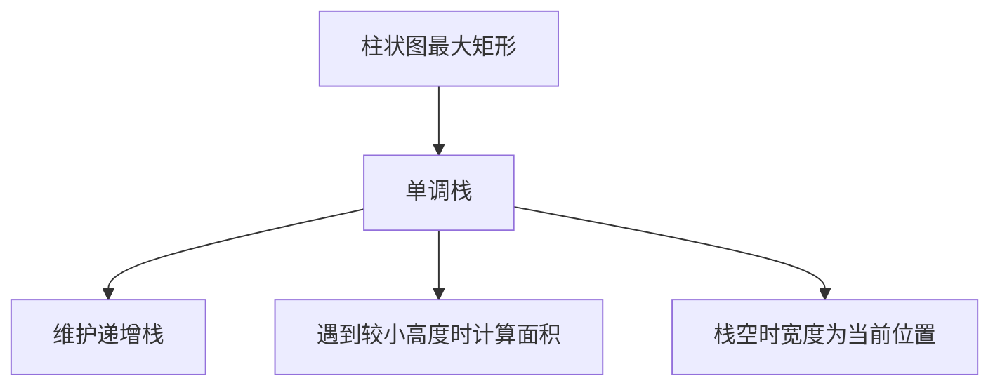
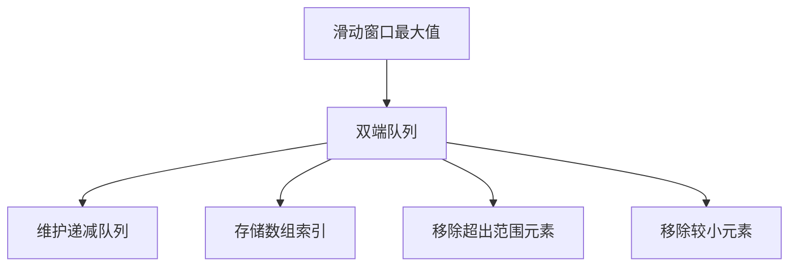
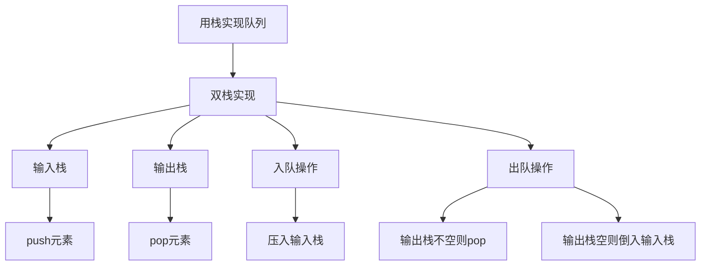
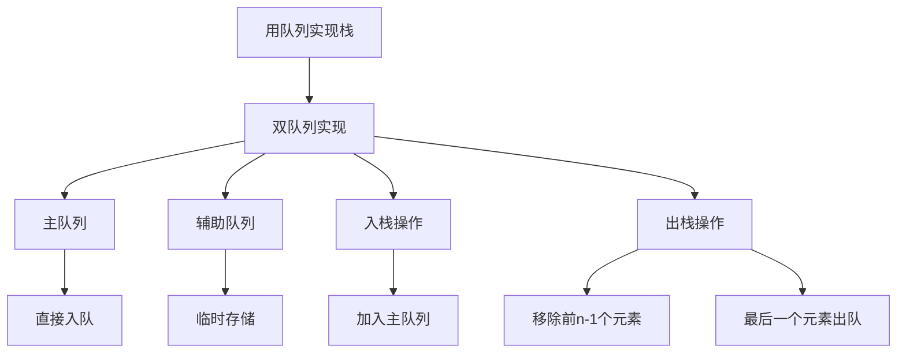
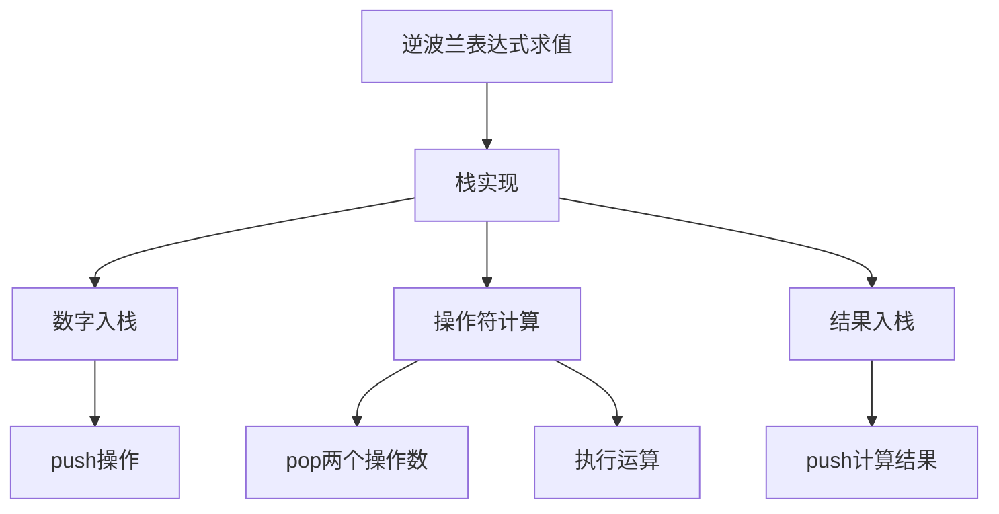
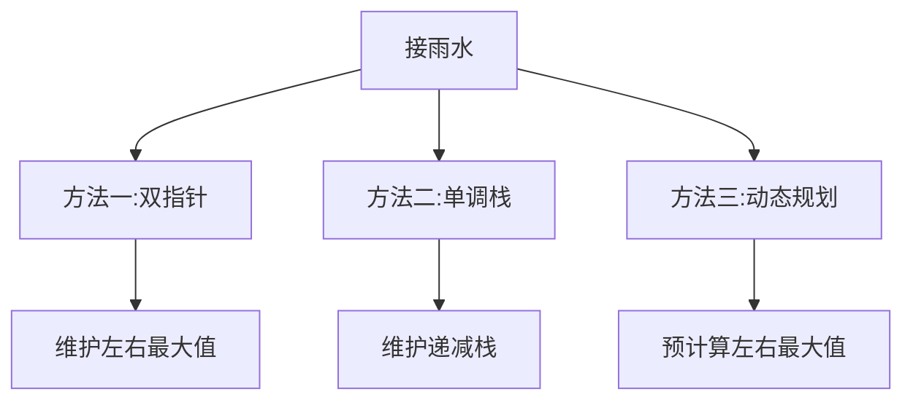

# 栈和队列相关算法

栈和队列是两种特殊的线性表，它们限制了元素的插入和删除位置。栈遵循后进先出（LIFO）的原则，队列遵循先进先出（FIFO）的原则。

## 栈和队列的基本概念



### 栈的基本操作

1. **push**：将元素压入栈顶
2. **pop**：弹出栈顶元素
3. **peek/top**：查看栈顶元素但不删除
4. **isEmpty**：检查栈是否为空

### 队列的基本操作

1. **enqueue**：在队尾插入元素
2. **dequeue**：从队头删除元素
3. **front**：查看队头元素但不删除
4. **isEmpty**：检查队列是否为空

## 栈和队列的实现

### 栈的实现

```javascript
class Stack {
  constructor() {
    this.items = [];
  }
  
  // 入栈
  push(element) {
    this.items.push(element);
  }
  
  // 出栈
  pop() {
    if (this.isEmpty()) {
      return null;
    }
    return this.items.pop();
  }
  
  // 查看栈顶元素
  peek() {
    if (this.isEmpty()) {
      return null;
    }
    return this.items[this.items.length - 1];
  }
  
  // 检查栈是否为空
  isEmpty() {
    return this.items.length === 0;
  }
  
  // 获取栈的大小
  size() {
    return this.items.length;
  }
  
  // 清空栈
  clear() {
    this.items = [];
  }
}
```

### 队列的实现

```javascript
class Queue {
  constructor() {
    this.items = [];
  }
  
  // 入队
  enqueue(element) {
    this.items.push(element);
  }
  
  // 出队
  dequeue() {
    if (this.isEmpty()) {
      return null;
    }
    return this.items.shift();
  }
  
  // 查看队头元素
  front() {
    if (this.isEmpty()) {
      return null;
    }
    return this.items[0];
  }
  
  // 检查队列是否为空
  isEmpty() {
    return this.items.length === 0;
  }
  
  // 获取队列的大小
  size() {
    return this.items.length;
  }
  
  // 清空队列
  clear() {
    this.items = [];
  }
}
```

## 经典栈和队列算法题详解

### 1. 有效的括号（Valid Parentheses）

**题目描述**：给定一个只包括 '('，')'，'{'，'}'，'['，']' 的字符串 s ，判断字符串是否有效。

**解题思路**：
- 使用栈来匹配括号
- 遇到左括号入栈
- 遇到右括号检查栈顶是否匹配
- 最后检查栈是否为空



```javascript
function isValid(s) {
  const stack = [];
  const map = {
    ')': '(',
    '}': '{',
    ']': '['
  };
  
  for (const char of s) {
    // 如果是右括号
    if (map[char]) {
      // 检查栈顶是否匹配
      if (stack.length === 0 || stack.pop() !== map[char]) {
        return false;
      }
    } else {
      // 左括号入栈
      stack.push(char);
    }
  }
  
  // 栈空则有效
  return stack.length === 0;
}
// 时间复杂度：O(n)
// 空间复杂度：O(n)
```

### 2. 最小栈（Min Stack）

**题目描述**：设计一个支持 push ，pop ，top 操作，并能在常数时间内检索到最小元素的栈。

**解题思路**：
- 使用辅助栈存储最小值
- 每次入栈时，将当前最小值入辅助栈
- 出栈时同时出栈两个栈



```javascript
class MinStack {
  constructor() {
    this.stack = [];
    this.minStack = [];  // 辅助栈，存储最小值
  }
  
  push(val) {
    this.stack.push(val);
    
    // 更新最小值栈
    if (this.minStack.length === 0 || val <= this.minStack[this.minStack.length - 1]) {
      this.minStack.push(val);
    }
  }
  
  pop() {
    if (this.stack.length === 0) return;
    
    const val = this.stack.pop();
    
    // 如果弹出的是最小值，也从最小值栈中弹出
    if (val === this.minStack[this.minStack.length - 1]) {
      this.minStack.pop();
    }
  }
  
  top() {
    if (this.stack.length === 0) return null;
    return this.stack[this.stack.length - 1];
  }
  
  getMin() {
    if (this.minStack.length === 0) return null;
    return this.minStack[this.minStack.length - 1];
  }
}
// 时间复杂度：所有操作都是O(1)
// 空间复杂度：O(n)
```

### 3. 柱状图中最大的矩形（Largest Rectangle in Histogram）

**题目描述**：给定 n 个非负整数，用来表示柱状图中各个柱子的高度。每个柱子彼此相邻，且宽度为 1 。求在该柱状图中，能够勾勒出来的矩形的最大面积。

**解题思路**：
- 使用单调栈
- 维护一个单调递增的栈
- 当遇到较小高度时，计算以栈顶为高的矩形面积



```javascript
function largestRectangleArea(heights) {
  const stack = [];  // 单调递增栈，存储索引
  let maxArea = 0;
  
  // 在末尾添加0，确保所有元素都能被处理
  heights.push(0);
  
  for (let i = 0; i < heights.length; i++) {
    // 当前高度小于栈顶高度时，计算以栈顶为高的矩形面积
    while (stack.length > 0 && heights[i] < heights[stack[stack.length - 1]]) {
      const height = heights[stack.pop()];  // 矩形高度
      const width = stack.length === 0 ? i : i - stack[stack.length - 1] - 1;  // 矩形宽度
      maxArea = Math.max(maxArea, height * width);
    }
    stack.push(i);
  }
  
  // 移除添加的0
  heights.pop();
  
  return maxArea;
}
// 时间复杂度：O(n)
// 空间复杂度：O(n)
```

### 4. 滑动窗口最大值（Sliding Window Maximum）

**题目描述**：给你一个整数数组 nums，有一个大小为 k 的滑动窗口从数组的最左侧移动到数组的最右侧。你只可以看到在滑动窗口内的 k 个数字。滑动窗口每次只向右移动一位。返回滑动窗口中的最大值。

**解题思路**：
- 使用双端队列维护窗口中的最大值
- 队列中存储数组索引，保持递减顺序
- 移除超出窗口范围的元素
- 移除小于当前元素的队尾元素



```javascript
function maxSlidingWindow(nums, k) {
  if (nums.length === 0 || k === 0) return [];
  
  const result = [];
  const deque = [];  // 双端队列，存储数组索引
  
  for (let i = 0; i < nums.length; i++) {
    // 移除超出窗口范围的元素
    while (deque.length > 0 && deque[0] < i - k + 1) {
      deque.shift();
    }
    
    // 移除小于当前元素的队尾元素
    while (deque.length > 0 && nums[deque[deque.length - 1]] < nums[i]) {
      deque.pop();
    }
    
    // 当前元素入队
    deque.push(i);
    
    // 当窗口大小达到k时，记录最大值
    if (i >= k - 1) {
      result.push(nums[deque[0]]);
    }
  }
  
  return result;
}
// 时间复杂度：O(n)
// 空间复杂度：O(k)
```

### 5. 用栈实现队列（Implement Queue using Stacks）

**题目描述**：请你仅使用两个栈实现先入先出队列。队列应当支持一般队列支持的所有操作（push、pop、peek、empty）。

**解题思路**：
- 使用两个栈：输入栈和输出栈
- 入队时压入输入栈
- 出队时从输出栈弹出，如果输出栈为空，则将输入栈的所有元素倒入输出栈



```javascript
class MyQueue {
  constructor() {
    this.inputStack = [];   // 输入栈
    this.outputStack = [];  // 输出栈
  }
  
  push(x) {
    // 入队时直接压入输入栈
    this.inputStack.push(x);
  }
  
  pop() {
    // 如果输出栈为空，将输入栈的所有元素倒入输出栈
    if (this.outputStack.length === 0) {
      while (this.inputStack.length > 0) {
        this.outputStack.push(this.inputStack.pop());
      }
    }
    
    // 从输出栈弹出元素
    return this.outputStack.pop();
  }
  
  peek() {
    // 如果输出栈为空，将输入栈的所有元素倒入输出栈
    if (this.outputStack.length === 0) {
      while (this.inputStack.length > 0) {
        this.outputStack.push(this.inputStack.pop());
      }
    }
    
    // 查看输出栈栈顶元素
    return this.outputStack[this.outputStack.length - 1];
  }
  
  empty() {
    // 两个栈都为空时队列为空
    return this.inputStack.length === 0 && this.outputStack.length === 0;
  }
}
// 时间复杂度：入队O(1)，出队均摊O(1)
// 空间复杂度：O(n)
```

### 6. 用队列实现栈（Implement Stack using Queues）

**题目描述**：请你仅使用两个队列实现一个后入先出（LIFO）的栈，并支持普通栈的全部四种操作（push、top、pop 和 empty）。

**解题思路**：
- 使用两个队列：主队列和辅助队列
- 入栈时直接加入主队列
- 出栈时将主队列前n-1个元素移到辅助队列，最后一个元素出队，然后交换两个队列



```javascript
class MyStack {
  constructor() {
    this.queue1 = [];  // 主队列
    this.queue2 = [];  // 辅助队列
  }
  
  push(x) {
    // 入栈时直接加入主队列
    this.queue1.push(x);
  }
  
  pop() {
    // 将主队列前n-1个元素移到辅助队列
    while (this.queue1.length > 1) {
      this.queue2.push(this.queue1.shift());
    }
    
    // 最后一个元素出队（即栈顶元素）
    const top = this.queue1.shift();
    
    // 交换两个队列
    [this.queue1, this.queue2] = [this.queue2, this.queue1];
    
    return top;
  }
  
  top() {
    // 将主队列前n-1个元素移到辅助队列
    while (this.queue1.length > 1) {
      this.queue2.push(this.queue1.shift());
    }
    
    // 查看最后一个元素
    const top = this.queue1[0];
    
    // 将最后一个元素也移到辅助队列
    this.queue2.push(this.queue1.shift());
    
    // 交换两个队列
    [this.queue1, this.queue2] = [this.queue2, this.queue1];
    
    return top;
  }
  
  empty() {
    // 主队列为空时栈为空
    return this.queue1.length === 0;
  }
}
// 时间复杂度：入栈O(1)，出栈O(n)
// 空间复杂度：O(n)
```

### 7. 逆波兰表达式求值（Evaluate Reverse Polish Notation）

**题目描述**：根据逆波兰表示法，求该后缀表达式的计算结果。有效的算符包括 +、-、*、/ 。每个运算对象可以是整数，也可以是另一个逆波兰表达式。

**解题思路**：
- 使用栈存储操作数
- 遇到数字入栈
- 遇到操作符出栈两个操作数进行计算，结果入栈



```javascript
function evalRPN(tokens) {
  const stack = [];
  
  for (const token of tokens) {
    if (['+', '-', '*', '/'].includes(token)) {
      // 遇到操作符，出栈两个操作数
      const b = stack.pop();
      const a = stack.pop();
      
      // 执行运算
      switch (token) {
        case '+':
          stack.push(a + b);
          break;
        case '-':
          stack.push(a - b);
          break;
        case '*':
          stack.push(a * b);
          break;
        case '/':
          // 向零截断
          stack.push(Math.trunc(a / b));
          break;
      }
    } else {
      // 遇到数字，入栈
      stack.push(parseInt(token));
    }
  }
  
  return stack[0];
}
// 时间复杂度：O(n)
// 空间复杂度：O(n)
```

### 8. 接雨水（Trapping Rain Water）

**题目描述**：给定 n 个非负整数表示每个宽度为 1 的柱子的高度图，计算按此排列的柱子，下雨之后能接多少雨水。

**解题思路**：
- 方法一：双指针
- 方法二：单调栈
- 方法三：动态规划



```javascript
// 方法一：双指针
function trapTwoPointers(height) {
  if (height.length === 0) return 0;
  
  let left = 0, right = height.length - 1;
  let leftMax = 0, rightMax = 0;
  let water = 0;
  
  while (left < right) {
    if (height[left] < height[right]) {
      if (height[left] >= leftMax) {
        leftMax = height[left];
      } else {
        water += leftMax - height[left];
      }
      left++;
    } else {
      if (height[right] >= rightMax) {
        rightMax = height[right];
      } else {
        water += rightMax - height[right];
      }
      right--;
    }
  }
  
  return water;
}
// 时间复杂度：O(n)
// 空间复杂度：O(1)

// 方法二：单调栈
function trapMonotonicStack(height) {
  const stack = [];
  let water = 0;
  
  for (let i = 0; i < height.length; i++) {
    while (stack.length > 0 && height[i] > height[stack[stack.length - 1]]) {
      const bottom = stack.pop();
      
      if (stack.length === 0) break;
      
      const left = stack[stack.length - 1];
      const width = i - left - 1;
      const h = Math.min(height[left], height[i]) - height[bottom];
      water += width * h;
    }
    stack.push(i);
  }
  
  return water;
}
// 时间复杂度：O(n)
// 空间复杂度：O(n)
```

## 栈和队列算法总结

栈和队列相关算法是前端面试中的重要考点，主要考察点包括：

1. **基本操作**：掌握栈和队列的基本操作实现
2. **应用场景**：理解栈和队列在括号匹配、表达式求值等问题中的应用
3. **单调栈/队列**：掌握单调栈和单调队列的使用场景
4. **数据结构转换**：理解如何用栈实现队列，用队列实现栈
5. **复杂度分析**：正确分析栈和队列操作的时间和空间复杂度

栈和队列的应用场景：
- 函数调用栈
- 表达式求值
- 括号匹配
- 浏览器历史记录
- BFS和DFS算法实现
- 缓存淘汰策略

掌握这些核心思想和经典题目，能够帮助我们在面试中快速解决栈和队列相关的算法问题。