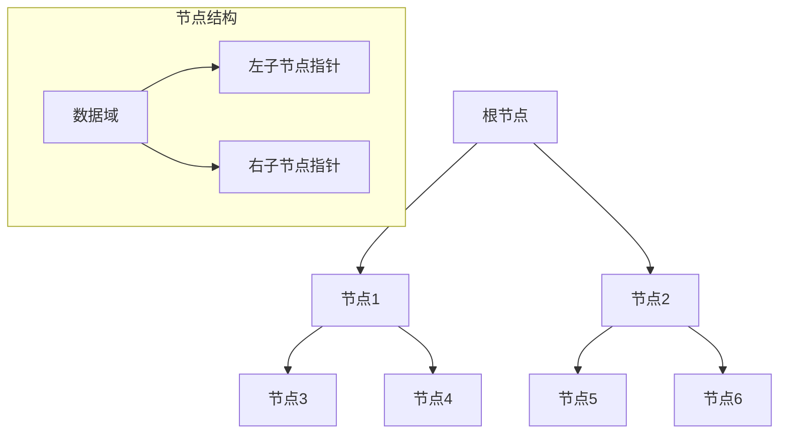
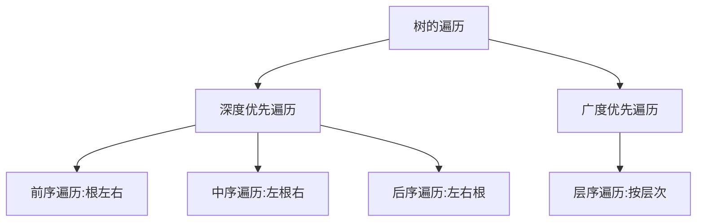
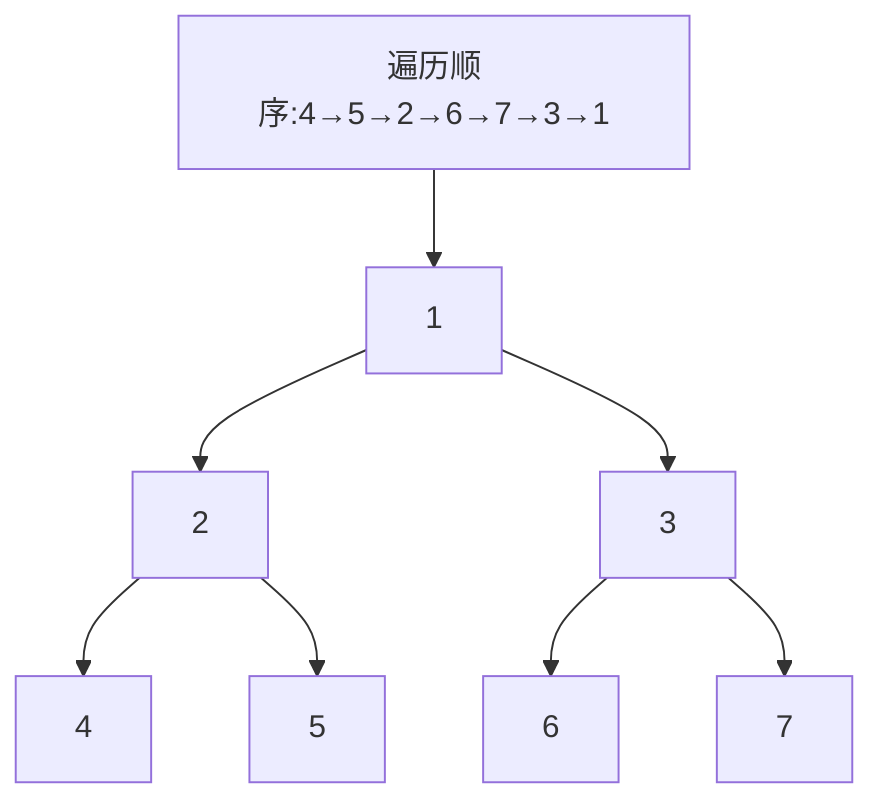
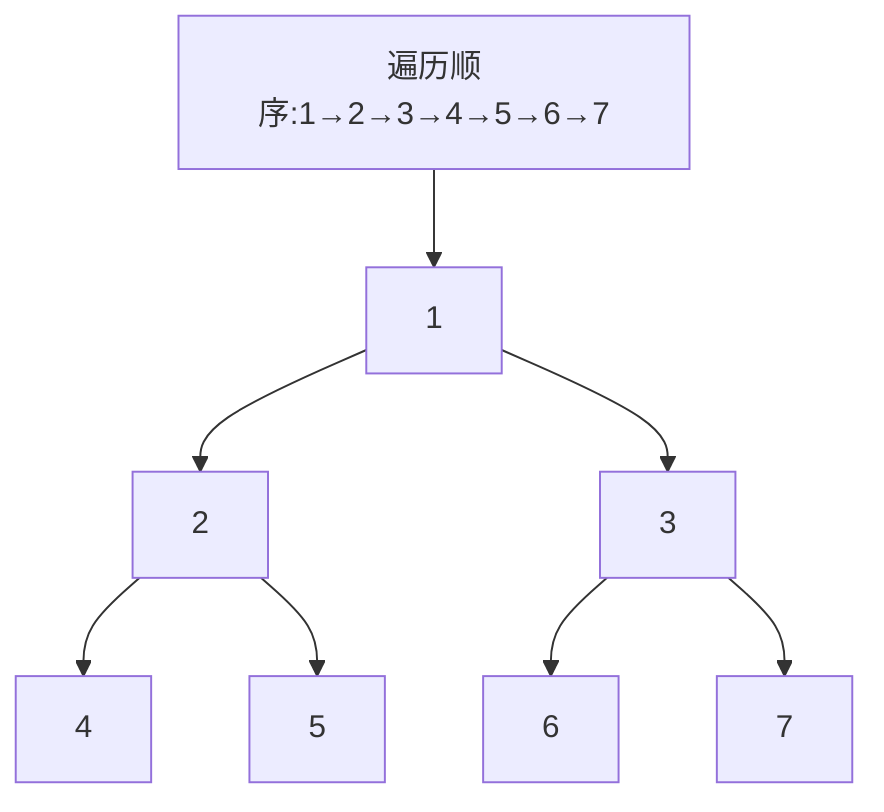
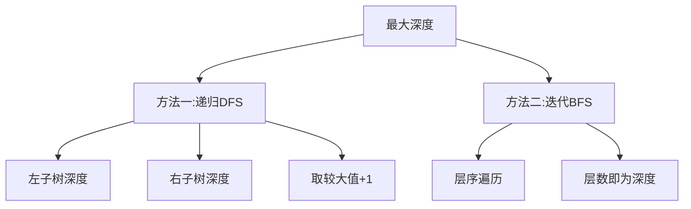
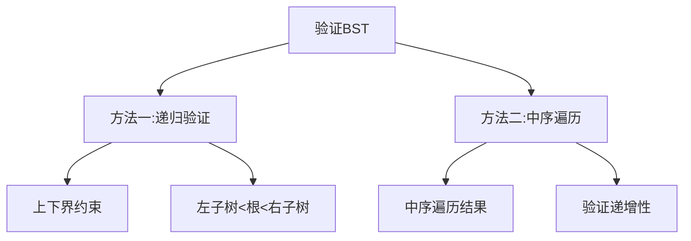
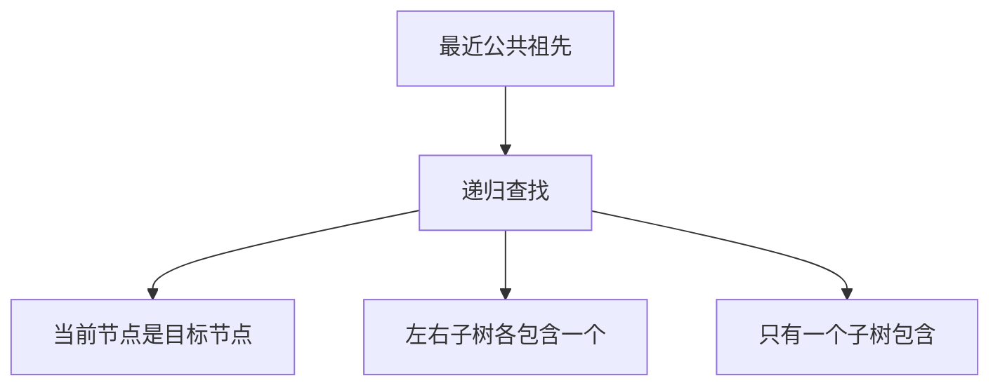
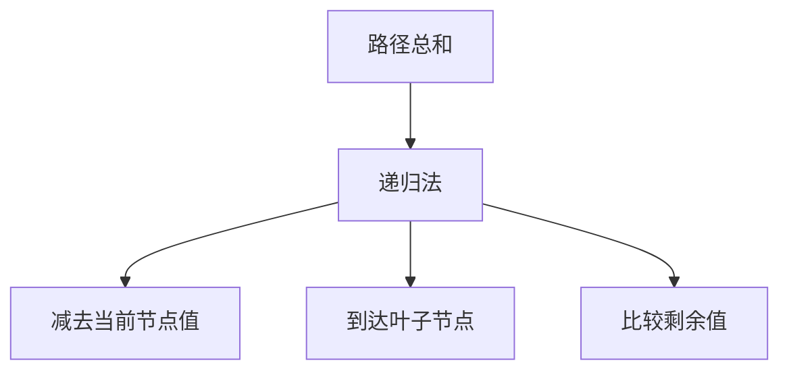
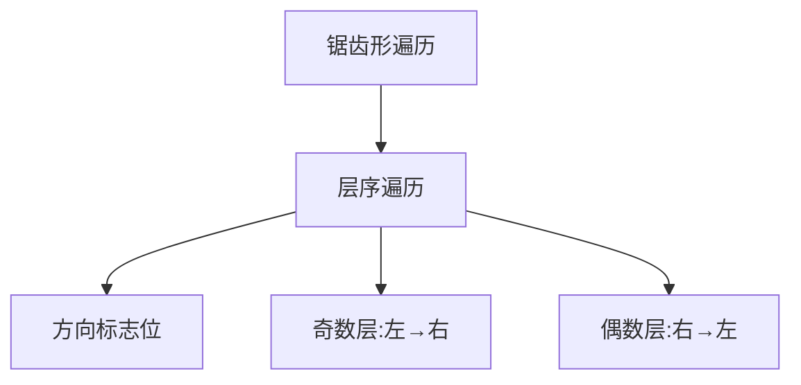
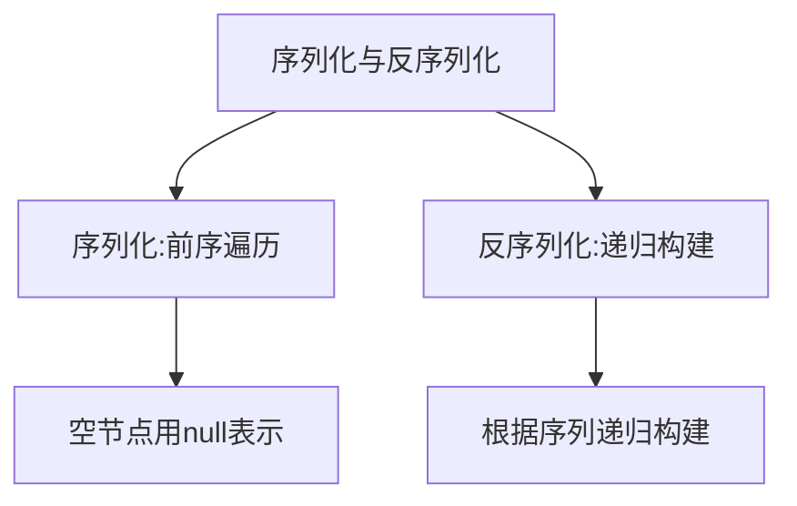

# 树相关算法

树是一种层次结构的数据结构，具有以下特点：
- 每个节点最多有一个父节点（根节点除外）
- 每个节点可以有多个子节点
- 常见的有二叉树、二叉搜索树、平衡二叉树等

## 树的基本结构



```javascript
// 二叉树节点定义
class TreeNode {
  constructor(val, left, right) {
    this.val = (val === undefined ? 0 : val);
    this.left = (left === undefined ? null : left);
    this.right = (right === undefined ? null : right);
  }
}
```

## 树的遍历方式



### 前序遍历（Preorder Traversal）


```javascript
// 递归实现
function preorderTraversalRecursive(root) {
  const result = [];
  
  function preorder(node) {
    if (node === null) return;
    
    result.push(node.val);      // 访问根节点
    preorder(node.left);        // 遍历左子树
    preorder(node.right);       // 遍历右子树
  }
  
  preorder(root);
  return result;
}

// 迭代实现
function preorderTraversalIterative(root) {
  if (root === null) return [];
  
  const result = [];
  const stack = [root];
  
  while (stack.length > 0) {
    const node = stack.pop();
    result.push(node.val);
    
    // 先压入右子树，再压入左子树（因为栈是后进先出）
    if (node.right !== null) {
      stack.push(node.right);
    }
    if (node.left !== null) {
      stack.push(node.left);
    }
  }
  
  return result;
}
// 时间复杂度：O(n)
// 空间复杂度：O(h)，h为树的高度
```

### 中序遍历（Inorder Traversal）


```javascript
// 递归实现
function inorderTraversalRecursive(root) {
  const result = [];
  
  function inorder(node) {
    if (node === null) return;
    
    inorder(node.left);         // 遍历左子树
    result.push(node.val);      // 访问根节点
    inorder(node.right);        // 遍历右子树
  }
  
  inorder(root);
  return result;
}

// 迭代实现
function inorderTraversalIterative(root) {
  const result = [];
  const stack = [];
  let current = root;
  
  while (current !== null || stack.length > 0) {
    // 一直向左走到底
    while (current !== null) {
      stack.push(current);
      current = current.left;
    }
    
    // 处理栈顶节点
    current = stack.pop();
    result.push(current.val);
    
    // 转向右子树
    current = current.right;
  }
  
  return result;
}
// 时间复杂度：O(n)
// 空间复杂度：O(h)
```

### 后序遍历（Postorder Traversal）



```javascript
// 递归实现
function postorderTraversalRecursive(root) {
  const result = [];
  
  function postorder(node) {
    if (node === null) return;
    
    postorder(node.left);       // 遍历左子树
    postorder(node.right);      // 遍历右子树
    result.push(node.val);      // 访问根节点
  }
  
  postorder(root);
  return result;
}

// 迭代实现
function postorderTraversalIterative(root) {
  if (root === null) return [];
  
  const result = [];
  const stack = [root];
  
  while (stack.length > 0) {
    const node = stack.pop();
    result.unshift(node.val);  // 在数组开头插入
    
    // 先压入左子树，再压入右子树
    if (node.left !== null) {
      stack.push(node.left);
    }
    if (node.right !== null) {
      stack.push(node.right);
    }
  }
  
  return result;
}
// 时间复杂度：O(n)
// 空间复杂度：O(h)
```

### 层序遍历（Level Order Traversal）



```javascript
function levelOrder(root) {
  if (root === null) return [];
  
  const queue = [root];
  const result = [];
  
  while (queue.length > 0) {
    const levelSize = queue.length;
    const currentLevel = [];
    
    for (let i = 0; i < levelSize; i++) {
      const node = queue.shift();
      currentLevel.push(node.val);
      
      if (node.left !== null) {
        queue.push(node.left);
      }
      if (node.right !== null) {
        queue.push(node.right);
      }
    }
    
    result.push(currentLevel);
  }
  
  return result;
}
// 时间复杂度：O(n)
// 空间复杂度：O(w)，w为树的最大宽度
```

## 经典树算法题详解

### 1. 二叉树的最大深度（Maximum Depth of Binary Tree）

**题目描述**：给定一个二叉树，找出其最大深度。二叉树的深度为根节点到最远叶子节点的最长路径上的节点数。

**解题思路**：
- 方法一：递归法，深度优先搜索
- 方法二：迭代法，广度优先搜索



```javascript
// 方法一：递归法（深度优先搜索）
function maxDepthRecursive(root) {
  if (root === null) return 0;
  
  const leftDepth = maxDepthRecursive(root.left);
  const rightDepth = maxDepthRecursive(root.right);
  
  return Math.max(leftDepth, rightDepth) + 1;
}
// 时间复杂度：O(n)
// 空间复杂度：O(h)

// 方法二：迭代法（广度优先搜索）
function maxDepthIterative(root) {
  if (root === null) return 0;
  
  const queue = [root];
  let depth = 0;
  
  while (queue.length > 0) {
    const levelSize = queue.length;
    depth++;
    
    for (let i = 0; i < levelSize; i++) {
      const node = queue.shift();
      
      if (node.left !== null) {
        queue.push(node.left);
      }
      if (node.right !== null) {
        queue.push(node.right);
      }
    }
  }
  
  return depth;
}
// 时间复杂度：O(n)
// 空间复杂度：O(w)
```

### 2. 验证二叉搜索树（Validate Binary Search Tree）

**题目描述**：给你一个二叉树的根节点 root ，判断其是否是一个有效的二叉搜索树。

**解题思路**：
- 方法一：递归法，验证每个节点是否满足BST性质
- 方法二：中序遍历，验证结果是否为严格递增序列



```javascript
// 方法一：递归法（上下界约束）
function isValidBST(root) {
  function validate(node, min, max) {
    if (node === null) return true;
    
    // 检查当前节点是否满足约束
    if (node.val <= min || node.val >= max) {
      return false;
    }
    
    // 递归验证左右子树
    return validate(node.left, min, node.val) && 
           validate(node.right, node.val, max);
  }
  
  return validate(root, -Infinity, Infinity);
}
// 时间复杂度：O(n)
// 空间复杂度：O(h)

// 方法二：中序遍历
function isValidBSTInorder(root) {
  let prev = -Infinity;
  
  function inorder(node) {
    if (node === null) return true;
    
    // 遍历左子树
    if (!inorder(node.left)) return false;
    
    // 检查当前节点
    if (node.val <= prev) return false;
    prev = node.val;
    
    // 遍历右子树
    return inorder(node.right);
  }
  
  return inorder(root);
}
// 时间复杂度：O(n)
// 空间复杂度：O(h)
```

### 3. 二叉树的最近公共祖先（Lowest Common Ancestor of a Binary Tree）

**题目描述**：给定一个二叉树, 找到该树中两个指定节点的最近公共祖先。

**解题思路**：
- 递归法，自底向上查找
- 如果当前节点是目标节点之一，则返回当前节点
- 如果左右子树分别包含两个目标节点，则当前节点就是LCA
- 如果只有一个子树包含目标节点，则返回该子树的结果



```javascript
function lowestCommonAncestor(root, p, q) {
  // 基础情况
  if (root === null || root === p || root === q) {
    return root;
  }
  
  // 递归查找左右子树
  const left = lowestCommonAncestor(root.left, p, q);
  const right = lowestCommonAncestor(root.right, p, q);
  
  // 如果左右子树都找到了目标节点，则当前节点是LCA
  if (left !== null && right !== null) {
    return root;
  }
  
  // 返回非空的结果
  return left !== null ? left : right;
}
// 时间复杂度：O(n)
// 空间复杂度：O(h)
```

### 4. 路径总和（Path Sum）

**题目描述**：给你二叉树的根节点 root 和一个表示目标和的整数 targetSum ，判断该树中是否存在根节点到叶子节点的路径，这条路径上所有节点值相加等于目标和 targetSum 。

**解题思路**：
- 递归法，从根节点开始，每到一个节点就将目标和减去当前节点值
- 当到达叶子节点时，检查剩余目标和是否等于叶子节点值



```javascript
function hasPathSum(root, targetSum) {
  // 空树
  if (root === null) return false;
  
  // 叶子节点
  if (root.left === null && root.right === null) {
    return root.val === targetSum;
  }
  
  // 递归检查左右子树
  const remaining = targetSum - root.val;
  return hasPathSum(root.left, remaining) || 
         hasPathSum(root.right, remaining);
}
// 时间复杂度：O(n)
// 空间复杂度：O(h)
```

### 5. 二叉树的锯齿形层序遍历（Binary Tree Zigzag Level Order Traversal）

**题目描述**：给你二叉树的根节点 root ，返回其节点值的锯齿形层序遍历。（即先从左往右，再从右往左进行下一层遍历，以此类推，层与层之间交替进行）

**解题思路**：
- 层序遍历的基础上，使用一个标志位控制每层的遍历方向
- 使用双端队列或在每层结束后反转数组



```javascript
function zigzagLevelOrder(root) {
  if (root === null) return [];
  
  const queue = [root];
  const result = [];
  let leftToRight = true;  // 控制遍历方向
  
  while (queue.length > 0) {
    const levelSize = queue.length;
    const currentLevel = [];
    
    for (let i = 0; i < levelSize; i++) {
      const node = queue.shift();
      
      // 根据方向决定插入位置
      if (leftToRight) {
        currentLevel.push(node.val);
      } else {
        currentLevel.unshift(node.val);
      }
      
      if (node.left !== null) {
        queue.push(node.left);
      }
      if (node.right !== null) {
        queue.push(node.right);
      }
    }
    
    result.push(currentLevel);
    leftToRight = !leftToRight;  // 切换方向
  }
  
  return result;
}
// 时间复杂度：O(n)
// 空间复杂度：O(w)
```

### 6. 二叉树的序列化与反序列化（Serialize and Deserialize Binary Tree）

**题目描述**：序列化是将一个数据结构或者对象转换为连续的比特位，进而可以将转换后的数据存储在一个文件或者内存中，同时也可以通过网络传输到另一个计算机环境，采取相反方式重构得到原数据。

**解题思路**：
- 序列化：使用前序遍历，将空节点表示为特殊字符
- 反序列化：根据序列化的结果，递归构建树



```javascript
// 序列化
function serialize(root) {
  if (root === null) {
    return "null";
  }
  
  const left = serialize(root.left);
  const right = serialize(root.right);
  
  return root.val + "," + left + "," + right;
}

// 反序列化
function deserialize(data) {
  const nodes = data.split(",");
  let index = 0;
  
  function buildTree() {
    if (index >= nodes.length || nodes[index] === "null") {
      index++;
      return null;
    }
    
    const node = new TreeNode(parseInt(nodes[index]));
    index++;
    
    node.left = buildTree();
    node.right = buildTree();
    
    return node;
  }
  
  return buildTree();
}
// 时间复杂度：O(n)
// 空间复杂度：O(n)
```

## 树算法总结

树相关算法在前端面试中是非常重要的考点，主要考察点包括：

1. **遍历算法**：掌握前序、中序、后序、层序遍历的递归和迭代实现
2. **递归思想**：树结构天然适合递归解决，掌握递归的思维方式
3. **BST性质**：理解二叉搜索树的特性并能灵活运用
4. **路径问题**：处理从根到叶节点的路径相关问题
5. **公共祖先**：掌握最近公共祖先的查找方法
6. **序列化**：理解树结构的序列化与反序列化

掌握这些核心思想和经典题目，能够帮助我们在面试中快速解决树相关的算法问题。