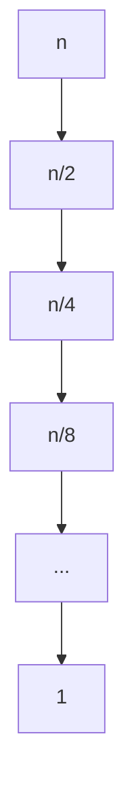
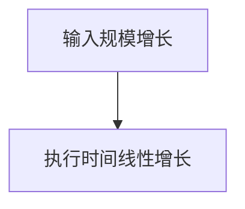
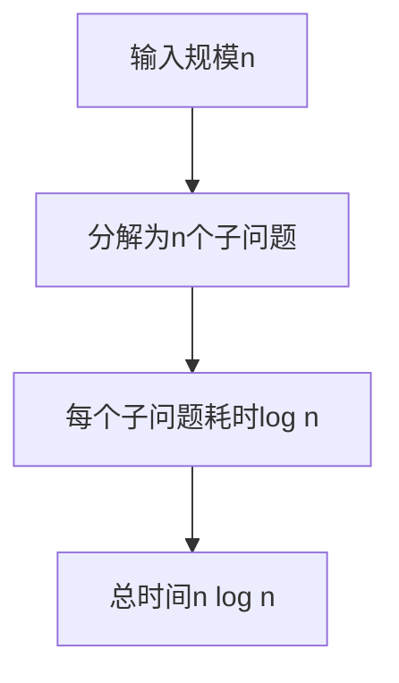
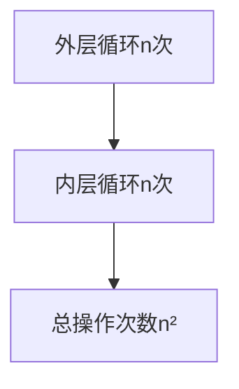
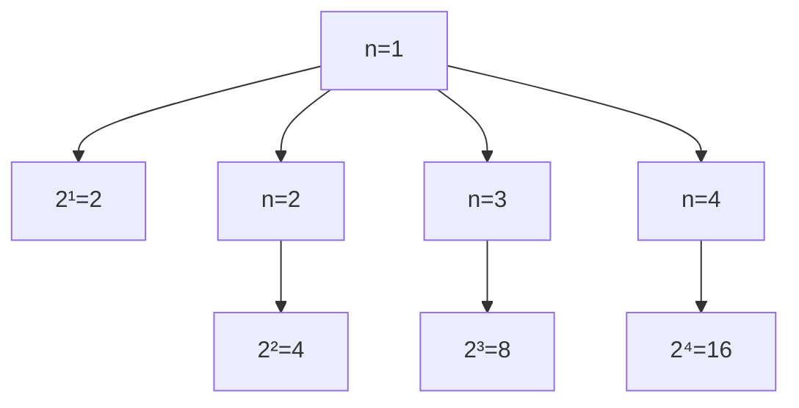
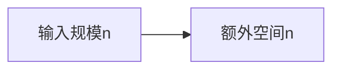
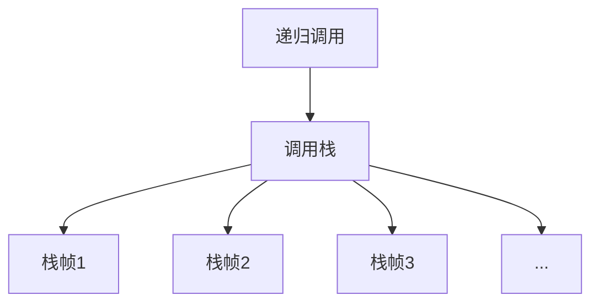
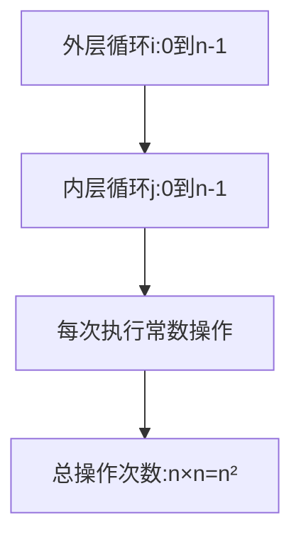
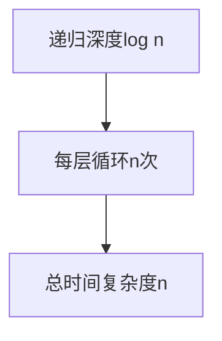

### 大O表示法

大O表示法是描述算法时间复杂度的数学符号，它表示算法执行时间的上界。常见的复杂度等级（按效率从高到低）：

```mermaid
graph TD
    A[O(1) - 常数时间] --> B[O(log n) - 对数时间]
    B --> C[O(n) - 线性时间]
    C --> D[O(n log n) - 线性对数时间]
    D --> E[O(n²) - 平方时间]
    E --> F[O(2ⁿ) - 指数时间]
```

### 常见时间复杂度详解

#### 1. O(1) - 常数时间复杂度

算法执行时间不随输入规模变化。


示例代码：
```javascript
// O(1) 示例
function getFirstElement(arr) {
  return arr[0]; // 无论数组多大，都只需要一次操作
}
```

#### 2. O(log n) - 对数时间复杂度

算法每次操作都能将问题规模减半。



示例代码：
```javascript
// O(log n) 示例：二分查找
function binarySearch(arr, target) {
  let left = 0, right = arr.length - 1;
  
  while (left <= right) {
    const mid = Math.floor((left + right) / 2);
    if (arr[mid] === target) return mid;
    if (arr[mid] < target) left = mid + 1;
    else right = mid - 1;
  }
  
  return -1;
}
```

#### 3. O(n) - 线性时间复杂度

算法执行时间与输入规模成正比。



示例代码：
```javascript
// O(n) 示例：线性查找
function linearSearch(arr, target) {
  for (let i = 0; i < arr.length; i++) {
    if (arr[i] === target) return i;
  }
  return -1;
}
```

#### 4. O(n log n) - 线性对数时间复杂度

常见于高效的排序算法。



示例代码：
```javascript
// O(n log n) 示例：归并排序
function mergeSort(arr) {
  if (arr.length <= 1) return arr;
  
  const mid = Math.floor(arr.length / 2);
  const left = mergeSort(arr.slice(0, mid));
  const right = mergeSort(arr.slice(mid));
  
  return merge(left, right);
}
```

#### 5. O(n²) - 平方时间复杂度

算法包含嵌套循环，每层循环都与输入规模相关。



示例代码：
```javascript
// O(n²) 示例：冒泡排序
function bubbleSort(arr) {
  const n = arr.length;
  for (let i = 0; i < n - 1; i++) {
    for (let j = 0; j < n - i - 1; j++) {
      if (arr[j] > arr[j + 1]) {
        [arr[j], arr[j + 1]] = [arr[j + 1], arr[j]];
      }
    }
  }
  return arr;
}
```

#### 6. O(2ⁿ) - 指数时间复杂度

算法执行时间随输入规模指数增长。



示例代码：
```javascript
// O(2ⁿ) 示例：斐波那契数列（递归版）
function fibonacci(n) {
  if (n <= 1) return n;
  return fibonacci(n - 1) + fibonacci(n - 2);
}
```

### 常见空间复杂度详解

#### 1. O(1) - 常数空间复杂度

算法只使用固定数量的额外空间。


示例代码：
```javascript
// O(1) 空间复杂度示例
function swap(arr, i, j) {
  const temp = arr[i];
  arr[i] = arr[j];
  arr[j] = temp;
}
```

#### 2. O(n) - 线性空间复杂度

算法需要与输入规模成正比的额外空间。



示例代码：
```javascript
// O(n) 空间复杂度示例：创建新数组
function copyArray(arr) {
  const newArr = [];
  for (let i = 0; i < arr.length; i++) {
    newArr[i] = arr[i];
  }
  return newArr;
}
```

#### 3. O(n²) - 平方空间复杂度

算法需要与输入规模平方成比的额外空间。

示例代码：
```javascript
// O(n²) 空间复杂度示例：创建二维数组
function createMatrix(n) {
  const matrix = [];
  for (let i = 0; i < n; i++) {
    matrix[i] = [];
    for (let j = 0; j < n; j++) {
      matrix[i][j] = 0;
    }
  }
  return matrix;
}
```

### 递归算法的空间复杂度

递归算法的空间复杂度主要由递归调用栈的深度决定：



示例代码：
```javascript
// O(n) 空间复杂度：递归调用栈深度为n
function factorial(n) {
  if (n <= 1) return 1;
  return n * factorial(n - 1);
}

// O(log n) 空间复杂度：二分查找递归版
function binarySearchRecursive(arr, target, left = 0, right = arr.length - 1) {
  if (left > right) return -1;
  
  const mid = Math.floor((left + right) / 2);
  if (arr[mid] === target) return mid;
  if (arr[mid] < target) 
    return binarySearchRecursive(arr, target, mid + 1, right);
  else 
    return binarySearchRecursive(arr, target, left, mid - 1);
}
```

## 复杂度分析实例

让我们通过几个具体例子来加深对复杂度分析的理解：

### 示例1：双重循环



```javascript
function example1(arr) {
  let sum = 0;
  for (let i = 0; i < arr.length; i++) {        // O(n)
    for (let j = 0; j < arr.length; j++) {      // O(n)
      sum += arr[i] * arr[j];                   // O(1)
    }
  }
  return sum;
}
// 时间复杂度：O(n²)
// 空间复杂度：O(1)
```

### 示例2：递归与循环结合



```javascript
function example2(n) {
  if (n <= 1) return n;
  let result = 0;
  for (let i = 0; i < n; i++) {  // O(n)
    result += i;
  }
  return example2(Math.floor(n/2));  // 递归深度为O(log n)
}
// 时间复杂度：O(n)
// 空间复杂度：O(log n)
```

### 示例3：哈希表操作

```javascript
function example3(arr1, arr2) {
  const set = new Set(arr1);  // O(n)
  const result = [];
  
  for (const item of arr2) {  // O(m)
    if (set.has(item)) {      // O(1)
      result.push(item);      // O(1)
    }
  }
  
  return result;
}
// 时间复杂度：O(n + m)
// 空间复杂度：O(n)
```

## 复杂度优化策略

### 1. 用空间换时间

使用哈希表、缓存等数据结构减少时间复杂度。

```mermaid
graph LR
    A[优化前:O(n²)时间O(1)空间] --> B[优化后:O(n)时间O(n)空间]
```

```javascript
// 优化示例：两数之和
// 暴力解法：O(n²) 时间，O(1) 空间
function twoSumBruteForce(nums, target) {
  for (let i = 0; i < nums.length; i++) {
    for (let j = i + 1; j < nums.length; j++) {
      if (nums[i] + nums[j] === target) {
        return [i, j];
      }
    }
  }
  return [];
}

// 优化解法：O(n) 时间，O(n) 空间
function twoSumOptimized(nums, target) {
  const map = new Map();
  for (let i = 0; i < nums.length; i++) {
    const complement = target - nums[i];
    if (map.has(complement)) {
      return [map.get(complement), i];
    }
    map.set(nums[i], i);
  }
  return [];
}
```