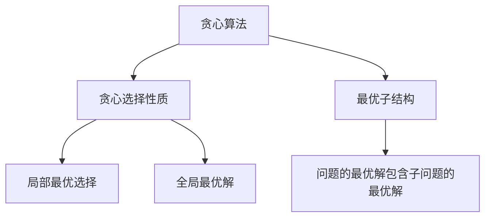
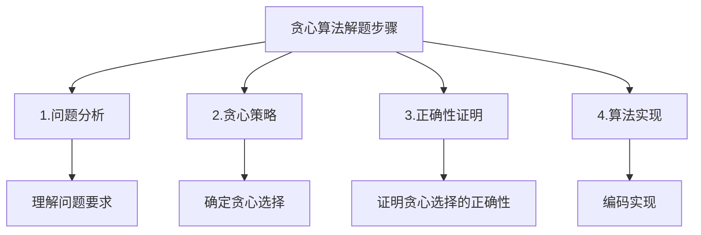
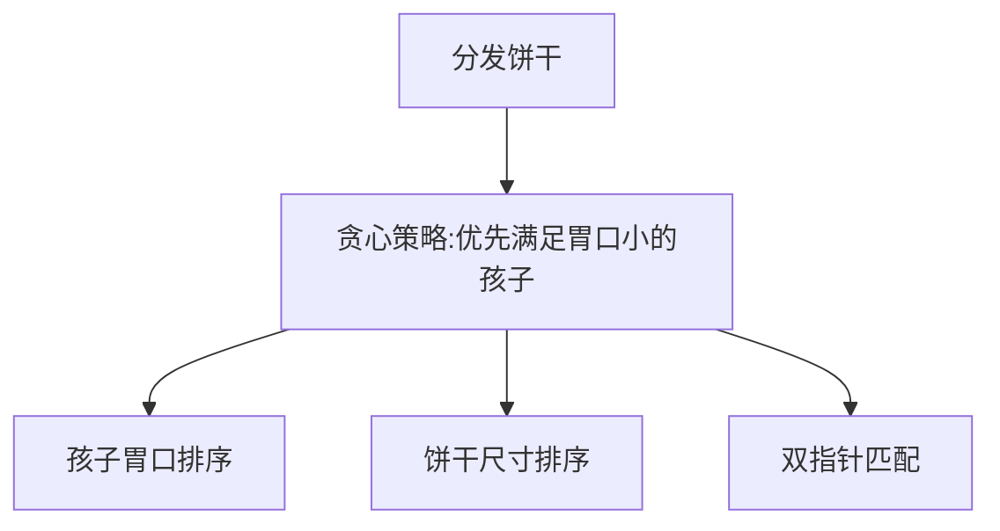
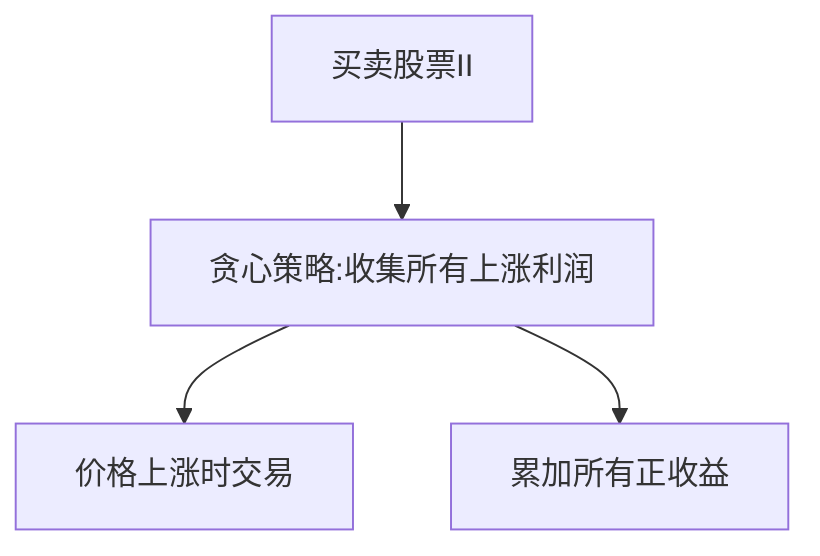
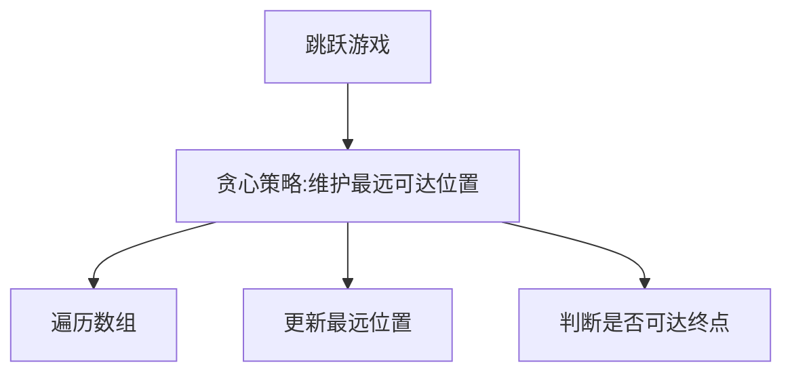
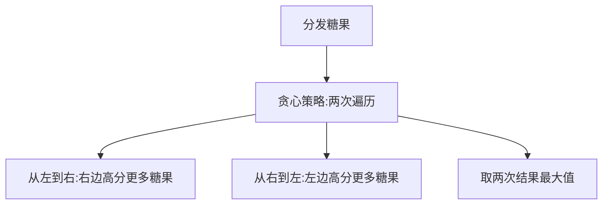
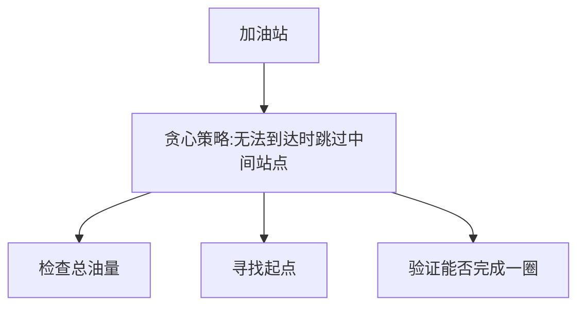
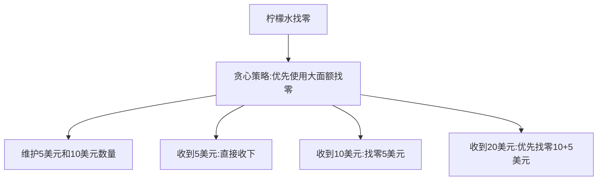
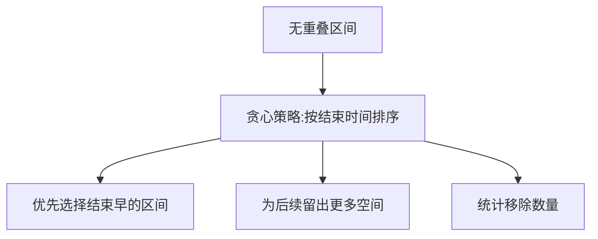

# 贪心算法

贪心算法是一种在每一步选择中都采取在当前状态下最好或最优的选择，从而希望导致结果是最好或最优的算法。贪心算法在有最优子结构的问题中尤为有效。

## 贪心算法的基本概念



### 贪心选择性质

所求问题的整体最优解可以通过一系列局部最优的选择，即贪心选择来达到。

### 最优子结构

问题的最优解包含其子问题的最优解。

## 贪心算法的解题步骤



1. **问题分析**：理解问题的要求和约束条件
2. **贪心策略**：确定贪心选择的策略
3. **正确性证明**：证明贪心选择能够得到全局最优解
4. **算法实现**：根据贪心策略编码实现

## 经典贪心算法题详解

### 1. 分发饼干（Assign Cookies）

**题目描述**：假设你是一位很棒的家长，想要给你的孩子们一些小饼干。每个孩子最多只能给一块饼干。对每个孩子 i，都有一个胃口值 g[i]，这是能让孩子们满足胃口的饼干的最小尺寸；每块饼干 j，都有一个尺寸 s[j] 。如果 s[j] >= g[i]，我们可以将这个饼干 j 分配给孩子 i。目标是尽可能满足越多数量的孩子，并输出这个最大数值。

**解题思路**：
- 贪心策略：优先满足胃口小的孩子
- 将孩子胃口和饼干尺寸分别排序
- 用双指针技术匹配孩子和饼干



```javascript
function findContentChildren(g, s) {
  // 排序
  g.sort((a, b) => a - b);
  s.sort((a, b) => a - b);
  
  let child = 0;  // 孩子指针
  let cookie = 0; // 饼干指针
  
  // 尝试满足每个孩子
  while (child < g.length && cookie < s.length) {
    // 如果当前饼干能满足当前孩子
    if (s[cookie] >= g[child]) {
      child++;  // 满足了一个孩子
    }
    cookie++;  // 尝试下一块饼干
  }
  
  return child;
}
// 时间复杂度：O(m log m + n log n)
// 空间复杂度：O(1)
```

### 2. 买卖股票的最佳时机 II（Best Time to Buy and Sell Stock II）

**题目描述**：给你一个整数数组 prices ，其中 prices[i] 表示某支股票第 i 天的价格。在每一天，你可以决定是否购买和/或出售股票。你在任何时候最多只能持有 一股 股票。你也可以先购买，然后在同一天出售。返回你能获得的最大利润。

**解题思路**：
- 贪心策略：收集所有上涨日的利润
- 只要第二天价格比今天高，就在今天买入明天卖出



```javascript
function maxProfit(prices) {
  let maxProfit = 0;
  
  // 遍历价格数组，收集所有上涨的利润
  for (let i = 1; i < prices.length; i++) {
    // 如果今天价格比昨天高，就累加利润
    if (prices[i] > prices[i - 1]) {
      maxProfit += prices[i] - prices[i - 1];
    }
  }
  
  return maxProfit;
}
// 时间复杂度：O(n)
// 空间复杂度：O(1)
```

### 3. 跳跃游戏（Jump Game）

**题目描述**：给定一个非负整数数组 nums ，你最初位于数组的第一个下标。数组中的每个元素代表你在该位置可以跳跃的最大长度。判断你是否能够到达最后一个下标。

**解题思路**：
- 贪心策略：维护能到达的最远位置
- 遍历数组，更新能到达的最远位置
- 如果最远位置大于等于最后一个下标，则能到达



```javascript
function canJump(nums) {
  let maxReach = 0;  // 能到达的最远位置
  
  for (let i = 0; i < nums.length; i++) {
    // 如果当前位置不可达，直接返回false
    if (i > maxReach) {
      return false;
    }
    
    // 更新能到达的最远位置
    maxReach = Math.max(maxReach, i + nums[i]);
    
    // 如果已经能到达最后一个位置，提前返回
    if (maxReach >= nums.length - 1) {
      return true;
    }
  }
  
  return false;
}
// 时间复杂度：O(n)
// 空间复杂度：O(1)
```

### 4. 分发糖果（Candy）

**题目描述**：n 个孩子站成一排。给你一个整数数组 ratings 表示每个孩子的评分。你需要按照以下要求，给这些孩子分发糖果：每个孩子至少分配到 1 个糖果；相邻两个孩子评分更高的孩子会获得更多的糖果。请你给每个孩子分发糖果，计算并返回需要准备的最少糖果数目。

**解题思路**：
- 贪心策略：两次遍历
- 从左到右遍历：确保右边评分高的孩子比左边获得更多糖果
- 从右到左遍历：确保左边评分高的孩子比右边获得更多糖果
- 取两次遍历结果的最大值



```javascript
function candy(ratings) {
  const n = ratings.length;
  const candies = Array(n).fill(1);  // 每个孩子至少1个糖果
  
  // 从左到右遍历
  for (let i = 1; i < n; i++) {
    if (ratings[i] > ratings[i - 1]) {
      candies[i] = candies[i - 1] + 1;
    }
  }
  
  // 从右到左遍历
  for (let i = n - 2; i >= 0; i--) {
    if (ratings[i] > ratings[i + 1]) {
      candies[i] = Math.max(candies[i], candies[i + 1] + 1);
    }
  }
  
  // 计算总糖果数
  return candies.reduce((sum, candy) => sum + candy, 0);
}
// 时间复杂度：O(n)
// 空间复杂度：O(n)
```

### 5. 加油站（Gas Station）

**题目描述**：在一条环路上有 n 个加油站，其中第 i 个加油站有汽油 gas[i] 升。你有一辆油箱容量无限的汽车，从第 i 个加油站开往第 i+1 个加油站需要消耗汽油 cost[i] 升。你从其中的一个加油站出发，开始时油箱为空。给定两个整数数组 gas 和 cost ，如果你可以按顺序绕环路行驶一周，则返回出发时加油站的编号，否则返回 -1 。如果存在解，则保证它是唯一的。

**解题思路**：
- 贪心策略：如果从站点 i 出发无法到达站点 j，那么从 i 和 j 之间的任何站点出发都无法到达 j
- 先检查总油量是否足够行驶一周
- 使用贪心算法找到合适的起点



```javascript
function canCompleteCircuit(gas, cost) {
  const n = gas.length;
  let totalGas = 0;
  let totalCost = 0;
  let currentGas = 0;
  let start = 0;
  
  // 计算总油量和总消耗
  for (let i = 0; i < n; i++) {
    totalGas += gas[i];
    totalCost += cost[i];
    currentGas += gas[i] - cost[i];
    
    // 如果当前油量为负，说明无法从start到达i+1
    // 重新选择起点为i+1
    if (currentGas < 0) {
      start = i + 1;
      currentGas = 0;
    }
  }
  
  // 如果总油量小于总消耗，无法完成一圈
  return totalGas >= totalCost ? start : -1;
}
// 时间复杂度：O(n)
// 空间复杂度：O(1)
```

### 6. 柠檬水找零（Lemonade Change）

**题目描述**：在柠檬水摊上，每一杯柠檬水的售价为 5 美元。顾客排队购买你的产品，按账单 bills 支付的顺序一次购买一杯。每位顾客只买一杯柠檬水，然后向你付 5 美元、10 美元或 20 美元。你必须给每个顾客正确找零，也就是说净交易是每位顾客向你支付 5 美元。注意，一开始你手头没有任何零钱。给你一个整数数组 bills ，其中 bills[i] 是第 i 位顾客付的账。如果你能给每位顾客正确找零，返回 true ，否则返回 false 。

**解题思路**：
- 贪心策略：找零时优先使用大面额纸币
- 维护5美元和10美元纸币的数量
- 根据顾客支付的金额进行相应的找零操作



```javascript
function lemonadeChange(bills) {
  let five = 0;  // 5美元纸币数量
  let ten = 0;   // 10美元纸币数量
  
  for (const bill of bills) {
    if (bill === 5) {
      // 收到5美元，无需找零
      five++;
    } else if (bill === 10) {
      // 收到10美元，需要找零5美元
      if (five === 0) return false;
      five--;
      ten++;
    } else {
      // 收到20美元，需要找零15美元
      // 贪心策略：优先使用10美元+5美元找零
      if (ten > 0 && five > 0) {
        ten--;
        five--;
      } else if (five >= 3) {
        // 如果没有10美元，使用3张5美元
        five -= 3;
      } else {
        // 无法找零
        return false;
      }
    }
  }
  
  return true;
}
// 时间复杂度：O(n)
// 空间复杂度：O(1)
```

### 7. 无重叠区间（Non-overlapping Intervals）

**题目描述**：给定一个区间的集合 intervals ，其中 intervals[i] = [starti, endi] 。返回需要移除区间的最小数量，使剩余区间互不重叠。

**解题思路**：
- 贪心策略：按区间结束时间排序，优先选择结束时间早的区间
- 这样可以为后续区间留出更多空间
- 统计需要移除的区间数量



```javascript
function eraseOverlapIntervals(intervals) {
  if (intervals.length === 0) return 0;
  
  // 按结束时间排序
  intervals.sort((a, b) => a[1] - b[1]);
  
  let count = 0;
  let end = intervals[0][1];  // 当前选择区间的结束时间
  
  // 遍历剩余区间
  for (let i = 1; i < intervals.length; i++) {
    // 如果当前区间与前一个区间重叠
    if (intervals[i][0] < end) {
      count++;  // 移除当前区间
    } else {
      // 更新结束时间
      end = intervals[i][1];
    }
  }
  
  return count;
}
// 时间复杂度：O(n log n)
// 空间复杂度：O(1)
```

## 贪心算法总结

贪心算法是算法面试中的重要考点，主要考察点包括：

1. **贪心策略**：能够识别问题中的贪心选择策略
2. **正确性证明**：理解贪心选择为什么能得到最优解
3. **实现技巧**：掌握贪心算法的实现方法
4. **问题建模**：将实际问题抽象为贪心算法模型
5. **复杂度分析**：正确分析贪心算法的时间和空间复杂度

贪心算法适用于以下类型的问题：
- 最优化问题
- 具有贪心选择性质和最优子结构
- 可以通过局部最优选择达到全局最优解

掌握这些核心思想和经典题目，能够帮助我们在面试中快速解决贪心算法相关的算法问题。