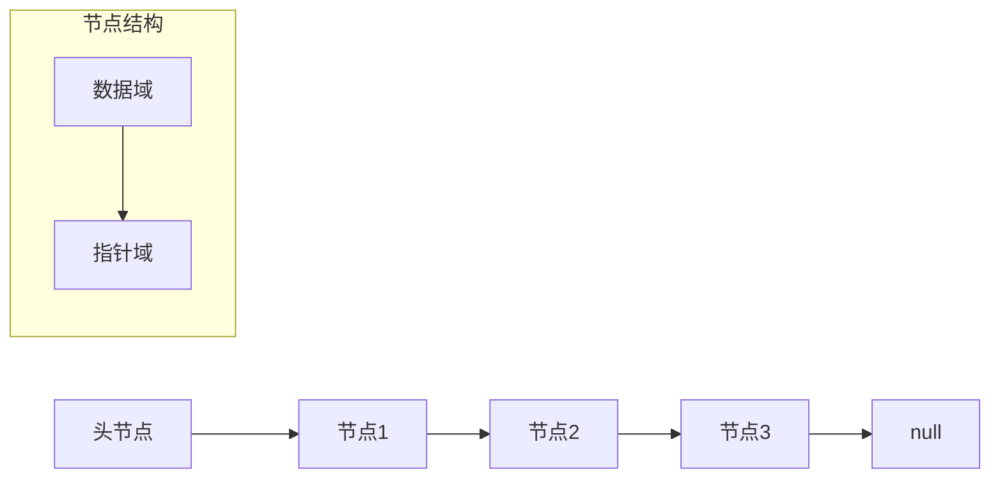
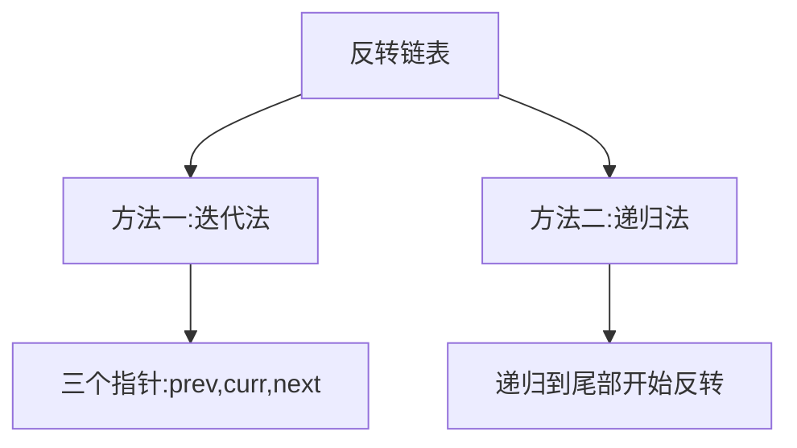
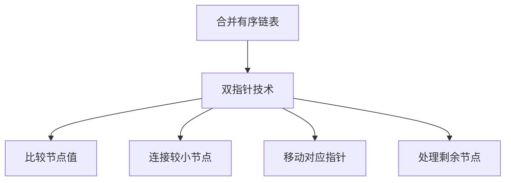
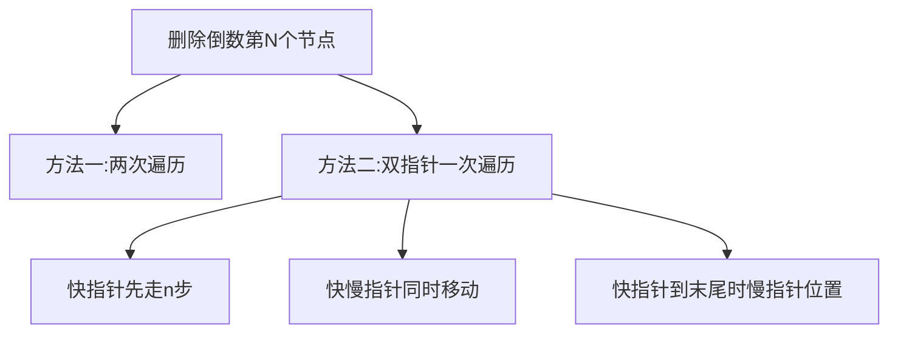
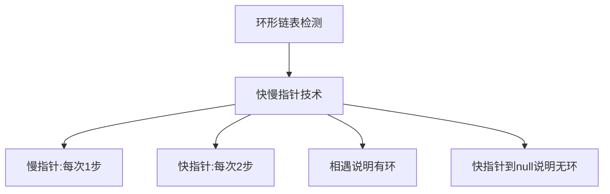
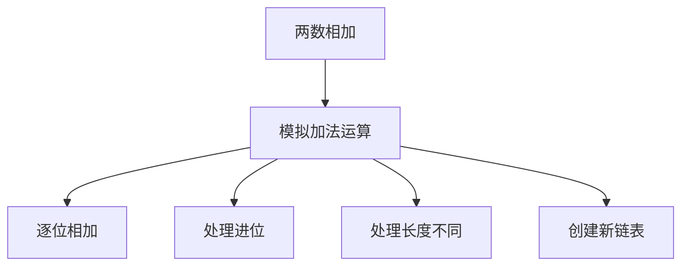
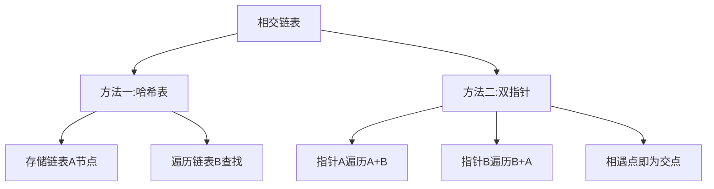

# 链表相关算法

链表通过指针连接各个节点，具有以下特点：
- 元素在内存中非连续存储
- 插入和删除操作效率高
- 不支持随机访问，需要从头节点开始遍历

## 链表的基本结构



```javascript
// 链表节点定义
class ListNode {
  constructor(val, next) {
    this.val = (val === undefined ? 0 : val);
    this.next = (next === undefined ? null : next);
  }
}
```

## 链表的基本操作

```mermaid
graph TD
    A[链表操作] --> B[遍历: O(n)]
    A --> C[搜索: O(n)]
    A --> D[插入: O(1)]
    A --> E[删除: O(1)]
```

1. **遍历链表**：从头节点开始，通过指针逐个访问节点
2. **搜索元素**：从头节点开始遍历，直到找到目标元素
3. **插入元素**：修改相关节点的指针，时间复杂度O(1)
4. **删除元素**：修改相关节点的指针，时间复杂度O(1)

## 经典链表算法题详解

### 1. 反转链表（Reverse Linked List）

**题目描述**：给你单链表的头节点 head ，请你反转链表，并返回反转后的链表。

**解题思路**：
- 方法一：迭代法，使用三个指针逐个反转
- 方法二：递归法，从后往前反转



```javascript
// 方法一：迭代法
function reverseListIterative(head) {
  let prev = null;
  let curr = head;
  
  while (curr !== null) {
    const next = curr.next;  // 保存下一个节点
    curr.next = prev;        // 反转当前节点指针
    prev = curr;             // 移动prev指针
    curr = next;             // 移动curr指针
  }
  
  return prev;  // prev成为新的头节点
}
// 时间复杂度：O(n)
// 空间复杂度：O(1)

// 方法二：递归法
function reverseListRecursive(head) {
  // 基础情况：空链表或只有一个节点
  if (head === null || head.next === null) {
    return head;
  }
  
  // 递归反转后面的链表
  const newHead = reverseListRecursive(head.next);
  
  // 反转当前节点和下一个节点的连接
  head.next.next = head;
  head.next = null;
  
  return newHead;
}
// 时间复杂度：O(n)
// 空间复杂度：O(n) - 递归调用栈
```

### 2. 合并两个有序链表（Merge Two Sorted Lists）

**题目描述**：将两个升序链表合并为一个新的升序链表并返回。新链表是通过拼接给定的两个链表的所有节点组成的。

**解题思路**：
- 使用双指针技术，比较两个链表当前节点的值
- 将较小的节点连接到结果链表中
- 处理剩余节点



```javascript
function mergeTwoLists(list1, list2) {
  // 创建虚拟头节点，简化边界处理
  const dummy = new ListNode(0);
  let current = dummy;
  
  // 比较两个链表的节点
  while (list1 !== null && list2 !== null) {
    if (list1.val <= list2.val) {
      current.next = list1;
      list1 = list1.next;
    } else {
      current.next = list2;
      list2 = list2.next;
    }
    current = current.next;
  }
  
  // 连接剩余节点
  current.next = list1 !== null ? list1 : list2;
  
  return dummy.next;
}
// 时间复杂度：O(m + n)
// 空间复杂度：O(1)
```

### 3. 删除链表的倒数第N个节点（Remove Nth Node From End of List）

**题目描述**：给你一个链表，删除链表的倒数第 n 个结点，并且返回链表的头结点。

**解题思路**：
- 方法一：两次遍历，第一次计算链表长度
- 方法二：一次遍历，使用双指针技术



```javascript
// 方法一：两次遍历
function removeNthFromEndTwoPass(head, n) {
  // 第一次遍历：计算链表长度
  let length = 0;
  let current = head;
  while (current !== null) {
    length++;
    current = current.next;
  }
  
  // 计算要删除节点的正数位置
  const targetIndex = length - n;
  
  // 特殊情况：删除头节点
  if (targetIndex === 0) {
    return head.next;
  }
  
  // 第二次遍历：找到要删除节点的前一个节点
  current = head;
  for (let i = 0; i < targetIndex - 1; i++) {
    current = current.next;
  }
  
  // 删除节点
  current.next = current.next.next;
  
  return head;
}
// 时间复杂度：O(L)，L为链表长度
// 空间复杂度：O(1)

// 方法二：一次遍历（双指针）
function removeNthFromEnd(head, n) {
  // 创建虚拟头节点，简化边界处理
  const dummy = new ListNode(0);
  dummy.next = head;
  
  let fast = dummy;
  let slow = dummy;
  
  // 快指针先走n+1步
  for (let i = 0; i <= n; i++) {
    fast = fast.next;
  }
  
  // 快慢指针同时移动，直到快指针到达末尾
  while (fast !== null) {
    fast = fast.next;
    slow = slow.next;
  }
  
  // 删除倒数第n个节点
  slow.next = slow.next.next;
  
  return dummy.next;
}
// 时间复杂度：O(L)
// 空间复杂度：O(1)
```

### 4. 环形链表检测（Linked List Cycle）

**题目描述**：给你一个链表的头节点 head ，判断链表中是否有环。

**解题思路**：
- 使用快慢指针技术（Floyd判圈算法）
- 快指针每次走两步，慢指针每次走一步
- 如果有环，快指针最终会追上慢指针



```javascript
function hasCycle(head) {
  if (head === null || head.next === null) {
    return false;
  }
  
  let slow = head;
  let fast = head;
  
  // 快慢指针移动
  while (fast !== null && fast.next !== null) {
    slow = slow.next;        // 慢指针每次走1步
    fast = fast.next.next;   // 快指针每次走2步
    
    // 如果快慢指针相遇，说明有环
    if (slow === fast) {
      return true;
    }
  }
  
  return false;
}
// 时间复杂度：O(n)
// 空间复杂度：O(1)
```

### 5. 两数相加（Add Two Numbers）

**题目描述**：给你两个非空的链表，表示两个非负的整数。它们每位数字都是按照逆序的方式存储的，并且每个节点只能存储一位数字。请你将两个数相加，并以相同形式返回一个表示和的链表。

**解题思路**：
- 模拟加法运算过程
- 注意处理进位
- 注意处理两个链表长度不同的情况



```javascript
function addTwoNumbers(l1, l2) {
  const dummy = new ListNode(0);
  let current = dummy;
  let carry = 0;  // 进位
  
  // 遍历两个链表
  while (l1 !== null || l2 !== null) {
    // 获取当前位的值
    const val1 = l1 !== null ? l1.val : 0;
    const val2 = l2 !== null ? l2.val : 0;
    
    // 计算当前位的和
    const sum = val1 + val2 + carry;
    carry = Math.floor(sum / 10);  // 计算进位
    const digit = sum % 10;        // 计算当前位的数字
    
    // 创建新节点
    current.next = new ListNode(digit);
    current = current.next;
    
    // 移动指针
    if (l1 !== null) l1 = l1.next;
    if (l2 !== null) l2 = l2.next;
  }
  
  // 处理最后的进位
  if (carry > 0) {
    current.next = new ListNode(carry);
  }
  
  return dummy.next;
}
// 时间复杂度：O(max(m, n))
// 空间复杂度：O(max(m, n))
```

### 6. 相交链表（Intersection of Two Linked Lists）

**题目描述**：给你两个单链表的头节点 headA 和 headB ，请你找出并返回两个单链表相交的起始节点。如果两个链表不存在相交节点，返回 null 。

**解题思路**：
- 方法一：使用哈希表记录一个链表的所有节点
- 方法二：双指针法，让两个指针分别遍历两个链表



```javascript
// 方法一：哈希表
function getIntersectionNodeHash(headA, headB) {
  const visited = new Set();
  
  // 将链表A的所有节点存入哈希表
  let current = headA;
  while (current !== null) {
    visited.add(current);
    current = current.next;
  }
  
  // 遍历链表B，查找是否存在于哈希表中
  current = headB;
  while (current !== null) {
    if (visited.has(current)) {
      return current;
    }
    current = current.next;
  }
  
  return null;
}
// 时间复杂度：O(m + n)
// 空间复杂度：O(m)

// 方法二：双指针法
function getIntersectionNode(headA, headB) {
  if (headA === null || headB === null) {
    return null;
  }
  
  let pointerA = headA;
  let pointerB = headB;
  
  // 当两个指针相遇时，要么是交点，要么都是null
  while (pointerA !== pointerB) {
    // 如果pointerA到达末尾，则从headB开始
    pointerA = pointerA === null ? headB : pointerA.next;
    // 如果pointerB到达末尾，则从headA开始
    pointerB = pointerB === null ? headA : pointerB.next;
  }
  
  return pointerA;
}
// 时间复杂度：O(m + n)
// 空间复杂度：O(1)
```

## 链表算法总结

链表相关算法在前端面试中也是高频考点，主要考察点包括：

1. **指针操作**：熟练掌握链表节点之间的指针变换
2. **双指针技术**：解决链表中的查找、删除等问题
3. **虚拟头节点**：简化边界条件处理
4. **递归思想**：处理链表问题的另一种思路
5. **边界处理**：正确处理空链表、单节点等特殊情况

掌握这些核心思想和经典题目，能够帮助我们在面试中快速解决链表相关的算法问题。
